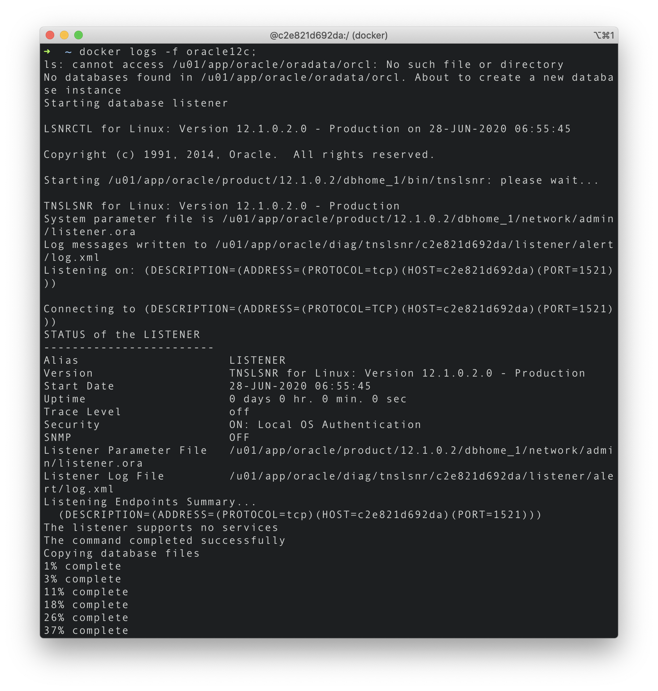
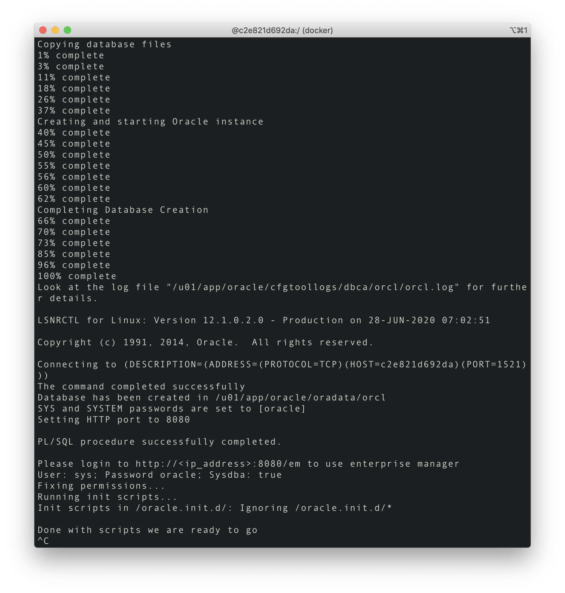

# Installation of Oracle Database 12c on Mac

Download an [existing Database 12c Image](https://hub.docker.com/r/absolutapps/oracle-12c-ee) public available on Docker Hub.

> What is Docker? [This video](https://www.youtube.com/watch?v=tPjpcsgxgWc) and [this video](https://www.youtube.com/watch?v=chnCcGCTyBg) may help you get knowing of Docker.

<br>

### Pull image from Docker Hub

```
docker pull absolutapps/oracle-12c-ee
```

<br>

### Run image with options

> A virtual container is derived from the image. An image developer can define image defaults related to: detached or foreground running, container identification, network settings, runtime constraints on CPU and memory.

> About `docker run`, see [here](https://docs.docker.com/engine/reference/run/).

```
docker run -d --name ${container_name} --privileged -v /${path}:/u01/app/oracle -p 8080:8080 -p 1521:1521 absolutapps/oracle-12c-ee
```

<br>

For example, you may run the below command and the current working directory is `/Users/user`.

```
docker run -d --name oracle12c --privileged -v /oracle:/u01/app/oracle -p 8080:8080 -p 1521:1521 absolutapps/oracle-12c-ee
```

In this case database settings and data will be saved to `/Users/user/oracle` folder.

> `/Users/user/oracle` stands for `/u01/app/oracle`.

Ports will be exposed either to localhost or boot2docker container (MacOs and Win).

> If you have any issue regarding the path option, [this Stackoverflow page](https://stackoverflow.com/questions/45122459/docker-mounts-denied-the-paths-are-not-shared-from-os-x-and-are-not-known) may help.

<br>

### Install Oracle Database on Docker

> Fetch the logs of the container. This may take time.

```
docker logs -f oracle12c
```





<br>

### Start and execute Container

If not started,

```
docker start oracle12c
```

<br>

Execute container.

```
docker exec -it oracle12c bash
```

<br>

Get the list of containers executed, if needed.

```
docker container ls
```

> Has no difference with `docker ps`, but is of newer version.

<br>

Get the list of images downloaded, if needed.

```
docker image ls
```

<br>

If you want to stop the container,

```
docker stop oracle12c
```


> To see more Docker commands, click [here](https://docs.docker.com/engine/reference/run/).

<br>

### Print SID and Run SQLPLUS

Get the SID(System Identifier) of Oracle database.

> `c2e821d692da` below is Docker container ID.

```
[root@c2e821d692da /]# echo $ORACLE_SID
```

Run SQLPLUS.

```
[root@c2e821d692da /]# sqlplus ${user}/${password}@//localhost:1521/${SID}
```

For example,

> System user name is `system` or `sys`. The password `oracle`, SID `orcl`, if not updated.

```
[root@c2e821d692da /]# sqlplus system/oracle@//localhost:1521/orcl
```

<br>

### Create a tablespace

For example,

```
CREATE TABLESPACE tablespace_name DATAFILE '/u01/app/oracle/oradata/orcl/MY_DATA01.dbf' SIZE 30G AUTOEXTEND ON;
```

See all tablespaces.

```
SELECT * FROM dba_tablespaces;
```

Create user.

```
CREATE USER user_name IDENTIFIED BY 111111
DEFAULT TABLESPACE tablespace_name
PROFILE DEFAULT
QUOTA UNLIMITED ON tablespace_name;
```

Grant all privileges.

```
GRANT connect, RESOURCE, DBA TO user_name;
```

<br>

---

### References

- [Docker Installation of Oracle Database 12c on Mac](https://oraclespin.com/2018/03/30/docker-installation-of-oracle-database-12c-on-mac/)
- [docker docs Command-line reference](https://docs.docker.com/engine/reference/run/)
