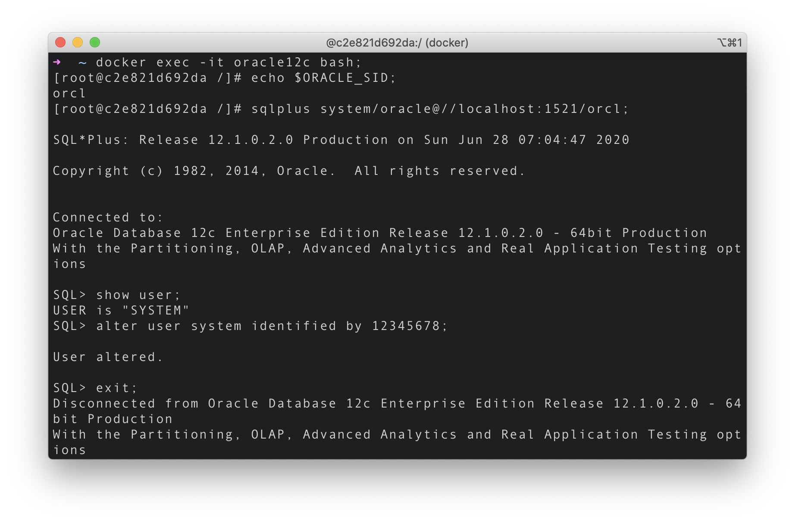

# Installation of Oracle Database 12c on Mac

Download an [existing Database 12c Image](https://hub.docker.com/r/absolutapps/oracle-12c-ee) public available on Docker Hub.

### Pull image

```
docker pull absolutapps/oracle-12c-ee
```

### Run image with options

```
docker run -d --name oracle12c
  --privileged -v /${path}:/u01/app/oracle
  -p 8080:8080 -p 1521:1521 absolutapps/oracle-12c-ee
```

For example, you run the below command and the current working directory is `/Users/user`.

```
docker run -d --name oracle12c
  --privileged -v /oracle:/u01/app/oracle
  -p 8080:8080 -p 1521:1521 absolutapps/oracle-12c-ee
```

In this case database settings and data will be saved to `/Users/user/oracle` folder and ports will be exposed either to localhost or boot2docker container (MacOs and Win).

> If you have any issue regarding the path option, [this Stackoverflow page](https://stackoverflow.com/questions/45122459/docker-mounts-denied-the-paths-are-not-shared-from-os-x-and-are-not-known) may help.

<br>

### Install Oracle Database on Docker

This may take time.

```
docker logs -f oracle12c
```


<br>

### Start and Execute Container

If not started,

```
docker start oracle12c
```

Execute container.

```
docker exec -it oracle12c bash
```

Get the list of containers executed.

```
docker ps
```

the blow has no difference with `docker ps`, but newer version.

```
docker container ls
```

Get the list of images downloaded;

```
docker image ls
```

If you want to stop the container,

```
docker stop oracle12c
```



> To see more Docker commands, click [here](https://docs.docker.com/engine/reference/run/).

<br>

### Print SID and Run SQLPLUS

Get SID. `c2e821d692da` below is Docker container ID.

```
[root@c2e821d692da /]# echo $ORACLE_SID
```

```
[root@c2e821d692da /]# sqlplus system/oracle@//localhost:1521/orcl
```

<br>

### Create a tablespace

For example,

```
CREATE TABLESPACE tablespace_name DATAFILE '/u01/app/oracle/oradata/orcl/MY_DATA01.dbf' SIZE 30G AUTOEXTEND ON;
```

See all tablespaces.

```
SELECT * FROM dba_tablespaces;
```

Create user.

```
CREATE USER user_name IDENTIFIED BY 111111
DEFAULT TABLESPACE tablespace_name
PROFILE DEFAULT
QUOTA UNLIMITED ON tablespace_name;
```

Grant all.

```
GRANT connect, RESOURCE, DBA TO user_name;
```

<br>

---

### References

- [Docker Installation of Oracle Database 12c on Mac](https://oraclespin.com/2018/03/30/docker-installation-of-oracle-database-12c-on-mac/)
- [docker docs Command-line reference](https://docs.docker.com/engine/reference/run/)
