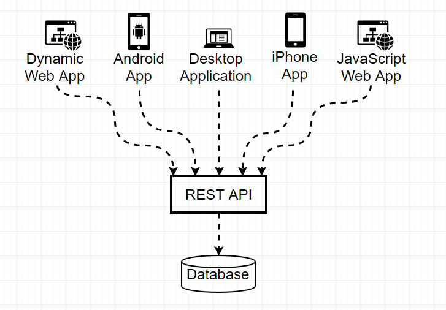
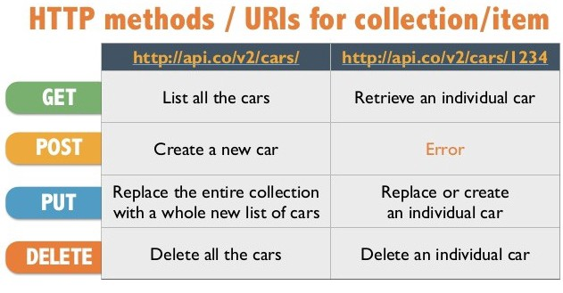
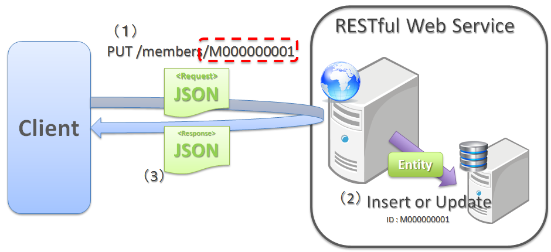

# REST, REST API and RESTful Web Services

> This markdown page is Korean/English mixed entirely depending on my personal need, not readers' possible expectation.

<br>

## What is REST ?

REST stands for <b>RE</b>presentational <b>S</b>tate <b>T</b>ransfer.

It is an architectural style for distributed hypermedia systems like [World Wide Web](https://ko.wikipedia.org/wiki/%EC%9B%94%EB%93%9C_%EC%99%80%EC%9D%B4%EB%93%9C_%EC%9B%B9). The idea is that simple HTTP is used to make calls between machines.

REST has it’s own [6 guiding constraints](https://restfulapi.net/rest-architectural-constraints/) which must be satisfied if an interface needs to be referred as <strong>RESTful</strong>.

It was first presented by Roy Fielding in 2000 in his famous [dissertation](https://www.ics.uci.edu/~fielding/pubs/dissertation/rest_arch_style.htm).

<br>

## Architectural Constraints

### 1. Uniform interface

API의 인터페이스를 결정하고, 정해진 인터페이스를 정확하게 따라야 한다. 서버 내의 각 리소스에 접근할 수 있는 URI는 오직 1 개여야 하며, 연관 데이터에 추가적으로 접근할 수 있는 방법을 제공해야 한다.

하나의 리소스가 너무 많은 데이터를 갖고있어서는 안된다. 관련 데이터가 필요하면 언제든 그 데이터에 접근할 수 있는 URI 링크를 포함해야 한다.

Also, the resource representations across the system should follow specific guidelines such as naming conventions, link formats, or data format (XML or/and JSON).

All resources should be accessible through a common approach such as HTTP GET and similarly modified using a consistent approach.

<br>

### 2. Client–server

Client application and server application MUST be able to evolve separately without any dependency on each other. A client should know only resource URIs, and that’s all. Servers and clients may also be replaced and developed independently, as long as the interface between them is not altered.

<br>

### 3. Stateless

Make all client-server interactions stateless. The server will not store anything about the latest HTTP request the client made. It will treat every request as new. No session, no history.

If the client application needs to be a stateful application for the end-user, where user logs in once and do other authorized operations after that, then each request from the client should contain all the information necessary to service the request – including authentication and authorization details. The client is responsible for managing the state of the application.

<br>

### 4. Cacheable

Resources MUST declare themselves cacheable. Caching can be implemented on the server or client-side.

Caching brings performance improvement for the client-side and better scope for scalability for a server because the load has reduced.

<br>

### 5. Layered system

REST allows you to use a layered system architecture where you deploy the APIs on server A, and store data on server B and authenticate requests in Server C, for example. A client cannot ordinarily tell whether it is connected directly to the end server, or to an intermediary along the way.

<br>

### 6. Code on demand (optional)

When you need to, you are free to return executable code to support a part of your application, e.g., clients may call your API to get a UI widget rendering code. It is permitted.

<br>

## REST Resource Naming Guide

REST APIs use [Uniform Resource Identifiers (URIs)](https://en.wikipedia.org/wiki/Uniform_Resource_Identifier) to address resources. REST API designers should create URIs that convey a REST API’s resource model to its potential client developers.

#### 1. A resource can be a singleton or a collection.

For example, `customers` is a collection resource and `customer` is a singleton.

- `customers` collection resource using the URI:

`/customers`

- a single `customer` resource using the URI:

`/customers/{customerId}`

#### 2. A resource may contain sub-collection resources also.

- `accounts` of a particular `customer`

  `/customers/{customerId}/accounts`

- a singleton resource `account`

`/customers/{customerId}/accounts/{accountId}`

<br>

## REST Resource Naming Best Practices

### 1. Use nouns to represent resources

RESTful URI should refer to a resource that is a thing (noun) instead of referring to an action (verb).

For examples,

```
/device-management/managed-devices
/device-management/managed-devices/{device-id}
/user-management/users/
/user-management/users/{id}
```

For more clarity, let’s divide the resource archetypes into four categories (document, collection, store and controller). Resist the temptation to design resources that are hybrids of more than one archetype.

<br>

#### document

Use “singular” name to denote document resource archetype.

```
/device-management/managed-devices/{device-id}
/user-management/users/{id}
/user-management/users/admin
```

#### collection

Use “plural” name to denote collection resource archetype.

```
/device-management/managed-devices
/user-management/users
/user-management/users/{id}/accounts
```

#### store

A store resource lets an API client put resources in, get them back out, and decide when to delete them. Use “plural” name to denote store resource archetype.

```
/song-management/users/{id}/playlists
```

#### controller

A controller resource models a procedural concept. Controller resources are like executable functions, with parameters and return values; inputs and outputs.

Use “verb” to denote controller archetype.

```
/cart-management/users/{id}/cart/checkout
/song-management/users/{id}/playlist/play
```

<br>

### 2. Consistency

You may implement below design hints to achieve consistency:

#### Use forward slash `/` to indicate hierarchical relationships

```
/device-management
/device-management/managed-devices
/device-management/managed-devices/{id}
/device-management/managed-devices/{id}/scripts
/device-management/managed-devices/{id}/scripts/{id}
```

#### Do not use trailing forward slash `/` in URIs

A forward slash `/` adds no semantic value and may cause confusion. It’s better to drop them completely.

- Not good

```
/device-management/managed-devices/
```

- Good

```
/device-management/managed-devices
```

#### Use hyphens `-` to improve the readability

- Less readable

```
/inventory-management/managedEntities/{id}/installScriptLocation

```

- More readable

```
/inventory-management/managed-entities/{id}/install-script-location

```

#### Do not use underscores

Depending on the application’s font, it’s possible that the underscore `_` character can either get partially obscured or completely hidden in some browsers or screens. To avoid this confusion, use hyphens `-` instead of underscores `_`.

- Less readable

```
/inventory_management/managed_entities/{id}/install_script_location
```

- More readable

```
/inventory-management/managed-entities/{id}/install-script-location
```

#### Use lowercase letters in URIs

When convenient, lowercase letters should be consistently preferred in URI paths.

> If you have time, read [this](https://www.ietf.org/rfc/rfc3986.txt)

```
http://api.example.org/my-folder/my-doc  //1
HTTP://API.EXAMPLE.ORG/my-folder/my-doc  //2
http://api.example.org/My-Folder/my-doc  //3
```

In above examples, 1 and 2 are same but 3 is not as it uses My-Folder in capital letters.

#### Do not use file extentions

File extensions look bad and do not add any advantage. Removing them decreases the length of URIs as well. No reason to keep them.

##### If you want to highlight the media type of API

If you want to highlight the media type of API using file extenstion then you should rely on the media type, as communicated through the `Content-Type` header, to determine how to process the body’s content.

- Correct URI

```
/device-management/managed-devices
```

- Do not use like below

```
/device-management/managed-devices.xml
```

<br>

### 3. Never use CRUD function names in URIs

URIs should not be used to indicate that a CRUD function is performed. URIs should be used to uniquely identify resources and not any action upon them. HTTP request methods should be used to indicate which CRUD function is performed.

For examples,

```
HTTP GET /device-management/managed-devices  //Get all devices
HTTP POST /device-management/managed-devices  //Create new Device

HTTP GET /device-management/managed-devices/{id}  //Get device for given Id
HTTP PUT /device-management/managed-devices/{id}  //Update device for given Id
HTTP DELETE /device-management/managed-devices/{id}  //Delete device for given Id
```

<br>

### 4. Use query component to filter URI collection

Many times, you will come across requirements where you will need a collection of resources sorted, filtered or limited based on some certain resource attribute. For this, do not create new APIs.

Enable sorting, filtering and pagination capabilities in resource collection API and pass the input parameters as query parameters.

For examples,

```
/device-management/managed-devices
/device-management/managed-devices?region=USA
/device-management/managed-devices?region=USA&brand=XYZ
/device-management/managed-devices?region=USA&brand=XYZ&sort=installation-date
```

<br>

## Benefits of using REST Architecture

### Lightweight Web Services

The RESTful architecture was a reaction to the more heavy-weight SOAP-based standards. In REST web services, the emphasis is on simple point-to-point communication over HTTP using plain XML. In addition, RESTful permits many different data formats whereas SOAP only permits XML.

### Simplicity

One of the main reasons for REST popularity is the simplicity and ease of use, as it does an extension of native Web technologies such as HTTP.

### RESTful architecture is closer in design to the Web

RESTful is the architectural style of the web itself, so the developer with knowledge in web architecture will naturally develop in the RESTful architecture.

### Scalability

As RESTful forbids conversational state, which means we can scale very wide by adding additional server nodes behind a load balancer.

### Expose APIs as HTTP Services

When developers need the universal presence with minimum efforts, given the fact that RESTful APIs are exposed as HTTP Services, which is virtually present on almost all the platforms.

<br>

## REST API and RESTful Web Services

### What is API ?

An API(Application Programming Interface) serves as an interface between different software programs and facilitates their interaction, similar to the way the user interface facilitates interaction between humans and computers.

> For API basics, watch [this video](https://www.youtube.com/watch?v=s7wmiS2mSXY) that explains API.

<br>

### REST API



A REST API defines a set of functions which developers can perform requests and receive responses via HTTP protocol such as GET and POST.

RESTful applications use HTTP requests to post data (create or update), read data (e.g., make queries), and delete data. Thus, REST uses HTTP for all 4 CRUD (Create/Read/Update/Delete) operations.



> HTTP is HyperText Transfer Protocol. It is the underlying protocol used by the World Wide Web and this protocol defines how messages are formatted and transmitted, and what actions Web servers and browsers should take in response to various commands.

<br>

### RESTful Web Services

`RESTful` is typically used to refer to web services implementing REST architecture.



<br>

---

### References

- [restfulapi.net](https://restfulapi.net/)
- [What is REST?](https://www.codecademy.com/articles/what-is-rest)
- [Mastering REST Architecture — Introduction](https://medium.com/@ahmetozlu93/mastering-rest-architecture-introduction-28f7f2d67a7)
- [Mastering REST Architecture — REST Architecture Details](https://medium.com/@ahmetozlu93/mastering-rest-architecture-rest-architecture-details-e47ec659f6bc)
- [Mastering REST Architecture — REST API Details](https://medium.com/@ahmetozlu93/mastering-rest-architecture-rest-api-details-f560e4d93f2)
- [Mastering REST Architecture — Developing a REST API with Spring Boot Framework, Step#1: Creating the Project](https://medium.com/@ahmetozlu93/mastering-rest-architecture-developing-a-rest-api-with-spring-boot-framework-step-1-creating-d7796066862b)
- [Building a RESTful Web Service](https://spring.io/guides/gs/rest-service/)
- [Building REST services with Spring](https://spring.io/guides/tutorials/bookmarks/)
- [REST | wikipedia](https://ko.wikipedia.org/wiki/REST)
- [REST 아키텍처를 훌륭하게 적용하기 위한 몇 가지 디자인 팁](https://spoqa.github.io/2012/02/27/rest-introduction.html)
