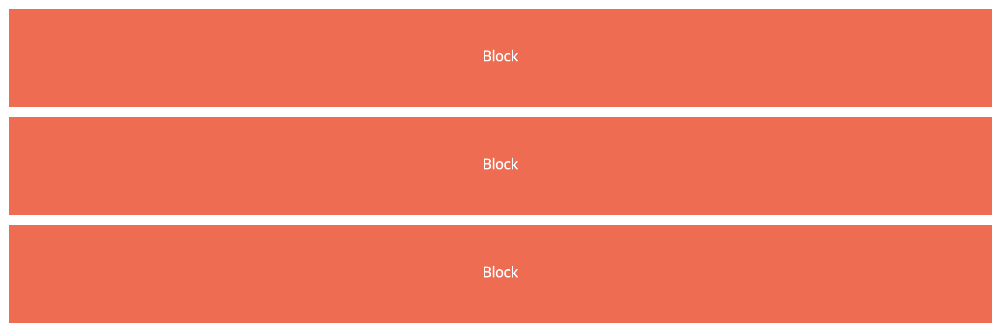
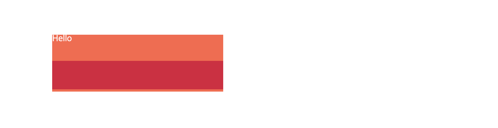

# 박스 모델(Box Model)

<br>

## 박스 트리(Box Tree)

웹 브라우저는 HTML 문서와 CSS 파일의 내용을 해석하여 캔버스에 그림을 그리듯 문서를 렌더링 합니다. 이 작업을 하기 위해서는 렌더링된 문서와 서식 구조를 나타내는 임시 구조물 같은 것을 형성해야 하는데, 이를 박스 트리(Box Tree)라고 합니다.

HTML 마크업에 따라 모든 요소들은 자신을 참조하는 박스(Box)를 생성하는데요, 이때 CSS에서 지정한 `display` 속성 값에 따라 박스의 타입(Type)이 결정됩니다. 또한, 이 속성 값에 따라 박스를 생성하지 않는 경우도 있습니다. HTML 요소들이 담고 있는 글자들은 박스 내부의 텍스트 노드(Text Node)를 형성합니다.

<br>

### Principal Box

하나의 엘리먼트가 여러 개의 박스들을 생성할 수 있는데, 그 중 하나의 박스는 반드시 최상위 박스, Principal Box가 됩니다. 예를 들어, `display: list-item` 속성 값을 가지는 요소는 최상위 박스와 그 하위의 자식 박스들을 생성합니다. 한편, `none`/`contents` 속성 값을 가지는 요소와 그 하위의 모든 요소들은 최상위 박스를 포함한 박스를 일절 생성하지 않습니다.

<br>

### Anonymous Box

Anonymous Box는 HTML 요소를 기반으로 하지 않는 박스입니다. HTML 요소를 기반으로 하지 않고 어떻게 박스가 생성될 수 있을까요? 자, 아래와 같이 텍스트만 담고 있는 HTML 요소가 있다고 상상해봅시다.

```html
<div class="box">
	Lorem Ipsum is simply dummy text of the printing and typesetting industry.
	Lorem Ipsum has been the industry's standard dummy text ever since the 1500s,
	when an unknown printer took a galley of type and scrambled it to make a type
	specimen book. It has survived not only five centuries, but also the leap into
	electronic typesetting, remaining essentially unchanged. It was popularised in
	the 1960s with the release of Letraset sheets containing Lorem Ipsum passages,
	and more recently with desktop publishing software like Aldus PageMaker
	including versions of Lorem Ipsum.
</div>
```

<br>

이 요소를 기반으로 하는 Flex 박스를 생성하려면 아래와 같은 CSS가 필요합니다.

```css
.box {
	display: flex;
}
```

원래 이 박스의 내부에는 텍스트 밖에 없기 때문에 하위 박스가 존재하지 않아야 합니다. 하지만, 이 박스는 Flex 박스이기 때문에 내부의 텍스트 하나 하나를 담고 있는 Anonymous Box들이 생겨납니다. 그리고 이 Anonymous Box들이 Flex 아이템의 역할을 하면서 Flex 박스의 정렬 규칙에 따라 내부 텍스트들을 정렬할 수 있게 됩니다.

<br>

> Flex Box에 대한 자세한 내용은 [이 블로그 글](https://heropy.blog/2018/11/24/css-flexible-box/)에서 매우 잘 설명하고 있습니다.

<br>

참고로, Anonymous Box는 일반적인 박스와 달리 참조할 수 있는 HTML 요소가 없기 때문에 독립적으로 스타일을 지정할 수 없습니다. Anonymous Box는 자신이 속한 부모 박스의 스타일을 상속받게 됩니다.

<br>

### Line Box

Line Box는 한 줄의 텍스트들을 감싸는 박스입니다.

> Line Box에 대한 자세한 설명은 [이 글](https://github.com/estellechoi/TIL/blob/master/css/formattingContext.md)의 Inline Formatting Context 부분에 있습니다.

<br>

## 최대/최소 너비/높이

- `max-width`/`max-height` : 기본값은 `none` 입니다.

- `min-width`/`min-height` : 기본값은 `0` 입니다.

<br>

## 마진 상쇄(Margin Callapse)

요소의 마진(Margin)은 기본적으로 아래의 경우에 중복되어 상쇄됩니다. 두 값 중 큰 값의 마진이 적용됩니다.

<br>

### 1) 인접한 형제(Adjacent siblings) 요소의 `margin-bottom`/`margin-top`이 만나는 곳

- `margin-right`/`margin-left`가 접하는 곳에서는 마진 값이 상쇄되지 않고 보존됩니다.



<br>

> 인라인(Inline) 요소의 `margin-top`/`margin-bottom` 값은 존재하지 않으며, 적용할 수도 없습니다. 아래는 좌/우/위/아래 동일한 마진 값을 적용하였지만, 좌/우 마진만 적용된 것을 알 수 있죠.


<br>

### 2) 부모 요소와 자식 요소의 `margin-top`/`margin-bottom`이 접하는 곳

단, 아래의 경우에만요.

- 부모 요소의 `border`가 없거나,


> 부모 요소에 `border`가 추가되면 아래와 같이 마진 상쇄 현상이 사라집니다 !


<br>

- 부모 요소의 `padding`이 없거나,

> `padding`이 있으면 아래와 같이 마진 상쇄가 일어나지 않습니다.


<br>

- 인라인 콘텐츠가 없는 경우에만요.

> 콘텐츠가 있으면,



<br>

> [더 많은 조건들 보기](https://developer.mozilla.org/ko/docs/Web/CSS/CSS_Box_Model/Mastering_margin_collapsing#%EB%B6%80%EB%AA%A8%20%EB%B0%8F%20%EB%A7%8F%EC%9D%B4/%EB%A7%89%EB%82%B4%20%EC%9A%94%EC%86%8C)

<br>

### 3) 빈 블록(Empty blocks)

빈 블록, 즉 콘텐츠가 전혀 없고 `height` 값이 `0`인 블록들이 인접하면 모든 마진이 상쇄되므로, 가장 큰 값의 마진 하나만 남게 됩니다. 예를 들어, `margin` 값이 `50px`인 빈 블록 3개가 인접해 있으면 모두 상쇄되어 `50px`의 마진만 유효하게 됩니다.

<br>

---

### Reference

- [Visual Formatting Model | MDN](https://developer.mozilla.org/en-US/docs/Web/CSS/Visual_formatting_model)
- [Mastering margin collapsing | MDN](https://developer.mozilla.org/en-US/docs/Web/CSS/CSS_Box_Model/Mastering_margin_collapsing)
