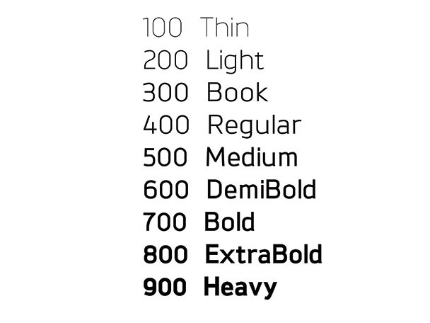

# 폰트(Font)의 모든 것

<br>

## CSS 기본 속성

CSS 기본 속성을 이용하며 폰트를 스타일링할 수 있습니다. 아래는 속성 목록입니다.

- `font-style` : 폰트 기울기

- `font-weight` : 폰트 두께

- `font-family` : 폰트

- `font-size` : 기본값 `medium`(보통 `16px`)

- `line-height` : 라인 박스의 높이

<br>

### 1) `font-style`

폰트의 기울기를 지정하는 속성입니다.

- `normal` : 기본값

- `italic`

- `oblique`

- `oblique <angle>`

<br>

### 2) `font-weight`

폰트의 두께를 지정하는 속성입니다.

- `normal` : `400` / 기본값

- `bold` : `700`

- `bolder` : 부모 요소보다 두껍게

- `lighter` : 부모 요소보다 얇게

- `100`-`900` : 사이의 숫자로 지정

<br>

위의 값들 중 하나로 폰트의 두께가 지정되면, 브라우저는 해당 두께를 가진 폰트를 찾아서 적용합니다. 이 말을 풀어보면, 하나의 글꼴(`font-family`)을 여러 두께로 표현한 폰트 리소스들이 어딘가에 존재하고, 여러 리소스 중 두께가 일치하는 폰트를 가져와서 적용한다는 의미입니다. 따라서 `font-family` 값을 숫자로 지정하더라도, 정확하게 두께가 일치하는 폰트가 없으면 접근 가능한 리소스 중에서 가장 비슷한 두께의 폰트를 찾게 됩니다.

<br>



<br>

#### 가변 폰트(Variable Font)

대부분의 폰트는 `100`-`900` 사이에 해당하는 고유한 두께를 가집니다. 이는 폰트 이름에 반영되어 있는데요, `100`-`900` 숫자들은 일반적으로 폰트 이름에서 아래와 같이 표현됩니다. 예를 들어, `Arial Black` 폰트는 두께 값이 `900`이라고 볼 수 있습니다.

| Weight | Font Name Mapping             |
| ------ | ----------------------------- |
| `100`  | `Thin` (`Hairline`)           |
| `200`  | `Extra Light` (`Ultra Light`) |
| `300`  | `Light`                       |
| `400`  | `Normal`                      |
| `500`  | `Medium`                      |
| `600`  | `Semi bold` (`Demi Bold`)     |
| `700`  | `Bold`                        |
| `800`  | `Extra Bold` (`Ultra Bold`)   |
| `900`  | `Black` (`Heavy`)             |

<br>

하지만 모든 폰트가 고유한 두께를 가지는 것은 아닙니다. 직접 두께를 지정할 수 있는 폰트를 가변 폰트(Variable Font)라고 합니다.

<br>

#### `bolder`/`lighter`

`100`/`400`/`700`/`900` 중 현재 폰트의 두께보다 더 두껍거나 얇은 값이 적용됩니다.

<br>

### 3) `font-size`

폰트 크기를 지정하는 속성입니다. 하위 요소 전체에 상속되는 것이 특징이죠.

<br>

### 4) `line-height`

테스트들이 형성하나는 하나의 줄, 라인 박스의 높이를 지정합니다.

- `normal` : 보통 `1`-`1.4` / 기본값

- 배수 : `font-size` 크기를 기준으로 하는 배수

  > 일반적으로 `1.4`-`1.7` 배면 글을 읽기에 적합하다고 추천됩니다.

- 길이 : 단위(`px`, `em`)를 사용

- `%` : `font-size` 크기를 기준으로 비율 지정

<br>

### 5) `font-family`

글꼴을 지정합니다. 여러 개를 동시에 지정할 수 있는데요, 이는 후보 글꼴들을 지정하는 것입니다. 지정한 후보 글꼴들 중 아무 것도 갖고있지 않은 환경(브라우저/운영체제)에서는 어쩔 수 없이 다른 글꼴이 자동으로 사용됩니다. 이때 최소한 같은 계열에 속하는 글꼴이 사용될 수 있도록 글꼴 계열을 함께 지정해줍니다. 글꼴 계열은 필수로 명시해주어야 합니다.

아래는 글꼴 계열의 목록입니다.

- `serif` : 바탕체 계열

- `sans-serif` : 고딕체 계열

- `monospace` : 고정너비 계열

- `cursive` : 필기체 계열

- `fantasy` : 장식 계열

<br>

> 사용자가 웹사이트에 접속하면 웹 브라우저는 필요한 리소스들(HTML, CSS, JavaScript 파일)을 다운로드 받아서 이를 기반으로 사이트를 렌더링 합니다. 하지만 `font-family`에 명시한 폰트들은 다운로드하여 사용하지 않습니다. 대신 사용자의 컴퓨터 운영체제가 제공하는 폰트 중 일치하는 폰트를 사용하고, 없다면 같은 계열의 폰트를 사용합니다. 이는 성능(속도)상 이유 때문입니다. 즉, `font-family`는 사용자의 컴퓨터에서 제공하는 폰트들을 사용하되, 이때 무슨 폰트를 사용할지 지정하는 속성입니다.

<br>

문법입니다.

```
font-family: font1, font2, font3, ... , font-family;
```

<br>

#### 예시

```css
.box {
	font-family: Arial, "Open Sans", "돋움", dotum, sans-serif;
}
```

<br>

## 단축 속성

기본 속성들을 한 번에 지정할 수 있는 단축 속성입니다.

- `font`

<br>

값은 아래와 같이 작성하되, `font-size`, `font-family` 값은 필수로 포함하고 다른 값들은 생략할 수 있습니다. 또한, `line-height` 값은 `/`를 사용하여 `font-size` 값과 명확하게 구분하는 것이 문법입니다.

```
font: font-style font-weight font-size / line-height font-family;
```

<br>

### 예시

```css
.box {
	font: italic bold 20px / 1.5 "Arial", sans-serif;
}
```

<br>

## `color`: 글자의 색상

`color`는 글자의 색을 지정하는 속성입니다.

- 이름 : 브라우저에서 제공하는 이름 (`tomato`, `dodgerblue` 등)

  > 정확하지 않으므로 실제 서비스에서 사용하지 마세요.

- Hex Code : Hexadecimal colors (16진수(`0`-`9`, `a`-`f`) 사용)

  > `#000000`(Black) - `#ffffff`(White)

- `grb()` 함수 : : Red, Green, Blue 값 지정

  > `grb(255, 255, 255)`

- `rgba()` 함수 : Red, Green, Blue, Opacity 값 지정

  > `grba(255, 255, 255, 0.5)`

- `hsl()` 함수 : 색상, 채도, 명도 값 지정

  > `hsl(120, 100%, 50%)`

- `hsla()` 함수 : 색상, 채도, 명도, Opacity 값 지정

  > `hsla(120, 100%, 50%, 0.3)`

<br>

## 웹 폰트(Web Font)

<br>

---

### Reference

- [font-style | MDN](https://developer.mozilla.org/en-US/docs/Web/CSS/font-style)
- [font-weight | MDN](https://developer.mozilla.org/en-US/docs/Web/CSS/@font-face/font-weight)
- [line-height | MDN](https://developer.mozilla.org/ko/docs/Web/CSS/line-height)
