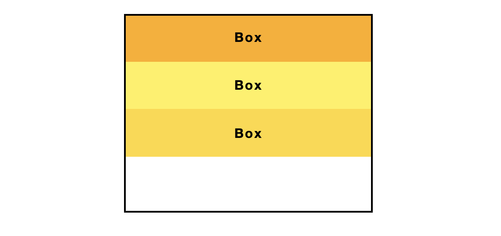
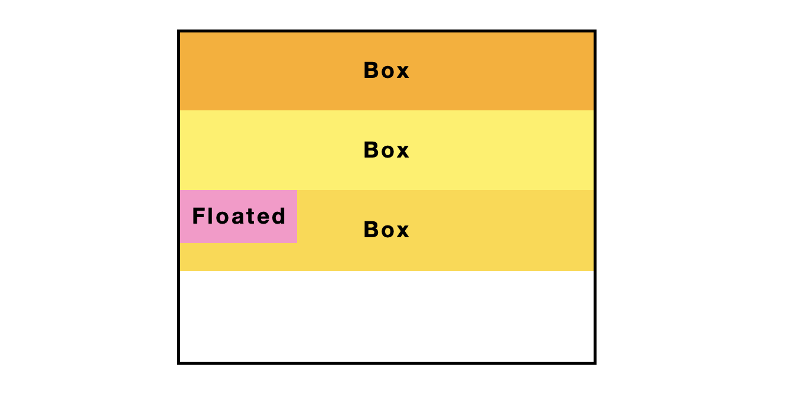
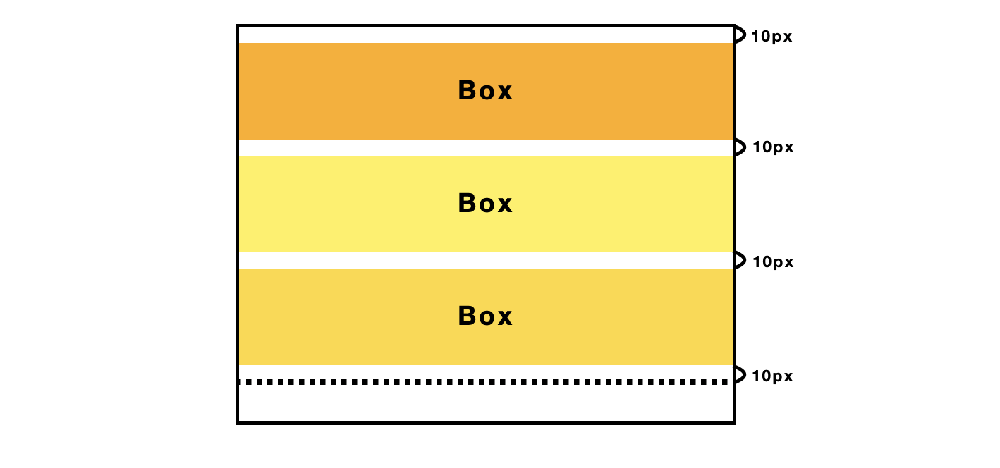
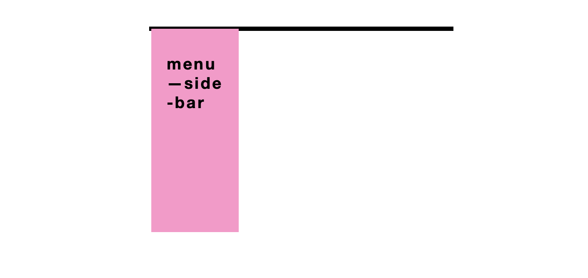
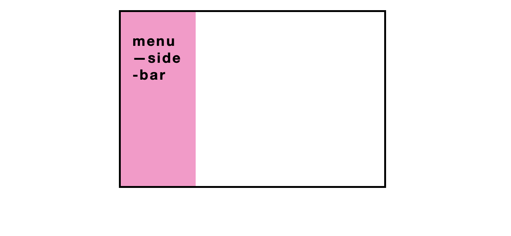
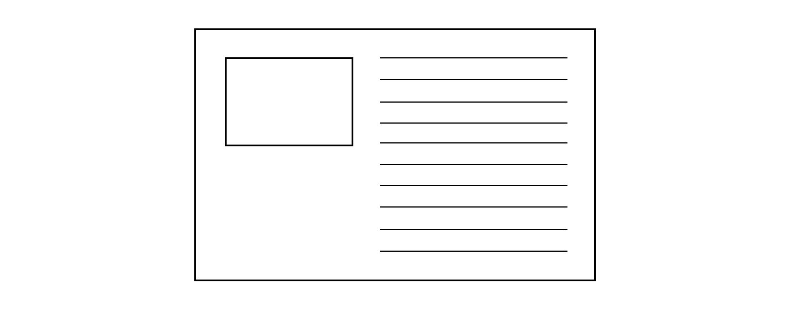
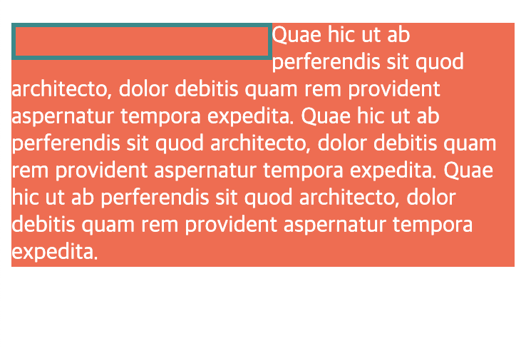
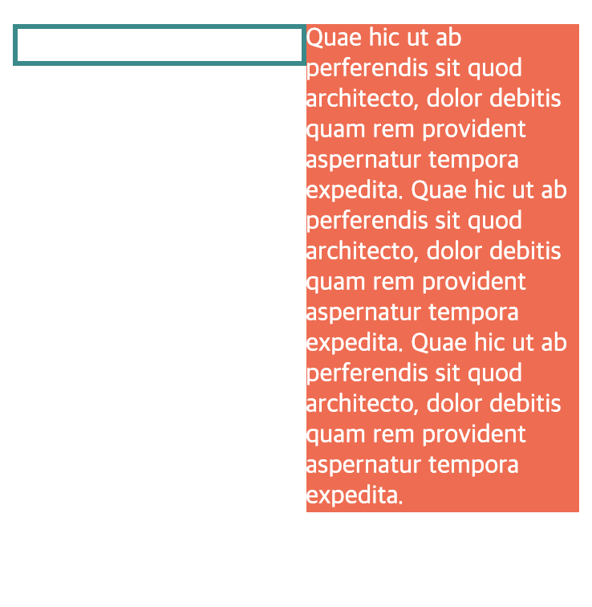
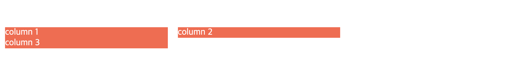
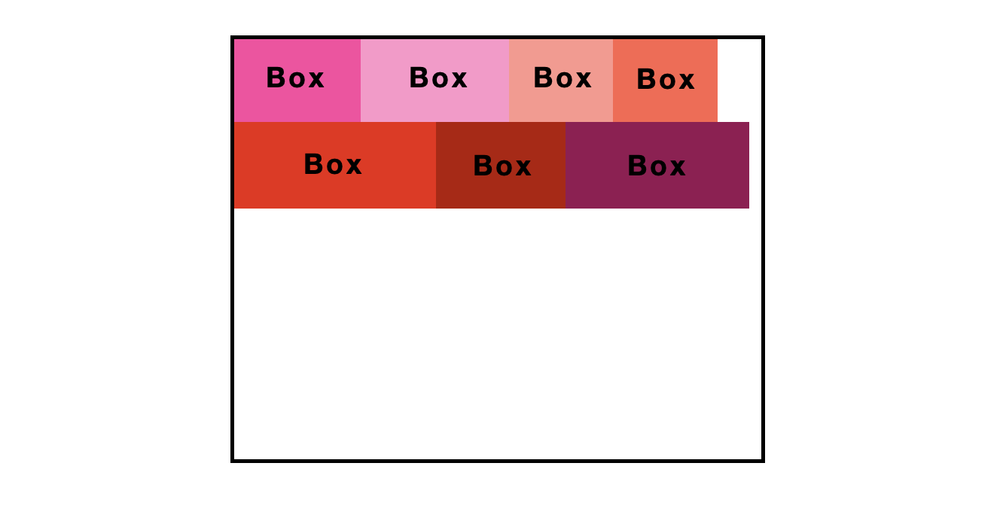

# Positioning schemes

<br>

## Positioning schemes

HTML 요소들의 레이아웃은 아래의 3 가지 포지셔닝 계획(Positioning schemes)에 따라 결정됩니다.

- Normal flow

- Floats

- Absolute positioning

<br>

> 기본적으로 Normal flow를 따르지만, `float`/`position` 속성 값에 따라 Floats 모델과 Absolute 포지셔닝을 따릅니다.

<br>

## Normal flow

Normal flow는 박스들이 포지셔닝 되는 가장 기본적인 방식입니다. Floats 모델을 따르거나 Absolute 포지셔닝을 따르지 않는 모든 요소들은 Normal flow에 따라 레이아웃 되는데요, 이런 요소들은 자신이 블록(Block)인지 인라인(Inline) 요소인지에 따라 각각 블록/인라인 서식 컨텍스트(Formatting Context)에 속하게 됩니다.

- 블록 서식 컨텍스트(Block Formatting Context)

- 인라인 서식 컨텍스트(Inline Formatting Context)

- 상대적 포지셔닝(Relative Positioning)

<br>

> 서식 컨텍스트(Formatting Context)란 HTML 요소들이 시각적으로 레이아웃/포지셔닝 되는 흐름, 환경을 나타내는 추상적인 개념입니다.

<br>

### 블록 서식 컨텍스트(Block Formatting Context)

블록 서식 컨텍스트(Block Formatting Context)에서 박스들은 위에서 아래로 수직 배치됩니다. 부모 박스의 가장 위부터 하나의 박스가 위치하고 그 다음 다른 박스가 위치하는 식으로요.

<br>



<br>

#### 블록 서식 컨텍스트가 생성되는 경우

[W3C](https://www.w3.org/TR/CSS2/visuren.html#block-formatting-contexts)에서 정의한 블록 서식 컨텍스트가 생성되는 경우입니다.

> Floats, absolutely positioned elements, inline-blocks, table-cells, table-captions, and elements with overflow other than `visible` (except when that value has been propagated to the viewport) establish new block formatting contexts.

<br>

쉽게 풀어보면,

- `float` 값이 `none` 아닌 경우

- `position` 값이 `static`/`relative` 아닌 경우

- `display` 값이 `inline-block`/`table-cell`/`table-caption`/`flex`/`inline-flex`인 경우

- `overflow` 값이 `visible` 아닌 경우

<br>

위 항목 중 하나라도 해당되면 블록 서식 컨텍스트가 생성된다는 것입니다.

<br>

#### 블록 서식 컨텍스트의 정렬 규칙

[W3C](https://www.w3.org/TR/CSS2/visuren.html#block-formatting-contexts)에 따르면,

> In a block formatting context, each box’s left outer edge touches the left edge of the containing block (for right-to-left formatting, right edges touch). This is true even in the presence of floats (although a box’s line boxes may shrink due to the floats), unless the box establishes a new block formatting context (in which case the box itself may become narrower due to the floats).

<br>

위 원문의 내용은 두 가지 중요한 포인트를 기준으로 아래와 같이 나눠볼 수 있습니다.

<br>

##### 1)

> 블록 서식 컨텍스트 내에서 자식 박스들의 왼쪽 면은 그들의 부모 박스의 왼쪽 면과 접하게 됩니다. 이는 이 컨텍스트 내에 Floats 요소가 포함되어 있어도 마찬가지로 적용됩니다. 각 박스의 텍스트는 Floats 요소의 영향으로 원래 자리에서 밀려날 수 있지만, 박스 자체는 여전히 부모 박스의 왼쪽 면과 접해 있게 됩니다.



<br>

##### 2)

> 다만, 해당 박스가 새로운 블록 서식 컨텍스트를 생성하는 경우라면 부모 박스의 면과 접해있지 않고 Floats 요소에 의해 오른쪽으로 밀려나게 됩니다.

위의 정렬 규칙을 이용하면 Text Wrapping 현상을 피할 수 있습니다. 관련 설명은 아래에서 자세하게 다루므로 지금은 생략하겠습니다.

<br>

#### 마진 중복(Margin Collapse)

블록 서식 컨텍스트 내에서 위에서 아래로 수직 배치된 박스들 간의 간격은 `margin` 속성 값에 의해 정해집니다. 이때 중요한 것은 서로 인접한 두 박스 사이의 마진 값은 두 박스의 마진이 더해진 값이 아니라는 것입니다. 대신 중복되어 상쇄됩니다. (Collapse)

그림의 모든 박스들의 위/아래 `margin` 값이 `10px`이라고 가정해봅시다. 인접한 두 박스 사이의 간격은 얼마일까요 ?

<br>



<br>

`10px` 입니다. 두 박스의 마진 값을 더한 `20px`이 두 박스의 간격이 되어야할 것 같지만, 그렇지 않습니다. 이는 블록 서식 컨텍스트의 규칙에 따라 인접한 두 블록 요소간의 마진이 중복되어 합쳐지기 때문입니다.

<br>

#### 마진 중복(Margin Collapse) 피하기

마진 중복은 블록 서식 컨텍스트 내에서 적용되는 특별한 규칙입니다. 하지만 블록 서식 컨텍스트을 이용해서 마진 중복을 피할 수 있습니다. 이게 무슨 말이냐고요?

마진 중복은 <strong>같은 블록 컨텍스트</strong> 내에 있는 블록들 사이에서 발생합니다. 만약 각각의 블록들이 서로 다른 블록 컨텍스트에 속해있다면 서로 영향을 줄 수 없기 때문에 마진 중복이 발생하지 않습니다.

<br>

마크업 예시를 볼게요.

```html
<div class="block">
	<p>Box 1</p>
	<p>Box 2</p>
	<p>Box 3</p>
</div>
```

```css
.block {
	background-color: tomato;
	overflow: hidden; /* creates a block formatting context */
}

p {
	background-color: pink;
	margin: 10px 0;
}
```

위 예시에서는 `.block` 박스에 의해 블록 서식 컨텍스트가 생성됩니다. 따라서 그 안에 속하는 각 `<p>` 요소들 간에는 마진 중복이 발생합니다.

<br>

이제 위의 마크업과 CSS를 조금 바꿔보겠습니다.

```html
<div class="block">
	<p>Box 1</p>
	<p>Box 2</p>
	<div class="bfc">
		<p>Box 3</p>
	</div>
</div>
```

```css
.block {
	background-color: tomato;
	overflow: hidden; /* creates a block formatting context */
}

p {
	background-color: pink;
	margin: 10px 0;
}

.bfc {
	overflow: hidden; /* creates new block formatting context */
}
```

어떤가요? 세 번째 `<p>` 요소는 새로운 블록 서식 컨텍스트에 속하게 되면서 두 번째 `<p>` 요소와 마진 중복이 일어나지 않습니다. 따라서 두 요소의 간격은 `10px`이 아닌 `20px`이 됩니다.

<br>

#### Floats 요소를 포함하기

Floats 요소들만을 자식 요소로 가지고 있는 박스는 높이 값이 없습니다. Floats 요소들은 Normal flow에서 분리되어 그들만의 방식으로 배치되기 때문입니다.

아래와 같은 마크업은 어떻게 렌더링 될까요?

```html
<div class="block">
	<div class="menu--side-bar">Floats</div>
</div>
```

```css
.block {
	border: 2px solid black;
}

.menu--side-bar {
	width: 100px;
	height: 250px;
	background-color: pink;
	float: left;
}
```

<br>



결과는 위와 같습니다. `.menu--side-bar` 요소는 Floats 모델에 따라 더이상 `.block` 박스와 동일면 상에 존재하지 않습니다. 따라서 `.block` 박스는 내부에 아무것도 없는 빈 박스가 되며, 높이 값을 따로 지정하지 않았기 때문에 위와 같이 보이게 됩니다.

<br>

##### 방법 1: `clear`

위와 같은 문제를 해결하는 가장 흔한 방법은 `clear` 속성을 사용하는 것입니다. Floats 모델을 따르는 요소 바로 다음 자리에 가상의 요소를 만들고 `clear` 속성 값을 부여하는 방법입니다. 이 방법을 사용하려면 아래의 CSS를 추가하면 됩니다.

```css
.menu--side-bar::after {
	clear: both;
}
```

<br>

##### 방법 2: 블록 서식 컨텍스트을 사용하기

하지만 블록 서식 컨텍스트를 사용하면 가상 요소와 `clear` 속성을 사용하지 않고 문제를 해결할 수 있습니다. 아래와 같이 한 줄의 스타일을 추가하는 것만으로요.

```css
.block {
	border: 2px solid black;
	overflow: hidden; /* creates block formatting context */
}

.menu--side-bar {
	width: 100px;
	height: 250px;
	background-color: pink;
	float: left;
}
```

<br>

결과는 아래와 같습니다.

<br>



<br>

#### Text Wrapping 피하기

`float` 속성을 사용하면 주변의 텍스트들이 Box by Box 형태로 배치되지 않고 주변을 흐르듯 감싸면서 배치됩니다. 주변을 흐르듯 감싼다는건 아래와 같이 보여진다는 말이죠. (Text Wrapping)

<br>


<br>

> 위의 이미지는 [이 블로그](https://techbug.tistory.com/181)에서 가져왔습니다. 오래된 글이지만, CSS 레이아웃에 대해 매우 잘 설명되어 있어 읽기를 추천합니다.

<br>
<br>

그런데 우리는 아래와 같은 레이아웃이 필요할 수 있습니다.



<br>

이 레이아웃은 블록 서식 컨텍스트를 사용해서 구현할 수 있습니다. 예제로 알아봅시다.

```html
<div class="block">
	<div class="floated"></div>
	<p>
		Quae hic ut ab perferendis sit quod architecto, dolor debitis quam rem
		provident aspernatur tempora expedita. Quae hic ut ab perferendis sit quod
		architecto, dolor debitis quam rem provident aspernatur tempora expedita.
		Quae hic ut ab perferendis sit quod architecto, dolor debitis quam rem
		provident aspernatur tempora expedita.
	</p>
</div>
```

```css
.block .floated {
	width: 50%;
	height: 20px;
	border: 3px solid darkcyan;
	float: left;
}

.block p {
	background-color: tomato;
	color: white;
}
```

<br>

위의 마크업과 CSS는 렌더링 후 아래와 같이 보여질 겁니다. 텍스트만 보면 Float 요소를 감싸면서 배치된 것 같지만, 어떻습니까? `<p>` 요소는 실제로는 Float 요소의 아래에 여전히 자리를 차지하고 배치되어 있네요. 다만 `<p>` 요소가 담고있는 텍스트만이 Float 요소가 차지하는 부분만 자리를 내주며 배치되어 있습니다.

<br>



이제 CSS에 딱 한 줄의 코드를 추가해봅시다.

```css
.block .floated {
	width: 50%;
	height: 20px;
	border: 3px solid darkcyan;
	float: left;
}

.block p {
	background-color: tomato;
	color: white;
	overflow: hidden; /* creates block formatting context */
}
```

<br>



<br>

주변의 텍스트들이 더이상 감싸면서 배치되지 않고, Float 요소의 오른쪽에 분리되어 위치하게 됩니다. 실제로 텍스트를 담은 `<p>` 요소는 Float 요소의 아래에 계속 자리를 잡고있지 않고 Float 요소에 의해 밀려나 오른쪽에 위치하게 됩니다. 이는 블록 서식 컨텍스트의 정렬 규칙 때문입니다.

[W3C](https://www.w3.org/TR/CSS2/visuren.html#block-formatting-contexts)에 따르면,

> In a block formatting context, each box’s left outer edge touches the left edge of the containing block (for right-to-left formatting, right edges touch). This is true even in the presence of floats (although a box’s line boxes may shrink due to the floats), unless the box establishes a new block formatting context (in which case the box itself may become narrower due to the floats).

<br>

`<p>` 요소는 새로운 블록 서식 컨텍스트를 생성합니다. 결과적으로 더이상 부모 박스의 면과 접해서 위치하지 않고 형제 요소의 다음에 위치하게 됩니다.

<br>

#### 컬럼 Drop 방지하기

어떤 브라우저에서는 Multi-column 레이아웃의 마지막 컬럼이 다음 줄로 밀려나는 현상이 발생합니다. 이는 브라우저에서 각 컬럼의 `width` 값이 반올림되어 컬럼들의 너비의 합이 부모 박스의 너비를 초과하는 경우 발생합니다.

<br>

아래와 같이 3 개의 컬럼으로 구성된 Multi-column 레이아웃을 상상해봅시다.

```html
<div class="container">
	<div class="column">column 1</div>
	<div class="column">column 2</div>
	<div class="column">column 3</div>
</div>
```

```css
.column {
	background-color: green;
	margin: 0 1%;
	width: 31.33%;
	float: left;
}
```

> [W3C 명세](https://www.w3.org/TR/CSS2/box.html#margin-properties)에 따르면, `margin` 값에서 `%`를 사용하는 경우, 상위 요소의 `width` 값을 기준으로 계산합니다.

<br>

위의 경우, 각 컬럼의 너비와 좌우 마진 값을 더하면 `99.99%`가 되므로 문제가 없어보입니다. 하지만 어떤 브라우저에서는 컬럼의 너비 값을 반올림하여 계산하므로 전체 너비를 초과할 수 있습니다. 이런 경우 렌더링 결과는 아래와 같을 것입니다.



<br>

컬럼 Drop 문제를 해결하기 위해 아래와 같은 CSS를 추가할 수 있습니다.

```css
.column:last-child {
	float: none;
	overflow: hidden; /* a new block formatting context in the last column */
}
```

<br>

마지막 컬럼이 새로운 블록 서식 컨텍스트를 생성함으로써 Float 요소인 이전 컬럼들이 위치하고 남은 공간을 차지하게 됩니다.


<br>

> 컬럼 Drop 문제를 방지하는 방법으로는 Flex Box가 더 적합하지만, 블록 서식 컨텍스트의 특징을 이해해보기 위한 예시입니다.

<br>

### 인라인 서식 컨텍스트(Inline Formatting Context)

인라인 서식 컨텍스트(Inline Formatting Context)에서는 박스들이 수평적으로 레이아웃 되는데요, 가장 위에서부터 하나 하나 왼쪽에서 오른쪽으로 배치됩니다.

<br>



<br>

인라인 서식 컨텍스트에서는 양옆으로 인접한 두 박스들의 마진(`margin`), 테두리 선(`border`), 패딩(`padding`) 값은 서로 상쇄되지 않고 각자 자리를 차지합니다.

<br>

#### 상대적 포지셔닝(Relative Positioning)

<br>

### Floats

`float` 모델을 따르는 박스들은 먼저 Normal flow에 따라 레이아웃되고, 그 후 Normal flow에서 빠져나와 왼쪽 혹은 오른쪽으로 옮겨집니다. 다른 요소들은 이 `float` 요소들의 사이사이에 흐르듯 레이아웃 됩니다.

<br>

### Absolute positioning

`absolute` 포지셔닝을 따르는 박스는 애초에 Normal flow로부터 분리되어 완전히 독립적으로 레이아웃 됩니다. 따라서 형제 박스들의 레이아웃에 전혀 영향을 주지 않게 됩니다. `absolute` 박스는 부모 요소의 위치를 기준으로 지정된 위치에 레이아웃 됩니다.

> 여기에서 부모 요소는 `position` 속성을 가진 가장 가까운 상위 요소를 말합니다.

<br>

## `position`

`position` 속성의 값은 다음 중 하나입니다.

- `static`
- `relative`
- `absolute`
- `fixed`
- `inherit`

(`position` 속성을 지정하지 않은 경우) 기본값은 `static`입니다. `position` 값이 `static`이 아닌 요소들을 포지셔닝 되었다고(Positioned) 말하며, 포지셔닝 된 요소들은 4 개의 속성 값 `top`, `right`, `bottom`, `left`에 따라 레이아웃 됩니다.

<br>

### 박스 오프셋(Box offsets)

`top`, `right`, `bottom`, `left` 이 4 개의 속성들은 박스와 박스가 겹쳐서 포지셔닝 될 때 박스의 위치를 나타내기 때문에 박스 오프셋(Box offsets) 속성이라고 부릅니다.

가령 `absolute` 박스의 `top` 속성 값이 `10px` 이라면, 이 박스의 `top margin`은 부모 박스의 가장 위에서부터 `10px` 만큼 오프셋 됩니다. 한편 `relative` 박스는 Normal flow에 따라 자신이 원래 위치해야 할 가상의 좌표를 가질 것입니다. 그 위치를 기준으로 가장 위에서 부터 `10px` 만큼 오프셋 됩니다.

<br>

---

### References

- [Block formatting context | MDN](https://developer.mozilla.org/ko/docs/Web/Guide/CSS/Block_formatting_context)
- [Understanding Block Formatting Contexts in CSS](https://www.sitepoint.com/understanding-block-formatting-contexts-in-css/)
- [Positioning schemes | W3C Recommendation](https://www.w3.org/TR/CSS2/visuren.html#positioning-scheme)
