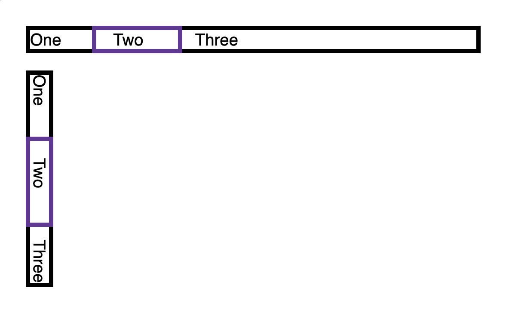
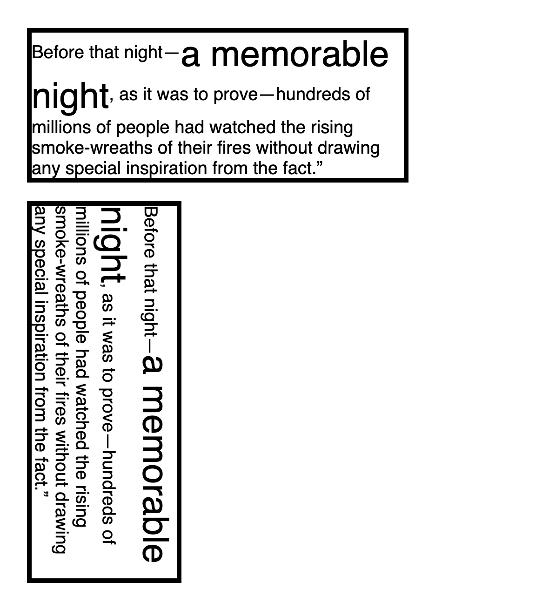

# 인라인 서식 컨텍스트(Inline Formatting Context)

<br>

## 인라인 서식 컨텍스트(Inline Formatting Context)

[MDN 원문](https://developer.mozilla.org/en-US/docs/Web/CSS/Inline_formatting_context)에 따르면,

> The inline formatting context is part of the visual rendering of a web page. Inline boxes are laid out one after the other, in the direction sentences run in the writing mode in use.

인라인 서식 컨텍스트(Inline Formatting Context)에서 요소들은 하나 하나 차례로 배치되는데, 배치되는 방향은 수평적/수직적 2 가지 쓰기 모드(Writing mode)에 따라 결정됩니다.

<br>

```html
<div class="horizontal">One <span>Two</span> Three</div>

<div class="vertical">One <span>Two</span> Three</div>
```

```css
div {
	border: 5px solid black;
}

span {
	border: 5px solid rebeccapurple;
	padding-inline-start: 20px;
	padding-inline-end: 40px;
	margin-inline-start: 30px;
	margin-inline-end: 10px;
}

.horizontal {
	writing-mode: horizontal-tb;
}

.vertical {
	writing-mode: vertical-rl;
}
```

<br>

위 마크업과 CSS의 렌더링 결과는 이렇습니다.



<br>

## 인라인 익명 박스(Inline Anonymous Box)

위 예시의 경우, `<span>` 태그에 의해 문자열이 잘리므로 3 개의 Inline 박스가 생성됩니다. 이때 `<span>` 태그로 감싸고 있는 중간 박스를 제외하고, 양옆의 문자열로 이루어진 2 개의 Inline 박스를 Inline 익명 박스(Anonymous Box)라고 합니다. 이와 같은 익명의 Inline 박스들은 별도로 스타일을 지정할 수 없으며, 상위 박스의 스타일을 상속받게 됩니다.

> 반면, 아시다시피 `<span>` 태그로 감싼 중간 박스는 독립적으로 스타일을 지정할 수 있습니다.

> 익명 박스에 대한 자세한 설명은 [여기](https://github.com/estellechoi/TIL/blob/master/css/box.md)를 참고하세요.

<br>

## 라인 박스(Line Box)

여러 Inline 요소들이 모여 하나의 라인(Line)을 형성하는데, 이 직사각형 박스 모양의 라인을 라인 박스(Line Box) 라고 합니다. 라인 박스 내에서 Inline 요소들이 차례로 배치되다가 해당 라인에 공간이 부족하면, 또 하나의 라인 박스를 생성하고 그 안에 나머지 요소들이 배치됩니다. 이런 식으로 몇 개의 라인 박스가 생성될 수 있습니다.

> 가령, 한 단락의 텍스트들은 여러 개의 라인 박스들을 생성하면서 아래와 같이 배치됩니다.


<br>

Line Box의 높이는 [Line height calculations](https://www.w3.org/TR/CSS2/visudet.html#line-height)에 따라 결정되며, 너비는 상위 요소와 Float 요소들에 의해 결정됩니다.

<br>

## 마진 중복이 발생하나요?

인라인 서식 컨텍스트에서는 마진 중복이 발생하지 않습니다. 양옆으로 인접한 두 박스들의 마진(`margin`), 테두리 선(`border`), 패딩(`padding`) 값은 서로 상쇄되지 않고 각자 자리를 차지합니다.

<br>

## 정렬

### 세로 정렬: `vertical-align`

Line Box 내에서 인라인 요소들의 정렬을 지정할 때는 `vertical-align` 속성을 사용합니다. `vertical-align` 속성의 값으로 `top`, `middle`, `bottom`, `baseline`를 지정할 수 있습니다.

<br>

```css
span {
	font-size: 200%;
	vertical-align: top;
}
```

위와 같이 일부 인라인 요소의 폰트 사이즈를 늘려서 해당 요소가 속해있는 Line Box의 높이를 늘릴 수 있습니다. 이때 Line Box보다 높이 값이 작은 나머지 인라인 요소들은 `vertical-align: top`에 의해 아래와 같이 정렬됩니다. 렌더링 결과는 아래와 같습니다.



<br>

### 가로 정렬: `text-align`

Line Box 내에서 인라인 요소들의 가로 정렬은 `text-align` 속성을 사용합니다.

<br>

## Float 요소의 영향

같은 블록 서식 컨텍스트 내에 Float 요소와 인라인 요소가 함께 있을 때, 인라인 요소들이 형성하는 Line Box의 너비는 Float 요소가 차지하는 너비만큼 줄어듭니다. `writing-mode: vertical-rl` 경우라면, Float 요소가 차지하는 높이만큼 Line Box의 높이가 줄어듭니다.

<br>

---

### References

- [Positioning schemes | W3C Recommendation](https://www.w3.org/TR/CSS2/visuren.html#positioning-scheme)
- [Inline formatting context | MDN](https://developer.mozilla.org/en-US/docs/Web/CSS/Inline_formatting_context)
