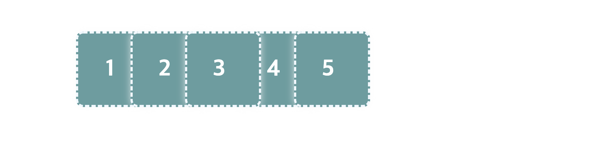
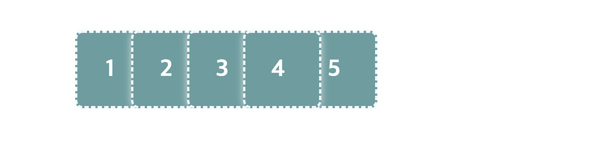
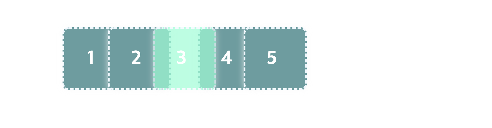
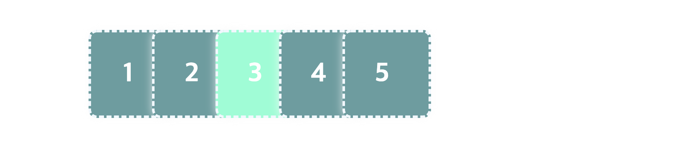
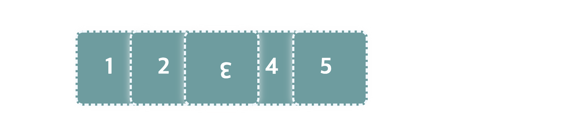
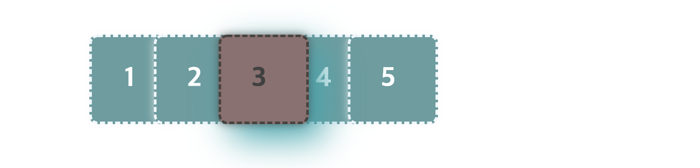
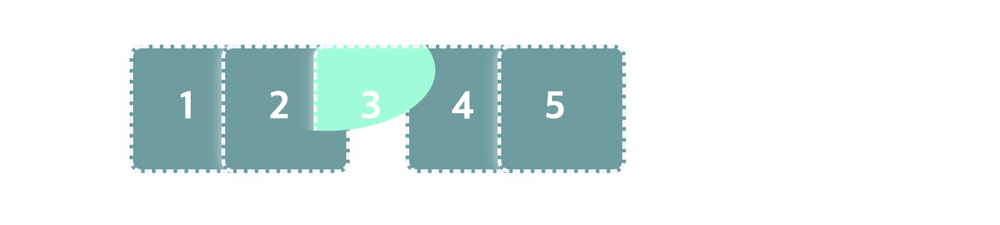
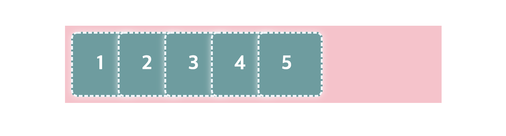
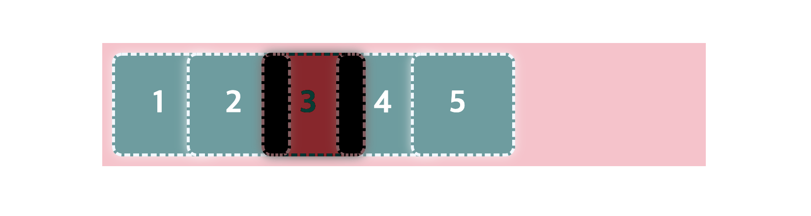
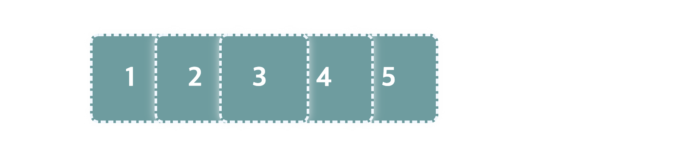

# Stacking Context

<br>

## Stacking Context

Stacking Context는 가상의 Z축을 사용한 HTML 요소의 3차원 개념입니다. 이는 CSS의 `z-index` 속성과 관련이 깊은데요, `z-index` 속성은 요소들이 겹치는 경우 해당 요소들이 쌓이는 순서, 즉 어떤 요소가 더 위에 배치될지 결정합니다.


<br>

Stacking Context는 문서 어디에서나 다음 조건들 중 하나를 만족하는 요소가 생성합니다.

- 최상위 요소(`<html>`)

- `position` 속성이 지정된 요소 (`position: static` 제외)

- Flex Box의 자식 요소

- Grid Box의 자식 요소

- `opacity` 속성 값이 `1` 미만인 경우

  > [자세한 내용 보기](https://www.w3.org/TR/css-color-3/#transparency)

- 아래의 속성들 중 하나라도 기본값이 아닌 경우

  - `mix-blend-mode` : 기본값 `normal`
  - `transform` : 기본값 `none`
  - `filter` : 기본값 `none`
  - `perspective` : 기본값 `none`
  - `clip-path` : 기본값 `none`
  - `mask`/`mask-image`/`mask-border` : 기본값 `none`

- `isolation: isolate`

- `-webkit-overflow-scrolling: touch`

<br>

> [기타 조건을 확인하세요](https://developer.mozilla.org/en-US/docs/Web/CSS/CSS_Positioning/Understanding_z_index/The_stacking_context).

<br>

## Stacking Context 생성하기

> Stacking Context, 이제부터는 MDN 문서 번역본에 따라 "쌓임 맥락"이라고 명칭하겠습니다.

위의 쌓임 맥락이 생성되는 조건들 중 몇가지를 테스트 해봅시다. 그 전에, 만약 동일한 조건에 의해 동일한 쌓임 맥락에 속하는 요소들끼리 겹치게 되면 어떤 순서로 쌓일까요?

```html
<div class="box">1</div>
<div class="box">2</div>
<div class="box">3</div>
<div class="box">4</div>
<div class="box">5</div>
```

<br>

HTML 문서에서 더 나중에 작성된 요소일 수록 더 위에 쌓입니다. 예를 들어, 위와 같이 마크업 하면 가장 마지막에 작성된 `<div class="box">5</div>` 요소가 가장 위에 쌓입니다. 아래는 쌓임을 확인하기 위해 `margin-right: -30px;` 속성 값을 이용하여 5개의 박스를 겹치게 만든 모습입니다.


<br>

### 1) `position` 요소

`static`이 아닌 `position` 속성 값을 지정하면 새로운 쌓임 맥락이 생성되며, 해당 박스는 가장 위에 쌓이게 됩니다. 3번 박스에 `position: relative` 속성값을 추가해볼까요?

```css
.box:nth-child(3) {
	position: relative;
}
```

아래와 같이 3번 박스가 Z축의 가장 위에 배치됩니다.



<br>

아래와 같이 4번 박스에 `postion` 속성을 주면, 3번 박스와 같은 쌓임 맥락에 있게 됩니다.

```css
.box:nth-child(4) {
	position: relative;
}
```

<br>

이때는 더 나중에 마크업 된 4번 박스가 더 위에 쌓이게 되죠.



<br>

### 2) `opacity` 요소

투명한 요소, 즉 `opacity` 속성 값이 `1` 미만인 요소 역시 새로운 쌓임 맥락을 생성합니다. 위의 5개 박스 모두 `position` 속성을 제거한 초기 상태로 되돌렸다고 가정하고요, 3번 박스에 아래와 같은 CSS를 적용해봅니다.

```css
.box:nth-child(3) {
	background-color: Aquamarine;
	opacity: 0.7;
}
```

> `background-color` 속성은 쌓임과 전혀 상관이 없으며, 시각적으로 확인하는데 도움을 받기 위해 지정한 것입니다.

<br>

렌더링 결과는 아래와 같습니다. 투명한 요소인 3번 박스가 새로운 쌓임 맥락을 생성하면서 가장 위에 쌓였습니다.



<br>

`opacity` 속성을 지워볼까요?

```css
.box:nth-child(3) {
	background-color: Aquamarine;
	/*   opacity: 0.7; */
}
```



<br>

### 3) `transform`

다시 5개 박스를 초기 상태로 돌립시다. 모두 같은 쌓임 맥락 상으로요. 이제 3번 박스에 아래와 같이 `transform` 속성을 적용해보세요.

```css
.box:nth-child(3) {
	transform: rotate(0.5turn);
}
```

<br>

렌더링 결과는 아래와 같습니다. 3번 박스가 회전되었을 뿐만 아니라, 가장 위에 쌓이게 되었네요.



<br>

### 4) `filter`

이번에는 3번 박스에 아래와 같은 `filter` 속성 값을 지정합니다.

```css
.box:nth-child(3) {
	filter: drop-shadow(16px 16px 20px red) invert(75%);
}
```

<br>

역시나 3번 박스가 가장 위에 쌓입니다.



<br>

> [filter | MDN](https://developer.mozilla.org/en-US/docs/Web/CSS/filter)

<br>

### 5) `clip-path`

3번 박스에 요소의 클리핑 범위를 지정하는 `clip-path` 속성 값을 아래와 같이 주었습니다.

```css
.box:nth-child(3) {
	background-color: Aquamarine;
	clip-path: ellipse(90px 50px at 10% 20%);
}
```

> 시각적 확인을 돕기 위해 `background-color` 속성을 사용했습니다.

<br>

3번 박스가 가장 위에 쌓입니다.



<br>

> [clip-path | MDN](https://developer.mozilla.org/en-US/docs/Web/CSS/clip-path)

<br>

### `mix-blend-mode`

요소의 배경/부모 요소와의 혼합 모드를 지정하는 `mix-blend-mode` 속성 역시 새로운 쌓임 맥락을 생성합니다. 아래는 이 속성을 적용하기 전의 모습인데요, 적용 후 혼합된 모습을 확인하기 위해 부모 요소의 배경 색상을 `pink`로 지정하였습니다.



<br>

`mix-blend-mode` 속성 값을 아래와 같이 지정하면,

```css
.box:nth-child(3) {
	mix-blend-mode: difference;
}
```

<br>

아래와 같이 렌더링 됩니다. 단순히 혼합 스타일링만 적용되지 않고, 가장 위에 쌓이게 되었습니다.



<br>

## `z-index`

`z-index`는 요소의 쌓임 순서를 결정합니다. 기본값은 `0`이고요, 값이 클 수록 위에 쌓입니다. 다만, `position` 속성을 가진 요소에만 적용된다는 점에 주의하세요.

위의 예시에서 3, 4번 박스는 같은 쌓임 맥락에 있습니다. 이때 `z-index` 속성을 이용하여 3번 박스가 4번 박스 위에 쌓이도록 새로운 쌓임 맥락을 생성할 수 있습니다. 아래와 같이 3번 박스에 `z-index: 1`을 추가해봅시다.

```css
.box:nth-child(3) {
	position: relative;
	z-index: 1;
}
```

<br>

이제 3번 박스의 `z-index` 값은 `1`, 4번 박스는 따로 지정하지 않았으므로 `0`이겠죠. 따라서 3번 박스가 4번 박스 위에 쌓입니다. 추가로 언급하자면, 4번 박스는 `position` 속성을 가진 요소이므로 그렇지 않은 5번 박스보다는 위에 쌓이게 됩니다.



<br>
<br>
<br>

---

### References

- [The stacking context | MDN](https://developer.mozilla.org/en-US/docs/Web/CSS/CSS_Positioning/Understanding_z_index/The_stacking_context)
- [Using z-index | MDN](https://wiki.developer.mozilla.org/en-US/docs/Web/CSS/CSS_Positioning/Understanding_z_index/Adding_z-index)
- [Stacking without the z-index property | MDN](https://wiki.developer.mozilla.org/en-US/docs/Web/CSS/CSS_Positioning/Understanding_z_index/Stacking_without_z-index)
- [z-index | codrops](https://tympanus.net/codrops/css_reference/z-index/)
