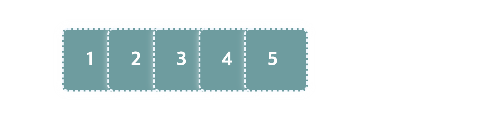

# Stacking Context

 

## Stacking Context

Stacking Context는 가상의 Z축을 사용한 HTML 요소의 3차원 개념입니다. 이는 CSS의 `z-index` 속성과 관련이 깊은데요, `z-index` 속성은 요소들이 겹치는 경우 해당 요소들이 쌓이는 순서, 즉 어떤 요소가 더 위에 배치될지 결정합니다.

 

Stacking Context는 문서 어디에서나 다음 조건들 중 하나를 만족하는 요소가 생성합니다.

- 최상위 요소(`<html>`)

- `position` 속성이 지정된 요소 (`position: static` 제외)

- Flex Box의 자식 요소

- Grid Box의 자식 요소

- `opacity` 속성 값이 `1` 미만인 경우

  > [자세한 내용 보기](https://www.w3.org/TR/css-color-3/#transparency)

- 아래의 속성들 중 하나라도 기본값이 아닌 경우

  - `mix-blend-mode` : 기본값 `normal`
  - `transform` : 기본값 `none`
  - `filter` : 기본값 `none`
  - `perspective` : 기본값 `none`
  - `clip-path` : 기본값 `none`
  - `mask`/`mask-image`/`mask-border` : 기본값 `none`

- `isolation: isolate`

- `-webkit-overflow-scrolling: touch`

 

> [기타 조건을 확인하세요](https://developer.mozilla.org/en-US/docs/Web/CSS/CSS_Positioning/Understanding_z_index/The_stacking_context).

 

### Positioned 요소

다음은 `margin-right: -30px;` 속성 값을 이용하여 5개의 박스를 겹치게 만든 모습입니다. 아래의 5개 박스 중 3번 박스에 `position` 속성 값을 지정하면 새로운 Stack Context가 생성되면서, 해당 박스는 가장 위에 쌓이게 됩니다.

아래는 Stack Context 생성 전이구요.

 

3번 박스에 `position: relative` 속성값을 추가하면, 해당 박스는 Positioned 요소가 되면서 새로운 쌓임 맥락, Stack Context를 생성합니다.

 

---

### References

- [The stacking context | MDN](https://developer.mozilla.org/en-US/docs/Web/CSS/CSS_Positioning/Understanding_z_index/The_stacking_context)
- [Using z-index | MDN](https://wiki.developer.mozilla.org/en-US/docs/Web/CSS/CSS_Positioning/Understanding_z_index/Adding_z-index)
- [Stacking without the z-index property | MDN](https://wiki.developer.mozilla.org/en-US/docs/Web/CSS/CSS_Positioning/Understanding_z_index/Stacking_without_z-index)
- [z-index | codrops](https://tympanus.net/codrops/css_reference/z-index/)
