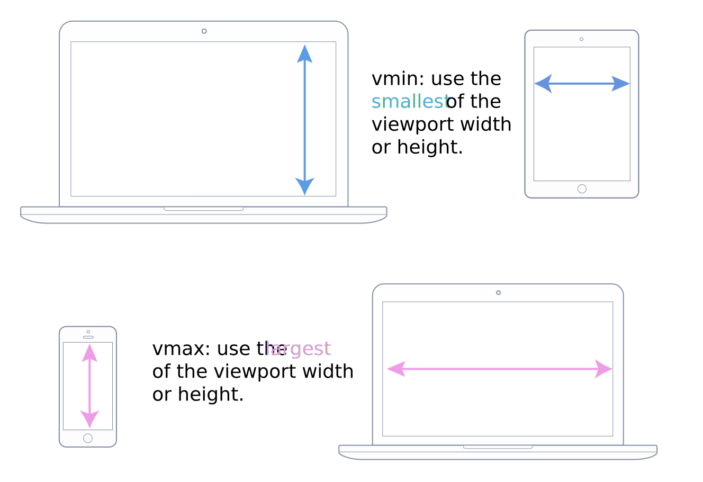
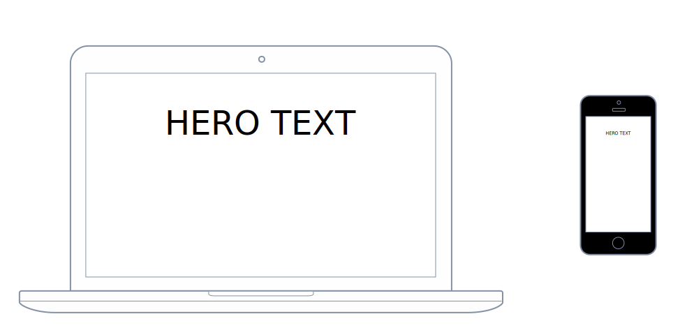

# 단위: `px`, `%`, `em`, `rem`, `vw`, `vh`, `vmin`, `vmax`

<br>

## 단위

> [Test your skills: values and units | MDN](https://developer.mozilla.org/en-US/docs/Learn/CSS/Building_blocks/Values_tasks) 페이지에서 능숙도를 측정할 수 있습니다.

<br>

### 픽셀 (`px`)

스크린 [해상도](https://ko.wikipedia.org/wiki/%ED%95%B4%EC%83%81%EB%8F%84)를 기준으로 하는 고정 단위입니다. 해상도가 높을 수록 `1px`의 실제 크기는 작아집니다.

W3C 명세에 따르면 CSS에서 픽셀(`px`) 계산은 아래를 따릅니다.

> 1 px = 1/96th of 1 in

<br>

CSS 픽셀(Pixel)에 대해 깊게 학습하려면 아래의 링크들을 참고하세요.

- [CSS pixel | MDN](https://developer.mozilla.org/en-US/docs/Glossary/CSS_pixel)

- [CSS Length Explained | Mozilla HACKS](https://hacks.mozilla.org/2013/09/css-length-explained/)

- [Is a CSS pixel really an absolute unit? That is, is 1 inch = 96px true? | Stackoverflow](https://stackoverflow.com/questions/40480617/is-a-css-pixel-really-an-absolute-unit-that-is-is-1-inch-96px-true)

<br>

### 퍼센트(`%`)

부모 요소의 가로 너비(`width`)를 기준으로 합니다.

<br>

### `em`

요소 자신의 `font-size` 값을 기준으로 합니다. 자신의 `font-size` 값을 `1em`으로 합니다.

```html
<div class="container">
	Container
	<div class="parent">
		Parent
		<div class="child">Child 1</div>
		<div class="child">Child 2</div>
	</div>
</div>
```

```css
.container {
	font-size: 10px;
	width: 60em; /* 60 * 10 = 600px */
}
```

위에서 `.container` 요소의 `width` 값은 아래와 같이 계산됩니다.

- 자신의 폰트 크기 `10px` \* `60em` \= `600px`

<br>

#### `font-size` 값의 상속

모든 하위 요소들은 부모 요소의 `font-size` 값을 물려받습니다.

```css
.parent {
	font-size: 2em; /* inherited font-size --> 10px * 2 = 20px */
	width: 30em; /* 20 * 30 = 600px */
}
```

위와 같이 어떤 요소의 `font-size`를 지정할 때 `em` 단위를 사용하면, 부모 요소로부터 상속받은 (자신의 원래) 폰트 크기를 기준으로 합니다. `.parent` 요소는 부모 요소의 폰트 크기 `10px`을 상속받으므로, `2em`은 `20px`로 계산되어 적용됩니다.

<br>

```css
.child {
	font-size: 2em; /* inherited font-size --> 20px * 2 = 40px */
	width: 15em; /* 40 * 15 = 600px */
}
```

같은 방식으로 `.child` 요소의 `font-size` 값과 `width` 값을 유추할 수 있겠죠.

<br>

### `rem`

> rem : root em

최상위 요소인 `<html>` 요소의 `font-size` 값을 기준으로 합니다. `rem` 단위는 `em` 단위의 단점을 보완하기 위해 고안되었습니다. `em` 단위의 단점은 관리의 어려움인데요, `font-size` 값을 변경할 때 `em` 단위를 여러번 사용하게되면 상속받는 하위의 모든 요소들에 영향을 주기 때문에 그 값을 추적하기 어렵다는 점입니다.

<br>

`<html>` 요소의 `font-size` 초기값은 브라우저마다 다르며, 사용자가 선택할 수도 있습니다. 또는 아래와 같이 고정값을 지정할 수 있습니다.

```css
html {
	font-size: 15px;
}
```

<br>

## 뷰포트(Viewport) 단위

뷰포트(Viewport)의 크기를 기준으로 하는 단위입니다. 아래와 같이 4가지 단위가 있습니다.

- `vw`

- `vh`

- `vmin`

- `vmax`

<br>

### 1) `vw`

> vw: viewport width

뷰포트(Viewport)의 `width` 값을 기준으로 합니다. `vw` 단위는 백분율을 사용하기 때문에 퍼센트(`%`) 단위처럼 `100vw`을 최대값으로 합니다. 예를 들어, 아래와 같이 작성하면 뷰포트 너비의 50%를 `width` 값으로 지정한다는 의미입니다.

```css
div {
	width: 50vw;
}
```

<br>

### 2) `vh`

> vh: viewport height

뷰포트(Viewport)의 `height` 값을 기준으로 합니다. `vw` 단위와 비슷하게 `100vh`을 최대값으로 합니다. 예를 들어, 아래와 같이 작성하면 뷰포트 높이의 50%를 `height` 값으로 지정한다는 의미입니다.

```css
div {
	width: 50vw;
	height: 50vh;
}
```

<br>

### 3) `vmin` & `vmax`

뷰포트(Viewport)의 `width`/`height` 값을 기준으로 합니다. 백분율을 사용합니다.

- `vmin` : 뷰포트의 `width`/`height` 값 중 작은 값을 기준으로

- `vmax` : 뷰포트의 `width`/`height` 값 중 큰 값을 기준으로

<br>



<br>

예를 들어, 뷰포트의 크기가 `1100px * 740px` 이라면, 아래와 같이 계산됩니다.

- `1vmin` = `7.4px`

- `1vmax` = `11px`

<br>

이 단위는 상당히 가변적인데요, 가로/세로 전환이 자유로운 모바일 기기에서 요소의 크기를 지정할 때 유용하게 사용됩니다. 예를 들어, 모바일 기기 전체 화면에 가득 차는 요소를 만들 때 아래와 같이 간단히 지정할 수 있습니다.

```css
.box {
	height: 100vmax;
	width: 100vmax;
}
```

<br>

또한, `vmin`/`vmax` 단위는 다음과 같은 미디어쿼리(Media queries)를 대체할 수 있는 좋은 방법입니다.

- `@media screen and (orientation : portrait)`

- `@media screen and (orientation : landscape)`

<br>

뷰포트의 가로/세로 정렬을 지정하는 미디어쿼리인데요, `vmin`/`vmax` 단위를 사용하면 이 거추장스러운 미디어쿼리를 덜어낼 수 있죠.

<br>

## `vw`/`vh`단위는 언제 사용할까요?

스크린의 너비 값에 꽉 차는 슬라이드를 만들거나, 스크린 전체를 채우는 배경 이미지를 지정할 때 사용할 수 있습니다. 스크린의 너비 값에 꽉 차는 슬라이드를 만든다고 가정해 봅시다. 아래와 같이 간단히 지정할 수 있습니다.

```css
.slide {
	width: 100vw;
}
```

<br>

뷰포트 기반 단위들의 특징은 부모 요소의 너비에 의존하는 퍼센트(`%`) 단위와는 달리, 뷰포트 사이즈에 맞추어 가변한다는 것입니다. 이는 `vw` 단위를 사용하면 뷰포트의 사이즈에 완벽하게 Fit 되는 반응형 헤드라인을 구현할 수 있다는 말입니다. 헤드라인 요소의 `font-size` 값을 지정할 때 원하는 `vw` 값을 지정하면, 뷰포트의 사이즈가 변해도 완벽한 비율로 가변합니다.

<br>

### Full-Height 레이아웃

뷰포트 전체를 사용하는 레이아웃을 구현할 때 유용합니다.

```css
body {
	height: 100vh; /* Full height! */
}
```

<br>

> 이 방법은 일부 모바일 브라우저 환경에서 문제가 있습니다. [iOS Safari에서 이 문제를 제거하는 방법](https://github.com/Hiswe/vh-check)이 있습니다.

<br>

### Sticky-footers

> [Sticky Footer를 구현하는 방법들](https://css-tricks.com/couple-takes-sticky-footer/)을 참고하세요.

<br>

뷰포트 아래에 고정된 Footer 영역을 구현할 때 유용합니다. 예를 들어볼게요.

```html
<article>
	<h2>Edit the HTML to make content shorter or longer</h2>
	<p>
		All the main content lives in here. Lorem ipsum dolor sit amet, consectetur
		adipisicing elit. Autem eius cumque, nihil nesciunt qui ea vero consequatur,
		dignissimos maxime ratione itaque amet, ab aliquid recusandae illo quibusdam
		debitis? Deserunt, saepe.
	</p>
</article>

<footer>
	Copyright (c) 1017 Nobody Ever
</footer>
```

<br>

위 마크업에서 `<footer>` 영역을 뷰포트 아래에 고정시키려면 CSS 한 줄만 작성하면 됩니다. 아래와 같이 `min-height` 값을 지정하면, Footer 영역은 다른 요소들에 의해 밀려나기 전까지 뷰포트의 가장 아래에 배치됩니다.

```css
body {
	min-height: 100vh;
}
```

<br>

### Fluid Aspect Ratios

어떤 요소의 높이/너비 비율을 유지하기 위해 `vw` 단위를 사용할 수 있습니다. 특히 비디오와 같이 다른 리소스를 문서에 포함시킬 때 유용합니다.

가령, 비디오를 뷰포트의 너비에 맞게 스크린 가득 채우고 싶으면 CSS를 아래와 같이 작성할 수 있습니다. 이 경우 비디오의 가로/세로 비율은 항상 `16:9`를 유지하게 됩니다.

```css
.full-width {
	width: 100vw;
	height: calc(100vw * (9 / 16));
}
```

<br>

## 뷰포트(Viewport) 단위의 단점

뷰포트 단위들의 단점은 너무 완벽하게 반응형이라는 것입니다. 예를 들어, 너비가 `1280px`인 노트북과 너비가 `320px`인 모바일 환경에서 `vm`과 같은 뷰포트 기반 단위를 사용하면 크기 차이가 정확히 4배입니다. 이런 경우, 노트북에서는 너무 크고, 모바일에서는 너무 작게 보일 수 있겠죠.



<br>

### 해결 방법

- `@media` 쿼리를 이용하여 최소/최대 `font-size` 값을 지정

- `font-size` 값을 `vmin` 단위로 지정

```css
h1 {
	font-size: 20vmin;
	font-family: Avenir, sans-serif;
	font-weight: 900;
	text-align: center;
}
```

<br>

### `calc()` 함수

위 문제는 `calc()` 함수를 이용하여 해결할 수 있습니다. `calc()` 함수는 여러 단위를 혼합하여 크기를 지정할 수 있는 속성입니다. 아래와 같이 `px` 단위를 사용하여 고정된 최소값을 지정하고, 뷰포트 사이즈를 기준으로 Scale 할 수 있습니다.

```css
html {
	font-size: calc(18px + 0.25vw);
}
```

<br>

---

### References

- [CSS values and units | MDN](https://developer.mozilla.org/en-US/docs/Learn/CSS/Building_blocks/Values_and_units)
- [CSS Viewport Units: A Quick Start](https://www.sitepoint.com/css-viewport-units-quick-start/)
- [Viewport Unit Based Typography](https://zellwk.com/blog/viewport-based-typography/)
- [Precise control over responsive typography](https://www.madebymike.com.au/writing/precise-control-responsive-typography/)
- [The Anatomy of Web Typography](https://webdesign.tutsplus.com/articles/the-anatomy-of-web-typography--webdesign-10533)
- [MinMaxing: Understanding vMin and vMax in CSS](http://thenewcode.com/1137/MinMaxing-Understanding-vMin-and-vMax-in-CSS)
- [Simple Little Use Case for `vmin`](https://css-tricks.com/simple-little-use-case-vmin/)
- [Fun with Viewport Units](https://css-tricks.com/fun-viewport-units/)
- [Responsive Web Design](https://learn.shayhowe.com/advanced-html-css/responsive-web-design/)
- [EM, PX, PT, CM, IN… | w3.org](https://www.w3.org/Style/Examples/007/units.en.html)
