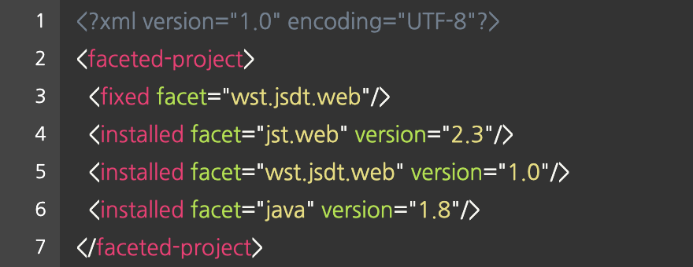
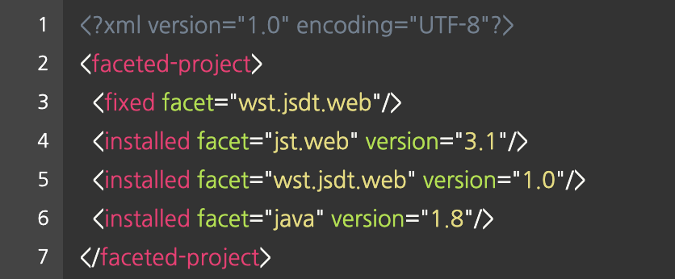
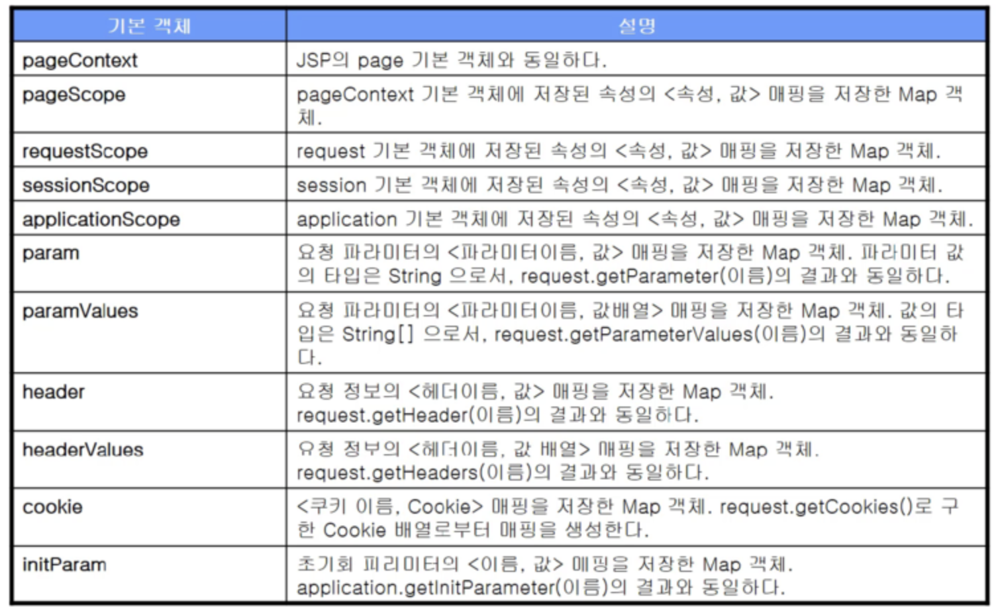

# EL 과 JSTL

<br>

## 1. EL (Expression Language)

### 1-1. EL (Expression Language) 이란 ?
- 값을 표현하는데 사용되는 스크립트 언어로서, JSP의 기본문법을 보완한다.
- 집합객체 Collecton 의 값을 쉽게 출력할 수 있다.
- 수치, 관계, 논리 연산자를 제공하여 함께 사용할 수 있다.
- 자바 클래스에서 메소드를 호출하는 기능을 제공한다.
- 문법 : ${expr}
  ```
  <jsp:include page=“/module/${skin.id}/header.jsp” flush=“true” />
  ${sessionScope.member.id} 님, 환영합니다.
  ```

- 다이나믹 웹 모듈 2.4 부터 EL 표기법 사용이 가능하다.

<br>

### 1-1-1. *이클립스에서 다이나믹 웹 모듈 버전 바꾸기*

  1. 이클립스 Navigator 를 연다.
  2. 해당 프로젝트 하위에 .settings 디렉토리가 있다.
  3. .settings/org.eclipse.wst.common.project.facet.core.xml 파일을 연다.

  

  4. 아래와 같이 버전을 수정한다.

  

  5. 이클립스를 재시작하면 적용된다.

<br>

### 1-2. EL 에서 연산자의 사용
- 수치 연산자
	 - `${10 + 1}` : 11 반환
	 - `${“10” + 1}` : 11  반환
	 - `${null + 1}` : 0 반환
	 - `${“hi” + 1}` : 에러 발생

- 비교 연산자
	 - `==` : eq
	 - `!=` : ne
	 - `<` : lt
	 - `>` : gt
	 - `<=` : le
	 - `>=` : ge
	 - `${str == “value”}` : str.compareTo(\“value\”) \=\= \0

- 논리 연산자
	 - `&&` : and
	 - `||` : or
	 - `!` : not

- empty 연산자, 비교선택 연산자
	 - empty \<value\>

### 1-3. EL 기본객체

  

<br>

### 1-4. EL 의 데이터 타입
- boolean
- int
- double
- String
	- 값에 포함된 ‘ ‘ 는 ₩ 과 함께 사용해야 한다. `₩’`
- ₩
	- ₩ 값은 ₩ 과 함께 사용해야 한다. `₩₩`
- null

<br>

### 1-5. EL 객체 접근 규칙 (문법)
- `${Map, key}` : Map의 key 에 해당하는 value 값을 반환한다.
- `${List, index}` : List(index) 값을 반환한다.
- `${array, index}` : array\[index\] 값을 반환한다.
- `${객체, 변수명}` : 해당 변수의 getter() 의 반환값을 반환한다.

<br>

### 1-6. EL 비활성화 하기
- JSP 에서 `<%@ page isELIgnored=“true” %>` 명시한다.
- isELIgnored 속성의 디폴트 값은 false 이다.

<br>

## 2. JSTL (JSP Standard Tag Library)

## 2-1. JSTL (JSP Standard Tag Library) 이란 ?
- JSTL 은 JSP 페이지에서 조건문, 반복문 처리를 html 태그 형태로 작성할 수 있게 도와주는 라이브러리이다.
- 프론트 개발자가 JSP를 수정하는데, JSP 안에 Java 코드와 html 코드가 섞여 있다면 수정할 때 굉장히 어려움을 느끼게 될 가능성이 크다.
- 이런 문제를 해결하기 위해서 등장한 것이 JSTL 이다.

<br>

## 2-2. JSTL 태그의 종류
- c : 코어
- x : xml
- fmt : 국제화
- sql : 데이터베이스
- fn : 함수

<br>

## 2-3. 코어태그 \<\c\: \>
- `<c:set>` : JSP 에서 사용할 변수 설정
- `<c:remove>` : 설정한 변수 제거
- `<c:if>` : 조건문
- `<c:choose>` : 다중 조건 처리
- `<c:forEach>` : Collection, Map 객체의 항목 처리
- `<c:forTokens>` : 구분자로 분리된 각각의 토큰 처리
- `<c:import>` : url 을 사용하여 다른 자원의 결과 삽입
- `<c:redirect>` : 지정한 경로로 리다이렉트
- `<c:url>` : url 재작성
- `<c:catch>` : 예외 처리
- `<c:out>` : JspWriter 에 내용을 알맞게 처리한 후 출력

<br>

## 2-4. \<\c\:set\> \<\c\:remove\>
- `<c:set var=“변수명” scope=“session” value=“value” />`
- `<c:set var=“변수명” scope=“request”> value </c:set>`
- `<c:remove var=“변수명” scope=“request” />`
- var : EL 에서 사용되는 변수명
- scope : 변수 값이 지정될 영역 (page, request, session, application)
- value : 값

<br>

## 3. EL (Expression Language) 과 JSTL 은 왜 필요할까?
 - 자바 코드를 잘 모르는 디자이너나 프론트 개발자가 JSP 페이지를 쉽게 볼 수 있도록 고안된 언어이다.
 - JSP 페이지를 더 직관적으로 표현할 방법이 없을까 라는 생각에서 출발했다.

<br>

<hr>

### Reference
 - edwith [부스트코스] 교육 자료
