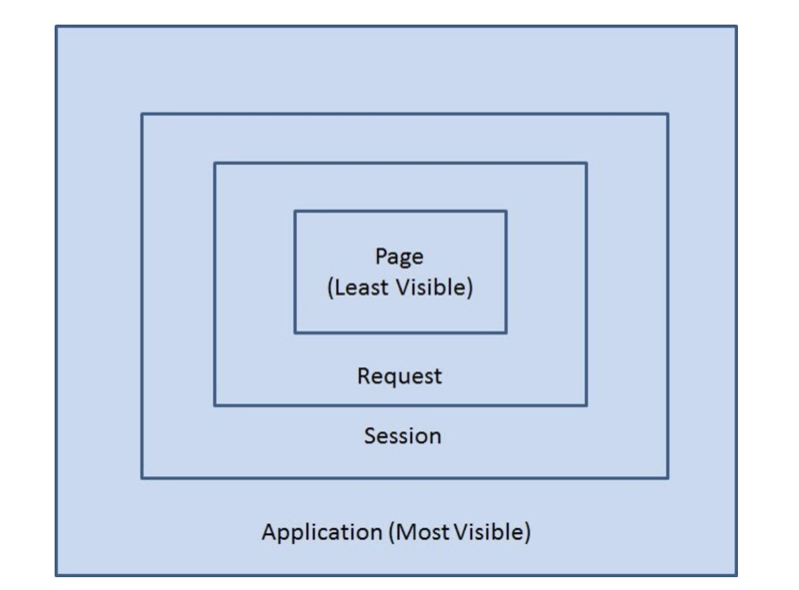

# Scope 란 ?

 

## 1. 객체의 Scope
- Application : 하나의 어플리케이션의 생성부터 소멸까지 유효
- Session : Session 객체의 생성부터 소멸까지 유효
- Request : 클라이언트로부터 요청을 받고 서버가 응답하기까지 유효
- Page : 객체가 선언된 페이지 내에서만 유효

 

## 2. Page scope
- PageContext 추상클래스를 사용한다.
- JSP 페이지 내에서 pageContext 라는 내장객체로 사용 가능하다.
	 - pageContext.setAttribute()
	 - pageContext.getAttribute()

- 포워드 되는 경우, 해당 페이지에서 page scope 으로 지정된 변수는 사용할 수 없다.
- 해당 JSP 나 서블릿이 실행되는 동안만 값을 유지하고 싶을 때 사용한다.
- 굳이 왜 사용할까 ? JSP 페이지 내에서 pageScope 에 값을 저장하고, EL 표기법 ${value}, JSTL 등에서 사용할 때 사용된다.

 

## 3. Request scope
- WAS 가 http 요청을 받고 브라우저에 응답할 때까지 변수값을 유지하고자 할 때 사용한다.
- 서블릿에서는 HttpServletRequest 객체를 사용한다.
- JSP 에서는 request 내장객체로 사용한다.
	 - request.setAttribute()
	 - request.getAttribute()

- 다른 페이지로 포워드 되는 경우에도 값이 유지된다.

 

## 4. Session scope
- 웹 브라우저 별로 변수를 관리하고자 할 때 사용한다.
- 브러우저 내 탭 간에도 세션이 공유되기 때문에, 같은 세션을 사용할 수 있다.
- HttpSession 인터페이스를 구현한 객체를 사용한다.
- JSP 에서는 session 내장객체를 사용한다.
- 서블릿에서는 HttpServletRequest 의 getSession() 메소드를 사용해서 session 객체를 얻는다.
	 - session.setAttribute()
	 - session.getAttribute()

 

## 5. Application scope
- 웹 어플리케이션 하나당 하나의 application 객체를 사용한다.
- 모든 클라이언트가 공통으로 사용해야 할 값이 있을 때 사용한다.
- ServletContext 인터페이스를 구현한 객체를 사용한다.
- JSP 에서는 application 내장객체를 사용한다.
- 서블릿에서는 getServletContext() 메소드를 사용해서 application 객체를 얻는다.
	 - application.setAttribute()
	 - application.getAttribute()

 

### Reference
 - edwith [부스트코스] 교육 자료
