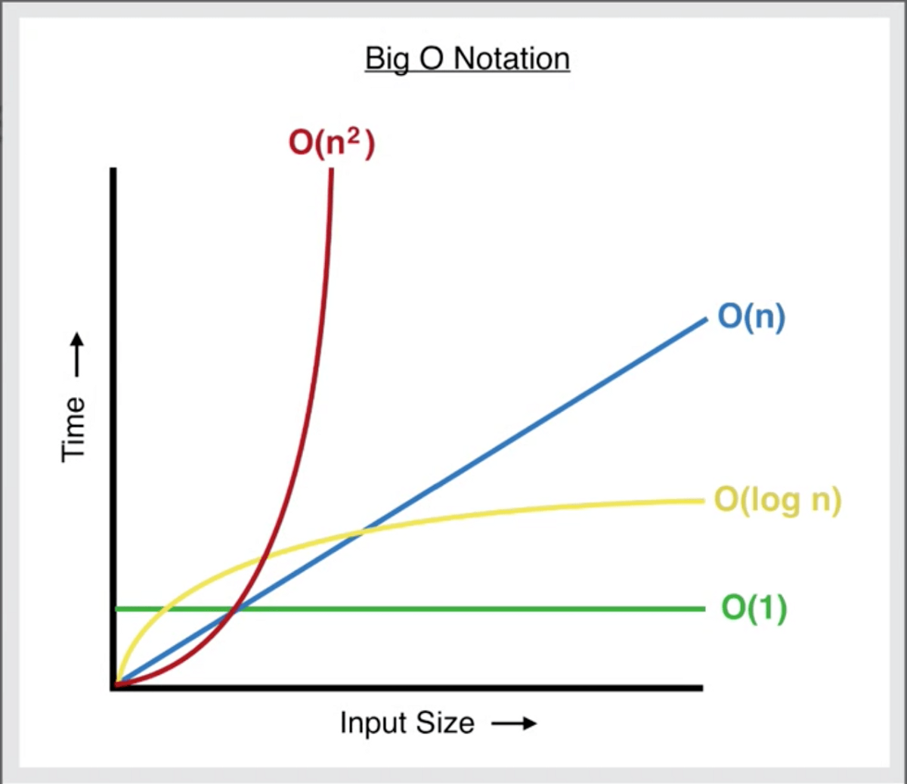

# 시간복잡도(Time Complexity)

<br>

## 시간복잡도(Time Complexity)

말 그대로 알고리즘이 문제를 해결하는데 소요되는 시간의 복잡도를 의미합니다. 더 정확하게는, 알고리즘의 시작부터 종료까지 연산의 횟수를 말하죠. 한편, 공간복잡도는 알고리즘의 시작부터 종료까지 필요한 기억장치(RAM)의 크기를 말합니다. 이렇게 알고리즘의 시간적/공간적 복잡도, 즉 문제를 해결하는데 드는 비용을 측정하여 알고리즘의 성능을 판단합니다.

<br>

아래의 예제를 통해 시간복잡도를 이해해볼게요.

```javascript
function check(arr, num) {
	arr.some((item) => item === num);
}
```

<br>

`arr`은 `[1, 2, 3, 4, 5, 6, 7, 8, 9]`, `num`의 값은 `1`이라고 가정해보세요. 이 경우 연산횟수는 `1`이 됩니다. 첫 번째 인덱스의 요소를 검사한 후 반복문이 중단될 테니까요. 반면 `num`의 값이 `9`라면, 연산횟수는 `9`가 됩니다. 마지막 인덱스까지 모두 검사해야 하니까요. 이 예제를 통해 우리는 다음과 같은 결론에 도달할 수 있습니다. 같은 알고리즘도 입력 데이터 값에 따라 시간복잡도가 달라집니다.

<br>

그럼, 특정 알고리즘의 시간복잡도를 이야기할 때 무엇을 기준으로 해야할까요? 보통 최선(Best), 평균(Average), 최악(Worst)의 경우로 나눈다고 합니다. 평균값이 가장 의미있어 보일 수 있지만, 알고리즘이 복잡하면 평균값을 계산하는 것이 어렵기 때문에 보통 최악의 경우를 많이 사용합니다.

<br>

위 예제의 시간복잡도는 최악의 경우, `2n`이 됩니다. 여기서 `n`은 배열의 길이(`arr.length`)입니다.

```javascript
arr.some((item) => item === num);
```

먼저 `some()` 메소드의 콜백함수가 `n` 번 호출되고요, `n` 번만큼 `item === num` 연산이 실행되겠죠? 따라서 총 연산의 횟수는 `2n`이 됩니다. 이를 Big O 표기법으로 표현하면 `O(n)`이 됩니다.

<br>

## Big O

Big O는 알고리즘의 시간복잡도를 표기하는 방법 중 하나입니다.

- `O(1)` : 상수 시간. 입력 데이터의 크기와 상관없이 언제나 일정한 시간이 걸림

- `O(logn)` : 로그 시간. 데이터가 커지면 커질 수록 효율이 극대화됨

- `O(n)` : 직선적 시간. 입력 데이터의 크기와 비례하여 시간이 걸림

- `O(n²)` : 2차 시간. Quadratic Time

- `O(C^n)` : 지수 시간. 주어진 상수값 C의 n 제곱

<br>



<br>

## `O(logn)`

```javascript
for (let i = 1; i <= n; i *= 2) {
	// i = 2⁰, 2¹, 2², 2³, 2⁴, ..
}
```

위 예제의 시간복잡도는 (최악의 경우) `log₂n + 1`입니다. Big O 표기법으로는 `O(logn)`이죠. `i`(`2^x`)의 값이 `n`이 되면 연산을 멈출테니까, `x` 값을 구하면 몇 번의 연산이 실행되는지 알 수 있겠죠. `x`의 값은 `log₂n`이 되겠고요. `let i = 1` 변수 초기화에 필요한 연산이 포함되므로, 시간복잡도는 최종적으로 `log₂n + 1`이 되죠.

<br>

> `2^x = 3`라는 식이 있다면, `x`의 값은 `log`를 사용해 구할 수 있습니다. `x = log₂3` 이렇게요. `logN`으로 표기되는 사용로그는 원래 `log₁₀N`입니다. `10` 표기가 생략된 것입니다.

<br>

아래의 예제도 마찬가지로 시간복잡도는 `O(logn)` 입니다.

```javascript
for (let i = n; i >= 1; i /= 2) {
	// i = .., 2⁴, 2³, 2², 2¹, 2⁰
}
```

<br>

## `O(n²)`

```javascript
// n + 1
for (let i = 1; i <= n; i++) {
	// n + 1
	for (let j = 1; j <= n; j++) {
		// ..
	}
}
```

이번에는 `for`문을 중첩시켰습니다. 시간복잡도는 `n² + 2n + 1`입니다. Big O 표기법으로는 `O(n²)`이고요.

<br>

---

### References

- [(번역) 알고리즘 쉽게 이해하기 : 시간 복잡도와 Big-O 표기](https://joshuajangblog.wordpress.com/2016/09/21/time_complexity_big_o_in_easy_explanation/)
- [자바스크립트로 알아보는 알고리즘 #1 시간 복잡도](https://falsy.me/%EC%9E%90%EB%B0%94%EC%8A%A4%ED%81%AC%EB%A6%BD%ED%8A%B8%EB%A1%9C-%EC%95%8C%EC%95%84%EB%B3%B4%EB%8A%94-%EC%95%8C%EA%B3%A0%EB%A6%AC%EC%A6%98-1-%EC%8B%9C%EA%B0%84-%EB%B3%B5%EC%9E%A1%EB%8F%84/)
- [[JS] Big-O 시간복잡도](https://velog.io/@760kry/Big-O)
- [Big-O (빅 오) 표기법](https://ko.khanacademy.org/computing/computer-science/algorithms/asymptotic-notation/a/big-o-notation)
