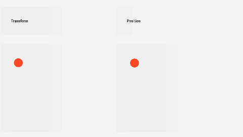
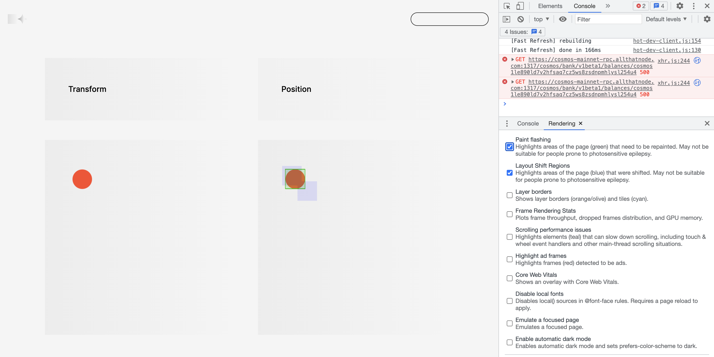
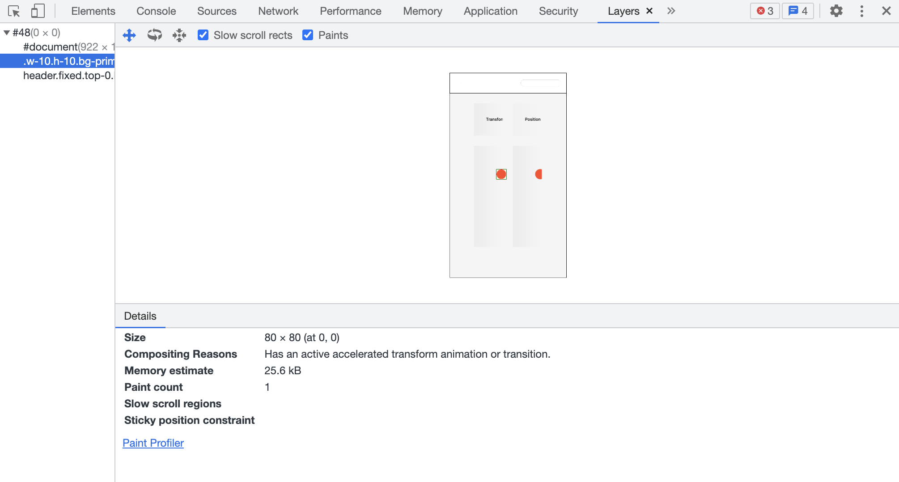
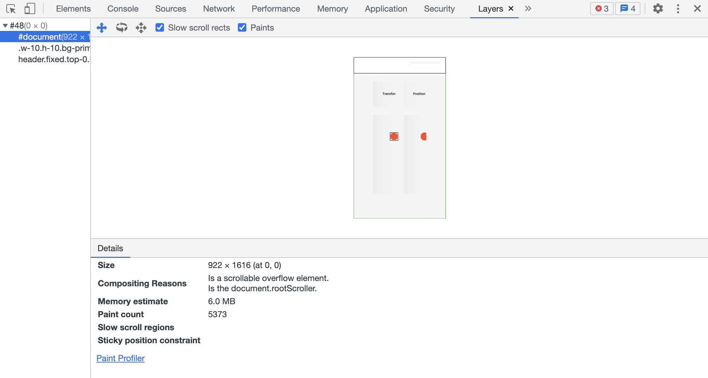
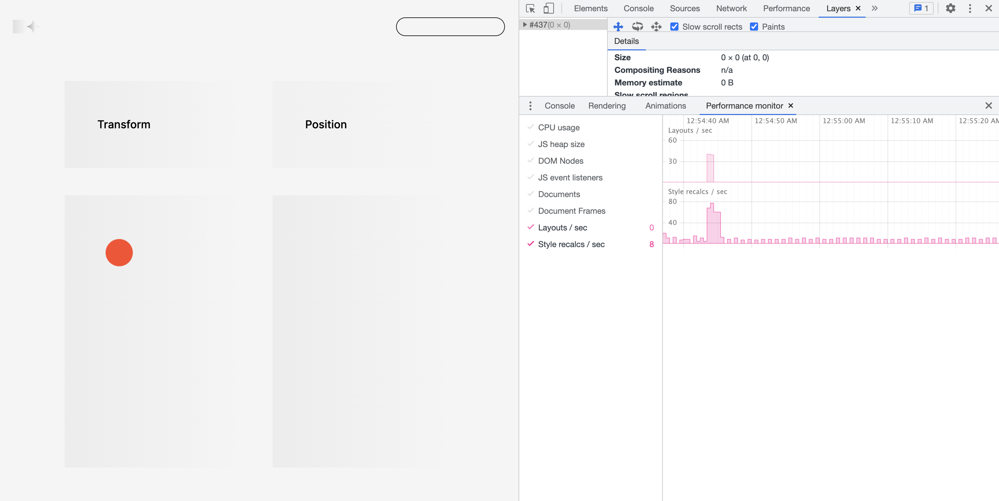
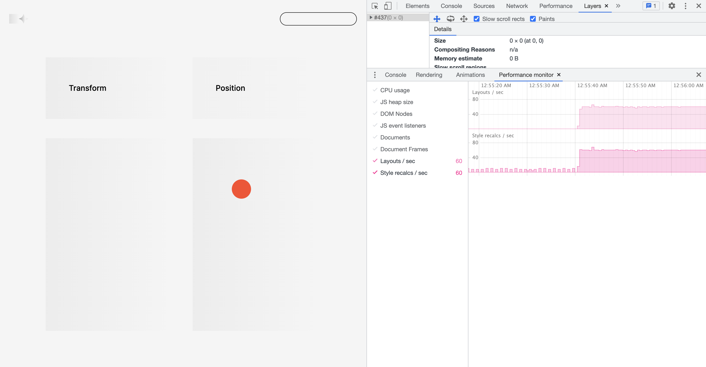

# CSS 애니메이션 성능 높이기: `transform`, `will-change`

1. CSS 애니메이션
2. 브라우저의 애니메이션 렌더링 과정: `top`보다 `transform`이 부드러운 이유
3. 애니메이션 성능 측정하기: Redering, Layers, Performance monitor
4. 브라우저에 힌트 주기: will-change
5. 접근성

 

## 1. CSS 애니메이션

[CSS 애니메이션](https://developer.mozilla.org/en-US/docs/Web/CSS/animation)은 `transition` 혹은 `animation` 속성을 사용해서 구현합니다. `transition`으로 모든 애니메이션을 구현하기는 어렵기 때문에 프레임을 여러 단계로 나눠서 아주 복잡한 애니메이션을 구현할 때는 `animation`을 사용합니다. 모든 속성에 적용 가능한 것은 아니기 때문에, 가능한 목록을 [CSS animated properties](https://developer.mozilla.org/ko/docs/Web/CSS/CSS_animated_properties)에서 확인해보면 헛수고를 줄일 수 있습니다.

 

언젠가 JavaScript보다는 CSS, `animation` 보다는 `transition` 속성을 사용하는 것이 성능에 좋다고 읽었던 적이 있습니다. 이제 잘 기억도 안나고ㅠ.ㅠ, 왜 그런지까지는 알아보지 못했기 때문에 이 글에서 정리해보겠습니다.

 

## 2. 브라우저의 애니메이션 렌더링 과정: `top`보다 `transform`이 부드러운 이유

### 2-1. `top`보다 `transform`

[Performance monitoring in CSS animations - Virendra Singh](https://medium.com/chegg/performance-monitoring-in-css-animations-f11a21d0054f) 블로그 글을 읽으며 이 주제에 대해 쉽게 접근할 수 있었습니다. 동일한 애니메이션을 하나는 `top`/`left`로 구현하고, 다른 하나는 `transform`을 사용해서 구현한 후 각각의 성능을 비교하는 내용의 글입니다. 다음은 직접 테스트해보기 위해 블로그 예제와 동일하게 두 가지를 렌더링해본 것입니다.

 

결론은, `transform`을 사용해서 구현한 것의 성능이 더 좋습니다. 이 글의 예제에서는 간단한 애니메이션을 구현하여 비교하다보니 사실 아주 뚜렷하게 체감되지는 않지만, 구현하려는 애니메이션이 무거운 경우 사용자들이 체감할 정도의 성능 차이가 날 수 있겠습니다. 이런 성능 차이가 나타나는 이유는 브라우저에서 애니메이션을 렌더링하는 원리 때문입니다.

 

### 2-2. 렌더링 순서

브라우저에서 화면에 결과물을 렌더링할 때, 다음의 순서대로 진행됩니다.

1. Recalculate Style: DOM 트리의 각 노드에 적용할 CSS 셀렉터를 찾고 스타일 계산
2. Layout: 요소의 레이아웃을 생성하고 화면에 배치하기 위한 좌표값 생성 (width, height, x, y)
3. Paint: 모든 픽셀 칠하기, GPU에서 비트맵을 사용하여 각 레이어(z-index) 칠함
4. Composite Layers: 위 단계에서 완성된 레이어들을 순서대로 쌓고, 한 화면에 렌더링
   - 이때 애니메이션 처리를 위한 별도의 레이어 생성, 애니메이션 요소와 이외 요소들의 리렌더링을 피하기 위함
   - 애니메이션이 일어나는 렌더링 객체 트리를 메모리에 유지하고, 다른 레이어 위에 얹을 수 있음

 

`transform` 속성을 사용하면, 위의 4단계에서 애니메이션 처리를 위한 별도의 레이어를 생성합니다. 애초에 애니메이션 처리를 위해 사용되는 속성이기 때문에 브라우저가 미리 애니메이션 처리를 위한 레이어를 생성하기 때문입니다. 하지만, `top`/`left`는 원래 애니메이션을 위한 속성이 아니다보니 별도의 레이어를 생성하지 않습니다. 따라서 `top`/`left` 값이 변하면 해당 레이어만 변경되지 않고, 노드가 속한 레이어 전체를 반복해서 리렌더링하게 됩니다.

 

### 2-3. 렌더링 Waterfall, CPU와 GPU

특히 브라우저의 렌더링 과정은 Waterfall 방식이라 성능에 영향을 미치는데요, 위 단계중 1단계를 다시 하게 되면, 그 뒤에 따라오는 2, 3, 4단계 모두 다시 진행됩니다. 예를 들어, 부모 노드의 `width`가 바뀌면 아마 2단계 레이아웃 조정 단계부터 3, 4단계가 이어서 다시 진행될 것으로 추측해볼 수 있습니다. 또한, 해당 노드의 렌더링만 다시 하는 것이 아닌 모든 자식 노드들의 렌더링도 다시 진행됩니다.

 

위의 1 ~ 3단계는 브라우저 메인 쓰레드에서 담당하고(CPU), 마지막 Composite Layers는 브라우저의 별도의 쓰레드에서 담당합니다(GPU). 그래픽을 최종적으로 연산해서 그리는 업무를 GPU에 위임하는 것이죠. 메인 쓰레드보다 Compositor 쓰레드를 활용하는 것이 성능에 좋고 사용자가 체감하는 애니메이션도 더 부드러운데요, 그래픽 연산에 특화된 GPU를 사용하기 때문입니다.

 

### 2-4. 애니메이션 주의사항 리스트

브라우저 렌더링 원리에 기반해서 애니메이션 구현시 명심할 것들을 리스트업해놓고, 실제 작업할 때 다시 들여다보면 좋을 것 같은데요. 다음과 같이 리스트업 해볼 수 있습니다.

- 렌더링 프로세스 Waterfall을 일으키는 상위 노드 애니메이션 피하기
- 다른 일들을 처리하느라 바쁜 메인쓰레드 사용 피하기
- 가능하면 GPU를 사용하는 Compositor 쓰레드만 사용하기

 

## 3. 애니메이션 성능 측정하기: Redering, Layers, Performance monitor

위에서 설명한 내용들이 맞는지, Chrome 개발자도구를 사용해서 직접 애니메이션 성능 측정이 가능합니다.

 

### 3-1. Rendering

개발자도구의 Rendering 탭을 열어서 다음 사항들을 확인할 수 있습니다. 개발자도구의 더보기 아이콘을 클릭하고 More Tools를 선택하면 Rendering 탭을 추가할 수 있습니다.

1. Paint flashing에 체크하면 다시 페인팅된 영역이 녹색으로 표시됩니다.
2. Layout Shift Regions에 체크하면 실제로 움직인 영역이 파란색으로 표시됩니다.

 

 

`top`/`left`를 사용해서 구현한 곳만 녹색과 파란색으로 표시됩니다.

 

### 3-2. Layers

Layers 탭에서도 확인할 수 있는데요, 이 탭은 원래 `z-index`에 대응되는 페이지의 렌더링 레이어를 볼 수 있는 곳이죠. 각 레이어를 클릭해서 상세 내용을 확인할 수 있고요, Transform을 사용한 곳은 Paint count가 1인 반면, Position을 사용한 곳은 Paint count가 계속 올라가는 것을 확인할 수 있습니다.

 

 

### 3-3. Performance monitor

Performance monitor 탭에서는 Layout, Style recalcs 단계에서 각각 몇초가 걸렸는지 확인할 수 있습니다. Transform/Position을 사용한 곳을 각각 렌더링해보면서 확인하면 되는데요, 재밌네요 🫢 Position을 사용한 곳에서 Style 계산에 소요된 시간을 보면 6배 정도 더 느린 것을 알 수 있고요, 레이아웃이 무한으로 계속 재생성되고 60초 정도가 걸리는 것을 확인할 수 있었습니다.

 

1. Transform

 

2. Position

 

## 4. 브라우저에 힌트 주기: will-change

CSS의 `will-change` 속성을 사용하는 방법이 있습니다. 노드에 이 속성을 지정함으로써 브라우저에 해당 노드가 변화할 것임을 미리 알려주는 것인데요, 이렇게 힌트를 주면 브라우저는 해당 노드가 변화하기 전에 미리 적절한 최적화 작업을 합니다. 특히 성능 문제가 우려되는 무거운 애니메이션을 구현할 때 `will-change` 속성을 사용하면, 브라우저에서 미리 실행시킴으로써 실제 변형이 일어날 때 페이지의 반응성을 증가시킬 수 있습니다.

 

[MDN 문서](https://developer.mozilla.org/en-US/docs/Web/CSS/will-change)를 보면, `will-change` 사용시 주의사항에 대해 꽤나 자세하게 안내하고 있습니다. 남용하다보면 브라우저에서 너무 많은 노드에 대해 항상 최적화 준비를 해야하기 때문에 오히려 전체 성능에 악영향을 주는 역효과를 볼 수 있기 때문이겠죠. 주의사항 몇가지를 요약해서 가져왔습니다.

- 스타일시트에 고정으로 지정하기 보다는, JavaScript를 사용해서 변화 전후로 `will-change`를 추가하고 제거해주는 것이 좋습니다.
- 아직 성능 문제가 없다면, 약간의 최적화를 위해 `will-change`를 사용하지 않습니다. 성능 문제가 발생했을 때 마지막 수단으로 사용하세요.
- 변화를 예상할 수 있는 지점을 정의하고, 미리 `will-change` 설정을 추가해서 브라우저가 최적화 작업할 시간을 확보하세요.

 

## 5. 접근성

마지막으로.. 성능과는 관련이 없지만, 애니메이션 구현시 [접근성 고려사항](https://developer.mozilla.org/en-US/docs/Web/CSS/animation#accessibility_concerns)이 있습니다. 깜빡이는 애니메이션의 경우 인지 문제가 있는 사람들에게 문제가 되거나, 사람들에게 건강상 문제를 일으킬 수 있으므로 주의해야한다는 내용입니다. 별도로 다룰 정도의 양은 아니어서 이 글에 살짝 추가해보았습니다.

 

---

### References

- [Performance monitoring in CSS animations](https://medium.com/chegg/performance-monitoring-in-css-animations-f11a21d0054f)
- [Animations: Inspect and modify CSS animation effects | Chrome Developers](https://developer.chrome.com/docs/devtools/css/animations/)
- [Animation Performance 101: Browser Under the Hood](https://www.viget.com/articles/animation-performance-101-browser-under-the-hood/)
