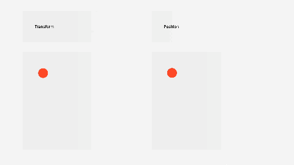

# CSS 애니메이션 성능 높이기: `transform`, `will-change`

1. CSS 애니메이션
2. 브라우저에서 애니메이션을 렌더링하는 원리: `top`보다 `transform`이 부드러운 이유

 

## 1. CSS 애니메이션

[CSS 애니메이션](https://developer.mozilla.org/en-US/docs/Web/CSS/animation)은 `transition` 혹은 `animation` 속성을 사용해서 구현합니다. `transition`으로 모든 애니메이션을 구현하기는 어렵기 때문에 프레임을 여러 단계로 나눠서 아주 복잡한 애니메이션을 구현할 때는 `animation`을 사용합니다. 모든 속성에 적용 가능한 것은 아니기 때문에, 가능한 목록을 [CSS animated properties](https://developer.mozilla.org/ko/docs/Web/CSS/CSS_animated_properties)에서 확인해보면 헛수고를 줄일 수 있습니다.

 

언젠가 JavaScript보다는 CSS, `animation` 보다는 `transition` 속성을 사용하는 것이 성능에 좋다고 읽었던 적이 있습니다. 이제 잘 기억도 안나고ㅠ.ㅠ, 왜 그런지까지는 알아보지 못했기 때문에 이 글에서 정리해보겠습니다.

 

## 2. 브라우저에서 애니메이션을 렌더링하는 원리: `top`보다 `transform`이 부드러운 이유

### 2-1. `top`보다 `transform`

[Performance monitoring in CSS animations - Virendra Singh](https://medium.com/chegg/performance-monitoring-in-css-animations-f11a21d0054f) 블로그 글을 읽으며 이 주제에 대해 쉽게 접근할 수 있었습니다. 동일한 애니메이션을 하나는 `top`/`left`로 구현하고, 다른 하나는 `transform`을 사용해서 구현한 후 각각의 성능을 비교하는 내용의 글입니다. 다음은 직접 테스트해보기 위해 블로그 예제와 동일하게 두 가지를 렌더링해본 것입니다.

 

결론은, `transform`을 사용해서 구현한 것의 성능이 더 좋습니다. 이 글의 예제에서는 간단한 애니메이션을 구현하여 비교하다보니 사실 아주 뚜렷하게 체감되지는 않지만, 구현하려는 애니메이션이 무거운 경우 사용자들이 체감할 정도의 성능 차이가 날 수 있습니다. 이런 성능 차이가 나타나는 이유는 브라우저에서 애니메이션을 렌더링하는 원리때문입니다.

 

### 2-2. 브라우저의 렌더링 순서

브라우저에서 화면에서 결과물을 렌더링할 때, 다음의 순서대로 진행됩니다.

1. Recalculate Style: DOM 트리의 각 노드에 적용할 스타일 계산
2. Layout: 요소의 레이아웃을 생성하고 화면에서 배치하기 위한 좌표값 배정
3. Paint: 생성된 모든 레이아웃에 픽셀 추가, GPU에서 비트맵을 사용하여 각 레이어를 그림
4. Composite Layers: 생성한 레이어 계층들을 합하며 실제 화면에 렌더링
   - 이때 애니메이션 처리를 위한 별도의 레이어 생성, 애니메이션 요소와 이외 요소들의 리렌더링을 피하기 위함
   - 애니메이션이 일어나는 렌더링 객체 트리를 메모리에 유지하고, 다른 레이어 위에 얹을 수 있음

 

`transform` 속성을 사용하면, 위의 4단계에서 애니메이션 처리를 위한 별도의 레이어를 생성합니다. 애초에 애니메이션 처리를 위해 사용되는 속성이기 때문입니다. 하지만, `top`/`left`는 애니메이션을 위한 속성이 아니다보니 별도의 레이어를 생성하지 않습니다. 따라서 하나의 레이어 전체를 반복해서 리렌더링하게 됩니다.

 

## 접근성

성능과는 관련이 없지만, 애니메이션 구현시 [접근성 고려사항](https://developer.mozilla.org/en-US/docs/Web/CSS/animation#accessibility_concerns)이 있습니다. 깜빡이는 애니메이션의 경우 인지 문제가 있는 사람들에게 문제가 되거나, 사람들에게 건강상 문제를 일으킬 수 있으므로 주의해야한다는 내용입니다.

 

---

### References

- [Performance monitoring in CSS animations](https://medium.com/chegg/performance-monitoring-in-css-animations-f11a21d0054f)
