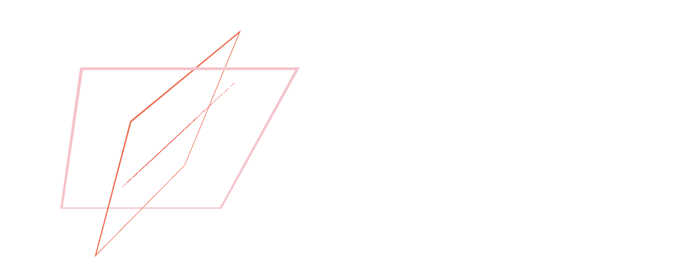

# 애니메이션(Animation)

<br>

## 목차

1. `transition`

2. `transition-timing-function`

3. `transform`

4. `transform` - 변형 함수(Transform Function)

5. 기타 변형 속성

6. `animation`

7. `@keyframes`

<br>

## 1.`transition`

CSS 속성의 시작 값, 종료 값을 지정하여 전환되는 과정을 애니메이션으로 구현하는 속성입니다. `transition`은 아래 속성들의 단축 속성입니다.

- `transition-property` : 대상 속성 / 기본값 `all`

- `transition-duration` : 전환 지속 시간 / 기본값 `0s`

- `transition-timing-function`: 타이밍 함수

- `transition-delay` : 전환 대기 시간 / 기본값 `0s`

<br>

시간을 지정하는 `transition-duration`, `transition-delay` 속성의 값은 단위로 `s`/`ms`를 사용할 수 있습니다.

<br>

### 문법

```
transition: property duration timing-function delay;
```

<br>

### 예시

아래는 간단한 예시입니다.

```css
.box {
	width: 100px;
	height: 100px;
	background-color: FloralWhite;
	border: 3px solid FireBrick;
	transition: width 1s, background-color 1s;
}

.box:hover {
	width: 300px;
	background-color: Gainsboro;
}
```

<br>

## 2. `transition-timing-function`

아래는 대표적으로 가능한 값의 목록입니다.

- `linear` : 일정하게 / 기본값

- `ease` : 빠르게 → 느리게

- `ease-in` : 느리게 → 빠르게

- `ease-in-out` : 느리게 → 빠르게 → 느리게

- `cubic-bezier(n, n, n, n)` : 커스텀 값 / `n`: `0`-`1`

  > 다양한 애니메이션 형태를 이 함수를 이용해 구현할 수 있습니다. [Easing functions Cheat Sheet](https://easings.net/)에서 확인하세요.

- `steps(n)` : 전환 과정을 `n`번 분할하여 단편적으로 보여줌

<br>

> [transition-timing-function | MDN](https://developer.mozilla.org/en-US/docs/Web/CSS/transition-timing-function)

<br>

## 3. `transform`

요소를 변형시키는 속성이고요, CSS 시각적 서식 모델(Visual Formatting Model)의 좌표 공간을 변경합니다. [변형 가능한 요소에만 `transform` 속성을 지정할 수 있다](https://developer.mozilla.org/ko/docs/Web/CSS/transform#%EB%B3%80%ED%98%95%20%EA%B0%80%EB%8A%A5%ED%95%9C%20%EC%9A%94%EC%86%8C%EB%A7%8C)는 점에 주의하세요.

<br>

## 4. `transform` - 변형 함수(Transform Function)

`transform` 속성의 값으로는 [변형 함수](https://developer.mozilla.org/en-US/docs/Web/CSS/transform-function)를 지정합니다. 변형 함수는 2D 또는 3D 공간 내에서 요소를 회전하고, 크기를 바꾸고, 왜곡하고, 이동할 수 있습니다.

<br>

### 1) 2D 변형 함수

크게 4 가지 변형(이동, 크기, 회전, 기울임)을 지정합니다.

<br>

#### Translate

- `translateX(x)`: X축 이동

- `translateY(y)`: Y축 이동

- `translate(x, y)`: `translateX(x)` + `translateY(y)` 단축 속성

#### Scale

- `scaleX(x)`: X축 크기 변경 / 단위 : (배수)

- `scaleY(y)`: Y축 크기 변경

- `scale(x, y)`: 단축 속성

#### Rotate

- `rotate(r)`: 회전 / 단위 : `deg`

#### Skew

- `skewX(x)`: X축 기울임 / 단위 : `deg`

- `skewY(y)`: Y축 기울임

- `skew(x-deg, y-deg)`: X축 이동

#### 단축

- `matrix(n, n, n, n, n, n)` : 위의 4 가지 변형(이동, 크기, 회전, 기울임) 단축 속성
  > 위의 일반 함수들을 사용하여 CSS를 작성하더라도, 브라우저는 `matrix` 함수로 변환하여 변형을 계산합니다.

<br>

> `tanslate(x, y)` 함수의 경우 `position` 속성을 사용해서 요소를 동일한 위치로 이동시킬 수 있습니다. 이 둘의 차이는 무엇일까요? 근본적으로 `position` 속성은 요소를 배치하기 위해 만들어진 속성이고, `tanslate(x, y)`는 요소를 이동시키기 위해 만들어진 속성입니다. 이는 변형 함수인 `tanslate(x, y)`를 사용하는 것이 애니메이션 구현에 최적화된 방법이라는 의미입니다. `position` 속성을 이용하여 애니메이션을 어떻게든 구현할 수는 있겠지만, 렌더링 과정에서 브라우저에 부담을 주기 때문에 각 속성의 목적에 맞게 사용하는 것이 좋습니다.

<br>

### 2) 3D 변형 함수

#### Translate

- `translate3d(x, y, z)`: 각 축 이동

- `translateZ(z)`: Z축 이동

#### Scale

- `scale3d(x, y, z)`: 각 축 크기 변경 / 단위 : (배수)

- `scaleZ(z)`: Z축 크기 변경

#### Rotate

- `rotateX(x)`: X축을 중심으로 회전 / 단위 : `deg`

- `rotateY(y)` : Y축을 중심으로 회전

- `rotateZ(z)` : Z축을 중심으로 회전

- `rotate3d(x, y, z, a)` : 단축 속성

#### Perspective(원근법)

- `perspective(n)` : 원근법 지정 (거리)
  > `transform` 속성에서 여러 변형 함수를 함께 사용할 때 가장 앞단에 작성해야 적용된다는 점에 주의하세요.

#### 단축

- `matrix3d(n, n, n, n, n, n, n, n, n, n, n, n, n, n, n, n)` : 위의 변형(이동, 크기, 회전, 원근) 단축 속성

<br>

#### 예시

아래는 이미지에 마우스를 올렸을 때 Y축을 중심으로 `180deg` 회전시키는 예시입니다.

```css
img {
	width: 300px;
	border: 1px solid lightgrey;
	transition: 1s;
}

img:hover {
	transform: perspective(500px) rotateY(180deg);
}
```

<br>

## 5. 기타 변형 속성

아래는 변형과 관련된 속성 목록입니다.

- `transform-origin` : 변형의 기준점

- `transform-style` : 변형 요소의 자식 요소도 변형시킬지 여부

- `perspective` : 하위 요소를 관찰할 원근 거리

- `perspective-origin` : 원근 거리의 기준점

- `backface-visibility` : 변형으로 인해 노출된 요소의 뒷면(반전된 모습) 숨김 여부

<br>

다음은 예시 코드입니다.

```css
.container {
	padding: 70px;
	perspective: 500px;
	/* 원근 거리를 관찰하는 지점을 요소의 가운데로 지정하기 위해 요소의 너비와 일치시킴, 
	기본값은 뷰포트 너비이고 이는 뷰포트의 중앙을 의미 */
	width: 200px;
}

.grand {
	width: 200px;
	border: 3px solid pink;
	transform: rotateX(-45deg);
	transform-style: preserve-3d;
}

.parent {
	width: 200px;
	border: 3px solid tomato;
	transform: rotateY(45deg);
	transform-style: preserve-3d;
}

img {
	width: 200px;
	transform: rotateX(-20deg);
}
```

<br>

대략 아래와 같은 렌더링 결과를 얻을 수 있고요, 각 속성은 다음 소주제들에서 하나씩 설명할게요.


<br>

### `transform-origin`

아래는 `transform-origin` 속성 값을 지정하는 기본 형식이고요, 기본값은 `50% 50% 0` 입니다.

```
transform-origin: x y z;
```

<br>

예를 들어 아래와 같이 작성하면,

```css
img {
	transform-origin: 100%;
}

img:hover {
	transform: rotate(45deg);
}
```

이미지에 마우스를 올렸을 때 `45deg` 회전하는데요, `100% 50% 0` 지점을 기준으로 회전하게 됩니다.

<br>

```css
img {
	transform-origin: 100% 100%;
}
```

위와 같이 기준점을 수정하면, `100% 100% 0` 지점, 즉 요소의 우측 하단을 기준으로 회전하죠.

<br>

### `transform-style`

다음을 값으로 할 수 있습니다.

- `flat` : 3D 변형된 요소의 자식 요소의 3D 변형 불허 / 기본값

- `preserve-3d` : 3D 변형된 요소의 자식 요소의 3D 변형 허용

<br>

### `perspective`

<strong>하위 요소</strong>를 관찰할 원근 거리를 지정하는 속성입니다. 따라서 3D 변형을 관찰할 요소들의 상위 요소에 이 속성을 지정해야 합니다.

<br>

#### `transfrom: perspective()` 함수와의 차이점

`transfrom: perspective()` 함수는 변형 요소에 직접 지정하고, 기준점은 `transform-origin` 속성에 지정합니다. `perspective` 속성은 변형 요소의 상위 요소에 지정하고, 기준점은 `perspective-origin` 속성에 지정합니다. `perspective` 속성은 변형을 관찰하려는 요소가 여러 개일 때 사용합니다.

<br>

### `perspective-origin`

원근 거리의 기준점을 지정합니다. 기본값은 `50% 50%`이며, 각각 X축, Y축에서의 위치를 의미합니다.

위에서 보았던 예시 CSS에 아래의 속성을 추가하면, 하위 요소들을 바라보는 기준점의 X축 위치가 `50%`에서 `0`으로 바뀝니다. 즉, 요소의 정중앙이 아닌 왼쪽에서 해당 요소를 관찰하게 되는데요. 렌더링 결과와 함께 확인해보세요.

```css
.pers {
	perspective-origin: 0 50%;
}
```



<br>

### `backface-visibility`

값으로 올 수 있는 것들은 매우 단순합니다.

- `visible`

- `hidden`

<br>

아래 이미지에 마우스를 올렸을 때 이미지가 Y축을 중심으로 `180deg` 회전하도록 해볼게요.


<br>

이렇게 CSS를 작성하면 되겠죠?

```css
img {
	width: 150px;
	transition: 1s;
}

img:hover {
	transform: rotateY(180deg);
}
```

<br>

실제로 마우스를 올리면 아래와 같이 이미지가 회전되어 반전된 모습이 됩니다.


이때 반전된 모습, 즉 이미지의 뒷면이 보이는 이유는 `backface-visibility` 속성의 기본값이 `visible`이기 때문입니다. 반면, `backface-visibility` 속성 값을 `hidden`으로 명시하면 뒷면이 숨겨집니다.

<br>

## 6. `animation`

`animation`은 다음 속성들의 단축 속성입니다. `@keyframes`로 지정한 애니메이션의 동작을 지정하는 속성인데요, 즉 `@keyframes` 규칙으로 선언한 애니메이션이 있어야 사용할 수 있죠.

- `animation-name` : `@keyframes`의 이름 / 기본값 `none`

- `animation-duration` : 지속 시간 / 기본값 `0s`

- `animation-timing-function` : 타이밍 함수 / 기본값 `ease`

- `animation-delay` : 대기 시간 / 기본값 `none`

  > 음수 값을 사용하면 해당 시간만큼 애니메이션의 일부를 생략할 수 있습니다.

- `animation-iteration-count` : 반복 횟수 / 기본값 `1`

  - `1`, `2`, ..
  - `infinite`

- `animation-direction` : 반복 방향 / 기본값 `normal`

  - `normal` : 정방향
  - `reverse` : 역방향
  - `alternate` : 왕복
  - `alternate-reverse` : 역방향 왕복

- `animation-fill-mode` : 애니메이션 전후 상태 / 기본값 `none`

  - `none`
  - `forwards` : 애니메이션이 끝나는 위치에 머무름
  - `backwards` : 애니메이션이 시작하는 위치에서 대기함
  - `both` : `forwards` + `backwards`

- `animation-play-state` : 재생, 정지 설정 / 기본값 `running`
  - `running`
  - `paused`

<br>

아래는 작성 형식(순서)이고요, `animation-name`, `animation-duration` 2 가지는 필수값입니다.

```
animation: name duration timing-function delay iteration-count direction fill-mode play-state;
```

<br>

아래는 간단한 예시입니다.

```css
.box {
	width: 100px;
	height: 100px;
	background: pink;
	animation: sample 2s linear infinite both;
}

/* @keyframes 규칙(Rule) */
@keyframes sample {
	0% {
		width: 200px;
	}
	100% {
		width: 50px;
	}
}
```

<br>

## 7. `@keyframes`

`@keyframes`은 애니메이션의 중간 단계를 지정할 때 사용합니다. `transition` 속성보다 정교하게 애니메이션의 중간 단계들을 컨트롤 할 수 있습니다. 아래와 같이 애니메이션의 각 단계에서 요소가 어떻게 보일지 지정할 수 있죠.

```css
@keyframes slidein {
	from {
		margin-left: 100%;
		width: 300%;
	}

	to {
		margin-left: 0%;
		width: 100%;
	}
}
```

이때 CSS 속성들을 지정한 각 단계를 Frame이라고 하며, 이 Frame들을 `@keyframes`로 묶어 이름을 부여합니다. 위에서는 2 개 Frame들을 묶어 `slidein`이라는 이름을 정해주었네요. 이렇게 묶은 `@keyframes`는 `animation` 속성을 이용하여 실제 애니메이션 효과를 구현합니다.

각 프레임은 애니메이션이 진행되는 순서대로 나열 가능하며, `%`로 각 단계를 나타낼 수 있습니다.

<br>

---

### Reference

- [transition | MDN](https://developer.mozilla.org/en-US/docs/Web/CSS/transition)
- [transition-timing-function | MDN](https://developer.mozilla.org/en-US/docs/Web/CSS/transition-timing-function)
- [transform | MDN](https://developer.mozilla.org/en-US/docs/Web/CSS/transform)
- [\<transform-function\> | MDN](https://developer.mozilla.org/en-US/docs/Web/CSS/transform-function)
- [\@keyframes | MDN](https://developer.mozilla.org/en-US/docs/Web/CSS/@keyframes)
