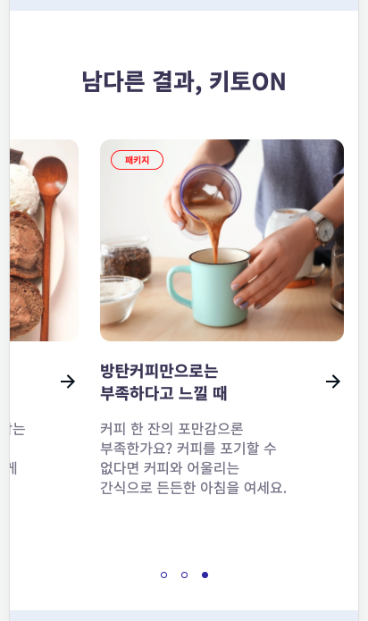

# VFM(Visual Formatting Model)

<br>

1. VFM(Visual Formatting Model)이란
2. 스크롤 영역의 오른쪽/왼쪽 여백이 무시되는 이유: Overflow, Over-constrained, 유효한 여백주기

<br>

## 1. VFM(Visual Formatting Model)이란

[VFM(Visual Formatting Model)](https://www.w3.org/TR/CSS22/visudet.html)은 브라우저에서 CSS를 해석한 결과에 기반하여 어떻게 DOM 트리를 렌더링 해야하는지를 정의한 서식 모델입니다. VFM에서 DOM 트리의 모든 요소들은 기본적으로 [박스 모델](https://www.w3.org/TR/CSS22/box.html)에 따라 박스들을 생성하고요, 각 박스의 레이아웃은 다음의 요인들에 의해 결정됩니다.

- 박스 종류(Box Type), 높이/너비 등 사이즈

- 포지셔닝 규칙(Positioning Schemes)

  - Normal flow
  - Floats
  - Absolute positioning

- 박스간의 관계

- 외부 환경 ([뷰포트(Viewport)](https://developer.mozilla.org/en-US/docs/Glossary/Viewport) 사이즈, 이미지 크기(intrinsic dimensions of images) 등)

<br>

### 뷰포트(Viewport)

VFM이 워킹하는 영역, 즉 화면이 렌더링되는 영역을 뷰포트라고 합니다. 뷰포트는 브라우저 창에서 실제 콘텐츠가 보여지는 영역을 말하고요. 가령, 브라우저 창의 크기를 줄이거나, 모바일 기기의 방향을 바꾸면 뷰포트의 가로/세로 사이즈가 변경됩니다. 이렇게 변경되는 뷰포트의 사이즈는 페이지의 레이아웃에 영향을 줍니다.

<br>

뷰포트의 크기가 HTML 문서의 크기보다 작더라도 브라우저는 스크롤과 같이 문서의 나머지 부분을 탐색할 수 있는 방법을 제공합니다. 보통은 위에서 아래로 스크롤하게 되는데, 이는 블록(Block) 요소들이 배치되는 방향입니다. 반면, 왼쪽에서 오른쪽, 오른쪽에서 왼쪽으로 스크롤이 되도록 디자인할 수 있는데, 이는 인라인(Inline) 요소들이 배치되는 방향입니다.

<br>

## 2. 스크롤 영역의 오른쪽/왼쪽 여백이 무시되는 이유: Overflow, Over-constrained, 유효한 여백주기

특정 영역 내에서 요소들을 가로 방향으로 스크롤하여 탐색할 수 있는 UI를 개발한다고 가정해보겠습니다. 이때 요소들을 담고있는 컨테이너 박스에는 다음과 같이 CSS 속성을 지정하게 됩니다.

```css
.container {
	overflow: auto visible;
	scroll-behavior: smooth;
	-webkit-overflow-scrolling: touch;
}
```

<br>

그 다음, 양옆에 여백을 주기 위해 흔하게 시도하는 방법은 다음의 2가지일 것입니다.

- 컨테이너 박스의 양옆에 `padding` 값 지정
- 또는 첫 번째, 마지막 요소에 `margin-left`, `margin-right` 값 지정

<br>

이제 우리는 해당 영역에서 스크롤을 했을 때 다음과 같이 여백이 적용된 모습을 기대하게 됩니다. 하지만 예상과 달리 `padding`이던 `margin`이던 여백 값은 무시됩니다.



사진출처 : [닥터밀로](https://meallo.co.kr)

<br>

### 2-1. Overflow

먼저, 컨테이너 박스의 양옆 `padding` 값이 무시되는 이유는 `overflow` 속성이 지정된 컨테이너 박스 내부가 어떻게 렌더링될지는 포함된 요소들의 콘텐츠에 의해 결정되기 때문입니다. 그러니까, 컨테이너 박스 내부에 지정된 `padding` 값은 완전히 무시됩니다.

<br>

다음은 W3C Workding Draft [11.1.1 Overflow: the 'overflow' property](https://www.w3.org/TR/CSS22/visufx.html#overflow) 섹션에서 발췌한 설명입니다.

> This property specifies whether content of a block container element is clipped when it overflows the element's box.

<br>

### 2-2. Over-constrained

컨테이너 박스 내에서 요소들이 왼쪽에서 오른쪽 방향으로 배치되어 있다면 `margin-right` 값이 무시됩니다. 반대 방향으로 배치되어 있다면 `margin-left` 값이 무시되고요. 이는 컨테이너에 포함된 요소들의 크기와 여백 값들이 (개발자의 일반적인 의도와는 달리) 지나치게 통제되었다고(over-constrained) 보기 때문에 브라우저가 가장 마지막 요소의 오른쪽 마진 값을 무시하기 때문입니다.

<br>

W3C Working Draft의 [Visual formatting model details](https://www.w3.org/TR/CSS22/visudet.html) 문서의 [10.3.3 Block-level, non-replaced elements in normal flow](https://www.w3.org/TR/CSS22/visudet.html#blockwidth) 섹션을 보면, 컨테이너 블록의 `width`는 다음 등식에 따라 결정됩니다.

<br>

> 'margin-left' + 'border-left-width' + 'padding-left' + 'width' + 'padding-right' + 'border-right-width' + 'margin-right' = width of containing block

<br>

이어지는 단락에서 `over-constrained` 개념을 언급하면서 다음과 같이 설명합니다.

- 컨테이너 박스를 구성하는 모든 요소의 `width` 값이 `auto`가 아니고, 요소들의 `width` 값 총합이 컨테이너 박스보다 클 때 `margin-left` 또는 `margin-right` 값은 지정된 값이 아닌 `0`이 적용됨
- 이는 요소들의 크기가 지나치게 통제되었다고 보기 때문임

<br>

> If 'width' is not 'auto' and 'border-left-width' + 'padding-left' + 'width' + 'padding-right' + 'border-right-width' (plus any of 'margin-left' or 'margin-right' that are not 'auto') is larger than the width of the containing block, then any 'auto' values for 'margin-left' or 'margin-right' are, for the following rules, treated as zero.
> If all of the above have a computed value other than 'auto', the values are said to be "over-constrained" and one of the used values will have to be different from its computed value. If the 'direction' property of the containing block has the value 'ltr', the specified value of 'margin-right' is ignored and the value is calculated so as to make the equality true. If the value of 'direction' is 'rtl', this happens to 'margin-left' instead.

<br>

참고로, 같은 [블록 서식 컨텍스트(Block Formatting Context)](https://developer.mozilla.org/en-US/docs/Web/Guide/CSS/Block_formatting_context) 내에서 박스간 중복되는 마진 값이 Collapse 되는 것과는 전혀 다른 개념입니다.

<br>

### 2-3. 유효한 여백주기

여백을 반드시 주어야한다면, 첫번째 또는 마지막 요소에 `border-left`, `border-right` 속성을 사용하는 트릭을 사용할 수 있습니다. 예를 들어, 마지막 요소에 다음과 같이 투명한 `border`를 부여할 수 있겠습니다.

```css
.scroll-item:last-child {
	border-right: 16px solid transparent;
	box-sizing: content-box;
}
```

<br>

StackOverflow의 [Last margin / padding collapsing in flexbox / grid layout](https://stackoverflow.com/questions/38993170/last-margin-padding-collapsing-in-flexbox-grid-layout) 페이지가 도움이 되었습니다.

<br>

---

### References

- [Visual formatting model | MDN](https://developer.mozilla.org/en-US/docs/Web/CSS/Visual_formatting_model)
- [display | MDN](https://developer.mozilla.org/en-US/docs/Web/CSS/display)
- [10 Visual formatting model details | W3C Working Draft](https://www.w3.org/TR/CSS22/visudet.html)
- [11 Visual effects | W3C Working Draft](https://www.w3.org/TR/CSS22/visufx.html#overflow)
