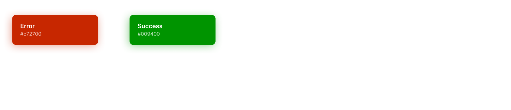

# 개발자를 위한 디자인 시스템 Foundation 1 - 컬러

 

1. 개발자를 위한 디자인 시스템
2. 컬러 팔레트(Color Palette)
3. Primary 팔레트
4. Secondary 팔레트
5. 피드백 팔레트
6. 확장 팔레트
7. 다크모드를 위한 팔레트
8. 데이터 시각화를 위한 컬러

 

## 1. 개발자를 위한 디자인 시스템

디자인 시스템을 구축할 때 기본이 되는 컬러(Color), 타이포그래피(Typography), 그리드(Grid) 등과 같은 요소들을 흔히 파운데이션(Foundations)이라고 부릅니다. 이 파운데이션을 기반으로 만들어진 재활용 목적의 UI 디자인 조각들을 컴포넌트(Components)라고 하고요. 디자인 시스템을 구축하는 목적에는 브랜드 아이덴티티, 일관된 사용자 경험, 디자인 생산성(재활용성, 휴먼에러 최소화) 등이 있습니다.

 

디자인 시스템은 프론트 개발 관점에서도 매우 중요합니다. 웹 앱의 경우 보통 [SCSS](https://sass-lang.com/)와 같은 라이브러리를 사용하여 CSS 작업을 하게되는데요, 개인적으로 디자인 시스템이 없는 환경에서 몇 번의 프로젝트를 진행하다보니 [`$` 변수](https://sass-lang.com/documentation/variables)로 지정한 스타일 모듈들이 전혀 빛을 발하지 못했습니다. 디자인 시안을 전달받을 때마다 새로운 색, 새로운 여백 값, 새로운 폰트 스타일들이 사용되었기 때문에, 모듈의 재활용이 거의 이루어지지 않았기 때문입니다. 상황이 이렇다보니 `color.scss`, `font.scss`와 같은 스타일 파일들은 제 역할을 하지 못하고 히스토리 저장소의 역할만 하고있었죠.

 

디자인 시스템을 도입하면 기획 - 디자인 - 개발 플로우 전체에 걸쳐 생산성을 2 배 이상 높일 수 있겠다는 확신이 들었고, 회사에 적극 제안해서 디자인 시스템을 구축하게 되었습니다. 디자인 전문가가 부재했기 때문에 직접 스터디를 하면서 디자인 시스템을 구축하고 있고요, 미래에 디자인 시스템을 리뉴얼하거나 새로 구축할 일이 생긴다면 빠르게 Cheat하기 위한 목적, 저와 같은 상황에 있는 개발자 분들에게 도움이 되고자하는 마음으로 문서화를 하게 되었습니다.

 

## 2. 컬러 팔레트(Color Palette)

디자인 시스템 파운데이션 중 가장 기본이 되는 컬러 시스템은 팔레트 형태로 몇 가지 색들을 세팅하여 구축합니다. 아래 사진은 저의 포트폴리오 웹사이트를 리뉴얼 기획하면서 작업하고 있는 컬러 팔레트입니다. Figma 커뮤니티에서 [Create a Design System](https://www.figma.com/community/file/943130265019106988) 프로젝트를 템플릿으로 사용했습니다.

 

 

다음은 컬러 팔레트를 빠르게 구성할 수 있게 도와주는 도구들입니다.

- [Material palette generator](https://material.io/design/color/the-color-system.html#tools-for-picking-colors)
- [Coolors.co](https://coolors.co/)
- [Colorhunt](https://colorhunt.co/)

 

## 3. Primary 팔레트

컬러 팔레트 구성의 첫걸음은 Primary 색들을 정하는 것입니다. Primary 색은 서비스 전반에서 주로 사용될 브랜드 컬러이고요, 사용자의 주된 행동을 나타내기 위해 사용합니다. 보통 회원가입이나 저장 버튼, 본문 텍스트, 로고 등에 사용합니다. 저는 유럽여행할 때 느꼈던 햇빛이 비친 돌의 색감, 앤틱한 거리, 5월의 태양 느낌을 주고 싶어서 아래와 같이 Primary 팔레트를 구성했습니다.

 

- Yellow 계열 : 특정 액션을 강조할 때 사용
- Ash Brown 계열 : 메인 버튼, 네비게이션 바 등 서비스 전반에서 브랜드 컬러로 사용
- Grey 계열 : 본문 타이틀, 텍스트 등에 사용
- White/Black : 페이지 배경색, 강조된 텍스트에 사용

 

 

## 4. Secondary 팔레트

Secondary 팔레트는 Primary 색과 보완 관계에 있는 색들로 구성합니다. [Material Design](https://material.io/design/color/the-color-system.html#color-theme-creation)에 따르면 다음의 경우에 사용하면 가장 좋습니다.

- Floating action buttons
- Selection controls, like sliders and switches
- Highlighting selected text
- Progress bars
- Links and headlines

 

Secondary 색은 시각적 어려움이 있는 사람들도 색 구분을 할 수 있도록 웹접근성을 보장하는 것이 중요합니다. [Web Content Accessibility Guidelines (WCAG)](https://www.w3.org/TR/WCAG/#contrast-minimum)를 참고하면 좋습니다. 최소 `4.5 : 1`의 충분한 대비 비율을 확보해야 한다는 것이 주 내용입니다.

 

> The visual presentation of text and images of text has a contrast ratio of at least 4.5:1, except for the following:  
> Large Text 
> Large-scale text and images of large-scale text have a contrast ratio of at least 3:1;  
> Incidental 
> Text or images of text that are part of an inactive user interface component, that are pure decoration, that are not visible to anyone, or that are part of a picture that contains significant other visual content, have no contrast requirement.  
> Logotypes 
> Text that is part of a logo or brand name has no contrast requirement.

 

저는 [Material palette generator](https://material.io/design/color/the-color-system.html#tools-for-picking-colors)를 사용하여 아래와 같이 정했습니다.

 

 

## 5. 피드백 팔레트

피드백(Feedback) 팔레트는 사용자의 행동에 대한 "의미있는 응답"을 줄 때 사용할 색들로 구성합니다. 예를 들어, 사용자가 회원가입 버튼을 클릭했을 때 성공했는지, 오류가 발생했는지 등의 결과를 알려줄 때 사용합니다. 피드백 목적의 색이기 때문에 브랜드 컬러를 사용하지 않고, 의미를 담고 있는 시멘틱 컬러(Semantic color)를 사용하여 사용자가 의미를 쉽게 인지하도록 해야겠죠. 참고로 피드백 팔레트는 제가 임의로 만든 말이고요, [Material Design](https://material.io/design/color/the-color-system.html#color-theme-creation)에서는 Surface, background, and error colors 섹션에서 설명하고 있고, [Atlassian Design System](https://atlassian.design/foundations/color/)에서는 Secondary Palette 섹션에서 설명하고 있습니다.

 

 

## 6. 확장 팔레트

확장 팔레트는 위에서 정한 Primary, Secondary 팔레트의 색들을 확장한 팔레트입니다. 보통 밝기, 색조가 다른 색들로 구성하고요, 한 컴포넌트 내에서 요소간 경계를 나타내거나 사용자가 인터렉션(Interaction)할 수 있음을 나타내기 위해 사용합니다. 저는 햇빛의 비침을 꼭 나타내고 싶어서 Primary 팔레트의 확장 버전에서 투명도를 달리한 팔레트를 추가로 만들었습니다. White/Black의 투명한 버전 역시 팔레트로 구성해놓으면 유용할 것이라 생각합니다. 팝업 UI의 배경 레이어 등에 자주 사용되기 때문이죠.

 

 

 

## 7. 다크모드를 위한 팔레트

사용자가 서비스를 다크모드로 사용할 때를 대비하여 위에서 구성한 Primary, Secondary 팔레트의 색들이 명시성(Visibility)과 가독성(Legibility)을 유지하는지 검사해봐야합니다. 가령, 저의 팔레트 색들을 그대로 사용하면 다크모드에서는 아래와 같이 텍스트 가독성이 떨어지겠죠.

 

 

저의 경우 Primary, Secondary 팔레트의 색들은 확장 팔레트에서 밝은 컬러로 대체하고, 피드백 팔레트의 색들은 밝은 색을 사용하여 아래와 같이 다크모드용 팔레트를 구성했습니다.

 

그리고 텍스트에 적용시켜서 가독성이 개선되었는지 검사했습니다.

 

 

다크모드 디자인에 대한 자세한 가이드는 [Material Design Dark theme](https://material.io/design/color/dark-theme.html), [Human Interface Guidelines Dark Mode](https://developer.apple.com/design/human-interface-guidelines/ios/visual-design/dark-mode/) 등을 참고하세요. 기본적으로 다크모드는 배경색으로 아래의 색들이 권장되거나 사용되고 있습니다.

- Material Design `#121212`
- iOS `#000`, `#161618`, `#212124`

 

## 8. 데이터 시각화를 위한 컬러

차트 UI와 같은 데이터 시각화 목적의 컴포넌트를 디자인할 때 서로 다른 카테고리의 데이터임을 명확히 하기 위해 서로 다른 색조의 팔레트를 사용할 수 있습니다. 이 때 사용할 컬러들은 Secondary 팔레트에 추가하여 사용하면 좋을 것 같다는 생각입니다. [Material Design](https://material.io/design/color/the-color-system.html) Additional colors for data visualization 섹션을 읽어보면 좋습니다.

 

---

### References

- [Web Content Accessibility Guidelines (WCAG) 2.1](https://www.w3.org/TR/WCAG/)
- [The color system | Material Design](https://material.io/design/color/the-color-system.html#color-usage-and-palettes)
- [Color | Atlassian Design System](https://atlassian.design/foundations/color/)
- [Color | Human Interface Guidelines](https://developer.apple.com/design/human-interface-guidelines/ios/visual-design/color/)
- [The Ultimate Guide to Creating a Design System — Part One, Colors](https://blog.prototypr.io/the-ultimate-guide-to-creating-a-design-system-part-one-colors-20b1d3f15ee6)
