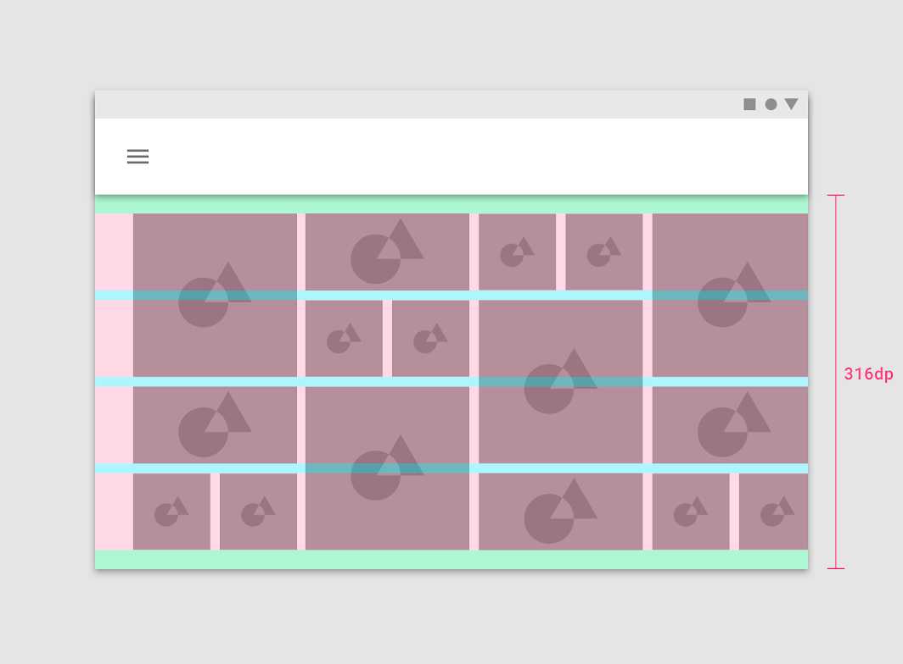
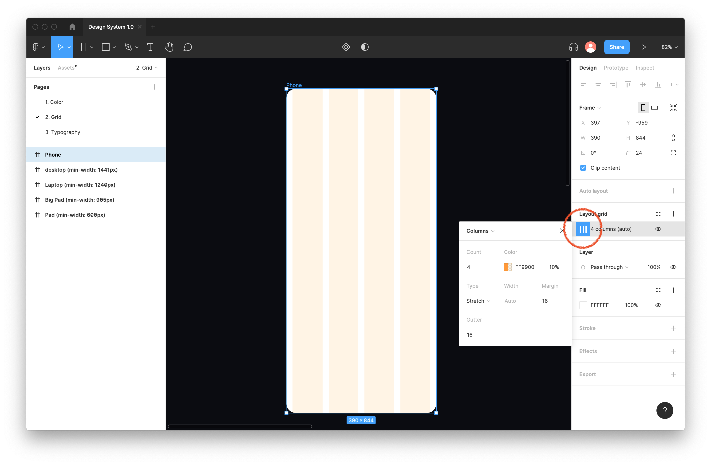
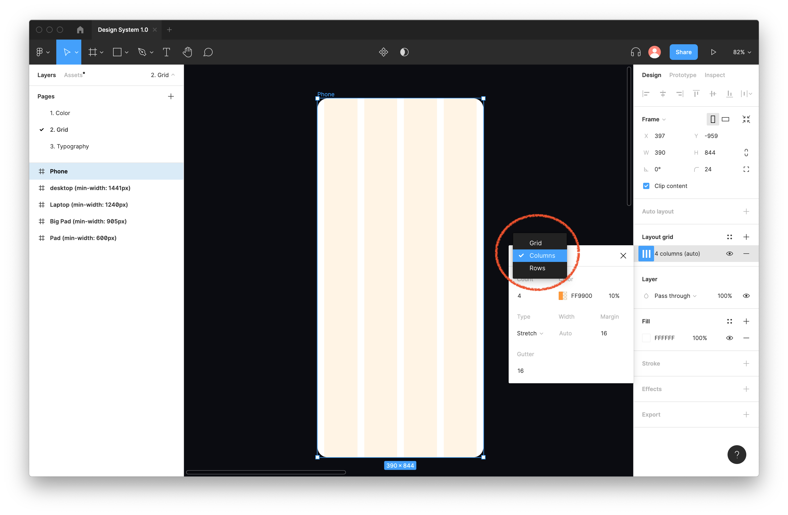
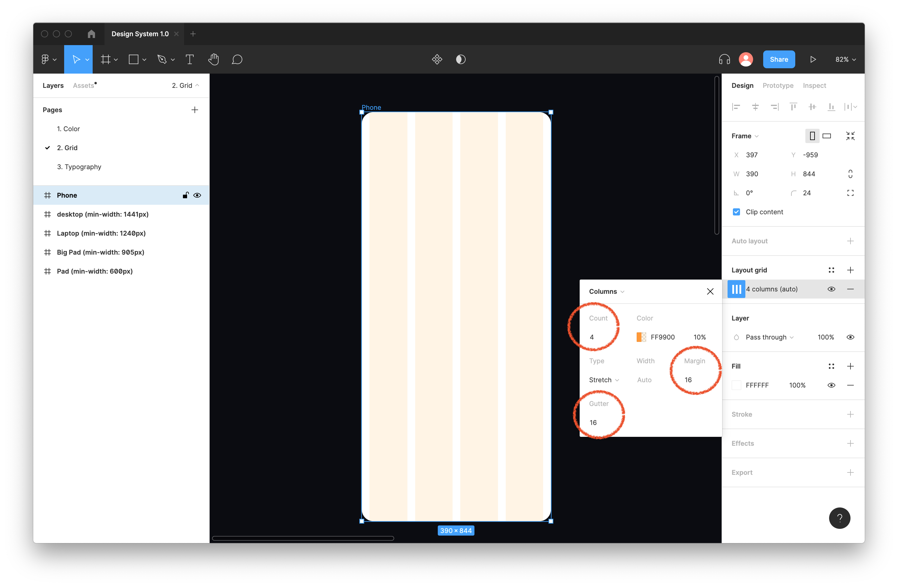
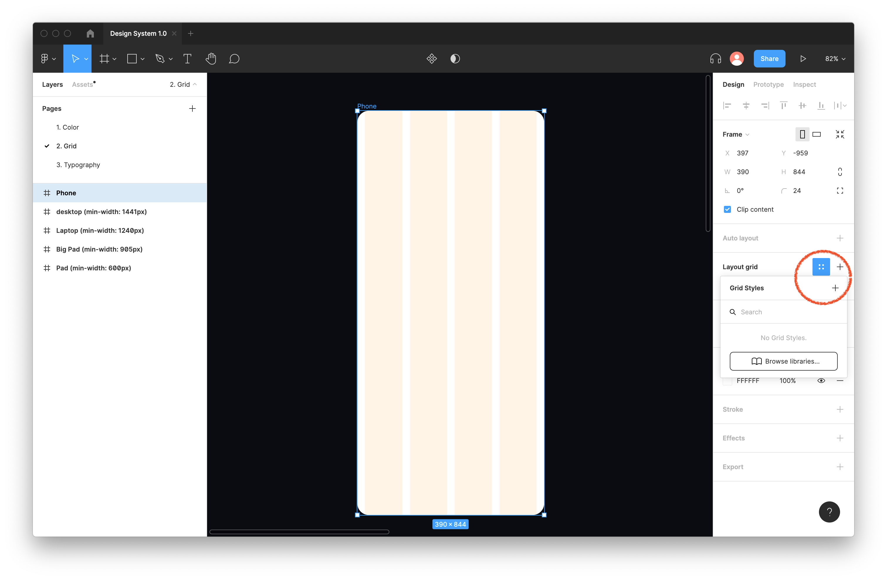
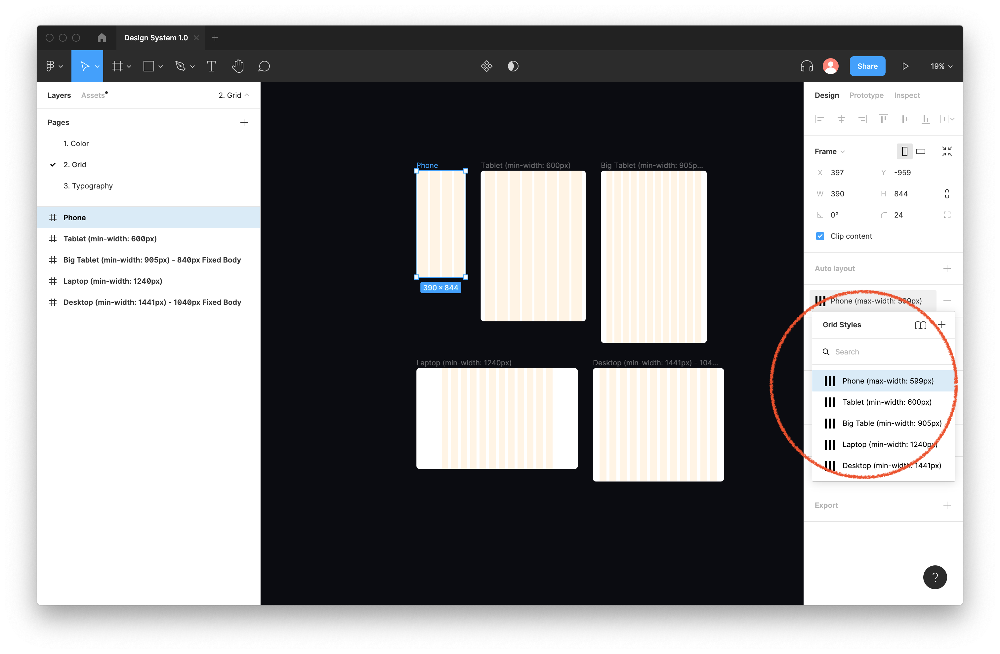
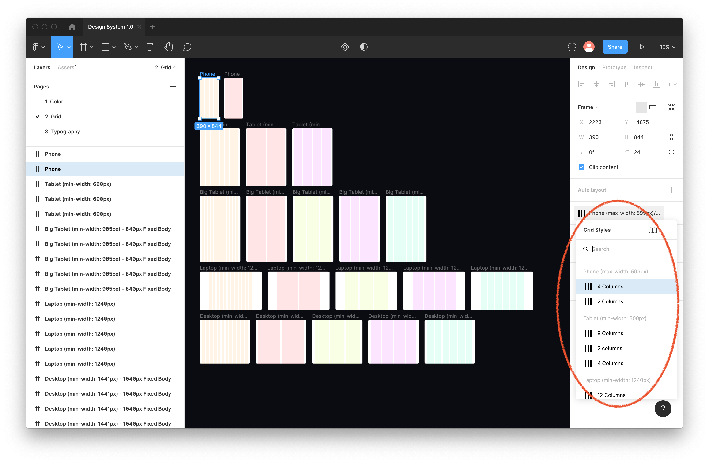

# 개발자를 위한 디자인 시스템 Foundation 2 - 그리드(Grid)

<br>

1. 배경지식 1 - 픽셀, 포인트, Apple의 `72ppi`
2. 배경지식 2 - CSS 픽셀, DPPX(Device Pixel Ratio)
3. 그리드 구성요소: Margin, Flowline, Module, Column, Row, Gutter
4. 8포인트 베이스라인 그리드(8pt Baseline Grid)
5. 베이스라인 그리드와 컴포넌트: 박스모델(Box Model), Escape
6. 단위: `px`, `rem`, `em`
7. 컴포지션 그리드(Composition Grids)
8. 모듈식 스케일(Modular Scales)
9. 반응형 그리드: Breakpoint 시스템, 거터 값 정하기, 가로 방향 그리드
10. Figma에서 구축하기

<br>

## 1. 배경지식 1 - 픽셀, 포인트, Apple의 `72ppi`

### 1-1. 픽셀(`px`)

[픽셀](https://en.wikipedia.org/wiki/Pixel)(`px`)은 디지털 화면에서 가장 기본이 되는 단위입니다. 화면을 쪼갤 수 있는 가장 작은 단위를 픽셀, 우리말로는 화소라고 합니다. 물건의 사이즈를 측정할 때 사용하는 `mm`나 `inch`와 같이 고정된 값을 나타내는 단위가 아니기 때문에 동일한 크기의 화면이라도 픽셀 수는 다를 수 있죠. 따라서 `1px`의 실제 물리적 크기는 디바이스 해상도에따라 제각각입니다.

<br>

### 1-2. 포인트(`pt`), Apple의 `72ppi`

포인트(`pt`)를 이해하려면 역사를 조금 살펴봐야합니다. 포인트는 디지털 디바이스가 없던 시절, 인쇄물의 타이포그래피(Typography)에서 사용하는 가장 작은 단위였습니다. 실제 인쇄된 활자의 크기를 나타내는 단위이므로 `1pt`는 픽셀과 달리 고정된 현실 세계의 값을 나타냅니다. `1pt`는 대략 `1/72inch`(`0.3527mm`) 정도가 됩니다.

<br>

그런데 이 포인트 단위를 픽셀 기반의 디지털 디바이스로 옮겨오는 과정에서 많은 사람들이 혼선을 겪게 되었고요, [Xerox PARC 연구소](<https://en.wikipedia.org/wiki/PARC_(company)>)는 이를 해소하기 위해 디지털 화면의 표준 해상도를 `72 ppi(pixels per inch)`로 채택합니다. 이로써 표준 해상도를 가진 디바이스에서 `1pt = 1px`가 성립하게 되었습니다. 당시 `72 ppi` 표준 해상도를 채택한 Apple PC의 성공으로 `72 ppi`가 보편화되었고요, [Human Interface Guides](https://developer.apple.com/design/human-interface-guidelines/ios/icons-and-images/app-icon/#app-icon-sizes) 문서를 보면 현재까지도 Apple 디바이스에서 이 표준해상도를 사용하고있음을 알 수 있습니다.

<br>

만약 어떤 디바이스의 해상도가 `@x2`(2배)라면 물리적으로 `1*1 pt` 크기를 구현하는데 `2*2 px`, 총 4개의 픽셀이 사용됩니다. 가로, 세로 모두 인치당 픽셀 수가 2배씩 커졌음을 의미하기 때문이죠.

<br>

[spoqa 기술블로그 픽셀과 포인트](https://spoqa.github.io/2012/07/06/pixel-and-point.html)가 도움이 되었습니다.

<br>

## 2. 배경지식 2 - CSS 픽셀, DPPX(Device Pixel Ratio)

### 2-1. CSS 픽셀

[CSS 픽셀](https://developer.mozilla.org/en-US/docs/Glossary/CSS_pixel)은 `72ppi`가 아닌 `96ppi` 해상도를 기준으로 합니다. 따라서 거의 모든 웹 브라우저도 `96ppi`를 표준해상도 규격으로 사용합니다. Apple의 Safari도 마찬가지죠. 따라서 CSS에서는 표준해상도라고해도 `1pt = 1px`이 성립되지 않습니다. CSS `1px`은 `1/96inch`입니다. 가령, CSS에서 `16px`로 지정하면 물리적 크기는 `16pt`가 아닌 `12pt`가 됩니다.

```css
div {
	font-size: 16px; /* = 12pt */
}
```

<br>

참고로 `96ppi`는 Microsoft가 개발하고 채택했던 해상도 규격입니다.

<br>

### 2-2. DPPX(Device Pixel Ratio)

디바이스 화면에 최종 렌더링될 때 중요한 것은 DPPX(Device Pixel Ratio)입니다. DPPX는 디바이스 픽셀과 CSS 픽셀간 비율입니다. 모든 디바이스는 CSS에서의 `1px`이 실제 화면에서 몇 픽셀을 차지하는지 정해진 비율을 갖습니다. 가령, 어떤 디바이스의 DPPX가 `2`라면 CSS `1*1 px`이 실제 화면에 렌더링될 때 `2*2 px`을 차지합니다. 다음은 [CSS Length Explained](https://hacks.mozilla.org/2013/09/css-length-explained/#dppx)에서 발췌한 설명입니다.

<br>

> In order to make sure that CSS pixels are sized consistently across every device that accesses the web (i.e. everything with a screen and network connection), device manufacturers had to map multiple device pixels to one CSS pixel to make up for it’s relative bigger physical size. The ratio of the dimension of CSS pixel relative to device pixels is the device pixel ratio (DPPX).

<br>

참고로 JavaScript에서는 [`window.devicePixelRatio`](https://developer.mozilla.org/en-US/docs/Web/API/Window/devicePixelRatio) 속성을 통해 DPPX 값을 얻을 수 있습니다. 만약 어떤 이미지의 크기를 CSS에서 `60*60 px`로 지정한다면 DPPX가 `4`인 디바이스에서 이 이미지는 실제로 `24*24 px`을 차지하게 됩니다. 따라서 웹개발자는 `24*24 px` 크기의 이미지 파일을 준비하여 로딩되도록 해야겠죠. `window.devicePixelRatio` 속성을 이용하면 DPPX에 따라 동적으로 알맞은 크기의 이미지를 로딩할 수 있습니다.

```javascript
console.log(window.devicePixelRatio); // 4
```

<br>

## 3. 그리드 구성요소: Margin, Flowline, Module, Column, Row, Gutter

### 3-1. 마진(Margin)

마진(Margin)은 프레임의 가장자리 여백입니다.

<br>


<br>

### 3-2. 흐름선(Flowline)

흐름선(Flowline)은 프레임 전체에 평행하게 배치되는 가로선입니다. 이 흐름선들을 기반으로 프레임 내에서 큰 영역들을 나눌 수 있고, 콘텐츠가 시작하거나 끝나는 부분을 정하게 됩니다.

<br>


<br>

### 3-3. 모듈(Module)

모듈(Module)은 그리드에서 세로선과 가로선(흐름선)이 교차하면서 만들어내는 블록들을 의미합니다.

<br>


<br>

### 3-4. 컬럼(Column)

컬럼(Column)은 프레임의 천장부터 바닥까지 세로 방향으로 인접한 모듈들의 그룹입니다.

<br>


<br>

### 3-5. 행(Row)

행(Row)은 프레임의 왼쪽부터 오른쪽까지 가로 방향으로 인접한 모들의 그룹입니다.

<br>


<br>

### 3-6. 거터(Gutter)

거터(Gutter)는 컬럼과 컬럼 사이, 혹은 행과 행 사이의 빈 공간입니다. 모든 거터의 값은 동일해야합니다.

<br>


사진출처 : [A Quick Look at Types of Grids for Creating Professional Designs](https://visme.co/blog/layout-design/)

<br>

## 4. 8포인트 베이스라인 그리드

### 4-1. 베이스라인 그리드(Baseline Grid)

베이스라인 그리드는 위에서 살펴본 컬럼, 행, 거터, 모듈 등을 만들어내는 가로 세로 교차선들을 레이아웃의 기준선으로 적극 활용하는 방식입니다. 다량의 텍스트가 포함된 모든 디자인에 적합하고요, 콘텐츠의 리듬을 만들어주는 것이 특징입니다.

<br>


사진출처 : [A Quick Look at Types of Grids for Creating Professional Designs](https://visme.co/blog/layout-design/)

<br>

### 4-2. 8포인트 베이스라인 그리드

8포인트 베이스라인 그리드는 베이스라인 그리드를 구성할 때 `8`씩 증감하는 값들만을 사용하는 방식입니다. 모든 요소의 크기를 `8`의 배수로, 그러니까 웹디자인에는 `8px`, `16px`과 같은 값들만 사용하는 8px 베이스라인 그리드를 사용하면 됩니다. [Material Design](https://material.io/design/layout/understanding-layout.html#material-measurements)에서도 Android 앱을 위한 8dp 베이스라인을 제안합니다. 다만, 아이콘, 타이포그래피와 같이 작은 사이즈가 필요한 경우에는 4dp 베이스라인을 허용합니다.

<br>

최근에는 공간을 더 세밀하게 나눌 수 있는 4포인트 베이스라인 그리드가 인기를 얻고 있습니다. 저는 포트폴리오 프로젝트의 디자인시스템을 구축하면서 [Goodbye 8-point grid, hello 4-point grid?](https://uxdesign.cc/goodbye-8-point-grid-hello-4-point-grid-1aa7f2159051) 등의 아티클을 참고했는데요, 기본적으로 8포인트 베이스라인, 경우에 따라 4포인트 베이스라인을 사용하기로 했습니다.

<br>

### 4-3. 왜 4, 8인가요?

그런데 왜 `4`, `8`인가요? `2`와 `4`로만 나눌 수 있어 고해상도에서 픽셀절반 현상을 방지할 수 있기 때문입니다. 고해상도 디바이스는 일반적으로 표준해상도의 1.5배, 2배, 3배, 4배 해상도를 사용합니다. `@x1.5`, `@x2`, `@x3`, `@x4`로 표시하고요.

<br>

예를 들어, 표준해상도에서 `1pt = 1px`이고, `@x1.5` 해상도의 디바이스에서 물리적으로 `5*5 pt` 크기만한 아이콘을 구현한다고 가정해봅시다. 아이콘의 한 면의 픽셀 사이즈는 `7.5px`(`5 * 1.5`)이 되겠죠. 이를 픽셀절반 현상이라고 합니다. 애초에 픽셀은 화면을 구성하는 가장 작은 단위이기 때문에 정수(Integer) 값에서 벗어난 소수점 아래 값으로 인해 [계단 현상(Aliasing)](https://en.wikipedia.org/wiki/Aliasing)이 발생할 수 있습니다. 계단현상을 자동으로 부드럽게 처리하는 [Anti-aliasing](https://en.wikipedia.org/wiki/Anti-aliasing) 기능을 탑재한 디바이스에서는 가장자리가 흐릿해질 수 있고요. 또는 렌더링 엔진이 자동으로 픽셀 값을 반올림 처리하면서 디자인과 다르게 렌더링될 수 있는 문제가 있습니다.

<br>

4포인트, 8포인트 베이스라인 그리드에서는 픽셀절반 현상이 없습니다. 또한 `4`와 `8`은 웹 브라우저의 기본 폰트 크기인 `16px`과도 맞아떨어져서 밸런스 유지에도 도움이 되고요.

<br>

## 5. 베이스라인 그리드와 컴포넌트: 박스모델(Box Model), Escape

### 5-1. 박스모델(Box Model)

베이스라인 그리드를 전체 화면 레이아웃이 아닌 컴포넌트 디자인에 적용할 때 무엇을 고려해야할까요? 웹/앱에서 화면을 그릴 때 사용하는 [박스모델(Box Model)](https://www.w3schools.com/css/css_boxmodel.asp)을 하나의 화면으로 생각하고, 모든 구성요소와 타이포그래피에 베이스라인 그리드를 적용하면 됩니다. 그럼 컴포넌트들을 화면에 배치했을 때 전체 레이아웃의 베이스라인과도 맞아떨어집니다.

<br>

하나의 박스를 구성하는 4가지 구성요소는 다음과 같습니다.

- 콘텐츠(Content) : 박스의 콘텐츠 영역
- 패딩(Padding) : 박스의 콘텐츠를 둘러싼 여백
- 선(Border) : 박스의 선
- 마진(Margin) : 박스 외부의 여백, 주변 요소와의 레이아웃에 사용

<br>


사진출처 : [W3S 박스모델(Box Model)](https://www.w3schools.com/css/css_boxmodel.asp)

<br>

### 5-2. Escape

레이아웃을 구성하다보면 아무리해도 `4`나 `8`로 나누어떨어지지 않는 경우가 있습니다. 베이스라인에 억지로 맞추다보면 버튼의 여백이 너무 넓거나 좁아지는 경우, 텍스트가 너무 크거나 작아지는 경우가 있죠. 이럴 때 다음 규칙을 고려해보세요.

<br>

지켜야할 것

- 박스의 너비, 높이
- 텍스트 줄높이((Line Height))

<br>

포기해도 될 것

- 박스 내에 중앙정렬된 폰트의 사이즈

<br>

박스의 크기와 텍스트 줄높이는 최소 `4`의 배수를 유지하고 폰트 사이즈(Font Size)는 베이스라인에서 어느정도 벗어나도 괜찮다는 것이 [Material Design](https://material.io/design/layout/spacing-methods.html#baseline-grid)의 설명입니다. 다음은 발췌 내용입니다.

<br>

> Type can be placed outside of the 4dp grid when it’s centered within a component, such as a button or list item. When placed outside of the grid but centered within a component, text can still appear vertically center-aligned.

<br>

## 6. 단위: `px`, `rem`, `em`

지금까지 픽셀을 가지고 얘기했지만, 사실 웹 개발에서는 공간과 타이포그래피에 `rem`을 흔히 사용합니다. `<html>` 태그의 폰트사이즈(기본적으로 `16px`)을 `1rem`으로 환산하는 상대적 단위이기 때문에, 단 하나의 픽셀 값을 조정함으로써 모든 폰트와 주변 여백 값이 자동으로 늘어나고 줄어든다는 사실 때문이죠. 이는 레이아웃의 유연성과 [접근성](https://www.w3.org/WAI/fundamentals/accessibility-intro/ko) 측면에서 장점으로 작용합니다. [Tailwind CSS](https://tailwindcss.com/)에서도 `padding`, `margin` 값으로 `rem`을 사용합니다.

<br>

하지만 항상 `rem`을 사용해야 하는 것은 아닙니다. 어떤 컴포넌트가 상황에 따라 다양한 크기를 갖게하려면 본인 요소의 폰트사이즈를 `1em`으로 환산하는 `em`을 사용하는 것이 좋고, 고정된 값을 반드시 유지해야할 때는 `px`을 사용하는 것이 적합합니다. 그리드 시스템에서도 `px`, `rem`, `em` 각 단위는 용도에 맞게 사용하면 되지만, 그 기준을 찾기가 참 어렵습니다.

<br>

[Create your design system, part 1: Typography](https://medium.com/codyhouse/create-your-design-system-part-1-typography-7c630d9092bd)에서 케이스 스터디를 해볼 수 있습니다. [Comprehensive Guide: When to Use Em vs. Rem](https://webdesign.tutsplus.com/tutorials/comprehensive-guide-when-to-use-em-vs-rem--cms-23984)도 도움이 됩니다.

<br>

## 7. 컴포지션 그리드(Composition Grids)

텍스트가 적고 추상적 이미지와 도형 위주의 화면은 베이스라인 그리드보다는 컴포지션 그리드(Composition Grids)가 적합할 수 있습니다. 혹은 섞어 사용할 수 있고요. 두 가지 컴포지션 그리드를 소개합니다.

<br>

### 7-1. Rule of Thirds

[Rule of Thirds](https://en.wikipedia.org/wiki/Rule_of_thirds)는 화면을 똑같은 크기의 9개 조각으로 나눈 후, 이들을 나눈 선과 선들의 교차점을 기준 삼아 콘텐츠를 배치하는 방법입니다. 사용자의 시선이 Z자를 그리며 왼쪽 상단, 오른쪽 상단, 왼쪽 하단, 오른쪽 하단 순서로 흐른다고 가정합니다.

<br>


사진출처 : [A Quick Look at Types of Grids for Creating Professional Designs](https://visme.co/blog/layout-design/)

<br>

### 7-2. 황금비(Golden Ratio)

[황금비(Golden Ratio)](https://en.wikipedia.org/wiki/Golden_ratio)는 자연에서 발견된 미의 비율에서 가져온 그리드 방법론입니다. [피보나치 수열](https://en.wikipedia.org/wiki/Fibonacci_number)에서 숫자가 증감하는 비율을 사용하여 그리드를 구성합니다.

<br>


사진출처 : [A Quick Look at Types of Grids for Creating Professional Designs](https://visme.co/blog/layout-design/)

<br>

## 8. 모듈식 스케일(Modular Scales)

일반적으로 타이포그래피는 특정 비율로 증감하는 값들로 구성합니다. 그래야 사용자가 콘텐츠를 읽어내려갈 때 글이 리듬을 갖는다고 보기 때문입니다. 이러한 모듈식 스케일을 컴포넌트 디자인에도 적용할 수 있습니다. 특정 비율로 증감하는 값들로 컴포넌트의 사이즈를 구성해서 화면 전체의 리듬감에 기여할 수 있기 때문입니다. [Modular Scale](https://www.modularscale.com/?1&em&1.618) 등의 도구를 사용하면 증감 값들을 빠르게 추출할 수 있습니다.

<br>

증감 비율로는 위에서 소개한 황금비 `1.618`도 많이 사용됩니다. 만약 황금비로 증감하는 사이즈 모듈을 구성하면서 4px 베이스라인 그리드에도 맞추고자한다면, 추출된 각 값들을 가장 가까운 `4`의 배수로 반올림하여 구성해볼 수 있겠습니다. 가령 `16px`을 기준으로 황금비로 증감하는 값들을 추출하면 `3.78`, `6.11`, `9.89`, `16`, `25.89`, `41.89`, `67.77`, `109.66`, `177.42`이고요, 이를 기반으로 4px 베이스라인 그리드에서 사용할 모듈 값들을 구성하면 아래와 같이 할 수 있습니다.

<br>

```css
:root {
	--base-size: 4;
}

:root {
	--modular-size-1: calc(var(--base-size) * 1); /* 4 */
	--modular-size-2: calc(var(--base-size) * 2); /* 8 */
	--modular-size-3: calc(var(--base-size) * 4); /* 16 */
	--modular-size-4: calc(var(--base-size) * 6); /* 24 */
	--modular-size-5: calc(var(--base-size) * 10); /* 40 */
	--modular-size-6: calc(var(--base-size) * 17); /* 68 */
	--modular-size-7: calc(var(--base-size) * 27); /* 108 */
	--modular-size-8: calc(var(--base-size) * 44); /* 176 */
}
```

<br>

이후 필요에 맞게 단위를 환산해 사용합니다.

```css
:root {
	--box-size-1: calc(var(--modular-size-1) * 1px); /* 4 */
	--box-size-2: calc(var(--modular-size-2) * 1px); /* 8 */
	--box-size-3: calc(var(--modular-size-3) * 1px); /* 16 */
	--box-size-4: calc(var(--modular-size-4) * 1px); /* 24 */
	--box-size-5: calc(var(--modular-size-5) * 1px); /* 40 */
	--box-size-6: calc(var(--modular-size-6) * 1px); /* 68 */
	--box-size-7: calc(var(--modular-size-7) * 1px); /* 108 */
	--box-size-8: calc(var(--modular-size-8) * 1px); /* 176 */
}
```

```css
:root {
	--margin-size-1: calc(var(--modular-size-1) / 16rem); /* 0.25rem */
	--margin-size-2: calc(var(--modular-size-2) / 16rem); /* 0.5rem */
	--margin-size-3: calc(var(--modular-size-3) / 16rem); /* 1rem */
	--margin-size-4: calc(var(--modular-size-4) / 16rem); /* 1.5rem */
	--margin-size-5: calc(var(--modular-size-5) / 16rem); /* 2.5rem */
	--margin-size-6: calc(var(--modular-size-6) / 16rem); /* 4.25rem */
	--margin-size-7: calc(var(--modular-size-7) / 16rem); /* 6.75rem */
	--margin-size-8: calc(var(--modular-size-8) / 16rem); /* 11rem */
}
```

<br>

## 9. 반응형 그리드: Breakpoint 시스템, 거터 값 정하기, 가로 방향 그리드

### 9-1. Breakpoint 시스템

지금까지 픽셀 기준으로만 얘기했지만, 모든 디바이스에서 일관된 레이아웃을 제공하기 위해 반응형 그리드를 설계해야합니다. 반응형 그리드에서는 뷰포트(Viewport)의 너비(Width), 높이(Height)에 따라 컬럼, 거터, 마진 값이 가변할 수 있도록 구성합니다. 매년 새로운 크기의 뷰포트들이 등장하기 때문에 모든 뷰포트를 하나씩 다루지않고, 뷰포트의 너비를 특정 범위로 그루핑한 [Breakpoint 시스템](https://material.io/design/layout/responsive-layout-grid.html#breakpoints)에 따른 그리드를 구성하면 됩니다. 참고로 Adobe의 [Spectrum](https://spectrum.adobe.com/page/responsive-grid/), Google의 [Material Design](https://material.io/design/layout/responsive-layout-grid.html#breakpoints), [Bootstrap](https://getbootstrap.com/docs/4.0/layout/grid/) 등 거의 모든 디자인 가이드에서 서로 다른 Breakpoint 시스템을 제안하고 있습니다.

<br>

다음은 Material Design의 Breakpoint 시스템이고요, 각 그룹마다 적절한 컬럼의 수와 마진 값에 대한 가이드를 얻을 수 있습니다.

- 휴대폰 (`600dp` 미만) : 4 컬럼, `16dp` 마진

- 태블릿 (`600dp` ~ `904dp`) : 8 컬럼, `32dp` 마진

- 큰 태블릿 (`905dp` ~ `1239dp`) : 12 컬럼, `840dp` 바디, Scaling 마진

- 노트북 (`1240dp` ~ `1439dp`) : 12 컬럼, `200dp` 마진

- 데스크탑 (`1440dp` 이상) : 12 컬럼, `1040dp` 바디, Scaling 마진

<br>

큰 태블릿, 데스크탑의 경우, 콘텐츠가 담기는 바디(Body)의 크기를 `840dp`, `1040dp`로 고정시키고 마진 값은 남는 공간을 채우도록 하는 것에 주목해볼 수 있습니다. CSS에서는 아래와 같이 지정하게 되죠.

```css
.wrapper {
	width: 100%;
	max-width: 840px; /* 또는 1040px */
	margin-left: auto;
	margin-right: auto;
}
```

<br>

주요 디바이스들의 뷰포트 크기들이 [Material Design](https://material.io/design/layout/responsive-layout-grid.html#breakpoints) 가이드에서 거의 벗어나지 않았기 때문에 저는 Material Design의 시스템을 그대로 따르기로 했습니다. 다만, 노트북 기준에서 벗어나는 15" Macbook을 위해 데스크탑으로 식별되는 최소값을 `1440px`에서 `1441px`로 수정했습니다.

<br>

### 9-2. 거터 값 정하기

거터의 값은 `16px`, `24px`과 같이 8px 베이스라인과 맞아 떨어지게 하는 것이 일반적이고요, 마진과 같거나 작은 값으로 지정합니다. 다음은 [Spectrum](https://spectrum.adobe.com/page/responsive-grid/)에서 발췌한 내용입니다.

> Gutters are the gaps between the columns. Gutter widths are fixed values (16 px, 24 px, etc.) based on breakpoints.

> Grid margins are the outer margins of the grid. They can be the same width as the gutters or greater.

<br>

거터 값 계산을 위해 [Grid Calculator](http://gridcalculator.dk/)를 사용하였고요, 결과적으로 저의 Breakpoint 시스템은 아래와 같이 정리되었습니다.

- 휴대폰 (`600px` 미만) : 4 컬럼, `16px` 마진, `16px` 거터

- 태블릿 (`600px` ~ `904px`) : 8 컬럼, `32px` 마진, `16px` 거터

- 큰 태블릿 (`905px` ~ `1239px`) : 12 컬럼, 자동 마진, `840px` 바디, `16px` 거터, `44px` 패딩

- 노트북 (`1240px` ~ `1440px`) : 12 컬럼, `200px` 마진, `24px` 거터

- 데스크탑 (`1441px` 이상) : 12 컬럼, 자동 마진, `1040px` 바디, `24px` 거터, `52px` 패딩

<br>

### 9-3. 가로 방향 그리드

가로 방향의 그리드는 상단의 앱바(App Bar) 영역을 제외하고 구성합니다.

<br>



사진출처 : [Material Design](https://material.io/design/layout/responsive-layout-grid.html)

<br>

## 10. Figma에서 구축하기

Figma에서 그리드는 우측 `Design` 탭의 `Layout Grid` 영역에서 생성할 수 있습니다. `+` 버튼을 눌러 기본 그리드를 추가한 후, 추가된 그리드의 왼쪽 아이콘을 클릭하면 그리드를 설정할 수 있는 영역이 생깁니다.

<br>



<br>

그다음 가장 상단에서 그리드 종류를 `Columns`로 변경합니다.

<br>



<br>

그다음 `Count`, `Margin`, `Gutter` 값을 지정해주면 됩니다.

<br>



<br>

그리드 생성이 완료되었으면, 아래와 같이 `Styles` 버튼을 클릭하여 모듈 영역을 열고, `+` 버튼을 클릭하여 새로운 모듈로 추가해줍니다.

<br>



<br>

같은 방식으로 5개의 Breakpoint 그룹을 위한 그리드를 추가합니다.

<br>



<br>

마지막으로, 아래와 같이 각 Breakpoint 그룹마다 사용할 확장된 그리드 모듈들을 추가할 수 있습니다. 컬럼의 수를 다르게 하여 디자인 작업을 할 때 빠르게 도움을 받을 수 있죠. 이때 기본 컬럼 그리드와 맞아 떨어지는 컬럼 수를 사용해야합니다. 예를 들어 8 컬럼 그리드를 사용하는 그룹에서는 2 컬럼, 4 컬럼 그리드를 함께 사용할 수 있지만, 3 또는 6 컬럼으로 나누었을 때는 기본이 되는 8 컬럼 그리드와 맞아떨어지지 않기 때문에 적합하지 않습니다.

<br>



<br>

Figma에서 그리드 시스템을 추가하는 방법에 대한 자세한 내용은 [Create layout grids with grids, columns, and rows](https://help.figma.com/hc/en-us/articles/360040450513-Create-layout-grids-with-grids-columns-and-rows#h_001df3c9-cf3c-473f-a4c5-278d9c212524) Figma 공식문서를 확인하세요.

<br>

---

### References

- [Understanding layout | Material Design](https://material.io/design/layout/understanding-layout.html#principles)
- [Adaptivity and Layout | Human Interface Guidelines](https://developer.apple.com/design/human-interface-guidelines/ios/visual-design/adaptivity-and-layout/)
- [Responsive grid | Spectrum](https://spectrum.adobe.com/page/responsive-grid/)
- [A Quick Look at Types of Grids for Creating Professional Designs](https://visme.co/blog/layout-design/)
- [Pixel | Wikipedia](https://en.wikipedia.org/wiki/Pixel)
- [CSS pixel | MDN](https://developer.mozilla.org/en-US/docs/Glossary/CSS_pixel)
- [Absolute Lengths: the cm, mm, Q, in, pt, pc, px units | W3C Editor's Draft](https://drafts.csswg.org/css-values/#absolute-lengths)
- [CSS Length Explained](https://hacks.mozilla.org/2013/09/css-length-explained/)
- [픽셀과 포인트 | Spoqa 기술블로그](https://spoqa.github.io/2012/07/06/pixel-and-point.html)
- [Point vs Pixel: What is the difference? | StackExchange](https://graphicdesign.stackexchange.com/questions/199/point-vs-pixel-what-is-the-difference)
- [CSS Box Model | W3C Schools](https://www.w3schools.com/css/css_boxmodel.asp)
- [Window.devicePixelRatio | MDN](https://developer.mozilla.org/ko/docs/Web/API/Window/devicePixelRatio)
- [Baseline grids | Figma](https://www.figma.com/best-practices/everything-you-need-to-know-about-layout-grids/baseline-grids/)
- [Baseline grids & design systems](https://uxdesign.cc/baseline-grids-design-systems-ae23b5af8cec)
- [Goodbye 8-point grid, hello 4-point grid?](https://uxdesign.cc/goodbye-8-point-grid-hello-4-point-grid-1aa7f2159051)
- [Why we’re using a 4-point grid in Webflow](https://webflow.com/blog/why-were-using-a-4-point-grid-in-webflow)
- [The 8-Point Grid | Spec.fm](https://spec.fm/specifics/8-pt-grid)
- [A framework for creating a predictable & harmonious spacing system for faster design-dev handoff](https://blog.prototypr.io/a-framework-for-creating-a-predictable-and-harmonious-spacing-system-8eee8aaf773c)
- [Comprehensive Guide: When to Use Em vs. Rem](https://webdesign.tutsplus.com/tutorials/comprehensive-guide-when-to-use-em-vs-rem--cms-23984)
- [디자인 시스템 구축하기 3부 : 크기와 간격](https://brunch.co.kr/@thinkaboutlove/290)
- [1px 보다 얇은 디자인 — 라인 편](https://brunch.co.kr/@euid/6)
