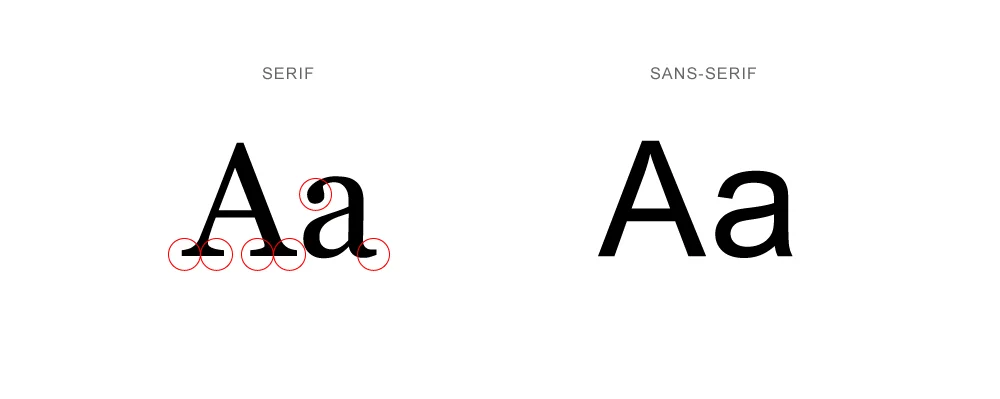
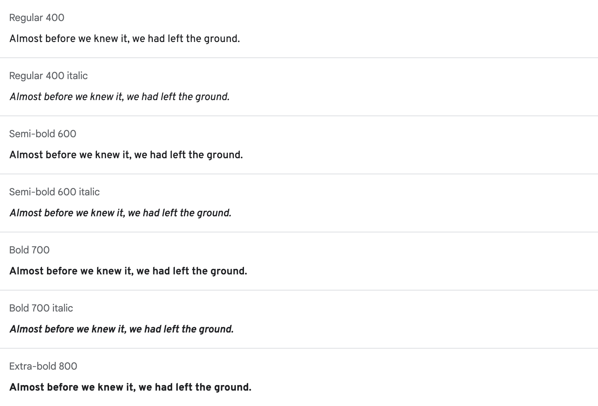
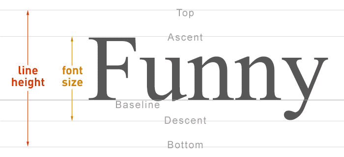
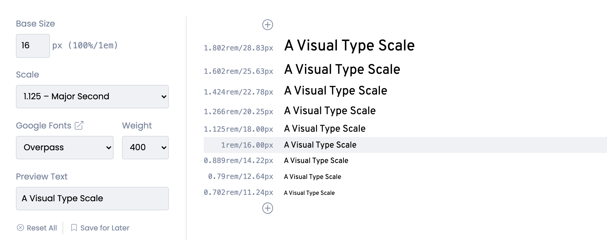

# 개발자를 위한 디자인 시스템 Foundation 2 - 타이포그래피

<br>

1. 타입페이스(Typeface) 정하기
2. 여러 개의 타입페이스를 함께 사용하기
3. 줄높이(Line Height): 정의, 웹접근성, 4pt Baseline Grid
4. 폰트 사이즈(Font Size): 웹접근성, Type Scales
5. 폰트 사이즈와 줄높이를 그리드 시스템에 맞추기
6. 폰트 굵기(Font Weight)

<br>

## 1. 타입페이스(Typeface) 정하기

### 1-1. 타입페이스(Typeface)

타입페이스(Typeface)를 정하는 것으로 타이포그래피(Typography) 구축을 시작합니다. 타입페이스는 흔히 말하는 폰트(서체)를 의미합니다. 보통 1 ~ 2 개의 타입페이스를 선정한 후 크기, 굵기 등을 확장하여 타이포그래피 시스템을 구축하고요, 타입페이스는 브랜드의 톤앤매너와 가독성을 고려하여 선정해야합니다. [Wikipedia List of typefaces](https://en.wikipedia.org/wiki/List_of_typefaces)에서 존재하는 거의 모든 타입페이스 목록을 확인할 수 있습니다.

<br>

다음은 타입페이스 선택을 도와주는 도구들입니다.

- [FontBase](https://fontba.se/)
- [Font Playground](https://play.typedetail.com/)
- [Pair & Compare](https://www.pairandcompare.net/)
- [FontPair](https://www.fontpair.co/)
- [FontSpark](https://fontspark.app/)
- [Better Font Finder](https://jmattthew.github.io/better-font-finder/better-font-finder.html)

<br>

### 1-2. `Serif` vs `Sans Serif`

많고 많은 타입페이스 중 어떤 것을 선택해야할까요? 보통 `Serif`와 `Sans Serif` 중에서 사용할 Primary 폰트 계열을 정하는 것으로 시작합니다. `Serif`(세리프)는 인쇄된 H나 I 같은 활자에서 아래·위에 가로로 나 있는 가는 선을 의미하고요, 따라서 `Serif` 계열 폰트의 특징은 활자 끝에 확장된 선이 있다는 것입니다. `Sans Serif`는 그 반대입니다. 한글에서 `Serif`는 명조체, `Sans Serif`는 고딕체로 부릅니다.

<br>

호흡이 긴 문장을 읽을 때는 `Serif` 계열 폰트가 가독성이 좋습니다. 반면, 활자에 익숙하지 않은 어린이들이나 장애가 있는 사람들에게는 `Sans Serif` 계열 폰트의 가독성이 더 좋습니다. 예로 [Medium](https://medium.com/) 서비스는 전문지식을 다루는 퀄리티 아티클이 많은 플랫폼이기 때문에 `Serif` 계열 폰트를 Primary로 사용하는 것 같네요.

<br>



사진 출처 : [Logo Design: Serif vs Sans-Serif](https://www.97thfloor.com/blog/serif-vs-sans-serif)

<br>

### 1-3. Web Safe Fonts

모든 주요 브라우저에서 기본으로 제공하는 폰트들을 [CSS Web Safe Fonts](https://www.w3schools.com/cssref/css_websafe_fonts.asp)라고 합니다. 브라우저에 내장되어 있기 때문에 CSS로 선언하는 것만으로 웹에서 바로 사용할 수 있는 폰트들입니다.

<br>

#### Serif 계열

- Georgia
- Lucida
- Times New Roman

<br>

#### Sans Serif 계열

- Arial
- Tahoma
- <span style="font-family: Verdana">Verdana</span>

<br>

### 1-4. Proportional vs Monospaced

폰트를 Proportional/Monospaced 계열로 나눌 수도 있습니다. 특별한 이유가 없다면 모든 글자의 넓이가 동일한 Monospaced 폰트 대신 Proportional 폰트를 사용합니다. 애초에 Monospaced 폰트는 글자 하나 하나를 면밀히 체크할 필요가 있는 코드의 가독성을 높이기 위해 고안된 폰트이기 때문입니다. 반면 Proportional 폰트는 책, 잡지 등 일반적인 인쇄물과 화면에서 컨텐츠의 가독성을 높이기 위해 고안된 폰트이죠.

<br>

다음은 [Proportional Vs. Monospace Fonts](https://www.techwalla.com/articles/proportional-vs-monospace-fonts)에서 발췌한 내용입니다.

> Benefits and Disadvantages of Monospace Fonts Setting text in a monospace font makes it easier to identify characters by themselves. Because of this, tasks that rely on the easy identification of specific characters, such as programming, benefit from the use of a monospace font. Similarly, a monospace font may be used to format code examples within a page that is otherwise set in a proportional font, in order to make them stand out more easily. Text set in a monospace font is also easier to align, leading to the creation of images constructed using characters, known as "ASCII art." <br/>
> On the other hand, because of the fixed width of all the characters, a block of text set in a monospace font will typically take up more space than the same text set in a proportional font. Additionally, long stretches of monospaced text can blend together visually and, as a result, become harder to read.

<br>

### 1-5. 폰트 패밀리(Font Family)

사실 타입페이스를 선택한다는 것은 "단 하나의 고정된 폰트"가 아닌 "폰트 패밀리(Font Family)"를 선택하는 것입니다. 아래 사진처럼 하나의 폰트는 `100` ~ `900` 사이의 다양한 굵기 구성을 가지고요, `italic`체를 지원하기도 합니다. CSS에서 타입페이스를 지정하는 속성의 이름이 `font-family`인 이유이기도 합니다. 폰트 패밀리마다 굵기의 종류와 `italic`체 지원 여부가 다르기 때문에 프로젝트의 성격과 규모를 구현하는데 충분한 패밀리 구성을 갖추었는지 고려하여 타입페이스를 정해야합니다.

<br>



<br>

## 2. 여러 개의 타입페이스를 함께 사용하기

다음은 여러 개의 타입페이스를 사용할 때 참고할만한 사항들입니다.

- 최대 2 ~ 3 개의 타입페이스만 사용합니다. 그 이상은 주의력을 분산시키기 때문입니다. 폰트의 사이즈와 굵기를 다르게 하는 것으로 다양성은 충분합니다.

- 서로 명확히 대조되는 타입페이스를 사용합니다. 보통 `Serif` 계열 1 가지와 `Sans Serif` 계열 1 가지를 사용합니다.

- 타입페이스간 위계를 명확히 합니다. Primary와 Secondary로 나누어 사용합니다.

<br>

## 3. 줄높이(Line Height): 정의, 웹접근성, 4pt Baseline Grid

### 3-1. 정의

텍스트의 위아래 행간(Leading)을 포함한 높이를 줄높이(Line Height)라고 합니다. 줄높이(Line Height)는 웹접근성과 그리드 시스템을 고려하여 정합니다.



사진 출처 : [sirong.tistory.com](https://sirong.tistory.com/64)

<br>

### 3-2. 웹접근성

[WCAG Success Criterion 1.4.8](https://www.w3.org/TR/UNDERSTANDING-WCAG20/visual-audio-contrast-visual-presentation.html)에 명시된 가이드에 따르면, 폰트 크기의 최소 `1.5` 배를 텍스트의 줄높이 공간으로 사용하는 것이 좋습니다. 만약 본문 텍스트의 폰트 사이즈가 `16px`이라면, 줄높이는 최소 `24px`이어야 웹접근성이 좋다고 보는 것입니다.

<br>

> Line spacing (leading) is at least space-and-a-half within paragraphs

<br>

### 3-3. 4pt Baseline Grid

그리드 시스템에서 모든 Vertical 여백값은 텍스트의 줄높이와 정비례 관계에서 있어야 조화롭다고 보기 때문입니다. 따라서 가장 많이 사용되는 [4pt Baseline Grid]() 레이아웃에서 텍스트의 줄높이는 `4`의 배수를 사용합니다. 예를 들어 폰트 사이즈가 `16px`이라면 줄높이는 `24px`로 정하는 것이 좋습니다. 폰트 사이즈의 `1.5` 배 이상이면서 `4`의 배수이기 때문입니다.

<br>

## 4. 폰트 사이즈(Font Size): 웹접근성, Type Scales

### 4-1. 웹접근성

가장 먼저 기본 사이즈를 정합니다. 보통 텍스트가 다량 사용되는 본문 영역에 기본 사이즈를 사용하게 됩니다. 웹에서 폰트의 기본 사이즈는 일반적으로 `16px`을 사용합니다. `16px` 보다 작은 크기를 사용하더라도 웹접근성을 고려하여 너무 작은 크기의 텍스트는 사용하지 말아야하고요, 일반적으로 `10pt`(대략 `13px`)을 최소 크기로 보고 있습니다. 텍스트 웹접근성에 대한 다양한 자료는 [WebAIM](https://webaim.org/resources/designers/#text)에서 확인할 수 있습니다.

<br>

`<input>`, `<textarea>` 등의 폼 입력 요소(Form Elements)는 사용자들이 정확한 값을 입력하고 쉽게 확인할 수 있어야하므로 폰트 사이즈를 최소 `16px`로 지정하는 것이 좋습니다. iOS Safari에서는 해당 요소의 폰트 사이즈가 `16px` 보다 작을 경우 `16px` 크기로 보이도록 화면을 강제로 줌(Zoom) 시킵니다.

<br>

### 4-2. Type Scales

이제 기본 사이즈를 중심으로 특정 배수 `x`씩 증감하는 사이즈 팔레트를 구축합니다. 특정 배수 `x`의 값은 정하기 나름이지만, [Type Scale](https://type-scale.com/)은 아래와 같이 가이드를 제공합니다.

> Small scales (less than 1.2) are subtle and good for both mobile and desktop apps, or the mobile version of a responsive site. <br/>
> Medium scales (1.15–1.333) have a clear hierarchy, and help to organize sections with subheadings. A medium scale is versatile and works well for a wide variety of desktop sites, including blogs and marketing sites.<br/>
> Large scales (1.333 or greater) may be challenging to implement effectively, but could work well for portfolios, agencies, some marketing sites, or avant-garde works.

<br>

만약 [Major Second Ratio](https://en.wikipedia.org/wiki/Major_second#Epogdoon)에 기반한 디자인을 구축한다면, 아래와 같이 `1rem`을 기점으로 `1.125` 배씩 스케일링하는 사이즈 팔레트를 구성할 수 있겠습니다. `1rem`은 `<html>` 태그의 폰트 사이즈이고요, `<html>` 태그의 폰트 사이즈를 `px` 단위로 고정시킨 후 다른 모든 폰트 사이즈는 `rem` 단위를 사용합니다.

<br>

[Type Scale](https://type-scale.com/)을 사용했습니다.

<br>



<br>

기본 사이즈와 배수 `x`를 모듈화하면 CSS는 아래와 같이 작성할 수 있습니다. (Modular Scale)

```css
:root {
	/* base modules */
	--font-size-base: 16px; /* fallback for old browsers */
	--font-size-base: 1rem;
	--type-scale-ratio: 1.125;

	/* type scales */
	--font-size-2xl: calc(
		var(--font-size-base) * var(--type-scale-ratio) * var(--type-scale-ratio) *
			var(--type-scale-ratio)
	);
	--font-size-xl: calc(
		var(--font-size-base) * var(--type-scale-ratio) * var(--type-scale-ratio)
	);
	--font-size-l: calc(var(--font-size-base) * var(--type-scale-ratio));
	--font-size-m: var(--font-size-base);
	--font-size-s: calc(var(--font-size-base) / var(--type-scale-ratio));
	--font-size-xs: calc(
		var(--font-size-base) / (var(--type-scale-ratio) * var(--type-scale-ratio))
	);
}
```

<br>

다음은 사이즈 팔레트 구축을 빠르게 도와주는 도구들입니다.

- [Modular Scale](https://www.modularscale.com/) : 자동으로 Modular Scale 팔레트를 구성해주는 사이트
- [Type Scale](https://type-scale.com/) : 사용할 디자인 레이아웃 방법론을 선택하면 자동으로 사이즈 팔레트를 구성해주는 사이트
- [archetype](https://archetypeapp.com/#) : 2 개 이상의 타입페이스를 사용한다면 유용한 사이트

<br>

## 5. 폰트 사이즈와 줄높이를 그리드에 맞추기

4pt Baseline Grid 레이아웃을 사용한다면 `x` 배씩 증감하는 사이즈 팔레트의 값들을 인위적으로 조정하여 4의 배수 위주로 구성할 수도 있습니다.

<br>

```css
:root {
	/* fallback for old browsers */
	--font-size-2xl: 24px;
	--font-size-xl: 20px;
	--font-size-l: 18px;
	--font-size-m: 16px;
	--font-size-s: 14px;
	--font-size-xs: 12px;
	/* rem */
	--font-size-2xl: 1.5rem;
	--font-size-xl: 1.25rem;
	--font-size-l: 1.125rem;
	--font-size-m: 1rem;
	--font-size-s: 0.875rem;
	--font-size-xs: 0.75rem;
}
```

<br>

[CSS 전처리기](https://developer.mozilla.org/ko/docs/Glossary/CSS_preprocessor) 중 하나인 [SCSS](https://sass-lang.com/)의 `math.floor` 함수를 사용하면, 아래와 같이 Modular Scale을 구축할 수 있습니다.

```scss
@use "sass:list";

/* base modules */
$font-size-base: 1rem;
$type-scale-ratio: 1.125;

/* type scales */
$font-size-2xl: math.floor(
		$font-size-base * $type-scale-ratio * $type-scale-ratio *
			$type-scale-ratio / 4
	) * 4;
$font-size-xl: math.floor(
		$font-size-base * $type-scale-ratio * $type-scale-ratio / 4
	) * 4;
$font-size-l: math.floor($font-size-base * $type-scale-ratio / 4) * 4;
$font-size-m: $font-size-base;
$font-size-s: math.floor(($font-size-base / $type-scale-ratio) / 4) * 4;
$font-size-xs: math.floor(
		($font-size-base / ($type-scale-ratio * $type-scale-ratio)) / 4
	) * 4;
```

<br>

줄높이 역시 `line-height: 1.5`와 같이 일괄로 적용하지 않고, Type Scales에 따라 폰트 사이즈별로 다른 줄높이 값을 지정하는 것이 좋습니다. 4pt Baseline Grid 레이아웃을 사용한다면 줄높이가 `4`의 배수여야 안정감을 주기 때문입니다.

```css
:root {
	/* fallback for old browsers */
	--line-height-2xl: 36px;
	--line-height-xl: 32px;
	--line-height-l: 28px;
	--line-height-m: 24px;
	--line-height-s: 20px;
	--line-height-xs: 16px;
	/* rem */
	--line-height-2xl: 2.25rem;
	--line-height-xl: 2rem;
	--line-height-l: 1.75rem;
	--line-height-m: 1.5rem;
	--line-height-s: 1.25rem;
	--line-height-xs: 1rem;
}
```

<br>

Modular Scale을 구축하기 위해 CSS 전처리기를 사용합니다. 저는 SCSS를 사용했습니다.

```scss
@use "sass:list";

$line-height-2xl: math.floor($font-size-2xl * 1.5 / 4) * 4;
$line-height-xl: math.floor($font-size-xl * 1.5 / 4) * 4;
$line-height-l: math.floor($font-size-l * 1.5 / 4) * 4;
$line-height-m: math.floor($font-size-m * 1.5 / 4) * 4;
$line-height-s: math.floor($font-size-s * 1.5 / 4) * 4;
$line-height-xs: math.floor($font-size-xs * 1.5 / 4) * 4;
```

<br>

## 6. 폰트 굵기(Font Weight)

폰트 굵기(Font Weight)는 텍스트간 위계를 정확하게 전달하는 용도로 사용합니다. 간단한 서비스라면 보통 굵은 폰트, 중간 폰트, 얅은 폰트 3 가지로 충분합니다. 텍스트간 위계를 부여할 때 굵기 대신 폰트 사이즈를 사용할 수도 있으므로 어떤 것이 효과적일지 고려해봐야합니다.

<br>

---

### References

- [Serif | Oxford Learner's Dictionaries](https://www.oxfordlearnersdictionaries.com/definition/english/serif?q=serif)
- [Typography | Design Systems](https://www.designsystems.com/typography-guides/)
- [A framework to create an accessible & harmonious typography system for faster design-dev handoff](https://blog.prototypr.io/10-practical-steps-to-create-a-predictable-accessible-and-harmonious-typography-system-a-case-6c85d901bedd)
- [A framework for creating a predictable & harmonious spacing system for faster design-dev handoff](https://blog.prototypr.io/a-framework-for-creating-a-predictable-and-harmonious-spacing-system-8eee8aaf773c)
- [Typography | Shopify Design System](https://polaris.shopify.com/design/typography#navigation)
- [Typography | Atlassian Design System](https://atlassian.design/foundations/typography)
- [7 Things To Remember When Selecting Fonts For Your Design](https://uxplanet.org/7-things-to-remember-when-selecting-fonts-for-your-design-ec1e592266c5)
- [The Ultimate Guide to Creating a Design System — Part Two, Typography](https://blog.prototypr.io/the-ultimate-guide-to-creating-a-design-system-part-two-typography-4513dca4476f)
- [Typography in Design Systems - A typographic system that optimizes for guessability](https://superfriendlydesign.systems/articles/typography-in-design-systems/)
- [Create your design system, part 1: Typography](https://medium.com/codyhouse/create-your-design-system-part-1-typography-7c630d9092bd)
- [Mathematical Web Typography](https://jxnblk.com/blog/mathematical-web-typography/)
- [More Meaningful Typography](https://alistapart.com/article/more-meaningful-typography/)
- [Defining a Modular Type Scale for Web UI](https://blog.prototypr.io/defining-a-modular-type-scale-for-web-ui-51acd5df31aa)
- [Goodbye 8-point grid, hello 4-point grid?](https://uxdesign.cc/goodbye-8-point-grid-hello-4-point-grid-1aa7f2159051)
- [Why we’re using a 4-point grid in Webflow](https://webflow.com/blog/why-were-using-a-4-point-grid-in-webflow)
