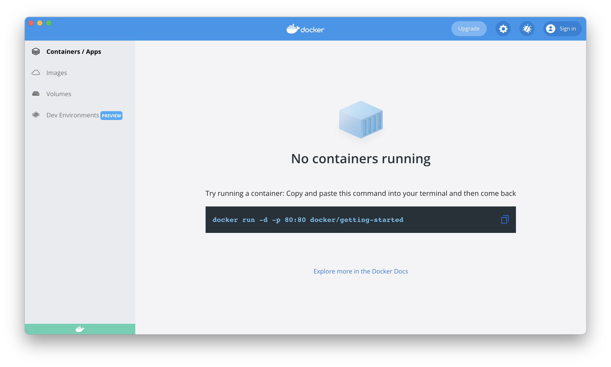

# 도커라이징

> This doc is WIP ..

<br>

1. Docker: 컨테이너와 이미지, Docker 설치하기
2. Docker 이미지 만들기: Dockerfile, 이미지 레이어 캐싱
3. 이미지 빌드하기: `docker build`

<br>

## 1. Docker: 컨테이너와 이미지, Docker 설치하기

### 1-1. 컨테이너와 이미지

[Docker](https://docs.docker.com/get-started/overview/)는 [컨테이너](https://docs.docker.com/get-started/overview/#docker-objects) 개념을 사용하여 애플리케이션의 실행 환경을 가상화하고 공유할 수 있는 플랫폼입니다. Docker에서 말하는 컨테이너란, 애플리케이션을 실행하는데 필요한 모든 것을 갖춘 독립된 환경입니다.

> Containers are lightweight and contain everything needed to run the application, so you do not need to rely on what is currently installed on the host. You can easily share containers while you work, and be sure that everyone you share with gets the same container that works in the same way. - [Docker Docs](https://docs.docker.com/get-started/overview/)

<br>

Docker에는 [이미지](https://docs.docker.com/get-started/overview/#docker-objects)라는 개념도 있는데요, 이미지는 컨테이너를 어떻게 구성하면되는지 정보를 담고있는 읽기전용 지시서입니다. 누구나 이미지를 만들 수 있으며 [Docker Hub](https://hub.docker.com/)를 통해 공유할 수 있습니다.

<br>

### 1-2. Docker 설치하기

Docker는 [공식 홈페이지](https://docs.docker.com/get-started/#download-and-install-docker)에서 다운로드하거나, macOS를 사용하신다면 다음과 같이 [Homebrew Cask](https://formulae.brew.sh/cask/docker)를 사용하여 커맨드로 설치할 수 있습니다.

```zsh
brew install --cask docker
```

<br>

Homebrew Cask를 사용하면 `/Application`에 `Docker` 앱이 생성되고요, 이 앱을 최초로 실행한 후 나타나는 안내에 따라 보조 프로그램을 설치하면 Docker 설치가 완료됩니다.




<br>

이제 `docker`와 `docker-compose` 커맨드를 사용할 수 있습니다.

```zsh
docker version
docker-compose version
```

<br>

## 2. Docker 이미지 만들기: Dockerfile, 이미지 레이어 캐싱

### 2-1. Dockerfile

Dockerfile은 이미지 생성 과정을 나열하는 파일입니다. 프로젝트 루트 경로에 Dockerfile을 만들면 되는데요, 저는 프로덕션 환경과 개발 환경을 분리하기 위해 `Dockerfile`과 `Dockerfile.dev` 파일을 각각 생성했습니다.

```zsh
touch Dockerfile Dockerfile.dev
```

<br>

Dockerfile은 Docker의 [Domain Specific 언어(DSL)](https://en.wikipedia.org/wiki/Domain-specific_language)로 작성하면 되는데요, 앱을 실행하기 위해 필요한 런타임 프로그램과 패키지 설치, 환경설정을 실행하는 커맨드들을 `Dockerfile`로 옮긴다고 생각하면 됩니다. 다음은 Docker 이미지를 테스트해보기 위해 제가 작성했던 예시로, [Vue 공식 문서 - Dockerize Vue.js App](https://kr.vuejs.org/v2/cookbook/dockerize-vuejs-app.html)을 참고했습니다.

```dockerfile
FROM node:14

# install simple http server package for serving static content
RUN yarn global add serve

# make the 'app' folder
WORKDIR /app

# copy package.json & yarn.lock file
COPY package.json yarn.lock ./

# install packages
RUN yarn install

# copy project files and folders to the current working directory
# why in seperate step from packages installation?
# see https://docs.docker.com/get-started/09_image_best/#layer-caching
COPY . .

# build project
RUN yarn build

EXPOSE 3000

CMD [ "serve", "dist" ]
```

<br>

### 2-2. 이미지 레이어 캐싱

예제 Dockerfile을 보면, 패키지 설치를 먼저 진행한 후 나머지 파일들을 이후에 옮기도록 작성된 것을 확인할 수 있습니다. `RUN yarn install` → `COPY . .` 이것은 Docker에서 중요한 [이미지 레이어 캐싱](https://docs.docker.com/get-started/09_image_best/#layer-caching) 개념을 활용한 것입니다. Docker의 이미지는 컨테이너를 구성하는데 필요한 읽기전용 지시서로, 여러 겹의 레이어로 구성됩니다. 파일이 추가되거나 수정되면 이전에 생성된 레이어는 그대로 두고, 수정된 파일이 포함된 레이어부터 변경되는 방식을 사용하여 빌드 시간을 절약합니다. Dockerfile에 작성한 커맨드들의 결과물이 바로 이미지를 구성하는 각각의 레이어가 됩니다. 이때 주의할 점은, 어떤 레이어에 변경이 생기면 다음에 만들어지는 모든 레이어는 재활용되지 않고 새로 생성된다는 것입니다.

> Once a layer changes, all downstream layers have to be recreated as well - Docker Docs

<br>

## 3. 이미지 빌드하기: `docker build`

이미지를 빌드하는 커맨드는 `docker build` 입니다. 이 커맨드는 컨텍스트(지정한 경로)와 실행 환경을 이미지로 추상화하여 Docker의 백엔드와도 같은 [Docker Daemon](https://docs.docker.com/get-started/overview/#docker-architecture)으로 보냅니다.

<br>


<br>

위에서 작성한 Dockerfile을 사용하여 개발 환경 컨테이너를 구성하기 위한 이미지를 빌드하려면 다음과 같이 커맨드를 실행하면 됩니다.

```zsh
docker build -f Dockerfile.dev -t yujinchoi/dev .
```

<br>

#### `-f`

기본적으로 `docker build` 커맨드는 현재 경로에서 `Dockerfile`이라는 이름의 파일을 찾게 되는데요, 개발 환경을 위해 만들었던 `Dockerfile.dev` 파일을 참조하게 하려면 다음과 같이 `-f` 옵션을 사용해서 명시해주어야 합니다.

<br>

#### `-t`

`-t` 옵션은 태그(Tag)를 의미합니다. Docker에서 이미지들은 URL을 사용하여 식별됩니다. 그래서 위와 같이 `yujinchoi/dev`와 같이 태그를 붙이면 되고요, 이미지가 빌드되면 태그에 자동으로 버전 번호가 따라붙습니다. 위와 같이 커맨드를 실행하면 `Dockerfile.dev` 파일에 따라 이미지를 빌드하고, 이미지 태그는 `yujinchoi/dev`로 하며, 현재경로(`.`)에 이미지를 저장한다는 의미입니다. 자세한 내용은 [Docker 공식문서](https://docs.docker.com/engine/reference/builder/#usage)를 참고하세요.

<br>

---

### References

- [Image-building best practices | Docker Docs](https://docs.docker.com/get-started/09_image_best/)
- [Dockerize a Node.js app with VS Code - Vladislav Guleaev](https://dev.to/vguleaev/dockerize-a-node-js-app-with-vs-code-29c4)
- [Dockerize a Node.js app connected to MongoDb - Vladislav Guleaev](https://dev.to/vguleaev/dockerize-a-node-js-app-connected-to-mongodb-5bp1)
- [Dockerize a React app with Node.js backend connected to MongoDb - Vladislav Guleaev](https://dev.to/vguleaev/dockerize-a-react-app-with-node-js-backend-connected-to-mongodb-10ai)
- [초보를 위한 도커 안내서 - 도커란 무엇인가? - subicura](https://subicura.com/2017/01/19/docker-guide-for-beginners-1.html)
- [초보를 위한 도커 안내서 - 설치하고 컨테이너 실행하기 - subicura](https://subicura.com/2017/01/19/docker-guide-for-beginners-2.html)
- [초보를 위한 도커 안내서 - 이미지 만들고 배포하기 - subicura](https://subicura.com/2017/02/10/docker-guide-for-beginners-create-image-and-deploy.html)
- [Docker | 실용주의 프런트엔드 개발](https://peter-cho.gitbook.io/book/15-devops/docker)
- [Dockerize Vue.js App | Vue.js](https://vuejs.org/v2/cookbook/dockerize-vuejs-app.html)
- [Building Efficient Dockerfiles - Node.js - David Weinstein](http://bitjudo.com/blog/2014/03/13/building-efficient-dockerfiles-node-dot-js/)
- [자습서: Docker 시작 | Microsoft](https://docs.microsoft.com/ko-kr/visualstudio/docker/tutorials/docker-tutorial?WT.mc_id=vscode_docker_aka_getstartedwithdocker)
