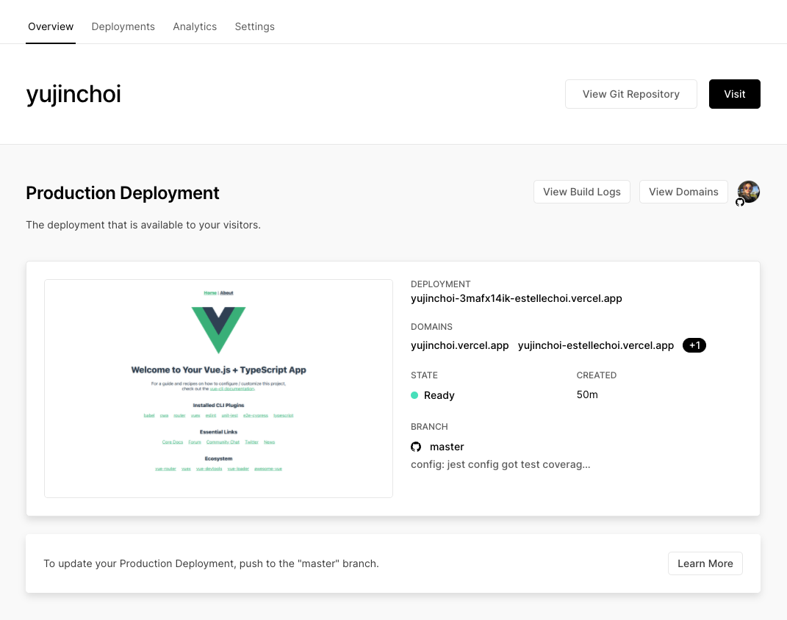
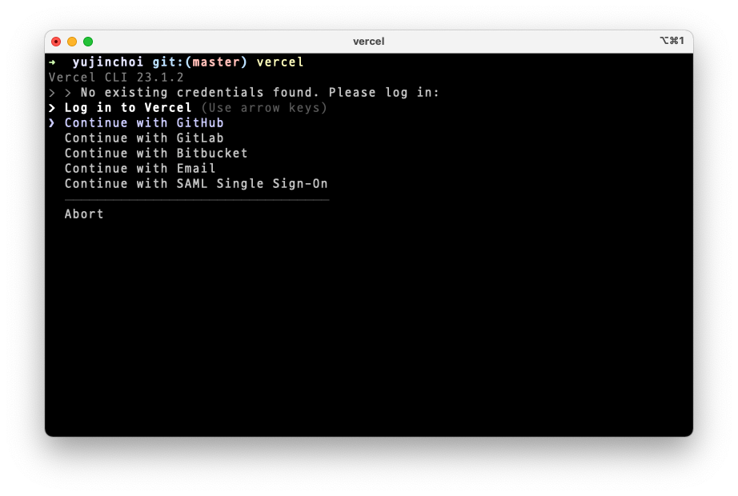
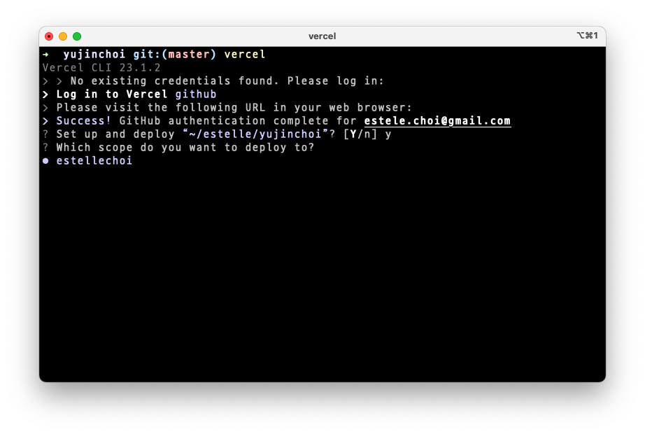
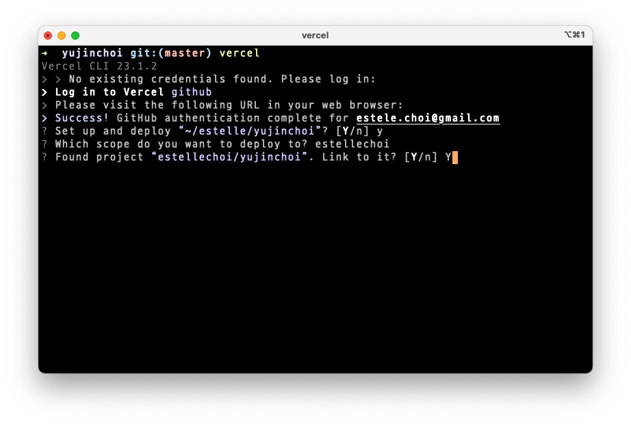
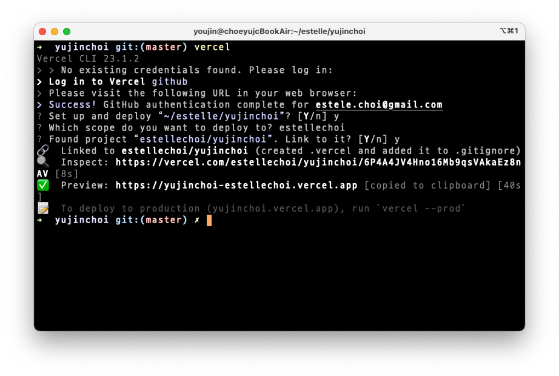
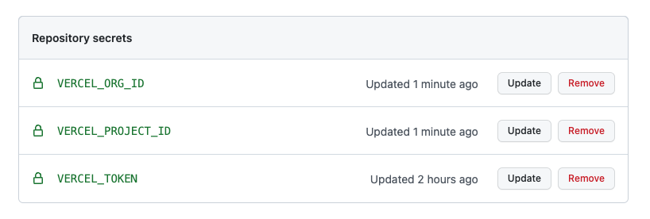

# Faas란, Vercel + GitHub Actions로 프로젝트 배포하기 (feat. Vue)

> This doc is WIP ...

<br>

1. Faas란, Vercel vs Netlify
2. Vercel, 일단 배포하기
3. Vercel CLI 설치 & 프로젝트 연결하고 `projectId`, `orgId` 확인하기
4. GitHub Actions로 테스트 + Vercel에 배포하기

<br>

## 1. Faas란, Vercel vs Netlify

### 1-1. Faas란

[Vercel](https://vercel.com/), [Netlify](https://www.netlify.com/)와 같은 서비스들이 무슨 서비스인지 이해하려면 먼저 [Faas(Funciton as a Service)](https://www.redhat.com/ko/topics/cloud-native-apps/what-is-faas)를 알아야 합니다. FaaS는 [서버리스(Serverless) 컴퓨팅](https://velopert.com/3543)을 구현하는 하나의 방식인데요, 앱을 함수로 추상화해서 컴퓨팅 자원에 등록하고 요청이 있을 때마다 함수가 실행되도록 합니다. FaaS의 장점에는 다음과 같은 것들이 있습니다.

- 확장성 : FaaS는 트래픽에 따라 서버를 늘리는 방식이 아니라, 매우 거대하고 분산된 컴퓨팅 자원에 등록된 함수가 이벤트 기반으로 호출되는 방식이기 때문에 조건에 따라 리소스를 확장한다는 개념이 없습니다. 트래픽이 늘어나면 자동으로 함수 호출 횟수가 늘어날 뿐입니다.

- 비용 : 또한, [AWS Elastic Beanstalk](https://docs.aws.amazon.com/ko_kr/elasticbeanstalk/latest/dg/Welcome.html) 같은 [PaaS(Platform as a Service)](https://www.ibm.com/kr-ko/cloud/learn/paas)와는 달리, 앱 배포 후 24시간 서버가 작동하는 것이 아닙니다. 요청이 있을 때만 함수가 호출되어 작동하기 때문에 사용된 리소스에 대해서만 과금됩니다.

<br>

### 1-2. Vercel vs Netlify

가장 대표적인 FaaS는 [AWS Lambda](https://aws.amazon.com/ko/lambda/)입니다. Vercel과 Netlify 모두 AWS Lambda 기반이고요. 두 서비스 모두 GitHub과의 조합이 Awesome해서 아무것도 모르고 시도부터 해봤는데 단 몇 분만에 배포가 가능했습니다! 다만 어떻게 각 서비스를 비교하고 더 적합한 것을 판단할 수 있는지 알기 위해 서칭을 해보다가 [Netlify vs. Vercel: A Comparison - Max Niederman](https://dev.to/maxniederman/netlify-vs-vercel-a-comparison-5643) 글을 찾았습니다. [서버리스 함수](https://www.serverless.com/framework/docs/providers/aws/guide/functions) 사용법, Netlify의 [GoTrue API](https://github.com/netlify/gotrue) 같은 Authentication API 제공여부, 정적사이트 A/B 테스트 구현 용이성 등에서 차이가 있었고, 가격에서는 큰 차이가 없었습니다.

<br>

## Vercel, 일단 배포하기

Vercel로 배포하는 것 자체는 매우 간단합니다. [Vercel 프로젝트 만들기](https://vercel.com/new) 페이지에서 배포하려는 프로젝트 코드가 있는 Git 레포지토리를 Import 한 후, 앱 빌드 스크립트, 패키지 설치 스크립트, 환경변수, Output 디렉토리 등을 입력하고 `Deploy` 버튼을 클릭하면 바로 배포됩니다. 이 과정에 대한 설명이 필요하다면 [Deploying React & Vue Applications With Vercel](https://medium.com/swlh/deploying-react-vue-applications-with-vercel-42aa642534d5) 블로그 글이나 [Preparing for automatic deployment on Vercel with GitHub](https://books.google.co.kr/books?id=wED-DwAAQBAJ&pg=PA452&lpg=PA452&dq=vue+vercel&source=bl&ots=YuzntMpcKp&sig=ACfU3U3FFArUTJKV0BmvH3HnDyqfTyEATA&hl=ko&sa=X&ved=2ahUKEwiV4qjPz5T1AhUDMd4KHR29B_wQ6AF6BAgZEAM#v=onepage&q=vue%20vercel&f=false) p.455를 참고하세요.

<br>

배포를 하고 대시보드로 이동하면, 다음과 같이 `Production Deployment` 섹션에 프로젝트의 배포 정보가 표시되는 것을 확인할 수 있습니다. 상단 탭 중에서 `Settings` 탭으로 이동하면 프로젝트 이름과 도메인, 연결된 Git 레포지토리, 프로덕션 브랜치, 환경변수 등 프로젝트 배포에 대한 각종 설정을 할 수 있습니다.



<br>

팀에서 Private 레포지토리에 있는 프로젝트를 배포하는 경우라면, Commit을 하는 사람이 Vercel에 등록된 해당 프로젝트에 접근 권한을 갖고 있어야 합니다. 자세한 내용은 [Deploying Private Git Repositories](https://vercel.com/docs/concepts/git#deploying-private-git-repositories) 문서를 참고하세요.

<br>

## 3. Vercel CLI 설치 & 프로젝트 연결하고 `projectId`, `orgId` 확인하기

기본적인 빌드 스크립트 외에 슬랙 Notification, Lighthouse 보고서 생성 등 Delivery 과정을 커스텀하려면, CD 파이프라인을 구축할 때 [Vercel CLI](https://vercel.com/docs/cli#)를 사용할 수 있습니다.

<br>

### 3-1. 설치

먼저 Vercel CLI를 설치합니다. 저는 아래와 같이 전역 설치했습니다.

```zsh
yarn global add vercel
```

<br>

이제 Vercel에 배포하려는 프로젝트의 루트 경로에서 [`vercel`](https://vercel.com/docs/cli#commands/overview/basic-usage) 명령어를 실행하면 배포가 시작되고, 문제가 없다면 Preview 배포가 완료됩니다. Production 배포를 하려면 `--prod` 옵션을 사용해야 합니다.

```zsh
vercel --prod
```

<br>

### 3-2. 프로젝트 연결

`vercel`은 기본적으로 배포를 시작하는 명령어입니다. 하지만 `vercel` 명령어를 실행하는 디렉토리 경로에 `.vercel/project.json` 파일이 없다면 (보통 최초로 명령어를 실행하는 경우) [Vercel 프로젝트를 연결하는 작업이 선행](https://vercel.com/docs/cli#commands/overview/project-linking)됩니다. 배포가 진행되려면 `.vercel/project.json` 파일이 Vercel 계정 정보와 어떤 Vercel 프로젝트에 배포해야하는지 정보를 제공해줘야하기 때문입니다.

```zsh
vercel
```

<br>

프로세스에 따라 Vercel 계정에 로그인하고, 프로젝트를 연결합니다.







<br>

다음과 같이 [`--token`](https://vercel.com/docs/cli#options/global-options/token) 옵션을 사용하면 로그인 단계는 건너뛸 수 있습니다.

```zsh
vercel --token iZJb2oftmY4ab12HBzyBXMkp
```

<br>

프로젝트 연결이 완료되면 로컬의 프로젝트 루트 경로에 `.vercel` 디렉토리가 생성됩니다. (`.gitignore`에 해당 경로가 추가되고요) `.vercel/project.json` 파일을 열어보면 `projectId`, `orgId` 필드를 확인할 수 있는데요, 이 필드의 값들은 배포 명령어를 실행할 때 Vercel에 로그인하고 배포 대상인 프로젝트를 식별하는데 사용됩니다. Vercel 계정의 대시보드를 확인해보면, 프로젝트 연결과 함께 Preview 배포가 된 것을 확인할 수 있습니다.

<br>

### 3-3. Vercel for GitHub 자동 배포 Disable

그 다음, [Vercel for GitHub](https://vercel.com/docs/concepts/git/vercel-for-github) 앱이 설치된 GitHub 레포지토리에 `push`가 발생했을 때 자동 배포되는 것을 막기 위해 별도의 설정이 필요합니다. 프로젝트 루트 경로에 `vercel.json`을 생성하고, 다음과 같이 `github` 필드를 설정합니다.

```json
{
    "github": {
      "enabled": false,
      "silent": true
    }
}
```

<br>

- [`enabled`](https://vercel.com/docs/cli#git-configuration/github-enabled): 레포지토리에 이 설치되어있으면 Vercel에 자동 배포함
- [`silent`](https://vercel.com/docs/cli#git-configuration/github-silent): Vercel for GitHub 봇이 PR과 커밋에 자동으로 댓글다는 것을 Disable

<br>

## 4. GitHub Actions로 Vercel에 배포하기

### 4-1. CD 파이프라인 계획

이제 [GitHub Actions를 사용](./../git/actions.md)하여 Vercel에 배포하는 CD 파이프라인을 구축해보겠습니다. 저는 배포 파이프라안에서 다음 일들을 수행하려고 합니다.

- `master` 브랜치에 대한 `pull_request`가 머지되면 자동 배포 시작
- Test Suite를 실행하고, 통과시에만 계속 진행
- Vercel에 Preview 배포
- Vercel Preview에 대해 테스트 실행하고, 통과시에만 계속 진행
- Vercel에 Production 배포

<br>

### 4-2. GitHub Secret 등록

Vercel에 배포할 때 필요한 3가지 값을 GitHub 레포지토리의 [Secret](https://docs.github.com/en/actions/security-guides/encrypted-secrets)으로 등록합니다.

- `VERCEL_PROJECT_ID`: `.vercel/project.json` 파일의 `projectId` 필드 값
- `VERCEL_ORG_ID`: `.vercel/project.json` 파일의 `orgId` 필드 값
- `VERCEL_TOKEN`: Vercel에 로그인하기 위해 필요한 토큰 ([Personal Account Settings](https://vercel.com/account/tokens)에서 생성)

<br>



<br>

### 4-3. Workflow 작성

저는 다음과 같이 Workflow 파일 `.github/workflows/cd.yml`을 작성했습니다. Vercel에 배포하는 단계에서 써드파티 Action인 [Vercel Action](https://github.com/amondnet/vercel-action#outputs)을 사용했는데요, 이 Action은 Vercel CLI를 사용합니다.

```yml
name: CD

on:
  push:
    branches: [ master ]
  pull_request:
    branches: [ master ]

  # Allows you to run this workflow manually from the Actions tab
  workflow_dispatch:

jobs:
  deploy:
    runs-on: ubuntu-latest
    strategy:
      matrix:
        node-version: [14.x]
        # See supported Node.js release schedule at https://nodejs.org/en/about/releases/
    steps:
      - name: Repo checkout
        uses: actions/checkout@v2
        # Repo checkout under $GITHUB_WORKSPACE
        
      - name: Setup Node.js ${{ matrix.node-version }}
        uses: actions/setup-node@v2
        with:
          node-version: ${{ matrix.node-version }}
          
      - name: Install packages
        run: yarn install
        
      - name: Run unit test locally
        run: yarn test:unit
        
      - name: Deploy to preview
        id: vercel-preview
        uses: amondnet/vercel-action@v20
        with:
          vercel-token: ${{ secrets.VERCEL_TOKEN }}
          vercel-org-id: ${{ secrets.VERCEL_ORG_ID }}
          vercel-project-id: ${{ secrets.VERCEL_PROJECT_ID }}
          scope: ${{ secrets.VERCEL_ORG_ID }}
          
      - name: Run unit test against Vercel preview
        env:
          VERCEL_URL: ${{ steps.vercel-preview.outputs.preview-url }}
          # see doc at https://github.com/amondnet/vercel-action#outputs
        run: yarn test:unit
        
      - name: Deploy to production
        id: vercel-production
        uses: amondnet/vercel-action@v20
        if: ${{ github.event_name == 'pull_request' && github.ref == 'refs/heads/master' }}
        with:
          vercel-token: ${{ secrets.VERCEL_TOKEN }}
          vercel-org-id: ${{ secrets.VERCEL_ORG_ID }}
          vercel-project-id: ${{ secrets.VERCEL_PROJECT_ID }}
          scope: ${{ secrets.VERCEL_ORG_ID }}
          vercel-args: '--prod'
```

<br>

`Run unit test against Vercel preview` 단계에서는 GitHub Actions의 [`steps`](https://docs.github.com/en/actions/learn-github-actions/contexts#steps-context) 컨텍스트와 [`amondnet/vercel-action@v20`의 Output](https://github.com/amondnet/vercel-action#outputs)을 사용하여 Vercel Preview에 배포된 URL을 얻었고요, 이를 `VERCEL_URL`이라는 환경변수로 세팅했습니다. 이 환경변수를 사용하여 로컬에서의 테스트와 Vercel에서의 테스트를 분기할 수 있습니다.

```yml
      - name: Run unit test against Vercel preview
        env:
          VERCEL_URL: ${{ steps.vercel-preview.outputs.preview-url }}
        run: yarn test:unit
```

<br>

다음은 [Jest](https://jestjs.io/)에서 사용하는 테스트 파일을 예로 들었습니다.

```typescript
// tests/example.spec.ts
import { shallowMount } from "@vue/test-utils";
import HelloWorld from "@/components/HelloWorld.vue";

if (process.env.VERCEL_URL) {
  console.log("This test is running against Vercel.");
}

describe("HelloWorld.vue", () => {
  it("renders props.msg when passed", () => {
    const msg = "new message";
    const wrapper = shallowMount(HelloWorld, {
      props: { msg },
    });
    expect(wrapper.text()).toMatch(msg);
  });
});
```

<br>

---

### References

- [서버리스 아키텍쳐(Serverless)란? | VELOPERT.LOG](https://velopert.com/3543)
- [서비스로서의 기능(Function-as-a-Service, FaaS)이란? | Red Hat](https://www.redhat.com/ko/topics/cloud-native-apps/what-is-faas)
- [Netlify vs. Vercel: A Comparison - Max Niederman](https://dev.to/maxniederman/netlify-vs-vercel-a-comparison-5643)
- [nextJS 뭘로 배포할까? (Netlify, Vercel, Github page) | Learn in Public](https://taeny.dev/javascript/nextjs-with-deployment-platform/)
- [CLI & Config | Vercel](https://vercel.com/docs/cli)
- [Deploying a Vue.js App with Vercel | Vercel](https://vercel.com/guides/deploying-vuejs-to-vercel)
- [Vercel Examples](https://github.com/vercel/vercel/tree/main/examples)
- [Configuring the Vercel-CLI and deploying your project | Vue.js 3 Cookbook](https://books.google.co.kr/books?id=wED-DwAAQBAJ&pg=PA452&lpg=PA452&dq=vue+vercel&source=bl&ots=YuzntMpcKp&sig=ACfU3U3FFArUTJKV0BmvH3HnDyqfTyEATA&hl=ko&sa=X&ved=2ahUKEwiV4qjPz5T1AhUDMd4KHR29B_wQ6AF6BAgZEAM#v=onepage&q=vue%20vercel&f=false)
- [Deploy your site to Vercel using GitHub Actions and Releases - Elio Struyf](https://dev.to/estruyf/deploy-your-site-to-vercel-using-github-actions-and-releases-1l3l)
- [The Perfect Vercel + GitHub Actions Deployment Pipeline](https://aaronfrancis.com/2021/the-perfect-vercel-github-actions-deployment-pipeline)
- [Github Actions, Vercel 및 Heroku를 사용하여 지속적 배포 및 분기 프로세스를 구축해 보겠습니다](https://ichi.pro/ko/github-actions-vercel-mich-herokuleul-sayonghayeo-jisogjeog-baepo-mich-bungi-peuloseseuleul-guchughae-bogessseubnida-213845046587574)
- [Deploy Nuxt with Vercel | NuxtJS](https://nuxtjs.org/deployments/vercel/)