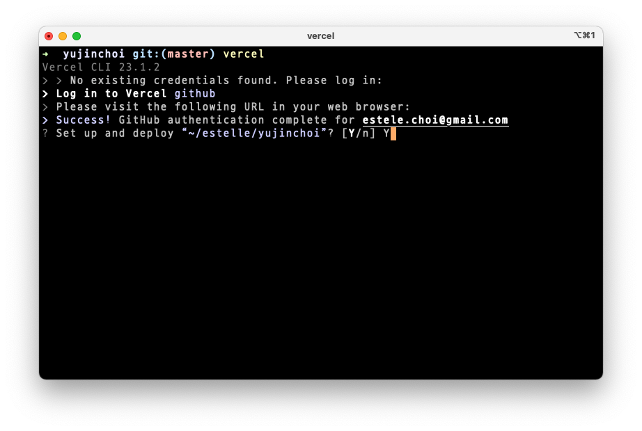

# FaaS란, Vercel + GitHub Actions로 프로젝트 배포하기 (feat. Vue)

> This doc is WIP ...

<br>

1. FaaS란, 장단점, 람다 함수
2. Vercel vs Netlify
3. Vercel, 일단 배포하기
4. Vercel CLI 설치 & 프로젝트 연결하고 `projectId`, `orgId` 확인하기
5. GitHub Actions로 Vercel에 배포하는 CD 파이프라인 구축하기

<br>

## 1. FaaS란, 장단점, 람다 함수

### 1-1. FaaS란

프론트엔드 배포에 많이 사용되는 [Vercel](https://vercel.com/), [Netlify](https://www.netlify.com/)와 같은 서비스들이 무슨 서비스인지 이해하려면 먼저 [FaaS(Funciton as a Service)](https://www.redhat.com/ko/topics/cloud-native-apps/what-is-faas)를 알아야 합니다. FaaS는 [서버리스(Serverless)](https://velopert.com/3543)를 구현하는 하나의 방식/서비스인데요, 애플리케이션을 함수로 추상화해서 거대하고 분산된 컴퓨팅 자원에 등록하고 HTTP 요청같은 이벤트가 발생할 때마다 함수를 호출하여 애플리케이션을 Serve하도록 합니다. FaaS의 장단점으로는 다음과 같은 것들이 있습니다.

<br>

#### 장점

- 확장성 : FaaS는 트래픽에 따라 서버를 늘리는 방식이 아니라, 매우 거대하고 분산된 컴퓨팅 자원에 등록된 함수가 이벤트 기반으로 호출되는 방식이기 때문에 조건에 따라 리소스를 확장한다는 개념이 없습니다. 트래픽이 늘어나면 자동으로 함수 호출 횟수가 늘어날 뿐입니다.

- 사용된 리소스에 대해서만 과금 : 애플리케이션을 배포하는 시점부터 24시간 리소스를 사용하며 Serving하지 않고, 요청이 있을 때만 함수가 호출되며 함수 호출시마다 과금되기 때문에 사용된 리소스에 대해서만 비용이 발생합니다.

<br>

FaaS 참 좋은 것 같은데, [AWS Elastic Beanstalk](https://docs.aws.amazon.com/ko_kr/elasticbeanstalk/latest/dg/Welcome.html) 같은 Non-FaaS를 쓰는 이유는 무엇일지 생각해보게 되었습니다. 서칭도 해보고 지인 분들에게 물어본 결과 다음과 같이 고려할 사항들을 정리할 수 있었습니다.

<br>

#### 단점

- 트래픽이 많은 서비스라면 Non-FaaS보다 훨씬 큰 비용이 발생할 수 있습니다.

> Large apps can reach the cost curve limits of serverless. Bank of America, for example, announced $2B in savings from building their own data centers. - [Serverless Pros & Cons - when should you go serverless? | Serverless Handbook](https://serverlesshandbook.dev/serverless-pros-cons)

- 요청에 대한 응답 속도가 느리기 때문에 API 서버로 사용하기 어렵습니다. 애플리케이션이 특정한 서버 인스턴스에 고정되어있지 않고, 이벤트가 발생했을 때 사용 가능한 리소스를 찾아 할당 및 실행한 후 다시 할당 해제하는 방식이기 때문입니다.

<br>

### 1-3. 람다 함수

가장 대표적인 FaaS는 [AWS Lambda](https://aws.amazon.com/ko/lambda/)입니다. Vercel과 Netlify 모두 AWS Lambda 기반이고요. 서비스 이름에 붙은 람다(Lambda)처럼, FaaS는 람다 함수 개념을 사용합니다. 클라우드 컴퓨팅 맥락에서 람다 함수는 HTTP 요청, [메시지 큐](https://en.wikipedia.org/wiki/Message_queue) 등의 이벤트를 인자로 받고 애플리케이션을 반환하는 함수를 말합니다. [람다 대수](https://en.wikipedia.org/wiki/Lambda_calculus)를 기원으로 하는 [함수형 프로그래밍](https://en.wikipedia.org/wiki/Functional_programming) 원칙들을 똑같이 따릅니다.

> A lambda always follows this pattern 👉 function with an event and a return value. - [Elements of serverless - lambdas, queues, gateways, and more](https://serverlesshandbook.dev/serverless-elements)

<br>

## 2. Vercel vs Netlify

Vercel과 Netlify는 [Jamstack](https://www.cloudflare.com/ko-kr/learning/performance/what-is-jamstack/)을 지원하는 AWS Lambda 기반의 배포 서비스입니다. Vercel, Netlify 두 서비스 모두 GitHub과의 조합이 Awesome해서 아무것도 모르고 시도부터 해봤는데 단 몇 분만에 배포가 가능했습니다! 두 서비스를 비교해보자면, [서버리스 함수](https://www.serverless.com/framework/docs/providers/aws/guide/functions) 사용법, Netlify의 [GoTrue API](https://github.com/netlify/gotrue) 같은 Authentication API 제공여부, 정적사이트 A/B 테스트 구현 용이성 등에서 차이가 있었고, 가격 정책에도 차이가 있었지만 가격면에서의 메리트는 서비스에 따라 다를 것 같습니다. 아래 글들이 두 서비스를 비교하는데 도움이 되었습니다.

- [Netlify vs. Vercel: A Comparison - Max Niederman](https://dev.to/maxniederman/netlify-vs-vercel-a-comparison-5643)
- [Vercel vs. Netlify: Jamstack Deployment & Hosting Solutions Comparison | SNIPCART](https://snipcart.com/blog/vercel-vs-netlify)

<br>

## 3. Vercel, 일단 배포하기

Vercel로 배포하는 것 자체는 매우 간단합니다. [Vercel 프로젝트 만들기](https://vercel.com/new) 페이지에서 배포하려는 프로젝트 코드가 있는 GitHub 레포지토리를 Import 한 후, 앱 빌드 스크립트, 패키지 설치 스크립트, 환경변수, Output 디렉토리 등을 입력하고 `Deploy` 버튼을 클릭하면 바로 배포됩니다. 그리고 Import한 GitHub 레포지토리에 [Vercel for GitHub](https://vercel.com/docs/concepts/git/vercel-for-github) 앱이 자동으로 설치되는데요, 이 앱은 레포지토리의 Pull Request가 `merge`되거나 `push`가 발생하면 Vercel에 자동으로 배포하고 댓글을 남기는 일들을 합니다. 이 최초 배포 과정에 대한 설명이 필요하다면 [Deploying React & Vue Applications With Vercel](https://medium.com/swlh/deploying-react-vue-applications-with-vercel-42aa642534d5) 블로그 글이나 [Preparing for automatic deployment on Vercel with GitHub](https://books.google.co.kr/books?id=wED-DwAAQBAJ&pg=PA452&lpg=PA452&dq=vue+vercel&source=bl&ots=YuzntMpcKp&sig=ACfU3U3FFArUTJKV0BmvH3HnDyqfTyEATA&hl=ko&sa=X&ved=2ahUKEwiV4qjPz5T1AhUDMd4KHR29B_wQ6AF6BAgZEAM#v=onepage&q=vue%20vercel&f=false) p.455를 참고하세요.

<br>

배포를 하고 대시보드로 이동하면, 다음과 같이 `Production Deployment` 섹션에 프로젝트의 배포 정보가 표시되는 것을 확인할 수 있습니다. 상단 탭 중에서 `Settings` 탭으로 이동하면 프로젝트 이름과 도메인, 연결된 Git 레포지토리, 프로덕션 브랜치, 환경변수 등 프로젝트 배포에 대한 각종 설정을 할 수 있습니다.


<br>

팀에서 Private 레포지토리에 있는 프로젝트를 배포하는 경우라면, Commit을 하는 사람이 Vercel에 등록된 해당 프로젝트에 접근 권한을 갖고 있어야 합니다. 자세한 내용은 [Deploying Private Git Repositories](https://vercel.com/docs/concepts/git#deploying-private-git-repositories) 문서를 참고하세요.

<br>

## 4. Vercel CLI 설치 & 프로젝트 연결하고 `projectId`, `orgId` 확인하기

기본적인 빌드 스크립트 외에 슬랙 Notification, Lighthouse 보고서 생성 등 Delivery 과정을 커스텀하려면, CD 파이프라인을 구축할 때 [Vercel CLI](https://vercel.com/docs/cli#)를 사용할 수 있습니다.

<br>

### 4-1. 설치

먼저 Vercel CLI를 설치합니다. 저는 아래와 같이 전역 설치했습니다.

```zsh
yarn global add vercel
```

<br>

이제 Vercel에 배포하려는 프로젝트의 루트 경로에서 [`vercel`](https://vercel.com/docs/cli#commands/overview/basic-usage) 명령어를 실행하면 배포가 시작되고, 문제가 없다면 Preview 배포가 완료됩니다. Production 배포를 하려면 `--prod` 옵션을 사용해야 합니다.

```zsh
vercel --prod
```

<br>

### 4-2. 프로젝트 연결

`vercel`은 기본적으로 배포를 시작하는 명령어입니다. 하지만 `vercel` 명령어를 실행하는 디렉토리 경로에 `.vercel/project.json` 파일이 없다면 (보통 최초로 명령어를 실행하는 경우) [Vercel 프로젝트를 연결하는 작업이 선행](https://vercel.com/docs/cli#commands/overview/project-linking)됩니다. 배포가 진행되려면 `.vercel/project.json` 파일이 Vercel 계정 정보와 어떤 Vercel 프로젝트에 배포해야하는지 정보를 제공해줘야하기 때문입니다.

```zsh
vercel
```

<br>

프로세스에 따라 Vercel 계정에 로그인하고, 프로젝트를 연결합니다.





<br>

다음과 같이 [`--token`](https://vercel.com/docs/cli#options/global-options/token) 옵션을 사용하면 로그인 단계는 건너뛸 수 있습니다.

```zsh
vercel --token iZJb2oftmY4ab12HBzyBXMkp
```

<br>

프로젝트 연결이 완료되면 로컬의 프로젝트 루트 경로에 `.vercel` 디렉토리가 생성됩니다. (`.gitignore`에 해당 경로가 추가되고요) `.vercel/project.json` 파일을 열어보면 `projectId`, `orgId` 필드를 확인할 수 있는데요, 이 필드의 값들은 배포 명령어를 실행할 때 Vercel에 로그인하고 배포 대상인 프로젝트를 식별하는데 사용됩니다. Vercel 계정의 대시보드를 확인해보면, 프로젝트 연결과 함께 Preview 배포가 된 것을 확인할 수 있습니다.

<br>

### 4-3. Vercel for GitHub 자동 배포 Disable

그 다음, [Vercel for GitHub](https://vercel.com/docs/concepts/git/vercel-for-github) 앱이 설치된 GitHub 레포지토리에 `push`가 발생했을 때 자동 배포되는 것을 막기 위해 별도의 설정이 필요합니다. 프로젝트 루트 경로에 `vercel.json`을 생성하고, 다음과 같이 `github` 필드를 설정합니다.

```json
{
	"github": {
		"enabled": false,
		"silent": true
	}
}
```

<br>

- [`enabled`](https://vercel.com/docs/cli#git-configuration/github-enabled): 레포지토리에서 `merge`/`push` 발생시 Vercel에 자동 배포함
- [`silent`](https://vercel.com/docs/cli#git-configuration/github-silent): Vercel for GitHub 봇이 PR과 Commit에 자동으로 댓글다는 것을 Disable

<br>

## 5. GitHub Actions로 Vercel에 배포하는 CD 파이프라인 구축하기

### 5-1. CD 파이프라인 계획

이제 [GitHub Actions를 사용](./../git/actions.md)해서 Vercel에 배포하는 CD 파이프라인을 구축해보겠습니다. 저는 배포 파이프라인에서 다음 일들을 수행할거고요, 각 단계를 통과해야만 다음 단계로 넘어갈 수 있습니다. ([GitFlow](https://nvie.com/posts/a-successful-git-branching-model/)를 사용한다고 가정)

<br>

#### Preview 배포 (Staging)

1. `develop` 브랜치에 대한 `pull_request`가 머지되면 Workflow 시작
2. [테스트 Suite](https://en.wikipedia.org/wiki/Test_suite) 실행
3. 테스트 통과시 → `develop` 브랜치를 Vercel Preview 배포
4. 배포 성공시 → Vercel Preview에 대해 테스트 실행
5. Slack 채널로 결과 알림 전송

<br>

#### Production 배포

1. `master` 브랜치에 대한 `pull_request`가 머지되면 Workflow 시작
2. `master` 브랜치를 Vercel Production 배포
3. Slack 채널로 결과 알림 전송

<br>

### 5-2. GitHub Secret 등록

Workflow를 작성하기 전에, GitHub 레포지토리의 [Secret](https://docs.github.com/en/actions/security-guides/encrypted-secrets)에 암호화와 보호가 필요한 값들을 먼저 등록합니다. 저의 경우, Slack 알림 전송시 필요한 값과 Vercel CLI를 사용하여 배포할 때 필요한 값들입니다.

- `SLACK_WEBHOOK`: Slack 알림을 보낼 때 필요 ([Slack Webhook URL](https://api.slack.com/messaging/webhooks) 참고)
- `VERCEL_PROJECT_ID`: `.vercel/project.json` 파일의 `projectId` 필드 값
- `VERCEL_ORG_ID`: `.vercel/project.json` 파일의 `orgId` 필드 값
- `VERCEL_TOKEN`: Vercel에 로그인하기 위해 필요한 토큰 ([Personal Account Settings](https://vercel.com/account/tokens)에서 생성)

<br>


<br>

### 5-3. 앱 환경변수 등록

앱이 런타임에서 사용하는 환경변수가 있다면, Vercel의 프로젝트 설정 페이지에서 [Environment Variables](https://vercel.com/docs/concepts/projects/environment-variables)로 추가해놓아야 합니다. 그럼 Vercel이 배포를 실행할 때 자동으로 `.env` 파일을 생성하고 앱을 빌드할 때 포함시킵니다.

<br>

### 5-4. Workflow 작성

저는 다음과 같이 Workflow 파일 `.github/workflows/preview-deployment.yml`을 작성했습니다. Vercel에 배포하는 단계는 Vercel CLI를 직접 사용하지 않고 써드파티 Action인 [`amondnet/vercel-action@v20`](https://github.com/amondnet/vercel-action)을 사용했습니다.

```yml
# preview-deployment.yml
name: Preview Deployment

on:
  pull_request:
    branches: [develop]

  # Allows you to run this workflow manually from the Actions tab
  workflow_dispatch:

jobs:
  deploy:
    runs-on: ubuntu-latest
    strategy:
      matrix:
        node-version: [14.x]
        # See supported Node.js release schedule at https://nodejs.org/en/about/releases/
    steps:
      - name: Repo checkout
        uses: actions/checkout@v2
        with:
          ref: develop
        # Repo checkout under $GITHUB_WORKSPACE, doc at https://github.com/actions/checkout

      - name: Setup Node.js ${{ matrix.node-version }}
        uses: actions/setup-node@v2
        with:
          node-version: ${{ matrix.node-version }}

      - name: Install packages
        run: yarn install

      - name: Set envs
        env:
          APP_ENV_SET: ${{ secrets.APP_ENV_SET || '' }}
        run: |
          echo "${APP_ENV_SET}" > .env
          cat .env

      - name: Run unit test
        id: unit-test
        run: yarn test:unit
        continue-on-error: true

      - name: Run e2e test
        id: e2e-test
        run: yarn test:e2e
        continue-on-error: true

      - name: Deploy to Vercel Preview
        id: vercel-preview
        if: ${{ success() }}
        uses: amondnet/vercel-action@v20
        with:
          vercel-token: ${{ secrets.VERCEL_TOKEN }}
          vercel-org-id: ${{ secrets.VERCEL_ORG_ID }}
          vercel-project-id: ${{ secrets.VERCEL_PROJECT_ID }}
          scope: ${{ secrets.VERCEL_ORG_ID }}
          # vercel-args: '--prod' (this is for production deployment)

      - name: Slack notification
        if: ${{ always() }}
        env:
          SLACK_WEBHOOK_URL: ${{ secrets.SLACK_WEBHOOK }}
          VERCEL_URL: ${{ steps.vercel-preview.outputs.preview-url }}
          # see doc at https://github.com/amondnet/vercel-action#outputs
        uses: edge/simple-slack-notify@master
        with:
          channel: "#notification"
          username: "CI/CD Bot"
          status: ${{ job.status }}
          success_text: |
            🥳 Success!
            * unit test → ${{ steps.unit-test.conclusion }}
            * e2e → ${{ steps.e2e-test.conclusion }}\n
          failure_text: |
            😭 Failed
            * unit test → ${{ steps.unit-test.conclusion }}
            * e2e → ${{ steps.e2e-test.conclusion }}\n
          cancelled_text: |
            😭 Cancelled
            * unit test → ${{ steps.unit-test.conclusion }}
            * e2e → ${{ steps.e2e-test.conclusion }}\n
          fields: |
            [{ "title": "Repository", "value": "${env.GITHUB_SERVER_URL}/${env.GITHUB_REPOSITORY}", "short": true },
            { "title": "Ref", "value": "${env.GITHUB_REF_NAME}", "short": true },
            { "title": "Workflow", "value": "${env.GITHUB_WORKFLOW}", "short": true },
            { "title": "Job", "value": "${env.GITHUB_JOB}", "short": true },
            { "title": "Actor", "value": "@${env.GITHUB_ACTOR}", "short": true },
            { "title": "Deployed URL", "value": "${env.VERCEL_URL}" }]
```

<br>

---

### References

- [서버리스 아키텍쳐(Serverless)란? | VELOPERT.LOG](https://velopert.com/3543)
- [서비스로서의 기능(Function-as-a-Service, FaaS)이란? | Red Hat](https://www.redhat.com/ko/topics/cloud-native-apps/what-is-faas)
- [Jamstack WTF](https://jamstack.wtf/)
- [AWS, Azure, Vercel, Netlify, or Firebase? | Serverless Handbook](https://serverlesshandbook.dev/serverless-flavors/)
- [Netlify vs. Vercel: A Comparison - Max Niederman](https://dev.to/maxniederman/netlify-vs-vercel-a-comparison-5643)
- [nextJS 뭘로 배포할까? (Netlify, Vercel, Github page) | Learn in Public](https://taeny.dev/javascript/nextjs-with-deployment-platform/)
- [CLI & Config | Vercel](https://vercel.com/docs/cli)
- [Deploying a Vue.js App with Vercel | Vercel](https://vercel.com/guides/deploying-vuejs-to-vercel)
- [Vercel Examples](https://github.com/vercel/vercel/tree/main/examples)
- [Configuring the Vercel-CLI and deploying your project | Vue.js 3 Cookbook](https://books.google.co.kr/books?id=wED-DwAAQBAJ&pg=PA452&lpg=PA452&dq=vue+vercel&source=bl&ots=YuzntMpcKp&sig=ACfU3U3FFArUTJKV0BmvH3HnDyqfTyEATA&hl=ko&sa=X&ved=2ahUKEwiV4qjPz5T1AhUDMd4KHR29B_wQ6AF6BAgZEAM#v=onepage&q=vue%20vercel&f=false)
- [Deploy your site to Vercel using GitHub Actions and Releases - Elio Struyf](https://dev.to/estruyf/deploy-your-site-to-vercel-using-github-actions-and-releases-1l3l)
- [The Perfect Vercel + GitHub Actions Deployment Pipeline](https://aaronfrancis.com/2021/the-perfect-vercel-github-actions-deployment-pipeline)
- [Github Actions, Vercel 및 Heroku를 사용하여 지속적 배포 및 분기 프로세스를 구축해 보겠습니다](https://ichi.pro/ko/github-actions-vercel-mich-herokuleul-sayonghayeo-jisogjeog-baepo-mich-bungi-peuloseseuleul-guchughae-bogessseubnida-213845046587574)
- [Deploy Nuxt with Vercel | NuxtJS](https://nuxtjs.org/deployments/vercel/)
