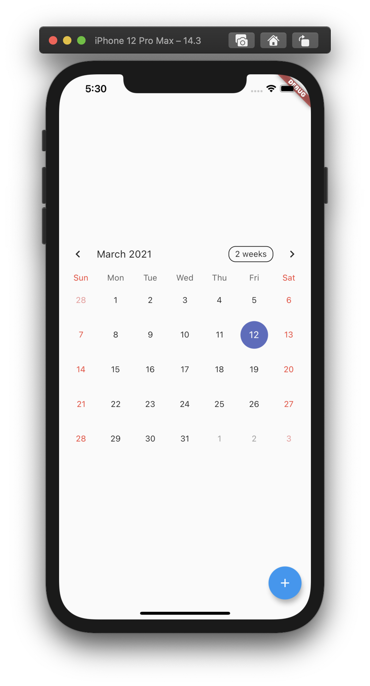

# Flutter 사용법

> [Flutter](https://flutter.dev/docs/get-started/codelab) 공식문서를 요약/번역한 튜토리얼 문서입니다. 이 튜토리얼에서는 간단한 캘린더 앱을 만들어볼 건데요, 이름은 Hinoki Calendar라고 하겠습니다.

<br>

## Flutter와 Material

> [Material](https://material.io/guidelines) is a visual design language that is standard on mobile and the web.

<br>

Flutter는 Material Design에 기반한 다양한 위젯(Widget)을 제공합니다. Flutter를 처음 사용해보신다면, Material 라이브러리를 사용하여 간단한 앱을 개발해보는 것이 사용법을 익히기 편하겠다는 생각입니다. Flutter에서 Material 위젯들을 사용하려면 프로젝트 루트 경로에 있는 `pubspec.yaml`파일을 열어보시고요, `flutter` 섹션에 `uses-material-design: true` 설정을 추가하세요. Android Studio 편집기를 사용하여 Flutter 프로젝트를 생성하셨다면 아마 이 설정이 기본으로 추가되어 있을겁니다.

<br>

## 위젯(Widget)

앱을 실행시키는 코드는 `lib/main.dart` 파일에 있습니다. Material 위젯들을 사용하기 위해 파일 상단에 해당 라이브러리를 임포트해주세요.

```dart
import 'package:flutter/material.dart';
```

<br>

앱은 `main()` 메소드 내에서 실행시킵니다. `MyApp`은 최상위 위젯의 이름이고요.

```dart
void main() => runApp(MyApp());
```

<br>

이 최상위 위젯은 사실 `MyApp`이라는 이름의 클래스입니다. 이 클래스는 `StatelessWidget`이라는 추상(`abstract`) 클래스를 상속함으로써 위젯으로서 기능하게 되죠. 앱에서 실제로 렌더링시킬 내용들은 위젯의 `build()` 메소드를 오버라이드(`@override`)함으로써 정의합니다. 이 메소드의 리턴 타입(Type)은 `Widget`입니다. React를 사용해보셨다면 React 컴포넌트에서 가상 DOM을 `return`하는 부분과 비슷하고요, Vue를 사용해보셨다면 컴포넌트의 `<template>` 부분과 비슷하다고 볼 수 있겠네요.

```dart
class MyApp extends StatelessWidget {
  @override
  Widget build(BuildContext context) {
      // ...
  }
}
```

<br>

이제 `build()` 메소드에서 원하는 위젯을 반환하면 됩니다. Material 라이브러리에서 제공하는 `MaterialApp` 위젯을 사용해보죠. 아래와 같이 `MaterialApp` 클래스의 인스턴스를 생성하여 반환하는 코드를 추가합니다.

```dart
class MyApp extends StatelessWidget {
  @override
  Widget build(BuildContext context) {
      return MaterialApp(
          // ...
      )
  }
}
```

<br>

`MaterialApp` 위젯의 인스턴스를 생성할 때 `title`과 `home` 속성을 지정하여 인자로 넘겨봅시다. `title` 값은 위젯의 제목으로 사용되고요, `home` 값은 해당 위젯이 실제 스크린에 어떻게 렌더링될지 결정합니다. 따라서 또 다른 하위 위젯을 `home`의 값으로 지정해주면 됩니다. Material 라이브러리의 `Scaffold` 위젯을 사용해보죠.

```dart
class MyApp extends StatelessWidget {
  @override
  Widget build(BuildContext context) {
      return MaterialApp(
          title: 'Material App',
          home: Scaffold(
            // ...
          )
      )
  }
}

```

<br>

## `Scaffold` 위젯

`Scaffold` 위젯은 기본으로 앱의 상단 바와 나머지 부분으로 나뉘어진 UI를 제공합니다. `appBar`와 `body` 속성을 사용하여 각 부분에 들어갈 또다른 하위 위젯을 지정해줍니다. 아래의 예제 코드에서는 `appBar` 속성에 `AppBar` 위젯을 지정했고요, `AppBar` 위젯의 `title` 속성에는 `Text` 위젯을 사용했습니다.

```dart
class MyApp extends StatelessWidget {
  @override
  Widget build(BuildContext context) {
      return MaterialApp(
          title: 'Material App',
          home: Scaffold(
            appBar: AppBar(
              title: Text('Hinoki Calendar')
            ),
            body: Center(
              child: Text('Calendar should be here...')
            )
          )
      )
  }
}

```

<br>

## 외부 라이브러리 사용하기

> [pub.dev](https://pub.dev/)에서 외부 라이브러리를 검색할 수 있습니다.

<br>

캘린더 UI를 사용하기 위해 [`table_calendar`](https://pub.dev/packages/table_calendar)라는 외부 라이브러리를 사용해보겠습니다. 먼저 라이브러리를 설치해야합니다. `pubspec.yaml` 파일을 열어보시고요, `dependencies` 섹션을 찾아주세요. 이미 `flutter` 라이브러리가 추가되어 있네요. 여기에 `table_calendar` 라이브러리를 원하는 버전 정보와 함께 추가하세요. 해당 섹션의 모습은 아래와 같거나 다른 라이브러리들과 함께 채워져있을 겁니다.

> 마치 NPM의 `package.json` 파일과 비슷하네요.

<br>

```yaml
dependencies:
  flutter:
    sdk: flutter
  table_calendar: ^2.3.3
```

<br>

Android Studio 편집기를 사용하신다면 `Pub get` 버튼을 클릭하여 `pubspec.yaml` 파일에 명시한 라이브러리들을 설치해주세요. 라이브러리가 설치되면서 프로젝트에 `pubspec.lock` 파일이 자동으로 추가됩니다. 이 파일은 라이브러리의 버전을 고정하여 의도하지 않은 버전의 라이브러리가 설치되는 것을 방지하는데 사용됩니다.

<br>

다시 `lib/main.dart` 파일로 돌아오시고요, 파일 상단에 `table_calendar` 라이브러리를 임포트합니다.

```dart
import 'package:table_calendar/table_calendar.dart';
```

<br>

## Stateful/Stateless Widget

위에서 임포트한  `table_calendar` 라이브러리를 사용하여 `TableCalendar`라는 이름의 Stateful 위젯을 만들어봅시다. Stateful 위젯은 Stateless 위젯과는 달리 State의 값이 바뀔 때마다 바뀐 값을 반영하여 다시 렌더링되는 위젯입니다. React의 `useState`와 유사한 개념이죠. 최상위 위젯인 `MyApp` 클래스가 `StatelessWidget` 클래스를 상속했던 것을 기억하시나요? 네, `MyApp`은 Stateless 위젯입니다.

<br>

Stateful 위젯을 만들기 위해서는 최소 2 개의 클래스가 필요합니다. `StatefulWidget` 그리고 `State` 클래스입니다.
Android Studio 편집기를 사용하신다면 자동완성 기능을 사용할 수 있습니다. `stful`을 입력하고 엔터 키를 눌러보세요. 2 개의 클래스가 만들어지고요, 각각 `StatefulWidget`과 `State` 클래스를 상속하고 있습니다. 첫 번째 클래스의 이름 부분에 커서가 깜빡이나요? `TableCalendar`라고 이름을 작성해보세요. 두 번째 클래스의 이름은 앞에 언더바(`_`)가 붙은 상태로 자동입력됩니다. (`_TableCanlendarState`)

<br>

> 기본적으로 `State` 클래스의 이름은 앞에 언더바(`_`)를 붙여 지정합니다. 위의 `_TableCanlendarState` 클래스처럼요. 이는 Dart에서 프라이버시를 지켜주기 때문에 권장되는 방식입니다.

<br>

코드는 아래와 같습니다.

```dart
class TableCanlendar extends StatefulWidget {
  @override
  _TableCanlendarState createState() => _TableCanlendarState();
}

class _TableCanlendarState extends State<TableCanlendar> {
  @override
  Widget build(BuildContext context) {
    return Container();
  }
}
```

<br>

이제 State 클래스인 `_TableCanlendarState` 클래스 내부를 [라이브러리 문서](https://pub.dev/packages/table_calendar)를 참고하여 아래와 같이 수정하세요.

```dart
class _TableCanlendarState extends State<TableCanlendar> {

  CalendarController _calendarController;

  @override
  void initState() {
    super.initState();
    _calendarController = CalendarController();
  }

  @override
  void dispose() {
    _calendarController.dispose();
    super.dispose();
  }

  @override
  Widget build(BuildContext context) {
    return TableCalendar(
      calendarController: _calendarController,
    );
  }
}
```

<br>

`TableCalendar` 위젯이 만들어졌습니다! 이제 이 위젯을 사용하기 위해 `MyApp` 클래스로 돌아가보죠.

```dart
class MyApp extends StatelessWidget {
  @override
  Widget build(BuildContext context) {
      return MaterialApp(
          title: 'Material App',
          home: Scaffold(
            appBar: AppBar(
              title: Text('Hinoki Calendar')
            ),
            body: Center(
              child: Text('Calendar should be here...')
            )
          )
      )
  }
}

```

<br>

`Scaffold` 위젯의 `body` 속성에 `Center` 위젯이 지정되어 있네요. 달력을 가운데 배치하기 위해 `Center` 위젯은 그대로 사용할거고요, `Center` 위젯의 `child` 속성에 `Text` 위젯을 `TableCalendar` 위젯으로 바꿔봅니다.

<br>

```dart
class MyApp extends StatelessWidget {
  @override
  Widget build(BuildContext context) {
      return MaterialApp(
          title: 'Material App',
          home: Scaffold(
            appBar: AppBar(
              title: Text('Hinoki Calendar')
            ),
            body: Center(
              child: TableCalendar()
            )
          )
      )
  }
}

```

<br>

이제 iOS 시뮬레이터를 사용하여 앱을 실행하면 아래와 같은 화면을 보실 수 있습니다 !

<div style="display: flex; justify-content: center;">
  
</div>

<br>

---

### References

- [Write your first Flutter app, part 1](https://flutter.dev/docs/get-started/codelab)
