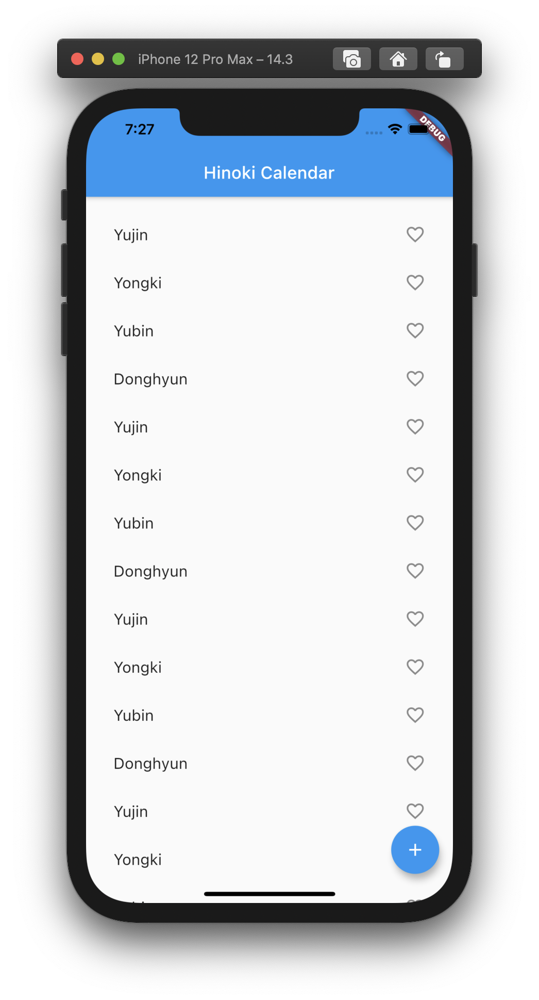
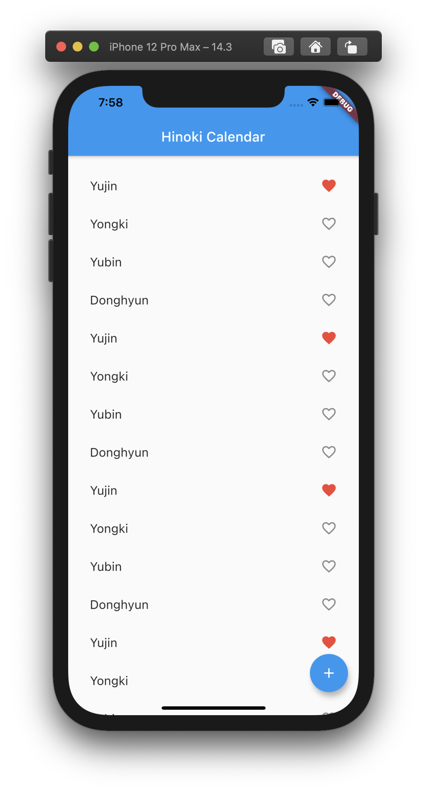
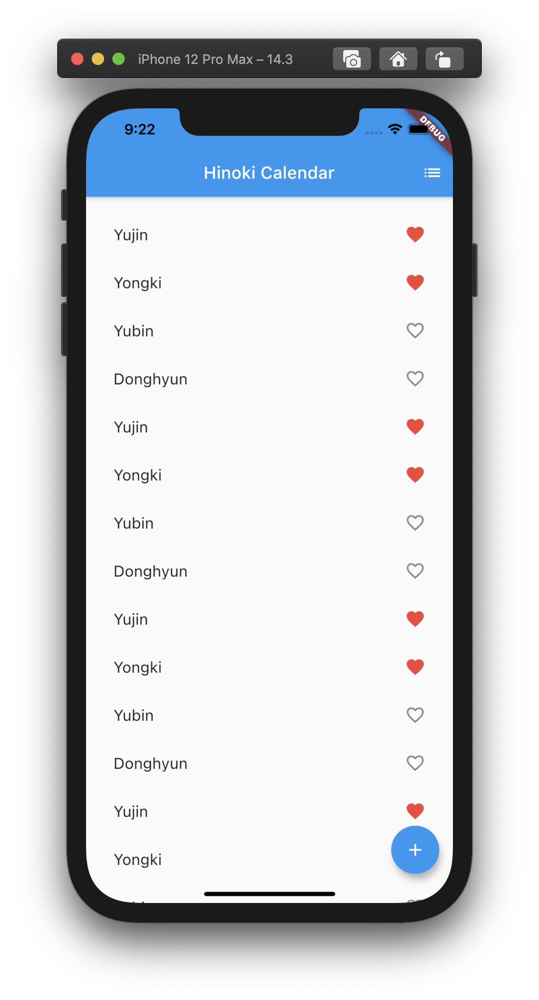
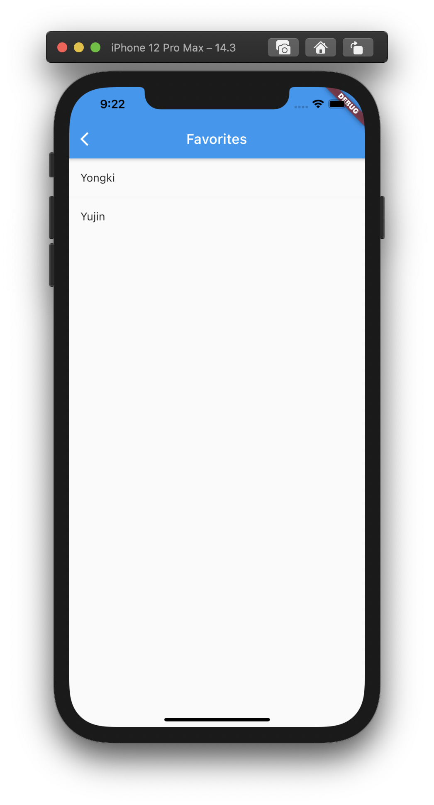
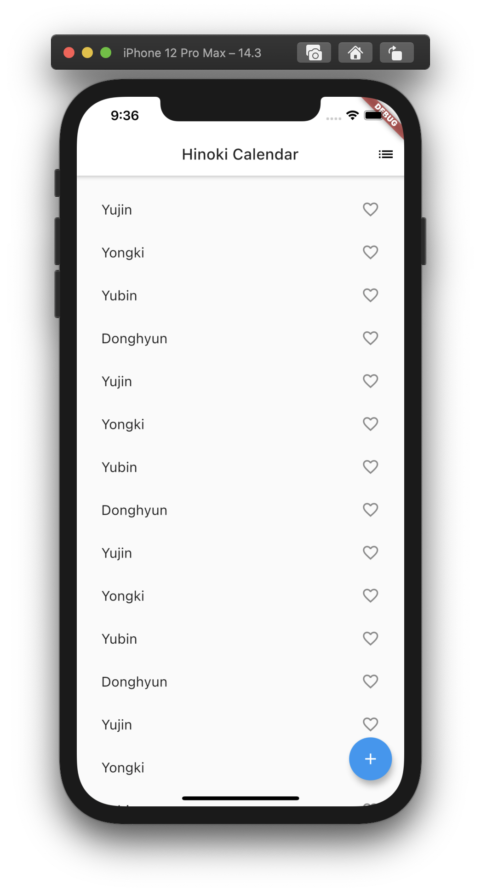

# Flutter 튜토리얼 2 : 아이콘, `Navigator` 라우팅, `ThemeData` 위젯으로 테마 설정

> [Flutter 튜토리얼 1 : Stateful/Stateless 위젯, 무한 스크롤, 콜백](./docs/flutter/basics1.md)에 이어지는 두 번째 튜토리얼 문서입니다.

<br>

## 동적 아이콘 추가하기

앞서 만든 무한 스크롤 UI에서 사용자가 특정 아이템들을 탭하여 저장할 수 있는 기능을 추가해볼게요. 저장된 아이템은 붉은색의 하트 아이콘으로 표시합니다. `_MyHomePageState` 클래스에 `_savedSet`이라는 `String` 타입의 셋(`Set`)을 만들어주세요. 이 셋에는 유저가 탭한 아이템들이 저장됩니다.

> Set is preferred to List because a properly implemented Set doesn't allow duplicate entries.

<br>

```dart
  final _rowItems = [];
  final _savedSet = <String>{}; // String 타입의 셋

  Widget _buildRow(String text) {
    return ListTile(
      title: Text(text, style: TextStyle(fontSize: 18.0))
    )
  }

  @override
  Widget build(BuildContext context) {
    return ListView.builder(
      padding: EdgeInsets.all(16.0),
      itemBuilder: (context, i) {
        if (i >= _rowItems.length) {
          _rowItems.addAll(['Yujin', 'Yongki', 'Yubin', 'Donghyun'].cast<String>());
        }
        return _buildRow(_rowItems[i]);
      }
    );
  }
```

<br>

이제 각 아이템 위젯에 해당하는 `_buildRow` 함수를 수정합니다. 인자의 값이 `_savedSet`에 이미 저장된 값인지 체크하는 `alreadySaved` 변수를 만드시고요, 하트 아이콘을 사용하기 위해 `ListTile` 위젯의 인스턴스를 생성하는 부분에 `trailing` 속성을 추가하고 `Icon` 위젯을 지정합니다. `Icon` 위젯의 첫 번째 인자에는 `Icon` 위젯이 들어가고요, 두 번째 인자에는 `color` 속성을 지정합니다.

```dart
  Widget _buildRow(String text) {
    final alreadySaved = _savedSet.contains(text); // 저장된 값이면 true

    return ListTile(
      title: Text(text, style: TextStyle(fontSize: 18.0)),
      trailing: Icon(
        alreadySaved ? Icons.favorite : Icons.favorite_border,
        color: alreadySaved ? Colors.red : null
      )
    )
  }
```

<br>

현재 상태에서 앱을 실행시켜보죠.



<br>

## 이벤트 핸들링과 `setState()`

이제 하트 아이콘을 탭하여 탭한 아이템을 저장하는 기능을 추가합니다. 사용자가 하트 아이콘을 탭했을 때 `alreadySaved` 변수에 값을 담아줄건데요, `ListTile` 위젯 인자에 `onTap` 속성을 추가하고 값으로 콜백 함수를 지정합니다.

```dart
  Widget _buildRow(String text) {
    final alreadySaved = _savedSet.contains(text); 

    return ListTile(
      title: Text(text, style: TextStyle(fontSize: 18.0)),
      trailing: Icon(
        alreadySaved ? Icons.favorite : Icons.favorite_border,
        color: alreadySaved ? Colors.red : null
      ),
      onTap: () {
        // ...
      }
    )
  }
```

<br>

`_savedSet`에 값을 저장하거나 삭제하는 내용이 `onTap` 속성의 콜백 함수에 담기겠죠. 여기서 중요한 것은 `setState()` 메소드를 사용해야한다는 것입니다. `setState()` 메소드의 실행이 끝나면 `build()` 메소드가 자동으로 호출되기 때문에 업데이트된 State 값이 반영된 상태로 위젯이 다시 렌더링되기 때문이죠. `setState()` 메소드의 인자로 콜백 함수를 넘기고요, 그 콜백 함수에 원하는 로직을 작성하면 됩니다.

```dart
  final _rowItems = [];
  final _savedSet = <String>{};

  Widget _buildRow(String text) {
    final alreadySaved = _savedSet.contains(text);

    return ListTile(
      title: Text(text, style: TextStyle(fontSize: 18.0)),
      trailing: Icon(
        alreadySaved ? Icons.favorite : Icons.favorite_border,
        color: alreadySaved ? Colors.red : null
      ),
      onTap: () {
        // setState() 를 사용해야 함 !
        setState(() {
          if (alreadySaved) _savedSet.remove(text);
          else _savedSet.add(text);
        });
      }
    )
  }
```

<br>

이제 앱을 실행하고 `Yujin` 아이템을 탭해보세요. `Yujin`이라는 값을 가진 모든 아이템의 하트가 붉은색으로 표시됩니다. 실제 서비스에서는 각 아이템을 고유한 값으로 판별하기 때문에 하나의 하트만 표시가 되겠죠.



<br>

## `Navigator` 스택을 이용하여 라우팅(Routing) 하기

이제 사용자가 다른 페이지로 이동할 수 있도록 메뉴 아이콘과 페이지 하나를 추가해보겠습니다. Flutter에서는 이동할 수 있는 페이지들을 라우트(Route)라고 합니다. React나 Vue의 라우트와 비슷하죠. 먼저 메뉴 아이콘부터 추가하겠습니다. `MyApp` 클래스의 `build()` 메소드로 돌아가시면 다시 `Scaffold` 위젯이 보입니다. `appBar` 속성에 지정했던 `AppBar` 위젯에 아이콘을 추가할겁니다. `AppBar` 위젯은 현재 앱 상단의 파란색 바 부분이죠. 이 위젯의 인자에 `actions` 속성을 추가하세요. 이 속성의 값은 `List<Widget>` 타입입니다.

```dart
class MyApp extends StatelessWidget {
  @override
  Widget build(BuildContext context) {
      return MaterialApp(
          title: 'Material App',
          home: Scaffold(
            appBar: AppBar(
              title: Text('Hinoki Calendar'),
              actions: [
                // ...
              ]
            ),
            body: MyList()
          )
      )
  }
}

```

<br>

`actions` 리스트에 `IconButton` 위젯을 추가해보겠습니다. 속성 설정은 아래 코드를 참고해주세요. `onPressed` 속성에 지정된 `_pushSavedSet`는 상단바의 아이콘이 눌렸을 때 실행되는 함수입니다. `_pushSavedSet` 함수는 `build()` 메소드 위에 만들어주세요. 반환할 것이 없으므로 `void` 함수로 선언합니다.

```dart
class MyApp extends StatelessWidget {
  void _pushSavedSet() {
    // ...
  }

  @override
  Widget build(BuildContext context) {
      return MaterialApp(
          title: 'Material App',
          home: Scaffold(
            appBar: AppBar(
              title: Text('Hinoki Calendar'),
              actions: [
                IconButton(icon: Icon(Icons.list), onPressed: _pushSavedSet)
              ]
            ),
            body: MyList()
          )
      )
  }
}

```

<br>

앱을 실행하고 상단바 우측을 확인해보세요. 아직 메뉴 아이콘을 눌러도 아무 일도 일어나지 않습니다. `_pushSavedSet` 함수에 아무 것도 작성하지 않았기 때문이죠.


<br>

이제 `_pushSavedSet` 함수에 다른 페이지로 이동하는 코드를 작성합니다. Flutter에서 라우트 이동은 `Navigator`를 사용하는데요, `Navigator` 스택에 이동하고자 하는 라우트를 추가(`push`)하는 개념입니다. 스택의 가장 최근에 쌓인 새로운 라우트가 디스플레이되는 방식이죠.

```dart
void _pushSavedSet() {
  Navigator.of(context).push(
    // ...
  );
}
```

<br>

`MaterialPageRoute`를 사용하여 새로운 라우트를 생성하고, 이 라우트를 `Navigator`에 추가해보겠습니다. 새 라우트 역시 `Scaffold` 위젯을 사용합니다. 상세 내용은 아래 코드를 참고해주세요.

```dart
void _pushSavedSet() {
  Navigator.of(context).push(
    MaterialPageRoute<void>(
      builder: (BuildContext context) {
        
        final tiles = _savedSet.map((String text) {
          return ListTile(
            title: Text(text)
          );
        });

        final divided = ListTile.divideTiles(
          context: context,
          tiles: tiles
        ).toList();

        // 새 라우트에서도 Scaffold 위젯을 사용합니다.
        return Scaffold(
          appBar: AppBar(
            title: Text('Favorites')
          ),
          body: ListView(
            children: divided,
          )
        );
      }
    )
  );
}
```

<br>

앱을 실행하고 `Yujin`과 `Yongki` 아이템을 각각 탭해보세요. `_savedSet`에 다음과 같이 값들이 담기겠죠: `['Yujin', 'Yongki']`.



<br>

이제 메뉴 아이콘을 눌러보세요. `_savedSet`에 담긴 값들이 보이시나요? 새로운 라우트로 이동하는데 성공하셨다면 상단바의 좌측에 뒤로가기(`<`) 아이콘이 생성된 것을 보실 수 있습니다. `Navigator`가 `AppBar` 위젯에 이 아이콘을 자동으로 추가하기 때문입니다. 이 아이콘을 누르면 `Navigator` 스택에서 현재 라우트가 제거되므로(`pop`) 이전 라우트로 이동하게 됩니다.



<br>

## UI 테마 스타일링

`MaterialApp` 위젯에 `theme` 속성을 추가하여 UI 테마를 쉽게 바꿀 수 있습니다. `ThemeData` 위젯을 사용합니다. 아래와 같이 테마를 지정하고 앱을 실행하면 앱의 상단바가 흰색으로 바뀐 것을 확인할 수 있습니다.

```dart
  @override
  Widget build(BuildContext context) {
      return MaterialApp(
          title: 'Material App',
          // 테마 바꾸기
          theme: ThemeData(
            primaryColor: Colors.white
          ),
          home: Scaffold(
            appBar: AppBar(
              title: Text('Hinoki Calendar'),
              actions: [
                IconButton(icon: Icon(Icons.list), onPressed: _pushSavedSet)
              ]
            ),
            body: MyList()
          )
      )
  }
```

<br>



<br>

---

### References

- [Write your first Flutter app, part 2](https://codelabs.developers.google.com/codelabs/first-flutter-app-pt2#0)
- [Write your first Flutter app, part 2 - Next Steps](https://codelabs.developers.google.com/codelabs/first-flutter-app-pt2#8)
- [Learn more | Flutter Get Started](https://flutter.dev/docs/get-started/learn-more)
