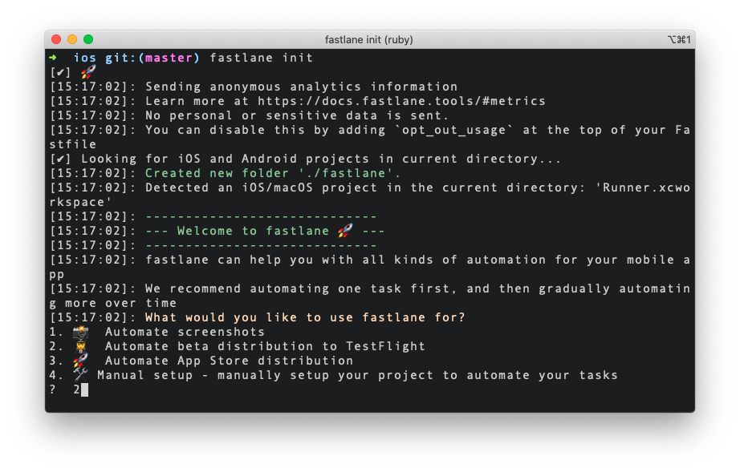
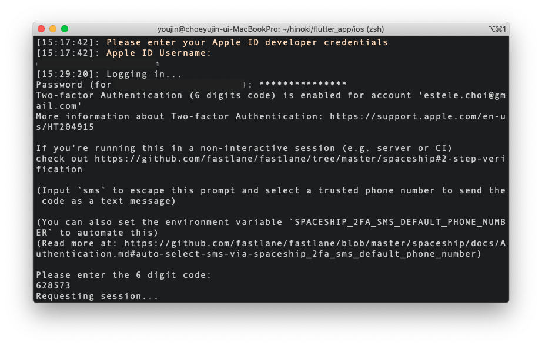
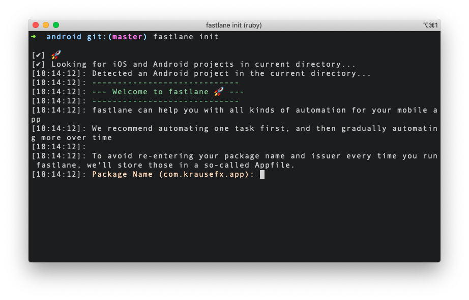
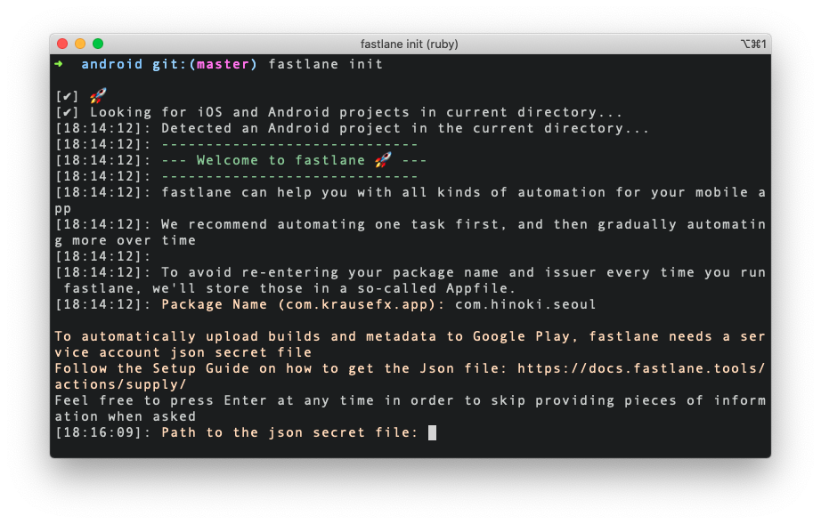
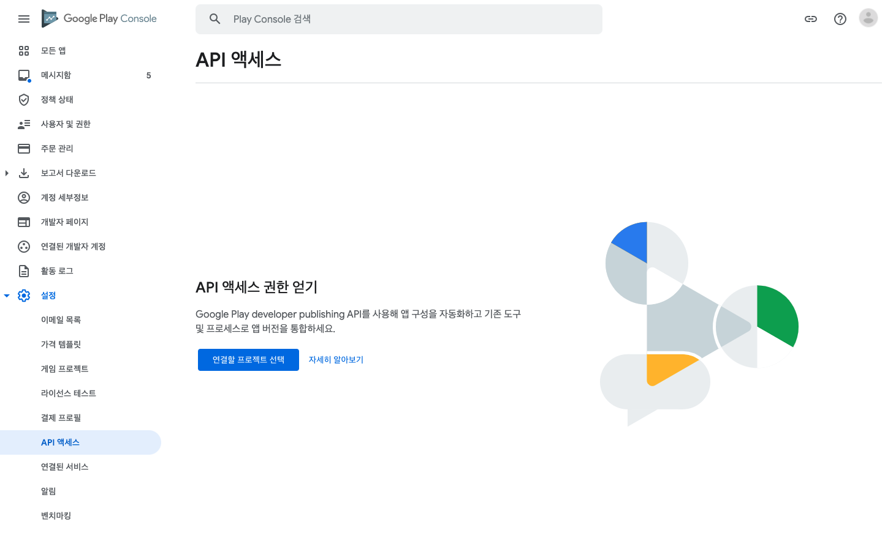
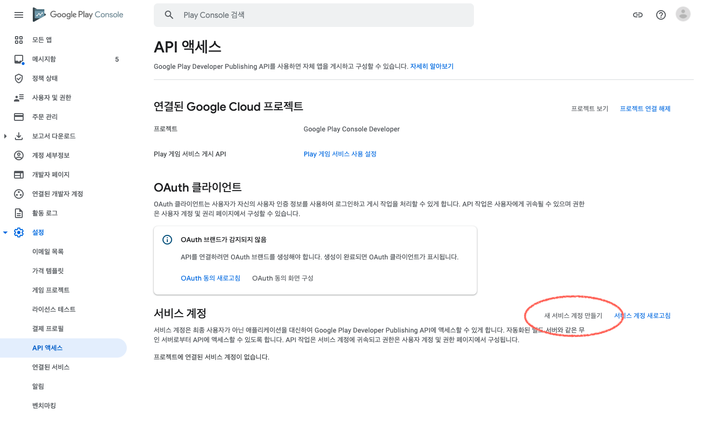
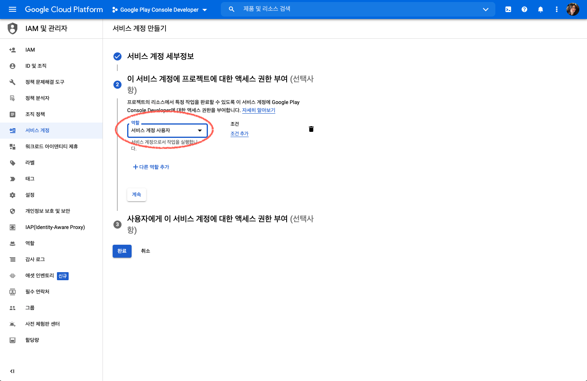
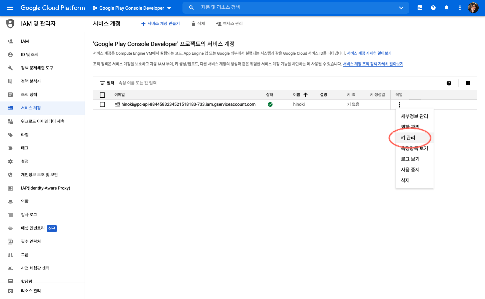
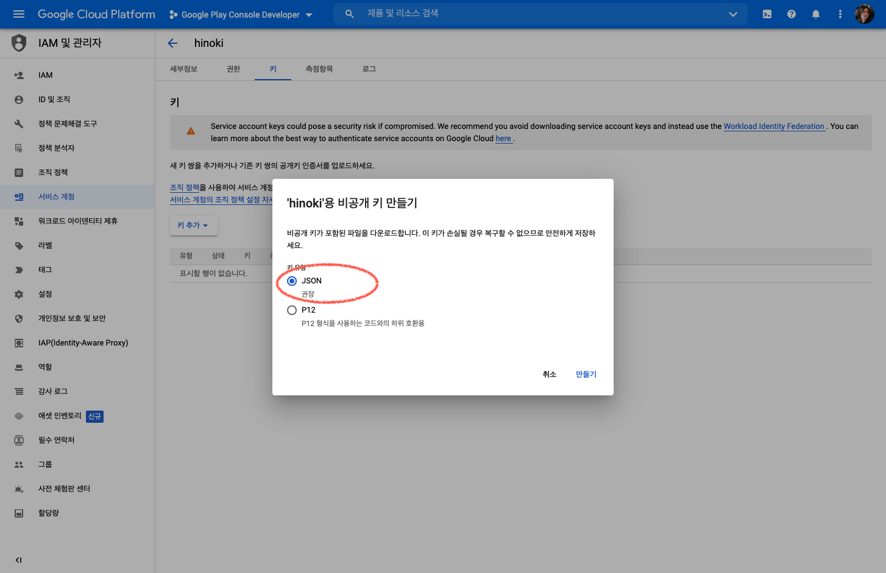
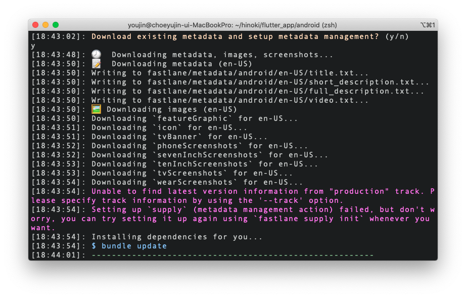

# Fastlane을 사용하여 Flutter iOS/Android 앱 배포 자동화하기

<br>

## 1. 셋업

### 1) Xcode CLT 설치하기

아래 명령어를 사용하여 Xcode CLT(Command Line Tool)를 설치합니다. 이미 설치되어있다면 오류 메시지가 나타납니다.

```
xcode-select --install
```

<br>

### 2) Homebrew를 사용하여 `fastlane` 설치하기

아래와 같이 `brew` 명령어를 사용하여 `fastlane`을 설치합니다. 자세한 내용은 [Homebrew Formulae](https://formulae.brew.sh/formula/fastlane)를 참고하세요.

```
brew install fastlane
```

<br>

## 2. iOS를 위한 `fastlane` 셋업

이제 프로젝트의 루트 경로에서 다음 명령어를 사용하여 `fastlane` 셋업을 진행합니다. Flutter 프로젝트는 `ios/` 경로에서 실행합니다.

```
fastlane init
```

<br>

`What would you like to use fastlane for?` 질문이 나타나면 해당하는 번호를 입력한 후 계속합니다. TestFlight 배포의 경우 2번, App Store 배포의 경우 3번을 선택하면 됩니다.



<br>
<br>

그 다음, [App Store Connect](https://appstoreconnect.apple.com/) 로그인시 사용하는 Apple 계정 이메일과 비밀번호를 입력하고 계속합니다.

<br>



<br>
<br>

셋업이 완료되면 `ios/` 경로에 다음 4개 파일이 생성되고요, 4개 파일은 `.gitignore`에 추가하지 않고 원격 레파지토리를 통해 공유될 수 있도록 합니다.

- `fastlane/Appfile`
- `fastlane/Fastfile`
- `Gemfile`
- `Gemfile.lock`

<br>

### 1) `Appfile`

`Appfile` 파일은 앱 배포시 App Store Connect에 자동으로 접속하여 배포를 진행하기 위한 Apple 계정 정보와 앱 ID를 포함해야합니다. 파일 내용은 아래와 같이 구성되어 있고요, 각 메소드의 인자 값이 자동으로 세팅되어있습니다.

```ruby
app_identifier("your.app.identifier") # The bundle identifier of your app
apple_id("apple-id") # Your Apple email address

itc_team_id("team-id") # App Store Connect Team ID
team_id("portal-team-id") # Developer Portal Team ID
```

<br>

위의 인자 값들은 환경변수를 사용하여 관리할 수 있고요, `fastlane`에는 `.env` 파일을 통해 환경변수를 사용할 수 있도록 `dotenv` 라이브러리가 기본으로 포함되어 있습니다. (`Gemfile.lock` 파일에서 확인할 수 있습니다) `fastlane/` 경로에 `.env` 파일을 생성하고 아래와 같이 환경변수를 세팅합니다.

```t
APP_IDENTIFIER=your.app.identifier
APPLE_ID=apple-id
ITC_TEAM_ID=team-id
TEAM_ID=portal-team-id
```

<br>

그 다음 `Appfile`을 아래와 같이 수정하면 끝입니다.

```t
app_identifier(ENV['APP_IDENTIFIER']) # The bundle identifier of your app
apple_id(ENV['APPLE_ID']) # Your Apple email address

itc_team_id(ENV['ITC_TEAM_ID']) # App Store Connect Team ID
team_id(ENV['TEAM_ID']) # Developer Portal Team ID

```

<br>

### 2) `Fastfile`

`Fastfile`은 실제 배포를 진행하기 위해 커맨드 명령들을 설정하는 파일입니다. 아래는 예시입니다.

```ruby
default_platform(:ios)

platform :ios do
  desc "Push a new beta build to TestFlight"
  lane :beta do
    get_certificates
    get_provisioning_profile
    cocoapods(use_bundle_exec: false)
    increment_build_number(xcodeproj: "Runner.xcodeproj")
    build_app(workspace: "Runner.xcworkspace", scheme: "Runner")
    upload_to_testflight
    version = get_version_number
    send_slack({ "version": version })
  end

  lane :send_slack do |options|
    slack(
      message: "iOS 앱이 TestFlight에 성공적으로 업로드 되었습니다.",
      channel: "#deploy",
      slack_url: ENV["SLACK_WEBHOOK_URL"],
      payload: {
        "Version": options[:version]
      }
    )
  end
end
```

<br>

위의 예시 파일 내용은 이렇습니다. `beta` 명령어를 실행하면,

```t
fastlane beta
```

<br>

다음 명령어들이 실행되면서 TestFlight 배포가 진행되고, Slack에 메시지를 전송하도록 설정되어 있습니다. 진행 과정에서 앱 암호(`app-specific password`) 입력이 필요합니다. 앱 암호는 Apple 계정 암호와는 다른 것이고요, 앱 암호가 없다면 [Apple 계정관리](https://appleid.apple.com/account/manage)에서 생성 후 계속 진행합니다.

```ruby
# 인증서, 프로비저닝 프로파일을 가져오기
get_certificates
get_provisioning_profile

# pod install
cocoapods(use_bundle_exec: false)

# build 번호 변경
increment_build_number(xcodeproj: "Runner.xcodeproj")

# 앱 빌드
build_app(workspace: "Runner.xcworkspace", scheme: "Runner")

# TestFlight에 업로드
upload_to_testflight

# 현재 버전을 Info.plist에서 읽어오고, Slack에 메시지 전송
version = get_version_number
send_slack({"version": version })

lane :send_slack do |options|
slack(
    message: "iOS 앱이 TestFlight에 성공적으로 업로드 되었습니다.",
    channel: "#deploy",
    slack_url: ENV["SLACK_WEBHOOK_URL"],
    payload: {
    "Version": options[:version]
    }
)
end
```

<br>

#### `slack()` 메소드

Slack으로 메시지를 보내는 메소드 설정을 커스텀하려면 `fastlane` 공식문서의 [slack](https://docs.fastlane.tools/actions/slack/) 섹션을 참고하시고요, `slack_url` 값은 [Slack Incoming Webhooks](https://api.slack.com/messaging/webhooks) URL을 생성한 후 지정합니다.

<br>

### 3) `.gitignore` 세팅하기

`fastlane beta` 혹은 `fastlane release`를 실행하고나면 `ios/` 경로에 여러 파일들이 자동으로 생성되는데요, 원격 레파지토리에 올리지 않을 파일들은 `.gitignore` 파일에 추가하는 것을 잊지마세요. 저는 아래 항목들을 추가했습니다.

```t
# fastlane outputs
AppStore_com.*
*.cer
Runner.app.*.zip
Runner.ipa
```

<br>

## 3. Android를 위한 `fastlane` 셋업

Flutter 프로젝트의 `android/` 경로로 이동한 후 `fastlane` 초기화 명령어를 실행합니다.

```
fastlane init
```

<br>

그럼 아래와 같이 `Package Name` 입력이 요구되고요, `app/build.gradle` 파일의 `applicationId` 항목의 값을 입력하면 됩니다.

<br>



<br>
<br>

다음으로는 `Path to the json secret file` 입력이 요구됩니다.

<br>



<br>
<br>

`fastlane` 공식문서의 [Setting up supply](https://docs.fastlane.tools/getting-started/android/setup/#setting-up-supply) 섹션을 참고하여 `json secret file`을 생성한 후 진행해야합니다. 문서의 설명에 따라 [Google Play 콘솔](https://play.google.com/apps/publish/)에서 설정 > API 엑세스 메뉴로 이동한 후 새 프로젝트를 생성합니다.

<br>



<br>
<br>

그 다음 `새 서비스 계정 만들기` 버튼을 클릭하고, 나타난 안내창의 설명에 따라 서비스 계정 만들기를 진행합니다.

<br>



<br>
<br>

참고로 아래 단계에서 역할은 `서비스 계정 사용자`를 선택하고 계정 생성을 완료합니다.

<br>



<br>
<br>

서비스 계정이 생성되면 아래와 같이 `키 관리` 메뉴로 이동합니다.

<br>



<br>
<br>

`키 추가` 버튼을 클릭하여 키 생성을 시작하시고요, `키 유형`은 `JSON`을 선택한 후 `만들기` 버튼을 클릭하여 완료합니다. `json` 포맷의 키 파일이 다운로드되는데요, 이 파일은 앱에서 Google API에 접근할 때 사용되므로 반드시 안전한 곳에 보관해야합니다. 저는 파일명을 `google_key.json`으로 바꾸고 프로젝트의 `android/` 경로로 파일을 옮긴 다음 `.gitignore` 항목에 추가했습니다.

<br>



<br>
<br>

다시 Google Play 콘솔로 돌아가서 안내창의 `완료` 버튼을 클릭합니다. 서비스 계정이 추가된 것을 확인할 수 있고요, `액세스 권한 부여` 클릭, `사용차 초대`를 클릭하여 마무리합니다.

<br>

이제 아래 명령어를 사용하여 다운로드한 `json` 파일이 Google Play Store와 연결되었는지 검증합니다. 명령어의 `google_key.json` 부분에는 `android/` 경로를 기준으로 파일이 위치한 경로와 파일명을 입력합니다.

```
fastlane run validate_play_store_json_key json_key:google_key.json
```

<br>

`Download existing metadata and setup metadata management?` 질문에는 `y`라고 답변합니다.

<br>



<br>
<br>

`fastlane` 초기화가 완료되면 위에서 진행했던 iOS 셋업때와 마찬가지로 다음 파일들이 생성되고요, 위에서 메타데이터를 가져오겠다고 답변했으므로 `fastlane/metadata` 디렉토리가 함께 생성됩니다.

- `fastlane/Appfile`
- `fastlane/Fastfile`
- `Gemfile`
- `Gemfile.lock`

<br>

### 1) `Appfile`

Android의 경우 `Appfile` 파일은 다음 2개의 메소드로 구성되어 있습니다.

```ruby
json_key_file("json-key-file.json") # Path to the json secret file ..
package_name("package-name") # e.g. com.krausefx.app
```

<br>

역시 `.env` 파일을 생성하여 환경변수를 지정한 후 아래와 같이 파일을 수정할 수 있습니다.

```ruby
json_key_file(ENV['JSON_KEY_FILE']) # Path to the json secret file ..
package_name(ENV['PACKAGE_NAME']) # e.g. com.krausefx.app
```

<br>

### 2) `Fastfile`

```ruby
default_platform(:android)

platform :android do
  desc "Runs all the tests"
  lane :test do
    gradle(task: "test")
  end

  desc "Submit a new Beta Build to Crashlytics Beta"
  lane :beta do
    gradle(task: "clean assembleRelease")
    crashlytics

    # sh "your_script.sh"
    # You can also use other beta testing services here
  end

  desc "Deploy a new version to the Google Play"
  lane :deploy do
    gradle(task: "clean assembleRelease")
    upload_to_play_store
    version = get_version_number
    send_slack({ "version": version })
  end

  lane :send_slack do |options|
    slack(
      message: "Android 앱이 Google Play에 성공적으로 업로드 되었습니다.",
      channel: "#deploy",
      slack_url: ENV["SLACK_WEBHOOK_URL"],
      payload: {
        "Version": options[:version],
        "Build Date" => Time.new.to_s
      }
    )
  end
end
```

<br>
<br>

---

### References

- [Getting started with fastlane for iOS](https://docs.fastlane.tools/getting-started/ios/setup/)
- [Sending messages using Incoming Webhooks](https://api.slack.com/messaging/webhooks)
- [Using app-specific passwords | Apple](https://support.apple.com/en-gb/HT204397)
- [Fastlane으로 iOS앱 배포과정을 자동화 해보았다](https://velog.io/@hyob/Fastlane%EC%9C%BC%EB%A1%9C-iOS%EC%95%B1-%EB%B0%B0%ED%8F%AC%EA%B3%BC%EC%A0%95%EC%9D%84-%EC%9E%90%EB%8F%99%ED%99%94-%ED%95%B4%EB%B3%B4%EC%95%98%EB%8B%A4)
