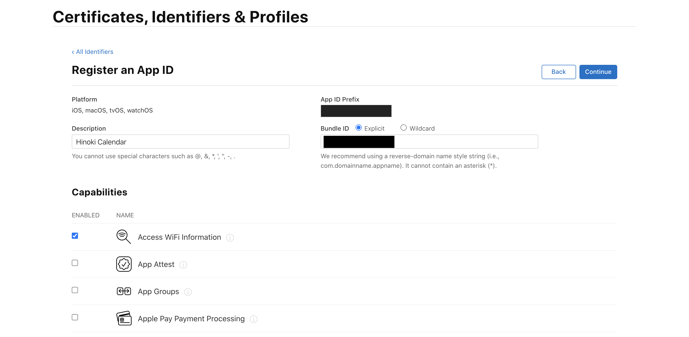
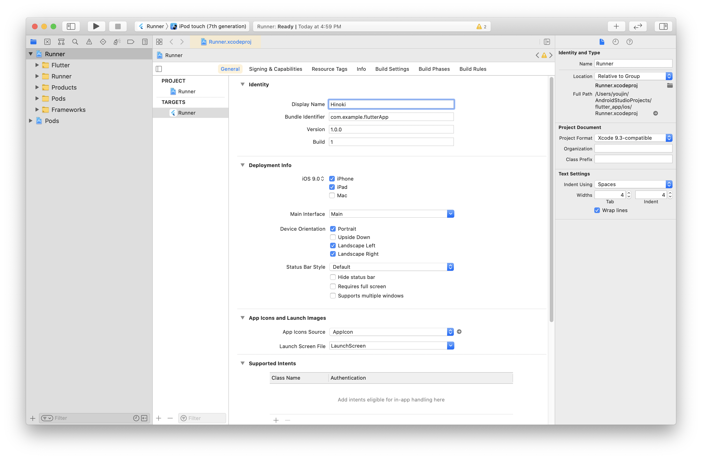

# Flutter 프로젝트를 Android / iOS 앱으로 배포하기

<br>

## Android 앱으로 배포하기

1. 런처 아이콘 추가하기
2. 앱 서명하기
3. Proguard 구성하기
4. 앱 메니페스트 검토하기
5. 빌드 구성 검토하기
6. 앱 번들 빌드하기
7. 앱 번들 테스트하기

<br>

### 1. 런처 아이콘 추가하기

공식문서에서 추천하는 [flutter_launcher_icons](https://pub.dev/packages/flutter_launcher_icons) 라이브러리를 사용하여 런처 아이콘을 관리할 수 있습니다. 라이브러리를 사용하지 않고 런처 아이콘을 직접 지정하려면 아래의 스텝을 따르시면 됩니다.

<br>

#### 1) `/android/app/src/main/res/` 경로에 디렉토리를 만들고 아이콘 파일을 넣습니다.

Android Studio 에디터를 사용하면 [Image Asset Studio 실행하기](https://developer.android.com/studio/write/image-asset-studio?hl=ko#access) 문서에 따라 런처 아이콘을 쉽게 추가할 수 있습니다. Image Asset Studio의 Launcher Icon Generator를 사용하여 Android 규격에 맞는 아이콘을 생성할 수 있기 때문입니다. 이미 작업한 아이콘 파일을 기반으로 각 디바이스 크기와 해상도에 맞는 아이콘들이 생성됩니다.

Android Studio 에디터를 사용하지 않고 해상도별 아이콘 파일들을 직접 만들었다면 `/android/app/src/main/res/` 경로에 아이콘 파일들을 넣어주면 됩니다. 아이콘 파일을 넣을 디렉토리는 [configuration qualifiers](https://developer.android.com/guide/topics/resources/providing-resources#AlternativeResources)에 따라 `<resources_name>-<config_qualifier>` 형식으로 이름을 정합니다. 예를 들어 `mipmap-hdpi`와 같이 디렉토리 이름을 정하면 됩니다. `mipmap`은 각기 다른 디바이스 해상도에 맞춘 아이콘 파일을 의미하고요, `hdpi`는 화면 밀도를 나타내는 한정자(Qualifier) 중 하나이죠.

<br>

기본적으로 아래와 같이 디렉토리들이 구성되어있고, 각 규격에 맞는 Flutter 아이콘들이 세팅되어있습니다. 각 해상도에 맞는 런처 아이콘 파일들로 교체해주기만 하면 되죠.

<br>


<br>

> `mipmap`은 [`drawable`(드로어블)](https://developer.android.com/guide/topics/resources/drawable-resource) 리소스 중에서 런처아이콘을 관리하기 위한 리소스를 의미합니다. `drawable` 리소스란 말그대로 화면에 그릴 수 있는 그래픽 파일을 의미하는데요, `png`, `gif`와 같은 비트맵 파일들이 `drawable` 리소스에 해당합니다.

<br>

> 여러 한정자(Qualifier)를 추가할 때는 [구성 한정자 이름](https://developer.android.com/guide/topics/resources/providing-resources#table2) 표에 나열된 순서로 배치해야 합니다. 한정자의 순서가 잘못 지정되면 해당 리소스가 무시됩니다.

<br>

#### 2) `AndroidManifest.xml`에서 아이콘 파일과 앱 이름을 지정합니다.

`<application>` 태그의 `android:icon` 속성에 이전 단계에서 교체한 아이콘 파일을 가져오도록 지정합니다. `android:icon="@mipmap/ic_launcher"` 이런식으로요. `android:label` 속성에는 실제 사용할 앱의 이름을 지정합니다.

<br>

> 아이콘이 변경된 것을 확인하기 위해 앱을 실행하고 런처에서 앱 아이콘을 확인합니다.

<br>

### 2. 앱 서명하기

Google Play 스토어에 출시하기 위해서는 반드시 앱에 디지털 서명을 해야 합니다. 앱 배포시 개발자 정보를 제공하기 위함이고요, 개발자 인증 절차라고 볼 수 있습니다.

<br>

#### 1) keystore 만들기

아래 명령어를 사용하여 키스토어(keystore)를 생성합니다. (맥/리눅스용) 키스토어를 생성하면 `key.jks` 파일이 생성되는데요, 이 파일은 절대 공개된 저장소에 올리면 안됩니다.

```
keytool -genkey -v -keystore ~/key.jks -keyalg RSA -keysize 2048 -validity 10000 -alias key
```

<br>

> 명령어 설명 : keytool을 사용하여 keystore를 생성, 내 문서(`/Users/yujin`) 경로에 `key.jks` 파일을 저장합니다. RSA 알고리즘을 사용하여 키를 생성하고 키의 사이즈는 2048, 유효기간은 10000으로 합니다.

<br>

> keytool 은 프로젝트 경로에 존재하지 않을 수 있습니다. 해당 파일은 Android 스튜디오와 함께 설치되는 Java JDK에 포함되는 파일입니다. 해당 파일에 대한 구체적인 경로는 명령줄에 flutter doctor -v 을 입력한 후 표시되는 ‘Java binary at:’ 다음에 나타나는 경로에서 java를 포함하고 있는 디렉토리의 keytool 파일을 통해 확인할 수 있습니다.

<br>

#### 2) 앱에서 keystore 참조하기

`/android/app/` 경로에 `keystore` 디렉토리를 만들고 위 단계에서 생성된 `key.jks` 파일을 넣어줍니다. 그리고 `keystore.password` 파일을 생성하여 `key.jks` 파일과 같은 경로에 넣어주는데요, `keystore.password` 파일에는 keystore 생성시 제출했던 비밀번호를 적어줍니다. 아래의 파일 구조를 참고하세요.

```
/app
    /keystore
        key.jks
        keystore.password
```

<br>

keystore 파일은 공개된 저장소에 올라가지 않도록 반드시 `.gitignore` 파일에 `/keystore` 경로를 추가합니다.

<br>

#### 3) Gradle에서 서명 구성하기

`/android/app/build.gradle` 파일을 수정하여 앱의 서명을 구성합니다. `buildTypes` 블록을 아래 코드로 교체해주세요.

```gradle
    signingConfigs {
        release {
            storeFile file('../keystore/key.jks')
            storePassword file('../keystore/keystore.password').text.trim()
            keyPassword file('../keystore/keystore.password').text.trim()
            keyAlias 'key'
        }
    }

    buildTypes {
        release {
            signingConfig signingConfigs.release
        }
    }
```

<br>

### 3. Proguard 구성하기

기본적으로 Flutter는 Android 코드를 난독화하거나 축소하지 않습니다. 서드파티 자바 라이브러리나 Android 라이브러리를 사용한다면 Proguard를 적용하여 APK의 크기를 줄이고 리버스 엔지니어링으로부터 코드를 보호할 수 있습니다.

<br>

#### 1) Proguard 구성하기

`/android/app/` 경로에 `proguard-rules.pro` 파일을 생성하고, 아래 규칙을 추가합니다. 이 설정은 Flutter 엔진 라이브러리를 보호합니다. Firebase와 같은 다른 라이브러리를 보호하기 위해서는 추가적으로 규칙을 작성해야합니다.

```
## Flutter wrapper
-keep class io.flutter.app.** { *; }
-keep class io.flutter.plugin.**  { *; }
-keep class io.flutter.util.**  { *; }
-keep class io.flutter.view.**  { *; }
-keep class io.flutter.**  { *; }
-keep class io.flutter.plugins.**  { *; }
-dontwarn io.flutter.embedding.**
```

<br>

#### 2) 난독화와 축소 사용하기

`/android/app/build.gradle` 파일의 `buildTypes` 블록에 아래 코드를 추가합니다.

```
android {

    ...

    buildTypes {

        release {

            signingConfig signingConfigs.release

            minifyEnabled true
            useProguard true

            proguardFiles getDefaultProguardFile('proguard-android.txt'), 'proguard-rules.pro'

        }
    }
}
```

<br>

> 난독화와 축소 과정으로 인해 Android 앱의 컴파일 시간이 크게 늘어날 수 있습니다.

<br>

### 4. 앱 매니페스트 검토하기

앱 메니페스트 파일인 `AndroidManifest.xml` 파일을 검토합니다. 기본적으로 아래 사항들을 체크합니다.

<br>

#### 1) `application` 태그

앱의 최종 이름이 `android:label`에 지정되어 있는지 확인하세요.

<br>

#### 2) `uses-permission` 태그

예를 들어, 앱 내에서 인터넷 접근이 필요하다면 아래와 같이 접근 권한을 명시합니다. 기본적으로 이 태그는 이미 포함되어있을 가능성이 높습니다. 만약 앱 내에서 인터넷 접근이 필요하지 않다면 이 태그를 제거하세요.

```
<uses-permission android:name="android.permission.INTERNET" />
```

<br>

이 외에 앱 외부의 리소스나 디바이스에 대한 접근을 허용하기 위해 필요한 항목이 있다면 그에 맞는 이름으로 `uses-permission` 태그를 추가하면 됩니다. 아래는 예시입니다.

```
    <uses-permission android:name="android.permission.INTERNET" />
    <uses-permission android:name="android.permission.WAKE_LOCK" />
    <uses-permission android:name="android.permission.READ_CALENDAR" />
    <uses-permission android:name="android.permission.WRITE_CALENDAR" />
    <uses-permission android:name="android.permission.CAMERA" />
    <uses-permission android:name="android.permission.READ_CONTACTS" />
    <uses-permission android:name="android.permission.WRITE_CONTACTS" />
    <uses-permission android:name="android.permission.GET_ACCOUNTS" />
    <uses-permission android:name="android.permission.ACCESS_FINE_LOCATION" />
    <uses-permission android:name="android.permission.ACCESS_COARSE_LOCATION" />
    <uses-permission android:name="android.permission.RECORD_AUDIO" />
    <uses-permission android:name="android.permission.READ_PHONE_STATE" />
    <uses-permission android:name="android.permission.CALL_PHONE" />
    <uses-permission android:name="android.permission.READ_CALL_LOG" />
    <uses-permission android:name="android.permission.WRITE_CALL_LOG" />
    <uses-permission android:name="android.permission.WRITE_CALENDAR" />
    <uses-permission android:name="android.permission.ADD_VOICEMAIL" />
    <uses-permission android:name="android.permission.USE_SIP" />
    <uses-permission android:name="android.permission.PROCESS_OUTGOING_CALLS" />
    <uses-permission android:name="android.permission.BODY_SENSORS" />
    <uses-permission android:name="android.permission.SEND_SMS" />
    <uses-permission android:name="android.permission.RECEIVE_SMS" />
    <uses-permission android:name="android.permission.READ_SMS" />
    <uses-permission android:name="android.permission.RECEIVE_WAP_PUSH" />
    <uses-permission android:name="android.permission.RECEIVE_MMS" />
    <uses-permission android:name="android.permission.READ_EXTERNAL_STORAGE" />
    <uses-permission android:name="android.permission.WRITE_EXTERNAL_STORAGE" />
```

<br>

### 5. 빌드 구성 검토하기

Gradle 빌드 파일인 `/android/app/build.gradle` 파일을 검토합니다. 기본적으로 `defaultConfig` 블록 내용을 체크합니다.

<br>

#### `applicationId`

[애플리케이션 ID 설정](https://developer.android.com/studio/build/application-id) 문서를 참고하여 고유한 앱 ID를 지정하세요.

<br>

#### `minSdkVersion`/`targetSdkVersion`

[앱 버전 지정](https://developer.android.com/studio/publish/versioning) 문서를 참고하여 앱이 요구하는 API 레벨을 지정하세요. Android 시스템은 `minSdkVersion` 설정에 명시된 시스템 버전 호환성을 적용합니다. 이 설정을 통해 앱이 호환되는 최소 시스템 API 버전을 지정할 수 있죠.

<br>

#### `versionCode`/`versionName`

내부 앱 버전을 지정하세요. `pubspec.yaml` 파일에 `version` 속성을 명시하여 앱의 버전을 문자열 형태로 지정할 수 있습니다. [앱 버전 지정](https://developer.android.com/studio/publish/versioning) 문서를 참고하세요.

<br>

### 6. 앱 번들 빌드하기

Google Play 스토어에 앱을 배포하는 방법은 두 가지입니다. Google Play 스토어는 앱 번들 방식을 권합니다.

- 앱 번들 (추천)
- APK

<br>

아래 명령어를 사용하여 앱 번들을 빌드하세요. `flutter build` 실행은 기본적으로 `release` 빌드 입니다. 앱의 릴리즈 번들은 `/build/app/outputs/bundle/release/app.aab` 경로에 생성됩니다. 앱 번들 테스트는 [앱 번들 테스트하기](https://flutter-ko.dev/docs/deployment/android#%EC%95%B1-%EB%B2%88%EB%93%A4-%ED%85%8C%EC%8A%A4%ED%8A%B8%ED%95%98%EA%B8%B0)를 참고하세요.

```
flutter build appbundle
```

<br>

### 7. 앱 번들 테스트/출시하기

앱 번들 빌드가 완료되면 [앱을 Play Console에 업로드](https://developer.android.com/studio/publish/upload-bundle) 문서를 참고하여 구글 플레이에 앱을 업로드합니다. 앱 번들을 출시하기 위해서는 먼저 Google Play Console에서 비용을 지불하고 개발자 등록을 완료해야합니다. 2021년 4월 기준 $25가 청구됩니다. 이후 공개/비공개/내부 테스트 트랙을 사용하여 앱의 베타버전을 출시하거나 지정된 테스터들을 대상으로 앱을 테스트할 수 있습니다. 혹은 바로 프로덕션 앱으로 출시할 수 있습니다. 자세한 내용은 [버전 준비 및 출시](https://support.google.com/googleplay/android-developer/answer/9859348?visit_id=637550273103240982-1310059594&rd=1) 문서를 참고하세요.

<br>
<br>

## iOS 앱으로 배포하기

> [Apple의 App Store 심사 지침](https://developer.apple.com/app-store/review/)을 확인하고 진행해주세요.

<br>

1. [Apple Developer Program](https://developer.apple.com/programs/) 등록하기
2. App Store Connect에서 앱 등록하기
3. Xcode 프로젝트 설정하기
4. 앱 아이콘 추가하기
5. 빌드 아카이브 생성하기

<br>

### 1. Apple Developer Program 등록하기

[Apple Developer Program](https://developer.apple.com/programs/)에서 비용을 지불하고 개발자 계정으로 등록하세요. 2021년 4월 기준 연 129,000 원의 비용을 지불해야합니다. 결제가 완료되면 개발자 승인이 완료되기까지 기다려야하고요, 보통 48시간 이내 승인 완료 이메일을 받게 됩니다. 승인이 완료되면 [Apple Developer](https://developer.apple.com/) 홈페이지에서 Account 페이지로 이동합니다. 왼쪽 메뉴바의 Program Resources 섹션에 개발자 계정만 접근할 수 있는 항목들이 생긴 것을 확인할 수 있습니다.

<br>

### 2. App Store Connect에서 앱 등록하기

[App Store Connect](https://developer.apple.com/kr/support/app-store-connect/)는 앱의 라이프사이클을 관리할 수 있는 곳입니다. 앱의 이름과 설명을 정하고 스크린샷 추가, 가격 설정 등을 완료한 후 앱스토어와 TestFlight에 출시하게 되죠. 앱을 등록하려면 아래의 두 단계를 거쳐야합니다.

- 고유 번들 ID 등록
- App Store Connect에 앱 레코드 생성

<br>

#### 1) 고유 번들 ID 등록

모든 iOS 앱은 Apple에 등록된 고유값인 번들 ID와 연결 됩니다. [Apple Developer](https://developer.apple.com/)의 Account 페이지에서 [Certificates, Identifiers & Profiles](https://developer.apple.com/account/resources/) 항목을 열고, `Identifiers` 메뉴로 이동합니다. 여기에서 `+` 또는 `Register an App ID` 버튼을 클릭하여 아래 페이지로 이동합니다. `App IDs`에 체크한 후 `Continue` 버튼을 클릭하세요.

<br>


<br>

아래 페이지에서는 `App`을 선택한 후 `Continue` 버튼을 클릭합니다.

<br>


<br>

아래 페이지에서는 다음의 세 가지 항목을 입력합니다. 입력 후 `Continue`, `Register` 버튼을 차례로 클릭하여 앱 ID를 생성합니다.

- `Description` : 앱 ID에 대한 설명을 작성합니다.

- `Bundle ID` : `Explicit`을 선택하고 앱 ID를 입력합니다. 하단 가이드를 참고하여 `com.domain.appname` 형태로 작성합니다.

- `Capabilities` : 앱에서 사용중인 서비스를 체크합니다. 앱 ID 발급 이후에도 자유롭게 변경이 가능합니다.

<br>



<br>

#### 2) App Store Connect에 앱 레코드 생성

다음으로, [App Store Connect](https://appstoreconnect.apple.com/) 홈페이지에서 앱을 등록합니다. 랜딩페이지에서 왼쪽 상단의 `나의 앱`을 클릭하여 이동한 후, 다시 왼쪽 상단의 `+` 버튼 > `신규 앱`을 선택합니다.

<br>


<br>

나타난 폼 양식에 앱 정보를 입력하고 제출합니다. 플랫폼에 iOS를 체크하시고요, SKU는 [Stock-keeping Unit](https://en.wikipedia.org/wiki/Stock_keeping_unit)의 약자로 기업에서 만든 제품 일련번호로 생각하시면 됩니다. 앱을 출시하는 팀/회사의 입장에서 해당 앱을 식별할 수 있는 번호를 입력하면 됩니다.

<br>

> Stack Overflow에 [iTunes Connect: How to choose a good SKU?](https://stackoverflow.com/questions/8710512/itunes-connect-how-to-choose-a-good-sku)를 주제로한 논의가 있으니 참고하세요.

> 참고로 Flutter는 현재 tvOS를 지원하지 않습니다.

<br>

위 단계를 통해 앱이 생성되면 아래와 같이 앱의 상세정보 페이지로 자동 이동됩니다. 이 페이지는 App Store Connect의 `나의 앱` 페이지에서 등록한 앱 항목을 클릭하여 접근할 수 있습니다. 사이드 바의 `앱 정보` 메뉴로 이동하여 번들 ID에 위 단계에서 선택한 고유 앱 ID가 잘 들어있는지 확인하세요.

<br>


<br>

### 3. Xcode 프로젝트 설정하기

> 자세한 설명은 [Prepare for app distribution](https://help.apple.com/xcode/mac/current/#/dev91fe7130a) 문서를 참고하세요.

<br>

App Store Connect에서 관리하는 앱 정보와는 별도로, 개발 단계에서 설정해야하는 사항들이 있습니다. 이 단계에서 해당 사항들을 설정합니다. 앱의 Flutter 프로젝트의 `/ios` 디렉토리 내의 `Runner.xcworkspace`를 실행시켜서 Xcode를 엽니다.

<br>

`Preferences`의 `Accounts` 탭에서 Apple 개발자 계정으로 로그인되어있는지 확인하시고요, 로그인되어있지 않다면 왼쪽 하단의 `+` 버튼을 클릭하여 계저을 추가해주세요.

<br>


<br>


<br>


<br>

좌측의 `Runner`를 더블클릭하여 열어줍니다. `TARGETS` 섹션에 다시 `Runner`가 선택되어있는지 확인하시고요. General 탭을 선택하여 기본 사항들부터 설정해봅시다.

<br>



<br>

#### 1) General

- `Display Name` : 홈 스크린 등에 표시될 앱의 이름

- `Bundle Identifier` : App Store Connect에서 등록한 번들 ID

- `Deployment Info` : 앱이 지원할 최소 iOS 버전
  > Flutter는 iOS 8.0 이상을 지원합니다. 만일 iOS 8에서 사용할 수 없는 Objective-C나 Swift 코드로 된 API를 사용한다면 이 설정을 적합하게 수정하세요.

<br>

#### 2) Signing & Capabilities

- `Automatically manage signing` : Xcode가 앱 서명 및 프로비저닝을 자동으로 관리하는지에 대한 여부

  > 대부분 기본설정인 `true`면 충분합니다.

- `Team` : Apple Developer 계정에 등록된 팀

<br>

> 앱 서명에 대한 자세한 내용은 [Create, export, and delete signing certificates](https://help.apple.com/xcode/mac/current/#/dev154b28f09) 문서를 참고하세요.

<br>

### 4. 앱 아이콘 추가하기

Xcode 프로젝트의 좌측 탐색기에서 `/Runner` 디렉토리 내의 `/Assets.xcassets` 디렉토리를 엽니다. 여기에서 기본 아이콘을 원하는 앱 아이콘으로 교체하시고요, 앱을 iOS 이뮬레이터로 실행시켜서 아이콘이 변경되었는지 확인하세요.

<br>


<br>

> [App Icon](https://developer.apple.com/design/human-interface-guidelines/ios/icons-and-images/app-icon/) 가이드라인 문서를 참고하세요.

<br>

### 5. 빌드 아카이브 생성하고 배포하기

이제 빌드 아카이브를 생성하여 App Store Connect에 빌드를 업로드하면 됩니다.

<br>

#### 앱 빌드하기

앱 스토어나 TestFlight에서 사용자에게 앱을 사용하게 할 준비가 되면 릴리즈(release) 빌드로 준비해야 합니다. 아래 명령어를 사용하여 iOS 앱을 빌드합니다. `flutter build` 명령어는 `--release`를 기본 옵션값으로 합니다.

```
flutter build ios
```

<br>

> Xcode에서 릴리즈 모드 설정을 새로 고치도록 하려면 Xcode를 껐다 다시 켜세요. Xcode 8.3 이상에서는 필요하지 않습니다.

<br>

#### 앱 버전 설정하기

이제 Xcode에서 앱 버전을 설정하고 빌드하면 되는데요, Xcode 상단 메뉴에서 `Product > Scheme > Runner` 를 선택합니다. 다음은 `Product > Destination > Generic iOS Device` 를 선택합니다. 이제 `TARGETS`에 `Runner`가 선택된 상태에서 `General` 메뉴의 `Version` 항목을 원하는 버전으로 변경합니다. `Build` 에는 App Store Connect에서 추적 가능한 고유 빌드 번호를 작성하세요. 각 업로드에는 고유한 빌드 번호가 필요합니다.

<br>

#### 빌드 아카이브를 생성하기

Xcode 상단 메뉴에서 `Product > Archive` 를 선택하세요. Xcode 관리자 새 창이 뜨면, 사이드바에서 iOS 앱을 선택한 다음 방금 생성한 아카이브를 선택합니다. 우측의 `Validate app` 버튼을 클릭합니다. 유효성을 검사가 끝나면 `Distribute App` 버튼을 클릭하세요. [App Store Connect](https://appstoreconnect.apple.com/WebObjects/iTunesConnect.woa/ra/gettingstarted)의 앱 세부정보 페이지로 들어가서 활동내역 탭으로 제출된 빌드 상태를 볼 수 있습니다.

<br>

#### 앱 출시!

TestFlight의 테스터에게 배포할 수 있음을 알리는 이메일을 30분 이내에 받을 수 있습니다. 그런 뒤에 TestFlight로 출시할지, 아니면 앱을 앱 스토어에 출시할지 선택할 수 있습니다.

<br>

---

### References

- [Android 앱 출시 준비하기 | Flutter](https://flutter-ko.dev/docs/deployment/android#%EB%9F%B0%EC%B2%98-%EC%95%84%EC%9D%B4%EC%BD%98-%EC%B6%94%EA%B0%80%ED%95%98%EA%B8%B0)
- [앱을 전 세계적으로 게시하고, 관리하고, 배포하는 방법 | Google Play](https://developer.android.com/distribute/best-practices/launch)
- [iOS 앱 출시 준비하기 | Flutter](https://flutter-ko.dev/docs/deployment/ios)
