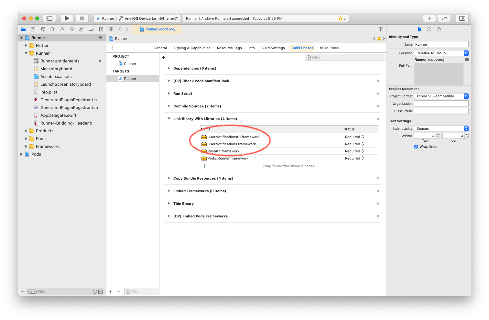

# Flutter 프로젝트를 Android / iOS 앱으로 배포하기

<br>

## Android 앱으로 배포하기

1. 런처 아이콘 추가하기
2. 앱 서명하기
3. Proguard 구성하기
4. 앱 메니페스트 검토하기
5. 빌드 구성 검토하기
6. 앱 번들 빌드하기
7. 앱 번들 테스트하기

<br>

### 1. 런처 아이콘 추가하기

공식문서에서 추천하는 [flutter_launcher_icons](https://pub.dev/packages/flutter_launcher_icons) 라이브러리를 사용하여 런처 아이콘을 관리할 수 있습니다. 라이브러리를 사용하지 않고 런처 아이콘을 직접 지정하려면 아래의 스텝을 따르시면 됩니다.

<br>

#### 1) `/android/app/src/main/res/` 경로에 디렉토리를 만들고 아이콘 파일을 넣습니다.

Android Studio 에디터를 사용하면 [Image Asset Studio 실행하기](https://developer.android.com/studio/write/image-asset-studio?hl=ko#access) 문서에 따라 런처 아이콘을 쉽게 추가할 수 있습니다. Image Asset Studio의 Launcher Icon Generator를 사용하여 Android 규격에 맞는 아이콘을 생성할 수 있기 때문입니다. 이미 작업한 아이콘 파일을 기반으로 각 디바이스 크기와 해상도에 맞는 아이콘들이 생성됩니다.

Android Studio 에디터를 사용하지 않고 해상도별 아이콘 파일들을 직접 만들었다면 `/android/app/src/main/res/` 경로에 아이콘 파일들을 넣어주면 됩니다. 아이콘 파일을 넣을 디렉토리는 [configuration qualifiers](https://developer.android.com/guide/topics/resources/providing-resources#AlternativeResources)에 따라 `<resources_name>-<config_qualifier>` 형식으로 이름을 정합니다. 예를 들어 `mipmap-hdpi`와 같이 디렉토리 이름을 정하면 됩니다. `mipmap`은 각기 다른 디바이스 해상도에 맞춘 아이콘 파일을 의미하고요, `hdpi`는 화면 밀도를 나타내는 한정자(Qualifier) 중 하나이죠.

<br>

기본적으로 아래와 같이 디렉토리들이 구성되어있고, 각 규격에 맞는 Flutter 아이콘들이 세팅되어있습니다. 각 해상도에 맞는 런처 아이콘 파일들로 교체해주기만 하면 되죠.

<br>


<br>

> `mipmap`은 [`drawable`(드로어블)](https://developer.android.com/guide/topics/resources/drawable-resource) 리소스 중에서 런처아이콘을 관리하기 위한 리소스를 의미합니다. `drawable` 리소스란 말그대로 화면에 그릴 수 있는 그래픽 파일을 의미하는데요, `png`, `gif`와 같은 비트맵 파일들이 `drawable` 리소스에 해당합니다.

<br>

> 여러 한정자(Qualifier)를 추가할 때는 [구성 한정자 이름](https://developer.android.com/guide/topics/resources/providing-resources#table2) 표에 나열된 순서로 배치해야 합니다. 한정자의 순서가 잘못 지정되면 해당 리소스가 무시됩니다.

<br>

#### 2) `AndroidManifest.xml`에서 아이콘 파일과 앱 이름을 지정합니다.

`<application>` 태그의 `android:icon` 속성에 이전 단계에서 교체한 아이콘 파일을 가져오도록 지정합니다. `android:icon="@mipmap/ic_launcher"` 이런식으로요. `android:label` 속성에는 실제 사용할 앱의 이름을 지정합니다.

<br>

> 아이콘이 변경된 것을 확인하기 위해 앱을 실행하고 런처에서 앱 아이콘을 확인합니다.

<br>

### 2. 앱 서명하기

Google Play 스토어에 출시하기 위해서는 반드시 앱에 디지털 서명을 해야 합니다. 앱 배포시 개발자 정보를 제공하기 위함이고요, 개발자 인증 절차라고 볼 수 있습니다.

<br>

#### 1) keystore 만들기

아래 명령어를 사용하여 키스토어(keystore)를 생성합니다. (맥/리눅스용) 키스토어를 생성하면 `key.jks` 파일이 생성되는데요, 이 파일은 절대 공개된 저장소에 올리면 안됩니다.

```
keytool -genkey -v -keystore ~/key.jks -keyalg RSA -keysize 2048 -validity 10000 -alias key
```

<br>

> 명령어 설명 : keytool을 사용하여 keystore를 생성, 내 문서(`/Users/yujin`) 경로에 `key.jks` 파일을 저장합니다. RSA 알고리즘을 사용하여 키를 생성하고 키의 사이즈는 2048, 유효기간은 10000으로 합니다.

<br>

> keytool 은 프로젝트 경로에 존재하지 않을 수 있습니다. 해당 파일은 Android 스튜디오와 함께 설치되는 Java JDK에 포함되는 파일입니다. 해당 파일에 대한 구체적인 경로는 명령줄에 flutter doctor -v 을 입력한 후 표시되는 ‘Java binary at:’ 다음에 나타나는 경로에서 java를 포함하고 있는 디렉토리의 keytool 파일을 통해 확인할 수 있습니다.

<br>

#### 2) 앱에서 keystore 참조하기

`/android/app/` 경로에 `keystore` 디렉토리를 만들고 위 단계에서 생성된 `key.jks` 파일을 넣어줍니다. 그리고 `keystore.password` 파일을 생성하여 `key.jks` 파일과 같은 경로에 넣어주는데요, `keystore.password` 파일에는 keystore 생성시 제출했던 비밀번호를 적어줍니다. 아래의 파일 구조를 참고하세요.

```
/app
    /keystore
        key.jks
        keystore.password
```

<br>

keystore 파일은 공개된 저장소에 올라가지 않도록 반드시 `.gitignore` 파일에 `/keystore` 경로를 추가합니다.

<br>

#### 3) Gradle에서 서명 구성하기

`/android/app/build.gradle` 파일을 수정하여 앱의 서명을 구성합니다. `buildTypes` 블록을 아래 코드로 교체해주세요.

```gradle
    signingConfigs {
        release {
            storeFile file('../keystore/key.jks')
            storePassword file('../keystore/keystore.password').text.trim()
            keyPassword file('../keystore/keystore.password').text.trim()
            keyAlias 'key'
        }
    }

    buildTypes {
        release {
            signingConfig signingConfigs.release
        }
    }
```

<br>

### 3. Proguard 구성하기

기본적으로 Flutter는 Android 코드를 난독화하거나 축소하지 않습니다. 서드파티 자바 라이브러리나 Android 라이브러리를 사용한다면 Proguard를 적용하여 APK의 크기를 줄이고 리버스 엔지니어링으로부터 코드를 보호할 수 있습니다.

<br>

#### 1) Proguard 구성하기

`/android/app/` 경로에 `proguard-rules.pro` 파일을 생성하고, 아래 규칙을 추가합니다. 이 설정은 Flutter 엔진 라이브러리를 보호합니다. Firebase와 같은 다른 라이브러리를 보호하기 위해서는 추가적으로 규칙을 작성해야합니다.

```
## Flutter wrapper
-keep class io.flutter.app.** { *; }
-keep class io.flutter.plugin.**  { *; }
-keep class io.flutter.util.**  { *; }
-keep class io.flutter.view.**  { *; }
-keep class io.flutter.**  { *; }
-keep class io.flutter.plugins.**  { *; }
-dontwarn io.flutter.embedding.**
```

<br>

#### 2) 난독화와 축소 사용하기

`/android/app/build.gradle` 파일의 `buildTypes` 블록에 아래 코드를 추가합니다.

```
android {

    ...

    buildTypes {

        release {

            signingConfig signingConfigs.release

            minifyEnabled true
            useProguard true

            proguardFiles getDefaultProguardFile('proguard-android.txt'), 'proguard-rules.pro'

        }
    }
}
```

<br>

> 난독화와 축소 과정으로 인해 Android 앱의 컴파일 시간이 크게 늘어날 수 있습니다.

<br>

### 4. 앱 매니페스트 검토하기

앱 메니페스트 파일인 `AndroidManifest.xml` 파일을 검토합니다. 기본적으로 아래 사항들을 체크합니다.

<br>

#### 1) `application` 태그

앱의 최종 이름이 `android:label`에 지정되어 있는지 확인하세요.

<br>

#### 2) `uses-permission` 태그

예를 들어, 앱 내에서 인터넷 접근이 필요하다면 아래와 같이 접근 권한을 명시합니다. 기본적으로 이 태그는 이미 포함되어있을 가능성이 높습니다. 만약 앱 내에서 인터넷 접근이 필요하지 않다면 이 태그를 제거하세요.

```
<uses-permission android:name="android.permission.INTERNET" />
```

<br>

이 외에 앱 외부의 리소스나 디바이스에 대한 접근을 허용하기 위해 필요한 항목이 있다면 그에 맞는 이름으로 `uses-permission` 태그를 추가하면 됩니다. 아래는 예시입니다.

```
    <uses-permission android:name="android.permission.INTERNET" />
    <uses-permission android:name="android.permission.WAKE_LOCK" />
    <uses-permission android:name="android.permission.READ_CALENDAR" />
    <uses-permission android:name="android.permission.WRITE_CALENDAR" />
    <uses-permission android:name="android.permission.CAMERA" />
    <uses-permission android:name="android.permission.READ_CONTACTS" />
    <uses-permission android:name="android.permission.WRITE_CONTACTS" />
    <uses-permission android:name="android.permission.GET_ACCOUNTS" />
    <uses-permission android:name="android.permission.ACCESS_FINE_LOCATION" />
    <uses-permission android:name="android.permission.ACCESS_COARSE_LOCATION" />
    <uses-permission android:name="android.permission.RECORD_AUDIO" />
    <uses-permission android:name="android.permission.READ_PHONE_STATE" />
    <uses-permission android:name="android.permission.CALL_PHONE" />
    <uses-permission android:name="android.permission.READ_CALL_LOG" />
    <uses-permission android:name="android.permission.WRITE_CALL_LOG" />
    <uses-permission android:name="android.permission.WRITE_CALENDAR" />
    <uses-permission android:name="android.permission.ADD_VOICEMAIL" />
    <uses-permission android:name="android.permission.USE_SIP" />
    <uses-permission android:name="android.permission.PROCESS_OUTGOING_CALLS" />
    <uses-permission android:name="android.permission.BODY_SENSORS" />
    <uses-permission android:name="android.permission.SEND_SMS" />
    <uses-permission android:name="android.permission.RECEIVE_SMS" />
    <uses-permission android:name="android.permission.READ_SMS" />
    <uses-permission android:name="android.permission.RECEIVE_WAP_PUSH" />
    <uses-permission android:name="android.permission.RECEIVE_MMS" />
    <uses-permission android:name="android.permission.READ_EXTERNAL_STORAGE" />
    <uses-permission android:name="android.permission.WRITE_EXTERNAL_STORAGE" />
```

<br>

### 5. 빌드 구성 검토하기

Gradle 빌드 파일인 `/android/app/build.gradle` 파일을 검토합니다. 기본적으로 `defaultConfig` 블록 내용을 체크합니다.

<br>

#### `applicationId`

[애플리케이션 ID 설정](https://developer.android.com/studio/build/application-id) 문서를 참고하여 고유한 앱 ID를 지정하세요.

<br>

#### `minSdkVersion`/`targetSdkVersion`

[앱 버전 지정](https://developer.android.com/studio/publish/versioning) 문서를 참고하여 앱이 요구하는 API 레벨을 지정하세요. Android 시스템은 `minSdkVersion` 설정에 명시된 시스템 버전 호환성을 적용합니다. 이 설정을 통해 앱이 호환되는 최소 시스템 API 버전을 지정할 수 있죠.

<br>

#### `versionCode`/`versionName`

내부 앱 버전을 지정하세요. `pubspec.yaml` 파일에 `version` 속성을 명시하여 앱의 버전을 문자열 형태로 지정할 수 있습니다. [앱 버전 지정](https://developer.android.com/studio/publish/versioning) 문서를 참고하세요.

<br>

### 6. 앱 번들 빌드하기

Google Play 스토어에 앱을 배포하는 방법은 두 가지입니다. Google Play 스토어는 앱 번들 방식을 권합니다.

- 앱 번들 (추천)
- APK

<br>

아래 명령어를 사용하여 앱 번들을 빌드하세요. `flutter build` 실행은 기본적으로 `release` 빌드 입니다. 앱의 릴리즈 번들은 `/build/app/outputs/bundle/release/app.aab` 경로에 생성됩니다. 앱 번들 테스트는 [앱 번들 테스트하기](https://flutter-ko.dev/docs/deployment/android#%EC%95%B1-%EB%B2%88%EB%93%A4-%ED%85%8C%EC%8A%A4%ED%8A%B8%ED%95%98%EA%B8%B0)를 참고하세요.

```
flutter build appbundle
```

<br>

### 7. 앱 번들 테스트/출시하기

앱 번들 빌드가 완료되면 [앱을 Play Console에 업로드](https://developer.android.com/studio/publish/upload-bundle) 문서를 참고하여 구글 플레이에 앱을 업로드합니다. 앱 번들을 출시하기 위해서는 먼저 Google Play Console에서 비용을 지불하고 개발자 등록을 완료해야합니다. 2021년 4월 기준 $25가 청구됩니다. 이후 공개/비공개/내부 테스트 트랙을 사용하여 앱의 베타버전을 출시하거나 지정된 테스터들을 대상으로 앱을 테스트할 수 있습니다. 혹은 바로 프로덕션 앱으로 출시할 수 있습니다. 자세한 내용은 [버전 준비 및 출시](https://support.google.com/googleplay/android-developer/answer/9859348?visit_id=637550273103240982-1310059594&rd=1) 문서를 참고하세요.

<br>
<br>

## iOS 앱으로 배포하기

> [Apple의 App Store 심사 지침](https://developer.apple.com/app-store/review/)을 확인하고 진행해주세요.

<br>

1. Apple Developer Program 등록하기
2. App Store Connect에서 앱 등록하기
3. Xcode 프로젝트 설정하기
4. 프로비저닝 프로파일(Provisioning Profile) 준비하기
5. 앱 아이콘 추가하기
6. 빌드 아카이브 생성하기

<br>

### 1. Apple Developer Program 등록하기

[Apple Developer Program](https://developer.apple.com/programs/)에서 비용을 지불하고 개발자 계정으로 등록하세요. 2021년 4월 기준 연 129,000 원의 비용을 지불해야합니다. 결제가 완료되면 개발자 승인이 완료되기까지 기다려야하고요, 보통 48시간 이내 승인 완료 이메일을 받게 됩니다. 승인이 완료되면 [Apple Developer](https://developer.apple.com/) 홈페이지에서 Account 페이지로 이동합니다. 왼쪽 메뉴바의 Program Resources 섹션에 개발자 계정만 접근할 수 있는 항목들이 생긴 것을 확인할 수 있습니다.

<br>

### 2. App Store Connect에서 앱 등록하기

[App Store Connect](https://appstoreconnect.apple.com/)는 앱의 라이프사이클을 관리할 수 있는 곳입니다. 앱의 이름과 설명을 정하고 스크린샷 추가, 가격 설정 등을 완료한 후 앱스토어와 TestFlight에 출시하게 되죠. 앱을 등록하려면 아래의 두 단계를 거쳐야합니다.

- 고유 번들 ID 등록
- App Store Connect에 앱 레코드 생성

<br>

#### 1) 고유 번들 ID 등록

모든 iOS 앱은 Apple에 등록된 고유값인 번들 ID와 연결 됩니다. [Apple Developer](https://developer.apple.com/)의 Account 페이지에서 [Certificates, Identifiers & Profiles](https://developer.apple.com/account/resources/) 항목을 열고, `Identifiers` 메뉴로 이동합니다. 여기에서 `+` 또는 `Register an App ID` 버튼을 클릭하여 아래 페이지로 이동합니다. `App IDs`에 체크한 후 `Continue` 버튼을 클릭하세요.

<br>


<br>

아래 페이지에서는 `App`을 선택한 후 `Continue` 버튼을 클릭합니다.

<br>


<br>

아래 페이지에서는 다음의 세 가지 항목을 입력합니다. 입력 후 `Continue`, `Register` 버튼을 차례로 클릭하여 앱 ID를 생성합니다.

- `Description` : 앱 ID에 대한 설명을 작성합니다.

- `Bundle ID` : `Explicit`을 선택하고 앱 ID를 입력합니다. 하단 가이드를 참고하여 `com.domain.appname` 형태로 작성합니다.

- `Capabilities` : 앱에서 사용중인 서비스를 체크합니다. 앱 ID 발급 이후에도 자유롭게 변경이 가능합니다.

> 이 튜토리얼에서는 Access WiFi Information, HealthKit, Push Notifications, Sign In with Apple 서비스를 체크해보겠습니다.

<br>


<br>

#### 2) App Store Connect에 앱 레코드 생성

다음으로, [App Store Connect](https://appstoreconnect.apple.com/) 홈페이지에서 앱을 등록합니다. 랜딩페이지에서 왼쪽 상단의 `나의 앱`을 클릭하여 이동한 후, 다시 왼쪽 상단의 `+` 버튼 > `신규 앱`을 선택합니다.

<br>


<br>

나타난 폼 양식에 앱 정보를 입력하고 제출합니다. 플랫폼에 iOS를 체크하시고요, SKU는 [Stock-keeping Unit](https://en.wikipedia.org/wiki/Stock_keeping_unit)의 약자로 기업에서 만든 제품 일련번호로 생각하시면 됩니다. 앱을 출시하는 팀/회사의 입장에서 해당 앱을 식별할 수 있는 번호를 입력하면 됩니다.

<br>

> Stack Overflow에 [iTunes Connect: How to choose a good SKU?](https://stackoverflow.com/questions/8710512/itunes-connect-how-to-choose-a-good-sku)를 주제로한 논의가 있으니 참고하세요.

> 참고로 Flutter는 현재 tvOS를 지원하지 않습니다.

<br>

위 단계를 통해 앱이 생성되면 아래와 같이 앱의 상세정보 페이지로 자동 이동됩니다. 이 페이지는 App Store Connect의 `나의 앱` 페이지에서 등록한 앱 항목을 클릭하여 접근할 수도 있습니다. 사이드 바의 `앱 정보` 메뉴로 이동하여 번들 ID에 위 단계에서 선택한 고유 앱 ID가 잘 들어있는지 확인하세요.

<br>


<br>

### 3. Xcode 프로젝트 설정하기

> 자세한 설명은 [Prepare for app distribution](https://help.apple.com/xcode/mac/current/#/dev91fe7130a) 문서를 참고하세요.

<br>

App Store Connect에서 관리하는 앱 정보와는 별도로, 개발 단계에서 설정해야하는 사항들이 있습니다. 이 단계에서 해당 사항들을 설정합니다. 앱의 Flutter 프로젝트의 `/ios` 디렉토리 내의 `Runner.xcworkspace`를 실행시켜서 Xcode를 엽니다.

<br>

`Preferences` 창을 열고 `Accounts` 탭에서 Apple 개발자 계정으로 로그인되어있는지 확인하시고요, 로그인되어있지 않다면 왼쪽 하단의 `+` 버튼을 클릭하여 계정을 추가해주세요.

<br>


<br>


<br>

계정을 추가한 후 창을 닫고 Xcode 메인 창으로 돌아옵니다.

<br>


<br>

좌측의 `Runner`를 더블클릭하여 열어줍니다. `TARGETS` 섹션에 다시 `Runner`가 선택되어있는지 확인하시고요, 기본 사항들을 설정해봅시다.

<br>

탭별로 입력해야할 주요 항목들을 정리하면,

<br>

#### 1) General

#### Identity

- `Display Name` : 홈 스크린 등에 표시될 앱의 이름

- `Bundle Identifier` : App Store Connect에서 등록한 번들 ID

<br>

#### Deployment

- `iOS 9.0` : 앱이 지원할 최소 iOS 버전 및 플랫폼

  > 공식 문서에 따르면, Flutter는 iOS 8.0 이상을 지원합니다. Objective-C나 Swift 코드로 된 API를 사용한다면 지원 버전을 고려하여 이 설정을 적합하게 수정하세요.

<br>


<br>

#### 2) Signing & Capabilities

서명과 권한 설정을 하는 탭입니다.

> 서명에 대한 자세한 내용은 [인증서](https://developer.apple.com/kr/support/certificates/), [Create, export, and delete signing certificates](https://help.apple.com/xcode/mac/current/#/dev154b28f09) 문서를 참고하세요.

<br>

#### Capabilities

왼쪽 상단의 `+ Capability` 버튼을 클릭하여 `Push Notification` 등 필요한 서비스들을 추가해줍니다.

<br>


<br>


<br>

그 다음 `Build Phrases` 탭으로 이동하여 `Link Binary With Libraries` 섹션에 아래 스크린샷에 표시한 항목들을 추가합니다.

<br>



<br>

#### Signing

- `Team` : Apple Developer Program에 등록된 개발자(팀) 계정

- `Automatically manage signing` : Xcode가 서명 및 프로비저닝 프로파일(Provisioining profile)을 자동으로 관리하는지에 대한 여부

<br>

이 두 항목은 아래에서 자세하게 다뤄보겠습니다.

<br>

##### `Team`

`Team` 항목을 선택하면, `Automatically manage signing` 항목이 기본으로 체크되어있기 때문에 Xcode 내에서 프로비저닝 프로파일(Provisioning Profile)이 자동으로 생성됩니다. 저의 경우, 공식문서와는 다르게 Status 부분에 아래 스크린샷과 같이 경고가 나타났습니다. 경고 문구를 읽어보면, Apple 개발자 계정에 등록된 디바이스가 없기 때문에 프로비저닝 프로파일을 생성하는데 실패했다, 디바이스를 연결하고 Xcode가 해당 디바이스를 등록하도록 하라는 설명입니다.

<br>


<br>

위 스크린샷에 표시한 왼쪽 상단을 클릭해보세요. 아직 디바이스를 연결하지 않았기 때문에 `No device connected to 'My Mac'...` 문구를 확인할 수 있습니다.

<br>


<br>

디바이스를 등록하기위해 iPhone과 같은 iOS 디바이스를 케이블을 사용하여 맥북에 연결하세요. 다시 같은 곳을 클릭하면 iOS Device 섹션에 방금 연결한 디바이스가 생긴 것을 확인할 수 있습니다. 클릭하여 선택한 후, 경고 문구 아래의 `Try Again` 버튼을 클릭하세요. 새로운 경고 문구와 버튼이 생기면, 개발자 계정에 해당 디바이스를 등록하기 위해 버튼을 클릭하세요.

<br>


<br>

##### `Automatically manage signing`

기본설정인 체크 상태로도 충분하지만, Apple Pay, Apple Push Notification Service, Apple Wallet, MDM(모바일 기기 관리)과 같은 서비스를 사용하려면 서비스용 인증서를 별도로 요청한 후 프로비저닝 프로파일에 포함해야하므로 체크를 해제합니다. [Apple Developer](https://developer.apple.com/account/resources/certificates/list)에서 서비스용 인증서와 프로비저닝 프로파일을 생성한 후 Import하는 방식으로 서명과 권한 설정을 수동으로 관리해야하죠.

<br>

```
* 프로비저닝 프로파일(Provisioining profile)이란?

프로비저닝 프로파일(Provisioining profile)은 말그대로 "권한 설정" 프로파일입니다. iOS 디바이스들을 개발자가 발급받은 Apple 인증서와 연결하여
앱 설치를 허용하는 역할을 합니다. 이는 "오직 Apple만이 Apple의 하드웨어에서 어떤 소프트웨어가 동작하도록 허락할 수 있다"는 원칙때문에 반드시 필요한
역할입니다. 어떤 사용자라도 자신의 iOS 디바이스에서 앱을 실행하려면, 자신의 디바이스가 개발자를 신뢰할 수 있는지 알아야 앱 설치를 진행할지 말지 결정할
수 있습니다.
```


```
프로비저닝 프로파일은 앱 번들 ID와 각종 필요한 인증서들을 구성하여 만듭니다. 따라서 앱 정보와 (인증서 생성시 필요한) 개발자 정보, 개발자의 디바이스 정보를
담고있죠.
```

<br>

이 튜토리얼은 APNs(Apple Push Notification Service) 서비스를 포함하는 앱 배포를 가정하므로 `Automatically manage signing` 항목의 체크를 해제합니다. 앱 번들 ID는 위에서 등록하였으므로 건너뛰고, APNs 인증서를 발급받은 후 프로비저닝 프로파일을 준비해봅시다.

<br>

### 4. 프로비저닝 프로파일(Provisioning Profile) 준비하기

> 자세한 내용은 [Create Provisioning Profile](https://developer.apple.com/forums/thread/47806) 문서를 참고하세요. APNs에 대한 자세한 설명은 [Configuring Remote Notification Support](https://developer.apple.com/library/archive/documentation/NetworkingInternet/Conceptual/RemoteNotificationsPG/HandlingRemoteNotifications.html#//apple_ref/doc/uid/TP40008194-CH6-SW1) 문서를 참고하세요.

<br>

#### 1) CSR(CertificateSigningRequest) 파일 만들기

APNs 인증서는 Apple Developer의 [Certificates, Identifiers & Profiles](https://developer.apple.com/account/resources/certificates/list)에서 생성합니다. 그 전에 인증서 생성시 제출해야하는 CSR(CertificateSigningRequest) 파일을 준비해야합니다. CSR 파일은 말그대로 인증서 서명을 요청하는 파일로, 인증서를 요청하는 개발자에 대한 정보를 담은 파일입니다. 때문에 CSR 파일은 개발자가 보유한 맥을 통해서만 만들 수 있고요, 생성 과정에서 개발자의 Apple 계정 정보가 요구됩니다. 한 번 생성한 CSR 파일은 인증서를 요청할 때마다 사용할 수 있습니다.

<br>

맥에서 `키체인 접근(Keychain Access)` 프로그램을 열고 상단 툴바의 가장 왼쪽에 있는 프로그램명(`Keychain Access`)를 클릭합니다. `인증서 지원 > 인증 기관에서 인증서 요청...`을 선택합니다. 그 다음 나타난 `인증서 지원` 창에서 Apple Developer Program에 등록된 Apple 계정 이메일과 이름을 입력합니다. 요청 항목에서는 `디스크에 저장됨`을 선택, `본인이 키 쌍 정보 지정`을 체크하고 `계속` 버튼을 클릭합니다.

<br>


<br>

키의 크기와 키 생성시 사용할 알고리즘을 설정하고 `계속` 버튼을 클릭하여 CSR 파일 생성을 진행합니다.

<br>


<br>

#### 2) APNs 인증서 생성하기

Apple Developer의 [Certificates, Identifiers & Profiles](https://developer.apple.com/account/resources/certificates/list)에서 `+` 또는 `Create Certificate` 버튼을 클릭하여 인증서 생성을 시작합니다. APNs 사용을 위해 해당 권한 정보를 담은 인증서를 생성할 것이므로, Services 섹션의 `Apple Push Notification service SSL (Sandbox & Production)`을 선택하고 `Continue` 버튼을 클릭합니다.

<br>


<br>

인증서를 위한 앱 ID를 선택하고 `Continue` 버튼을 클릭하면, 아래와 같이 CSR 파일을 업로드하라는 페이지가 나타납니다. 위 단계에서 만들었던 CSR 파일을 업로드하고 인증서 생성을 완료하면 됩니다.

<br>


<br>

인증서 생성이 완료되면 `Download` 버튼을 클릭하여 맥에 다운로드하시고요, 다운로드한 파일을 더블클릭하여 실행하면 맥의 `키체인 접근` 프로그램에 등록됩니다. 프로그램을 열어 확인해보면 아래 스크린샷과 같이 `Apple Push Services` 인증서와 개인 키(Private Key)를 확인할 수 있습니다.

<br>


<br>

APNs 인증서를 발급받으면 미리 등록한 APP ID 정보에 해당 인증서가 자동으로 반영됩니다. 이를 확인하기 위해 Apple Developer의 [Identifiers](https://developer.apple.com/account/resources/identifiers/list) 메뉴로 이동한 후, 등록된 앱 ID를 클릭하여 설정 페이지로 이동합니다. Capabilities 섹션에서 `Push Notifications` 부분으로 스크롤하면 우측에 `Certificates (1)` 문구가 생긴 것을 확인할 수 있습니다.

<br>


<br>

#### 3) 서버용 APNs 인증서 생성하기

> 이 단계는 지금은 건너뛰어도 됩니다.

<br>

`키체인 접근` 프로그램에서 방금 등록된 인증서를 선택하여 다른 디렉토리로 Export 합니다. 저는 아래와 같이 `cert`로 이름을 작성하고 `.pem` 확장자로 저장했습니다.

<br>


<br>

그 다음, 이 인증서의 키 역시 같은 디렉토리로 Export 합니다. 이름을 `key`로 작성하고 (`.pem` 확장자가 비활성 상태이므로) `.p12` 확장자로 저장합니다. 키의 경우 Export시 비밀번호를 설정해야 합니다.

<br>


<br>

키의 경우 `.p12` 확장자로 저장했기 때문에 아래 명령어를 사용하여 `.pem` 확장자로 변환해줍니다. Export시 입력했던 비밀번호를 입력하여 Validation을 완료한 후, PEM 암호 문구(`PEM pass phrase`)를 다시 설정해주는 단계가 있습니다.

```
openssl pkcs12 -nocerts -out key.pem -in key.p12
```

<br>

이제 변환된 `key.pem` 파일을 사용하여 `key.unencrypted.pem`을 만듭니다. 이 단계에서 바로 위에서 설정한 PEM 암호 문구가 필요합니다.

```
openssl rsa -in key.pem -out key.unencrypted.pem
```

<br>

이제 마지막으로 `key.unencrypted.pem`과 `cert.pem`을 합쳐 APNs에 사용될 서버용 인증서를 만들어줍니다. `apns.pem` 파일이 생성되면 완료입니다.

```
cat cert.pem key.unencrypted.pem > apns.pem
```

<br>

#### 4) 프로비저닝 프로파일 생성하기

이제 앱 번들 ID와 필요한 인증서가 모두 준비되었기 때문에 프로비저닝 프로파일을 생성할 수 있습니다. Apple Developer의 [Certificates, Identifiers & Profiles](https://developer.apple.com/account/resources/certificates/list) > [Profiles](https://developer.apple.com/account/resources/profiles/list) 메뉴로 이동합니다. `+` 또는 `Generate a profile` 버튼을 클릭하여 프로필 생성을 시작합니다.

<br>

테스트 배포를 위해 `iOS App Development`를 선택하고 `Continue` 버튼을 클릭합니다.

<br>


<br>

그 다음 앱 ID를 선택하고 계속합니다.

<br>


<br>

선택 가능한 인증서 목록 중 포함시킬 인증서들을 모두 선택한 후 `Continue` 버튼을 클릭하여 프로비저닝 프로파일 생성을 완료해줍니다.

<br>


<br>

#### 5) Xcode에서 프로비저닝 프로파일 불러오기

Xcode에서 생성된 프로비저닝 프로파일을 바로 Download하여 서명에 포함시킬 수 있습니다. 사용할 프로비저닝 프로파일을 선택 후 Download하여 서명에 포함시키면, 프로비저닝 프로파일에 연결된 인증서 정보가 함께 표시됩니다.

<br>

### 5. 앱 아이콘 추가하기

Xcode 프로젝트의 좌측 탐색기에서 `/Runner` 디렉토리 내의 `/Assets.xcassets` 디렉토리를 엽니다. 여기에서 앱 아이콘을 원하는 아이콘으로 교체합니다. 교체 후에는 앱을 iOS 이뮬레이터로 실행시켜서 아이콘이 변경되었는지 확인하세요.

<br>


<br>

앱 아이콘은 Apple의 Human Interface Guidelines의 [App Icon](https://developer.apple.com/design/human-interface-guidelines/ios/icons-and-images/app-icon/) 문서를 참고하여 가이드라인을 준수하는 아이콘으로 준비해야 합니다. 특히 Apple의 앱 유효성 심사를 통과하기 위해 iOS 디바이스별 해상도 규격에 맞는 지정된 사이즈의 아이콘 파일들을 모두 제공하는 것이 중요합니다. 기본으로 들어있는 `AppIcon`을 클릭해보면 Flutter 로고 아이콘들이 사이즈별로 나타납니다.

<br>


<br>

가장 큰 사이즈인 (App Store용) `1024px * 1024px` 크기의 이미지 파일 하나를 준비하고, [App Icon Generator](https://appicon.co/)와 같은 외부 도구를 사용하여 나머지 사이즈의 아이콘 파일들을 생성하는 것이 편리합니다. 아래 스크린샷과 같이 `Assets.xcaseets` 디렉토리 내에 아이콘 파일들이 담긴 디렉토리를 넣어주면 됩니다.

<br>


<br>

아이콘 파일들과 함께 `Contents.json` 파일을 함께 넣어야하는데요, 사이즈별로 참조할 이미지 파일을 명시한 파일입니다. 파일 내용은 아래 예시를 참고하세요.

```
{
  "images" : [
    {
      "size" : "20x20",
      "idiom" : "iphone",
      "filename" : "Icon-App-20x20@2x.png",
      "scale" : "2x"
    },
    {
      "size" : "20x20",
      "idiom" : "iphone",
      "filename" : "Icon-App-20x20@3x.png",
      "scale" : "3x"
    },
    {
      "size" : "29x29",
      "idiom" : "iphone",
      "filename" : "Icon-App-29x29@1x.png",
      "scale" : "1x"
    },
    {
      "size" : "29x29",
      "idiom" : "iphone",
      "filename" : "Icon-App-29x29@2x.png",
      "scale" : "2x"
    },
    {
      "size" : "29x29",
      "idiom" : "iphone",
      "filename" : "Icon-App-29x29@3x.png",
      "scale" : "3x"
    },
    {
      "size" : "40x40",
      "idiom" : "iphone",
      "filename" : "Icon-App-40x40@2x.png",
      "scale" : "2x"
    },
    {
      "size" : "40x40",
      "idiom" : "iphone",
      "filename" : "Icon-App-40x40@3x.png",
      "scale" : "3x"
    },
    {
      "size" : "60x60",
      "idiom" : "iphone",
      "filename" : "Icon-App-60x60@2x.png",
      "scale" : "2x"
    },
    {
      "size" : "60x60",
      "idiom" : "iphone",
      "filename" : "Icon-App-60x60@3x.png",
      "scale" : "3x"
    },
    {
      "size" : "20x20",
      "idiom" : "ipad",
      "filename" : "Icon-App-20x20@1x.png",
      "scale" : "1x"
    },
    {
      "size" : "20x20",
      "idiom" : "ipad",
      "filename" : "Icon-App-20x20@2x.png",
      "scale" : "2x"
    },
    {
      "size" : "29x29",
      "idiom" : "ipad",
      "filename" : "Icon-App-29x29@1x.png",
      "scale" : "1x"
    },
    {
      "size" : "29x29",
      "idiom" : "ipad",
      "filename" : "Icon-App-29x29@2x.png",
      "scale" : "2x"
    },
    {
      "size" : "40x40",
      "idiom" : "ipad",
      "filename" : "Icon-App-40x40@1x.png",
      "scale" : "1x"
    },
    {
      "size" : "40x40",
      "idiom" : "ipad",
      "filename" : "Icon-App-40x40@2x.png",
      "scale" : "2x"
    },
    {
      "size" : "76x76",
      "idiom" : "ipad",
      "filename" : "Icon-App-76x76@1x.png",
      "scale" : "1x"
    },
    {
      "size" : "76x76",
      "idiom" : "ipad",
      "filename" : "Icon-App-76x76@2x.png",
      "scale" : "2x"
    },
    {
      "size" : "83.5x83.5",
      "idiom" : "ipad",
      "filename" : "Icon-App-83.5x83.5@2x.png",
      "scale" : "2x"
    },
    {
      "size" : "1024x1024",
      "idiom" : "ios-marketing",
      "filename" : "Icon-App-1024x1024@1x.png",
      "scale" : "1x"
    }
  ],
  "info" : {
    "version" : 1,
    "author" : "xcode"
  }
}
```

<br>

Xcode에서 확인해보면, 아래 스크린샷과 같이 사이즈별로 참조된 이미지들이 보입니다.

<br>


<br>

### 6. 빌드 아카이브 생성하고 배포하기

이제 빌드 아카이브를 생성하여 App Store Connect에 빌드를 업로드하면 됩니다.

<br>

#### 1) 앱 빌드하기

아래 명령어를 사용하여 iOS 앱을 앱을 릴리즈(release) 모드로 빌드합니다. `flutter build` 명령어는 `--release`를 기본 옵션으로 합니다.

```
flutter build ios
```

<br>

> Xcode에서 릴리즈 모드 설정을 새로 고치도록 하려면 Xcode를 껐다 다시 켜세요. Xcode 8.3 이상에서는 필요하지 않습니다.

<br>

앱 빌드 중에 아래와 같은 창이 뜰 수 있습니다. 맥북을 열 때 사용하는 암호를 입력하신 후 `항상 허용`을 클릭합니다.

<br>


<br>

#### 2) 앱 버전 설정하기

이제 Xcode에서 앱 버전을 설정하고 빌드하면 되는데요, Xcode 상단 메뉴에서 `Product > Scheme > Runner` 를 선택합니다. 다음은 `Product > Destination`에서 `Generic iOS Device` 또는 `Any iOS Device`를 선택합니다. 이제 `TARGETS`에 `Runner`가 선택된 상태에서 `General` 메뉴의 `Version` 항목을 원하는 버전으로 변경합니다. `Build` 에는 App Store Connect에서 추적 가능한 고유 빌드 번호를 작성하면 됩니다. 각 업로드에는 고유한 빌드 번호가 필요한데요, 첫 업로드라면 기본값인 `1`을 그대로 사용해도 무방합니다.

<br>

#### 3) 빌드 아카이브 생성하기

Xcode 상단 메뉴에서 `Product > Archive` 를 클릭하고 기다리면 Xcode organizer 창이 뜹니다.

<br>


<br>

방금 생성한 아카이브를 선택합니다. 그리고 우측의 `Validate app` 버튼을 클릭하여 앱 유효성 검사를 시작합니다. 단계를 거치다보면 아래와 같은 경고 문구가 나올 수 있습니다. 전 단계에서 프로비저닝 프로파일을 자동으로 생성한 경우 Distribution 인증서를 따로 발급받지 않았기 때문일 수 있습니다. 이 경고 문구가 나타났다면, 인증서를 생성해야 하므로 `Generate an Apple Distribution certificate`에 체크하고 `Next` 버튼을 클릭합니다.

<br>


<br>

인증서가 생성되면 아래와 같은 창을 보실 수 있고요, 안내 문구에 따라 인증서를 Export하고 안전한 곳에 보관하신 후 `Next` 버튼을 클릭하세요.

<br>


<br>

이미 Distribution 인증서가 있다면 아래와 같은 화면을 볼 수 있습니다. Runner.app 항목에 사용할 프로비저닝 프로파일의 이름을 선택하고 `Next` 버튼을 클릭하세요.

<br>


<br>

앱 정보를 확인하고 `Validate` 버튼을 클릭합니다. 참고로 ENTITLEMENTS 섹션의 `aps-environment` 항목은 APNs 인증서가 포함되었기 때문에 부여된 권한입니다.

<br>


<br>

유효성 검사가 끝나면 `Distribute App` 버튼을 클릭하여 App Store Connect에 앱을 제출하고 기다립니다. 30분내로 결과를 알리는 이메일을 받을 수 있습니다.

<br>

> 자세한 내용은 [Validate an archive of your app](https://help.apple.com/xcode/mac/current/#/dev37441e273), [Upload an app to App Store Connect](https://help.apple.com/xcode/mac/current/#/dev442d7f2ca) 문서를 참고하세요.

<br>

#### 4) 미국 수출 규정 검토

App Store Connect로 부터 결과 이메일을 받았다면, [App Store Connect](https://appstoreconnect.apple.com/) 사이트의 `나의 앱` > 등록된 앱 항목을 클릭하여 세부정보 페이지로 이동합니다. 앱을 TestFlight로 출시하기 위해 TestFlight 탭으로 이동합니다.

<br>


<br>

`수출 규정 관련 문서가 누락됨`이라는 경고 문구가 보입니다. 우측의 `관리`를 클릭하면 아래와 같은 팝업창이 나타납니다. 앱이 암호화를 사용하는 경우 정식 수출 승인을 받아야 한다는 내용입니다. 해당되지 않는 경우(수출 규정 면제 대상인 경우), `아니요`를 선택하고 `내부 테스트 시작` 버튼을 클릭합니다. `아니요`를 선택하면 나타나는 하단 안내 문구에 따라 프로젝트 코드에 해당 속성을 미리 지정해놓을 수 있습니다. [Add export compliance keys](https://help.apple.com/xcode/mac/current/#/dev0dc15d044) 문서를 참고하여 설정하면 됩니다.

<br>


<br>

다음은 App Store Connect 도움말의 [수출 준수 개요](https://help.apple.com/app-store-connect/#/dev88f5c7bf9) 문서에서 발췌한 설명입니다. 미국 기업인 Apple의 서버에 앱이 호스팅되므로, 미국 외 국가의 사용자가 앱을 다운로드하는 경우 이를 미국의 수출로 본다는 내용입니다.

```
App Store Connect에 업로드된 응용 프로그램은 미국의 Apple 서버에 업로드됩니다. App Store에 또는 미국 또는 캐나다 이외 지역의 TestFlight를 통해
외부 테스터에게 앱을 배포하려는 의도로 앱을 제출하면 미국 수출로 간주되며 귀하의 법인 위치와 무관하게 미국 수출법이 적용됩니다.

앱이 암호화를 사용하거나 암호화에 액세스, 또는 암호화를 포함, 구현 또는 통합하는 경우 암호화 소프트웨어의 수출로 간주되므로 미국 수출 및 기타 국가 및 지역의
수입 관련 규정이 적용됩니다.
```

<br>

```
암호화 사용은 다음을 포함하지만 이에 국한되지 않습니다:

• 보안 채널(예를 들어, HTTPS, SSL 등)을 통해 전화를 연결합니다.

• 표준 암호화 알고리즘을 사용합니다.

• iOS 또는 macOS와 같이 다른 소스의 암호화 기능을 사용합니다.

• 독점 또는 비표준 암호화 알고리즘을 사용합니다. (이하 생략)
```

<br>

```
수출 관리 규정을 읽고 앱의 암호화 사용이 규정의 요구 사항에서 면제되는지 확인하는 것은 본인의 책임입니다. 수출 규정을 잘못 해석하거나 면제를 주장하는 것과
관련된 모든 책임은 본인에게 있습니다. 암호화 수출 제어에 대한 자세한 내용은 미 상무부 산업 보안국(BIS) 웹 사이트를 방문하여 암호화 정책 관련 내용을
확인하십시오.
```

<br>

<br>

<br>

이제 아래와 같이 `처리 중`으로 상태가 변경됩니다.

<br>


<br>

기다리면 아래와 같이 `제출 준비 완료` 상태가 됩니다.

<br>


<br>

#### 5) 내부 테스터 초대하기

이제 왼쪽 사이드바의 `내부 그룹` 섹션의 `App Store Connect 사용자` 메뉴로 이동합니다. 여기에서 내부 테스터를 추가하면 됩니다.

<br>


<br>

앱을 빌드한 계정 외에 다른 Apple 사용자를 내부 테스터로 지정하려면 [사용자 및 엑세스](https://appstoreconnect.apple.com/access/users) 페이지에서 추가합니다. 역할을 부여하고 테스트를 요청할 앱을 선택한 후 사용자를 추가하면 초대 이메일이 발송됩니다.

<br>


<br>


<br>

다시 앱 > `내부 그룹` > `App Store Connect 사용자` 메뉴로 돌아와서 테스터를 추가하면, 테스터에게 초대 이메일이 발송됩니다. 위에서 추가한 사용자를 이제 테스터로 추가할 수 있습니다.

<br>


<br>

초대된 테스터는 아래와 같은 이메일을 받게됩니다. 이메일을 모바일에서 확인하면 `View in TestFlight` 버튼을 클릭하여 바로 TestFlight 앱으로 이동한 후 앱을 다운로드하고 테스트할 수 있습니다. TestFlight 앱이 없다면 Apple App Store에서 TestFlight 앱을 다운로드한 후 진행합니다.

<br>


<br>

---

### References

- [Android 앱 출시 준비하기 | Flutter](https://flutter-ko.dev/docs/deployment/android#%EB%9F%B0%EC%B2%98-%EC%95%84%EC%9D%B4%EC%BD%98-%EC%B6%94%EA%B0%80%ED%95%98%EA%B8%B0)
- [앱을 전 세계적으로 게시하고, 관리하고, 배포하는 방법 | Google Play](https://developer.android.com/distribute/best-practices/launch)
- [iOS 앱 출시 준비하기 | Flutter](https://flutter-ko.dev/docs/deployment/ios)
- [Configuring Remote Notification Support | Apple Developer](https://developer.apple.com/library/archive/documentation/NetworkingInternet/Conceptual/RemoteNotificationsPG/HandlingRemoteNotifications.html#//apple_ref/doc/uid/TP40008194-CH6-SW1)
- [인증서 | Apple Developer](https://developer.apple.com/kr/support/certificates/)
- [Signing & Capabilities workflow | Xcode Help](https://help.apple.com/xcode/mac/current/#/dev60b6fbbc7)
- [언인스톨 트래킹 APNS(Apple Push Notification Service)](https://support.singular.net/hc/ko/articles/360000269811-%EC%96%B8%EC%9D%B8%EC%8A%A4%ED%86%A8-%ED%8A%B8%EB%9E%98%ED%82%B9-APNS-Apple-Push-Notification-Service-)
- [iOS Notification 만들기](http://throughkim.kr/2016/12/27/ios-notification/)
- [코드사이닝, 인증서, 프로비저닝 프로파일이란?](https://medium.com/jinshine-%EA%B8%B0%EC%88%A0-%EB%B8%94%EB%A1%9C%EA%B7%B8/%EC%BD%94%EB%93%9C%EC%82%AC%EC%9D%B4%EB%8B%9D-%EC%9D%B8%EC%A6%9D%EC%84%9C-%ED%94%84%EB%A1%9C%EB%B9%84%EC%A0%80%EB%8B%9D-%ED%94%84%EB%A1%9C%ED%8C%8C%EC%9D%BC%EC%9D%B4%EB%9E%80-2bd2c652d00f)
- [Distribute an app using TestFlight (iOS, tvOS, watchOS) | Xcode Help](https://help.apple.com/xcode/mac/current/#/dev2539d985f)
