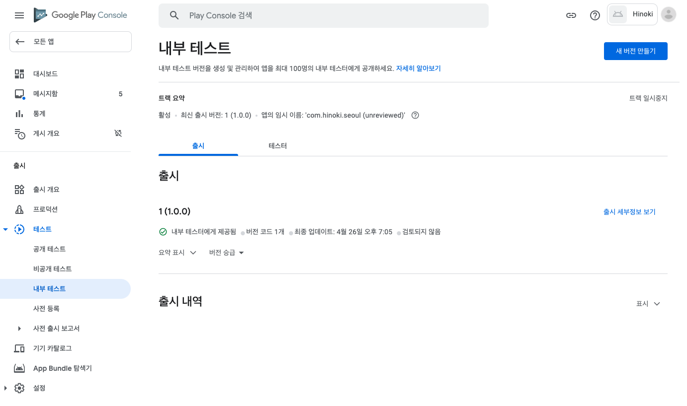

# Flutter 프로젝트를 Android 앱으로 배포하기

<br>

1. 런처 아이콘 추가하기
2. 앱 서명하기
3. Proguard 구성하기
4. 앱 메니페스트 검토하기
5. 빌드 구성 검토하기
6. 앱 번들 빌드하기
7. 앱 번들 테스트하기

<br>

## 1. 런처 아이콘 추가하기

공식문서에서 추천하는 [flutter_launcher_icons](https://pub.dev/packages/flutter_launcher_icons) 라이브러리를 사용하여 런처 아이콘을 관리할 수 있습니다. 라이브러리를 사용하지 않고 런처 아이콘을 직접 지정하려면 아래의 스텝을 따르시면 됩니다.

<br>

### 1) `/android/app/src/main/res/` 경로에 디렉토리를 만들고 아이콘 파일을 넣습니다.

Android Studio 에디터를 사용하면 [Image Asset Studio 실행하기](https://developer.android.com/studio/write/image-asset-studio?hl=ko#access) 문서에 따라 런처 아이콘을 쉽게 추가할 수 있습니다. Image Asset Studio의 Launcher Icon Generator를 사용하여 Android 규격에 맞는 아이콘을 생성할 수 있기 때문입니다. 이미 작업한 아이콘 파일을 기반으로 각 디바이스 크기와 해상도에 맞는 아이콘들이 생성됩니다.

Android Studio 에디터를 사용하지 않고 해상도별 아이콘 파일들을 직접 만들었다면 `/android/app/src/main/res/` 경로에 아이콘 파일들을 넣어주면 됩니다. 아이콘 파일을 넣을 디렉토리는 [configuration qualifiers](https://developer.android.com/guide/topics/resources/providing-resources#AlternativeResources)에 따라 `<resources_name>-<config_qualifier>` 형식으로 이름을 정합니다. 예를 들어 `mipmap-hdpi`와 같이 디렉토리 이름을 정하면 됩니다. `mipmap`은 각기 다른 디바이스 해상도에 맞춘 아이콘 파일을 의미하고요, `hdpi`는 화면 밀도를 나타내는 한정자(Qualifier) 중 하나이죠.

<br>

기본적으로 아래와 같이 디렉토리들이 구성되어있고, 각 규격에 맞는 Flutter 아이콘들이 세팅되어있습니다. 각 해상도에 맞는 런처 아이콘 파일들로 교체해주기만 하면 되죠.

<br>


<br>

> `mipmap`은 [`drawable`(드로어블)](https://developer.android.com/guide/topics/resources/drawable-resource) 리소스 중에서 런처아이콘을 관리하기 위한 리소스를 의미합니다. `drawable` 리소스란 말그대로 화면에 그릴 수 있는 그래픽 파일을 의미하는데요, `png`, `gif`와 같은 비트맵 파일들이 `drawable` 리소스에 해당합니다.

<br>

> 여러 한정자(Qualifier)를 추가할 때는 [구성 한정자 이름](https://developer.android.com/guide/topics/resources/providing-resources#table2) 표에 나열된 순서로 배치해야 합니다. 한정자의 순서가 잘못 지정되면 해당 리소스가 무시됩니다.

<br>

### 2) `AndroidManifest.xml`에서 아이콘 파일과 앱 이름을 지정합니다.

`<application>` 태그의 `android:icon` 속성에 이전 단계에서 교체한 아이콘 파일을 가져오도록 지정합니다. `android:icon="@mipmap/ic_launcher"` 이런식으로요. `android:label` 속성에는 실제 사용할 앱의 이름을 지정합니다.

<br>

> 아이콘이 변경된 것을 확인하기 위해 앱을 실행하고 런처에서 앱 아이콘을 확인합니다.

<br>

## 2. 앱 서명하기

Google Play 스토어에 출시하기 위해서는 반드시 앱에 디지털 서명을 해야 합니다. 앱 배포시 개발자 정보를 제공하기 위함이고요, 개발자 인증 절차라고 볼 수 있습니다.

<br>

### 1) keystore 만들기

아래 명령어를 사용하여 키스토어(keystore)를 생성합니다. (맥/리눅스용) 키스토어를 생성하면 `key.jks` 파일이 생성되는데요, 이 파일은 절대 공개된 저장소에 올리면 안됩니다.

```
keytool -genkey -v -keystore ~/key.jks -keyalg RSA -keysize 2048 -validity 10000 -alias key
```

<br>

> 명령어 설명 : keytool을 사용하여 keystore를 생성, 내 문서(`/Users/yujin`) 경로에 `key.jks` 파일을 저장합니다. RSA 알고리즘을 사용하여 키를 생성하고 키의 사이즈는 2048, 유효기간은 10000으로 합니다.

<br>

> keytool 은 프로젝트 경로에 존재하지 않을 수 있습니다. 해당 파일은 Android 스튜디오와 함께 설치되는 Java JDK에 포함되는 파일입니다. 해당 파일에 대한 구체적인 경로는 명령줄에 flutter doctor -v 을 입력한 후 표시되는 ‘Java binary at:’ 다음에 나타나는 경로에서 java를 포함하고 있는 디렉토리의 keytool 파일을 통해 확인할 수 있습니다.

<br>

### 2) 앱에서 keystore 참조하기

`/android/app/` 경로에 `keystore` 디렉토리를 만들고 위 단계에서 생성된 `key.jks` 파일을 넣어줍니다. 그리고 `keystore.password` 파일을 생성하여 `key.jks` 파일과 같은 경로에 넣어주는데요, `keystore.password` 파일에는 keystore 생성시 제출했던 비밀번호를 적어줍니다. 아래의 파일 구조를 참고하세요.

```
/app
    /keystore
        key.jks
        keystore.password
```

<br>

keystore 파일은 공개된 저장소에 올라가지 않도록 반드시 `.gitignore` 파일에 `/keystore` 경로를 추가합니다.

<br>

### 3) Gradle에서 서명 구성하기

`/android/app/build.gradle` 파일을 수정하여 앱의 서명을 구성합니다. `buildTypes` 블록을 아래 코드로 교체해주세요.

```gradle
    signingConfigs {
        release {
            storeFile file('../keystore/key.jks')
            storePassword file('../keystore/keystore.password').text.trim()
            keyPassword file('../keystore/keystore.password').text.trim()
            keyAlias 'key'
        }
    }

    buildTypes {
        release {
            signingConfig signingConfigs.release
        }
    }
```

<br>

## 3. Proguard 구성하기

기본적으로 Flutter는 Android 코드를 난독화하거나 축소하지 않습니다. 서드파티 자바 라이브러리나 Android 라이브러리를 사용한다면 Proguard를 적용하여 APK의 크기를 줄이고 리버스 엔지니어링으로부터 코드를 보호할 수 있습니다.

<br>

### 1) Proguard 구성하기

`/android/app/` 경로에 `proguard-rules.pro` 파일을 생성하고, 아래 규칙을 추가합니다. 이 설정은 Flutter 엔진 라이브러리를 보호합니다. Firebase와 같은 다른 라이브러리를 보호하기 위해서는 추가적으로 규칙을 작성해야합니다.

```
## Flutter wrapper
-keep class io.flutter.app.** { *; }
-keep class io.flutter.plugin.**  { *; }
-keep class io.flutter.util.**  { *; }
-keep class io.flutter.view.**  { *; }
-keep class io.flutter.**  { *; }
-keep class io.flutter.plugins.**  { *; }
-dontwarn io.flutter.embedding.**
```

<br>

### 2) 난독화와 축소 사용하기

`/android/app/build.gradle` 파일의 `buildTypes` 블록에 아래 코드를 추가합니다.

```
android {

    ...

    buildTypes {

        release {

            signingConfig signingConfigs.release

            minifyEnabled true
            useProguard true

            proguardFiles getDefaultProguardFile('proguard-android.txt'), 'proguard-rules.pro'

        }
    }
}
```

<br>

> 난독화와 축소 과정으로 인해 Android 앱의 컴파일 시간이 크게 늘어날 수 있습니다.

<br>

## 4. 앱 매니페스트 검토하기

앱 메니페스트 파일인 `AndroidManifest.xml` 파일을 검토합니다. 기본적으로 아래 사항들을 체크합니다.

<br>

### 1) `application` 태그

앱의 최종 이름이 `android:label`에 지정되어 있는지 확인하세요.

<br>

### 2) `uses-permission` 태그

예를 들어, 앱 내에서 인터넷 접근이 필요하다면 아래와 같이 접근 권한을 명시합니다. 기본적으로 이 태그는 이미 포함되어있을 가능성이 높습니다. 만약 앱 내에서 인터넷 접근이 필요하지 않다면 이 태그를 제거하세요.

```
<uses-permission android:name="android.permission.INTERNET" />
```

<br>

이 외에 앱 외부의 리소스나 디바이스에 대한 접근을 허용하기 위해 필요한 항목이 있다면 그에 맞는 이름으로 `uses-permission` 태그를 추가하면 됩니다. 아래는 예시입니다.

```
    <uses-permission android:name="android.permission.INTERNET" />
    <uses-permission android:name="android.permission.WAKE_LOCK" />
    <uses-permission android:name="android.permission.READ_CALENDAR" />
    <uses-permission android:name="android.permission.WRITE_CALENDAR" />
    <uses-permission android:name="android.permission.CAMERA" />
    <uses-permission android:name="android.permission.READ_CONTACTS" />
    <uses-permission android:name="android.permission.WRITE_CONTACTS" />
    <uses-permission android:name="android.permission.GET_ACCOUNTS" />
    <uses-permission android:name="android.permission.ACCESS_FINE_LOCATION" />
    <uses-permission android:name="android.permission.ACCESS_COARSE_LOCATION" />
    <uses-permission android:name="android.permission.RECORD_AUDIO" />
    <uses-permission android:name="android.permission.READ_PHONE_STATE" />
    <uses-permission android:name="android.permission.CALL_PHONE" />
    <uses-permission android:name="android.permission.READ_CALL_LOG" />
    <uses-permission android:name="android.permission.WRITE_CALL_LOG" />
    <uses-permission android:name="android.permission.WRITE_CALENDAR" />
    <uses-permission android:name="android.permission.ADD_VOICEMAIL" />
    <uses-permission android:name="android.permission.USE_SIP" />
    <uses-permission android:name="android.permission.PROCESS_OUTGOING_CALLS" />
    <uses-permission android:name="android.permission.BODY_SENSORS" />
    <uses-permission android:name="android.permission.SEND_SMS" />
    <uses-permission android:name="android.permission.RECEIVE_SMS" />
    <uses-permission android:name="android.permission.READ_SMS" />
    <uses-permission android:name="android.permission.RECEIVE_WAP_PUSH" />
    <uses-permission android:name="android.permission.RECEIVE_MMS" />
    <uses-permission android:name="android.permission.READ_EXTERNAL_STORAGE" />
    <uses-permission android:name="android.permission.WRITE_EXTERNAL_STORAGE" />
```

<br>

## 5. 빌드 구성 검토하기

Gradle 빌드 파일인 `/android/app/build.gradle` 파일을 검토합니다. 기본적으로 `defaultConfig` 블록 내용을 체크합니다.

<br>

### `applicationId`

[애플리케이션 ID 설정](https://developer.android.com/studio/build/application-id) 문서를 참고하여 고유한 앱 ID를 지정하세요.

<br>

### `minSdkVersion`/`targetSdkVersion`

[앱 버전 지정](https://developer.android.com/studio/publish/versioning) 문서를 참고하여 앱이 요구하는 API 레벨을 지정하세요. Android 시스템은 `minSdkVersion` 설정에 명시된 시스템 버전 호환성을 적용합니다. 이 설정을 통해 앱이 호환되는 최소 시스템 API 버전을 지정할 수 있죠.

<br>

### `versionCode`/`versionName`

내부 앱 버전을 지정하세요. `pubspec.yaml` 파일에 `version` 속성을 명시하여 앱의 버전을 문자열 형태로 지정할 수 있습니다. [앱 버전 지정](https://developer.android.com/studio/publish/versioning) 문서를 참고하세요.

<br>

## 6. 앱 번들 빌드하기

Google Play 스토어에 앱을 배포하는 방법은 두 가지입니다.

- 앱 번들 (추천)
- APK

<br>

하지만 2021년 8월부터 신규 앱은 Google Play에서 Android 앱 번들 형태로 게시해야 합니다. 자세한 내용은 공식 블로그의 [New Android App Bundle and target API level requirements in 2021](https://android-developers.googleblog.com/2020/11/new-android-app-bundle-and-target-api.html) 문서에서 확인할 수 있습니다.

<br>

아래 명령어를 사용하여 앱 번들을 빌드하세요. `flutter build` 실행은 기본적으로 `release` 빌드 입니다. 앱의 릴리즈 번들은 `/build/app/outputs/bundle/release/app.aab` 경로에 생성됩니다. 앱 번들 테스트는 [앱 번들 테스트하기](https://flutter-ko.dev/docs/deployment/android#%EC%95%B1-%EB%B2%88%EB%93%A4-%ED%85%8C%EC%8A%A4%ED%8A%B8%ED%95%98%EA%B8%B0)를 참고하세요.

```
flutter build appbundle
```

<br>

## 7. 앱 번들 테스트/출시하기

앱 번들을 출시하기 위해서는 먼저 Google Play 콘솔에서 비용을 지불하고 개발자 등록을 완료해야하고요, 2021년 4월 기준 $25가 청구됩니다. 앱 번들 빌드가 완료되면 [앱을 Play Console에 업로드](https://developer.android.com/studio/publish/upload-bundle) 문서를 참고하여 Google Play 콘솔에 앱을 업로드합니다. 보통 앱을 업로드하기 전에 다음의 2가지 요구사항을 충족했는지 체크합니다.

- [앱 서명 등록](https://developer.android.com/studio/publish/app-signing#enroll) 완료

- 150MB 이하의 압축된 앱

<br>

#### \* 앱 압축 다운로드 크기 제한 확인

Google Play는 150MB 이하의 압축된 앱 다운로드만 지원합니다. 사용자가 앱을 다운로드할 때 앱을 설치하는 데 필요한 압축 APK의 총 크기(기본 APK + 구성 APK)는 150MB 이하여야 합니다. 자세한 내용은 [압축 다운로드 크기 제한](https://developer.android.com/guide/app-bundle#size_restrictions) 문서를 참고하세요.

<br>

### 1) 버전 만들기

다음 3가지 테스트 트랙 중에서 출시할 버전을 만듭니다. 테스트 트랙을 통해 앱의 베타버전을 출시하거나 지정된 테스터들을 대상으로 앱을 테스트할 수 있습니다. 혹은 바로 프로덕션 앱으로 출시할 수도 있습니다. 자세한 내용은 [버전 준비 및 출시](https://support.google.com/googleplay/android-developer/answer/9859348?visit_id=637550273103240982-1310059594&rd=1) 문서를 참고하세요.

- 공개 테스트 : Google Play에서 테스터에게 공개됩니다.

- 비공개 테스트 : 개발자가 선택한 소수의 테스터에게 제공됩니다. 버전 테스트와 의견 제출이 가능합니다.

- 내부 테스트 : 개발자가 선택하는 최대 100명의 테스터에게 제공됩니다.

<br>

이 문서에서는 내부 테스트를 진행하겠습니다. [내부 테스트 시작](https://play.google.com/console/u/0/developers/app/tracks/internal-testing) 페이지에서 앱을 출시할 개발자 계정을 선택하고 진행합니다. 그럼 Google Play 콘솔의 출시 > 테스트 > 내부 테스트 메뉴로 자동 이동되고요, 우측 상단의 `새 버전 만들기` 버튼을 클릭하여 버전 만들기를 시작합니다.

<br>



<br>
<br>

그 다음, App Bundle 및 APK 섹션에 `aab` 포맷의 앱 번들 파일을 업로드하면 됩니다. 위 단계에서 생성한 앱 번들 파일은 Flutter 프로젝트의 `build/app/outputs/bundle/release/app.aab` 경로에 있습니다.

<br>


<br>
<br>

이미 앱 번들을 업로드한 적이 있는 경우, 앱 빌드 구성에서 버전코드가 이전 번들과 동일하면 아래와 같은 오류가 발생합니다. [빌드 구성 검토하기](https://github.com/estellechoi/TIL/blob/master/docs/flutter/deploy_android.md#user-content-5-%EB%B9%8C%EB%93%9C-%EA%B5%AC%EC%84%B1-%EA%B2%80%ED%86%A0%ED%95%98%EA%B8%B0)를 참고하여 `android/app/build.gradle` 파일에서 `versionCode` 항목에 새로운 버전을 명시한 후 다시 앱 번들을 생성하세요. `flutterVersionCode.toInteger()`라고 명시되어있다면, `pubspec.yaml` 파일에서 `version` 항목을 수정합니다.

<br>


<br>
<br>

### 2) 버전 검토 및 출시

앱 번들 업로드가 완료되면 같은 페이지에서 아래로 스크롤하여 `출시명`과 `출시노트`를 입력한 후 `저장` 버튼을 클릭하여 버전 정보를 저장합니다. 그 다음 `버전 검토` 버튼을 클릭합니다. 검토가 완료되면 `내부 테스트 트랙으로 출시 시작` 버튼을 클릭하여 앱을 출시합니다.

<br>

---

### References

- [Android 앱 출시 준비하기 | Flutter](https://flutter-ko.dev/docs/deployment/android#%EB%9F%B0%EC%B2%98-%EC%95%84%EC%9D%B4%EC%BD%98-%EC%B6%94%EA%B0%80%ED%95%98%EA%B8%B0)
- [앱을 전 세계적으로 게시하고, 관리하고, 배포하는 방법 | Google Play](https://developer.android.com/distribute/best-practices/launch)
