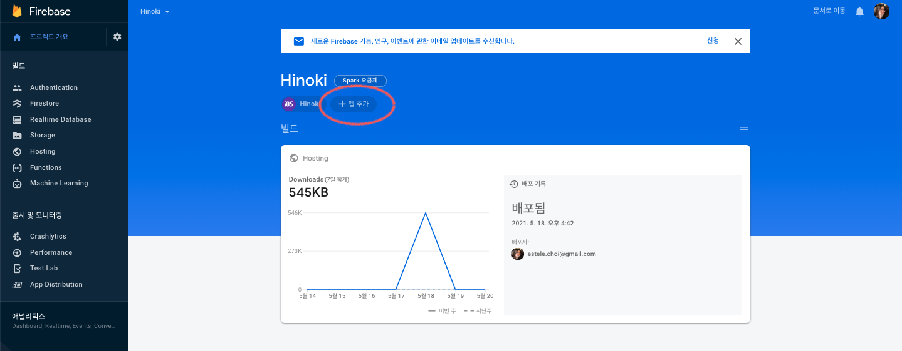
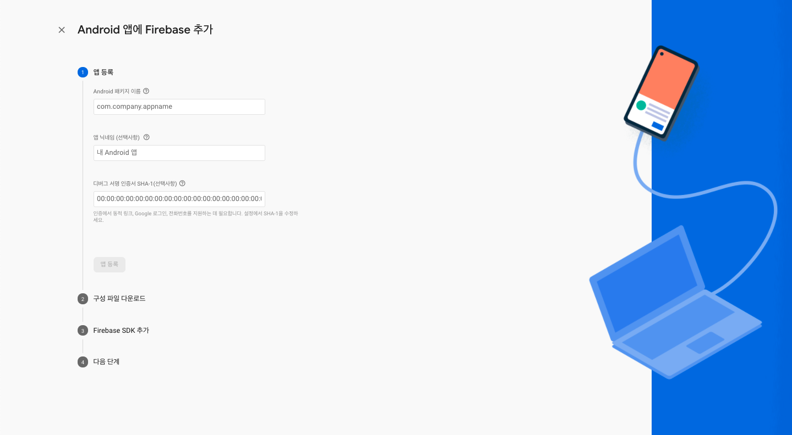
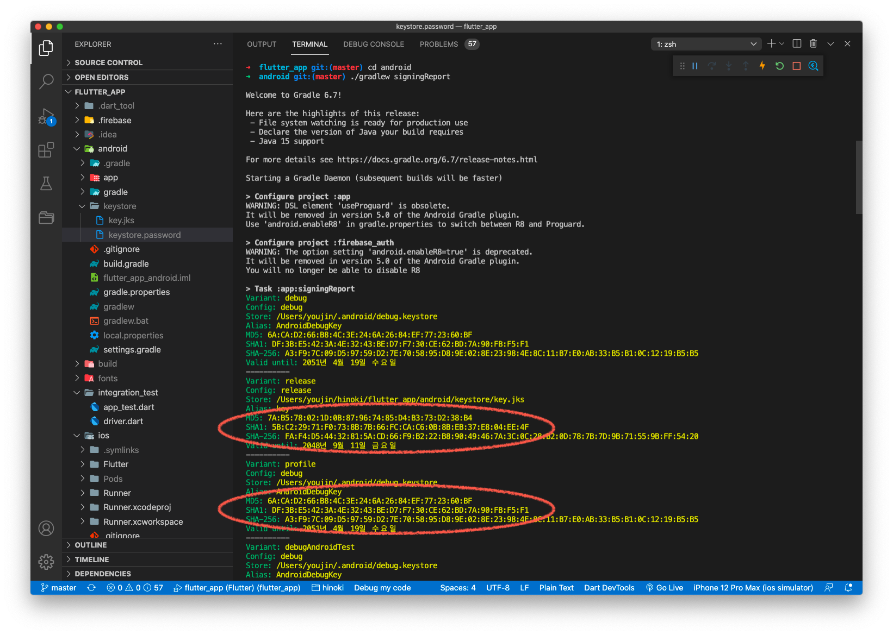
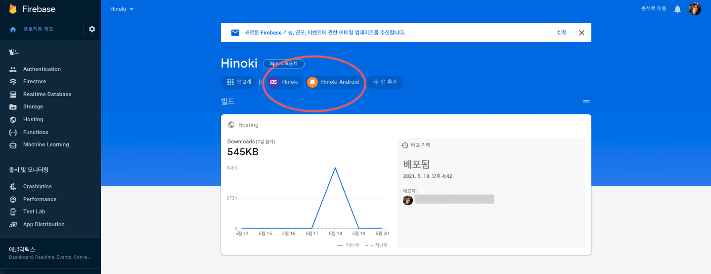
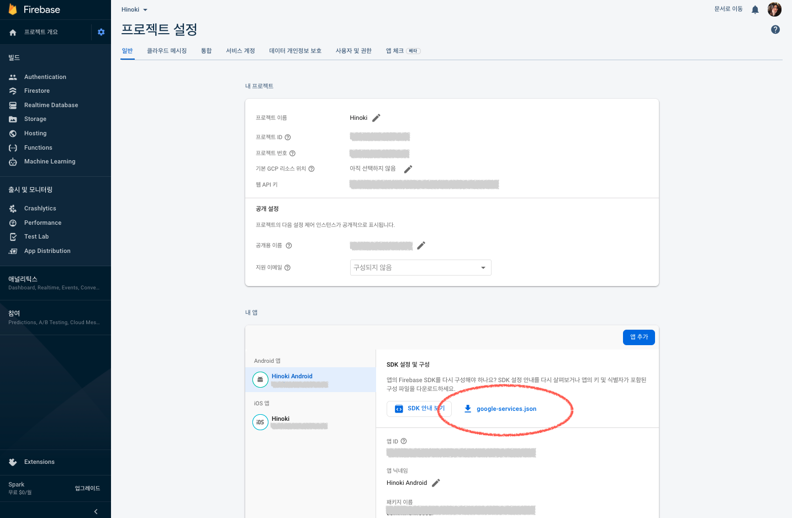
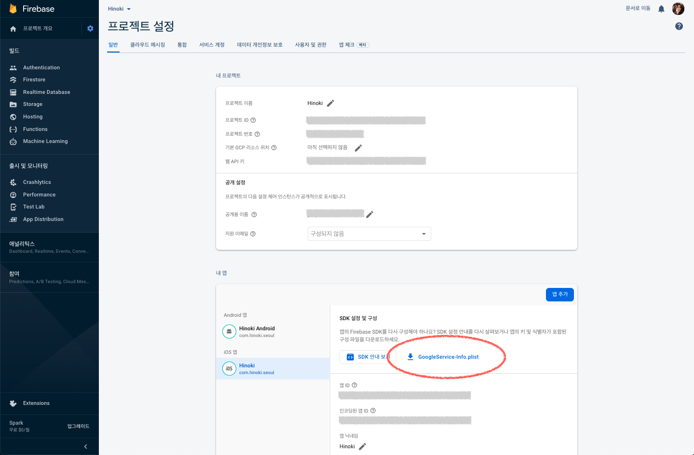
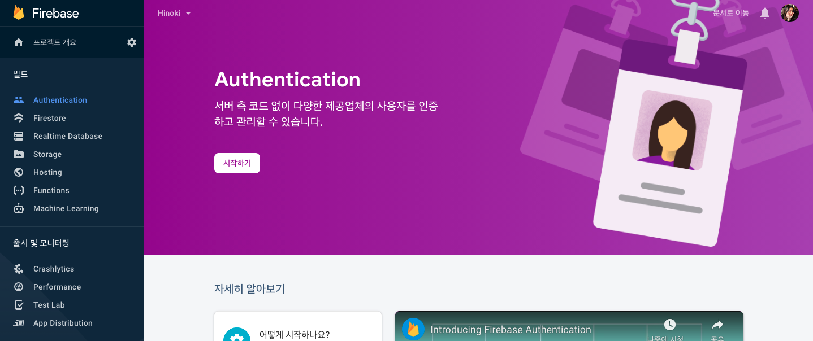
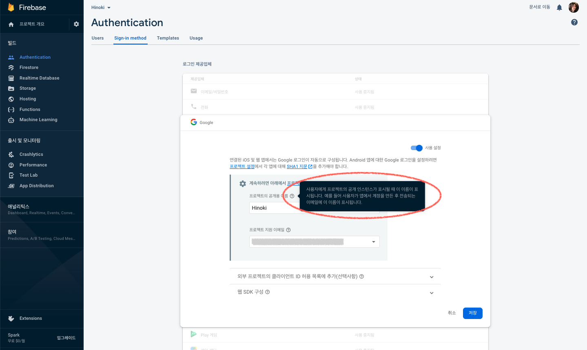
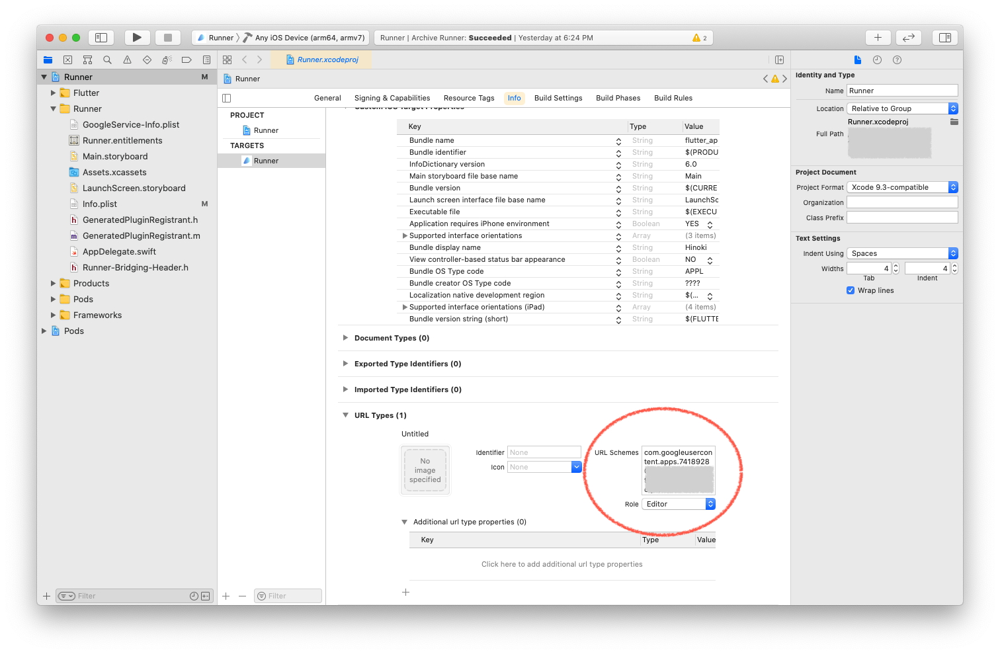

# Flutter 앱에서 Firebase를 사용하여 Sign in with Google 구현하기

<br>

1. 선행 작업하기 : Android/iOS 앱 ID 가져오기
2. Firebase 프로젝트 생성하기
3. Firebase에 Android/iOS 앱 등록하기
4. Flutter 프로젝트에 Android/iOS용 Firebase 구성 파일 추가하기
5. Firebase 콘솔에서 Google 로그인 사용 설정하기
6. Flutter 프로젝트에 FlutterFire(라이브러리) 추가하기
7. `google_sign_in` 라이브러리 추가하기
8. Sign in with Google 구현하기
9. `Podfile` 설정하기 : 플랫폼 및 버전 설정, `GoogleSignIn` 종속성 추가
10. Xcode에서 Google 로그인을 위한 URL 체계 추가하기
11. 테스트 및 Firebase 콘솔에서 사용자 조회하기

<br>

## 1. 선행 작업하기 : Android/iOS 앱 ID 가져오기

> Sign in with Apple 기능과는 달리, Google 로그인은 iOS 디바이스 사용자들도 종종 사용하므로 Android 앱과 iOS 앱에서의 구현을 모두 다루겠습니다.

<br>

Flutter 앱에서 Google 로그인을 구현하기에 앞서 Firebase 프로젝트와 Android/iOS 앱을 각각 연결하는 작업이 필요합니다. 이를 위해서는 고유한 Android 앱 ID와 iOS 앱 ID가 필요하고요. iOS 앱을 연결하기 위한 선행 작업은 [Flutter 앱에서 Firebase를 사용하여 Sign in with Apple 구현하기](https://github.com/estellechoi/TIL/blob/master/docs/flutter/social_login.md#user-content-1-%EC%84%A0%ED%96%89-%EC%9E%91%EC%97%85%ED%95%98%EA%B8%B0) 문서를 참고하여 진행해주시고요, Android 앱 ID는 Flutter 프로젝트의 `/android/app/build.gradle` 파일에서 지정합니다. `defaultConfig` 섹션의 `applicationId` 값이 Android 앱의 ID가 됩니다.

```gradle
android {

    // ...

    defaultConfig {
        applicationId "com.hinoki.seoul"

        // ...
    }
}
```

<br>

Android 앱 ID 설정에 대한 자세한 내용은 [Flutter 프로젝트를 Android 앱으로 배포하기](https://github.com/estellechoi/TIL/blob/master/docs/flutter/deploy_android.md) 문서의 [빌드 구성 검토하기](https://github.com/estellechoi/TIL/blob/master/docs/flutter/deploy_android.md#user-content-5-%EB%B9%8C%EB%93%9C-%EA%B5%AC%EC%84%B1-%EA%B2%80%ED%86%A0%ED%95%98%EA%B8%B0) 섹션을 참고하거나, [애플리케이션 ID 설정](https://developer.android.com/studio/build/application-id) 공식문서를 확인하세요.

<br>

## 2. Firebase 프로젝트 생성하기

Google [Firebase 콘솔](https://console.firebase.google.com/u/0/)에서 `프로젝트 만들기` 버튼을 클릭하여 프로젝트를 생성합니다. [Flutter 앱에서 Firebase를 사용하여 Sign in with Apple 구현하기](https://github.com/estellechoi/TIL/blob/master/docs/flutter/social_login.md) 문서의 [2. Firebase 프로젝트 생성하기](https://github.com/estellechoi/TIL/blob/master/docs/flutter/social_login.md#user-content-2-firebase-%ED%94%84%EB%A1%9C%EC%A0%9D%ED%8A%B8-%EC%83%9D%EC%84%B1%ED%95%98%EA%B8%B0) 섹션을 참고하여 동일하게 진행합니다.

<br>

## 3. Firebase에 Android/iOS 앱 등록하기

### 1) Android 앱 등록

Firebase 프로젝트 메인페이지에서 아래 스크린샷에 표시한 `앱 추가` 버튼을 클릭해서 Android 앱 등록을 시작해주세요.

<br>



<br>
<br>

그 다음 나타나는 화면의 폼 양식을 작성하고 `앱 등록` 버튼을 클릭합니다. 각 항목은 아래를 참고하여 작성하세요.

<br>



<br>
<br>

- `Android 패키지 이름` : Flutter 프로젝트의 `build.gradle` 파일에 지정한 Android 앱의 ID를 입력합니다.

- `앱 닉네임` : Firebase 콘솔에서 사용하는 편의용 앱 이름입니다.

- `디버그 서명 인증서 SHA-1` : Google 로그인 등 Google 서비스를 사용하기위해 필요합니다. Firebase OAuth2 클라이언트와 API 키를 생성하는데 앱 서명 인증서의 [SHA-1(Secure Hash Algorithm 1)](https://en.wikipedia.org/wiki/SHA-1) 지문값(Fingerprint)가 사용되기 때문입니다. Android 앱 배포 단계에서는 디버그용/배포용 SHA-1 지문값이 모두 필요하고요, 그 중 디버그용 지문값을 이 항목에 입력하면 됩니다.

<br>

앱 서명 인증서는 [Flutter 프로젝트를 Android 앱으로 배포하기](https://github.com/estellechoi/TIL/blob/master/docs/flutter/deploy_android.md#user-content-2-%EC%95%B1-%EC%84%9C%EB%AA%85%ED%95%98%EA%B8%B0) 문서의 앱 서명하기 섹션을 참고하여 생성해주세요. 앱 서명 인증서가 준비되었다면 바로 아래의 두 섹션 중 하나를 참고하거나, [Authenticating Your Client](https://developers.google.com/android/guides/client-auth) 문서를 참고하여 인증서의 SHA-1 지문값을 가져옵니다.

<br>

#### 1-1) `signingReport`를 사용하여 서명 인증서의 SHA-1 지문값 가져오기

Flutter 프로젝트의 `/android/gradlew` 파일이 있는 경로로 이동한 후 `signingReport` 명령어를 사용하여 디버그용/배포용 SHA-1 지문값을 가져올 수 있습니다.

<br>

`android/` 경로로 이동하신 후,

```
cd android
```

<br>

아래 명령어를 실행합니다.

```
./gradlew signingReport
```

<br>

아래 스크린샷에 표시된 두 부분의 `SHA1` 값이 우리가 필요한 값입니다.



<br>
<br>

#### 1-2) Keytool을 사용하여 서명 인증서의 SHA-1 지문값 가져오기

또는 Android Keystore가 위치한 경로에서 아래의 `keytool` 명령어를 사용하여 보유한 인증서의 SHA-1 지문값을 가져올 수 있습니다. 디버그용/배포용 2개 지문값이 모두 필요합니다. [Authenticating Your Client](https://developers.google.com/android/guides/client-auth) 문서와 StackOverflow의 [Generate SHA-1 for Flutter/React-Native/Android-Native app](https://stackoverflow.com/questions/51845559/generate-sha-1-for-flutter-react-native-android-native-app) 페이지가 도움이 되었습니다.

<br>

- 디버그용 인증서 지문값 가져오기

```
keytool -list -v -alias androiddebugkey -keystore ~/.android/debug.keystore
```

<br>

- 배포용 인증서 지문값 가져오기

```
keytool -list -v -alias <your-key-name> -keystore <path-to-production-keystore>
```

<br>

### 2) iOS 앱 등록

iOS 앱 등록은 [Firebase에 iOS 앱 등록하기](user-content-3-firebase에-ios-앱-등록하기)를 참고하여 진행해주세요. Firebase 프로젝트 메인페이지로 돌아가면 아래와 같이 앱이 등록된 것을 확인할 수 있습니다.

<br>



<br>

## 4. Flutter 프로젝트에 Android/iOS용 Firebase 구성 파일 추가하기

이제 Firebase 프로젝트에 각각 등록한 Android/iOS 앱과 개발중인 Flutter 프로젝트를 연결하면 됩니다. 메인페이지에서 위에서 확인한 앱 아이콘을 클릭, 다시 톱니바퀴 아이콘을 클릭하여 프로젝트 설정 페이지로 이동합니다. 그 다음 아래 스크린샷을 참고하여 Android 앱용 구성 파일 `google-service.json`과 iOS 앱용 구성 파일 `GoogleService-Info.plist`를 각각 다운로드합니다.

<br>



<br>
<br>



<br>
<br>

그 다음, Android 앱 구성 파일 `google-service.json`을 Flutter 프로젝트의 `/android/app/` 경로에 추가합니다. iOS 앱 구성 파일 `GoogleService-Info.plist`는 `ios/Runner.xcworkspace` 파일을 실행하여 Xcode를 열고 Xcode UI를 사용하여 추가하는 것이 중요합니다. [Flutter 프로젝트에 Firebase 구성 파일 추가하기](https://github.com/estellechoi/TIL/blob/master/docs/flutter/social_login.md#user-content-4-flutter-%ED%94%84%EB%A1%9C%EC%A0%9D%ED%8A%B8%EC%97%90-firebase-%EA%B5%AC%EC%84%B1-%ED%8C%8C%EC%9D%BC-%EC%B6%94%EA%B0%80%ED%95%98%EA%B8%B0)를 참고하여 추가합니다.

<br>

## 5. Firebase 콘솔에서 Google 로그인 사용 설정하기

다시 Firebase 콘솔의 프로젝트 관리 페이지로 돌아옵니다. 왼쪽 메뉴바에서 Authentication 메뉴를 클릭하여 이동한 후 `시작하기` 버튼을 클릭합니다.

<br>



<br>
<br>

그 다음 `Sign-in method` 탭의 로그인 제공업체 목록에서 `Google`을 찾아 클릭하세요. 그럼 아래와 같은 창이 나타납니다. 사용 설정을 활성화하고, 나타나는 두 항목을 작성한 후 `저장` 버튼을 클릭하여 완료합니다.

- `프로젝트의 공개용 이름` : 안내와 같이 사용자에게 공개되는 이름입니다.

- `프로젝트 지원 이메일` : 사용자에게 공개되는 관리자 이메일입니다.

<br>



<br>
<br>

## 6. Flutter 프로젝트에 FlutterFire(라이브러리) 추가하기

이제 Flutter 프로젝트에 필요한 라이브러리들을 설치하고 라이브러리를 사용하여 Google 로그인을 구현하면 됩니다. 이 단계는 [Flutter 프로젝트에 FlutterFire(라이브러리) 추가하기](https://github.com/estellechoi/TIL/blob/master/docs/flutter/social_login.md#user-content-9-flutter-%ED%94%84%EB%A1%9C%EC%A0%9D%ED%8A%B8%EC%97%90-flutterfire%EB%9D%BC%EC%9D%B4%EB%B8%8C%EB%9F%AC%EB%A6%AC-%EC%B6%94%EA%B0%80%ED%95%98%EA%B8%B0)를 참고하여 진행합니다.

<br>

## 7. `google_sign_in` 라이브러리 추가하기

Flutter 프로젝트 코드에서 Google 로그인 구현은 외부 라이브러리를 사용해야합니다. [FlutterFire 공식문서](https://firebase.flutter.dev/docs/auth/social#google)에서는 [`google_sign_in`](https://pub.dev/packages/google_sign_in) 라이브러리를 사용합니다. `pubspec.yaml` 파일에 라이브러리를 추가하여 설치해주세요.

<br>

## 8. Sign in with Google 구현하기

### 1) `main()` 메소드에서 Firebase 초기화하기

`main.dart` 파일의 `main()` 메소드에서 아래와 같이 `WidgetsFlutterBinding.ensureInitialized()`를 호출하고, 그 다음 `Firebase.initializeApp()`을 호출합니다. `WidgetsFlutterBinding.ensureInitialized()`는 비동기 작업 이후에 `runApp()`을 실행해야하는 경우 추가하는 코드입니다. Flutter 엔진과 위젯 바인딩을 미리 완료시키는 역할을 합니다.

```dart
import 'package:firebase_core/firebase_core.dart';
import 'package:firebase_auth/firebase_auth.dart';

Future<void> main() async {
  WidgetsFlutterBinding.ensureInitialized();
  await Firebase.initializeApp();
  runApp(MyApp());
}
```

<br>

### 2) `AuthProvider` 만들기

이제 Firebase 인증 메소드를 모아둘 `AuthProvider` 클래스를 만듭니다. `auth_provider.dart` 파일을 생성하시고요, [공식문서](https://firebase.flutter.dev/docs/auth/social#google)의 예제코드를 참고하여 작성합니다. `main.dart`에서 `AuthProvider` 클래스의 변화를 감지할 수 있도록 `ChangeNotifier`를 [`mixins`](https://dart.dev/guides/language/language-tour#adding-features-to-a-class-mixins)로 추가합니다.

<br>

```dart
import 'package:google_sign_in/google_sign_in.dart';

class AuthProvider with ChangeNotifier {
  final FirebaseAuth firebaseAuth;

  AuthProvider(this.firebaseAuth);

  Stream<User?> get authStateChanges => firebaseAuth.authStateChanges();

  // Signin with google
  Future<UserCredential?> signinWithGoogle() async {
    try {
      // Google 로그인 후 반환된 `GoogleSignInAccount` 객체를 가져옵니다.
      final GoogleSignInAccount? googleUser = await GoogleSignIn().signIn();

      // 인증 상세정보를 담은 `GoogleSignInAuthentication` 객체를 가져옵니다.
      final GoogleSignInAuthentication? googleAuth =
          await googleUser?.authentication;

      if (googleAuth == null) return null;

      // `OAuthCredential` 객체를 생성합니다.
      final OAuthCredential credential = GoogleAuthProvider.credential(
          accessToken: googleAuth.accessToken, idToken: googleAuth.idToken);

      // `oauthCredential` 객체를 사용하여 Firebase에 로그인 시키고
      // 결과 정보를 담은 `UserCredential` 객체를 가져옵니다.
      final UserCredential authResult =
          await FirebaseAuth.instance.signInWithCredential(credential);

      return authResult;
    } catch (e) {
      print(e);
      return null;
    }
  }

  // Signout
  Future signout() async {
    await firebaseAuth.signOut();
  }
}

```

<br>

### 3) Sign in with Google 버튼 위젯 구현하기

버튼을 클릭하면 `AuthProvider`의 `signinWithGoogle()` 메소드가 호출되도록 위젯을 구현합니다. `provider` 라이브러리를 사용할건데요, `Provider`는 스코프(Scope) 기반으로 작동하기 때문에 특정 라우트가 아닌 `main.dart`의 최상위 위젯에 추가해야합니다. 그리고 필요한 경우에 `BuildContext`에서 가져와 사용하는 방식이죠. `main.dart` 파일 작업은 뒤에서 하도록 하고, 이 단계에서는 `AuthProvider` 인스턴스를 직접 만들어 사용하지 않고 `BuildContext`에서 이미 존재하는 인스턴스를 가져와 사용하도록 작성하면 됩니다.

```dart
import 'package:flutter/material.dart';
import 'package:provider/provider.dart';
import 'package:firebase_auth/firebase_auth.dart';
import '../../utils/auth_provider.dart';
import './../buttons/hinoki_button.dart';

class SignInWithGoogleButton extends StatefulWidget {
  final ValueChanged<UserCredential?> onFinished;

  SignInWithGoogleButton(
      {required this.onFinished});

  @override
  _SignInWithGoogleButtonState createState() => _SignInWithGoogleButtonState();
}

class _SignInWithGoogleButtonState extends State<SignInWithGoogleButton> {
  Future signinWithGoogle(BuildContext context) async {
    final UserCredential? authResult =
        await context.read<AuthProvider>().signinWithGoogle();

    widget.onFinished(authResult);
  }

  @override
  Widget build(BuildContext context) {
    return HinokiButton(
        label: 'Sign in with Google',
        onPressed: () {
            signinWithGoogle(context);
        },
    );
  }
}
```

<br>

`HinokiButton`은 별도로 만들어둔 버튼 위젯입니다. 이제 `SignInWithGoogleButton` 버튼 위젯을 사용하면 됩니다.

<br>

### 4) 최상위 위젯에 `AuthProvider` 인스턴스 등록하기

[Flutter 앱에서 Firebase를 사용하여 Sign in with Apple 구현하기](https://github.com/estellechoi/TIL/blob/master/docs/flutter/social_login.md) 문서의 [최상위 위젯에 AuthProvider 인스턴스 등록하기](https://github.com/estellechoi/TIL/blob/master/docs/flutter/social_login.md#user-content-4-%EC%B5%9C%EC%83%81%EC%9C%84-%EC%9C%84%EC%A0%AF%EC%97%90-authprovider-%EC%9D%B8%EC%8A%A4%ED%84%B4%EC%8A%A4-%EB%93%B1%EB%A1%9D%ED%95%98%EA%B8%B0) 섹션을 참고하여 동일하게 진행합니다.

<br>

## 9. `Podfile` 설정하기 : 플랫폼 및 버전 설정, `GoogleSignIn` 종속성 추가

### 1) iOS 플랫폼 및 버전 설정하기

위 단계까지 마무리하고 Flutter 앱을 실행시키면 [CocoaPods](https://cocoapods.org/) 오류들이 나타날 수 있습니다. CocoaPods는 Xcode 프로젝트를 위한 의존성 매니저이고요, CocoaPods의 Podfile은 Xcode 프로젝트의 의존성을 명세하는 파일입니다. `Podfile`에 타겟 플랫폼을 명시하지 않았거나 FlutterFire 라이브러리를 사용하기 위한 iOS 버전 요구사항을 충족하지 않았기 때문입니다. [Podfile 설정하기](https://github.com/estellechoi/TIL/blob/master/docs/flutter/social_login.md#user-content-12-podfile-%EC%84%A4%EC%A0%95%ED%95%98%EA%B8%B0)를 참고하여 플랫폼을 명시하고 FlutterFire 요구 버전을 맞춥니다.

<br>

### 2) `GoogleSignIn` 종속성 추가하기

> 이 단계는 필요한 경우에만 진행합니다. 일반적으로 라이브러리를 통해 자동으로 진행되기 때문에 직접 추가하지 않아도 됩니다.

<br>

[iOS 앱에 Google 로그인 통합 시작](https://developers.google.com/identity/sign-in/ios/start-integrating) 문서에 따르면, `GoogleSignIn` 종속성이 요구됩니다. `Podfile` 파일을 열고 다음을 추가합니다. 이후 앱을 실행하면 `pod install` 명령어가 자동으로 실행되면서 수정한 내용이 반영됩니다.

```
pod 'GoogleSignIn'
```

<br>

## 10. Xcode에서 Google 로그인을 위한 URL 체계 추가하기

iOS 앱에서 Google 로그인을 사용하기 위한 설정이 하나 더 남았습니다. `ios/Runner.xcworkspace` 파일을 실행하여 Xcode를 열고 맞춤 URL 체계를 추가해야합니다. 이 단계를 건너뛰고 Google 로그인을 시도하면 아래와 같이 `PlatformException` 오류가 발생합니다. 표시된 내용대로 Flutter 프로젝트의 iOS 앱이 필요한 URL 체계를 지원하지 않아서 발생하는 오류입니다.

```
PlatformException(google_sign_in, Your app is missing support for the following URL schemes: com.googleusercontent.apps.741892806279-8slqnje3uiv99pfvk9i04umdkqkcqddt, NSInvalidArgumentException, null)
```

<br>

Xcode에서 왼쪽 상단의 `Runner`를 클릭하고, `Info` 탭으로 이동한 후 URL Types 섹션에서 URL 체계를 추가합니다. URL 체계는 반전된 형태의 OAuth 클라이언트 ID입니다.

> URL 체계를 바로 확인할 수 있는 곳 ?

<br>



<br>
<br>

[iOS 앱에 Google 로그인 통합 시작](https://developers.google.com/identity/sign-in/ios/start-integrating) 문서와 StackOverflow의 ['Your app is missing support for the following URL schemes: com .googleusercontent.apps.xxx'](https://stackoverflow.com/questions/50960601/your-app-is-missing-support-for-the-following-url-schemes-com-googleuserconte) 페이지가 도움이 되었습니다.

<br>

## 11. 테스트 및 Firebase 콘솔에서 사용자 조회하기

이제 Android/iOS Emulator를 사용하여 앱을 실행하고 테스트해보세요.

> 이미지 추가하기 ..

<br>
<br>
<br>

---

### References

- [Social Authentication | FlutterFire](https://firebase.flutter.dev/docs/auth/social)
- [Google Sign In With Flutter](https://medium.com/flutterdevs/google-sign-in-with-flutter-8960580dec96)
