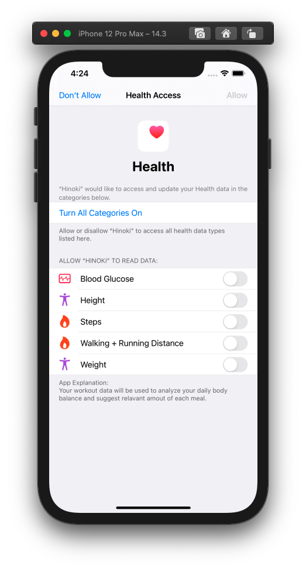

# Flutter 앱에서 Apple HealthKit, Google Fit 데이터 가져오기

<br>

## 1. Apple HealthKit 셋업하기

Apple [HealthKit](https://developer.apple.com/documentation/healthkit)을 사용하여 사용자의 건강 데이터를 조회하고 추가할 수 있습니다. 이 문서를 참고하여 HealthKit 사용 설정을 완료한 후 [`health`](https://pub.dev/packages/health) 라이브러리를 사용하여 구현하면 됩니다.

<br>

> iOS 네이티브 앱은 [HealthKit 프레임워크](https://developer.apple.com/documentation/healthkit/about_the_healthkit_framework)를 사용하여 구현합니다.

<br>

### 1) 선행 작업하기

Flutter 앱에서 Apple 서비스를 사용하려면 [Apple Developer Program 등록하기](https://github.com/estellechoi/TIL/blob/master/docs/flutter/deploy.md#user-content-1-apple-developer-program-%EB%93%B1%EB%A1%9D%ED%95%98%EA%B8%B0)를 참고하여 개발자 계정으로 등록한 후 앱 ID를 등록해야합니다. [Apple Developer에서 고유 앱 번들 ID 등록](https://github.com/estellechoi/TIL/blob/master/docs/flutter/deploy.md#user-content-1-%EA%B3%A0%EC%9C%A0-%EB%B2%88%EB%93%A4-id-%EB%93%B1%EB%A1%9D)을 참고하여 앱 ID를 등록하세요.

<br>

### 2) 앱 ID에 HealthKit 추가

새로 앱 ID를 생성하는 경우라면, 앱을 등록하는 단계에서 Capabilites 목록 중 HealthKit 항목을 ENABLED로 체크하시고요, 이미 앱 ID가 있다면 [Apple Developer > Identifiers](https://developer.apple.com/account/resources/identifiers/list) 페이지에서 앱 ID를 선택하여 편집 화면으로 이동한 후 해당 항목을 체크해주세요.

<br>


<br>
<br>

### 3) Xcode 프로젝트 설정에 HealthKit 추가

Xcode를 사용하여 Flutter 프로젝트에도 HealthKit 사용 설정을 해야합니다. `ios/Runner.xcworkspace` 파일을 실행하여 Xcode를 열고, 좌측 상단의 `Runner`를 클릭하여 프로젝트 설정을 시작합니다.

<br>


<br>
<br>

그 다음, `Signing & Capabilities` 탭으로 이동한 후 상단의 `+ Capability` 버튼을 클릭하고, 나타나는 창에서 `HealthKit`을 찾아 선택합니다.

<br>


<br>


<br>
<br>

그럼 스크린샷과 같이 HealthKit 서비스가 Capabilities 목록에 추가됩니다. `Clinical Health Records` 체크박스는 말 그대로 사용자의 임상 기록 데이터에 접근할지를 묻는 항목입니다. 이 데이터를 사용하지 않으면서 해당 항목을 체크한 상태로 앱을 제출하면 앱 심사를 통과하지 못할 수 있다는 점에 유의하세요.

<br>


<br>
<br>

### 4) Clinical Health Records 사용 설정

> 사용자 임상 기록을 사용하지 않는다면 이 단계는 건너뜁니다. 이 단계를 진행한다면, [Accessing Health Records](https://developer.apple.com/documentation/healthkit/samples/accessing_health_records) 문서에서 자세한 내용을 확인하세요.

<br>

사용자 임상 기록은 민감한 데이터이기 때문에 추가적인 셋업 절차가 요구됩니다.

- 2-1) Xcode에서 `Clinical Health Records` 항목에 체크
- 2-2) `Health Records Usage` 문구 제공

<br>

#### 4-1) Xcode에서 `Clinical Health Records` 항목에 체크

`Clinical Health Records` 항목에 체크하세요.

<br>


<br>
<br>

#### 4-2) `Health Records Usage` 문구 제공

그 다음, 사용자의 임상 기록을 어떤 목적으로 사용할 것인지 알리는 `Health Records Usage` 문구를 제공해야 합니다. 이 문구를 잘 작성하면 사용자가 앱을 통해 무엇을 얻을 수 있는지 알리고, 임상 데이터를 공유하도록 설득할 수 있습니다. `Health Records Usage` 문구는 Xcode 좌측 트리의 `info.plist` 파일을 선택하여 열고 추가할 수 있습니다. Flutter 프로젝트에서 `ios/Runner/info.plist` 파일을 열어 직접 태그를 수정해도 되지만 , Xcode UI를 사용하는 것이 빠르고 정확합니다.

<br>

`Information Property List` 항목 위에 커서를 두면 `+` 버튼이 나타나고요, 이 버튼을 클릭하여 아래의 키(Key) 항목을 추가한 후 해당 항목에 대한 문구를 입력하면 됩니다.

- `Privacy - Health Records Usage Description`

<br>


<br>


<br>
<br>

#### 4-3) `HKClinicalTypeIdentifier`를 사용하여 권한 요청

이제 프로젝트 코드에서 사용자의 임상 데이터를 요청하기 전에[`HKClinicalTypeIdentifier`](https://developer.apple.com/documentation/healthkit/hkclinicaltypeidentifier)를 사용하여 권한을 요청해야합니다.

<br>

### 5) `info.plist` 파일에 사용자 데이터 사용에 대한 안내 문구 제공

앱에서 사용자의 건강 데이터를 사용하려면 사용자로부터 동의를 받아야합니다. 이때 사용자에게 표시되는 안내 문구를 직접 제공합니다. 사용자의 건강 데이터를 어떤 목적으로 사용할 것인지 알리는 목적입니다. Clinical Health Records 사용 설정 단계를 진행했다면, 같은 방법으로 아래의 2개 항목을 추가합니다. 이 문구를 잘 작성하면 사용자가 앱을 통해 무엇을 얻을 수 있는지 알리고, 건강 데이터를 공유하도록 설득할 수 있습니다.

- `Privacy - Health Share Usage Description`
- `Privacy - Health Update Usage Description`

<br>

Clinical Health Records 사용 설정 단계를 건너뛰었다면, Xcode 좌측 트리의 `info.plist` 파일을 선택하여 열고 문구를 추가합니다. `Information Property List` 항목 위에 커서를 두면 `+` 버튼이 나타나고요, 이 버튼을 클릭하여 해당하는 항목들을 추가한 후 각 항목에 대한 문구를 입력하면 됩니다.

<br>


<br>
<br>

또는 다른 에디터로 Flutter 프로젝트를 열고 `ios/Runner/info.plist` 파일을 직접 수정해도 됩니다.

```
<key>NSHealthShareUsageDescription</key>
<string>We will sync your data with the Apple Health app to give you better insights</string>
<key>NSHealthUpdateUsageDescription</key>
<string>We will sync your data with the Apple Health app to give you better insights</string>
```

<br>

> HealthKit을 비롯하여 대부분의 Apple 서비스를 이용하려면 UI 요구사항을 충족해야합니다. `info.plist` 파일에 설정하는 값들이고요, [UIRequiredDeviceCapabilities](https://developer.apple.com/library/archive/documentation/General/Reference/InfoPlistKeyReference/Articles/iPhoneOSKeys.html#//apple_ref/doc/plist/info/UIRequiredDeviceCapabilities) 목록을 참고하여 필요한 UI 요구사항을 충족하는지 확인해야합니다.

<br>

### 6) `Health` 라이브러리를 사용하여 건강 데이터 가져오기

> Swift나 Objective-C를 이용하여 iOS 앱을 개발중이라면 HealthKit 프레임워크를 사용하여 필요한 기능을 구현하면 됩니다. 공식문서 [About the HealthKit Framework](https://developer.apple.com/documentation/healthkit/about_the_healthkit_framework)를 확인한 후 진행해주세요.

<br>

Flutter 프로젝트에서는 [`health`](https://pub.dev/packages/health) 라이브러리를 사용합니다. 라이브러리에서 제공하는 [예제 코드](https://github.com/cph-cachet/flutter-plugins/blob/master/packages/health/example/lib/main.dart)를 참고하여 구현했습니다.

```dart
import 'package:health/health.dart';

Future<List<HealthDataPoint>?> fetchAppleHealthKit() async {
  final HealthFactory healthFactory = HealthFactory();

  // 가져올 데이터 타입을 리스트에 담습니다.
  final List<HealthDataType> types = [
    HealthDataType.STEPS,
    HealthDataType.WEIGHT,
    HealthDataType.HEIGHT,
    HealthDataType.BLOOD_GLUCOSE,
    HealthDataType.DISTANCE_WALKING_RUNNING,
  ];

  // 권한을 요청하고 `bool` 타입의 결과값을 반환받습니다.
  final bool isAccessGranted = await healthFactory.requestAuthorization(types);

  if (isAccessGranted) {
    try {
      // 데이터를 가져올 날짜 범위를 지정합니다.
      final DateTime startDate = DateTime(2020, 11, 07, 0, 0, 0);
      final DateTime endDate = DateTime(2025, 11, 07, 23, 59, 59);

      // 위에서 지정한 데이터들을 가져옵니다.
      List<HealthDataPoint> healthData =
          await healthFactory.getHealthDataFromTypes(startDate, endDate, types);

      // 중복을 제거합니다.
      return HealthFactory.removeDuplicates(healthData);
    } catch (e) {
      print(e);
      return null;
    }
  }

  return null;
}
```

<br>

이제 앱을 다시 실행하고 `fetchAppleHealthKit()` 메소드를 실행하면 아래와 같이 사용자에게 공유할 데이터를 지정하도록 하는 OS UI가 나타납니다. 사용자가 공유할 데이터를 지정한 후 `Allow` 버튼을 클릭하면 데이터 가져오기가 완료됩니다.

<br>



<br>
<br>

---

### References

- [Setting Up HealthKit | Apple Developer](https://developer.apple.com/documentation/healthkit/setting_up_healthkit)
- [Accessing Health Records | Apple Developer](https://developer.apple.com/documentation/healthkit/samples/accessing_health_records)
- [Apple Health Records: Everything you need to know!](https://www.imore.com/health-records)
- [Apple Health Records](https://blog.usejournal.com/apple-health-records-cbb98551bbb9)
