# Flutter 앱에서 Apple HealthKit, Google Fit, Samsung Health 데이터 가져오기

<br>

1. Apple HealthKit 셋업하고 데이터 가져오기
2. Google Fit 셋업하고 데이터 가져오기
3. Samsung Health 셋업하고 데이터 가져오기

<br>

## 1. Apple HealthKit 셋업하고 데이터 가져오기

Apple [HealthKit](https://developer.apple.com/documentation/healthkit)을 사용하여 사용자의 건강 데이터를 조회하고 추가할 수 있습니다. 이 문서를 참고하여 HealthKit 사용 설정을 완료한 후 [`health`](https://pub.dev/packages/health) 라이브러리를 사용하여 구현하면 됩니다.

<br>

> iOS 네이티브 앱은 [HealthKit 프레임워크](https://developer.apple.com/documentation/healthkit/about_the_healthkit_framework)를 사용하여 구현합니다.

<br>

### 1) 선행 작업하기

Flutter 앱에서 Apple 서비스를 사용하려면 [Apple Developer Program 등록하기](https://github.com/estellechoi/TIL/blob/master/docs/flutter/deploy.md#user-content-1-apple-developer-program-%EB%93%B1%EB%A1%9D%ED%95%98%EA%B8%B0)를 참고하여 개발자 계정으로 등록한 후 앱 ID를 등록해야합니다. [Apple Developer에서 고유 앱 번들 ID 등록](https://github.com/estellechoi/TIL/blob/master/docs/flutter/deploy.md#user-content-1-%EA%B3%A0%EC%9C%A0-%EB%B2%88%EB%93%A4-id-%EB%93%B1%EB%A1%9D)을 참고하여 앱 ID를 등록하세요.

<br>

### 2) 앱 ID에 HealthKit 추가

새로 앱 ID를 생성하는 경우라면, 앱을 등록하는 단계에서 Capabilites 목록 중 HealthKit 항목을 ENABLED로 체크하시고요, 이미 앱 ID가 있다면 [Apple Developer > Identifiers](https://developer.apple.com/account/resources/identifiers/list) 페이지에서 앱 ID를 선택하여 편집 화면으로 이동한 후 해당 항목을 체크해주세요.

<br>

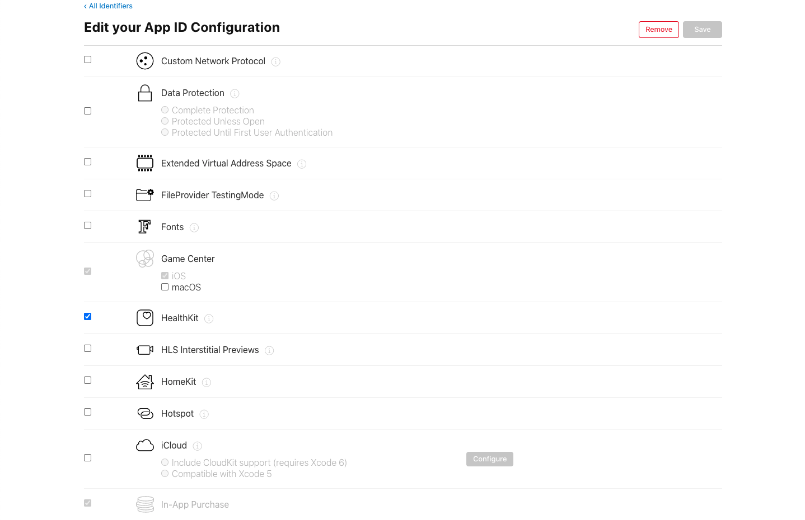

<br>
<br>

### 3) Xcode 프로젝트 설정에 HealthKit 추가

Xcode를 사용하여 Flutter 프로젝트에도 HealthKit 사용 설정을 해야합니다. `ios/Runner.xcworkspace` 파일을 실행하여 Xcode를 열고, 좌측 상단의 `Runner`를 클릭하여 프로젝트 설정을 시작합니다.

<br>

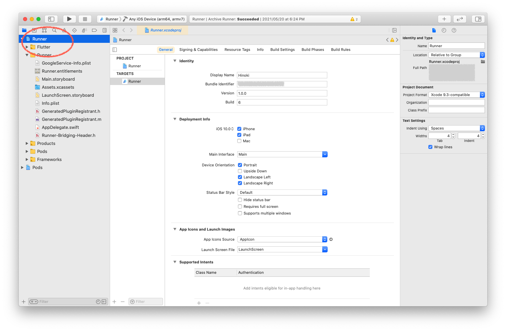

<br>
<br>

그 다음, `Signing & Capabilities` 탭으로 이동한 후 상단의 `+ Capability` 버튼을 클릭하고, 나타나는 창에서 `HealthKit`을 찾아 선택합니다.

<br>

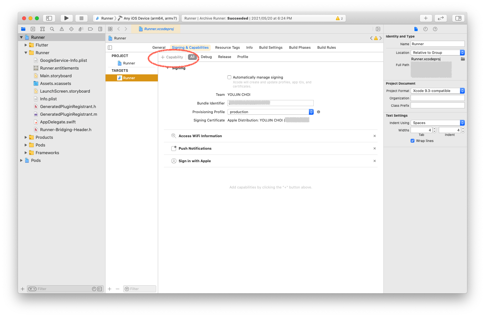

<br>

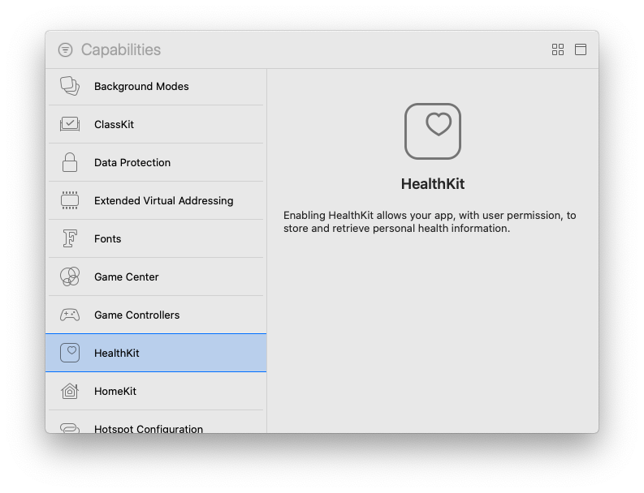

<br>
<br>

그럼 스크린샷과 같이 HealthKit 서비스가 Capabilities 목록에 추가됩니다. `Clinical Health Records` 체크박스는 말 그대로 사용자의 임상 기록 데이터에 접근할지를 묻는 항목입니다. 이 데이터를 사용하지 않으면서 해당 항목을 체크한 상태로 앱을 제출하면 앱 심사를 통과하지 못할 수 있다는 점에 유의하세요.

<br>

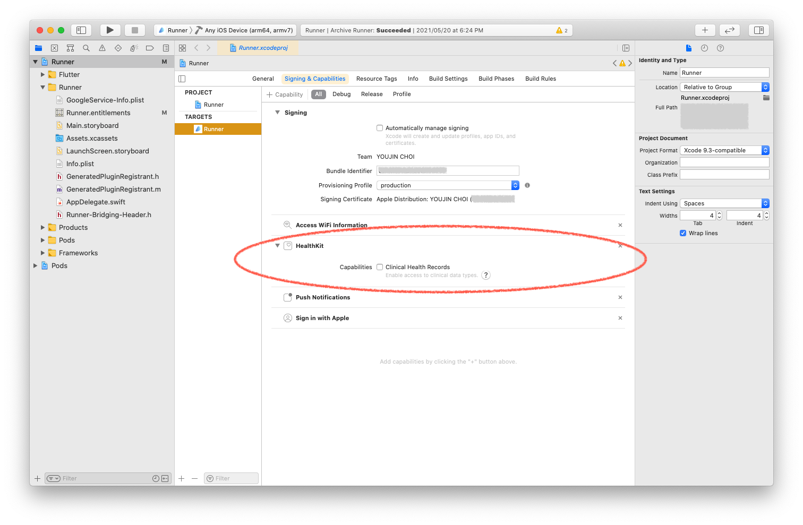

<br>
<br>

### 4) `Clinical Health Records` 사용 설정

사용자 임상 기록은 민감한 데이터이기 때문에 추가적인 셋업 절차가 요구됩니다. 사용자 임상 기록을 사용하지 않는다면 이 단계는 건너뜁니다. 이 단계를 진행한다면, [Accessing Health Records](https://developer.apple.com/documentation/healthkit/samples/accessing_health_records) 문서에서 자세한 내용을 확인하세요.

<br>

#### 4-1) Xcode에서 `Clinical Health Records` 항목에 체크

`Clinical Health Records` 항목에 체크하세요.

<br>

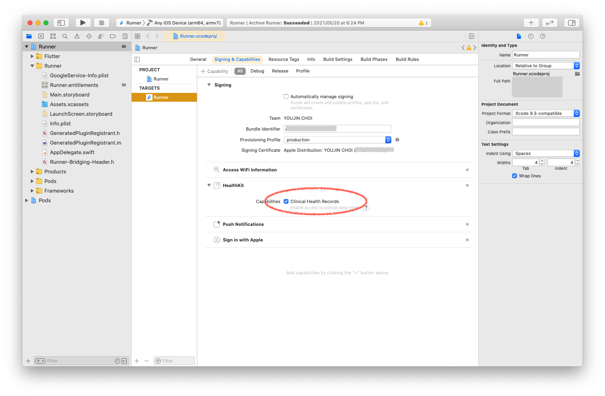

<br>
<br>

#### 4-2) `Health Records Usage` 문구 제공

그 다음, 사용자의 임상 기록을 어떤 목적으로 사용할 것인지 알리는 `Health Records Usage` 문구를 제공해야 합니다. 이 문구를 잘 작성하면 사용자가 앱을 통해 무엇을 얻을 수 있는지 알리고, 임상 데이터를 공유하도록 설득할 수 있습니다. `Health Records Usage` 문구는 Xcode 좌측 트리의 `info.plist` 파일을 선택하여 열고 추가할 수 있습니다. Flutter 프로젝트에서 `ios/Runner/info.plist` 파일을 열어 직접 태그를 수정해도 되지만 , Xcode UI를 사용하는 것이 빠르고 정확합니다.

<br>

`Information Property List` 항목 위에 커서를 두면 `+` 버튼이 나타나고요, 이 버튼을 클릭하여 아래의 키(Key) 항목을 추가한 후 해당 항목에 대한 문구를 입력하면 됩니다.

- `Privacy - Health Records Usage Description`

<br>

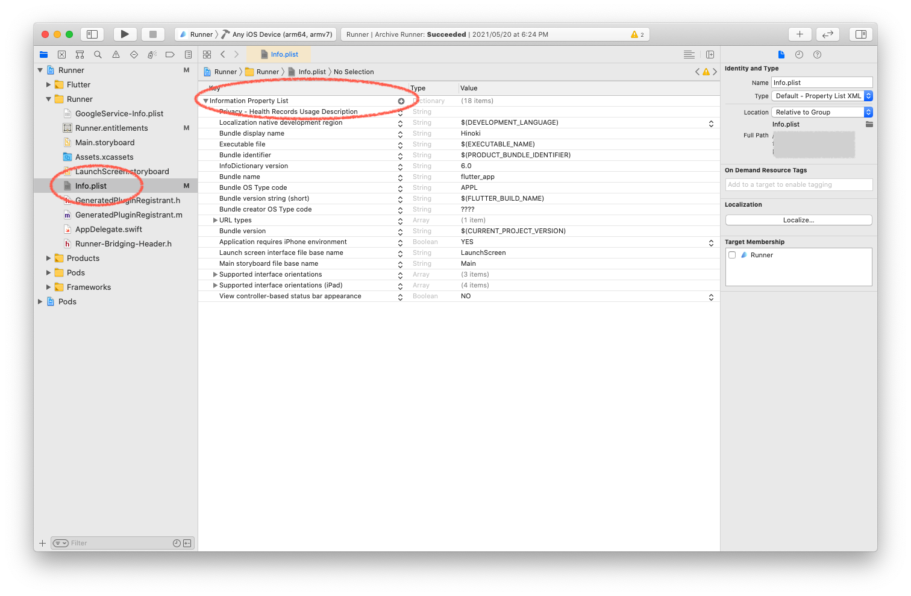

<br>

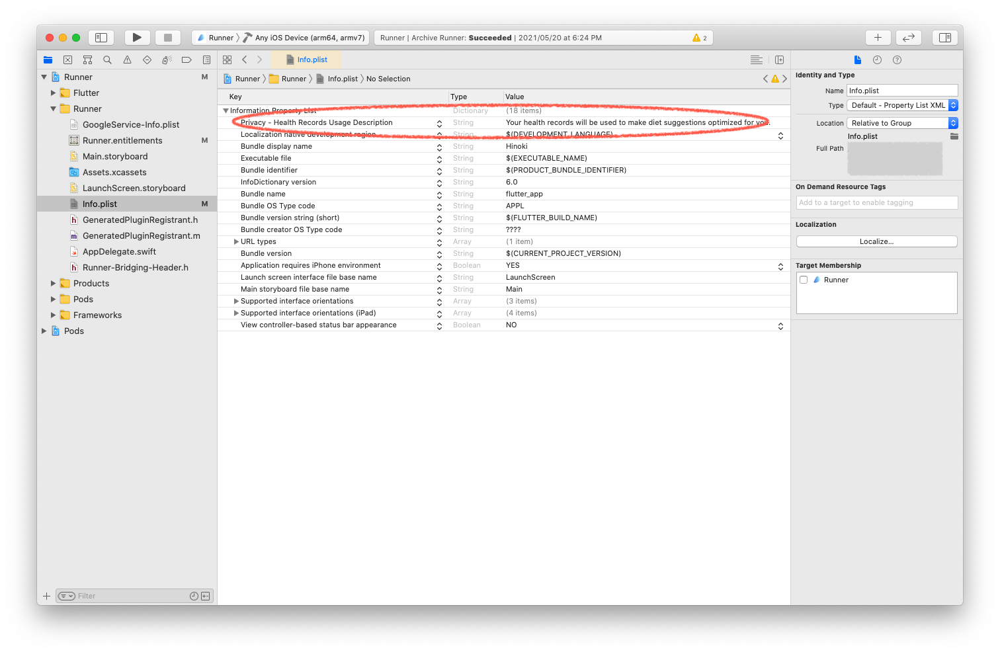

<br>
<br>

#### 4-3) `HKClinicalTypeIdentifier`를 사용하여 권한 요청

이제 프로젝트 코드에서 사용자의 임상 데이터를 요청하기 전에[`HKClinicalTypeIdentifier`](https://developer.apple.com/documentation/healthkit/hkclinicaltypeidentifier)를 사용하여 권한을 요청해야합니다.

<br>

### 5) `info.plist` 파일에 사용자 데이터 사용에 대한 안내 문구 제공

앱에서 사용자의 건강 데이터를 사용하려면 사용자로부터 동의를 받아야합니다. 이때 사용자에게 표시되는 안내 문구를 직접 제공합니다. 사용자의 건강 데이터를 어떤 목적으로 사용할 것인지 알리는 목적입니다. `Clinical Health Records` 사용 설정 단계를 진행했다면, 같은 방법으로 아래의 2개 항목을 추가합니다. 이 문구를 잘 작성하면 사용자가 앱을 통해 무엇을 얻을 수 있는지 알리고, 건강 데이터를 공유하도록 설득할 수 있습니다.

- `Privacy - Health Share Usage Description`
- `Privacy - Health Update Usage Description`

<br>

`Clinical Health Records` 사용 설정 단계를 건너뛰었다면, Xcode 좌측 트리의 `info.plist` 파일을 선택하여 열고 문구를 추가합니다. `Information Property List` 항목 위에 커서를 두면 `+` 버튼이 나타나고요, 이 버튼을 클릭하여 해당하는 항목들을 추가한 후 각 항목에 대한 문구를 입력하면 됩니다.

<br>

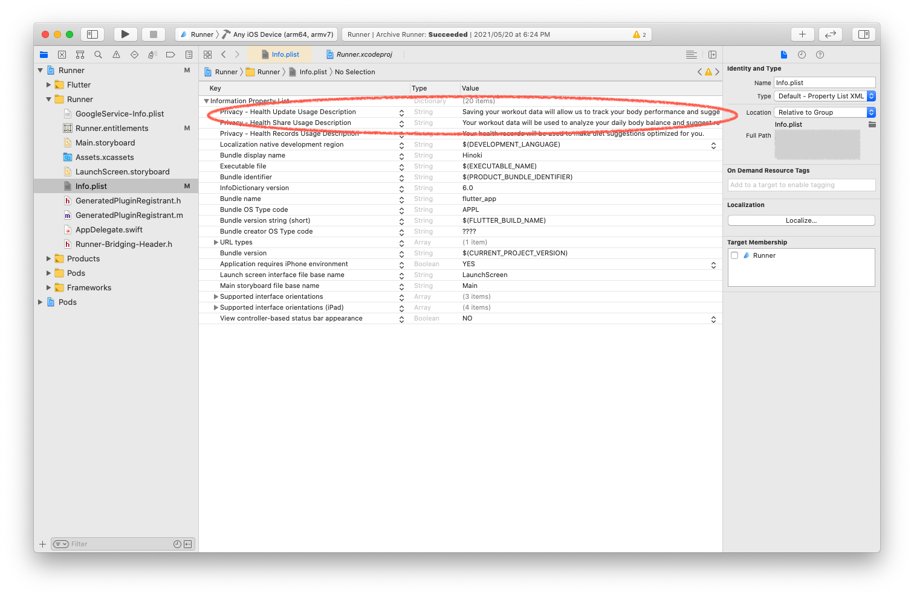

<br>
<br>

또는 다른 에디터로 Flutter 프로젝트를 열고 `ios/Runner/info.plist` 파일을 직접 수정해도 됩니다.

```
<key>NSHealthShareUsageDescription</key>
<string>We will sync your data with the Apple Health app to give you better insights</string>
<key>NSHealthUpdateUsageDescription</key>
<string>We will sync your data with the Apple Health app to give you better insights</string>
```

<br>

> HealthKit을 비롯하여 대부분의 Apple 서비스를 이용하려면 위와 같은 UI 요구사항을 충족해야합니다. `info.plist` 파일에 설정하는 값들이고요, [UIRequiredDeviceCapabilities](https://developer.apple.com/library/archive/documentation/General/Reference/InfoPlistKeyReference/Articles/iPhoneOSKeys.html#//apple_ref/doc/plist/info/UIRequiredDeviceCapabilities) 목록을 참고하여 필요한 UI 요구사항을 충족하는지 확인해야합니다.

<br>

### 6) `health` 라이브러리를 사용하여 건강 데이터 가져오기

> Swift나 Objective-C를 이용하여 iOS 앱을 개발중이라면 HealthKit 프레임워크를 사용하여 필요한 기능을 구현하면 됩니다. 공식문서 [About the HealthKit Framework](https://developer.apple.com/documentation/healthkit/about_the_healthkit_framework)를 확인한 후 진행해주세요.

<br>

Flutter 프로젝트에서는 [`health`](https://pub.dev/packages/health) 라이브러리를 사용합니다. 라이브러리에서 제공하는 [예제 코드](https://github.com/cph-cachet/flutter-plugins/blob/master/packages/health/example/lib/main.dart)를 참고하여 구현했습니다.

```dart
import 'package:health/health.dart';

Future<List<HealthDataPoint>?> fetchAppleHealthKit() async {
  final HealthFactory healthFactory = HealthFactory();

  // 가져올 데이터 타입을 리스트에 담습니다.
  final List<HealthDataType> types = [
    HealthDataType.STEPS,
    HealthDataType.WEIGHT,
    HealthDataType.HEIGHT,
    HealthDataType.BLOOD_GLUCOSE,
    HealthDataType.DISTANCE_WALKING_RUNNING,
  ];

  // 권한을 요청하고 `bool` 타입의 결과값을 반환받습니다.
  final bool isAccessGranted = await healthFactory.requestAuthorization(types);

  if (isAccessGranted) {
    try {
      // 데이터를 가져올 날짜 범위를 지정합니다.
      final DateTime startDate = DateTime(2020, 11, 07, 0, 0, 0);
      final DateTime endDate = DateTime(2025, 11, 07, 23, 59, 59);

      // 위에서 지정한 데이터들을 가져옵니다.
      List<HealthDataPoint> healthData =
          await healthFactory.getHealthDataFromTypes(startDate, endDate, types);

      // 중복을 제거합니다.
      return HealthFactory.removeDuplicates(healthData);
    } catch (e) {
      print(e);
      return null;
    }
  }

  return null;
}
```

<br>

이제 앱을 다시 실행하고 `fetchAppleHealthKit()` 메소드를 실행하면 아래와 같이 사용자에게 공유할 데이터를 지정하도록 하는 OS UI가 나타나고요, 사용자가 공유할 데이터를 지정한 후 `Allow` 버튼을 클릭하면 데이터 가져오기가 완료됩니다. UI 하단 `App Explanation` 섹션에 `info.plist`에 지정했던 건강 데이터 사용에 대한 안내 문구가 표시됩니다.

<br>

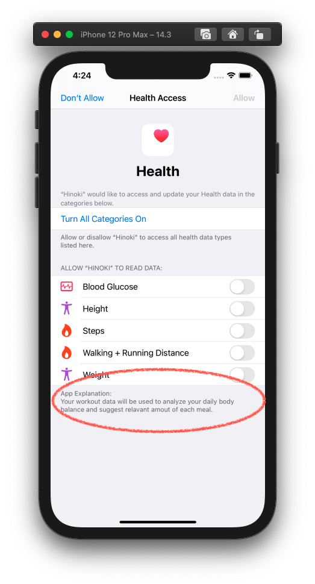

<br>
<br>

## 2. Google Fit 셋업하고 데이터 가져오기

> Google Fit 앱이 설치된 경우에만 사용 가능합니다.

<br>

이미 Google API를 위한 OAuth 2.0 클라이언트 ID가 있다면 `1)` ~ `3)` 단계는 건너뜁니다. Sign in with Google과 같은 API를 사용한 적이 있다면 이미 OAuth 2.0 클라이언트 ID가 있는 것입니다. 클라이언트 ID는 `YOUR_CLIENT_ID.apps.googleusercontent.com` 형태입니다. 기존에 생성한 클라이언트 ID는 [Google Cloud Platform]()에서 [API 및 서비스 > 사용자 인증 정보](https://console.cloud.google.com/apis/credentials) 메뉴로 이동하면 OAuth 2.0 클라이언트 ID 목록에서 확인할 수 있습니다.

<br>

### 1) 선행 작업하기: Android 앱 디지털 서명

Google Fit 등의 Google 서비스를 사용하거나 Android 앱을 배포하기 위해서는 디지털 서명을 통해 개발자 인증을 완료해야합니다. 아직 앱 서명을 하지 않았다면 [앱 서명하기](https://github.com/estellechoi/TIL/blob/master/docs/flutter/deploy_android.md#user-content-2-%EC%95%B1-%EC%84%9C%EB%AA%85%ED%95%98%EA%B8%B0)를 참고하여 앱에 디지털 서명을 완료한 후 진행해주세요. Android 앱의 디지털 서명은 `keytool`을 사용하고요, 앱 서명 정보가 담긴 Keystore를 생성한 후 앱에서 참조하는 방식입니다.

<br>

### 2) 서명 인증서의 디버그용 SHA-1 지문값 확인

앱 서명이 완료되었다면 서명 인증서의 SHA-1 지문값이 필요합니다. OAuth 2.0 클라이언트 ID와 API 키를 생성하는데 사용됩니다. 공식문서의 [Find your app's certificate information](https://developers.google.com/fit/android/get-api-key#find_your_apps_certificate_information)을 참고하거나 [`signingReport`를 사용하여 서명 인증서의 SHA-1 지문값 가져오기](https://github.com/estellechoi/TIL/blob/master/docs/flutter/google_sign_in.md#user-content-1-1-signingreport%EB%A5%BC-%EC%82%AC%EC%9A%A9%ED%95%98%EC%97%AC-%EC%84%9C%EB%AA%85-%EC%9D%B8%EC%A6%9D%EC%84%9C%EC%9D%98-sha-1-%EC%A7%80%EB%AC%B8%EA%B0%92-%EA%B0%80%EC%A0%B8%EC%98%A4%EA%B8%B0)를 참고하여 SHA-1 지문값을 가져오면 됩니다.

<br>

공식문서에 따르면, Keystore가 위치한 경로에서 아래 명령어를 사용하여 디버그용 인증서 정보를 가져올 수 있습니다. 저의 경우 `android/keystore` 경로에 `key.jks` 파일을 두었기 때문에 아래와 같이 이동한 후 인증서 정보를 조회했습니다.

```
cd android/keystore
```

```
keytool -list -v -keystore ~/.android/debug.keystore -alias androiddebugkey -storepass android -keypass android
```

<br>

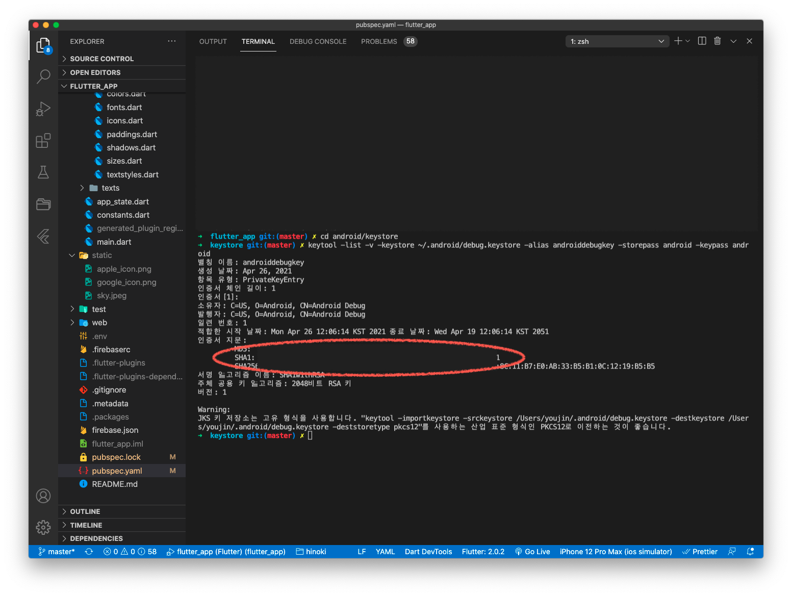

<br>
<br>

### 3) OAuth 2.0 클라이언트 ID 셋업

Google Cloud Platform에서 [Google Cloud Platform에 Fitness API용으로 애플리케이션 등록](https://console.cloud.google.com/flows/enableapi?apiid=fitness) 페이지로 이동하여 앱을 등록하고 위에서 가져온 인증서의 SHA-1 지문값을 사용하여 OAuth 2.0 클라이언트 ID를 생성합니다.

<br>

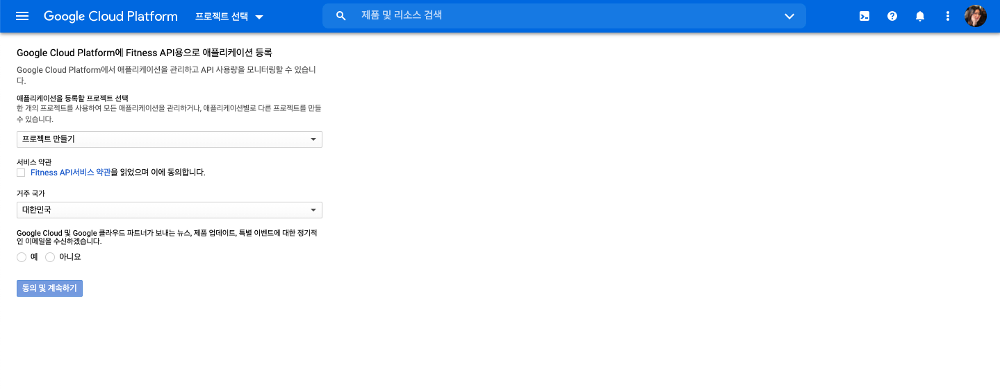

<br>
<br>

아래 스크린샷과 같이 API를 사용할 프로젝트를 선택한 후 `동의 및 계속하기` 버튼을 클릭하세요. Google Cloud Platform에 프로젝트를 생성한 적이 없다면 새로운 프로젝트를 생성한 후 진행해주세요.

<br>

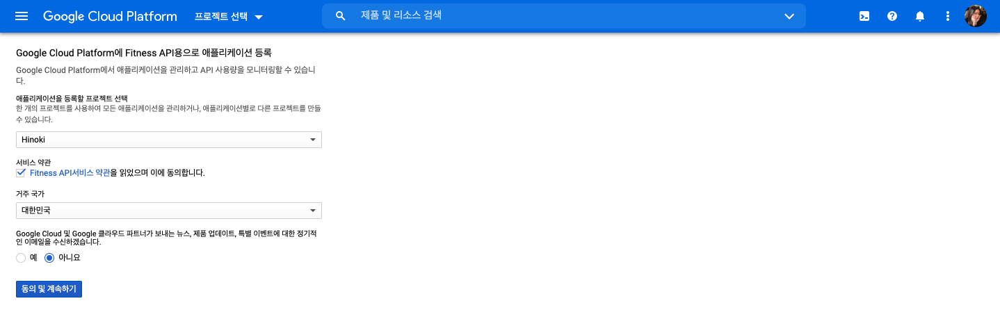

<br>
<br>

그 다음 나타나는 화면에서 `사용자 인증 정보로 이동` 버튼을 클릭하여 이동합니다.

<br>

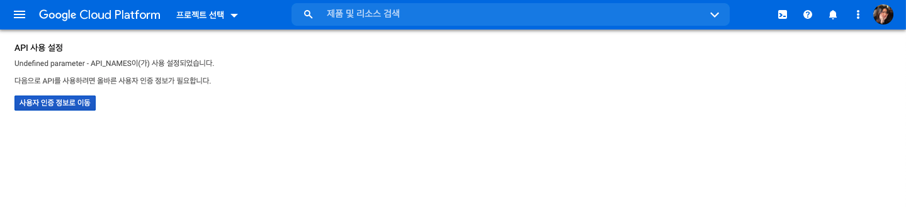

<br>
<br>

`Fitness API`를 선택하고, `사용자 데이터`를 선택한 후 `다음` 버튼을 클릭하여 계속합니다.

<br>

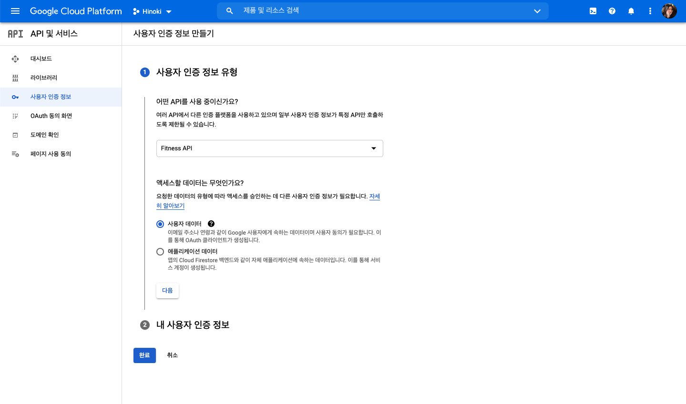

<br>
<br>

다음 나타난 각 항목에는 다음을 입력하면 됩니다.

- `애플리케이션 유형` : Android 앱에서 사용할 것이므로 `Android`를 선택합니다.

- `이름` : 안내 문구대로 Google 콘솔에서 OAuth 2.0 클라이언트를 식별하는 용도로 개발자만 보는 이름입니다.

- `패키지 이름` : Flutter 프로젝트의 `build.gradle` 파일에 지정한 Android 앱의 ID입니다.

- `SHA-1 인증서 디지털 지문` : 위 단계에서 확인한 앱 서명 인증서의 SHA-1 지문값입니다.

<br>

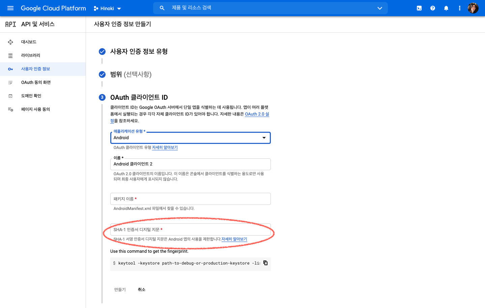

<br>
<br>

이미 다른 Google API를 사용하면서 OAuth 2.0 클라이언트 ID를 생성한 적이 있다면 아래와 같은 안내창이 나타납니다. 이 경우 현재 단계를 중단하고 기존에 생성한 OAuth 2.0 클라이언트 ID를 사용하면 됩니다.

<br>

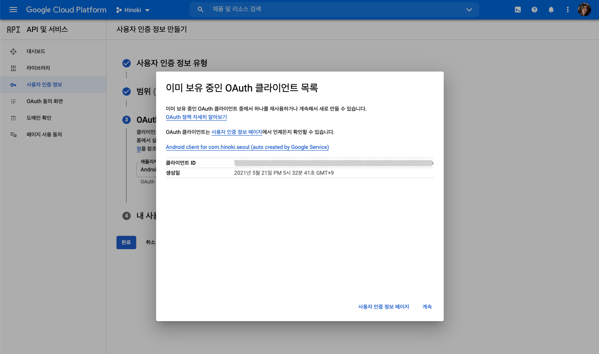

<br>
<br>

### 4) `gradle.properties` 파일 설정

Flutter 프로젝트의 `android/gradle.properties` 파일을 열고 각 항목의 값이 아래와 같도록 수정합니다.

```
org.gradle.jvmargs=-Xmx1536M
android.enableJetifier=true
android.useAndroidX=true
```

<br>

### 5) `health` 라이브러리를 사용하여 건강 데이터 가져오기

`health` 라이브러리는 Apple HealthKit와 Google Fit 동시 사용을 지원합니다. [위 섹션](https://github.com/estellechoi/TIL/blob/master/docs/flutter/healthkit.md#user-content-6-health-%EB%9D%BC%EC%9D%B4%EB%B8%8C%EB%9F%AC%EB%A6%AC%EB%A5%BC-%EC%82%AC%EC%9A%A9%ED%95%98%EC%97%AC-%EA%B1%B4%EA%B0%95-%EB%8D%B0%EC%9D%B4%ED%84%B0-%EA%B0%80%EC%A0%B8%EC%98%A4%EA%B8%B0)을 참고하여 동일하게 진행하면 됩니다.

<br>

## 3. Samsung Health 셋업하고 데이터 가져오기

### 1) 버전 확인하기

[Samsung Health](https://developer.samsung.com/health) 데이터는 Android 8.0 이상을 타겟팅해야 접근할 수 있습니다. Flutter 프로젝트에서는 Android 앱 빌드 구성 파일인 `android/app/build.gradle`에서 타겟 버전을 확인할 수 있고요, `targetSdkVersion` 값이 `26`이면 Android 8.0에 해당합니다.

```gradle
android {
    // ..

    defaultConfig {
        // ..

        targetSdkVersion 30

        // ..
    }
}
```

<br>

### 2) Samsung Health 파트너 앱으로 등록하기

Samsung Health 데이터는 Apple HealthKit, Google Fit과는 달리 Partner App Program에 등록한 후 파트너 앱으로 승인받아야만 사용할 수 있습니다. 그 다음, Samsung Health 공식 문서의 [개발 가이드](https://developer.samsung.com/health/android/data/guide/process.html)에 따라 진행하면 됩니다.

<br>

### 3) Samsung Health Android SDK 다운로드, 라이브러리 추가하기

파트너 앱으로 승인되었다면, [Samsung Health SDK for Android](https://developer.samsung.com/health/android/overview.html)를 사용하여 앱에 기록된 사용자 데이터에 접근할 수 있습니다. 단순 테스트를 위해서는 Samsung Health 앱을 [Developer Mode](https://developer.samsung.com/health/android/data/guide/dev-mode.html)로 전환하여 테스트해볼 수 있습니다. 이 단계부터는 Samsung Health 공식 개발 가이드의 [Hello Health Data](https://developer.samsung.com/health/android/data/guide/hello-health-data.html) 예제 문서를 참고하여 진행했습니다.

<br>

#### 3-1) Samsung Health SDK 다운로드

Samsung Developers > [Samsung Health SDK for Android](https://developer.samsung.com/health/android/overview.html?download=/shealth/file/1869fee0-3d6b-424e-9bd7-f65f592cffb2#SDK-Download)에서 Samsung Health SDK `zip` 압축 파일을 다운로드합니다. 압축을 해제하고요, 해당 폴더 내의 `data-v1.5.0/libs/` 경로에서 `samsung-health-data-1.5.0.aar` 파일을 찾습니다. 디렉토리명, 파일명은 다운로드한 버전에 따라 달라질 수 있습니다.

<br>

> `aar` 포맷은 Android Archive의 줄임말로, Android 라이브러리 프로젝트의 바이너리 배포 파일입니다. Java 클래스 파일과 리소스 파일들을 포함하고 있습니다.

<br>

#### 3-2) Flutter 프로젝트에서 Samsung Health SDK 임포트

이제 `samsung-health-data-1.5.0.aar` 파일을 Flutter 프로젝트에 추가합니다. Flutter 프로젝트의 `android/app/` 경로에 `libs`라는 이름으로 디렉토리를 생성하고 파일을 넣어주면 됩니다. 그 다음 `android/app/build.gradle` 파일을 열고 `dependencies`에 아래와 같이 추가한 파일을 참조하도록 추가합니다.

```gradle
// ..

dependencies {
    implementation "org.jetbrains.kotlin:kotlin-stdlib-jdk7:$kotlin_version"
    implementation 'com.android.support:multidex:1.0.3'

    // ..

    implementation files('libs/samsung-health-data-1.5.0.aar') // SDK 파일 참조!
}
```

<br>

그 다음 `android/app/src/main/AndroidManifest.xml` 파일을 열고 아래와 같이 `<queries>` 태그를 사용하여 추가합니다.

```xml
<manifest xmlns:android="http://schemas.android.com/apk/res/android"
    package="com.example.flutter_app">
   <uses-permission android:name="android.permission.INTERNET" />
   <!-- 여기 -->
   <queries>
      <package android:name="com.sec.android.app.shealth" />
   </queries>
   <application
        android:label="Hinoki"
        android:icon="@mipmap/test_launcher">

        <!-- .. -->

   </application>
```

<br>

..

<br>
<br>
<br>

---

### References

- [Setting Up HealthKit | Apple Developer](https://developer.apple.com/documentation/healthkit/setting_up_healthkit)
- [Accessing Health Records | Apple Developer](https://developer.apple.com/documentation/healthkit/samples/accessing_health_records)
- [Apple Health Records: Everything you need to know!](https://www.imore.com/health-records)
- [Apple Health Records](https://blog.usejournal.com/apple-health-records-cbb98551bbb9)
- [Get started on Android | Google Fit](https://developers.google.com/fit/android/get-started#create-configure-project)
- [Get an OAuth 2.0 Client ID | Google Fit](https://developers.google.com/fit/android/get-api-key#find_your_apps_certificate_information)
- [Samsung Health Android SDK - Data API Reference 1.5.0](https://img-developer.samsung.com/onlinedocs/health/android/data/index.html)
