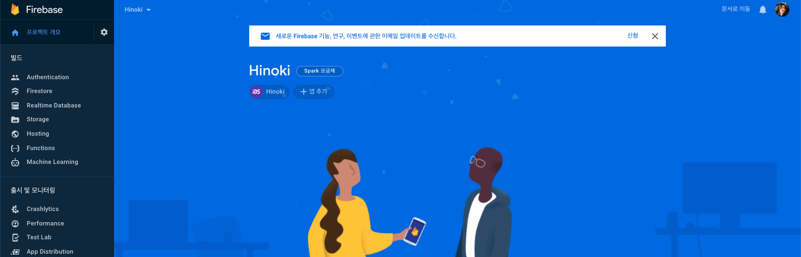
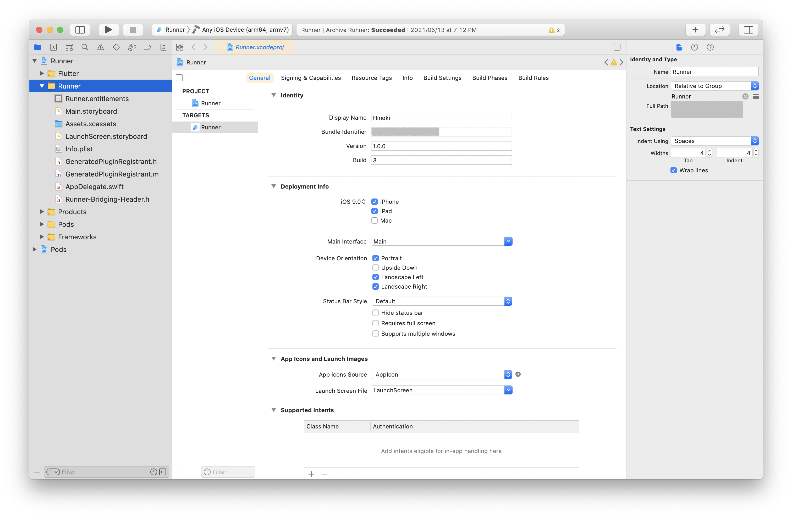

# Flutter 앱에서 Firebase를 사용하여 Apple 로그인 구현하기

 

> 자세한 내용은 [iOS에서 Apple을 통해 인증](https://firebase.google.com/docs/auth/ios/apple?authuser=0) 문서와 Apple의 [로그인을 손쉽게](https://developer.apple.com/kr/sign-in-with-apple/get-started/) 문서를 참고하세요.

 

1. 선행 작업하기
2. Firebase 프로젝트 생성하기
3. Firebase에 iOS 앱 등록하기
4. Firebase 구성 파일 추가하기
5. FlutterFire 라이브러리 추가하기
6. Firebase 콘솔에서 Apple 로그인 사용 설정하기
7. Apple Developer에서 서비스 ID 생성하기

 

## 1. 선행 작업하기

> Apple 로그인은 iOS 13 이상에서만 사용 가능합니다.

 

Flutter 앱에서 Apple 로그인을 구현하려면 Firebase 프로젝트와 앱을 연결하고 Apple Developer에서 생성하는 서비스 ID가 필요합니다. 또 이 작업을 위해서는 몇 가지 선행 작업이 필요합니다. 이 문서는 이러한 선행작업을 포함하는 테스트 배포 작업을 완료했다고 가정하기 때문에 [Flutter 프로젝트를 iOS 앱으로 배포하기 : 앱 ID, 프로비저닝 프로파일, APNs, 미국 수출 규정](https://github.com/estellechoi/TIL/blob/master/docs/flutter/deploy.md) 문서에서 필요한 내용을 참고하여 선행 작업을 진행하거나, 아래 단계들을 따라가며 최소한의 선행 작업을 진행하세요.

 

### 1) Apple Developer Program 등록

Sign in with Apple을 포함한 Apple 서비스를 이용하려면 개발자(팀)의 Apple 계정을 개발자 계정으로 전환해야합니다. 정확하게는 앱 배포를 위한 첫단계라고 할 수 있습니다. [Apple Developer Program 등록하기](https://github.com/estellechoi/TIL/blob/master/docs/flutter/deploy.md#user-content-1-apple-developer-program-등록하기)를 참고하여 개발자 계정으로 등록하세요. 이 단계에서 비용이 발생하고, 승인까지 시간이 소요될 수 있습니다.

 

### 2) 고유 앱 번들 ID 등록

개발자 계정으로 전환이 완료되면 Apple에서 앱을 식별할 수 있는 고유한 앱 ID를 생성해야합니다. 이 단계에서 생성하는 앱 ID가 뒤에 나오는 Firebase 콘솔에서의 앱 등록과 서비스 ID 생성에 사용됩니다. [Apple Developer에서 고유 앱 번들 ID 등록](https://github.com/estellechoi/TIL/blob/master/docs/flutter/deploy.md#user-content-1-고유-번들-id-등록)을 참고하여 앱 ID를 등록하세요.

 

새로 앱 ID를 생성하는 경우라면, 이 단계에서 Capabilites 목록 중 Sign in with Apple 항목을 `ENABLED`로 체크하고 다음 단계는 건너뜁니다. 이미 앱 ID가 있다면, 이 단계는 건너뛰고 다음 단계에 따라 Capabilites 섹션을 수정합니다.

 

### 3) 앱 ID Capabilites에 Sign in with Apple 항목 추가

[Apple Developer > Identifiers](https://developer.apple.com/account/resources/identifiers/list) 페이지에서 수정할 앱 ID를 클릭하여 편집 페이지로 이동하세요. Capabilities 섹션에서 Sign in with Apple 항목을 `ENABLED`로 체크하고 `Save` 버튼을 클릭하여 수정합니다.

 

 
 

### 4) Xcode 프로젝트 설정에 Sign in with Apple 추가

[Signing & Capabilities](https://github.com/estellechoi/TIL/blob/master/docs/flutter/deploy.md#user-content-2-signing--capabilities)를 참고하여 Xcode를 열고 Sign in with Apple 서비스를 Capability로 추가합니다. 아래 스크린샷과 같이 Xcode에서 프로젝트의 `Runner/Runner` 경로를 열고, `Signing & Capabilities` 탭으로 이동한 후 `+ Capability` 버튼을 클릭하여 추가하면 됩니다.

 

 
 

## 2. Firebase 프로젝트 생성하기

선행 작업을 완료했다면 Google [Firebase 콘솔](https://console.firebase.google.com/u/0/)에서 `프로젝트 만들기` 버튼을 클릭하여 프로젝트를 생성합니다. 보통 Firebase 콘솔에 표시될 이름으로 프로젝트 이름을 정합니다. 프로젝트 이름을 기반으로 고유한 프로젝트 ID가 생성되고 하단에 보여집니다. 프로젝트 생성이 완료되면 해당 프로젝트의 관리페이지 메인으로 자동 이동됩니다. 이 화면은 [Firebase 콘솔의 프로젝트 목록](https://console.firebase.google.com/u/0/)에서 생성한 프로젝트를 클릭하여 접근할 수 있습니다.

 

앞으로 이 Firebase 프로젝트 페이지의 각 메뉴에서 사용할 Firebase 서비스들을 설정하게 됩니다. 프로젝트에 개발중인 앱을 연동하면 연동된 앱에서 설정한 Firebase 서비스를 실제로 사용할 수 있습니다.

 

## 3. Firebase에 iOS 앱 등록하기

이제 위에서 생성한 Firebase 프로젝트에 Apple 로그인을 적용할 iOS 앱을 등록해야 합니다. 프로젝트 메인보드 페이지에서 `iOS` 아이콘을 클릭합니다.

 

> 이 단계부터 자세한 내용은 [Flutter 앱에 Firebase 추가](https://firebase.google.com/docs/flutter/setup?hl=ko) 문서를 참고하세요.

 

 
 

`iOS` 아이콘을 클릭하여 앱 등록을 시작하면 아래 스크린샷과 같이 폼 양식이 나타납니다. 각 항목에 입력해야할 내용은 다음과 같습니다.

- iOS 번들 ID : [Apple Developer](https://developer.apple.com/account/resources/identifiers/list/bundleId)에서 생성한 앱의 고유 번들 ID를 입력합니다.

- 앱 닉네임 : Firebase Console에서 본인만 볼 수 있는 편의용 닉네임입니다.

- App Store ID : 앱에 아직 App Store ID가 없으면 나중에 프로젝트 설정에서 ID를 추가할 수 있습니다.

 

 
 

`앱 등록` 버튼이 활성화되면 클릭하여 앱 등록을 완료하시고요, 다음 단계들은 추후 편집이 가능하므로 건너뛰고 프로젝트 메인보드 페이지로 이동합니다. 아래 스크린샷과 같이 방금 등록한 앱을 확인할 수 있습니다. 이제 등록한 앱 이름을 클릭한 후 톱니바퀴 아이콘을 클릭하여 건너뛰었던 내용들을 편집해봅시다.

 

 

## 4. Firebase 구성 파일 추가하기

Flutter 프로젝트와 Firebase를 연결하기 위해 Firebase에서 제공하는 iOS용 구성 파일을 프로젝트에 추가해야합니다. `GoogleService-Info.plist` 다운로드 버튼을 클릭하여 파일(`GoogleService-Info.plist`)을 저장합니다.

 

 
 

파일 이름이 변경되지 않도록 주의하시고요, 다운로드한 파일을 프로젝트의 `Runner/Runner` 경로에 추가합니다. Flutter 프로젝트의 루트 경로를 기준으로 `ios/Runner.xcworkspace` 파일을 실행하여 Xcode를 열고, `Runner/Runner` 경로에서 마우스 우클릭 후 `Add Files to "Runner" ...`를 선택하여 추가하면 됩니다. 이때 Finder나 다른 에디터를 사용하지않고 Xcode를 사용하여 파일을 추가하는 것이 중요합니다. 그래야 파일이 Xcode 프로젝트에 연결됩니다.

 

 

## 5. FlutterFire 라이브러리 추가하기

Flutter 프로젝트에서는 [FlutterFire](https://firebaseopensource.com/projects/firebaseextended/flutterfire/)를 사용하여 Firebase API 등 다양한 플랫폼별 서비스에 접근할 수 있습니다. 각 Firebase 서비스에 필요한 라이브러리를 추가하는 방식인데, 이러한 라이브러리들을 총칭하여 FlutterFire라고 부릅니다. Flutter 프로젝트의 경우 FlutterFire 라이브러리들을 프로젝트에 추가하면 iOS, Android 버전 모두에서 사용됩니다.

 

일반적으로 아래의 라이브러리들이 필요합니다. 프로젝트의 `pubspec.yaml` 파일에 추가하여 라이브러리를 설치합니다.

- [`firebase_core`](https://pub.dev/packages/firebase_core) : Firebase Core API 사용을 위해 모든 Firebase 앱에 필요합니다.

- [`firebase_auth`](https://pub.dev/packages/firebase_auth) : 이메일/비밀번호 계정, 전화번호 인증, 소셜로그인 등 사용자 인증 서비스인 [Firebase Authentication API](https://firebase.google.com/products/auth/) 사용을 위해 필요합니다.

- [`cloud_firestore`](https://pub.dev/packages/cloud_firestore) : 데이터베이스인 [Cloud Firestore API](https://firebase.google.com/docs/firestore/) 사용을 위해 필요합니다.

- [`firebase_analytics`](https://pub.dev/packages/firebase_analytics) : Google Analytics(GA) 사용 설정한 경우 필요합니다. 이 라이브러리를 추가하는 경우, 앱을 실행하여 Firebase를 성공적으로 통합했다는 확인을 Firebase에 보냅니다. `firebase_analytics` 라이브러리를 사용하려면 추가작업이 필요한데요, [예시 프로젝트](https://github.com/FirebaseExtended/flutterfire/tree/master/packages/firebase_analytics/firebase_analytics/example)와 iOS 앱을 위한 [Google 애널리틱스 시작하기](https://firebase.google.com/docs/analytics/get-started?platform=ios&hl=ko) 문서를 참고하여 마무리합니다.

 

## 6. Firebase 콘솔에서 Apple 로그인 사용 설정하기

다시 Firebase 콘솔의 프로젝트 관리 페이지로 돌아옵니다. 왼쪽 메뉴바에서 `Authentication` 메뉴를 클릭하여 이동한 후 `시작하기` 버튼을 클릭합니다.

 

 
 

그 다음 `Sign-in method` 탭의 `로그인 제공업체` 목록에서 `Apple`을 찾아 클릭하세요. 그럼 아래 스크린샷과 같은 폼 양식이 나타납니다. `사용 설정`을 활성화하고, 필요한 경우에만 폼 양식을 작성하세요. 일반적으로 iOS 앱에서만 Apple 로그인을 사용한다면 아무것도 입력하지않아도 됩니다.

 

 
 

Android 앱에서도 Apple 로그인을 사용하려면 아래 항목들을 작성합니다.

- `서비스 ID` : Android 앱에서 Apple 로그인을 사용할 때 필요한 ID 입니다. [Apple Store Connect](https://appstoreconnect.apple.com/)에서 생성한 앱 ID를 입력하면 됩니다.

  > 아직 앱 ID가 없다면, [Flutter 프로젝트를 iOS 앱으로 배포하기 : 앱 ID, 프로비저닝 프로파일, APNs, 미국 수출 규정](https://github.com/estellechoi/TIL/blob/master/docs/flutter/deploy.md) 문서를 참고하여 앱 ID를 먼저 생성해주세요.

 

`OAuth 코드 흐름 구성(선택사항)` 항목을 펼치면 아래와 같은 양식이 추가로 나타납니다.

- `Apple 팀 ID` : 앱을 소유한 Apple 개발자 계정의 팀 ID를 입력합니다. 영대문자와 숫자로 이루어져있습니다.

- `키 ID` : ...

- `비공개 키` : ...

 

폼 양식의 하단에 있는 승인 콜백 URL은 [Apple Developer](https://developer.apple.com)에서 서비스 ID 등록시 필요합니다.

 

 
 

저장하면 `로그인 제공업체` 목록 중 `Apple` 항목이 `사용 설정됨` 상태로 바뀐 것을 확인할 수 있습니다. 그 아래 `승인된 도메인` 목록에 `appid.firebaseapp.com` 형태의 Firebase 앱 도메인이 생성된 것도 확인해주세요.

 

 

## 7. Apple Developer에서 서비스 ID 생성하기

이제 Apple의 Sign in with Apple 서비스를 사용하기 위해 서비스 ID를 만들어야합니다. [Apple Developer](https://developer.apple.com) 사이트에서 [Account > Certificates, IDs & Profiles > Identifiers](https://developer.apple.com/account/resources/identifiers/list)로 이동한 후, `+` 버튼을 클릭하여 서비스 ID 생성을 시작합니다.

 

Sign in with Apple 서비스를 위한 ID를 생성할 것이므로 `Service IDs`를 선택하고 `Continue` 버튼을 클릭합니다.

 

 
 

아래의 두 항목을 입력하고 `Continue`, `Register` 버튼을 차례로 클릭하여 서비스 ID를 생성합니다.

- `Description` : 사용자가 Apple 로그인 과정에서 보게 될 앱의 이름을 작성합니다.

- `Identifier` : Firebase OAuth의 `client_id`로 사용될 서비스 ID입니다. 하단 안내문구에 따라 `com.domainname.appname` 형태로 작성합니다.
  > 앱 ID와 중복되지 않도록 작성합니다.

 

이제 [Identifiers](https://developer.apple.com/account/resources/identifiers/list/serviceId) 페이지에서 방금 생성한 서비스 ID 항목이 있는지 확인한 후 클릭하여 상세정보 페이지로 이동합니다.

 

 

`Sign in with Apple`에 체크합니다.

 

 
 

`Configure` 버튼을 클릭하면 아래 스크린샷과 같은 창이 나타납니다. Website URLs 섹션의 각 항목을 작성합니다. 이 단계에서 Firebase 프로젝트의 Apple 로그인용 승인 콜백 URL과 Firebase 앱 도메인을 사용합니다. Firebase 콘솔의 Authentication 메뉴에서 확인할 수 있습니다.

- `Domains and Subdomains` : Firebase 프로젝트의 승인된 도메인을 입력합니다. `appid.firebaseapp.com` 형태입니다.

- `Return URLs` : Firebase에서 Apple 로그인 사용 설정시 확인했던 승인 콜백 URL을 입력합니다.

 

 
 

입력을 완료했으면 `Next`, `Done`을 클릭하여 완료하고, 다시 우측 상단의 `Continue`, `Save` 버튼을 클릭하여 마무리합니다.

 

---

### References

- [Flutter 앱에 Firebase 추가](https://firebase.google.com/docs/flutter/setup?hl=ko)
- [iOS에서 Apple을 통해 인증](https://firebase.google.com/docs/auth/ios/apple?authuser=0)
