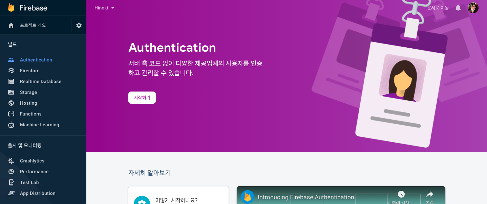
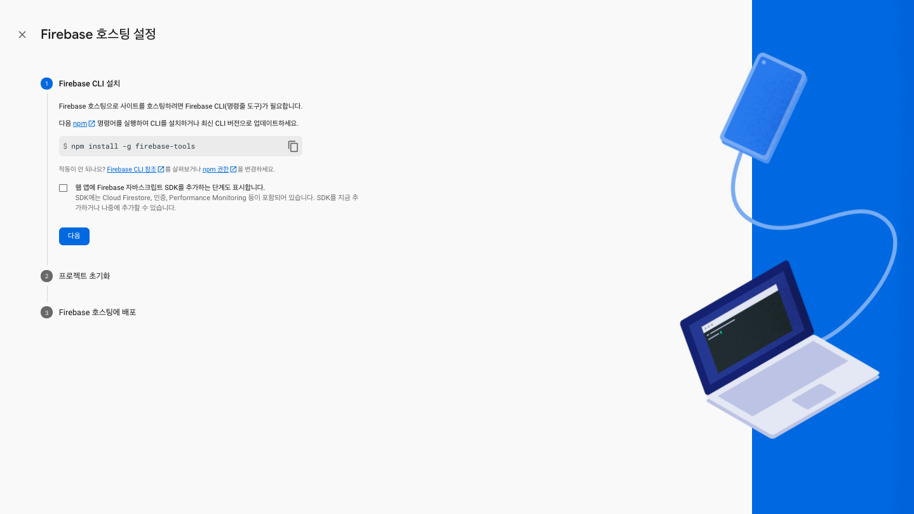
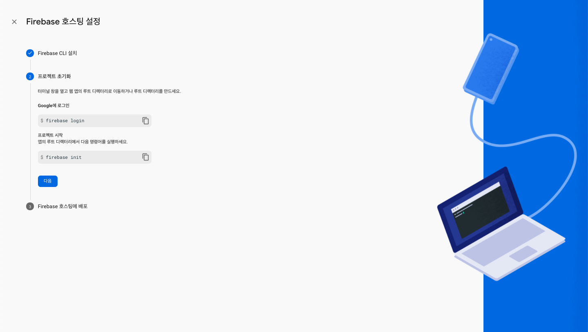
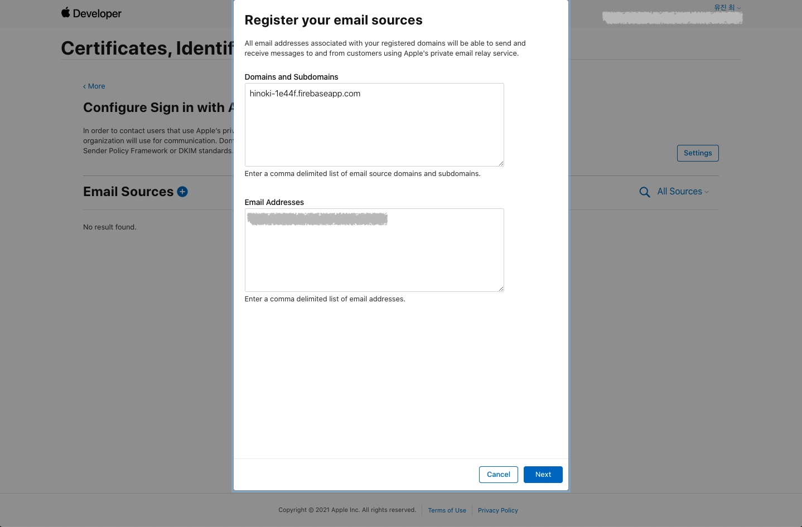

# Flutter 앱에서 Firebase를 사용하여 Apple 로그인 구현하기

<br>

> 자세한 내용은 [iOS에서 Apple을 통해 인증](https://firebase.google.com/docs/auth/ios/apple?authuser=0) 문서와 Apple의 [로그인을 손쉽게](https://developer.apple.com/kr/sign-in-with-apple/get-started/) 문서를 참고하세요.

<br>

1. 선행 작업하기
2. Firebase 프로젝트 생성하기
3. Firebase에 iOS 앱 등록하기
4. Flutter 프로젝트에 Firebase 구성 파일 추가하기
5. Firebase 콘솔에서 Apple 로그인 사용 설정하기
6. Firebase 프로젝트 호스팅하기
7. Apple Developer에서 서비스 ID 생성하기
8. Sign in with Apple 서비스 설정하기
9. Flutter 프로젝트에 FlutterFire(라이브러리) 추가하기
10. `sign_in_with_apple` 라이브러리 추가하기
11. Apple 로그인 구현하기
12. `Podfile` 설정하기

<br>

## 1. 선행 작업하기

> Apple 로그인은 iOS 13 이상에서만 사용 가능합니다.

<br>

Flutter 앱에서 Apple 로그인을 구현하려면 Firebase 프로젝트와 앱을 연결하고 Apple Developer에서 생성하는 서비스 ID가 필요합니다. 또 이 작업을 위해서는 몇 가지 선행 작업이 필요합니다. 이 문서는 이러한 선행작업을 포함하는 테스트 배포 작업을 완료했다고 가정하기 때문에 [Flutter 프로젝트를 iOS 앱으로 배포하기 : 앱 ID, 프로비저닝 프로파일, APNs, 미국 수출 규정](https://github.com/estellechoi/TIL/blob/master/docs/flutter/deploy.md) 문서에서 필요한 내용을 참고하여 선행 작업을 진행하거나, 아래 단계들을 따라가며 최소한의 선행 작업을 진행하세요.

<br>

### 1) Apple Developer Program 등록

Sign in with Apple을 포함한 Apple 서비스를 이용하려면 개발자(팀)의 Apple 계정을 개발자 계정으로 전환해야합니다. 정확하게는 앱 배포를 위한 첫단계라고 할 수 있습니다. [Apple Developer Program 등록하기](https://github.com/estellechoi/TIL/blob/master/docs/flutter/deploy.md#user-content-1-apple-developer-program-등록하기)를 참고하여 개발자 계정으로 등록하세요. 이 단계에서 비용이 발생하고, 승인까지 시간이 소요될 수 있습니다.

<br>

### 2) 고유 앱 번들 ID 등록

개발자 계정으로 전환이 완료되면 Apple에서 앱을 식별할 수 있는 고유한 앱 ID를 생성해야합니다. 이 단계에서 생성하는 앱 ID가 뒤에 나오는 Firebase 콘솔에서의 앱 등록과 서비스 ID 생성에 사용됩니다. [Apple Developer에서 고유 앱 번들 ID 등록](https://github.com/estellechoi/TIL/blob/master/docs/flutter/deploy.md#user-content-1-고유-번들-id-등록)을 참고하여 앱 ID를 등록하세요.

<br>

새로 앱 ID를 생성하는 경우라면, 이 단계에서 Capabilites 목록 중 Sign in with Apple 항목을 `ENABLED`로 체크하고 다음 단계는 건너뜁니다. 이미 앱 ID가 있다면, 이 단계는 건너뛰고 다음 단계에 따라 Capabilites 섹션을 수정합니다.

<br>

### 3) 앱 ID Capabilites에 Sign in with Apple 항목 추가

[Apple Developer > Identifiers](https://developer.apple.com/account/resources/identifiers/list) 페이지에서 수정할 앱 ID를 클릭하여 편집 페이지로 이동하세요. Capabilities 섹션에서 Sign in with Apple 항목을 `ENABLED`로 체크하고 `Save` 버튼을 클릭하여 수정합니다.

<br>


<br>
<br>

### 4) Xcode 프로젝트 설정에 Sign in with Apple 추가

[Signing & Capabilities](https://github.com/estellechoi/TIL/blob/master/docs/flutter/deploy.md#user-content-2-signing--capabilities)를 참고하여 Xcode를 열고 Sign in with Apple 서비스를 Capability로 추가합니다. 아래 스크린샷과 같이 Xcode에서 프로젝트의 `Runner/Runner` 경로를 열고, `Signing & Capabilities` 탭으로 이동한 후 `+ Capability` 버튼을 클릭하여 추가하면 됩니다.

<br>


<br>
<br>

## 2. Firebase 프로젝트 생성하기

선행 작업을 완료했다면 Google [Firebase 콘솔](https://console.firebase.google.com/u/0/)에서 `프로젝트 만들기` 버튼을 클릭하여 프로젝트를 생성합니다. 보통 Firebase 콘솔에 표시될 이름으로 프로젝트 이름을 정합니다. 프로젝트 이름을 기반으로 고유한 프로젝트 ID가 생성되고 하단에 보여집니다. 프로젝트 생성이 완료되면 해당 프로젝트의 관리페이지 메인으로 자동 이동됩니다. 이 화면은 [Firebase 콘솔의 프로젝트 목록](https://console.firebase.google.com/u/0/)에서 생성한 프로젝트를 클릭하여 접근할 수 있습니다.

<br>

앞으로 이 Firebase 프로젝트 페이지의 각 메뉴에서 사용할 Firebase 서비스들을 설정하게 됩니다. 프로젝트에 개발중인 앱을 연동하면 연동된 앱에서 Firebase 서비스를 실제로 사용할 수 있습니다.

<br>

## 3. Firebase에 iOS 앱 등록하기

> 이 단계부터 자세한 내용은 [Flutter 앱에 Firebase 추가](https://firebase.google.com/docs/flutter/setup?hl=ko) 문서를 참고하세요.

<br>

이제 위에서 생성한 Firebase 프로젝트에 Apple 로그인을 적용할 iOS 앱을 등록해야 합니다. 프로젝트 메인페이지에서 `iOS` 아이콘을 클릭합니다.

<br>


<br>
<br>

`iOS` 아이콘을 클릭하여 앱 등록을 시작하면 아래 스크린샷과 같이 폼 양식이 나타납니다. 각 항목에 입력해야할 내용은 다음과 같습니다.

- `iOS 번들 ID` : [Apple Developer](https://developer.apple.com/account/resources/identifiers/list/bundleId)에서 생성한 앱의 고유 번들 ID를 입력합니다. 아직 앱 ID가 없다면 [1. 선행 작업하기](#user-content-2-고유-앱-번들-id-등록)로 돌아가서 앱 ID를 생성해주세요.

- `앱 닉네임` : Firebase 콘솔에서 관리자만 볼 수 있는 편의용 이름입니다.

- `App Store ID` : 아직 App Store ID가 없다면 추후에 프로젝트 설정에서 추가할 수 있습니다.
  > 여기에서는 건너뛰겠습니다.

<br>


<br>
<br>

`앱 등록` 버튼이 활성화되면 클릭하여 앱 등록을 완료하시고요, 다음 단계들은 추후 입력이 가능하므로 건너뛰고 프로젝트 메인페이지로 돌아갑니다. 아래 스크린샷과 같이 방금 등록한 iOS 앱을 확인할 수 있습니다. 이제 등록한 앱 이름을 클릭한 후 톱니바퀴 아이콘을 클릭하여 건너뛰었던 내용들을 편집해봅시다.

<br>


<br>

## 4. Flutter 프로젝트에 Firebase 구성 파일 추가하기

이제 Firebase 프로젝트에 방금 등록한 iOS 앱과 개발중인 Flutter 프로젝트를 연결합니다. Firebase에서 제공하는 iOS용 구성 파일을 Flutter 프로젝트의 지정된 경로에 추가하면 됩니다. `GoogleService-Info.plist` 다운로드 버튼을 클릭하여 파일(`GoogleService-Info.plist`)을 저장합니다.

<br>


<br>
<br>

파일 이름이 변경되지 않도록 주의하시고요, 다운로드한 파일을 프로젝트의 `Runner/Runner` 경로에 추가합니다. 이때 Finder나 다른 에디터를 사용하지않고 Xcode를 사용하여 파일을 추가하는 것이 중요합니다. 그래야 파일이 Xcode 프로젝트에 연결됩니다.

<br>

Flutter 프로젝트의 루트 경로를 기준으로 `ios/Runner.xcworkspace` 파일을 실행하여 Xcode를 열고, `Runner/Runner` 경로에서 마우스 우클릭 후 `Add Files to "Runner" ...`를 선택하여 추가하면 됩니다.

<br>


<br>

## 5. Firebase 콘솔에서 Apple 로그인 사용 설정하기

다시 Firebase 콘솔의 프로젝트 관리 페이지로 돌아옵니다. 왼쪽 메뉴바에서 `Authentication` 메뉴를 클릭하여 이동한 후 `시작하기` 버튼을 클릭합니다.

<br>



<br>
<br>

그 다음 `Sign-in method` 탭의 `로그인 제공업체` 목록에서 `Apple`을 찾아 클릭하세요. 그럼 아래 스크린샷과 같은 폼 양식이 나타납니다. `사용 설정`을 활성화하고, 필요한 경우에만 폼 양식을 작성하세요. 일반적으로 iOS 앱에서만 Apple 로그인을 사용한다면 아무것도 입력하지않아도 됩니다.

<br>


<br>
<br>

Android 앱에서도 Apple 로그인을 사용하려면 아래 항목들을 작성합니다.

- `서비스 ID` : Android 앱에서 Apple 로그인을 사용할 때 필요한 ID 입니다. [Apple Developer](https://developer.apple.com/account/resources/identifiers/list)에서 생성한 앱 ID를 입력하면 됩니다.

  > 아직 앱 ID가 없다면 앱 ID를 먼저 생성해주세요.

<br>

`OAuth 코드 흐름 구성(선택사항)` 항목을 펼치면 아래와 같은 양식이 추가로 나타납니다.

- `Apple 팀 ID` : 앱을 소유한 Apple 개발자 계정의 팀 ID를 입력합니다. 영대문자와 숫자로 이루어져있습니다.

- `키 ID` : ...

- `비공개 키` : ...

<br>

폼 양식의 하단에 있는 승인 콜백 URL은 [Apple Developer](https://developer.apple.com)에서 서비스 ID 생성시 필요합니다.

<br>


<br>
<br>

저장하면 `로그인 제공업체` 목록 중 `Apple` 항목이 `사용 설정됨` 상태로 바뀐 것을 확인할 수 있습니다. 그 아래 `승인된 도메인` 목록에 `appid.firebaseapp.com` 형태의 Firebase 앱 도메인이 생성된 것도 확인해주세요.

<br>


<br>

## 6. Firebase 프로젝트 호스팅하기

이제 Firebase 앱 도메인을 사용하기 위해 Firebase 프로젝트를 호스팅해야합니다. 좌측 메뉴바에서 `Hosting` 메뉴로 이동하고 `시작하기` 버튼을 클릭합니다.

<br>


<br>
<br>

Firebase 호스팅을 통해 앱을 호스팅하려면 Firebase CLI를 설치해야합니다. 안내에 따라 NPM을 사용하여 `firebase-tools`를 전역 설치합니다.

```
npm install -g firebase-tools
```

<br>



<br>
<br>

설치를 완료했으면 `다음` 버튼을 클릭하고 안내에 따라 Flutter 프로젝트의 루트 경로에서 다음 명령어를 차례로 실행합니다.

<br>



<br>
<br>

- Google 계정에 로그인

```
firebase login
```

<br>

- 프로젝트 시작

```
firebase init
```

<br>


<br>
<br>

`firebase init` 명령어를 실행하면 아래 스크린샷과 같이 몇 가지 질문에 답을 해야하고요, 프로젝트에 맞게 답을 선택합니다.

<br>


<br>
<br>

완료했으면 Firebase 호스팅 설정 화면으로 돌아와서 `다음` 버튼을 클릭합니다. 안내에 따라 명령어를 사용하여 Firebase 프로젝트를 배포합니다.

```
firebase deploy
```

<br>

배포가 완료되면 웹브라우저에서 Firebase 앱 도메인을 열고 확인합니다. 아래와 같은 화면이 뜨면 성공입니다.

<br>


<br>
<br>

> [Use Firebase to host your Flutter app on the web](https://medium.com/flutter/must-try-use-firebase-to-host-your-flutter-app-on-the-web-852ee533a469#d31b) 문서를 참고하면 도움이 됩니다.

<br>

## 7. Apple Developer에서 서비스 ID 생성하기

이제 Apple의 Sign in with Apple 서비스를 사용하기 위해 서비스 ID를 만들어야합니다. [Apple Developer](https://developer.apple.com) 사이트에서 [Account > Certificates, IDs & Profiles > Identifiers](https://developer.apple.com/account/resources/identifiers/list)로 이동한 후, `+` 버튼을 클릭하여 서비스 ID 생성을 시작합니다.

<br>

Sign in with Apple 서비스를 위한 ID를 생성할 것이므로 `Service IDs`를 선택하고 `Continue` 버튼을 클릭합니다.

<br>


<br>
<br>

아래의 두 항목을 입력하고 `Continue`, `Register` 버튼을 차례로 클릭하여 서비스 ID를 생성합니다.

- `Description` : 사용자가 Apple 로그인 과정에서 보게 될 앱의 이름을 작성합니다.

- `Identifier` : Firebase OAuth의 `client_id`로 사용될 서비스 ID입니다. 하단 안내문구에 따라 `com.domainname.appname` 형태로 작성합니다.
  > 앱 ID와 중복되지 않도록 작성합니다.

<br>

이제 [Identifiers](https://developer.apple.com/account/resources/identifiers/list/serviceId) 페이지에서 방금 생성한 서비스 ID 항목이 있는지 확인한 후 클릭하여 상세정보 페이지로 이동합니다.

<br>


<br>
<br>

서비스 ID의 상세정보 페이지로 이동하면 `Sign in with Apple` 항목이 있습니다. `ENABLED`에 체크합니다.

<br>


<br>
<br>

`Configure` 버튼을 클릭하면 아래 스크린샷과 같은 창이 나타납니다. Website URLs 섹션의 각 항목을 작성합니다. 이 단계에서 Firebase 프로젝트의 Apple 로그인용 승인 콜백 URL과 Firebase 앱 도메인을 사용합니다. Firebase 콘솔의 Authentication 메뉴에서 확인할 수 있습니다.

- `Domains and Subdomains` : Firebase 프로젝트의 승인된 도메인을 입력합니다. `appid.firebaseapp.com` 형태입니다.

- `Return URLs` : Firebase에서 Apple 로그인 사용 설정시 확인했던 승인 콜백 URL을 입력합니다.

<br>


<br>
<br>

입력을 완료했으면 `Next`, `Done`을 클릭하여 완료하고, 다시 우측 상단의 `Continue`, `Save` 버튼을 클릭하여 마무리합니다.

<br>

## 8. Sign in with Apple 서비스 설정하기

[Apple Developer > Certificates, Identifiers & Profile > More](https://developer.apple.com/account/resources/services/list) 메뉴로 이동하여 Sign in with Apple 서비스를 설정합니다. `Configure` 버튼을 클릭하여 시작하세요.

<br>


<br>
<br>

`+` 버튼을 클릭하면 아래와 같은 창이 나타납니다. `Domains and Subdomains`에는 위에서 호스팅한 Firebase 앱 도메인 주소를 작성하고요, `Email Address` 항목에는 사용자를 대상으로 이메일 커뮤니케이션을 진행할 이메일 주소를 입력합니다.

<br>



<br>
<br>

완료하면 아래와 같이 도메인과 이메일 주소가 등록된 것을 확인할 수 있습니다. 참고로 도메인 주소 위에 커서를 올리면 `Reverify SPF` 버튼이 나타납니다. 이전에는 도메인 검증을 위해 `Download` 버튼을 사용해 `apple-developer-domain-association.txt` 파일을 가져오고 Flutter 프로젝트에 포함시킨 후 Firebase 앱을 배포하는 과정이 있었지만, 현재는 이 과정이 생략되었으므로 여기에서 마무리하면 됩니다. 등록한 도메인이 `TLS 1.2` 이상을 지원하는 것으로 자동 검증이 됩니다.

<br>

> StackOverflow의 [Sign in with Apple: Not able to download apple-developer-domain-association.txt](https://stackoverflow.com/questions/61523793/sign-in-with-apple-not-able-to-download-apple-developer-domain-association-txt) 페이지가 도움이 되었습니다.

<br>


<br>

## 9. Flutter 프로젝트에 FlutterFire(라이브러리) 추가하기

이제 Flutter 프로젝트에 필요한 라이브러리들을 설치하고 라이브러리를 사용하여 Apple 로그인을 구현하면 됩니다. Flutter 프로젝트에서는 [FlutterFire](https://firebaseopensource.com/projects/firebaseextended/flutterfire/)를 사용하여 Firebase API 등 다양한 플랫폼별 서비스에 접근할 수 있습니다. 각 Firebase 서비스에 필요한 라이브러리를 추가하는 방식인데, 이러한 라이브러리들을 총칭하여 FlutterFire라고 부릅니다. Flutter 프로젝트의 경우 FlutterFire 라이브러리들을 프로젝트에 추가하면 iOS, Android 버전 모두에서 사용됩니다.

<br>

일반적으로 아래의 라이브러리들이 필요합니다. 프로젝트의 `pubspec.yaml` 파일에 추가하여 라이브러리를 설치합니다.

- [`firebase_core`](https://pub.dev/packages/firebase_core) : Firebase Core API 사용을 위해 모든 Firebase 앱에 필요합니다.

- [`firebase_auth`](https://pub.dev/packages/firebase_auth) : 이메일/비밀번호 계정, 전화번호 인증, 소셜로그인 등 사용자 인증 서비스인 [Firebase Authentication API](https://firebase.google.com/products/auth/) 사용을 위해 필요합니다. Apple 로그인시 `idToken`을 통한 Firebase Authentication 인증에 사용됩니다.

- [`cloud_firestore`](https://pub.dev/packages/cloud_firestore) : 데이터베이스인 [Cloud Firestore API](https://firebase.google.com/docs/firestore/) 사용을 위해 필요합니다.

- [`firebase_analytics`](https://pub.dev/packages/firebase_analytics) : Firebase 프로젝트 생성시 Google Analytics(GA) 사용 설정한 경우 필요합니다. 이 라이브러리를 추가하는 경우, 앱을 실행하여 Firebase를 성공적으로 통합했다는 확인을 Firebase에 보냅니다.
  > `firebase_analytics` 라이브러리를 사용하려면 추가작업이 필요합니다. [예시 프로젝트](https://github.com/FirebaseExtended/flutterfire/tree/master/packages/firebase_analytics/firebase_analytics/example)와 iOS 앱을 위한 [Google 애널리틱스 시작하기](https://firebase.google.com/docs/analytics/get-started?platform=ios&hl=ko) 문서를 참고하여 마무리하세요.

<br>

## 10. `sign_in_with_apple` 라이브러리 추가하기

Flutter 프로젝트 코드에서 Apple 로그인 구현은 [`sign_in_with_apple`](https://pub.dev/packages/sign_in_with_apple) 라이브러리를 사용하는 것을 추천합니다. `pubspec.yaml` 파일에 라이브러리를 추가하여 설치해주세요.

<br>

## 11. Apple 로그인 구현하기

이제 필요한 곳에서 라이브러리를 사용하여 구현하면 됩니다. 아래는 [Flutter Firebase Authentication: Apple Sign In](https://dev.to/offlineprogrammer/flutter-firebase-authentication-apple-sign-in-1m64#app-implementation) 문서의 App Implementation 섹션을 참고하여 작성한 예제 코드입니다. 이 예제 코드는 [`provider`](https://pub.dev/packages/provider) 라이브러리를 사용합니다.

<br>

### 1) `main()` 메소드에서 Firebase 초기화하기

`main.dart` 파일의 `main()` 메소드에서 아래와 같이 `WidgetsFlutterBinding.ensureInitialized()`를 호출하고, 그 다음 `Firebase.initializeApp()`을 호출합니다. `WidgetsFlutterBinding.ensureInitialized()`는 비동기 작업 이후에 `runApp()`을 실행해야하는 경우 추가하는 코드입니다. Flutter 엔진과 위젯 바인딩을 미리 완료시키는 역할을 합니다.

```dart
import 'package:firebase_core/firebase_core.dart';
import 'package:firebase_auth/firebase_auth.dart';

Future<void> main() async {
  WidgetsFlutterBinding.ensureInitialized();
  await Firebase.initializeApp();
  runApp(MyApp());
}
```

<br>

### 2) `AuthProvider` 만들기

이제 Firebase 인증 메소드를 모아둘 `AuthProvider` 클래스를 만듭니다. `auth_provider.dart` 파일을 생성하고, 아래 코드를 참고하여 작성해주세요. 저는 `signinWithApple()` 메소드와 `signout()` 메소드를 만들었습니다. `main.dart`에서 `AuthProvider` 클래스의 변화를 감지할 수 있도록 `ChangeNotifier`를 [`mixins`](https://dart.dev/guides/language/language-tour#adding-features-to-a-class-mixins)로 추가합니다.

```dart
import 'package:flutter/material.dart';
import 'package:firebase_auth/firebase_auth.dart';
import 'package:sign_in_with_apple/sign_in_with_apple.dart';

class AuthProvider with ChangeNotifier {
  final FirebaseAuth _firebaseAuth;

  AuthProvider(this._firebaseAuth);

  Stream<User?> get authStateChanges => _firebaseAuth.authStateChanges();

  // Signout
  Future signout() async {
    await _firebaseAuth.signOut();
  }

  // Signin with Apple
  Future<User?> signinWithApple() async {
    try {
      // Apple 로그인 후 반환된 `credential` 객체를 가져옵니다
      final AuthorizationCredentialAppleID credential =
          await SignInWithApple.getAppleIDCredential(
        scopes: [
          AppleIDAuthorizationScopes.email,
          AppleIDAuthorizationScopes.fullName,
        ],
      );

      // 위에서 가져온 `credential` 객체를 사용하여 `oauthCredential` 객체를 생성합니다.
      final OAuthCredential oauthCredential =
          OAuthProvider('apple.com').credential(
        idToken: credential.identityToken,
      );

      // `oauthCredential` 객체를 사용하여 Firebase에 로그인 시키고
      // 결과 정보를 담은 `authResult` 객체를 가져옵니다.
      final UserCredential authResult =
          await _firebaseAuth.signInWithCredential(oauthCredential);

      final String displayName =
          '${credential.givenName} ${credential.familyName}';
      final String userEmail = '${credential.email}';

      // `authResult` 객체에서 사용자 정보를 가져옵니다.
      final User? firebaseUser = authResult.user;

      await firebaseUser?.updateProfile(displayName: displayName);
      await firebaseUser?.updateEmail(userEmail);

      return firebaseUser;
    } catch (e) {
      print(e);
    }
  }
}
```

<br>

### 3) Apple 로그인 버튼 위젯 구현하기

버튼을 클릭하면 `AuthProvider`의 `signinWithApple()` 메소드가 호출되도록 위젯을 구현합니다. `provider` 라이브러리를 사용할건데요, `Provider`는 스코프(Scope) 기반으로 작동하기 때문에 특정 라우트가 아닌 `main.dart`의 최상위 위젯에 추가해야합니다. 그리고 필요한 경우에 `BuildContext`에서 가져와 사용하는 방식이죠. `main.dart` 파일 작업은 뒤에서 하도록 하고, 이 단계에서는 `AuthProvider` 인스턴스를 직접 만들어 사용하지 않고 `BuildContext`에서 이미 존재하는 인스턴스를 가져와 사용하도록 작성하면 됩니다.

```dart
import 'package:flutter/material.dart';
import 'package:provider/provider.dart';
import 'package:firebase_auth/firebase_auth.dart';
import './../../utils/auth_provider.dart';
import './../buttons/hinoki_button.dart';

class SignInWithAppleButton extends StatefulWidget {
  final ValueChanged<User?> onSuccess;

  SignInWithAppleButton({required this.onSuccess});

  @override
  _SignInWithAppleButtonState createState() => _SignInWithAppleButtonState();
}

class _SignInWithAppleButtonState extends State<SignInWithAppleButton> {
  Future signinWithApple(BuildContext context) async {
    final User? firebaseUser =
        await context.read<AuthProvider>().signinWithApple();

    widget.onSuccess(firebaseUser);
  }

  @override
  Widget build(BuildContext context) {
    return HinokiButton(
      label: 'Sign in with Apple',
      onPressed: () {
        signinWithApple(context);
      },
    );
  }
}

```

<br>

`HinokiButton`은 별도로 만들어둔 버튼 위젯입니다. 이제 이 버튼 위젯을 사용하면 끝입니다.

<br>

### 4) 최상위 위젯에 `AuthProvider` 인스턴스 등록하기

다시 `main.dart` 파일로 돌아와서 루트 클래스의 `build()` 메소드로 이동합니다. 여기에서 `AuthProvider` 인스턴스를 등록하고 변화를 감지하는 코드를 작성해봅시다.

```dart
@override
void initState() {
  super.initState();
  // 이 부분은 Router를 설정합니다. 이 문서는 Apple 로그인 구현을 다루기 때문에 설명하지 않습니다.
  _routerDelegate = AppRouterDelegate(appState);
  _routerDelegate.setNewRoutePath(homePageConfig);
  _backButtonDispatcher = AppBackButtonDispatcher(_routerDelegate);
}

@override
Widget build(BuildContext context) {
  return MaterialApp.router(
      title: 'Hinoki',
      routerDelegate: _routerDelegate,
      routeInformationParser: _routeInformationParser,
      backButtonDispatcher: _backButtonDispatcher);
}
```

<br>

`provider` 라이브러리를 임포트합니다.

```dart
import 'package:provider/provider.dart';
```

<br>

`build()` 메소드에서 반환하는 위젯을 `MultiProvider` 위젯으로 감쌉니다.

```dart
@override
Widget build(BuildContext context) {
  return MultiProvider(
      providers: [
        // ...
      ],
      child: MaterialApp.router(
          title: 'Hinoki',
          routerDelegate: _routerDelegate,
          routeInformationParser: _routeInformationParser,
          backButtonDispatcher: _backButtonDispatcher));
}
```

<br>

이제 `MultiProvider` 위젯의 `providers` 속성에 `ChangeNotifierProvider`와 `StreamProvider`를 추가합니다.

- `ChangeNotifierProvider` : `FirebaseAuth.instance` 인스턴스를 사용하여 생성한 `AuthProvider` 인스턴스를 생성하여 반환합니다.

- `StreamProvider` : `BuildContext`에서 `AuthProvider` 인스턴스를 가져오고, `authStateChanges` 값을 반환합니다.

<br>

```dart
providers: [
  ChangeNotifierProvider(
    create: (BuildContext ctx) => AuthProvider(FirebaseAuth.instance),
  ),
  StreamProvider(
      create: (BuildContext ctx) =>
          ctx.read<AuthProvider>().authStateChanges,
      initialData: null)
]
```

<br>

## 12. `Podfile` 설정하기

[CocoaPods](https://cocoapods.org/)는 Xcode 프로젝트를 위한 의존성 매니저이고요, CocoaPods의 `Podfile`은 Xcode 프로젝트의 의존성을 명세하는 파일입니다.

<br>

> CocoaPods is a dependency manager for Swift and Objective-C Cocoa projects. It has over 83 thousand libraries and is used in over 3 million apps. - [CocoaPods 공식문서](https://cocoapods.org/)

<br>

위 단계까지 마무리하고 Flutter 앱을 실행시키면 아래와 같은 CocoaPods 오류들이 나타날 수 있습니다.

- [`Podfile`](https://guides.cocoapods.org/using/the-podfile.html)에 이 프로젝트 타겟을 위한 플랫폼을 명시하라는 내용입니다.

```
[!] Automatically assigning platform `iOS` with version `9.0` on target `Runner`
because no platform was specified. Please specify a platform for this target in
your Podfile. See `https://guides.cocoapods.org/syntax/podfile.html#platform`.
```

<br>

- 다음은 `firebase_auth` 의존성을 사용하기 위해 최소 호환 버전을 충족하라는 내용입니다.

```
[!] CocoaPods could not find compatible versions for pod "firebase_auth":
      In Podfile:
        firebase_auth (from `.symlinks/plugins/firebase_auth/ios`)
    Specs satisfying the `firebase_auth (from `.symlinks/plugins/firebase_auth/ios`)` dependency were found, but they required a higher minimum deployment target.
```

<br>

### 플랫폼 명시하기

`Podfile`을 열어 플랫폼부터 명시해봅시다. 플러터 프로젝트의 `Podfile`은 `ios/` 경로에 있습니다. 파일의 최상단에는 아래와 같이 두 줄의 주석이 있고요.

```Podfile
# Uncomment this line to define a global platform for your project
# platform :ios, '9.0'
```

<br>

주석의 내용대로 이 프로젝트의 플랫폼을 정의하기 위해 아랫줄의 주석을 해제하면 끝입니다.

```Podfile
# Uncomment this line to define a global platform for your project
platform :ios, '9.0'
```

<br>

### FlutterFire 요구 버전 맞추기

현재 기준으로 `firebase_auth`를 포함한 FlutterFire는 iOS 10 이상을 지원하기 때문에 플랫폼 버전을 `10`으로 수정합니다.

```Podfile
# Uncomment this line to define a global platform for your project
platform :ios, '10.0'
```

<br>

`Podfile` 설정을 완료하고 다시 Flutter 앱을 실행시키면 자동으로 `pod install` 명령어가 실행되고 앱이 실행됩니다. iOS 앱을 빌드할 때는 Xcode를 열고 Deployment Info 섹션에 최소 버전 정보를 `iOS 10.0`으로 변경해주세요.

<br>


<br>

---

### References

- [Flutter 앱에 Firebase 추가](https://firebase.google.com/docs/flutter/setup?hl=ko)
- [iOS에서 Apple을 통해 인증](https://firebase.google.com/docs/auth/ios/apple?authuser=0)
