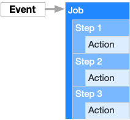
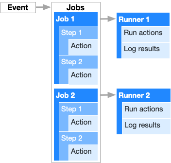

# GitHub Actions로 프론트엔드 CI/CD 구축하기

<br>

1. GitHub Actions: Workflow 등록, Runner, Jobs, Steps, Actions, Workflow 파일 작성
2. GitHub Actions 환경 캐싱하기
3. 환경변수 세팅하기

<br>

## 1. GitHub Actions

GitHub Actions는 Workflow 자동화 도구입니다. 테스트, 빌드, 배포뿐만 아니라 원하는 어떤 작업이던 Workflow에 포함시켜서 자동화할 수 있습니다. 한 번에 같이 실행시킬 일들을 모아 하나의 Job으로 구성해놓고요, `push`, `pull_request` 등 특정 [이벤트](https://docs.github.com/en/actions/learn-github-actions/events-that-trigger-workflows)가 발생했을 때 Job을 실행합니다. 예를 들어, 누군가 특정 브랜치에 PR(Pull request)을 생성하는 이벤트가 발생하면, 테스트 스크립트가 자동으로 실행되게 할 수 있습니다.

<br>



<br>

### 1-1. Workflow 등록

실행할 Workflow는 `yml`(Yaml) 포맷 파일로 작성하여 프로그램의 `/.github/workflows/` 경로에 둡니다. 이 파일 작성을 완료하고 GitHub 레포지토리에 `push`하면 완료입니다. 이후부터 파일에 설정한대로 Workflow가 자동으로 작동합니다. 또는 GitHub 레포지토리의 *Actions* 탭으로 이동, Workflow 셋업 버튼을 클릭하여 GitHub에서 해당 파일을 직접 생성할 수 있습니다. 다음은 GitHub에서 제공하는 샘플 파일입니다.

```yml
# This is a basic workflow to help you get started with Actions

name: CI

# Controls when the workflow will run
on:
  # Triggers the workflow on push or pull request events but only for the master branch
  push:
    branches: [ master ]
  pull_request:
    branches: [ master ]

  # Allows you to run this workflow manually from the Actions tab
  workflow_dispatch:

# A workflow run is made up of one or more jobs that can run sequentially or in parallel
jobs:
  build:
    # The type of runner that the job will run on
    runs-on: ubuntu-latest

    # Steps represent a sequence of tasks that will be executed as part of the job
    steps:
      # Checks-out your repository under $GITHUB_WORKSPACE, so your job can access it
      - uses: actions/checkout@v2

      # Runs a single command using the runners shell
      - name: Run a one-line script
        run: echo Hello, world!

      # Runs a set of commands using the runners shell
      - name: Run a multi-line script
        run: |
          echo Add other actions to build,
          echo test, and deploy your project.

```

<br>

### 1-2. GitHub Actions는 어떻게 작동하는걸까: Runner

Runner는 [Job의 실행 환경](https://github.com/actions/runner)이 설치된 서버를 말합니다. GitHub에서 호스팅하는 Runner를 사용할 수 있고요, 직접 Runner를 호스팅해도 됩니다. GitHub에서 호스팅하는 Runner는 가상머신의 형태로 제공되고요, Ubuntu Linux, Windows, macOS 환경을 지원합니다. [About GitHub-hosted runners](https://docs.github.com/en/actions/using-github-hosted-runners/about-github-hosted-runners) 문서에서 더 자세한 설명과 OS별 하드웨어 사양, 각 환경을 사용하기 위한 Workflow 파일 내 설정값 등을 확인할 수 있습니다. 사용할 Runner를 Workflow 파일에 명시하면 Workflow가 실행될 때 해당 Runner가 사용됩니다. 예를 들어, macOS Big Sur 11 환경을 사용하려면 `runs-on` 항목에 `macos-11`이라고 지정하면 됩니다.

```yml
# main.yml
jobs:
  build:
    runs-on: macos-11
```

<br>

### 1-3. Jobs, Steps, Actions

#### 1-3-1. Jobs

이벤트가 발생했을 때 여러 개의 Job들이 실행되도록 Workflow를 구성할 수 있습니다. 각 Job은 지정한 Runner 위에서 실행됩니다.

<br>



<br>

기본적으로 Job들은 순차가 아닌 병렬적으로 실행됩니다. 하지만 `needs` 항목을 사용해 특정 Job이 성공했을 때만 다른 Job이 실행되도록 순차 지정할 수도 있습니다.

```yml
jobs:
  build:
    needs: setup # setup이 끝나야 build가 실행됩니다
```

<br>

[Reusing workflows](https://docs.github.com/en/actions/learn-github-actions/reusing-workflows)에 따르면, Workflow에서 다른 Workflow를 참조하도록 해서 마치 [SPA](https://en.wikipedia.org/wiki/Single-page_application)의 컴포넌트처럼 Workflow를 재사용할 수 있습니다.

<br>

#### 1-3-2. Steps

Step은 Job 내에서 개별 업무들을 말합니다. Step이라는 이름처럼 지정한 순서대로 단계적으로 실행됩니다. Step은 하나의 [Action](./#actions)이 될 수도 있고, Shell 커맨드가 될 수도 있습니다.

<br>

#### 1-3-3. Actions

Action은 Workflow를 이루는 가장 작은 Work 단위입니다. Action을 직접 만들거나, [GitHub 커뮤니티에서 제공하는 Action](https://github.com/marketplace?type=actions)들을 사용할 수 있습니다.

<br>

### 1-4. Workflow 파일 작성

#### 1-4-1. 최상위 레벨 항목: `name`, `on`, `jobs`

Workflow 파일의 가장 상위 레벨 항목들은 다음과 같습니다. 모든 항목과 하위 항목에 대한 파일 작성 문법은 [Workflow syntax for GitHub Actions](https://docs.github.com/en/actions/learn-github-actions/workflow-syntax-for-github-actions#onpushpull_requestpaths) 문서에서 확인할 수 있습니다.

- `name`: GitHub Actions 탭에 표시되는 Workflow의 이름입니다. Optional 항목입니다.
- `on`: Workflow를 자동으로 실행할 이벤트를 지정합니다. 이벤트 종류는 [Events that trigger workflows](https://docs.github.com/en/actions/learn-github-actions/events-that-trigger-workflows)
- `jobs`: 이 항목에 실행할 모든 Job들을 지정하면 됩니다.

<br>

```yml
name: CI
on: [push]
jobs:
  # job들을 여기에 작성합니다
```

<br>

#### 1-4-2. Job 구성 항목: `needs`, `runs-on`, `strategy: matrix`, `steps`

- `needs`: 다른 Job이 성공해야만 실행되도록 의존성을 갖게 합니다.
- `runs-on`: Job을 실행할 Runner를 지정합니다.
- `strategy: matrix` : Job을 여러 환경에서 테스트하기 위해 Matrix를 지정합니다.
- `steps`: Job 내에서 실행될 Step들을 순서대로 지정합니다.

```yml
jobs:
  build: # job 이름
    needs: setup # setup이 성공해야 이 job도 실행됩니다
    runs-on: macos-11 # runner
    strategy:
      matrix:
        node: [8, 10, 14] # node 8, 10, 14 환경에서 각각 job을 실행합니다
    steps: # step들을 여기에 작성합니다
      - uses: actions/setup-node@v1
        with:
          node-version: ${{ matrix.node }} # matrix의 항목 값이 사용됩니다
```

<br>

#### 1-4-3. Step 구성 항목: `name`, `uses`, `run`

각 스텝은 하이픈(`-`)을 사용하여 단계를 구분합니다. `step`을 구성하는 모든 문법은 [Workflow Syntax](https://docs.github.com/en/actions/learn-github-actions/workflow-syntax-for-github-actions#jobsjob_idstepsrun) 문서에서 확인하세요.

- `name`: GitHub Actions 탭에 표시되는 각 Step의 이름을 지정합니다. Optional 값입니다.
- `uses`: 사용할 Action을 지정합니다. 커뮤니티 Action들은 이름에 `actions/` Prefix를 사용합니다.
- `run`: Runner에서 실행할 커맨드를 지정합니다.

<br>

가령 아래와 같이 작성하면, 총 3 단계의 `steps`가 구성되는 겁니다.

```yml
steps:
  - name: Checkout # step 1
    uses: actions/checkout@v2 
  - name: Setup Node.js # step 2
    uses: actions/setup-node@v2
    with:
      node-version: [ 14.x ]
  - name: Install Dependencies # step 3
    run: npm install -g yarn
```

1. `actions/checkout@v2`를 사용해서 이 레파지토리에 체크아웃, Runner에 다운로드
2. `actions/setup-node@v2`를 사용해서 Runner에 `14` 버전의 `node` 설치 
3. `node`와 함께 설치될 `npm` 커맨드를 실행한다는 뜻입니다.

<br>

## 2. GitHub Actions 환경 캐싱하기

GitHub Actions는 Runner에 매번 새롭게 환경을 셋업하고 Workflow를 실행하므로, 종속성 파일들을 캐싱하여 테스트와 빌드 속도를 높일 수 있습니다. 캐시를 생성하면 해당 레파지토리의 모든 Workflow에서 사용할 수 있습니다. 커뮤니티의 [actions/cache@v2](https://github.com/actions/cache)를 사용해서 캐싱 Step을 만들 수 있고요, 아래는 [Node - Yarn 캐싱 예시](https://github.com/actions/cache/blob/main/examples.md#node---yarn)입니다.

<br>

```yml
- name: Get yarn cache directory path
  id: yarn-cache-dir-path
  run: echo "::set-output name=dir::$(yarn cache dir)"

- uses: actions/cache@v2
  id: yarn-cache # use this to check for `cache-hit` (`steps.yarn-cache.outputs.cache-hit != 'true'`)
  with:
    path: ${{ steps.yarn-cache-dir-path.outputs.dir }}
    key: ${{ runner.os }}-yarn-${{ hashFiles('**/yarn.lock') }}
    restore-keys: |
      ${{ runner.os }}-yarn-
```

<br>

## 3. 환경변수 세팅하기

자세한 내용은 [Environment variables](https://docs.github.com/en/actions/learn-github-actions/environment-variables) 문서를 참고하세요.

<br>

---

### References

- [Understanding GitHub Actions](https://docs.github.com/en/actions/learn-github-actions/understanding-github-actions)
- [About GitHub-hosted runners](https://docs.github.com/en/actions/using-github-hosted-runners/about-github-hosted-runners)
- [Essential features of GitHub Actions](https://docs.github.com/en/actions/learn-github-actions/essential-features-of-github-actions)
- [Github Actions으로 배포 자동화하기 | NHN Cloud Meetup](https://meetup.toast.com/posts/286)
- [[Github Action] Github Action 맛보고, AWS S3에 Vue 자동으로 배포하기 | 빈이의 개발 블로그](https://bin-e.tistory.com/44)
