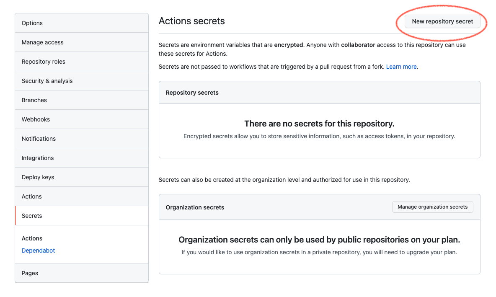
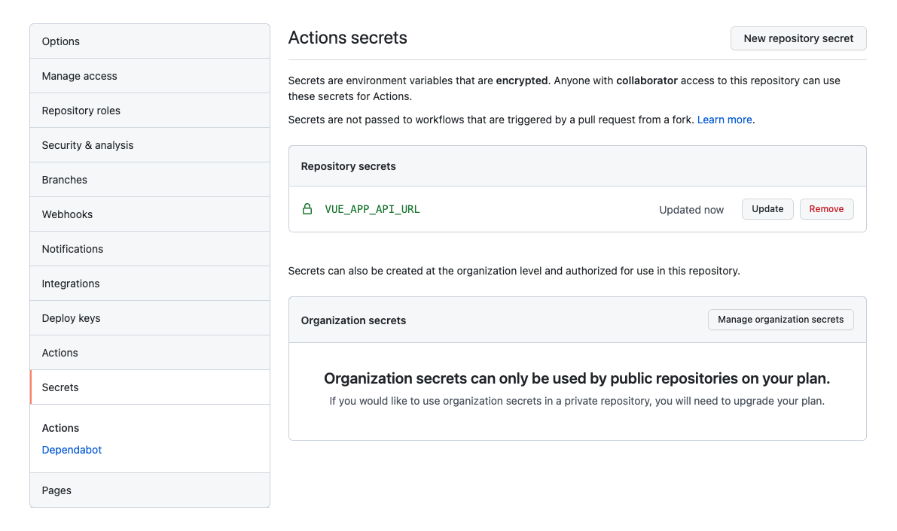

# GitHub Webhook으로 코드 컨벤션 체크, Actions로 프론트엔드 CI/CD 구축하기

<br>

1. GitHub Actions란, Workflow 등록하기](./#user-content-1-github-actions란-workflow-등록하기
2. GitHub Actions 워킹 프로세스: Runner, Jobs, Steps, Actions
3. Workflow 파일 작성하기
4. 재사용하기: Reusable Workflow, Runner 환경 캐싱하기
5. 환경변수 사용하기: 직접 세팅, GitHub 디폴트 환경변수
6. 컨텍스트 변수 사용하기, 환경변수와의 차이점
7. `secrets` 컨텍스트를 사용하여 환경변수 세팅하기
8. CI: Webhook으로 코드 컨벤션 자동 체크, Actions로 테스트와 PR 자동화하기
9. CD: SSH로 원격 서버에 접속해서 배포하기

<br>

## 1. GitHub Actions란, Workflow 등록하기

GitHub Actions는 Workflow 자동화 도구입니다. 테스트, 빌드, 배포뿐만 아니라 원하는 어떤 작업이던 Workflow에 포함시켜서 자동화할 수 있습니다. 한 번에 같이 실행시킬 일들을 모아 하나의 Job으로 구성해놓고요, `push`, `pull_request` 등 특정 [이벤트](https://docs.github.com/en/actions/learn-github-actions/events-that-trigger-workflows)가 발생했을 때 Job을 실행합니다. 예를 들어, 누군가 특정 브랜치에 PR(Pull request)을 생성하는 이벤트가 발생하면, 테스트 스크립트가 자동으로 실행되게 할 수 있습니다.

<br>


<br>

실행할 Workflow는 `yml`(Yaml) 포맷 파일로 작성하여 프로그램의 `/.github/workflows/` 경로에 둡니다. 이 파일 작성을 완료하고 GitHub 레포지토리에 `push`하면 완료입니다. 이후부터 파일에 설정한대로 Workflow가 자동으로 작동합니다. 또는 GitHub 레포지토리의 *Actions* 탭으로 이동, Workflow 셋업 버튼을 클릭하여 GitHub에서 해당 파일을 직접 생성할 수 있습니다. 다음은 GitHub에서 제공하는 샘플 파일입니다.

```yml
# This is a basic workflow to help you get started with Actions

name: CI

# Controls when the workflow will run
on:
  # Triggers the workflow on push or pull request events but only for the master branch
  push:
    branches: [ master ]
  pull_request:
    branches: [ master ]

  # Allows you to run this workflow manually from the Actions tab
  workflow_dispatch:

# A workflow run is made up of one or more jobs that can run sequentially or in parallel
jobs:
  build:
    # The type of runner that the job will run on
    runs-on: ubuntu-latest

    # Steps represent a sequence of tasks that will be executed as part of the job
    steps:
      # Checks-out your repository under $GITHUB_WORKSPACE, so your job can access it
      - uses: actions/checkout@v2

      # Runs a single command using the runners shell
      - name: Run a one-line script
        run: echo Hello, world!

      # Runs a set of commands using the runners shell
      - name: Run a multi-line script
        run: |
          echo Add other actions to build,
          echo test, and deploy your project.

```

<br>

## 2. GitHub Actions 워킹 프로세스: Runner, Jobs, Steps, Actions

### 2-1. Runner

Runner는 [Job의 실행 환경](https://github.com/actions/runner)이 설치된 서버를 말합니다. GitHub에서 호스팅하는 Runner를 사용할 수 있고요, 직접 Runner를 호스팅해도 됩니다. GitHub에서 호스팅하는 Runner는 가상머신의 형태로 제공되고요, Ubuntu Linux, Windows, macOS 환경을 지원합니다. [About GitHub-hosted runners](https://docs.github.com/en/actions/using-github-hosted-runners/about-github-hosted-runners) 문서에서 더 자세한 설명과 OS별 하드웨어 사양, 각 환경을 사용하기 위한 Workflow 파일 내 설정값 등을 확인할 수 있습니다. 사용할 Runner를 Workflow 파일(`yml`)에 명시하면 Workflow가 실행될 때 해당 Runner가 사용됩니다. 예를 들어, macOS Big Sur 11 환경을 사용하려면 `runs-on` 항목에 `macos-11`이라고 지정하면 됩니다.

```yml
jobs:
  build:
    runs-on: macos-11
```

<br>

### 2-2. Jobs, Steps, Actions

#### 2-2-1. Jobs

이벤트가 발생했을 때 여러 개의 Job들이 실행되도록 Workflow를 구성할 수 있습니다. 각 Job은 지정한 Runner 위에서 실행됩니다.

<br>


<br>

기본적으로 Job들은 순차가 아닌 병렬적으로 실행됩니다. 하지만 `needs` 항목을 사용해 특정 Job이 성공했을 때만 다른 Job이 실행되도록 순차 지정할 수도 있습니다.

```yml
jobs:
  build:
    needs: setup # setup이 끝나야 build가 실행됩니다
```

<br>

#### 2-2-2. Steps

Step은 Job 내에서 개별 업무들을 말합니다. Step이라는 이름처럼 지정한 순서대로 단계적으로 실행됩니다. Step은 하나의 [Action](./#actions)이 될 수도 있고, Shell 커맨드가 될 수도 있습니다.

<br>

#### 2-2-3. Actions

Action은 Workflow를 이루는 가장 작은 Work 단위입니다. Action을 직접 만들거나, [GitHub 커뮤니티에서 제공하는 Action](https://github.com/marketplace?type=actions)들을 사용할 수 있습니다. 레포지토리 체크아웃, `node` 설치 등 기본적인 거의 모든 동작과 셋업 Action들이 커뮤니티에서 이미 제공되고 있습니다.

<br>

## 3. Workflow 파일 작성하기

이제 Workflow 파일 예제를 작성해보면서 파일을 구성하는 기본적인 문법들을 정리하려고 합니다.

<br>

### 3-1. 최상위 레벨: `name`, `on`, `jobs`

Workflow 파일의 가장 상위 레벨 키들은 다음과 같습니다. 모든 키와 하위 키에 대한 파일 작성 문법은 [Workflow syntax for GitHub Actions](https://docs.github.com/en/actions/learn-github-actions/workflow-syntax-for-github-actions#onpushpull_requestpaths) 문서에서 확인할 수 있습니다.

- `name`: GitHub Actions 탭에 표시되는 Workflow의 이름입니다. Optional 키.
- `on`: Workflow를 트리거할 이벤트를 지정합니다. 이벤트 종류는 [Events that trigger workflows](https://docs.github.com/en/actions/learn-github-actions/events-that-trigger-workflows), 브랜치 제한 문법은 [`on.<push|pull_request>.<branches|tags>`](https://docs.github.com/en/actions/learn-github-actions/workflow-syntax-for-github-actions#onpushpull_requestbranchestags)을 확인하세요.
- `jobs`: 이 Workflow에서 실행할 모든 Job들을 지정하면 됩니다.

<br>

다음과 같이 작성하면 조건에 해당하는 브랜치에 `push` 되었을 때 `CI` Workflow가 시작됩니다. 예를 들어, 로컬에서 `feature/#23/MEAL-14` 브랜치를 만들어서 작업한 후 레포지토리로 `push`하면 Workflow가 시작됩니다.

```yml
# test.yml
name: CI
on:
  push:
    branches:
      - 'feature/**'
      - 'hotfix/**'
jobs:
  # ...
```

<br>

### 3-2. Job 구성: `needs`, `runs-on`, `strategy: matrix`, `steps`

- `needs`: 다른 Job이 성공해야만 실행되도록 의존성을 갖게 합니다.
- `runs-on`: Job을 실행할 Runner를 지정합니다.
- `strategy: matrix` : Job을 여러 환경에서 테스트하기 위해 Matrix를 지정합니다. `matrix` 컨텍스트를 통해 여기서 지정한 값에 접근할 수 있습니다.
- `steps`: Job 내에서 실행될 Step들을 순서대로 지정합니다.

```yml
jobs:
  test: # job 이름
    runs-on: macos-11 # runner
    strategy:
      matrix:
        node-version: [8, 10, 14] # node 8, 10, 14 환경에서 각각 job을 실행합니다
    steps:
      # ...

  build: # job 이름
    needs: setup # test가 성공해야 build도 실행됩니다
    runs-on: macos-11 
    steps:
    # ...
```

<br>

### 3-3. Step 구성: `name`, `uses`, `run`

각 Step은 하이픈(`-`)을 사용하여 단계를 구분합니다. 더 자세한 문법은 [Workflow Syntax](https://docs.github.com/en/actions/learn-github-actions/workflow-syntax-for-github-actions#jobsjob_idstepsrun) 문서에서 확인하세요.

- `name`: GitHub Actions 탭에 표시되는 각 Step의 이름을 지정합니다.
- `id`: 다른 Step에서 특정 Step을 참조할 때 사용됩니다. `steps` 컨텍스트를 통해 접근합니다.
- `uses`: 사용할 Action을 지정합니다.
- `with`: Action를 사용할 때 필요한 키 값들을 지정할 때 사용합니다.
- `run`: Runner에서 실행할 Shell 커맨드를 지정합니다.

<br>

만약 아래와 같이 작성하면, 총 4 단계의 Step으로 구성된 `setup` Job이 완성됩니다.

```yml
jobs:
  setup:
    runs-on: macos-11
    strategy:
      matrix:
        node-version: [8, 10, 14] # or [ 8.x, 10.x, 14.x ]
    steps:
      - name: Checkout repo and download # step 1
        uses: actions/checkout@v2 

      - name: Install node # step 2
        uses: actions/setup-node@v2
        with:
          node-version: ${{ matrix.node-version }}

      - name: Install yarn # step 3
        run: npm install -g yarn

      - name: Install all dependencies using yarn # step 4
        run: yarn install
```

<br>

## 4. 재사용하기: Reusable Workflow, Runner 환경 캐싱하기

### 4-1. Reusable Workflow

여러 Workflow에서 동일한 작업이 사용되어 작업이 중복될 때 이를 피하기 위해 Workflow를 재사용할 수 있습니다. 아직 베타 단계이며 몇가지 제한이 있기 때문에 [Reusing workflows](https://docs.github.com/en/actions/learn-github-actions/reusing-workflows) 문서를 꼼꼼히 확인하세요. 제한사항 중 주목할만한 것은 `env` 컨텍스트를 공유할 수 없다는 것, 재사용 Workflow에서 다른 재사용 Workflow를 사용할 수 없다는 것입니다.

<br>

### 4-2. Runner 환경 캐싱하기

GitHub Actions는 Runner에 매번 새롭게 환경을 셋업하고 Workflow를 실행하므로, 종속성 파일들을 캐싱하여 테스트와 빌드 속도를 높일 수 있습니다. 캐시를 생성하면 해당 레포지토리의 모든 Workflow에서 사용할 수 있고요. 커뮤니티의 [actions/cache@v2](https://github.com/actions/cache)를 사용해서 특정 경로와 파일을 캐싱하는 Step을 만들 수 있습니다. 예로, 패키지들이 설치된 `node_modules` 경로와 `yarn`의 전역 설치 경로를 캐싱할 수 있겠죠. 아래는 [Node - Yarn 캐싱 예시](https://github.com/actions/cache/blob/main/examples.md#node---yarn)입니다.

<br>

```yml
- name: Get yarn cache directory path
  id: yarn-cache-dir-path
  run: echo "::set-output name=dir::$(yarn cache dir)"

- uses: actions/cache@v2
  id: yarn-cache # use this to check for `cache-hit` (`steps.yarn-cache.outputs.cache-hit != 'true'`)
  with:
    path: ${{ steps.yarn-cache-dir-path.outputs.dir }}
    key: ${{ runner.os }}-yarn-${{ hashFiles('**/yarn.lock') }}
    restore-keys: |
      ${{ runner.os }}-yarn-
```

<br>

Use Case로는 [Github Actions으로 배포 자동화하기 | NHN Cloud Meetup](https://meetup.toast.com/posts/286)가 도움이 되었습니다.

<br>

## 5. 환경변수 사용하기: 직접 세팅, GitHub 디폴트 환경변수

### 5-1. 직접 세팅

Step, Job, 또는 Workflow 전체를 위한 환경변수를 범위에 맞게 만들어 사용할 수 있습니다. 원하는 범위에서 `env` 키워드를 사용하여 정의하면 되고요, 동명의 환경변수가 사용될 때는 Step > Job > Workflow 순으로 우선합니다. Workflow 레벨에서 정의한 환경변수와 동일한 이름의 환경변수를 Step 레벨에서 정의할 경우, 해당 Step이 실행되는 동안 Step에서 정의한 환경변수 값이 Workflow 레벨에서 정의한 값을 덮어씁니다.

```yml
jobs:
  test:
    runs-on: macos-11
    env:
      MODE: test
    steps:
      - name: "Set environment variables to test Vue app"
        if: ${{ env.MODE == 'test' }} # env 컨텍스트에서 참조합니다
        env:
          USER_NAME: Tester
        run: echo "User name is $USER_NAME"
```

<br>

Workflow 파일 내에서 정의된 환경변수 값을 사용하려면 `env` 컨텍스트를 사용하여 접근합니다. 예를 들어, `MODE` 환경변수를 사용한다고 가정했을 때 `env.MODE` 이런식으로요. 위 예제에서 [`if`](https://docs.github.com/en/actions/learn-github-actions/workflow-syntax-for-github-actions#jobsjob_idif) 항목 부분을 참고하세요. `run` 키를 사용하여 Runner에서 직접 커맨드를 실행할 때는, 해당 Runner 내에서 정의한 환경변수를 `env` 컨텍스트 없이 `$NODE` 이렇게 참조합니다. 자세한 내용은 [Environment variables](https://docs.github.com/en/actions/learn-github-actions/environment-variables) 문서를 참고하세요.

> If you use the workflow file's run key to read environment variables from within the runner operating system (as shown in the example above), the variable is substituted in the runner operating system after the job is sent to the runner. For other parts of a workflow file, you must use the env context to read environment variables; this is because workflow keys (such as if) require the variable to be substituted during workflow processing before it is sent to the runner.

<br>

### 5-2. GitHub 디폴트 환경변수

기본적인 값들은 GitHub에서 디폴트 환경변수로 제공합니다. 공식문서의 [Default environment variables](https://docs.github.com/en/actions/learn-github-actions/environment-variables#default-environment-variables) 섹션에서 모든 디폴트 환경변수 목록을 확인할 수 있습니다.

<br>

## 6. 컨텍스트 변수 사용하기, 환경변수와의 차이점

GitHub Actions는 [컨텍스트](https://docs.github.com/en/actions/learn-github-actions/contexts) 변수도 제공합니다. 예를 들어, 현재 Runner의 OS 정보를 참조하려면 `runner.os` 변수를 사용합니다. 이 컨텍스트 변수들은 [디폴트 환경변수](https://docs.github.com/en/actions/learn-github-actions/environment-variables#default-environment-variables)들과 꽤 겹치는데요, 각각 다른 용도로 의도되었습니다.

- 디폴트 환경변수 : 현재 실행중인 Job의 Runner 내에서만 존재
- 컨텍스트 변수 : Workflow의 어느 곳에서나 사용 가능

<br>

다음은 이 둘의 차이점을 나타내는 예시입니다. 디폴트 환경변수는 실행중인 현재 Job에 대한 정보만 제공하는 것이 포인트입니다.

```yml
name: CI
on: push
jobs:
  prod-check:
    if: ${{ github.ref == 'refs/heads/main' }}
    runs-on: ubuntu-latest
    steps:
      - run: echo "Deploying to production server on branch $GITHUB_REF"
```

<br>

## 7. `secrets` 컨텍스트를 사용하여 환경변수 세팅하기

프로그램에서 사용하는 민감한 정보를 관리하는 방법 중 GitHub의 [Secrets](https://docs.github.com/en/actions/security-guides/encrypted-secrets)가 있습니다. 가령, Vue 앱에서 사용할 API의 도메인(`VUE_APP_API_URL`)을 Secrets를 사용하여 안전하게 보관하고 공유할 수 있습니다. Secret을 추가할 레포지토리에서 *Settings* 탭으로 이동, *Secrets* 메뉴에서 *New repository secret* 버튼을 클릭하여 Secret을 추가합니다.



<br>



<br>

Secret은 GitHub Actions의 Workflow를 구성할 때 `secrets` 컨텍스트를 사용해서 참조할 수 있습니다. 위 예시에서 Secret으로 추가한 `VUE_APP_API_URL` 값은 다음과 같이 불러올 수 있습니다.

```yml
steps:
  - name: Set environment variables
    env: 
      VUE_APP_API_URL: ${{ secrets.VUE_APP_API_URL }}
```

<br>

## 8. CI: Webhook으로 코드 컨벤션 자동 체크, Actions로 테스트와 PR 자동화하기

우리팀은 [Vue2](https://kr.vuejs.org/v2/guide/index.html), [Yarn](https://yarnpkg.com/)을 사용하고, [GitFlow](https://nvie.com/posts/a-successful-git-branching-model/)를 변형한 브랜치 전략을 사용합니다.

<br>

### 8-1. Webhook으로 코드 컨벤션 자동 체크하기

GitHub [Webhook](https://docs.github.com/en/developers/webhooks-and-events/webhooks/about-webhooks)을 사용해서 개발자가 코드를 커밋할 때 코드 컨벤션을 자동으로 체크한 후, 컨벤션을 통과해야만 커밋되도록 할 수 있습니다. 저는 Webhook 스크립트를 모아서 관리할 수 있게 해주는 [`yorkie`](https://github.com/yyx990803/yorkie)를 사용했고요, 코드 컨벤션 체크는 [`lint-staged`](https://www.npmjs.com/package/lint-staged)를 사용했습니다. `package.json`에 다음과 같이 항목을 추가하면, `git commit`을 시도할 때마다 `lint-staged`가 실행됩니다.

```json
"gitHooks": {
  "pre-commit": "lint-staged"
}
```

<br>

다음은 `lint-staged` 설정파일인 `lint-staged.config.js` 예제입니다.

```javascript
module.exports = {
  '*.js': ['yarn lint:eslint', 'yarn lint:prettier', 'yarn test:unit:file'],
  '{!(package)*.json,*.code-snippets,.!(browserslist)*rc}': [
    'yarn lint:prettier --parser json',
  ],
  'package.json': ['yarn lint:prettier'],
  '*.vue': [
    'yarn lint:eslint',
    'yarn lint:stylelint',
    'yarn lint:prettier',
    'yarn test:unit:file',
  ],
  '*.scss': ['yarn lint:stylelint', 'yarn lint:prettier'],
  '*.md': ['yarn lint:markdownlint', 'yarn lint:prettier'],
  // '*.{png,jpeg,jpg,gif,svg}': ['imagemin-lint-staged'],
}
```

<br>

### 8-2. Actions로 테스트와 PR 자동화하기

저는 다음의 3가지 Workflow 파일들을 만들어서 CI를 완성했고요, 다음 순서대로 하위 섹션에서 자세히 다룹니다.

1. `reusable-test.yml`: 자동으로 실행환경을 셋업하고 단위 테스트를 실행
2. `develop.yml`: `feature`/`hotfix` 브랜치에 한해 `push` 이벤트가 발생했을 때, `reusable-test.yml`을 호출해서 테스트한 후 `develop` 브랜치로 PR을 생성
3. `master.yml`: `develop` 브랜치의 PR이 머지되어 종료되었을 때, `reusable-test.yml`을 호출해서 테스트한 후 `master` 브랜치로 PR을 생성

<br>

#### `reusable-test.yml`

재사용 Workflow를 만듭니다. 자세한 문법은 [Reusing workflows](https://docs.github.com/en/actions/learn-github-actions/reusing-workflows)를 참고합니다.

```yml
name: Reusable - setup and test
on:
  workflow_call:
    secrets:
      token:
        required: false
jobs:
  test:
    runs-on: macos-11
    strategy:
      matrix:
        node-version: [ 14.x ]
    steps:
      - name: Checkout repo and download # step 1
        uses: actions/checkout@v2 

      - name: Install node # step 2
        uses: actions/setup-node@v2
        with:
          node-version: ${{ matrix.node-version }}

      - name: Install yarn # step 3
        run: npm install -g yarn

      - name: Set environment variables # step 4
        env: 
          VUE_APP_API_URL: ${{ secrets.VUE_APP_API_URL }}

      - name: Install all dependencies using yarn # step 5
        run: yarn install

      - name: Do unit test # step 6
        run: yarn test:unit

      - name: Do build test # step 7
        run: yarn build
```

1. `actions/checkout@v2`를 사용해서 이 레포지토리에 체크아웃, Runner에 다운로드
2. `actions/setup-node@v2`를 사용해서 Runner에 `8`/`10`/`14` 버전의 `node` 설치
3. `node`와 함께 설치될 `npm` 커맨드를 사용해서 `yarn`을 설치
4. `secrets` 컨텍스트를 사용해서 환경변수 세팅
5. `yarn` 커맨드를 사용해서 의존하는 모든 패키지를 설치
6. `test:unit` 스크립트를 실행해서 단위 테스트를 진행
7. `build` 스크립트를 실행해서 빌드를 진행 (빌드 테스트를 위해)

<br>

#### `develop.yml`

테스트를 위해 Reusable Workflow를 호출합니다. `uses` 키를 사용하고, `{owner}/{repo}/{path}/{filename}@{ref}` 문법으로 참조합니다. 그 다음, `pr` Job은 다음 3단계로 구성합니다.

1. 레포지토리에 체크아웃 및 다운로드
2. `chuhlomin/render-template@v1.2`를 사용해서 PR 템플릿을 사용하여 PR 메시지 완성
3. `peter-evans/create-pull-request@v3`를 사용해서 코드리뷰를 위한 PR을 생성

<br>

```yml
name: CI - feature & hotfix test
on:
  push:
    branches:
      - 'feature/**'
      - 'hotfix/**'
jobs:
  call-test:
    uses: meallo/meallo_vip/.github/workflows/reusable-test.yml@v1
  pr:
    needs: call-test
    runs-on: macos-11
    steps:
      - name: Checkout repo and download # step 1
        uses: actions/checkout@v2 

      - name: Render PR template # step 2
        id: template
        uses: chuhlomin/render-template@v1.2 # https://github.com/chuhlomin/render-template
        with:
          template: .github/PULL_REQUEST_TEMPLATE/develop.md
          var: |
            works: ...
            context: ...

      - name: Create PR to develop # step 3
        uses: peter-evans/create-pull-request@v3 # https://github.com/marketplace/actions/create-pull-request
        with:
          title: ${{ .. }}
          body: ${{ steps.template.outputs.result }}
          branch: develop
          delete-branch: false
          reviewers: ${{ secrets.DEVELOP_REVIEWER }}
```

<br>

#### `master.yml`

`feature`, `develop`, `release` 브랜치들이 PR을 통과하여 `develop` 브랜치로 머지될 때마다 `reusable-test.yml` Workflow를 호출하여 마지막 테스트를 진행한 후, `master` 브랜치로 자동 PR을 생성하도록 합니다.

```yml
name: CI - test and pr to master
on:
  pull_request:
    branches: [ develop ]
    types: [ closed ]
jobs:
  call-test:
    uses: meallo/meallo_vip/.github/workflows/reusable-test.yml@v1
  master-pr:
    needs: call-test
    runs-on: macos-11
    steps:
      - name: Checkout repo and download # step 1
        uses: actions/checkout@v2 

    steps:
      - name: Render PR template # step 2
        id: template
        uses: chuhlomin/render-template@v1.2
        with:
          template: .github/PULL_REQUEST_TEMPLATE/master.md
          var: |
            description: ..

      - name: Create PR to master # step 3
        uses: peter-evans/create-pull-request@v3
        with:
          title: PR to master
          body: ${{ steps.template.outputs.result }}
          branch: master
          delete-branch: false
          reviewers: ${{ secrets.MASTER_REVIEWER }}
```

<br>

## 9. CD: SSH로 원격 서버에 접속해서 배포하기

[`appleboy/ssh-action`](https://github.com/marketplace/actions/ssh-remote-commands)과 같이 쉽게 SSH 접속을 지원하는 써드파티 Action들이 있기는 하지만, 원격 서버에서 실행할 Shell 커맨드들을 하나의 Step에 묶어야하는 등 제한이 따릅니다. 저는 Job을 여러 단계의 Step으로 나누고싶어서 `ssh` 커맨드를 직접 실행하는 방법으로 CD 구축을 했습니다.

<br>

### 9-1. 원격 서버에 SSH 키가 있는지 확인하기

일단 비밀번호를 사용하여 원격 서버에 SSH 접속을 합니다!

```zsh
ssh username@host
```

<br>

보통 SSH 키는 기본적으로 `~/.ssh` 디렉토리에 있습니다. 접속한 원격 서버에서 이 디렉토리를 리스팅해보면 이미 SSH 키가 존재하는지 확인할 수 있습니다. 만약 `id_rsa`와 같은 이름의 파일과 동일한 파일명의 `.pub` 확장자 파일이 하나 더 있다면 SSH 개인키와 공개키가 모두 있는 것입니다. 개인키는 지정된 사용자만 사용할 수 있기 때문에 안전하게 보관해야하는 키이고, 공개키는 어디서나 사용할 수 있는 키입니다. `.pub` 확장자 파일이 공개키 파일입니다.

```zsh
ls ~/.ssh
```

<br>

### 9-2. SSH 키 생성하기: `ssh-keygen`

만약 SSH 키가 없다면 `ssh-keygen`을 사용하여 키를 생성합니다. `ssh-keygen`은 Linux, macOS의 SSH 패키지에 기본으로 포함되어 있기 때문에 바로 사용할 수 있습니다.

```zsh
ssh-keygen -t rsa -b 4096 -C "user@email.com"
```

<br>

위 커맨드에 사용된 옵션들은 각각 다음을 의미하는데요, SSH 키를 생성하면서 기존의 키 파일을 덮어쓰지 않도록 주의해야 합니다. 다른 서버와의 연결에 사용되고 있을 수 있기 때문입니다.

- `-t`: 암호화 타입, 디폴트 값은 `rsa` (RSA 알고리즘 사용)
- `-b`: 암호의 bit 수, 디폴트 값은 `2048`
- `-f`: 저장할 파일 위치와 파일명 (`-f path/file_name`)
- `-C`: 주석

<br>

커맨드를 실행하면 아래와 같이 `passphrase`를 입력란이 나타납니다. 옵션이므로 빈칸으로 진행할 수 있고, 만약 사용한다면 개인키를 사용하여 접속을 시도할 때 비밀번호 입력을 강제합니다.

```zsh
Enter passphrase (empty for no passphrase):
Enter same passphrase again:
```

<br>

키 생성이 완료되면 아래와 같이 안내문구가 출력되고요, 별도로 `-f` 옵션을 명시하지 않았다면 디폴트 파일경로는 `~/.ssh/id_rsa`, `~/.ssh/id_rsa.pub`이 됩니다.

```
Your identification has been saved in /home/user/.ssh/id_rsa.
Your public key has been saved in /home/user/.ssh/id_rsa.pub.
The key fingerprint is:
SHA256:9u5autgLNrHcbF1fnQybvmvxTgGTBxA5+YVtQiVVh+Q estele.choi@gmail.com
The key's randomart image is:
+---[RSA 4096]----+
|           o*=*++|
|           + +=+.|
|            o=E. |
|             .O o|
|      . S   .o +o|
|     . * o ..o ..|
|      * + +  .+. |
|     . * +   .o. |
|      . *=o .oo. |
+----[SHA256]-----+
```

<br>

참고로, 생성된 공개키는 `authorized_keys`에 명시해야 사용할 수 있습니다.

```zsh
cd ~/.ssh
cat id_rsa.pub >> authorized_keys
```

<br>

### 9-3. SSH 개인키를 Github Secret에 등록

개인키는 안전하게 보관하기 위해 Github Secret에 등록합니다. `~/.ssh/id_rsa` 파일을 열어 내용을 모두 복사한 후, Github Secret으로 등록합니다.

<br>

### 9-4. Job 만들기

Github Secret에 SSH 개인키를 등록했다면, 이제 Github Actions Workflow에서 `secrets` 컨텍스트를 통해 해당 값에 접근할 수 있습니다.

```yml
name: CD

on:
  pull_request:
    branches: [ master ]

  # Allows you to run this workflow manually from the Actions tab
  workflow_dispatch:

jobs:
  build:
    runs-on: ubuntu-latest
    steps:
      # 1: Checks-out your repository
      - uses: actions/checkout@v2
      
      # 2: Configure SSH
      - name: Configure SSH
        env:
          PROD_SERVER_IP: ${{ secrets.PROD_SERVER_IP }},
          PROD_SERVER_SSH_USERNAME: ${{ secrets.PROD_SERVER_SSH_USERNAME }},
          PROD_SERVER_SSH_PRIVATEKEY: ${{ secrets.PROD_SERVER_SSH_PRIVATEKEY }}
        run: |
        mkdir -p ~/.ssh/
        touch ~/.ssh/keyname
        echo "$PROD_SERVER_SSH_PRIVATEKEY" > ~/.ssh/keyname
        chmod 600 ~/.ssh/keyname
        cat <<EOF >> ~/.ssh/config
        Host hostname
          HostName $PROD_SERVER_IP
          User $PROD_SERVER_SSH_USERNAME
          IdentityFile ~/.ssh/keyname
          StrictHostKeyChecking no
        EOF

      # 3: Connect to server using SSH, Git-pull
      - name: Git pull
        env:
          GH_USERNAME: ${{ secrets.GH_USERNAME }},
          GH_USEREMAIL: ${{ secrets.GH_USEREMAIL }},
          GH_TOKEN: ${{ github.token }},
        run: |
          ssh hostname 'cd appname && 
          git config user.name $GH_USERNAME && 
          git config user.email $GH_USEREMAIL && 
          git remote set-url origin https://$GH_TOKEN@github.com/organization/appname.git && 
          sudo git pull'

      - name: Set env
        env:
          VUE_APP_API_URL: ${{ secrets.VUE_APP_API_URL }}
        run: |
          ssh hostname 'cd appname && 
          touch .env && 
          echo "VUE_APP_API_URL=$VUE_APP_API_URL" > .env'

      - name: Install packages & Build
        run: ssh hostname 'cd appname && sudo yarn install && sudo yarn build'
```

<br>

#### `Configure SSH`

```yml
  # 2: Configure SSH
  - name: Configure SSH
    env:
      PROD_SERVER_IP: ${{ secrets.PROD_SERVER_IP }},
      PROD_SERVER_SSH_USERNAME: ${{ secrets.PROD_SERVER_SSH_USERNAME }},
      PROD_SERVER_SSH_PRIVATEKEY: ${{ secrets.PROD_SERVER_SSH_PRIVATEKEY }}
    run: |
      mkdir -p ~/.ssh/
      touch ~/.ssh/keyname
      echo "$PROD_SERVER_SSH_PRIVATEKEY" > ~/.ssh/keyname
      chmod 600 ~/.ssh/keyname
      cat <<EOF >> ~/.ssh/config
      Host hostname
        HostName $PROD_SERVER_IP
        User $PROD_SERVER_SSH_USERNAME
        IdentityFile ~/.ssh/keyname
        StrictHostKeyChecking no
      EOF
```

<br>

- `mkdir -p ~/.ssh/` 커맨드를 실행하는 이유는, `ssh` 커맨드를 최초로 사용할 때 `~/.ssh` 디렉토리가 생성되기 때문입니다. 아직 `~/.ssh` 디렉토리가 없기 때문에 생성해줍니다.

- `cat <<EOF >> ~/.ssh/config `: `~/.ssh/config`는 SSH 설정파일입니다. 호스트별로 접속정보를 저장해놓고, 호스트 이름으로 간편하게 참조할 수 있습니다. `<<EOF`는 `EOF` 키워드가 나오기 전까지의 내용을 입력한다는 의미입니다.

```
Host hostname1
    SSH_OPTION value
    SSH_OPTION value

Host hostname2
    SSH_OPTION value

Host *
    SSH_OPTION value
```

<br>
<br>

---

### References

- [Deployment Pipelines (CI/CD) in Software Engineering - Dan Merron](https://www.bmc.com/blogs/deployment-pipeline/#)
- [Understanding GitHub Actions | GitHub Docs](https://docs.github.com/en/actions/learn-github-actions/understanding-github-actions)
- [About GitHub-hosted runners | GitHub Docs](https://docs.github.com/en/actions/using-github-hosted-runners/about-github-hosted-runners)
- [Essential features of GitHub Actions | GitHub Docs](https://docs.github.com/en/actions/learn-github-actions/essential-features-of-github-actions)
- [Reusing workflows | GitHub Docs](https://docs.github.com/en/actions/learn-github-actions/reusing-workflows)
- [About webhooks | GitHub Docs](https://docs.github.com/en/developers/webhooks-and-events/webhooks/about-webhooks)
- [Github Actions으로 배포 자동화하기 | NHN Cloud Meetup](https://meetup.toast.com/posts/286)
- [[Github Action] Github Action 맛보고, AWS S3에 Vue 자동으로 배포하기 | 빈이의 개발 블로그](https://bin-e.tistory.com/44)
- [\<Linux\> SSH key의 기본 작동 원리와 SSH 접속 시 key로 접속하는 법 | DanTheTech](https://danthetech.netlify.app/Backend/configure-ssh-key-based-authentication-on-a-linux-server)
