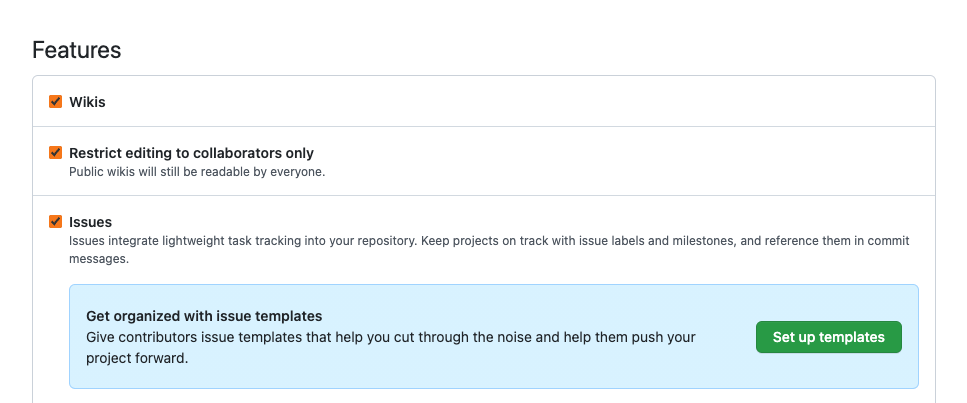
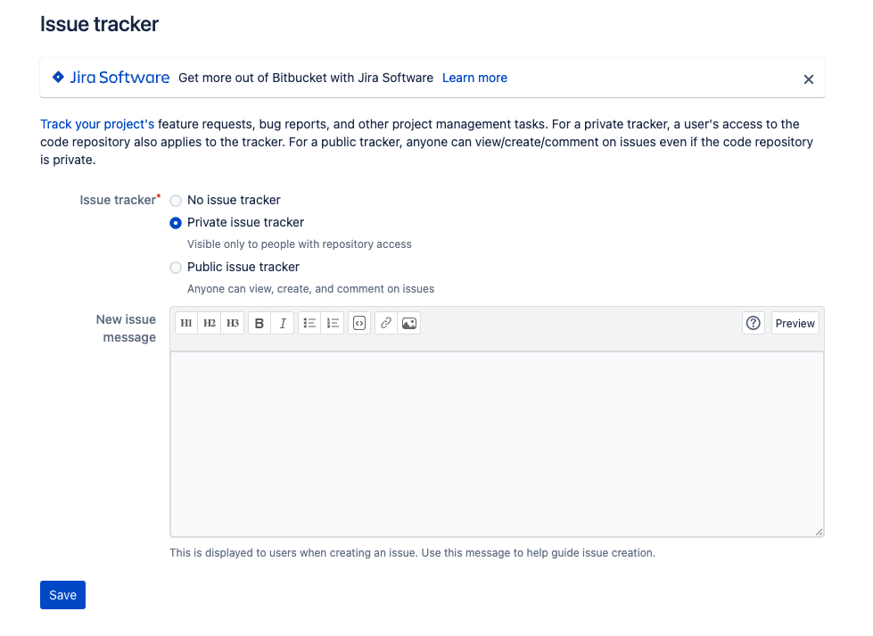
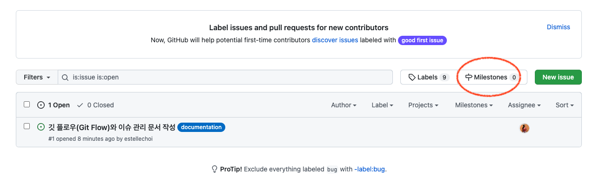
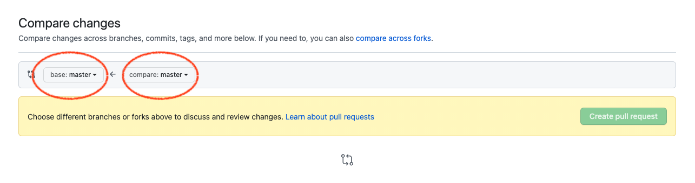
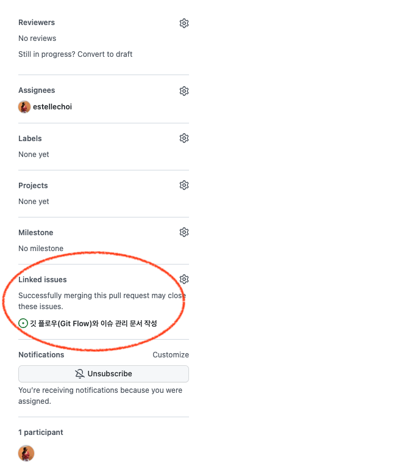

# 깃 플로우(Git Flow)와 이슈 관리, PR(Pull Request)

<br>

1. 깃 플로우(Git Flow)
2. 5개 브랜치: `master`, `develop`, `feature`, `release`, `hotfix`
3. 브랜치 기록 남기기: `merge --no-ff`
4. 기본 사이클 (PR 없을 때)
5. `hotfix` 플로우
6. 브랜치 네이밍 컨벤션
7. 이슈 템플릿 등록하기: Github, Bitbucket, 템플릿 예시
8. 이슈 생성하기: Github, Bitbucket, 이슈 기반 브랜치 만들기
9. 깃 플로우 모델에서 PR(Pull Request) 하기

<br>

## 1. 깃 플로우(Git Flow)

깃 플로우(Git Flow)는 여러명의 개발자들이 협업하는 환경에서 생겨나는 깃(Git)의 브랜치(Branch)간 충돌을 최대한 막고 효율적으로 통합하기 위한 전략 중 하나입니다. 2010년 Vincent Driessen이 블로그를 통해 공개한 [A successful Git branching model](https://nvie.com/posts/a-successful-git-branching-model/) 글에서 시작되었습니다.

<br>


<br>

## 2. 5개 브랜치: `master`, `develop`, `feature`, `release`, `hotfix`

깃 플로우에서는 총 5개 브랜치를 사용하고요, 그 중 `master`, `develop` 브랜치는 정규 브랜치이므로 새로 생성하거나 없애지 않고 하나의 브랜치를 계속 사용합니다. 반면, `feature`, `release`, `hotfix` 브랜치는 정규 브랜치에서 분기하는 브랜치들입니다. 각 브랜치의 작업이 끝나고 정규 브랜치로 머지(`merge`)가 완료되면 제거해도 되는 브랜치들이죠. `feature`, `release` 브랜치는 `develop` 브랜치에서 분기되고요, `hotfix` 브랜치는 `master` 브랜치에서 직접 분기하는 임시 브랜치로, 이미 배포된 버전의 버그를 빠르게 수정하기 위한 브랜치입니다. 

<br>

정규 브랜치

- `master`: 최종 배포되는 브랜치, `release` 브랜치가 머지되면 배포 버전 태그를 붙인 후 배포
- `develop`: `hotfix`를 제외한 모든 변경이 시작되는 브랜치 

<br>

임시 브랜치

- `feature`: 기능을 개발하는 브랜치, `develop` 브랜치에서 기능별로 분기
- `release`: `feature` 브랜치들이 모두 머지된 후 배포 관련 문서작업, 버그 수정 등이 이루어지는 브랜치
- `hotfix`: 배포된 버전의 버그 수정을 위해 `master`에서 직접 분기하고 머지되는 브랜치

<br>

## 3. 브랜치 기록 남기기: `merge --no-ff`

브랜치들을 머지할 때는 `--no-ff` 옵션을 사용하여 브랜치에 대한 기록이 사라지는 것을 방지합니다. 다음은 [A successful Git branching model](https://nvie.com/posts/a-successful-git-branching-model/)에서 발췌한 내용입니다.

> The --no-ff flag causes the merge to always create a new commit object, even if the merge could be performed with a fast-forward. This avoids losing information about the historical existence of a feature branch and groups together all commits that together added the feature.

<br>


<br>

## 4. 기본 사이클 (PR 없을 때)

이 섹션에서는 PR(Pull Request) 과정을 제외하고 깃 플로우의 기본 사이클을 설명합니다.

<br>

1. 원격저장소에서 `develop` 브랜치의 최신상태를 풀(`pull`) 합니다.

```
git pull origin develop
```

<br>

2. `develop` 브랜치에서 기능 개발을 위한 `feature` 브랜치를 생성하고 작업을 진행합니다.

```
git checkout -b feature develop
```

<br>

3. 작업이 완료되면 다시 `develop` 브랜치에 머지시키고, `feature` 브랜치는 제거합니다.

```
git checkout develop
git merge --no-ff feature
git branch -d myfeature
```

<br>

4. 원격 저장소로 `develop` 브랜치를 푸시합니다.

```
git push origin develop
```

<br>

5. 기능 개발과 각 브랜치 머지가 완료되었으면, 이제 배포를 위한 `release` 브랜치를 생성합니다.

```
git checkout -b release-1.0 develop
```

<br>

6. 버전 번호를 일괄 업데이트하기 위한 `bump-version.sh` 파일이 있다면 해당 파일을 수정, 커밋합니다.

```
./bump-version.sh 1.0
git commit -a -m "Bumped version number to 1.0"
```

<br>


7. 배포와 관련된 문서작업, 버그 수정 등을 추가로 진행합니다.

<br>

8. `release` 브랜치 작업이 완료되면 `master`로 머지하고, 버전 태그(`git tag`)를 생성합니다. 태그명은 [Semantic Versioning](https://semver.org/)을 사용합니다.

```
git checkout master
git merge --no-ff release-1.0
git tag -a 1.0
```

<br>

9. `release` 브랜치를 `develop` 브랜치에 똑같이 머지합니다.

```
git checkout develop
git merge --no-ff release-1.0
```

<br>

10. `release` 브랜치를 삭제합니다.

```
git branch -d release-1.0햣
```

<br>

11. `develop` 브랜치와 `master` 브랜치를 푸시(`push`)합니다.

```
git push origin develop
git checkout master
git push
```

<br>

## 5. `hotfix` 플로우

### 5-1. 브랜치 핸들링 규칙

`hotfix` 브랜치는 `master` 브랜치에서 바로 분기하고 다시 머지시킵니다. 이미 배포된 버전에 문제가 생겼기 때문에 빠르게 대응하고, 다음 버전을 준비하고있는 `develop` 브랜치와 독립적으로 작업하기 위함이죠. 다음은 `hotfix` 플로우의 규칙들입니다.

- `master` 브랜치에서 분기
- `master`, `develop` 브랜치로 머지
- 네이밍 컨벤션 : `hotfix-*`

<br>


<br>

### 5-2. 사이클

1. 현재 출시된 버전이 `1.0` 버전이라고 가정하면, 버그를 수정하고 배포하는 버전은 [Semantic Versioning](https://semver.org/)에 따라 `1.0.1`이 되므로, `hotfix-1.0.1` 브랜치를 생성합니다.

```
git checkout -b hotfix-1.0.1 master
```

<br>

2. `hofix` 브랜치에서는 `release` 브랜치를 통하지 않기 때문에 `hotfix` 브랜치 내에서 배포 관련 작업을 해줍니다.

```
./bump-version.sh 1.0.1
git commit -a -m "Bumped version number to 1.0.1"
```

<br>

3. 버그 수정 내용들을 커밋합니다. 하나 또는 여러 개의 커밋으로 나누어 진행할 수 있습니다.

```
git commit -m "Bug fixed in landing page"
```

<br>

4. 수정된 버전을 배포하기 위해 `master` 브랜치로 머지시킵니다.

```
git checkout master
git merge --no-ff hotfix-1.0.1
```

<br>

5. 새 버전명으로 태그를 생성합니다.

```
git tag -a 1.0.1
```

<br>

6. `develop` 브랜치로 똑같이 머지시킵니다.

```
git checkout develop
git merge --no-ff hotfix-1.0.1
```

<br>

7. `hotfix` 브랜치를 삭제합니다.

```
git branch -d hotfix-1.0.1
```

<br>

8. `develop` 브랜치, `master` 브랜치를 푸시합니다.

```
git push origin develop
git checkout master
git push
```

<br>

## 6. 브랜치 네이밍 컨벤션

### 6-1. `master`, `develop` 브랜치

`master`, `develop` 브랜치는 해당 이름을 그대로 사용하는 것이 일반적입니다.

<br>

### 6-2. `feature` 브랜치

`master`, `develop`, `release-*`, `hotfix-*`는 사용할 수 없습니다. 팀과 함께 컨벤션을 만들어 사용하면 되고요, 아래의 추천 목록에서 선택하거나 변형해서 네이밍합니다.

- `feature/{feature-description}`
- `feature/{#issue-number}-{feature-description}`
- `feature/{author}{#issue-number}-{feature-description}`

<br>

예를 들어 아래와 같이 사용할 수 있겠습니다.

```
git checkout -b feature/#1001-app-tutorial-update
```

<br>

### 6-3. `release`, 

배포 관련 브랜치인 `release` 브랜치는 `release-{next-version}` 형식을 추천합니다. `{next-version}`은 이번에 출시할 버전명입니다. 예를 들어 아래와 같이 사용할 수 있겠습니다.

```
git checkout -b release-1.0
```

<br>

### 6-4. `hotfix` 브랜치

`hotfix` 브랜치는 아래의 추천 목록에서 선택하거나 변형해서 네이밍합니다.

- `hotfix-{next-version}`
- `hotfix-{next-version}/{hotfix-description}`
- `hotfix-{next-version}/{#issue-number}-{hotfix-description}`
- `hotfix-{next-version}/{author}-{#issue-number}-{hotfix-description}`

<br>

예를 들어 아래와 같이 사용할 수 있겠습니다.

```
git checkout -b hotfix-1.0.1/#1001-login-btn-typo
```

<br>

## 7. 이슈 템플릿 등록하기: Github, Bitbucket, 템플릿 예시

깃 플로우를 이슈 기반으로 관리하면 팀원들이 프로젝트의 진행상황을 모니터링하는데 도움이 됩니다. 여기서 이슈란, 단순 버그부터 새 출시 버전에 포함될 기능까지 프로젝트에 필요한 모든 것을 말합니다. 모든 이슈는 고유한 이슈 번호를 부여받게 되고요, 각각의 이슈 번호에 대응하는 브랜치를 만들어 작업하면 됩니다. [Github `Issues`](https://docs.github.com/en/issues/tracking-your-work-with-issues/about-issues), [Bitbucket `Issue Tracker`](https://support.atlassian.com/bitbucket-cloud/docs/use-the-issue-tracker/) 등에서 이슈 관리 기능을 제공하고요, 어떤 플랫폼을 사용하던 이슈 관리 플로우는 비슷합니다.

- 이슈 템플릿 등록
- 이슈 생성
- 해당 이슈를 처리하는 브랜치 생성
- 작업
- 브랜치 PR
- 머지

<br>

다른 팀원이 작업한 내용에 수정을 요청하기 위해 이슈를 생성할 수도 있지만, 모든 작업을 이슈로 생성하는 것이 좋다고 생각했습니다. 해당 프로젝트와 관련하여 진행되는 모든 일을 팀원들이 언제나 투명하게 확인할 수 있기 때문입니다. 또한 이슈 템플릿을 등록하여 팀원들이 가장 빠른 방법으로 필요한 내용을 모두 포함한 이슈를 등록하도록 시스템화할 수 있습니다. 이번 섹션에서는 이슈 템플릿에 대해 다룹니다.  

<br>

### 7-1. Github

Github을 사용한다면 레파지토리 `Settings/Options` 탭의 `Features` 영역에서 이슈 템플릿을 등록할 수 있습니다. 템플릿을 추가한 후 `Propose changes` 버튼을 클릭하고 템플릿 추가 내용을 `commit` 합니다. 프로젝트 루트 경로에 `.github/ISSUE_TEMPLATE` 파일이 생성되면 완료입니다.

<br>



<br>

### 7-2. Bitbucket

Bitbucket을 사용한다면 레파지토리 `Repository settings` 탭에서 `Features/Issue Tracker` 하위 탭으로 이동하여 이슈 템플릿을 등록할 수 있습니다.

<br>



<br>

### 7-3. 템플릿 예시

다음은 [A GitHub Issue Template for Your Projects](https://embeddedartistry.com/blog/2017/08/18/a-github-issue-template-for-your-projects/)에서 소개하는 이슈 템플릿 예시입니다.

```
# Prerequisites

Please answer the following questions for yourself before submitting an issue. **YOU MAY DELETE THE PREREQUISITES SECTION.**

- [ ] I am running the latest version
- [ ] I checked the documentation and found no answer
- [ ] I checked to make sure that this issue has not already been filed
- [ ] I'm reporting the issue to the correct repository (for multi-repository projects)

# Expected Behavior

Please describe the behavior you are expecting

# Current Behavior

What is the current behavior?

# Failure Information (for bugs)

Please help provide information about the failure if this is a bug. If it is not a bug, please remove the rest of this template.

## Steps to Reproduce

Please provide detailed steps for reproducing the issue.

1. step 1
2. step 2
3. you get it...

## Context

Please provide any relevant information about your setup. This is important in case the issue is not reproducible except for under certain conditions.

* Firmware Version:
* Operating System:
* SDK version:
* Toolchain version:

## Failure Logs

Please include any relevant log snippets or files here.
```

<br>

## 8. 이슈 생성하기: Github, Bitbucket, 이슈 기반 브랜치 만들기

### 8-1. Github

`Issues` 탭에서 `Milestones`를 클릭, `New milestone` 버튼을 클릭하여 새로운 마일스톤을 추가합니다. 여기서 마일스톤이란, 일반적으로 프로젝트 버전을 의미합니다. 따라서 `Version 1.0.0`과 같은 버전명이 마일스톤 제목의 예시가 될 수 있겠습니다.

<br>



<br>

그다음 다시 `Issues` 탭의 메인으로 돌아와서 `New Issue` 버튼을 클릭하여 새로운 이슈를 추가합니다. 이슈 추가 페이지의 우측을 보면 다음 항목들을 입력할 수 있는데요, 각 항목은 다음을 의미합니다. 

- `Assignee`: 담당자
- `Labels`: 이슈의 종류
- `Milestone`: 이슈가 속한 마일스톤(버전)
- `Linked pull requests`: 연결된 `pull request`가 성공적으로 `merge`되면 해당 이슈도 완료 처리

<br>

이제 이슈를 제출하면, 이슈 제목의 오른쪽 끝에 `#`으로 시작하는 번호를 확인할 수 있고요, 이 번호가 해당 이슈의 고유한 이슈 번호입니다.

<br>

### 8-2. Bitbucket

Bitbucket에서는 이슈 템플릿을 등록해야 비로소 레파지토리 메인에 `Issues` 탭이 생깁니다. 해당 탭으로 이동하여 `Create Issue` 버튼을 클릭하고 이슈 생성을 시작합니다. 등록해놓은 이슈 템플릿을 활용하여 내용을 작성한 후, `Assignee`, `Kind`, `Priority` 영역을 입력하고 이슈를 생성합니다.

<br>

### 8-3. 이슈 기반 브랜치 만들기

이제 부여받은 이슈 번호를 브랜치 이름에 적용하면 됩니다. 예를 들어, 새로운 기능 개발에 대한 이슈라면 `develop` 브랜치에서 분기하는 `feature` 브랜치를 생성하면 되겠죠. 이슈 번호가 `1`이라면 아래와 같이 브랜치를 네이밍할 수 있습니다.

```
git checkout -b feature/#1-app-tutorial-update develop
```

<br>

## 9. 깃 플로우 모델에서 PR(Pull Request) 하기

### 9-1. 브랜치 푸시

브랜치의 작업이 완료되면 작업 내용을 `commit`한 후, 원격 저장소로 `push` 합니다.

```
git push origin feature/#1-app-tutorial-update
```

<br>

### 9-2. PR(Pull Request)

이제 원격 저장소에서 책임자에게 `merge`를 요청하는 PR(Pull Request)를 생성합니다. `feature` 브랜치의 경우 `develop` 브랜치에 대해 PR을 등록해야합니다. 다음은 [GitKraken Blog](https://www.gitkraken.com/blog/pull-requests-gitflow)에서 발췌한 내용이고요, `feature` 브랜치의 PR에 대한 가이드입니다.

> develop branch: A pull request is created by developers from their respective feature branches to merge code to the develop branch. Usually, a pull request is created after features are completed. A pull request is merged to the develop branch by the reviewer. In most cases, a reviewer is a technical lead.

<br>

#### Github

Github `Pull Requests` 탭으로 이동한 후 `New pull request` 버튼을 클릭합니다. 상단에서 `base` 브랜치를 `develop`, `compare` 브랜치를 `feature/#1-app-tutorial-update` 브랜치로 변경하고 `Create pull request` 버튼을 클릭하여 PR을 생성합니다.

<br>



<br>


PR 생성이 완료되면, 해당 PR 페이지의 우측에서는 이슈 페이지와 비슷한 항목들을 설정할 수 있습니다. 그 중 `Linked issues` 항목에 대응하는 이슈를 연결하는 것이 중요합니다. 이슈를 연결하면, 이 PR에 대한 리뷰가 끝나고 `merge`되는 순간 연결된 이슈도 함께 종료됩니다.

<br>



<br>

### 9-3. 브랜치 삭제하기

이슈가 종료되면 원격 저장소에 푸시했던 브랜치를 삭제합니다. Github에서는 PR 페이지에서 버튼을 클릭하여 바로 제거할 수 있고요, 명령어로 삭제하려면 아래와 같이 합니다.

```
git push origin --delete feature/#1-app-tutorial-update
```

<br>

그다음 로컬에 있는 브랜치도 삭제합니다.

```
git branch -d feature/#1-app-tutorial-update
```

<br>

로컬에 남아있는 브랜치를 확인하려면 아래 명령어를 사용하여 목록을 조회할 수 있고요, 목록을 종료하려면 [`:q`](https://stackoverflow.com/questions/45508291/what-is-the-difference-between-q-and-qa-in-vim/60175574)를 입력하세요.

```
git branch
```

<br>

---

### References

- [A successful Git branching model](https://nvie.com/posts/a-successful-git-branching-model/)
- [Git Branching Naming Convention: Best Practices](https://codingsight.com/git-branching-naming-convention-best-practices/)
- [Linking a pull request to an issue | Github Docs](https://docs.github.com/en/issues/tracking-your-work-with-issues/linking-a-pull-request-to-an-issue)
- [Git Feature Branch Workflow | Bitbucket](https://www.atlassian.com/git/tutorials/comparing-workflows/feature-branch-workflow)
- [Pull Requests and Gitflow | GitKraken Blog](https://www.gitkraken.com/blog/pull-requests-gitflow)
- [GitFlow? 들어도 봤고, 쓰고도 있는데... | 강남언니 공식 블로그](https://blog.gangnamunni.com/post/understanding_git_flow/)
- [하루에 1000번 배포하는 조직 되기 | 뱅크샐러드 블로그](https://blog.banksalad.com/tech/become-an-organization-that-deploys-1000-times-a-day/?gclid=CjwKCAjwzOqKBhAWEiwArQGwaLas_It3JTTOTPuC9pp3gVTZqV_efdm4a0QbeGYnVDhvphXXQCW0RBoC5BIQAvD_BwE)
