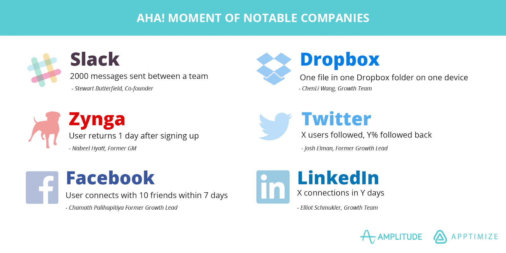
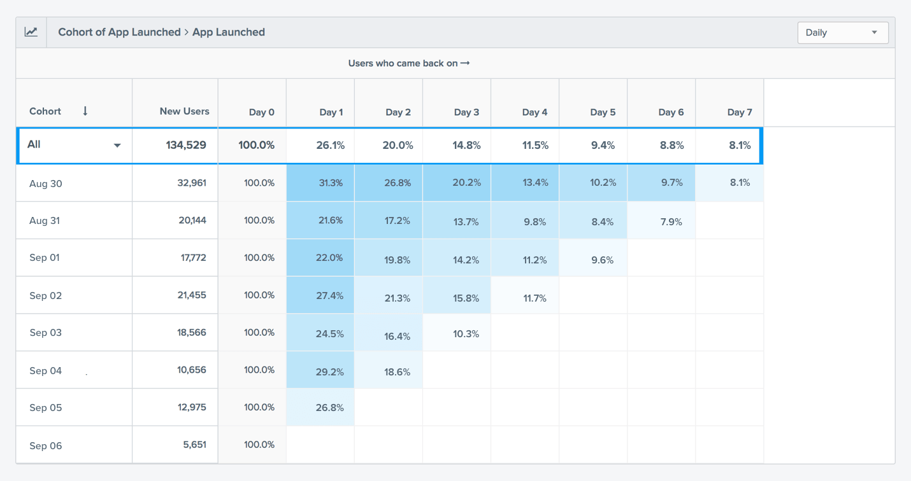

# 아하 모먼트

 

1. 아하 모먼트(Aha Moment)
2. 사용자 Retention 이해하기: 10일 Cohort

 

## 1. 아하 모먼트(Aha Moment)

그로스 방법론 중에 아하 모먼트(Aha Moment)라는 개념이 있습니다. 흔히 "사용자가 프로덕트의 가치를 깨닫게 되는 순간"으로 정의되는데, 사용자가 이 순간을 만나는지 여부에 따라 프로덕트에 남을지, 이탈할지가 결정된다는 것입니다. 서비스 빌더의 입장에서 사용자의 "아하 모먼트"를 찾기 위해서는 역추적 방식으로 접근하게 되는데, 이탈하지 않고 프로덕트를 잘 사용하고 있는 사용자들의 행동을 분석해서 "어떤 행동을 한 사용자들이 프로덕트에 남게 되는지" 가정하고, 검증하는 과정을 통합니다. 아하 모먼트는 구Facebook의 "7 friends in 10 days" 문구로도 잘 알려진 개념인데요, Facebook 전 그로스 리더 Chamath Palihapitiya의 강의 [How we put Facebook on the path to 1 billion users](https://www.youtube.com/watch?v=raIUQP71SBU)를 통해 많이 알려진 것 같습니다. 10일 내에 7명과 친구를 맺은 사용자들은 아하 모먼트가 있었기 때문에 Fackbook에 남았고, 그렇지 못한 사용자는 Facebook을 떠났다는 것입니다. 

아하 모먼트는 여러 지표 중 참고할 만한 하나의 지표 정도가 아니라, 전사적으로 1순위로 두고 푸쉬해야하는 지표라는 것이 중요한데, 아하 모먼트를 찾아내고 실행하고 충족하는지의 여부에 따라 프로덕트의 생과 사가 결정될 수 있기 때문입니다.

> Get any individual to seven friends in 10 days. That was it. You want a keystone? That was our keystone. There's not much more complexity than that. (...ABBR...) Then what we did at that company was we talked about nothing else. Every Q&A, every all hands nothing was spoken about other than this. Monetization didn't really come up. Platform came up but again in a secondary or tertiary context. But it was the single sole focus. - Chamath Palihapitiya

 

이외에도 다음과 같은 실리콘밸리 리딩 기업들의 아하 모먼트가 알려지면서, 아하 모먼트는 상당히 검증된 UX 방법론으로 자리잡은 것 같습니다.

 

이미지 출처: [This Is How You Find Your App’s Aha! Moment | Apptimize](https://apptimize.com/blog/2016/02/this-is-how-you-find-your-apps-aha-moment/)

 

## 2. 사용자 Retention 이해하기: 10일 Cohort

아하 모먼트에 대한 작업을 시작하기 전에 현재의 사용자 Retention이 어느정도 되는지 파악해야 합니다. 그래야 아하 모먼트 적용 전후로 사용자 Retention에 유의미한 변화가 있는지 확인함으로써 아하 모먼트를 제대로 찾았는지, 잘못 짚었는지 구별할 수 있기 때문입니다. 사용자 Retention 비율, 즉 첫 방문자 전체 중 얼마나 많은 사용자가 프로덕트에 남았는지는 Cohort 데이터를 통해 쉽게 파악할 수 있습니다. Google Analytics, [Amplitude](https://amplitude.com/), [Mixpanel](https://mixpanel.com/)과 같은 데이터 분석 툴에서 모두 제공하고요. 단순히 사용자의 Retention이 몇프로다 라고 하는 것보다, Cohort 데이터를 참고해서 어느 시점에 사용자 Retention이 가파르게 떨어지는지, 대략 며칠 차에 어느 정도의 사용자가 프로덕트에 남는지를 보는 것이 중요합니다. 참고로 아하 모먼트를 설정할 때도, 단순히 사용자의 행동 그 자체만을 보지 않고 해당 행동이 어떤 기간 내에 일어났는지를 봅니다. 최소 10일 정도 기간에 대한 Cohort 데이터를 보는 것이 기본이고, 이 기간까지의 사용자 Retention이 이미 높다면 30일 정도 기간에 대한 Cohort 데이터를 살펴볼 필요가 있습니다.

 

이미지 출처: [Cohort Analysis: The Key to Improving User Retention for Your App - Emily Bonnie](https://clevertap.com/blog/cohort-analysis-user-retention/)

 

---

### References

- [Hacking Growth](https://www.amazon.com/Hacking-Growth-Fastest-Growing-Companies-Breakout/dp/045149721X/ref=sr_1_3?crid=V118U0XWR957&keywords=hacking+growth&qid=1550318327&s=gateway&sprefix=hacking+growth%2Caps%2C208&sr=8-3)
- [How to Discover Your App’s ‘Aha Moment’ - Parsa Saljoughian](https://medium.com/parsa-vc/how-to-discover-your-apps-aha-moment-5f75dd7b6536)
- [Facebook's "Aha" Moment Was Simpler Than You Think - Benn Stancil](https://mode.com/blog/facebook-aha-moment-simpler-than-you-think/)
- [The transcript "How we put Facebook on the path to 1 billion users - Chamath Palihapitiya"](https://genius.com/Chamath-palihapitiya-how-we-put-facebook-on-the-path-to-1-billion-users-annotated)
- [The Compass chart: discover your users' "a-ha" moments | Apptimize](https://help.amplitude.com/hc/en-us/articles/235147347-The-Compass-chart-discover-your-users-a-ha-moments)
