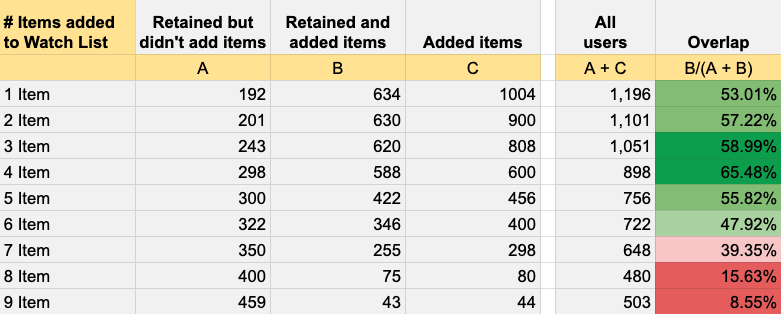

# 아하 모먼트: 30일 Retention, 가능한 행동들 모으기, Base Retention과 비교하기, 최적 빈도/횟수 찾기, Sanity Check, A/B 테스트

 

1. 아하 모먼트(Aha Moment)
2. Base Retention 파악하기: 30일 Retention
3. 가능한 행동들 모으기, Base Retention과 비교하기
4. 최적 빈도/횟수 찾기
5. Sanity Check, A/B 테스트

 

## 1. 아하 모먼트(Aha Moment)

그로스 방법론 중에 아하 모먼트(Aha Moment)라는 개념이 있습니다. 흔히 "사용자가 프로덕트의 가치를 깨닫게 되는 순간"으로 정의되는데, 사용자가 이 순간에 도달하는지 여부에 따라 서비스를 이탈할지, 남을지가 결정된다는 것입니다. 서비스를 만드는 입장에서 사용자의 "아하 모먼트"를 찾기 위해서는 역추적 방식으로 접근하게 되는데, 서비스를 이탈하지 않고 잘 사용하고 있는 사용자들의 행동을 분석해서 "어떤 행동을 한 사용자들이 서비스에 남게 되는지" 가정하고, 검증하는 과정을 통합니다. 아하 모먼트는 구Facebook의 "7 friends in 10 days" 문구로도 잘 알려진 개념인데요, 10일 내에 7명과 친구를 맺은 사용자들은 아하 모먼트가 있었기 때문에 Fackbook에 남았고, 그렇지 못한 사용자는 Facebook을 떠났다는 것입니다. Facebook 전 그로스 리더 Chamath Palihapitiya의 강의 [How we put Facebook on the path to 1 billion users](https://www.youtube.com/watch?v=raIUQP71SBU)를 통해 많이 알려진 것 같습니다.

아하 모먼트는 여러 지표 중 참고할 만한 하나의 지표 정도가 아니라, 1순위로 두고 푸쉬해야하는 지표라는 것이 중요한데, 아하 모먼트를 찾아내고 실행하고 충족하는지의 여부에 따라 프로덕트의 생과 사가 결정될 수 있기 때문입니다.

> Get any individual to seven friends in 10 days. That was it. You want a keystone? That was our keystone. There's not much more complexity than that. (...ABBR...) Then what we did at that company was we talked about nothing else. Every Q&A, every all hands nothing was spoken about other than this. Monetization didn't really come up. Platform came up but again in a secondary or tertiary context. But it was the single sole focus. - Chamath Palihapitiya

 

이외에도 다음과 같은 실리콘밸리 리딩 기업들의 아하 모먼트가 알려지면서, 아하 모먼트는 상당히 검증된 그로스 방법론으로 자리잡은 것 같습니다.

 

이미지 출처: [This Is How You Find Your App’s Aha! Moment | Apptimize](https://apptimize.com/blog/2016/02/this-is-how-you-find-your-apps-aha-moment/)

 

## 2. Base Retention 파악하기: 30일 Retention

이제 어떤 행동을 한 사용자들이 아하 모먼트에 도달했는지 찾고, 다른 모든 사용자들이 똑같이 행동하도록 UX를 개선하면 됩니다. 이 작업을 시작하기에 앞서, 현재의 사용자 Retention이 어느정도 되는지 파악해야 합니다. 그래야 UX 개선 이후 사용자 Retention에 유의미한 변화가 있는지 확인함으로써 아하 모먼트를 제대로 찾았는지, 잘못 짚었는지 구별할 수 있기 때문입니다. 사용자 Retention, 즉 첫 방문자 전체 중 얼마나 많은 사용자가 프로덕트에 남았는지를 알려주는 Retention 데이터를 봐야 합니다. Google Analytics, [Amplitude](https://amplitude.com/), [Mixpanel](https://mixpanel.com/)과 같은 데이터 분석 툴에서 모두 제공하는데요, Google Analytics를 사용한다면 User ID를 꼭 셋업해야 데이터 오류를 최소화할 수 있습니다. 같은 사람이라도 여러 디바이스를 통해 서비스에 접속하게 되면 서로 다른 사용자인 것처럼 데이터가 수집되기 때문에, 해당 사용자의 모든 세션을 User ID로 묶어서 봐야하기 때문입니다.

단순히 사용자의 Retention이 몇프로다 라고 하는 것보다, 전체 사용자를 Cohort로 하는 일별 데이터를 참고해서 어느 시점에 사용자 Retention이 가파르게 떨어지는지, 대략 며칠 차에 어느 정도의 사용자가 프로덕트에 남는지를 보는 것이 좋습니다. 보통 최소 10일 정도 기간에 대한 Retention 데이터를 보는 것이 기본이지만, 아하 모먼트 설계시 사용할 Base Retention은 첫 방문 후 30일에 남은 사용자의 비율까지 볼 필요가 있습니다. 한 달 후에도 프로덕트에 남은 사용자들, 그러니까 단순히 호기심으로 몇 번 사용해본 사용자가 아닌, 이 프로덕트가 Useful 하다고 생각한 사용자들을 추적해볼 수 있기 때문입니다.

 

이미지 출처: [Cohort Analysis: The Key to Improving User Retention for Your App - Emily Bonnie](https://clevertap.com/blog/cohort-analysis-user-retention/)

 

## 3. 가능한 행동들 모으기, Base Retention과 비교하기

### 3-1. 가능한 행동들 모으기

사용자의 어떤 행동이나 특성이 Retention에 영향을 주었는지 가정해봅니다. Mixpanel의 Retention Report를 활용하면, 일별로 남은 사용자 비율, 남은 사용자 목록, 이탈한 사용자 목록을 쉽게 확인할 수 있는데요, 30일 이후에 남은 사용자 목록을 사용해서 해당 사용자들이 어떤 행동들을 해왔는지 분석할 수 있습니다. 이 단계에서는 데이터와 직관을 함께 사용해도 됩니다. 그리고 다음과 같은 "Retention에 영향을 주었을 가능성이 있는" 사용자 행동들을 목록화합니다. 어떤 행동이 정답일 것이라는 편견을 버리고, 가능한 모든 행동들을 목록화해봐야 합니다. 최소 20~30개의 행동들을 모아본 후 가능성이 높은 행동부터 테스트해봅니다.

예를 들어 DeFi 서비스라면, 이런식으로 목록화할 수 있겠습니다.

- Docs 링크를 클릭하여 Docs 페이지로 이동한다
- Watch List에 아이템을 등록한다
- Top Earning Portfolio를 팔로우한다
- Lottery에 참여한다
- $100 이상 입금한다

 

### 3-2. Base Retention과 비교하기

특정 행동을 한 사용자들을 새로운 Cohort로 묶어서, 모든 사용자를 대상으로 했던 Base retention 그래프와 비교해봅니다. Day 0 ~ Day 30 기간 동안 유의미한 차이가 있는지 확인하고요, 차이가 없다면 미련없이 다음 행동으로 넘어가야 합니다.

 

## 4. 최적 빈도/횟수 찾기

위의 과정을 거치면 유의미한 차이가 있는 몇 가지 행동들이 있을 겁니다. 이제 그 행동들을 얼마나 자주 했을 때 사용자들이 아하 모먼트에 도달했는지 찾아야합니다. 이 빈도를 찾는 단계는 "특정 행동을 많이 하면 할 수록 Retention이 좋아진다"는 오류를 피하기 위해 반드시 필요합니다. 빈도나 횟수에 따라 해당 행동을 한 사용자 중 서비스를 이탈한 사람들이 많을 수도 있기 때문이고요, 서비스에 남은 사용자 전체로 봤을 때의 비율은 적을 수 있기 때문입니다! 그렇기 때문에 해당 행동을 한 사용자 중 서비스에 남은 사용자의 비율, 서비스에 남은 사용자 중 해당 행동을 한 사용자의 비율을 함께 확인해봐야 합니다.

예를 들어, 다음과 같이 Overlap 비율을 비교해볼 수 있겠습니다. 아래와 같은 결과가 나왔다면 `4 Items added to watch list`가 아하 모먼트일 가능성이 높겠구나 추론해볼 수 있겠죠.

 

 

## 5. Sanity Check, A/B 테스트

테스트를 직접 구현하기 전 마지막으로, 위에서 찾은 행동을 한 사용자들을 새로운 Cohort로 하는 Retention 데이터와 Base Retention을 비교해서 실제로 사용자 Retention이 유의미하게 높은지 Sanity Check을 거칩니다. Retention이 실제로 높다면, 마지막으로 A/B 테스트를 구현하고 시간에 따른 Retention 변화를 지켜봐야 합니다. 단순히 전후 비교만으로는 아하 모먼트를 정확히 진단할 수 없기 때문인데, 아하 모먼트를 구현한 것이 아니라 외부 환경적 요인, 혹은 별도의 마케팅 요인 등으로 인해 Retention에 변화가 생길 수도 있기 때문입니다.

 

---

### References

- [Hacking Growth](https://www.amazon.com/Hacking-Growth-Fastest-Growing-Companies-Breakout/dp/045149721X/ref=sr_1_3?crid=V118U0XWR957&keywords=hacking+growth&qid=1550318327&s=gateway&sprefix=hacking+growth%2Caps%2C208&sr=8-3)
- [How to Discover Your App’s ‘Aha Moment’ - Parsa Saljoughian](https://medium.com/parsa-vc/how-to-discover-your-apps-aha-moment-5f75dd7b6536)
- [Facebook's "Aha" Moment Was Simpler Than You Think - Benn Stancil](https://mode.com/blog/facebook-aha-moment-simpler-than-you-think/)
- [The transcript "How we put Facebook on the path to 1 billion users - Chamath Palihapitiya"](https://genius.com/Chamath-palihapitiya-how-we-put-facebook-on-the-path-to-1-billion-users-annotated)
- [The Compass chart: discover your users' "a-ha" moments | Apptimize](https://help.amplitude.com/hc/en-us/articles/235147347-The-Compass-chart-discover-your-users-a-ha-moments)
- [How to find the critical Aha moments in your product? - Kalo Yankulov](https://encharge.io/finding-your-aha-moment/)