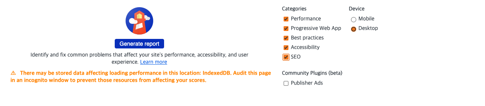
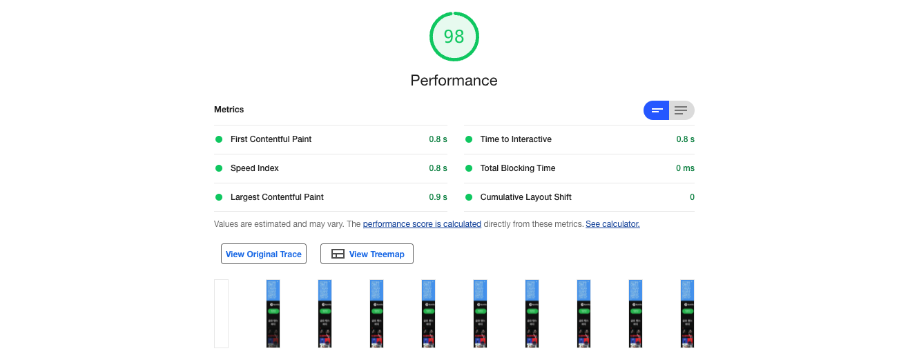
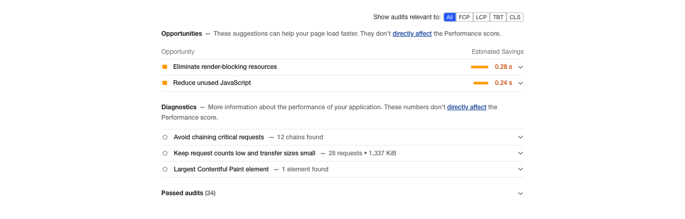
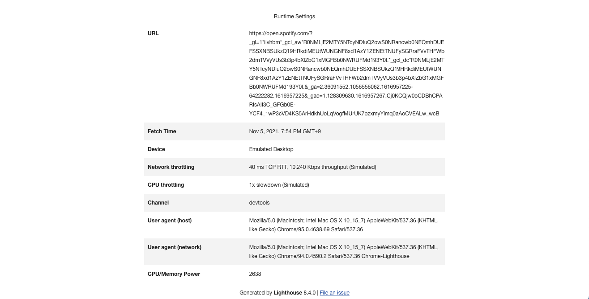

# Lighthouse 퍼포먼스 점수 올리기

<br>

1. Lighthouse
2. Brotli, Gzip으로 텍스트 압축하기
3. 네트워크 페이로드 사이즈 줄이기
4. PRPL 패턴

<br>

## 1. Lighthouse

[Lighthouse](https://developers.google.com/web/tools/lighthouse/)는 웹페이지의 상태를 진단하고 퍼포먼스 개선을 위한 가이드를 제공하는 툴입니다. Lighthouse를 사용하는 가장 쉬운 방법으로, Chrome 개발자도구의 `Lighthouse` 탭에서 버튼을 클릭하여 웹페이지 진단을 바로 시작할 수 있습니다. Lighthouse는 다음 5가지 관점에서 웹페이지를 진단합니다.

- [퍼포먼스](https://web.dev/performance-scoring/)
- [PWA](https://developer.mozilla.org/en-US/docs/Web/Progressive_web_apps/Introduction)
- [Best pratices](https://web.dev/lighthouse-best-practices/)
- [접근성](https://developer.mozilla.org/en-US/docs/Learn/Accessibility)
- [SEO](https://developer.mozilla.org/en-US/docs/Glossary/SEO)

<br>



<br>

### 퍼포먼스 보고서

Lighthouse의 퍼포먼스 보고서는 다음과 같습니다. 주로 로딩 속도에 관련된 지표로 구성됩니다. 사이트 퍼포먼스는 UX와 이에 따른 전환율에도 매우 중요하지만, 속도가 너무 느리면 Google 검색엔진에서 추천하지 않기 때문에 SEO에도 영향이 있습니다.

<br>







<br>

## 2. Brotli, Gzip으로 텍스트 압축하기

- [Gzip 아시나요? 그러면 Brotli는요?](https://snyung.com/content/2021-02-11--Brotli) 블로그 글이 도움이 되었습니다.

<br>

## 3. 네트워크 전송 사이즈 줄이기

웹페이지에서 요청하는 네트워크 전송 사이즈의 적정 수준은 `1,700` ~ `1,900` KiB 입니다. 통상적으로 `1,600` KiB를 넘지 않도록 하는 것이 좋습니다. 그래야 3G 네트워크 환경에서도 사용자가 10초 이내에 콘텐츠를 볼 수 있기 때문입니다. 네트워크 전송 사이즈를 줄이는 방법에는 다음과 같은 것들이 있습니다.

- [PRPL 패턴](https://web.dev/apply-instant-loading-with-prpl/)
- [Minification, 데이터 압축](https://web.dev/reduce-network-payloads-using-text-compression/)
- [JPEG, PNG 대신 WebP 이미지 포맷 사용하기](https://web.dev/serve-images-webp/)
- [JPEG 이미지 압축](https://web.dev/use-imagemin-to-compress-images/)
- [캐싱](https://web.dev/reliable/)

<br>

## 4. PRPL 패턴

PRPL 패턴은 Preload, Render, Pre-cache, Lazy load 4가지 전략을 묶어서 나타내는 말이고요, 각각은 다음을 의미합니다.

- Preload : 가장 중요한 리소스들만 미리 로드
- Render : 첫 번째 라우트 페이지를 가능한 빨리 렌더링
- Pre-cahce : 남은 리소스들은 미리 캐싱
- Lazy load : 나머지 라우트와 중요하지 않은 리소스들은 게으르게 로드

<br>

### 4-1. Preload

[Preload 전략](https://web.dev/preload-critical-assets/)은 말그대로 중요한 리소스들을 미리 로드시키는 방법입니다. 정말 단순하게, `<head>` 태그 내에서 리소스 파일을 로드하는 `<link>` 태그에 `preload` 값을 지정하면 쉽게 구사할 수 있습니다. 이때 리소스의 종류에 따라 로딩 우선순위가 달라지기 때문에 `as` 속성을 사용하여 리소스 종류를 명시해줘야합니다. [earprintResource Fetch Prioritization and Scheduling in Chromium](https://docs.google.com/document/d/1bCDuq9H1ih9iNjgzyAL0gpwNFiEP4TZS-YLRp_RuMlc/edit) 문서에서는 Chrome 브라우저에서 다양한 리소스 타입들이 어떻게 분류되고, 어떤 종류의 리소스부터 로딩이 시작되는지에 대한 표를 제공합니다.

<br>

```html
<head>
	<link rel="preload" as="style" href="css/style.css" />
</head>
```

<br />

`rel="preload"` 속성은 브라우저에게 이 리소스가 미리 로드되어야한다고 알려줍니다. 이 속성을 통해 브라우저는 해당 리소스의 존재를 미리 인지할 수 있기 때문에, HTML 파일이 완전히 로드될 때까지 기다리는 것이 아니라 필요한 리소스들을 동시에 로드할 수 있게 됩니다. 만약 이 속성을 지정하지 않으면, HTML 페이지 로드가 완료된 후에 뒤늦게 해당 리소스를 순차적으로 로드합니다. 이때 로드되는 리소스가 무겁다면 화면 렌더링이 지연되면서 사용자가 체감하는 로딩 시간이 길어지고요, 물론 실제 총 로딩시간 역시 길어지게 되죠. 따라서 웹앱에서 중요하게 사용되는 CSS, JavaScript, 폰트, 이미지 파일들은 대부분 Preload 하는 것이 좋습니다.

<br>

다음은 [Preload key requests](https://web.dev/uses-rel-preload/) 문서에서 발췌한 설명입니다.

> The potential savings are based on how much earlier the browser would be able to start the requests if you declared preload links. For example, if app.js takes 200ms to download, parse, and execute, the potential savings for each resource is 200ms since app.js is no longer a bottleneck for each of the requests.

<br>

### CSS, 폰트 Preload

#### 리소스 in 리소스

Preload 전략을 구사할 때 주의할 점이 있습니다. 리소스 파일 내에서 참조하는 다른 리소스 파일이 함께 Preload 되지 않는다는 사실입니다. 가령, CSS 파일 내에서 사용되는 폰트나 배경 이미지 파일들은 해당 CSS 파일이 완전히 로드되고 파싱된 이후에나 브라우저에 의해 발견됩니다. CSS 파일이 파싱될 때까지 기다리지 않고 폰트와 이미지 파일을 동시에 로드시키려면 별도로 Preload 처리를 해줘야합니다. 그래야 CSS 파일이 해석된 이후 추가적인 리소스에 대한 로드시간이 없기 때문에 바로 화면 렌더링을 시작할 수 있겠죠.

<br>

예를 들어 폰트 파일은 CSS 파일 내에서 `@import` 룰을 사용하기보다, `<link>` 태그를 사용하여 직접 Preload 하는 것이 좋겠죠. [Preload web fonts to improve loading speed
](https://web.dev/codelab-preload-web-fonts/) 문서가 도움이 되었습니다.

#### 폰트를 위한 `crossorigin`

폰트 파일의 경우 아래와 같이 `crossorigin` 속성을 지정합니다. `crossorigin` 속성을 지정하지 않으면 이 파일은 불필요하게 두 번 Fetch 되기 때문입니다. 자세한 내용은 W3C Recommendation 문서 [4.9. Font fetching requirements](https://www.w3.org/TR/css-fonts-3/#font-fetching-requirements) 섹션에서 확인할 수 있습니다.

```html
<link
	rel="preload"
	href="ComicSans.woff2"
	as="font"
	type="font/woff2"
	crossorigin
/>
```

<br>

### Webpack을 사용하여 JavaScript 모듈 Preload 하기

[Webpack](https://webpack.js.org/) 4.6.0 버전부터는 Preload를 지원합니다. `import()` 메소드 내에서 [마법 주석](https://webpack.js.org/api/module-methods/#magic-comments)으로 Preload를 선언하는 방식입니다.

```javascript
import(_/* webpackPreload: true */_ "CriticalChunk")
```

<br>

이전 버전의 Webpack을 사용해야한다면 [preload-webpack-plugin](https://github.com/GoogleChromeLabs/preload-webpack-plugin) 플러그인을 사용할 수 있습니다.

<br>

---

### References

- [Lighthouse performance scoring](https://web.dev/performance-scoring/)
- [Ensure text remains visible during webfont load](https://web.dev/font-display/?utm_source=lighthouse&utm_medium=devtools)
- [Avoid enormous network payloads](https://web.dev/total-byte-weight/?utm_source=lighthouse&utm_medium=devtools)
- [Preload critical assets to improve loading speed](https://web.dev/preload-critical-assets/)
- [SPA 초기 로딩 속도 개선하기](https://medium.com/little-big-programming/spa-%EC%B4%88%EA%B8%B0-%EB%A1%9C%EB%94%A9-%EC%86%8D%EB%8F%84-%EA%B0%9C%EC%84%A0%ED%95%98%EA%B8%B0-9db137d25566)
