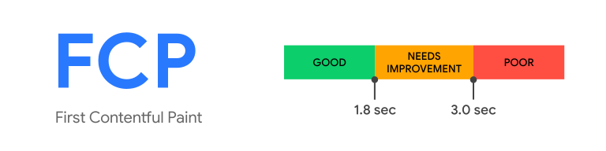

# Lighthouse 퍼포먼스 점수 올리기 1: Lighthouse란, FCP를 빠르게, CSS, 폰트, 이미지, JavaScript 로드 최적화

<br>

1. Lighthouse 퍼포먼스 리포트
2. FCP란, FCP를 빠르게
3. CSS, 폰트 로드 최적화하기: Preload, 폰트 로드시 주의할 점, 인라인 CSS와 Preload, Preconnect, CSS Minify
4. 이미지 로드 최적화하기: 게으른 이미지 `loading=lazy`
5. JavaScript 로드 최적화하기: JavaScript 비동기 로드하기, JavaScript 모듈 Preload

<br>

## 1. Lighthouse 퍼포먼스 리포트

### 1-1. Lighthouse란

[Lighthouse](https://developers.google.com/web/tools/lighthouse/)는 웹페이지의 상태를 진단하고 퍼포먼스 개선을 위한 가이드를 제공하는 툴입니다. Lighthouse를 사용하는 가장 쉬운 방법으로, Chrome 개발자도구의 `Lighthouse` 탭에서 버튼을 클릭하여 웹페이지 진단을 바로 시작할 수 있습니다. Lighthouse는 다음 5가지 관점에서 웹페이지를 진단합니다.

- [퍼포먼스](https://web.dev/performance-scoring/)
- [PWA](https://developer.mozilla.org/en-US/docs/Web/Progressive_web_apps/Introduction)
- [Best pratices](https://web.dev/lighthouse-best-practices/)
- [접근성](https://developer.mozilla.org/en-US/docs/Learn/Accessibility)
- [SEO](https://developer.mozilla.org/en-US/docs/Glossary/SEO)

<br>


<br>

### 1-2. 퍼포먼스 리포트

Lighthouse의 퍼포먼스 리포트를 생성해보면 다음과 같은 결과물을 받아볼 수 있습니다. [First Contentful Paint(FCP)](https://web.dev/fcp/), Time to Interactive, Speed Time 등 속도에 관련된 지표들로 구성됩니다. 사이트의 속도는 사용자 경험과 그에 따른 전환율에도 영향을 미치기 때문에 매우 중요하고요, SEO에도 영향이 있습니다. 속도가 너무 느린 사이트는 Google 검색엔진에서 검색되지 않을 수 있기 때문이죠.

<br>


<br>

사이트의 속도를 개선하는 방법은 다양합니다. 전송되는 리소스의 사이즈를 줄이거나, 여러 리소스를 비동기 방식으로 동시에 로드하거나, 이전에 로드된 데이터를 재사용하는 등의 방법이 있습니다. 다음은 잘 알려진 퍼포먼스 개선 방법들이고요, 하나씩 적용해보면서 사이트 속도가 실제로 개선되는지 팔로업해보면 좋을 것 같습니다.

- [PRPL 패턴: Preload, Render, Pre-cache, Lazy load](https://web.dev/apply-instant-loading-with-prpl/)
- [Minification, 데이터 압축](https://web.dev/reduce-network-payloads-using-text-compression/)
- [JPEG, PNG 대신 WebP 이미지 포맷 사용하기](https://web.dev/serve-images-webp/)
- [JPEG 이미지 압축](https://web.dev/use-imagemin-to-compress-images/)
- [캐싱](https://web.dev/reliable/)

<br>

## 2. FCP란, FCP를 빠르게

PRPL 패턴 중 [Render](https://web.dev/apply-instant-loading-with-prpl/#render-the-initial-route-as-soon-as-possible) 전략은 `Render the initial route as soon as possible`을 의미합니다. 일반적으로 리소스의 "로딩 속도"가 성능 자체에 집중하는 개념이라면, 실제 로딩 속도는 빨라지지 않지만 "최초 렌더링" 시점을 앞당기는 것은 사용자가 체감하는 성능을 높이는데 중점을 둡니다. 이와 관련하여 사용자 관점에서 앱의 성능을 측정하는 [사용자 중심 성능 메트릭](https://web.dev/user-centric-performance-metrics/#first_paint_and_first_contentful_paint)이라는 개념이 있는데요, 여기에 포함되는 여러 성능 메트릭 중 [First Contentful Paint, FCP](https://web.dev/fcp/)는 HTML 페이지가 로드되기 시작한 시점부터 콘텐츠의 일부가 화면에 최초로 렌더링되기까지의 시간을 측정하는 지표입니다. FCP가 빠르면 사용자가 페이지에서 뭔가가 진행되고 있음을 인지해 안심하게 만들 수 있기 때문에 매우 중요한 지표이고요, 보통 FCP가 1.8초 이내면 좋다고 판단합니다.

<br>



사진 출처: [First Contentful Paint(최초 콘텐츠풀 페인트, FCP)](https://web.dev/fcp/)

<br>

## 3. CSS, 폰트 로드 최적화하기: Preload, 폰트 로드시 주의할 점, 인라인 CSS와 Preload, Preconnect, CSS Minify

### 3-1. Preload

[Preload](https://web.dev/preload-critical-assets/) 전략은 말 그대로 곧 사용하게 될 리소스를 미리 로드하여 병목현상을 줄이는 개념입니다. CSS 뿐만 아니라 이미지, 폰트, JavaScript 등 모든 리소스에 적용할 수 있고요. HTML 문서 로딩이 완료된 후에 필요한 리소스들을 순차적으로 로드하는 것이 아니라, HTML 페이지가 로드되고 해석되는 동안 다른 리소스들을 비동기 방식으로 동시에 로드시키는 방법이죠. 이렇게 하면 HTML 페이지 해석이 끝나고 렌더링이 시작되었을 때 미리 로드된 리소스들을 지체없이 바로 사용할 수 있겠죠.

<br>

다음은 [Preload key requests](https://web.dev/uses-rel-preload/) 문서에서 발췌한 설명입니다.

> The potential savings are based on how much earlier the browser would be able to start the requests if you declared preload links. For example, if app.js takes 200ms to download, parse, and execute, the potential savings for each resource is 200ms since app.js is no longer a bottleneck for each of the requests.

<br>

구현은 굉장히 간단합니다. `<head>` 태그 내에서 리소스 파일을 로드하는 `<link>` 태그에 [`rel="preload"`](https://developer.mozilla.org/en-US/docs/Web/HTML/Link_types/preload) 속성값을 지정하면 끝입니다. 단순히 브라우저에게 이 리소스를 미리 로드해야한다고 알려주는 역할을 하는 것 뿐이지만 효과는 막강합니다. 만약 이 속성을 지정하지 않으면, HTML 페이지가 완전히 로드된 후 뒤늦게 리소스들을 순차적으로 로드합니다. 이때 로드되는 리소스가 많거나 무겁다면 화면 렌더링이 지연되면서 사용자가 체감하는 속도가 느려지고요, 실제로 총 로딩 시간 역시 길어지게 되죠. 따라서 주요하게 사용되는 CSS, 폰트, 이미지, JavaScript 파일들은 대부분 Preload 하는 것이 좋습니다.

<br>

```html
<head>
	<link rel="preload" as="style" href="critical-styles.css" />
	<link
		rel="preload"
		as="font"
		crossorigin
		type="font/woff2"
		href="myfont.woff2"
	/>
</head>
```

<br>

주의할 점은 리소스의 종류에 따라 로딩 우선순위가 달라지기 때문에 `as` 속성을 사용하여 리소스 종류를 명시해주어야한다는 것입니다. [earprintResource Fetch Prioritization and Scheduling in Chromium](https://docs.google.com/document/d/1bCDuq9H1ih9iNjgzyAL0gpwNFiEP4TZS-YLRp_RuMlc/edit) 문서에서는 Chrome 브라우저에서 다양한 리소스 타입들이 어떻게 분류되고, 어떤 종류의 리소스부터 로딩이 시작되는지에 대한 표를 제공합니다.

<br>

### 3-2. 폰트 로드시 주의할 점

CSS 파일을 Preload 할 때 주의할 점이 있습니다. 리소스 파일 내에서 참조하는 다른 리소스가 자동으로 함께 Preload 되지 않는다는 사실입니다. 가령, 아래와 같이 `index.css` 파일 내에서 참조하는 폰트와 이미지 파일이 있다고 해봅시다. 이 폰트와 이미지 파일은 `index.css` 파일이 완전히 로드되고 파싱된 이후에나 브라우저에 의해 발견됩니다. `index.css` 파일이 파싱될 때까지 기다리지 않고 폰트와 이미지 파일을 Preload 시키려면 `<link>` 태그를 사용하여 선언해주어야합니다. [Preload web fonts to improve loading speed](https://web.dev/codelab-preload-web-fonts/) 문서가 도움이 되었습니다.

```css
/* index.css */
@import url("https://fonts.googleapis.com/css2?family=DM+Serif+Display&display=swap");

.container {
	background-image: url("https://example.com/img/background/a.jpg");
}
```

<br>

폰트의 경우 아래와 같이 `crossorigin` 속성을 지정합니다. `crossorigin` 속성을 지정하지 않으면 이 파일은 불필요하게 두 번 Fetch 되기 때문입니다. 자세한 내용은 W3C Recommendation 문서 [4.9. Font fetching requirements](https://www.w3.org/TR/css-fonts-3/#font-fetching-requirements) 섹션에서 확인할 수 있습니다.

```html
<link
	rel="preload"
	href="ComicSans.woff2"
	as="font"
	type="font/woff2"
	crossorigin
/>
```

<br>

### 3-3. 인라인 CSS와 Preload

페이지의 최초 렌더링에 필요한 CSS는 `<head>` 태그 내에 인라인으로 작성하고, 나머지 CSS는 별도의 파일로 분리하여 `preload` 속성을 통해 비동기 방식으로 로드합니다. [Defer non-critical CSS](https://web.dev/defer-non-critical-css/) 문서에서 자세한 내용을 설명합니다.

```html
<link rel="preload" href="/css/styles.css" as="style" />
<noscript><link rel="stylesheet" href="styles.css" /></noscript>
<style type="text/css">
	* {
		padding: 0;
		margin: 0;
		box-sizing: border-box;
	}
</style>
```

<br>

### 3-4. Preconnect

써드파티 리소스를 사용한다면 `preconnect` 속성을 사용하여 브라우저가 써드파티 [오리진](https://developer.mozilla.org/en-US/docs/Glossary/Origin)에 대한 정보를 미리 얻고, 가장 빠른 시점에 써드파티 서버에 연결을 시도하도록 할 수 있습니다. 만약 웹폰트를 사용한다면 아래와 같이 폰트 서버에 연결해야함을 브라우저에 미리 알려줍니다.

```html
<link rel="preconnect" href="https://fonts.googleapis.com" />
<link rel="preconnect" href="https://fonts.gstatic.com" crossorigin />
<link
	href="https://fonts.googleapis.com/css2?family=DM+Serif+Display&display=swap"
	rel="stylesheet"
/>
```

<br>

`dns-prefetch` 속성은 DNS 검색까지만 진행하지만, 브라우저 호환 범위가 넓어 Fallback으로 사용합니다.

```html
<link rel="dns-prefetch" href="https://fonts.googleapis.com" />
```

<br>

#### 주의할 점

하지만 써드파티 서버에 연결 후 리소스를 10초 내에 사용하지 않는 경우라면, Preconnect를 사용하지 않는 것이 좋습니다. 페이지가 최초로 로드되고 렌더링 되는 중요한 시점에 CPU에 상당한 부담을 주는 작업이기 때문입니다. 일반적으로 `preload` 속성을 지정하는 것만으로 충분합니다.

<br>

### 3-5. CSS Minify

CSS 파일 내에 불필요한 여백을 모두 제거하여 브라우저에 전송하는 CSS 파일 사이즈를 최소화합니다. CSS 파일 내에 띄어쓰기, 줄바꿈 등으로 생기는 여백을 없애는 단순한 방법입니다. 개발시에는 [Formatter와 Linter](https://taiyr.me/what-is-the-difference-between-code-linters-and-formatters)를 사용하여 개발하고, 배포용 CSS 파일만 [`clean-css`](https://github.com/clean-css/clean-css)와 같은 라이브러리를 사용하여 Minify 하면 됩니다.

<br>

## 4. 이미지 로드 최적화하기: 게으른 이미지 `loading=lazy`

`` 태그에 `loading=lazy` 속성값을 지정하여 이미지를 게으르게 로딩(Lazy Load)할 수 있습니다. 이 속성을 사용하면, 브라우저는 해당 이미지를 Fetch는 하되, 로딩은 하지 않습니다. 이후 해당 이미지가 뷰포트에 들어오기 직전, [계산된 영역](https://web.dev/browser-level-image-lazy-loading/#distance-from-viewport-thresholds) 내에 들어오면 자동으로 로딩을 시작합니다. `lazy` 대신 `eager` 값을 지정하면 반대로 동작합니다. 이미지의 위치를 고려하지 않고 즉시 로드하죠.

```html

```

<br>

"계산된 영역"은 이미지 타입, [Lite 모드](https://blog.chromium.org/2019/04/data-saver-is-now-lite-mode.html) 활성화 여부, [네트워크 연결 타입](https://googlechrome.github.io/samples/network-information/)와 같은 요인들에 의해 결정됩니다. 예를 들어 Chrome의 경우 4G 네트워크 환경 기준, 이미지가 뷰포트 하단으로부터 `1250px` 영역 내로 들어오면 로딩을 시작합니다. 이미지가 뷰포트에 들어오기 전에 미리 로딩하는 이유는 당연히 사용자 경험을 더 부드럽게 할 수 있기 때문이겠죠. 다음은 [Browser-level image lazy-loading for the web](https://web.dev/browser-level-image-lazy-loading/#distance-from-viewport-thresholds) 문서에서 발췌한 설명입니다.

> Chromium's implementation of lazy-loading tries to ensure that offscreen images are loaded early enough so that they have finished loading once the user scrolls near to them. By fetching nearby images before they become visible in the viewport, we maximize the chance they are already loaded by the time they become visible.

<br>

게으른 로딩을 사용할 때는 `` 태그에 `width`, `height` 속성값을 지정하거나, `style` 속성으로 인라인 스타일을 작성하는 것이 권장됩니다. 브라우저가 이미지 렌더링을 위해 확보해야 할 공간 사이즈에 대한 정보를 미리 제공하여 [레이아웃 이동](https://web.dev/cls/) 현상을 피할 수 있기 때문입니다. 사용자가 미세한 레이아웃 이동이라도 인지하게 되면 안좋은 사용자 경험이 되겠죠? [Do This to Improve Image Loading on Your Website](https://www.youtube.com/watch?v=4-d_SoCHeWE) 영상에서 자세한 설명을 시청할 수 있습니다.

<br>

### Fallback: Intersection Observer, `lazysizes`

예전에는 [Intersection Observer](https://developers.google.com/web/updates/2016/04/intersectionobserver)와 같은 웹API를 사용하여 JavaScript로 구현해야했지만, 이제 대부분의 브라우저에서 `loading` 속성을 지원합니다. 구버전 브라우저를 위해 Fallbak을 제공하려면 [`lazysizes`](https://github.com/aFarkas/lazysizes) 라이브러리를 사용해보세요. 이미지의 게으른 로딩을 도와주는 라이브러리이고요, [Use lazysizes to lazy-load images](https://web.dev/use-lazysizes-to-lazyload-images/) 문서가 도움이 되었습니다.

<br>

<br>

## 5. JavaScript 로드 최적화하기: JavaScript 비동기 로드하기, JavaScript 모듈 Preload

### 5-1. JavaScript 비동기 로드하기

FCP를 개선하는 방법은 다양한데요, 가장 기본적으로 JavaScript를 불러오는 `<script>` 태그에 [`async`](https://developer.mozilla.org/en-US/docs/Web/HTML/Element/script#attr-async) 속성을 지정하여 JavaScript를 비동기 로드하는 방법이 있습니다. `async` 속성을 지정하면, 해당 스크립트와 의존성을 모두 비동기 로드합니다. 이 속성의 핵심은 브라우저가 HTML 문서를 분석하는 중에 `<script>` 태그를 만나더라도, HTML 문서 분석을 멈추지 않고 계속 진행하면서 JavaScript를 동시에 Fetch 한다는 것입니다.

```html
<script
	async
	crossorigin="anonymous"
	src="https://example.com/example-framework.js"
></script>
```

<br>

#### `async` vs. `defer`

[`defer`](https://developer.mozilla.org/en-US/docs/Web/HTML/Element/script#attr-defer)와의 차이점은 이렇습니다. 자세한 내용은 [<script>: The Script element](https://developer.mozilla.org/en-US/docs/Web/HTML/Element/script#attr-async) 문서를 참고하세요.

- `defer` 속성은 [`DOMContentLoaded`](https://developer.mozilla.org/en-US/docs/Web/API/Window/DOMContentLoaded_event) 이벤트 발생을 막을 수 있습니다. `DOMContentLoaded` 이벤트가 발생하기 전에 로드한 JavaScript를 실행해야하기 때문입니다.

- `defer` 속성은 JavaScript 모듈을 불러올 때 아무런 효과가 없습니다. JavaScript 모듈은 디폴트로 Defer 됩니다.

<br>

### 5-2. JavaScript 모듈 Preload

[JavaScript 모듈](https://developer.mozilla.org/ko/docs/Web/JavaScript/Guide/Modules)을 Preload 하려면, `preload` 대신 [`modulepreload`](https://developer.mozilla.org/en-US/docs/Web/HTML/Link_types/modulepreload) 속성값을 사용합니다. 이는 Chrome 브라우저의 V8 엔진이 일반적인 JavaScript 코드와 JavaScript 모듈을 애초에 다른 방식으로 파싱하고 컴파일하기 때문인데요, `modulepreload` 속성을 사용하여 일반적인 JavaScript 파일과 다르게 명시해줌으로써 브라우저에서 가장 효율적인 방법으로 모듈을 파싱할 수 있게 됩니다. 또한 해당 모듈 내에서 `import` 구문을 통해 의존되는 의존성 트리도 함께 로드합니다.

```html
<link href="/js/app.js" rel="modulepreload" as="script" />
```

<br>

다음은 [Preloading modules](https://developers.google.com/web/updates/2017/12/modulepreload)에서 발췌한 설명입니다.

> By having a specific link type for preloading modules, we can write simple HTML without worrying about what credentials mode we're using. The defaults just work.
> And since Chrome now knows that what you're preloading is a module, it can be smart and parse and compile the module as soon as it's done fetching, instead of waiting until it tries to run.
> The `<link rel="modulepreload">` spec actually allows for optionally loading not just the requested module, but all of its dependency tree as well.

<br>

JavaScript 모듈을 Preload하여 로딩 시간을 얼마나 세이브할 수 있을까요? [What is Better: Preloading or Caching JavaScript Modules?](https://javascript.plainenglish.io/what-is-better-preloading-or-caching-javascript-modules-246d3573e6ad)와 같은 실험 사례를 통해 최소 3 배의 속도 차이를 확인할 수 있습니다.

<br>

---

### References

- [Lighthouse performance scoring](https://web.dev/performance-scoring/)
- [Ensure text remains visible during webfont load](https://web.dev/font-display/?utm_source=lighthouse&utm_medium=devtools)
- [Avoid enormous network payloads](https://web.dev/total-byte-weight/?utm_source=lighthouse&utm_medium=devtools)
- [Preload critical assets to improve loading speed](https://web.dev/preload-critical-assets/)
- [Preloading modules](https://developers.google.com/web/updates/2017/12/modulepreload)
- [Fast load times](https://web.dev/fast/#prioritize-resources)