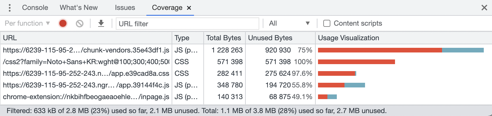

# Lighthouse 퍼포먼스 점수 올리기 2: Webpack을 활용한 Preload, Lazy Load (feat. Vue)

<br>

1. Vue에서 Preload 설정하기
2. SPA를 빠르게: Webpack의 번들링 원리, 코드 분할(Code Splitting)
3. 동적 임포트: `import()`, 정적 임포트
4. Webpack `SplitChunksPlugin`을 사용하여 써드파티 모듈도 분할하기
5. Vue에서 라우트 기반 번들 쪼개기: Webpack 동적 임포트 활용, 번들 네이밍과 그루핑

<br>

## 1. Vue에서 Preload 설정하기

[Vue CLI](https://cli.vuejs.org/guide/html-and-static-assets.html#preload)를 사용하여 앱을 빌드하면 기본적으로 `dist/` 경로 내에 다음과 같은 번들(Bundle) 결과물들을 얻을 수 있습니다.

- `app.[hash].js`
- `app.[hash].css`
- `image-name.[hash].png`

<br>

이 CSS, JavaScript, 이미지 파일들은 `index.html` 문서에서 다음과 같이 불러지죠.

```html
<head>
	<link href="/css/app.e39cad8a.css" rel="preload" as="style" />
	<link href="/js/app.39144f4c.js" rel="modulepreload" as="script" />
	<!-- .. -->
</head>
```

<br>

위 코드에서 알 수 있듯이 초기 앱 렌더링에 필요한 모든 리소스 파일에 `preload`, `modulepreload` 속성이 자동으로 추가됩니다. `vue-cli-service build` 명령어가 실행될 때 내부적으로 [`@vue/preload-webpack-plugin`](https://github.com/vuejs/preload-webpack-plugin) 플러그인이 이 역할을 하는거고요, Webpack 설정 파일 `vue.config.js`에서 아래와 같이 Preload 속성을 직접 설정할 수 있습니다. 이 예시는 Vue 커뮤니티의 [How to preload CSS in Vue](https://forum.vuejs.org/t/how-to-preload-css-in-vue/90710/8#post_8) 페이지에서 가져왔습니다.

```js
// vue.config.js
module.exports = {
	chainWebpack(config) {
		config.plugins.delete("prefetch");

		config.plugin("preload").tap((options) => {
			options[0].include = "allChunks";
			return options;
		});
	},
};
```

<br>

## 2. SPA를 빠르게: Webpack의 번들링 원리, 코드 분할(Code Splitting)

### 2-1. Webpack의 번들링 원리

[CSR(Client Side Rendering)](https://developers.google.com/web/updates/2019/02/rendering-on-the-web#csr)을 기반으로 하는 [SPA](https://developer.mozilla.org/en-US/docs/Glossary/SPA) 방식의 단점 중 하나는 초기 실행 속도가 느리다는 것이었습니다. 앱을 초기 실행하는 시점에 모든 JavaScript 코드가 포함된 거대한 번들을 로드해야하기 때문입니다. 이는 [Webpack](https://webpack.js.org/)과 같은 번들러가 SPA를 빌드하는 방식에 따릅니다. Webpack은 번들을 구성할 때 모듈간 [`import`](https://developer.mozilla.org/en-US/docs/Web/JavaScript/Reference/Statements/import)를 기반으로 모든 JavaScript 모듈들이 서로 연결되어 있는 의존성 그래프를 만들고요, 이 의존성 그래프에 기반하여 최종 번들에 각 모듈을 포함시킬지 제외할지 결정합니다.

<br>


사진출처 : [Lazy loading and code splitting in Vue.js](https://vueschool.io/articles/vuejs-tutorials/lazy-loading-and-code-splitting-in-vue-js/)

<br>

이렇다보니, 앱의 어떤 [라우트](https://vuejs.org/v2/guide/routing.html)를 실행하더라도 모든 JavaScript 모듈과 의존 관계가 포함된 거대한 번들이 로드됩니다. 하지만 각 라우트에서 사용되는 모듈들은 그 중 일부겠죠. 아래와 같이 Chrome 개발자도구의 `Coverage` 탭에서 실제로 사용되지 않는 리소스의 비율을 확인할 수 있습니다. 붉은색으로 표시된 부분이 사용되지 않는 리소스를 나타냅니다.

<br>



<br>

### 2-2. 코드 분할(Code Splitting)

하지만 [Webpack](https://webpack.js.org/)에 [코드 분할(Code Splitting)](https://webpack.js.org/guides/code-splitting/) 기능이 추가되면서 이 문제를 해결할 수 있게 되었습니다. Webpack의 기능을 사용해서 하나의 JavaScript 파일(번들)이 아닌 여러 개의 JavaScript 파일들로 나누어 앱을 빌드하고, 각 번들을 필요한 시점에 따로 로드할 수 있게 되었기 때문입니다. 특히 앱을 실행할 때 최초 렌더링에 즉시 필요한 JavaScript 코드만이 포함된 번들을 먼저 로드함으로써 FCP를 개선할 수 있게 되었습니다!

<br>

## 3. 동적 임포트: `import()`, 정적 임포트

### 3-1. `import()`

아시다시피 JavaScript의 기본 임포트 문법은 아래와 같습니다. 이는 정적 임포트 방식입니다. `moduleA`은 Webpack의 의존성 그래프에서 `main.js`의 노드로 추가되고, 앱의 최종 JavaScript 번들인 `app.[hash].js`에 포함되므로 앱의 초기 실행 시 함께 로드됩니다.

```javascript
// main.js
import moduleA from "a";
```

<br>

Webpack의 코드 분할 기능 중 하나인 [동적 임포트](https://webpack.js.org/guides/code-splitting/#dynamic-imports) 문법인 `import()`를 사용하면, 초기 렌더링에 사용되지 않는 JavaScript 모듈들을 별도의 번들로 분리할 수 있습니다. `import()` 메소드는 `Promise` 객체를 반환한다는 점에 유의하시고요. 동적으로 임포트되는 `moduleA`와 이 모듈 내에서 의존하는 또다른 모듈들은 앱 빌드시 `app.[hash].js` 번들에 포함되지 않고 별도의 번들로 분리됩니다. 이 별도로 분리된 번들은 앱 초기 실행시 로드되지 않고요, 해당 모듈이 필요해지면 그제서야 "게으르게" 로드됩니다.

```javascript
// main.js
if (isSubmitted) {
	const moduleA = await import("a.moduleA");
	const module = moduleA.default; // using the default export

	// ..
```

<br>

#### Preload 주석 사용하기

Webpack의 동적 임포트 메소드인 `import()`를 사용할 때, [마법 주석](https://webpack.js.org/api/module-methods/#magic-comments)을 사용하여 특정 모듈만 Preload용 번들에 포함시킬 수 있습니다. 예를 들어, 아래와 같이 `App` 컴포넌트에서 `CriticalComponent` 컴포넌트를 동적으로 임포트할 때 `webpackPreload: true` 주석을 사용하면, `App` 컴포넌트가 로드되는 시점에 `CriticalComponent` 컴포넌트도 함께 요청되어 동시에 로딩이 시작됩니다. [Webpack 공식문서](https://webpack.js.org/guides/code-splitting/)에서 자세한 내용을 확인할 수 있습니다.

```javascript
// App.js
import(/* webpackPreload: true */ "CriticalComponent");
```

<br>

이 기능은 Webpack 4.6.0 버전부터 지원합니다. 이전 버전의 Webpack을 사용해야한다면 [preload-webpack-plugin](https://github.com/GoogleChromeLabs/preload-webpack-plugin) 플러그인을 사용할 수 있습니다.

<br>

참고로 [동적 임포트](https://v8.dev/features/dynamic-import) 구문이 [ECMAScript 2020 명세에 포함](https://github.com/tc39/proposal-dynamic-import)되었습니다.

<br>

## 4. Webpack `SplitChunksPlugin`을 사용하여 써드파티 모듈도 분할하기

앱을 빌드하면 메인 번들인 `app.[hash].js`와 별도로 `chunk-vendors.[hash].js` 번들이 생깁니다. 이 번들은 `node_modules`에 포함된 모든 써드파티 라이브러리 모듈들을 담고 있습니다. Webpack의 코드 분할 효과를 극대화하려면 이 라이브러리들을 담고있는 번들도 분할해주어야합니다.

<br>

Webpack 설정을 통해 간단히 할 수 있습니다. [`SplitChunksPlugin`](https://webpack.js.org/plugins/split-chunks-plugin/) 문서를 참고하여 분할 설정을 해주면 됩니다. Vue의 Webpack 설정 파일인 `vue.config.js` 파일을 사용한다면 아래와 같이 `configureWebpack` 필드에 작성하면 되겠죠. `chunks: 'all'`은 모든 번들에 대해 분할 기능을 적용하겠다는 의미입니다.

```javascript
// vue.config.js

module.exports = {
	// ..
	configureWebpack: {
		optimization: {
			splitChunks: {
				chunks: 'all'
			}
		}
	}
}
```

<br>

## 5. Vue에서 라우트 기반 번들 쪼개기: Webpack 동적 임포트 활용, 번들 네이밍과 그루핑

### 5-1. Webpack 동적 임포트 활용

이번에는 Vue 앱의 컴포넌트들을 라우트별로 동적 로드하는 방법을 소개합니다. 일명 라우트 기반 번들 쪼개기인데요, 사용자가 특정 URL에 대해 라우팅을 요청하면 해당 라우트에 필요한 컴포넌트만 로드할 수 있게 하는겁니다. 위에서 살펴본 Webpack의 동적 임포트를 활용해서요. 자세한 내용은 공식문서인 [Lazy Loading Routes](https://router.vuejs.org/guide/advanced/lazy-loading.html#grouping-components-in-the-same-chunk)를 참고하세요.

<br>

만약 컴포넌트 임포트가 아래와 같이 작성되어있다면, 컴포넌트들을 정적으로 임포트하고 있는겁니다. 실제로 사용자가 `/about` 경로에 접근하지 않더라도, `About` 컴포넌트는 앱이 실행될 때 무조건 로드됩니다.

```javascript
// router.js

import Home from './Home.vue'
import About from './About.vue'

const routes = [
  { path: '/', component: Home }
  { path: '/about', component: About }
]
```

<br>

위 코드는 아래와 같이 Webpack의 `import()` 문법을 사용하여 바꿀 수 있습니다. 이제 사용자가 `/about` 경로에 접근했기 때문에 `About` 컴포넌트가 실제로 사용되어야 할 때만 `About` 컴포넌트가 포함된 번들이 로드됩니다.

```javascript
// router.js

const Home = () => import('./Home.vue')
const About = () => import('./About.vue')

const routes = [
  { path: '/', component: Home }
  { path: '/about', component: About }
]
```

<br>

### 5-2. 번들 네이밍과 그루핑

만약 [`webpackChunkName`](https://webpack.js.org/api/module-methods/#magic-comments) 주석을 사용하면, 해당 모듈이 포함된 번들에 원하는 이름을 부여하고 다른 번들로부터 분리할 수 있습니다. 아래와 같이 두 컴포넌트에 `home`이라고 지정하면, `Home`과 `About` 컴포넌트는 `home.[hash].js` 번들에 함께 포함됩니다.

```javascript
const Home = () => import(/* webpackChunkName: "home" */ './Home.vue');
const About = () => import(/* webpackChunkName: "home" */ './About.vue');

```

<br>

---

### References

- [Webpack and Dynamic Imports: Doing it Right](https://medium.com/front-end-weekly/webpack-and-dynamic-imports-doing-it-right-72549ff49234)
- [Lazy loading and code splitting in Vue.js](https://vueschool.io/articles/vuejs-tutorials/lazy-loading-and-code-splitting-in-vue-js/)
- [Vue.js Router Performance](https://vueschool.io/articles/vuejs-tutorials/vue-js-router-performance/)
- [Lazy Loading Routes | Vue Router](https://router.vuejs.org/guide/advanced/lazy-loading.html#grouping-components-in-the-same-chunk)
- [SPA 초기 로딩 속도 개선하기](https://medium.com/little-big-programming/spa-%EC%B4%88%EA%B8%B0-%EB%A1%9C%EB%94%A9-%EC%86%8D%EB%8F%84-%EA%B0%9C%EC%84%A0%ED%95%98%EA%B8%B0-9db137d25566)
- [웹팩5(Webpack) 설정하기 | zerocho.com](https://www.zerocho.com/category/Webpack/post/58aa916d745ca90018e5301d)
