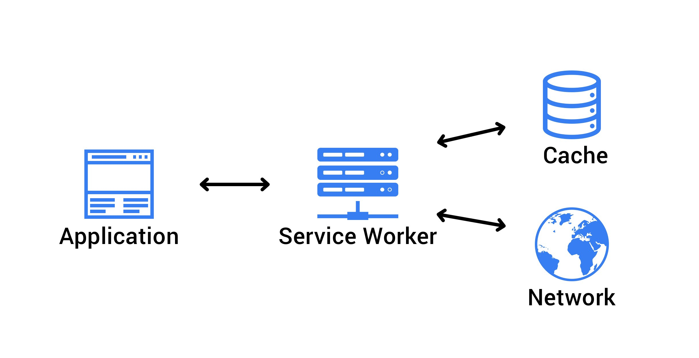

# Lighthouse 퍼포먼스 점수 올리기 3: HTTP 캐싱 메커니즘, `Cache-Control` 응답 헤더, Service Worker, Cache Storage API, `@vue/cli-plugin-pwa` 플러그인으로 Vue 앱 Service Worker 구성하기

<br>

1. HTTP 캐싱 메커니즘
2. `Cache-Control` 응답 헤더 설정
3. Service Worker, Cache Storage API로 캐싱하기
4. `@vue/cli-plugin-pwa` 플러그인으로 Vue 앱 Service Worker 구성하기
5. 새 Service Worker 즉시 작동하게 만들기: 라이프사이클 `install` ~ `activate`, `skipWaiting()`, `clients.claim()`

<br>

## 1. HTTP 캐싱 메커니즘

Pre-cache(미리 캐싱하기)는 PRPL 패턴의 세 번째 전략입니다. 리소스를 캐싱하고 재활용함으로써 불필요한 로딩을 줄이는 방식으로 FCP를 개선할 수 있습니다. [HTTP 캐싱](https://developer.mozilla.org/en-US/docs/Web/HTTP/Caching)은 캐시(저장소)에 리소스의 복사본을 저장하고 있다가 요청 시에 서버로부터 리소스를 다시 다운로드하는 대신 해당 복사본을 반환하는 기술입니다. 다음 그림의 `Local (private) cache` 부분이 웹에서 가장 기본적으로 사용하게되는 브라우저 캐시의 매커니즘입니다. 각 사용자의 최초 요청 시에는 서버까지 요청이 도달하여 리소스가 응답되지만, 이후 요청부터는 서버까지 요청이 전달되지 않고 브라우저 캐시에 저장되어있는 리소스의 복사본이 응답됩니다.

<br>


사친출처 : [HTTP caching | MDN](https://developer.mozilla.org/en-US/docs/Web/HTTP/Caching)

<br>

캐시의 저장공간은 유한하기 때문에 모든 리소스를 영원히 누적하여 저장할 수는 없습니다. 때문에 캐시에 저장된 리소스들은 유효기간을 가집니다. 유효기간 만료 전에는 리소스가 유효(fresh)하고, 만료 후에는 실효(stale)하다고 말합니다. 실효된 리소스는 바로 축출되거나 무시되지 않습니다. 캐시가 실효된 리소스에 대한 요청을 받으면, 이 리소스가 아직 유효한지 확인하기 위해 서버에 요청을 보냅니다. 이때 [`If-None-Match`](https://developer.mozilla.org/en-US/docs/Web/HTTP/Headers/If-None-Match) 요청 헤더가 사용되고요, 아직 유효한 리소스라면 서버는 리소스를 응답하지 않고 [`304 Not Modified`](https://developer.mozilla.org/ko/docs/Web/HTTP/Status/304) 헤더를 응답하여 트래픽을 절약합니다. 이 응답을 받으면 캐시는 리소스의 유효기간을 Refresh 합니다.

<br>

## 2. `Cache-Control` 응답 헤더 설정

HTTP 응답 헤더 중 [`Cache-Control`](https://developer.mozilla.org/en-US/docs/Web/HTTP/Headers/Cache-Control)를 사용하여 브라우저 캐시가 해당 리소스를 저장해야하는지, 저장한다면 얼마나 오랫동안 보관해야하는지, 사용자간 리소스 공유 여부 등을 명시할 수 있습니다. 특히 버전이 있는 리소스를 관리하는 측면에서 유용한데요, 캐싱 유효기간이 남아있더라도 리소스 URL의 버전 정보가 바뀌면 새로운 리소스로 인지하여 업데이트된 리소스를 바로 가져오기 때문이죠.

<br>

### 캐싱 막기

다음과 같이 설정하면 캐시에 아무것도 저장하지 않습니다.

```
Cache-Control: no-store
```

<br>

### 캐싱 후 요청시마다 검증하기

캐시에서 리소스에 대한 요청을 받으면, 사용자에게 바로 응답하지 않고 서버에 해당 리소스의 유효여부를 검증하는 요청을 보냅니다.

```
Cache-Control: no-cache
```

<br>

### 캐싱 유효기간 명시하기

`Cache-Control: max-age=N` 헤더가 설정된 경우, 유효기간은 `N`과 동일합니다. 초단위(`s`)입니다. 만약 [`Expires`](https://developer.mozilla.org/en-US/docs/Web/HTTP/Headers/Expires) 헤더가 있더라도, 이 설정값이 덮어씁니다. 이 설정값이 없다면, `Expires` 헤더가 있는지 없는지를 검사합니다. `Expires` 헤더가 존재한다면, 그것의 값에서 `Date` 헤더의 값을 뺀 결과가 유효기간이 됩니다. `Cache-Control: max-age=N`, `Expires` 헤더 모두 없다면 [Heuristic freshness checking](https://developer.mozilla.org/en-US/docs/Web/HTTP/Caching#heuristic_freshness_checking)에 따라 유효기간이 계산됩니다.

```
Cache-Control: max-age=31536000
```

<br>

### 실효 리소스 검증하기

[실효된 리소스에 대한 요청](https://developer.mozilla.org/en-US/docs/Web/HTTP/Caching#freshness)을 받으면, 검증합니다.

```
Cache-Control: must-revalidate
```

<br>


### 리소스 공유 여부

`private`으로 설정하면, 브라우저에서 제공하는 개인용 캐시에만 저장됩니다. 브라우저 캐시는 사용자 개개인이 사용한 리소스를 저장하는 곳으로, 가장 기본적인 캐싱에 사용되는 캐시입니다. 따라서 여러 사용자가 공유할 수 있는 공유 캐시에는 저장되지 않습니다. 공유 캐시를 포함하여 모든 형태의 캐시에 저장하는 것을 허용하려면 `public`으로 설정하면 됩니다.

```
Cache-Control: private
```

<br>

## 3. Service Worker, Cache Storage API로 캐싱하기

### 3-1. Service Worker, Cache Storage API

프론트엔드에서 캐싱은 [Service Worker](https://developer.mozilla.org/en-US/docs/Web/API/Service_Worker_API)와 [Cache Storage](https://developer.mozilla.org/en-US/docs/Web/API/CacheStorage) 웹API를 사용하여 구현할 수 있습니다. Service Worker는 브라우저에서 서버로 요청을 보내려는 순간 끼어들어, 다양한 일들을 수행하는 일종의 인터셉터입니다. 앱의 Service Worker로 등록된 JavaScript 파일에 Cache Storage API를 사용하여 캐싱을 매니징하는 코드를 작성하면 됩니다. Cache Storage API는 HTTP 요청과 응답 정보를 캐시에 저장, 조회, 관리하는 기능을 제공합니다.

<br>



<br>

Cache Storage API를 사용하여 캐싱을 컨트롤하더라도 `Cache-Control` 응답 헤더 설정을 무시할 수는 없습니다. [Serve static assets with an efficient cache policy](https://web.dev/uses-long-cache-ttl/) 문서에 따르면, 어떤 리소스에 대한 요청이 있을 때 브라우저는 무조건 브라우저 캐시에 해당 리소스의 복사본이 존재하는지 체크하기 때문이죠.

> When populating the Cache Storage API cache, the browser defaults to checking for existing entries in the HTTP cache, and uses those if found.

<br>

### 3-2. Service Worker 직접 등록하기

보통 앱의 빌드 시점에 Service Worker를 자동으로 생성하고 등록해주는 [플러그인을 사용](https://web.dev/workbox/#how-should-you-use-workbox)합니다. 플러그인을 사용할 수 없는 환경이라면 직접 Service Worker 파일을 작성하고 등록할 수 있습니다. Service Worker 웹API를 직접 핸들링하면 되겠죠. Service Worker API를 핸들링할 파일 `registerServiceWorker.js`를 생성하시고요, Service Worker로 사용될 파일 `service-worker.js`도 생성해주세요. 이제 `registerServiceWorker.js` 내에서 `navigator.serviceWorker.register()` 메소드를 사용하여 `service-worker.js` 파일을 앱의 Service Worker로서 등록하면 끝입니다.

```javascript
// registerServiceWorker.js

async function registerServiceWorker() {
	if ("serviceWorker" in navigator) {
		try {
			const reg = await navigator.serviceWorker.register(
				"./service-worker.js",
				{
					scope: "./",
				}
			);

			// ..
		} catch (e) {
			// ..
		}
	}
}

registerServiceWorker();
```

<br>

### 3-3. Cache Storage API 맛보기

#### 캐시에 서버응답 저장

```javascript
// service-worker.js

// ..

// 캐시를 열고
const cache = await caches.open('static-v1');

// data.json 요청에 대한 응답 데이터를 받으면 캐시에 저장
const request = new Request('/data.json')
cache.add(request);
```

<br>

#### 캐시로부터 데이터 회수하기

`Cache.match()` 메소드는 캐시에 저장되어있는 지난 HTTP 요청 정보 중 현재 요청과 일치하는 요청이 있는 지 검사하고, 있다면 해당 요청에 대한 응답 데이터를 반환합니다. 이때 요청 URL, [`Vary`](https://developer.mozilla.org/en-US/docs/Web/HTTP/Headers/Vary) 요청 헤더, 메소드(`GET`, `POST` 등), 쿼리 스트링을 모두 검사합니다.

```javascript
// service-worker.js

// ..

const options = {
	ignoreSearch: false,
	ignoreMethod: false,
	ignoreVary: true,
};

// 일치하는 요청에 대한 응답 데이터를 반환
const response = await cache.match(request, options);
```

<br>

[Service workers and the Cache Storage API](https://web.dev/service-workers-cache-storage/), [Using Service Workers](https://developer.mozilla.org/en-US/docs/Web/API/Service_Worker_API/Using_Service_Workers) 문서에서 더 자세한 사용법을 확인할 수 있습니다.

<br>

## 4. `@vue/cli-plugin-pwa` 플러그인으로 Vue 앱 Service Worker 구성하기

### 4-1. `@vue/cli-plugin-pwa` 플러그인

만약 Vue([`@vue/cli`](https://cli.vuejs.org/)) 앱에서 Service Worker를 간단하게 관리하시려면 [`@vue/cli-plugin-pwa`](https://cli.vuejs.org/core-plugins/pwa.html#configuration) 플러그인을 사용할 수 있겠습니다. 이 플러그인의 역할 중 하나는 Service Worker 파일을 빌드 시점에 자동으로 생성하는 것인데요, [Workbox](https://developers.google.com/web/tools/workbox) 기반의 [`workbox-webpack-plugin`](https://developers.google.com/web/tools/workbox/modules/workbox-webpack-plugin) 플러그인을 내부적으로 사용하여 Service Worker를 관리하고, Vue 앱의 빌드 프로세스에 통합시킵니다.

<br>

하지만 Cache Storage API, [Push API](https://developer.mozilla.org/en-US/docs/Web/API/Push_API)와 같이 Service Worker의 기능들을 세세하게 조작하고 사용할 계획이라면, Workbox의 Service Worker 자동생성 기능을 사용하는데 한계가 있기 때문에 이 플러그인이 유용하지 않을 수 있습니다.

<br>

### 4-2. `@vue/cli-plugin-pwa` 설치하기

이미 생성된 Vue 프로젝트가 있다면, 프로젝트 루트 경로에서 다음 명령어를 사용하여 `@vue/cli-plugin-pwa` 플러그인을 설치합니다.

```
vue add pwa
```

<br>

이 플러그인을 설치해보니, 다음과 같은 변경들이 생겼습니다.

- `package.json` 파일의 `devDependencies` 필드에 `@vue/cli-plugin-pwa` 플러그인이 추가됨
- `src/` 경로에 `registerServiceWorker.js` 파일이 생성되고, 이 파일은 Service Worker 등록에 대한 로직을 담고 있음
- `src/main.js` 파일에 `import './registerServiceWorker'` 라인이 추가됨
- `public/` 경로에 `robots.txt` 파일이 생성됨 (**이미 이 파일이 있다면 덮으쓰므로 주의하세요**)
- `public/img/icons` 경로에 PWA 구성에 요구되는 규격의 샘플 앱 아이콘 파일들이 생성됨

<br>

### 4-3. `@vue/cli-plugin-pwa` 플러그인 기본 설정

이 플러그인은 크게 Service Worker에 대한 설정과, [Manifest](https://developer.mozilla.org/ko/docs/Web/Manifest)에 대한 설정을 지원합니다. 각 설정값들에 따라 Service Worker 파일과 Manifest 파일을 자동으로 생성해주고요. 설정은 다음의 두 가지 방법 중 하나를 택해서 진행하면 됩니다. 자세한 내용은 [공식문서](https://cli.vuejs.org/core-plugins/pwa.html#configuration)를 참고하세요.

- `vue.config.js` 파일 내에서 `pwa` 속성에 접근
- `package.json` 파일 `vue` 필드에서 `pwa` 속성에 접근

<br>

#### `vue.config.js`에서 설정하기

저는 `vue.config.js` 파일에서 설정을 관리했습니다. `workboxPluginMode` 속성에 `GenerateSW`/`InjectManifest` 둘 중 한 가지 모드를 택하여 지정하는 것으로 설정을 시작하면 됩니다. `GenerateSW`는 빌드시 Service Worker 파일을 자동생성하는 모드이고, `InjectManifest`는 직접 만든 Service Worker 파일을 사용하는 모드입니다. [Push와 같은 Service Worker 기능들을 사용하려면 `InjectManifest` 모드를 사용해야합니다](https://developers.google.com/web/tools/workbox/modules/workbox-webpack-plugin). 참고로 `InjectManifest` 모드를 사용하면, 프로젝트에 이미 존재하는 Service Worker 파일을 사용하는 것이므로 `workboxOptions.swSrc` 속성에 파일 경로를 필수적으로 지정해주어야합니다. 이때 플러그인 설치시 자동으로 생성된 `registerServiceWorker.js` 파일 내에서 Service Worker 등록에 사용되는 파일명과 일치해야하고요! 이 외 모든 `workboxOptions` 속성들은 [Workbox 공식문서](https://developers.google.com/web/tools/workbox/reference-docs/latest/module-workbox-webpack-plugin.InjectManifest#InjectManifest)에서 확인할 수 있습니다.

```javascript
// vue.config.js

module.exports = {
  pwa: {
    name: 'My App',
    themeColor: '#4DBA87',
    msTileColor: '#000000',
    appleMobileWebAppCapable: 'yes',
    appleMobileWebAppStatusBarStyle: 'default',
	iconPaths: {
		// ..
	},
	manifestOptions: {
		// ..
	},
	workboxPluginMode: 'InjectManifest',
    workboxOptions: {
      swSrc: 'public/service-worker.js',
    }
	// ..
  }
}
```

<br>

### 4-4. HTTPS로 Service Worker 테스트하기

이 플러그인에서 다루는 Service Worker 파일은 프로덕션 모드, 그러니까 `process.env.NODE_ENV === 'production'` 일 때만 작동하므로, 로컬에서 테스트하려면 앱을 프로덕션 빌드하고 [`serve`](https://yarnpkg.com/package/serve#readme)와 같은 HTTP 서버로 실행하여 테스트해볼 수 있겠습니다.

```zsh
# 저의 경우 다음 명령어가 실행됩니다 : cross-env NODE_ENV=production vue-cli-service build --modern
yarn build
```

<br>

저는 앞으로도 `serve`를 계속 사용해보기 위해 전역 설치했습니다.

```zsh
yarn global add serve
```

<br>

빌드 결과물이 `dist` 경로에 있다고 가정하고, `serve`를 사용해서 실행합니다.

```zsh
# -s 플래그는 SPA 모드로 실행하라는 의미입니다
serve -s dist
```

<br>

그다음, Service Worker가 HTTPS에서만 작동하므로 [ngrok](https://ngrok.com/)을 사용해서 HTTPS 환경에서 테스트했습니다.

<br>

## 5. Service Worker 라이프사이클: `install`, `activate`, `fetch`

### 5-1. `install` → `activate`

먼저 [Service Worker의 라이프사이클](https://developers.google.com/web/fundamentals/primers/service-workers/lifecycle)을 알아야합니다. [Using Service Workers | MDN](https://developer.mozilla.org/ko/docs/Web/API/Service_Worker_API/Using_Service_Workers#install_and_activate_populating_your_cache) 문서에 따르면, Service Worker 등록시 `install`, `activate` 순으로 사이클이 진행되고 각 사이클에 접근할 수 있는 이벤트가 발생합니다.

> After your service worker is registered, the browser will attempt to install then activate the service worker for your page/site.

<br>

#### `install`

[`install`]()은 Service Worker가 실행될 때 가장 처음 발생하는 이벤트이고요, Service Worker당 한 번만 발생하는 이벤트입니다. Service Worker 파일에 변경이 있으면 새로운 Service Worker로 인식하므로 다시 `install` 이벤트가 발생하고요. 

<br>

Service Worker를 활용하는 캐싱은 바로 이 `install` 이벤트가 발생했을 때 진행됩니다. `event.waitUntil()` 메소드의 인자로 `Promise` 객체를 넘겨주면, 브라우저는 `install`이 완료되었는지, 성공했는지와 같은 정보를 얻게 됩니다. 여기서 실패하게 되면 Service Worker는 무시됩니다.

```javascript
// service-worker.js

self.addEventListener('install', event => {
  event.waitUntil(
    (async () => {
		const cache = await caches.open('static-v1');
		await cache.add(new Request('/data.json'));
	})()
  );
});
```

<br>

#### `activate`

Service Worker 설치가 성공적으로 완료되면, Service Worker가 활성화되고 `activate` 이벤트가 발생합니다. 여기서 주의할 점은 Service Worker가 활성화되었다고해서 이전에 사용중이던 Service Worker를 즉시 대체하여 작동하지 않는다는 것입니다. 앱이 처음 로드될 때는 이전에 캐싱된 Service Worker가 사용됩니다. 새로운 Service Worker가 등록되고 설치되는동안 브라우저는 미리 캐싱한 리소스들을 사용하여 사용자가 기다리지 않고 앱을 즉시 사용할 수 있게 해야하기 때문입니다. 활성화된 새로운 Service Worker는 사용자가 앱을 새로고침하면 그제서야 작동합니다.

```javascript
// service-worker.js

self.addEventListener('activate', (event) => {
  event.waitUntil(
    (async () => {
		// ..
    })()
  );
});
```

<br>

### 5-2. `fetch`

[`fetch`](https://developer.mozilla.org/en-US/docs/Web/API/FetchEvent) 이벤트는 브라우저가 [Service Worker의 Scope](https://developers.google.com/web/fundamentals/primers/service-workers/lifecycle#scope_and_control)에 한해 요청을 보낼 때마다 발생합니다. 참고로 Service Worker의 디폴트 Scope은 `/` 입니다.

> The fetch event runs every time the browser attempts to access content within the scope of the Service Worker. - [Using fetch in Service Workers | Microsoft Edge Developer documentation](https://docs.microsoft.com/en-us/microsoft-edge/progressive-web-apps-chromium/how-to/service-workers#using-fetch-in-service-workers)

<br>

바로 이 사이클에서 캐싱된 리소스를 검증하고 유효하다면 저장해놓은 리소스를 응답하면 됩니다. 또는 아래 예시와 같이 서버 응답에 오류가 있을 때 캐싱된 리소르를 응답해줌으로써 오프라인 Fallback을 제공할 수 있겠습니다. 응답은 `event.respondWith()` 메소드를 사용합니다.

```javascript
self.addEventListener('fetch', (event) => {
	if (event.request.mode !== 'navigate')
		return;
	
	event.respondWith(
		(async () => {
		try {
			// First, try to use the navigation preload response if it's supported.
			const preloadResponse = await event.preloadResponse;
			if (preloadResponse)
				return preloadRsponse;

			// Always try the network first.
			const networkResponse = await fetch(event.request);
			return networkResponse;
		} catch (error) {
			const cache = await caches.open('static-v1');
			const cachedResponse = await cache.match(request);
			return cachedResponse;
		}
		})()
	)
});
```

<br>

## 6. 새 Service Worker 즉시 작동하게 만들기: `skipWaiting()`, `clients.claim()`

### 6-1. `skipWaiting()`

`skipWaiting()` 메소드는 `install` 이벤트가 발생했을 때, 이미 대기중인 Service Worker가 발견되면 그 Service Worker가 즉시 작동하도록 하는 메소드입니다. 캐싱된 Service Worker 중에서 가장 최신의 것이 작동하도록 하는데 사용됩니다. `install` 리스너의 콜백 안에서 호출합니다.

```javascript
// service-worker.js

self.addEventListener('install', event => {
  event.waitUntil(
    (async () => {
		const cache = await caches.open('static-v1');
		await cache.add(new Request('/data.json'));
	})()
  );

  self.skipWaiting();
});
```

<br>

### 6-2. `clients.claim()`

사용자가 앱을 새로고침해야만 새로 활성화된 Service Worker가 작동하는데요, 하지만 사용자들은 특별한 이유가 없는 한 앱을 새로고침하지 않기 때문에 새롭게 활성화된 Service Worker에 대한 요청을 강제하는 방법이 제공됩니다. `clients.claim()` 메소드이고요, `activate` 리스너의 콜백 안에서 호출합니다.

```javascript
// service-worker.js

self.addEventListener('activate', (event) => {
  event.waitUntil(
    (async () => {
		// ..
    })()
  );

  self.clients.claim();
});
```

<br>

### 6-3. `@vue/cli-plugin-pwa`에서의 설정

Workbox를 사용하여 Service Worker 파일을 자동 생성한다면 [`skipWaiting()`](https://developers.google.com/web/tools/workbox/modules/workbox-core#the_skipwaiting_wrapper_is_deprecated), [`clientsClaim()`](https://developers.google.com/web/tools/workbox/modules/workbox-core#clients_claim) 메소드를 사용합니다. 참고로 `skipWaiting()`은 Workbox v6부터 Deprecate 되었기때문에 `self.skipWaiting()`을 직접 사용해야 합니다. `@vue/cli-plugin-pwa`를 사용한다면 `vue.config.js` 파일에서 아래와 같이 지정해줍니다.

```javascript
// vue.config.js

module.exports = {
  pwa: {
	// ..
    workboxOptions: {
		// ..
		skipWaiting: true, // deprecated from Workbox v6
		clientsClaim: true
    }
	// ..
  }
}
```

<br>

---

### References

- [Vue.js Performance | Vue School](https://vueschool.io/articles/series/vue-js-performance/)
- [Mastering Browser Cache | Vue School](https://vueschool.io/articles/vuejs-tutorials/vue-js-performance-mastering-cache/)
- [Caching in a Vue.js PWA - Axel Hodler](https://axelhodler.medium.com/caching-in-a-vue-js-pwa-845233696072)
- [The Service Worker Lifecycle - Jake Archibald](https://developers.google.com/web/fundamentals/primers/service-workers/lifecycle)
- [Speed up Service Worker with Navigation Preloads - Jake Archibald](https://developers.google.com/web/updates/2017/02/navigation-preload)
