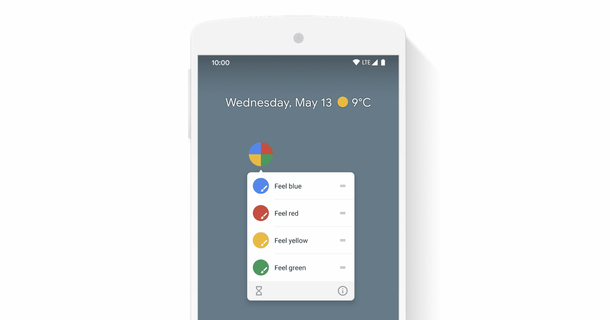
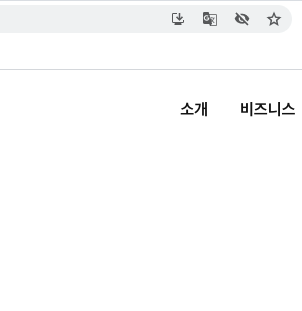
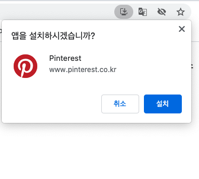
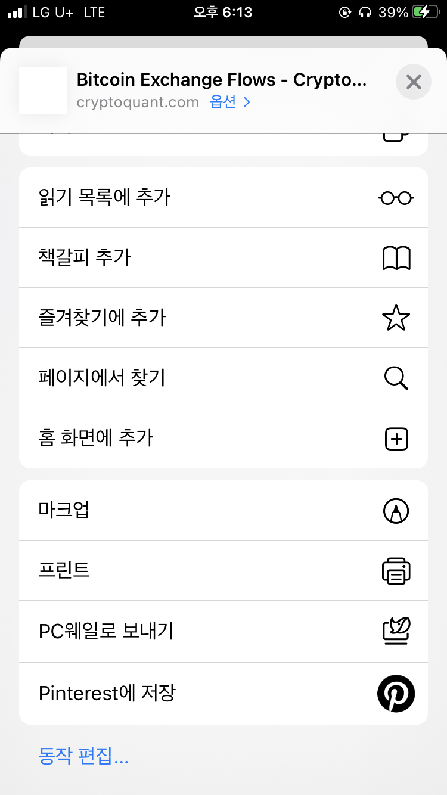

# PWA(Progressive Web App)

<br>

## 1. PWA(Progressive Web App)

### 1-1. PWA란?

PWA(Progressive Web App)란 말그대로 점진적인 웹 앱입니다. 웹사이트와 네이티브 앱의 장점을 모두 갖도록 개발된 웹의 확장판 정도로 이해해볼 수 있는데요, 오프라인에서 동작, 설치 가능, 쉬운 동기화, 푸시 알림 등 네이티브 앱에서만 가능하던 특정 기능들을 포함한 웹 앱을 PWA라고 합니다. 중요한 것은 PWA로 식별되는 기능들을 오래된 브라우저가 지원하지 않더라도 사용자들이 앱을 이용할 수 있도록 "점진적으로" 적용하는 것입니다. 모든 사용자가 앱을 사용할 수 있지만, 최신 브라우저 사용자는 PWA 기능으로부터 더 많은 이점을 얻을 수 있도록 합니다.

<br>

다음은 웹 앱을 PWA로 식별하기 위한 몇 가지 핵심 원칙입니다.

- 발견 가능 : 브라우저의 검색엔진을 통해 찾을 수 있음

- 설치 가능 : 디바이스의 홈 화면에 추가하여 사용할 수 있음

- 연결 가능 : URL을 공유할 수 있음

- 네트워크 독립적 : 오프라인이나 불안정한 네트워크 환경에서 동작함

- 점진적 : 이전 브라우저의 기본 기능을 여전히 사용할 수 있어야함

- 재참여 (Re-engageable) : 새로운 컨텐츠가 사용 가능할 때마다 알림 전송이 가능함

- 반응형 : 모든 디바이스, 모든 브라우저에서 호환됨

- 안전 : 사용자의 민감한 데이터에 접근하려는 시도로 부터 안전함

<br>

PWA의 장점은 네이티브 앱의 편리함과 웹의 접근성을 모두 잡을 수 있다는 것입니다. 네이티브 앱의 편리하고 부드러운 UX를 제공하면서, 웹의 검색엔진을 통하거나 링크를 공유하여 서비스에 바로 접근할 수 있도록 합니다. 앱스토어에서 앱을 검색하고 다운로드할 필요 없이 자주 사용하는 웹사이트를 디바이스의 홈화면에 앱처럼 추가하여 사용할 수 있죠. FIRE(Fast, Integrated, Reliable, Engaging)는 PWA 전략을 나타내는 키워드들입니다. PWA 적용사례는 [PWA Stats](https://www.pwastats.com/)에서 확인할 수 있습니다.

<br>

### 1-2. 브라우저 호환성

PWA는 여러 API를 사용하지만, 그 중 핵심 기술은 [Service Worker API](https://developer.mozilla.org/ko/docs/Web/API/Service_Worker_API)입니다. [Is Service Worker Ready?](https://jakearchibald.github.io/isserviceworkerready/#moar)에서 Service Worker API의 브라우저 지원 현황을 확인할 수 있습니다. 또한 [Edge](https://docs.microsoft.com/en-us/microsoft-edge/progressive-web-apps-chromium/#requirements)/[Firefox](https://developer.mozilla.org/en-US/docs/Web/Progressive_web_apps/Add_to_home_screen#How_do_you_make_an_app_A2HS-ready)/[Opera](https://dev.opera.com/articles/installable-web-apps/)/[Samsung Internet](https://hub.samsunginter.net/docs/ambient-badging/)/[UC Browser](https://plus.ucweb.com/docs/pwa/docs-en/zvrh56) 각 브라우저의 공식사이트에서 PWA 지원범위를 할 수 있습니다.

- Safari 11.1부터 대부분 기능 지원 (푸시알림 불가)
- Chrome 40부터 대부분 기능 지원 (iOS용 제외)
- MS Edge 17부터 대부분 기능 지원

<br>

iOS Safari에서 PWA를 지원하려면 [iOS에서의 PWA](./#ios에서의-pwa) 섹션을 참고하세요.

<br>

### 1-3. 예제 사이트

[Hacker News readers as Progressive Wep Apps](https://hnpwa.com/)에서 React, Vue 등 프론트엔드 프레임워크에서 PWA를 구현하는 예제를 확인할 수 있고요, Service Worker 사용 예제와 푸시 알림 예제는 [Service Worker Cookbook](https://serviceworke.rs/)에서 확인할 수 있습니다.

<br>

### 1-4. PWA 완성도 측정하기, PWA를 네이티브 앱으로 포장하기

웹 앱의 완성도를 측정하는 [Lighthouse](https://developers.google.com/web/tools/lighthouse/)와 같은 도구들을 사용하여 앱이 얼마나 PWA에 부합하는지 체크할 수 있고요, [PWABuilder](https://www.pwabuilder.com/)를 사용하여 PWA를 네이티브 앱으로 포장하여 앱스토어에 등록할 수도 있습니다.

<br>

## 2. App Shell

PWA를 제공하는 방법중 [App Shell](https://developer.mozilla.org/en-US/docs/Web/Progressive_web_apps/App_structure#app_shell)이라는 개념이 있습니다. SSR(Server-side rendering)과 CSR(Client-side rendering)을 믹스한 개념으로, 사용자가 앱에 재방문했을 때 캐시에서 UI를 즉시 로드하여 보여주기 때문에 인터넷이 없어도 앱을 사용할 수 있습니다. 새로 업데이트된 부분만 서버에 요청하여 받아오기 때문에 전체 페이지를 로딩하는 것보다 빠르고 부드러운 UX를 제공할 수 있습니다. 무엇을 캐시에서 받아오고, 무엇을 서버에 새로 요청할지는 [Service Worker API](https://developer.mozilla.org/en-US/docs/Web/API/Service_Worker_API)를 사용하여 설정할 수 있습니다.

<br>

## 3. 최소 조건

PWA로서 식별되기 위한 최소 조건을 충족하면서, 동시에 앱이 사용자의 OS에 설치되어있지 않다면 브라우저는 사용자가 웹 앱을 디바이스에 설치하도록 자동으로 유도합니다. PWA로서 식별되기 위한 최소 조건은 다음과 같습니다.

- HTTPS 통신

- [`manifest.webmanifest`](https://web.dev/add-manifest/)(`manifest.json`)파일을 포함하고, 이 파일은 최소 아래의 항목들을 포함

```json
{
	"name": "name",
	"icons": [
		// ..
	],
	"start_url": "/",
	"display": "fullscreen",
	"prefer_related_applications": false
}
```

<br>

참고로,

- `name` 대신 `short_name`만 포함해도 됩니다.
- `prefer_related_applications`의 기본값은 `false`이므로 명시하지 않아도 됩니다. `related_applications` 항목에 관련된 네이티브 앱을 지정하고, `prefer_related_applications` 값을 `true`로 지정하면, Android에서는 앱 설치를 유도하기 위해 사용자를 자동으로 Google Playstore로 이동시킵니다.

<br>

## 4. `webmanifest` 파일을 사용하여 Manifest 구성하기

### 4-1. `webmanifest` 파일

`webmanifest` 포맷의 파일은 사용자의 브라우저에 PWA에 대한 정보를 알려주는 역할을 합니다. PWA 설정 파일이라고 보면 됩니다. 예를 들어, 아래와 같이 `<head>` 태그 내에 `manifest.webmanifest` 파일을 포함시키면 브라우저는 `manifest.webmanifest` 파일을 PWA 설정 파일로 인식하고 정보를 전달받습니다. 파일명은 `webmanifest` 포맷으로 자유롭게 정하거나, `manifest.json`로 정합니다.

<br>

```html
<head>
	<!-- .. -->
	<link rel="manifest" href="/manifest.webmanifest" />
</head>
```

<br>

`credentials`가 필요하다면 위 태그에 `crossorigin="use-credentials"` 속성을 추가하세요.

<br>

`webmanifest` 파일은 Chrome/Edge/Firefox/UC Browser/Opera/Samsung 브라우저에서 지원하고, Safari에서는 부분 지원합니다. 다음은 `webmanifest` 파일 구성 예시입니다.

```json
{
	"short_name": "Weather",
	"name": "Weather: Do I need an umbrella?",
	"description": "Weather forecast information",
	"icons": [
		{
			"src": "/images/icons-192.png",
			"type": "image/png",
			"sizes": "192x192"
		},
		{
			"src": "/images/icons-512.png",
			"type": "image/png",
			"sizes": "512x512"
		}
	],
	"start_url": "/?source=pwa",
	"scope": "/",
	"display": "standalone",
	"background_color": "#3367D6",
	"theme_color": "#3367D6",
	"shortcuts": [
		{
			"name": "How's weather today?",
			"short_name": "Today",
			"description": "View weather information for today",
			"url": "/today?source=pwa",
			"icons": [{ "src": "/images/today.png", "sizes": "192x192" }]
		},
		{
			"name": "How's weather tomorrow?",
			"short_name": "Tomorrow",
			"description": "View weather information for tomorrow",
			"url": "/tomorrow?source=pwa",
			"icons": [{ "src": "/images/tomorrow.png", "sizes": "192x192" }]
		}
	]
}
```

<br>

### 4-2. `webmanifest` 항목

#### `name` / `short_name`

- `name` : 웹앱의 이름, 설치될 때 사용됩니다.
- `short_name` : `name`보다 우선적으로 사용됩니다. 앱이 홈 화면에 추가되었을 때 아이콘 이미지와 함께 노출되는 이름이죠.

<br>

#### `icons`

아이콘 정보를 담는 배열입니다. 아래와 같은 하위 속성들을 갖고요, `src`, `sizes`, `type` 속성은 반드시 포함해야 합니다.

- `src` : 이미지 경로

- `sizes` : 이미지가 적용될 디바이스 사이즈 (`px`)

- `type` : 이미지 타입

<br>

<br>

Android Chrome에서 디바이스 크기에 따라 아이콘 사이즈를 자동으로 핏되게 하려면 `192 * 192 px` / `512 * 512 px` 사이즈의 이미지를 반드시 지정해야합니다. 만약 Android에서 디바이스 크기에 따라 최적화된 픽셀(`px`) 경험을 제공하려면 아이콘 이미지의 사이즈를 `48dp`로 지정하세요. `48dp`는 디바이스의 해상도에 따라 `48px`, `72px`, `96px`, .. 등으로 변환되죠.

##### Android Maskable Icons

Android에서 [maskable icons](https://web.dev/maskable-icon/)를 사용하려면 해당 아이콘 정보에 `purpose` 속성을 추가하고, 값은 `any maskable`로 지정하세요.

```json
{
	"icons": [
		{
			"src": "/images/icons-192.png",
			"type": "image/png",
			"sizes": "192x192",
			"purpose": "any maskable"
		}
	]
}
```

<br>

#### `start_url`

앱을 실행될 때 앱을 시작할 페이지 URL입니다.

<br>

#### `scope`

PWA에 속하는 페이지들의 URL 범위를 지정합니다. 지장한 URL 범위 밖의 페이지들은 PWA에 속하지 않는 것으로 간주됩니다.

- `scope`을 지정하지 않으면, `manifest.json` 파일이 위치한 디렉토리가 `scope`의 값으로 사용됩니다.
- `scope`의 값은 상대경로/절대경로 모두 가능합니다.
- `start_url`은 당연히 `scope`에서 지정한 URL 범위 내에 있어야합니다.
- `start_url`은 `scope`에 지정된 경로를 기준으로 하는 상대경로입니다.
- `start_url`이 `/`으로 시작되면 루트경로로 인식됩니다.

<br>

```
★ 주의 : PWA에서 `<a>` 태그를 사용하면 무조건 PWA 내에서 이동하고 실행됩니다. 이동하는 URL이 `scope`에서 지정한 범위를 벗어나도 말이죠. PWA를 벗어나서 외부 사이트로 이동하도록 하려면 `<a>` 태그에 `target="_blank"` 속성값을 지정해야합니다. Android Chrome에서는 브라우저의 새 탭이 열리고 해당 URL로 이동하게 됩니다.
```

<br>

#### `background_color`

모바일에서 처음 앱을 실행시켰을 때 보여줄 스플래시 화면(Splash screen)의 배경색을 지정합니다.

<br>

#### `display`

앱이 실행되었을 때 보여질 브라우저 UI 형태를 지정합니다. 아래의 값 중에서 지정할 수 있습니다.

- `fullscreen` : 브라우저 UI를 완전히 제거하고 디바이스의 뷰포트(Viewport) 전체를 사용
- `standalone` : 브라우저의 주소창을 제거하여 독립적인 앱처럼 보이도록 함, PC에서는 앱이 실행되는 독립된 창을 사용
- `minimal-ui` : `standalone` 디스플레이와 비슷하지만, 브라우저의 뒤로가기/새로고침 등 일부 UI를 제공
- `browser` : 일반적인 브라우저 UI를 모두 사용

<br>

#### `theme_color`

디바이스에 설치된 앱의 툴바(상태바) 색을 지정합니다. `<head>`의 `<meta>` 태그로 지정한 색과 일치해야 합니다.

<br>

#### `shortcuts`

PWA의 [쇼트컷(Shortcut)](https://web.dev/app-shortcuts/) 페이지들을 지정합니다. Android에서는 앱 아이콘을 길게 눌러서 아래와 같이 특정 페이지들에 빠르고 편하게 접근할 수 있습니다.



<br>

아래와 같이 지정하면 됩니다.

```json
 "shortcuts": [
    {
      "name": "Open Play Later",
      "short_name": "Play Later",
      "description": "View the list of podcasts you saved for later",
      "url": "/play-later?utm_source=homescreen",
      "icons": [{ "src": "/icons/play-later.png", "sizes": "192x192" }]
    },
    {
      "name": "View Subscriptions",
      "short_name": "Subscriptions",
      "description": "View the list of podcasts you listen to",
      "url": "/subscriptions?utm_source=homescreen",
      "icons": [{ "src": "/icons/subscriptions.png", "sizes": "192x192" }]
    }
  ]
```

<br>

#### 기타 항목

더 많은 항목들을 지정하려면 [MDN의 Web app manifests](https://developer.mozilla.org/en-US/docs/Web/Manifest) 문서를 참고하세요.

<br>

## 5. Service Worker

### 5-1. Service Worker란?

[Service Worker](https://developer.mozilla.org/en-US/docs/Web/API/Service_Worker_API)의 역할 중 하나는 웹 앱에서 외부로 요청(Request)을 보낼 때 인터셉터(Interceptor)로서 작동하는 것입니다. 요청이 보내지는 시점에 끼어들어 특정한 일을 처리할 수 있습니다. Service Worker API는 대부분의 브라우저에 내장되어 있고요, 개발자는 약간의 JavaScript 코드를 추가하여 Service Worker가 무슨 일을 할지 지정할 수 있습니다. 이 Service Worker를 사용하여 PWA 기능들을 구현할 수 있습니다.

<br>

### 5-2. Service Worker 등록하기

Service Worker API는 `window.navigator` 객체 내의 `serviceWorker`라는 이름의 객체로 제공됩니다. Service Worker API를 제공하는 브라우저라면, 처음 앱이 로드될 때 아래와 같이 `service-worker.js` 파일을 앱의 Service Worker로 등록시킵니다. 이제 `service-worker.js` 파일에 작성된 로직이 앱의 인터셉터로서 작동하게 됩니다.

```javascript
window.addEventListener("load", () => {
	if ("serviceWorker" in window.navigator) {
		window.navigator.serviceWorker.register("/service-worker.js");
	}
});
```

<br>

## 6. Service Worker 사용하여 오프라인 Fallback 페이지 커스텀하기

Service Worker를 사용하면 오프라인 Fallback 페이지를 커스텀할 수 있습니다. 사용자의 네트워크 환경이 불안정할 때, 아무것도 보여주지 않는 대신 설계된 UX를 제공할 수 있죠. Service Worker를 이용하여 네트워크 연결이 없을 때 보여줄 `offline.html` 파일을 미리 캐싱하는 아이디어입니다. 아래는 구글에서 제공하는 `service-worker.js`의 예시 코드입니다.

```javascript
/*
Copyright 2015, 2019, 2020 Google LLC. All Rights Reserved.
 Licensed under the Apache License, Version 2.0 (the "License");
 you may not use this file except in compliance with the License.
 You may obtain a copy of the License at
 http://www.apache.org/licenses/LICENSE-2.0
 Unless required by applicable law or agreed to in writing, software
 distributed under the License is distributed on an "AS IS" BASIS,
 WITHOUT WARRANTIES OR CONDITIONS OF ANY KIND, either express or implied.
 See the License for the specific language governing permissions and
 limitations under the License.
*/

// Incrementing OFFLINE_VERSION will kick off the install event and force
// previously cached resources to be updated from the network.
const OFFLINE_VERSION = 1;
const CACHE_NAME = "offline";
// Customize this with a different URL if needed.
const OFFLINE_URL = "offline.html";

self.addEventListener("install", (event) => {
	event.waitUntil(
		(async () => {
			const cache = await caches.open(CACHE_NAME);
			// Setting {cache: 'reload'} in the new request will ensure that the
			// response isn't fulfilled from the HTTP cache; i.e., it will be from
			// the network.
			await cache.add(new Request(OFFLINE_URL, { cache: "reload" }));
		})()
	);
	// Force the waiting service worker to become the active service worker.
	self.skipWaiting();
});

self.addEventListener("activate", (event) => {
	event.waitUntil(
		(async () => {
			// Enable navigation preload if it's supported.
			// See https://developers.google.com/web/updates/2017/02/navigation-preload
			if ("navigationPreload" in self.registration) {
				await self.registration.navigationPreload.enable();
			}
		})()
	);

	// Tell the active service worker to take control of the page immediately.
	self.clients.claim();
});

self.addEventListener("fetch", (event) => {
	// We only want to call event.respondWith() if this is a navigation request
	// for an HTML page.
	if (event.request.mode === "navigate") {
		event.respondWith(
			(async () => {
				try {
					// First, try to use the navigation preload response if it's supported.
					const preloadResponse = await event.preloadResponse;
					if (preloadResponse) {
						return preloadResponse;
					}

					// Always try the network first.
					const networkResponse = await fetch(event.request);
					return networkResponse;
				} catch (error) {
					// catch is only triggered if an exception is thrown, which is likely
					// due to a network error.
					// If fetch() returns a valid HTTP response with a response code in
					// the 4xx or 5xx range, the catch() will NOT be called.
					console.log("Fetch failed; returning offline page instead.", error);

					const cache = await caches.open(CACHE_NAME);
					const cachedResponse = await cache.match(OFFLINE_URL);
					return cachedResponse;
				}
			})()
		);
	}

	// If our if() condition is false, then this fetch handler won't intercept the
	// request. If there are any other fetch handlers registered, they will get a
	// chance to call event.respondWith(). If no fetch handlers call
	// event.respondWith(), the request will be handled by the browser as if there
	// were no service worker involvement.
});
```

<br>

오프라인 페이지 `offline.html`이 제대로 작동하려면 필요한 모든 리소스들도 미리 캐싱되어야 합니다. 가장 간단한 방법은 오프라인 페이지에 필요한 CSS와 JavaScript를 메인 페이지에 직접 포함시키는 것입니다. 따로 불러올 필요가 없도록 말이죠.

```html
<!DOCTYPE html>
<html lang="en">
	<head>
		<meta charset="utf-8" />
		<meta http-equiv="X-UA-Compatible" content="IE=edge" />
		<meta name="viewport" content="width=device-width, initial-scale=1" />
		<title>Offline</title>

		<!-- 인라인 스타일 -->
		<style>
			body {
				font-family: helvetica, arial, sans-serif;
				margin: 2em;
			}

			h1 {
				font-style: italic;
				color: #373fff;
			}

			p {
				margin-block: 1rem;
			}

			button {
				display: block;
			}
		</style>
	</head>
	<body>
		<h1>네트워크 연결이 불안정합니다.</h1>

		<p>페이지를 새로고침하려면 아래 버튼을 클릭하세요.</p>
		<button type="button">⤾</button>

		<!-- 인라인 JavaScript -->
		<script>
			document.querySelector("button").addEventListener("click", () => {
				window.location.reload();
			});
		</script>
	</body>
</html>
```

<br>

### \* `CacheStorage` API

[CacheStorage](https://developer.mozilla.org/en-US/docs/Web/API/CacheStorage) API를 사용하면 브라우저 캐싱을 JavaScript 코드로 컨트롤할 수 있습니다. 자세한 내용은 [The Cache Storage API](https://web.dev/service-workers-cache-storage/#the-cache-storage-api)를 참고하세요.

<br>

## 7. 알림 전송

### 7-1. Notification API

[Notification API](https://developer.mozilla.org/en-US/docs/Web/API/Notifications_API/Using_the_Notifications_API)를 사용하여 사용자에게 알림을 전송할 수 있습니다. 사용자의 인터렉션에 대한 응답으로만 알림을 발생시키는 것이 권장되며, 실제로 Firefox와 Safari는 이렇게 하고 있습니다.

<br>

`Notification` API는 아직 브라우저 호환 범위가 넓지 않습니다. 대표적으로 Android Webview와 iOS용 Safari에서는 전혀 지원하지 않습니다.

<br>

### 7-2. 권한 확인

먼저 읽기 전용 속성인 `Notification.permission`을 사용하여 현재 권한 상태를 확인합니다.

```javascript
if (!("Notification" in window)) return;

console.log(Notification.permission); // 'granted'
```

<br>

`Notification.permission`의 값은 다음 세 가지 중 하나입니다.

- `default` : 사용자에게 아직 권한을 요구하지 않았으며 따라서 알림을 표시하지 않습니다.
- `granted` : 사용자에게 알림 표시 권한을 요구했으며 사용자는 권한을 허용했습니다.
- `denied` : 사용자가 명시적으로 알림 표시 권한을 거부했습니다.

<br>

### 7-3. 권한 요청

앱이 알림을 보내려면 사용자가 앱에 해당 권한을 허용해줘야 합니다. `Notification.requestPermission()` 메소드를 사용하여 앱에서 알림을 전송할 수 있도록 권한을 요청합니다.

<br>

```javascript
// ES6+
if (Notification.permission === "default") {
	Notification.requestPermission().then((result) => {
		if (result === "granted") {
			// ..
		}
	});
}
```

<br>

ES5 이하에서는 `Promise`를 사용할 수 없으므로 콜백을 사용합니다.

```javascript
// Promise 지원여부 확인
function supportNotificationPromise() {
	try {
		Notification.requestPermission().then();
	} catch (e) {
		return false;
	}
	return true;
}

if (!supportNotificationPromise) {
	Notification.requestPermission(callback);
}
```

<br>

### 7-4. 알림 전송

알림 전송은 `Notification` 생성자를 사용하여 만듭니다.

```javascript
const notification = new Notification("제목", {
	body: "내용",
	icon: "/icon.png",
});
```

<br>

### 7-5. 알림 닫기

Firefox와 Safari는 알림을 약 4초 후에 자동으로 닫습니다. 이 외 브라우저에서는 `setTimeout`과 `Notification.close` 메소드를 사용하여 코드를 통해 닫아야합니다. 이때 [`bind()`](https://developer.mozilla.org/ko/docs/Web/JavaScript/Reference/Global_Objects/Function/bind)를 사용하여 열려있는 알림 객체를 연동시켜야합니다.

```javascript
window.setTimeout(notification.close.bind(notification), 4000);
```

<br>

### 7-6. 이벤트 핸들링

`Notification` 인스턴스에는 다음 네 가지 이벤트가 발생할 수 있습니다.

- `click` : 사용자가 알림을 클릭
- `close` : 알림이 닫힘
- `error` : 알림에 오류 발생
- `show` : 알림이 사용자에게 표출됨

<br>

### 7-7. 참고자료

- [Adding Push Notifications to a Web App](https://developers.google.com/web/fundamentals/codelabs/push-notifications/)
- [Codelab: Build a push notification client](https://web.dev/push-notifications-client-codelab/)

<br>

## 8. 웹 앱을 OS에 설치하기

웹 앱을 디바이스 홈화면에 설치하는 방법은 간단합니다. 보통 브라우저의 `공유하기` 버튼을 클릭하여 설치할 수 있습니다.

<br>

#### MacOS용 Chrome




<br>

#### iOS용 Safari



<br>

## 9. 설치 유도하기 (Safari 미지원)

### 9-1. 커스텀 Prompt로 앱 설치 유도하기

대부분의 브라우저는 웹사이트가 PWA로 식별되는 경우 앱 설치를 유도하는 알림을 자동으로 띄워줍니다. 앱 설치를 유도하는 UI를 커스텀하고 싶다면 `beforeinstallprompt` 이벤트가 발생했을 때 `preventDefault()` 메소드를 호출하여 브라우저가 자체적으로 띄우는 알림을 중단시킵니다.

<br>

```javascript
let deferredPrompt;

window.addEventListener("beforeinstallprompt", (e) => {
	e.preventDefault();

	// 이벤트를 후에 컨트롤하기 위해 저장해두세요.
	deferredPrompt = e;

	// 앱 설치를 유도하는 커스텀 UI를 제공하세요.
	showInstallPromotion();
});
```

<br>

### 9-2. 특정 UI를 클릭했을 때 앱 설치 Prompt 띄우기

`appinstalled` 이벤트를 사용하여 앱이 설치되면 해당 UI를 숨기세요.

```javascript
installBtn.addEventListener("click", (e) => {
	// PWA 설치를 유도하는 UI를 숨기세요.
	hideMyInstallPromotion();

	// 설치 Prompt를 보여주세요. (위에서 저장해두었던 beforeinstallprompt 이벤트 객체를 사용)
	deferredPrompt.prompt();

	// 설치 Prompt에 대한 사용자 응답에 따라 다음 작업을 수행하세요.
	deferredPrompt.userChoice.then((result) => {
		if (result.outcome === "accepted") {
			// 설치
		} else {
			// 미설치
		}
	});
});
```

`prompt()` 메소드를 호출하면 사용쟈에게 PWA 앱을 설치할지 물어보는 Prompt 모달이 나타납니다. `prompt()` 메소드는 한 번만 호출할 수 있기 때문에, 사용자가 앱 설치를 하지 않는다면 다시 Prompt 모달을 띄울 수 없습니다. `prompt()` 메소드를 다시 호출하려면 `beforeinstallprompt` 이벤트가 다시 발생하기까지 기다려야합니다. 보통 그 시점은 `userChoice` 속성이 사용자의 응답을 `resolve()`하는 `Promise` 객체를 반환할 때이죠.

<br>

### 9-3. 앱 설치여부를 감지하기

`beforeinstallprompt` 이벤트 객체의 `userChoice` 속성을 사용하여 사용자가 Prompt 모달에서 "설치하기"를 선택했는지 감지할 수 있지만, 완벽하지는 않습니다. 가령, 주소창과 같은 브라우저 내장 알림을 통해 PWA를 설치한다면 `userChoice` 속성을 사용할 수 없죠. 앱이 설치되었는지를 완벽하게 판단하려면 `appinstalled` 이벤트를 사용하세요.

```javascript
window.addEventListener("appinstalled", (evt) => {
	console.log("설치 성공");
});
```

<br>

[Patterns for promoting PWA installation](https://web.dev/promote-install/)을 참고하는 것도 좋습니다.

<br>

### 9-4. Prompt 가이드라인

- 웹사이트의 UX 흐름에 방해가 돼서는 안됩니다. 가령, 로그인 페이지라면 PWA 설치를 유도하는 UI는 반드시 아이디/비밀번호 입력 필드와 제출 버튼 아래에 위치해야합니다.

- PWA 설치를 유도하는 UI는 사용자가 원할 때 제거할 수 있어야합니다.

- PWA 설치를 유도하는 UI는 `beforeinstallprompt` 이벤트가 발생한 후에 보여주세요.

<br>

## 10. 웹사이트 접속모드(브라우저/PWA)에 따라 다르게 스타일링하기

아래와 같이 CSS 미디어쿼리를 이용하여 웹사이트의 접속모드에 따라 다르게 스타일링할 수 있습니다. (브라우저를 통해 접속했는지, PWA를 통해 접속했는지에 따라서 말이죠) `display-mode` 값에 따라 아래와 같이 CSS를 작성하는거죠.

```css
@media all and (display-mode: standalone) {
	body {
		background-color: yellow;
	}
}
```

<br>

JavaSCript 코드에서도 웹사이트의 접속모드를 검사할 수 있습니다.

```javascript
window.addEventListener("DOMContentLoaded", () => {
	// 기본
	let displayMode = "browser tab";

	// iOS
	if (navigator.standalone) displayMode = "standalone-ios";

	// Chrome
	if (window.matchMedia("(display-mode: standalone)").matches)
		displayMode = "standalone";
});
```

<br>

아래와 같이 접속모드가 변경되었는지도 확인할 수 있고요.

```javascript
window.addEventListener("DOMContentLoaded", () => {
	window.matchMedia("(display-mode: standalone)").addListener((evt) => {
		let displayMode = "browser tab";

		if (evt.matches) displayMode = "standalone";
	});
});
```

<br>

## 11. PWA와 네이티브 앱

만약 별도로 네이티브 앱을 제공한다면, 네이티브 앱이 사용자의 디바이스에 설치되었는지 확인할 수 있습니다. 네이티브 앱 설치여부에 따라 PWA 설치를 유도하거나, 유도하지 않을 수 있죠. 아래 문서를 참고하세요.

- [Is your app installed? getInstalledRelatedApps() will tell you!](https://web.dev/get-installed-related-apps/)

<br>

PWA와 네이티브 앱을 적절하게 블렌딩 하여 사용자들에게 심리스한 경험을 제공할 수 있습니다. 아래 영상을 보세요.

- [Blending PWA into native environments (Chrome Dev Summit 2019)](https://www.youtube.com/watch?v=V7YX4cZ_Cto&feature=youtu.be)

<br>

PWA를 실행시키는 Android 앱을 빠르게 빌딩하고 싶다면 [Trusted Web Activity](https://developers.google.com/web/android/trusted-web-activity)를 사용하세요. 구글플레이스토어에 PWA를 노출시킬 수 있죠. 아래 글과 가이드를 참고하세요.

- [Using a PWA in your Android app](https://web.dev/using-a-pwa-in-your-android-app/)

- [Trusted Web Activities Quick Start Guide](https://developers.google.com/web/android/trusted-web-activity/quick-start)

<br>

## 12. iOS에서의 PWA

### 12-1. `link`/`meta` 태그 사용

iOS에서는 `manifest` 파일대신 아래의 태그들을 `<head>` 내에 추가함으로써 PWA를 적용할 수 있습니다.

- `<link rel="apple-touch-icon" href="touch-icon-iphone.png" />`
- `<link rel="apple-touch-startup-image" href="/launch.png" />`
- `<meta name="apple-mobile-web-app-title" content="AppTitle" />`
- `<meta name="apple-mobile-web-app-capable" content="yes" />`
- `<meta name="apple-mobile-web-app-status-bar-style" content="black" />`

<br>

### 12-2. 아이콘

```html
<link rel="apple-touch-icon" href="touch-icon-iphone.png" />
<link rel="apple-touch-icon" sizes="152x152" href="touch-icon-ipad.png" />
<link
	rel="apple-touch-icon"
	sizes="180x180"
	href="touch-icon-iphone-retina.png"
/>
<link
	rel="apple-touch-icon"
	sizes="167x167"
	href="touch-icon-ipad-retina.png"
/>
```

> `<link>` 태그를 사용하여 아이콘을 지정하지 않으면, 웹사이트의 루트 디렉토리에서 `apple-touch-icon` Prefix를 포함한 파일을 찾아서 아이콘으로 사용합니다. 만약 `50 * 50 px` 사이즈의 디바이스라면 다음의 우선순위대로 파일을 탐색하여 아이콘으로 사용합니다. 1) `apple-touch-icon-80x80.png` 2) `apple-touch-icon.png`.

<br>

### 12-3. 앱 스플래시 화면(Launch Screen)

```html
<link rel="apple-touch-startup-image" href="/launch.png" />
```

<br>

### 12-4. 앱 이름

별도로 지정하지 않으면 `<title>` 태그에 지정한 이름을 사용합니다.

```html
<meta name="apple-mobile-web-app-title" content="AppTitle" />
```

<br>

### 12-5. `standalone` 모드 (브라우저 UI 제거하기)

아래와 같이 `<meta>` 태그를 지정하면 PWA가 `standalone` 모드로 전환되고요, 주소창, 하단 컨트롤러 등의 모든 브라우저 UI를 제거합니다.

```html
<meta name="apple-mobile-web-app-capable" content="yes" />
```

<br>

### 12-6. 상태바 스타일링

PWA를 `standalone` 모드로 지정하면 상태바를 스타일링할 수 있습니다. 가령, 아래와 같이 값을 `black`으로 지정하면 상태바가 검정색으로 스타일링됩니다.

```html
<meta name="apple-mobile-web-app-status-bar-style" content="black" />
```

<br>

가능한 값은 아래의 세 가지입니다. 별도로 지정하지 않으면 기본값은 `default`입니다.

- `default` : 회색

- `black` : 검정

- `black-translucent` : 상태바의 색이 없어지고(투명), 앱 콘텐츠 위로 올라감

<br>

## 13. PWA 검사하기

아래의 툴/체크리스트를 사용하여 웹사이트가 PWA로서 얼마나 "잘" 작동하고 있는지, 얼마나 많은 사용자들이 PWA를 통해 웹사이트에 접속하는지 검사할 수 있습니다.

- Chrome 개발자도구의 Application 탭에서 Manifest 메뉴

- [Chrome Flags](chrome://flags/) "Bypass user engagement checks"

- [Lighthouse](https://developers.google.com/web/tools/lighthouse#cli)

- [Measuring Impact](https://pwa-book.awwwards.com/chapter-8)

- [What makes a good Progressive Web App?](https://web.dev/pwa-checklist/)

<br>

## 14. 선택사항

- [Streams API](https://developer.mozilla.org/en-US/docs/Web/API/Streams_API)

<br>

---

### References

- [Introduction to progressive web apps | MDN](https://developer.mozilla.org/en-US/docs/Web/Progressive_web_apps/Introduction)
- [Progressive web app structure | MDN](https://developer.mozilla.org/en-US/docs/Web/Progressive_web_apps/App_structure)
- [Progressive Web Apps](https://web.dev/progressive-web-apps/)
- [What does it take to be installable?](https://web.dev/install-criteria/)
- [How to provide your own in-app install experience](https://web.dev/customize-install/)
- [Add a web app manifest](https://web.dev/add-manifest/)
- [Service workers and the Cache Storage API](https://web.dev/service-workers-cache-storage/)
- [PWA case studies](https://www.pwastats.com)
- [F.I.R.E.: An Introduction to Progressive Web Apps](https://www.punchkick.com/software/2019/01/29/what-are-progressive-web-apps)
- [PWA 코드랩 가이드라인](https://euncho.medium.com/pwa-%EC%BD%94%EB%93%9C%EB%9E%A9-%EA%B0%80%EC%9D%B4%EB%93%9C%EB%9D%BC%EC%9D%B8-597049b2df40)
- [PWA를 구성하는 기술들](https://euncho.medium.com/pwa%EB%A5%BC-%EA%B5%AC%EC%84%B1%ED%95%98%EB%8A%94-%EA%B8%B0%EC%88%A0%EB%93%A4-a5be57df5575)
- [Progressive Web Apps on iOS are here](https://medium.com/@firt/progressive-web-apps-on-ios-are-here-d00430dee3a7)
- [Don’t use iOS meta tags irresponsibly in your Progressive Web Apps](https://medium.com/@firt/dont-use-ios-web-app-meta-tag-irresponsibly-in-your-progressive-web-apps-85d70f4438cb)
- [Supported Meta Tags | Safari HTML Reference](https://developer.apple.com/library/archive/documentation/AppleApplications/Reference/SafariHTMLRef/Articles/MetaTags.html)
- [Configuring Web Applications | Safari HTML Reference](https://developer.apple.com/library/archive/documentation/AppleApplications/Reference/SafariWebContent/ConfiguringWebApplications/ConfiguringWebApplications.html)
- [6 Tips to make your iOS PWA feel like a native app](https://www.netguru.com/codestories/pwa-ios)
- [Encouraging iOS users to install your Progressive Web Apps in Ember](https://dockyard.com/blog/2017/09/27/encouraging-pwa-installation-on-ios)
