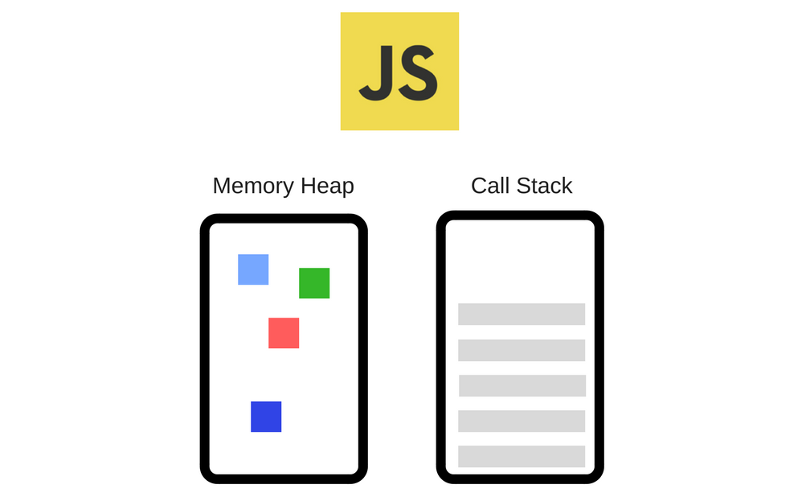
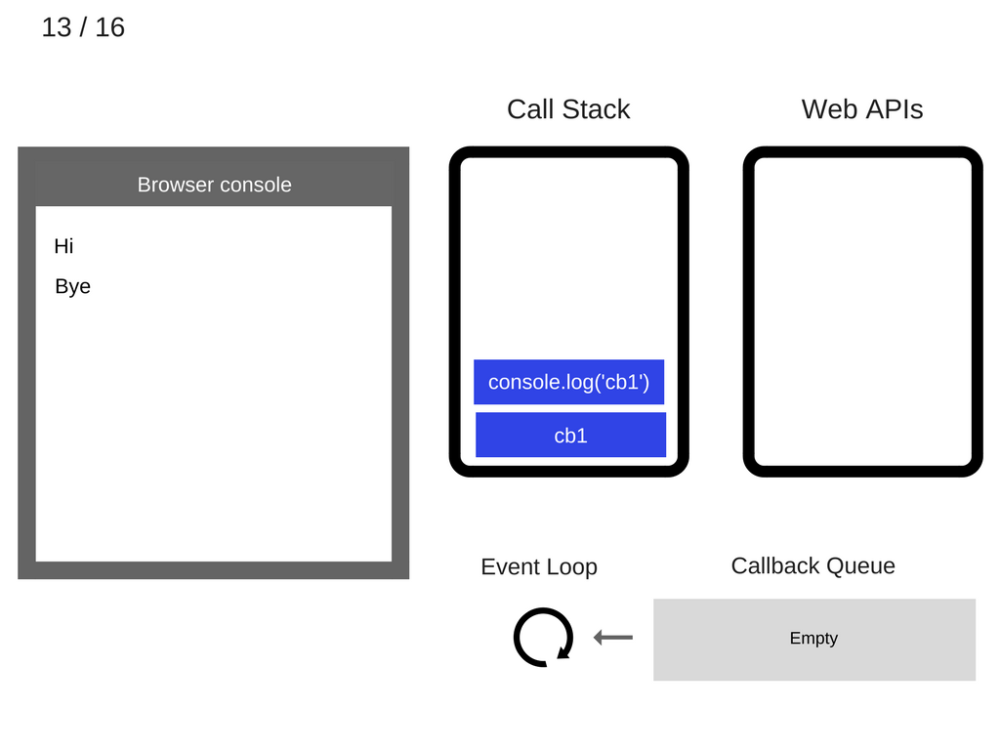
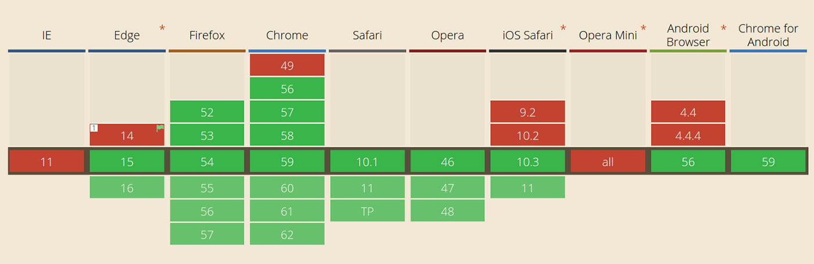

# JavaScript는 어떻게 동작하는가? - JS 엔진, 이벤트 루프, 콜백 큐

> [이 블로그 시리즈](https://blog.sessionstack.com/how-does-javascript-actually-work-part-1-b0bacc073cf)를 비롯한 기타 자료들을 읽으면서 학습한 내용을 정리했습니다.

<br>

## JavaScript 엔진

JavaScript 엔진은 하나의 프로그램입니다. JavaScript 코드를 실행하는 인터프리터 역할을 하는 프로그램이죠. 다양한 JavaScript 엔진들이 있는데요, 가장 유명한 엔진은 아마 구글의 V8 엔진일겁니다. V8 엔진은 크롬 브라우저 내에서 사용되고요, Node.js의 런타임이기도 합니다.

<br>



JavaScript 엔진은 크게 두 가지로 구성됩니다.

- 메모리 힙(Memory Heap) : 메모리 할당이 일어나는 곳
- 호출 스택(Call Stack) : 코드가 실행됨에 따라 스택 프레임이 생기는 곳

<br>

> V8 외의 다양한 JavaScript 엔진들이 궁금하다면 [여기](https://blog.sessionstack.com/how-javascript-works-inside-the-v8-engine-5-tips-on-how-to-write-optimized-code-ac089e62b12e)를 보세요.

> V8 엔진은 어떻게 동작하나요? [이 페이지](https://github.com/estellechoi/TIL/blob/master/javascript/v8.md)에서 이에 대한 아티클을 번역하고 있습니다.

<br>

## JavaScript 런타임(Runtime)

> 런타임이 무엇인가요? [이 StackOverFlow 페이지](https://stackoverflow.com/questions/3900549/what-is-runtime)에 많은 사람들이 도움을 받은 글이 있습니다.

<br>

JavaScript 런타임은 간단히 말해 JavaScript의 실행환경을 의미합니다. 아, 그럼 JavaScript 엔진이 곧 런타임이네요? 음, JavaScript의 런타임을 구성하는 것들은 엔진 외에도 몇 가지가 더 있습니다. `document`, `XMLHttpRequest`, `setTimeout`과 같은 브라우저의 Web API, 그리고 (그 유명한) 이벤트 루프(Event Loop)와 콜백 큐(Callback Queue)가 있습니다.


<br>

## 호출 스택(Call Stack)

JavaScript는 싱글쓰레드 언어입니다. 이는 JavaScript 엔진이 단 하나의 호출 스택(Call Stack)을 갖고있다는 의미이고요, 따라서 한 번에 한 가지 일만 처리할 수 있습니다. 호출 스택은 일종의 자료구조입니다. 기본적으로 어떤 프로그램 안에서 지금 어떤 코드가 실행되고 있는지를 기록하는 역할을 하죠. (<strong>The Call Stack is a data structure, which records basically where in the program we are.</strong>)

어떤 함수가 실행될 때, 그 함수는 JavaScript 엔진의 호출 스택 가장 위에 쌓입니다. 함수 내부의 코드들이 실행되고 `return`하면 호출 스택에서 사라지고요. 호출 스택이 하는 일은 이게 다입니다.

<br>

아래 예제를 볼게요.

```javascript
function multiply(x, y) {
	return x * y;
}

function printSquare(x) {
	var s = multiply(x, x);
	console.log(s);
}

printSquare(5);
```

<br>

엔진이 위의 코드를 막 실행하기 시작하는 시점에는 호출 스택이 비어있습니다. 그 다음 아래와 같은 순서대로 스택이 쌓였다가 비워집니다.


<br>

## 스택 프레임(Stack Frame)

호출 스택 내부에 쌓이는 것들을 스택 프레임(Stack Frame)이라고 부릅니다. 에러가 발생했을 때 어떤 프레임이 스택의 가장 위에 쌓여있는지를 통해 코드의 어느 부분에 문제가 있는지 추적할 수 있게 됩니다. 아래와 같이 코드를 작성하고 실행시켜보세요.

```javascript
function foo() {
	throw new Error("SessionStack will help you resolve crashes :)");
}

function bar() {
	foo();
}

function start() {
	bar();
}

start();
```

<br>

위 코드를 크롬 브라우저에서 실행시키면 콘솔에서 아래와 같은 메시지를 확인할 수 있습니다. `At foo`에서 에러가 발생했다고 알려주고 있네요. 이 말은 `foo()` 함수가 현재 스택의 가장 위에 쌓여있고, 이 함수를 실행하던 중 에러가 발생했다는 의미입니다.


<br>

### 스택 날려버리기(Blowing the stack)

호출 스택에 프레임들이 쌓이다가 스택이 수용할 수 있는 최대 사이즈에 도달하면 "스택 날려버리기"가 발생합니다. 흔히 재귀호출(Recursive call)이 포함된 코드를 작성하고 광범위하게 테스트하지 않았을 때 발생하죠.

> 재귀란, 자신을 정의할 때 자기 자신을 재참조하는 방법입니다. 함수 안에서 함수 자기자신을 호출하는 것을 재귀호출(recursive call)이라고 하고요.

<br>

스택을 날려보세요. 아래와 같이 브레이크가 없는 재귀호출 코드를 작성하면 됩니다.

```javascript
function foo() {
	foo(); // recursion
}

foo();
```

<br>

호출 스택에 `foo()` 함수가 연속해서 쌓이다가 스택 사이즈를 초과하게 될겁니다.


<br>

이때 브라우저는 스택을 날려버리기로 결정합니다. 그리고 아래와 같이 에러 메시지를 던져주겠죠. 이는 싱글쓰레드의 한계이기도 합니다.


<br>

## 비동기 콜백(Asynchronous callbacks)

### 동시실행 불가 문제(Lack of concurrency)

싱글쓰레드의 진짜 문제는 호출 스택에 실행할 함수들이 쌓여있는 동안, 브라우저는 아무 일도 진행할 수 없다는 것입니다. 이는 브라우저가 어떤 것도 렌더링할 수 없으며, 다른 어떤 코드도 실행할 수 없다는 뜻입니다. 그냥 막혀서 가만히 있는거죠.

하지만 알다시피, 대부분의 웹사이트가 막혀서 가만히 있기보다는 우리가 원하는 것들을 부드럽게 처리해서 잘 보여줍니다. 이는 비동기 콜백(Asynchronous callbacks) 덕분입니다. 비동기 콜백을 이용하면 무거운 코드를 실행해도 다른 일들이 막힘없이 동시에 처리되는 것처럼 보이게 할 수 있습니다.

<br>

### 비동기(Asynchronism) 이해하기

JavaScript 엔진의 호출 스택에 쌓이는 가장 흔한 스택 프레임은 함수입니다. 여러 함수 중 호출 스택의 가장 위에 있는 단 하나의 함수만이 실행되고요, 나머지는 해당 함수 "다음에" 순차적으로 실행됩니다. 대부분의 함수들은 매우 빠르게 어떤 결과를 반환하기 때문에 함수들이 하나씩 순차적으로 실행되어도 큰 문제가 없죠. 하지만 어떤 함수들은 복잡한 일을 수행하느라 실행을 완료하기까지 상당한 시간이 걸립니다. 이것이 비동기 실행(Asynchronous execution)이 생겨난 배경입니다.

비동기(Asynchronism) 개념을 이해할 때 중요한 것은 "다음에"라는 말이 반드시 "해당 함수의 일이 모두 완료된 다음"일 필요는 없다는 것입니다. 그러니까, (결과를 도출하기까지 시간이 소요되는) 무거운 함수가 호출되면, 해당 함수의 실행이 완료되기까지 기다리지 않고 다음 코드가 실행되도록 하는건데요. 이는 무거운 함수를 비동기적으로(asynchronously) 실행함으로써 가능합니다.

<br>

### 비동기적 실행(Asynchronous execution)

JavaScript에서는 어떤 코드라도 비동기적으로 실행시킬 수 있습니다. 가장 간단한 방법은 대표적인 비동기 웹 API인 `setTimeout(callback, milliseconds)`을 사용하는 것입니다.

```javascript
function first() {
	console.log("first");
}

function second() {
	console.log("second");
}

function third() {
	console.log("third");
}

first();
setTimeout(second, 1000); // asynchronous execution
third();
```

<br>

위 예제 코드의 콘솔 출력 결과는 아래와 같습니다. 1초 이상의 시간이 소요되는 `setTimeout(second, 1000)`의 실행이 완료되기를 기다리지 않고 `third()` 함수가 실행됩니다.

```
first
third
second
```

<br>

### 콜백은 왜 필요하죠?

아래 예제를 보죠.

```javascript
// ajax(..)를 어떤 라이브러리에서 제공하는 임의의 Ajax 함수라고 가정하겠습니다.
const response = ajax("https://example.com/api");

// 아래의 `response`는 어떤 값도 갖지 않은 상태로 출력될 겁니다.
console.log(response);
```

<br>

기본적으로 Ajax 요청은 동기적으로 실행되지 않습니다. 즉, 위 코드가 실행되는 시점에 `ajax(..)` 함수는 당장 어떤 값도 반환하지 않을 것이고, 따라서 어떤 값도 `response` 변수에 할당되지 않겠죠. 그럼 Ajax 요청에 대한 응답 값에 어떻게 접근할 수 있을까요?

<br>

비동기 함수가 값을 반환하기를 기다리는 가장 간단한 방법은 콜백 함수를 사용하는 것입니다. 위의 `ajax(..)` 함수가 두 번째 인자로 콜백 함수를 전달받는다고 가정해볼게요. 아래와 같이 Ajax 요청에 대한 응답 값을 출력하는 `console.log(response)` 코드를 콜백 함수 내부로 옮기면 됩니다. 콜백 함수는 비동기 함수가 일을 완료하기까지 기다렸다가, 비동기 함수의 실행이 완료되면 자신의 일을 시작하기 때문입니다.

```javascript
ajax("https://example.com/api", (response) => {
	console.log(response);
});
```

> 주의: 인위적으로 동기적인 Ajax 요청을 구현할 수 있더라도, 절대 그렇게 하지마세요. Ajax 요청이 응답을 기다리는 동안 애플리케이션의 모든 UI 렌더링이 막힐테니까요. 사용자는 클릭하거나, 입력하거나, 심지어 스크롤을 할 수도 없을 겁니다.

<br>

## 이벤트 루프(Event Loop)

### 이벤트 루프란?

(`setTimeout`과 같이) JavaScript 코드의 비동기 처리와 콜백 함수를 지원하는 웹 API가 있기는 하지만, ES6 이전까지 JavaScript는 비동기를 지원하는 내장 기능을 제공하지는 않았습니다. 그럼, JavaScript 자체적으로 동시에 여러 일을 처리하도록 해주는 것은 무엇이었을까요? 이벤트 루프(Event Loop)입니다.

이벤트 루프는 JavaScript 엔진이 동작하는 모든 환경에 내장된 메커니즘입니다. 이벤트 루프는 JavaScript 애플리케이션에서 동시에 여러 일이 실행되도록 핸들링하는 역할을 합니다. (The event loop handles the execution of multiple chunks of your program over time, each time invoking the JS Engine.)

<br>

> 현실 세계에서 JavaScript 엔진은 독립적으로 동작하지 않습니다. 보통 브라우저나 Node.js와 같은 특정한 호스팅 환경 내부에서 엔진이 돌아가죠. 사실 요즘은 로봇부터 백열전구까지 거의 모든 디바이스에 JavaScript 지원 기능이 내장되어 있습니다. 각각의 디바이스는 JavaScript 엔진이 동작하는 서로 다른 종류의 호스팅 환경을 의미합니다. JavaScript 엔진은 JavaScript 코드의 실행이 필요할 때만 잠깐 동작하는 실행 환경일 뿐입니다. 다시 말해, JavaScript 코드 실행을 하나의 이벤트로 간주한다면 이러한 이벤트들을 스케쥴링하는 주변 환경에 불과합니다.

<br>

브라우저에서 실행되는 JavaScript 애플리케이션이 있다고 가정해봅시다. 필요한 데이터를 불러오는 Ajax 요청이 있을거고요, 응답 데이터를 처리할 콜백 함수가 지정되어 있을 것입니다. 그럼 JavaScript 엔진은 브라우저에게 이렇게 말할겁니다. "브라우저야, 지금 이 콜백 함수를 실행하면 네가 다른 일을 못 하고 가만히 있어야 할테니, 내가 이 함수의 실행을 잠깐 보류할게. 그리고 Ajax 요청에 대한 네트워크 통신이 끝나면 네가 데이터를 갖게 될테니까 그때 이 함수를 다시 호출해(Call back)." 네트워크 통신이 끝나고 응답을 받으면, 브라우저는 이벤트 루프에 콜백 함수를 추가함으로써 해당 콜백의 실행을 스케쥴링하게 됩니다.

<br>

### 그래서 이벤트 루프가 뭔데요?


이벤트 루프는 단 하나의 간단한 역할을 합니다.

- 호출 스택과 콜백 큐를 모니터링하는 것. 호출 스택이 비면, 이벤트 루프는 콜백 큐에서 첫 번째 이벤트를 가져와서 호출 스택에 밀어넣습니다. 이벤트 루프는 이 작업만 반복합니다. 이 반복작업을 틱(Tick)이라고 부릅니다. 여기에서 말하는 "이벤트"는 함수 콜백을 의미합니다.

<br>

> [What the heck is the event loop anyway?](https://www.youtube.com/watch?v=8aGhZQkoFbQ) 영상을 보는 것이 도움이 됩니다.

<br>

### 이벤트 루프의 프로세스

아래의 예제 코드를 실행시키고 이벤트 루프가 실제로 어떤 프로세스에 따라 일하는지 확인해봅시다.

```javascript
console.log("Hi");

setTimeout(function cb1() {
	console.log("cb1");
}, 5000);

console.log("Bye");
```

<br>

#### 1. 브라우저 콘솔에 아무것도 없고, 호출 스택도 비어있습니다.


<br>

#### 2. `console.log('Hi')`가 호출 스택에 쌓입니다.


<br>

#### 3. `console.log('Hi')`가 실행됩니다.


<br>

#### 4. `console.log('Hi')`가 호출 스택에서 제거됩니다.


<br>

#### 5. `setTimeout(function cb1() { ... })`이 호출 스택에 쌓입니다.


<br>

#### 6. `setTimeout(function cb1() { ... })`이 실행됩니다.

브라우저는 `setTimeout` API의 일부인 타이머를 생성합니다. 이 타이머가 지정한 시간만큼 시간이 흐를 때까지 카운트합니다.


<br>

#### 7. `The setTimeout(function cb1() { ... })` 자체는 역할이 끝났으므로 호출 스택에서 제거됩니다.

이때 타이머는 계속 시간을 카운트합니다.


<br>

#### 8. `console.log('Bye')`가 호출 스택에 쌓입니다.


<br>

#### 9. `console.log('Bye')`가 실행됩니다.


<br>

#### 10. `console.log('Bye')`가 호출 스택에서 제거됩니다.


<br>

#### 11. `5000`ms의 시간이 지나면, 타이머는 자신의 일을 완료했으므로 콜백 함수 `cb1`을 콜백 큐에 밀어넣습니다.


<br>

#### 12. 이때 호출 스택이 비어있으므로 이벤트 루프는 `cb1`을 콜백 큐에서 호출 스택으로 옮깁니다.


<br>

#### 13. 호출 스택에 쌓인 `cb1`이 실행되고, 그 위에 `console.log('cb1')`가 쌓입니다.



<br>

#### 14. `console.log('cb1')`가 실행됩니다.


<br>

#### 15. `console.log('cb1')`가 호출 스택에서 제거됩니다.


<br>

#### 16. `cb1`이 호출 스택에서 제거됩니다.


<br>

### 예제 : `setTimeout(callback, 0)`

웹 API인 `setTimeout()`은 콜백 함수를 이벤트 루프의 콜백 큐에 추가하는 일에는 관여하지 않습니다. `setTimeout()`의 역할은 타이머를 생성하는 것으로 끝납니다. 타이머의 역할이 끝나면, 콜백 함수를 콜백 큐로 보내는 것은 실행 환경입니다. 콜백 큐에서 앞선 이벤트들에 대한 틱(Tick)이 순차적으로 발생하고요, 해당 함수가 큐의 첫 번째 콜백이 되면 그제서야 호출 스택으로 옮겨지고 실행이 시작됩니다.

<br>

아래 코드는 `myCallback` 함수가 정확히 `1000`ms 후에 실행될 것이라고 보장하지 않습니다. 한 가지 정확한 사실은 이 콜백 함수가 `1000`ms
후에 콜백 큐에 추가될 것이라는 것입니다. 아마 콜백 큐는 더 먼저 추가된 이벤트들이 쌓여있을테고요, `myCallback`은 자신의 차례를 기다려야 하겠죠.

```javascript
setTimeout(myCallback, 1000);
```

<br>

그렇다면, `setTimeout(callback, 0)`이라고 코드를 작성해도 해당 콜백 함수가 바로 실행되지 않을 수 있다는 것을 이해하셨나요? 이 코드로 추정해볼 수 있는건 콜백 함수가 당장(`0`초 후) 콜백 큐에 추가될 것이라는 것 뿐입니다. 이 함수가 실제로 실행되려면 큐에 쌓인 다른 이벤트들의 처리가 끝나고 호출 스택이 비워져야하죠. 자, 그럼 아래 코드의 출력 결과를 예상해볼 수 있나요?

```javascript
console.log("Hi");

setTimeout(function () {
	console.log("callback");
}, 0);

console.log("Bye");
```

<br>

시간을 `0`ms로 지정했더라도, 호출 스택에 먼저 추가되는건 `console.log("Bye")`이기 때문에 결과는 아래와 같습니다.

```
Hi
Bye
callback
```

<br>

## 잡 큐(Job Queue)

> ES6 공식 문서는 이벤트 루프가 어떻게 작동해야 하는지 명시하고 있습니다. 이는 이벤트 루프가 더이상 호스팅 환경의 역할이 아니며, JavaScript 엔진의 책임 범위에 포함됨을 의미합니다. 이는 ES6에서 소개된 `Promise`와 관련이 있습니다. `Promise`가 잘 동작하려면 이벤트 루프의 콜백 큐 동작을 더 섬세하고 직접적으로 통제할 수 있어야하기 때문입니다.

<br>

ES6에서 잡 큐(Job Queue)라는 새로운 개념이 소개되었습니다. 잡 큐는 대부분 `Promise`의 비동기 처리에 사용되는데요, 잡 큐는 이벤트 루프에서 틱(Tick)이 발생한 직후 다음 이벤트 앞에 추가되는 큐입니다. (the Job Queue is a queue that’s attached to the end of every tick in the Event Loop queue.)

이벤트 루프에서 하나의 틱이 진행되는 동안은 콜백 큐에 새로운 이벤트가 추가되지 않습니다. 대신, 현재 진행중인 틱의 직후에 실행하고자 하는 잡(Job)을 추가할 수 있습니다. 이 추가된 잡은 틱이 끝난 직후 그 어떤 이벤트보다도 먼저 실행될 수 있습니다. 또한, 하나의 잡이 여러 다른 잡들을 잡 큐에 추가할 수도 있습니다. 이론상으로는 무한히 새로운 잡들을 추가하는 잡 루프(Job Loop)도 가능하죠.

<br>

## 비동기 콜백의 한계

### 1. 콜백 지옥(Callback hell)

콜백 지옥(Callback hell)은 말그대로 콜백이 만들어낸 지옥입니다.. 아래의 예제 코드를 보면, 3 개의 비동기 함수들이 중첩되어 있습니다. 만약 5 개, 6 개의 비동기 함수가 중첩된다면 어떨까요? 이런 경우를 콜백 지옥이라고 하죠.

```javascript
listen("click", function (e) {
	setTimeout(function () {
		ajax("https://api.example.com/endpoint", function (text) {
			if (text == "hello") {
				doSomething();
			} else if (text == "world") {
				doSomethingElse();
			}
		});
	}, 500);
});
```

<br>

> 콜백 지옥에 대해 자세히 알아보려면, [callbackhell.com](http://callbackhell.com/)으로 시작하는 것이 도움이 됩니다.

<br>

### 2. Uncaught exceptions

콜백 함수에서 에러가 발생하면, 이 에러를 처리하기가 쉽지 않습니다. 아래 코드를 보죠.

```javascript
try {
	setTimeout(function () {
		throw new Error("Error!");
	}, 1000);
} catch (e) {
	console.log(e);
}
```

<br>

위 코드에서 콜백 함수를 호출하는 것은 `setTimeout()`이 아닙니다. 앞에서도 설명했듯이, `setTimeout()`은 브라우저에 `1000`ms를 카운트하는 타이머를 생성하는 것으로 본분을 다하고 호출 스택에서 사라지거든요. 콜백함수를 호출하는 것은 이벤트 루프입니다. 호출 스택이 비워지면 이벤트 루프가 콜백 큐에 있던 콜백 함수를 호출하여 호출 스택으로 밀어넣기 때문입니다.

위의 `catch { .. }`를 이용해서 잡을 수 있는 에러는 `setTimeout()`에서 발생한 에러 뿐입니다. 이후 콜백 큐에 대기하고 있다가 호출되는 콜백 함수에서 발생하는 에러는 잡을 수가 없습니다. 그럼 콜백 함수에서 발생하는 에러들은 어디서 어떻게 잡아야 할까요?

<br>

## `Promise` 객체

`Promise`는 비동기 실행의 결과(성공 또는 실패)를 나타내는 객체입니다. `Promise`는 비동기 함수의 실행 후 얻게될 약속된 결과, 그러니까 실행이 완료되기 전까지는 알 수 없는 미래의 결과 값에 대한 프록시(Proxy)입니다. `Promise` 객체를 이용하면 비동기 메소드가 마치 동기적으로 값을 반환하는 것처럼 코드를 작성할 수 있습니다. 비동기 함수가 실제 값을 반환하는 대신, 약속된 값(promise)을 즉시 반환하는 것처럼 보이기 때문입니다.

<br>

`Promise` 객체는 "상태"를 가지는데요, 다음 세 가지 상태 중 하나를 갖게 됩니다.

- `pending` : 초기 상태, 이행되지도(fulfilled) 실패하지도(rejected) 않은 상태입니다.
- `fulfilled` : 성공적으로 이행이 완료된 상태
- `rejected` : 이행이 실패한 상태

<br>

### `Promise` 객체 사용하기

아래는 `setTimeout()`을 사용하여 비동기 코드를 작성한 것입니다. 현실에서는, 아마 `XMLHttpRequest`와 같이 Ajax 요청을 위한 API를 사용하겠죠.

<br>

```javascript
const promise = new Promise((resolve, reject) => {
	setTimeout(function () {
		resolve("Success!");
	}, 1000);
});

promise.then((response) => {
	console.log(response);
});
```

- `Promise` 객체를 생성할 때 인자로 콜백 함수를 전달합니다. 해당 콜백 함수 내에는 실행하고자하는 비동기 코드를 넣고요.

- 이때 생성된 `Promise` 객체의 인스턴스인 `promise`에는 비동기 코드 실행에 대한 결과 값이 할당됩니다. 즉, 비동기 코드의 실행이 성공적으로 완료되었으면 그에 맞는 어떤 값이 할당되고요, 실패했다면 다른 값이 할당됩니다.

- 비동기 코드의 실행에 성공했을 때, 혹은 실패했을 때 `promise`에 할당할 값은 `Promise` 객체를 생성할 때 인자로 전달하는 콜백 함수에서 지정합니다. 이 콜백 함수는 인자로 2 개의 함수 `(resolve, reject)`를 받는데요, 비동기 코드의 실행이 성공적으로 완료되면 `resolve()`, 실패했으면 `reject()`가 호출되죠.

- `pending` 상태의 `promise`는 비동기 실행이 성공하든 실패하든 `then()` 메소드를 갖고 있습니다. 이 `then()` 메소드는 `resolve()` 메소드를 호출할 때 전달한 인자를 자신의 첫 번째 인자로 받습니다.

- `Promise.prototype.then()`과 `Promise.prototype.catch()` 메소드는 또 다른 `Promise` 객체를 반환하고요, 따라서 아래와 같이 체이닝이 가능합니다.


<br>

## ES8의 `async`/`await`

ES8에서 소개된 `async`/`await`는 `Promise`를 보다 쉽게 사용하기 위해 고안되었습니다. 사용법을 살펴보죠.

> The purpose of `async`/`await` is to simplify the behavior of using promises.

<br>

### `async` 함수 선언식

비동기 코드를 포함하고 있는 함수를 정의할 때 `async`를 사용하여 선언합니다. `async`를 사용하여 선언한 함수들은 [`AsyncFunction`](https://developer.mozilla.org/en-US/docs/Web/JavaScript/Reference/Global_Objects/AsyncFunction) 객체를 반환하고요. 중요한 것은, `async` 함수가 호출되면 `Promise` 객체를 반환한다는 것입니다. `Promise` 객체가 자동으로 생성되고 `async` 함수 내에서 반환하는 지정된 값을 인자로 하여 `resolve()` 메소드를 호출하죠. 만약 `async` 함수에서 에러가 발생한다면 `Promise`의 `reject()` 함수가 에러 객체르 인자로 하여 호출됩니다.

<br>

아래 예제를 보죠.

```javascript
function getNumber1() {
	return Promise.resolve("374");
}
```

<br>

아래 코드는 `getNumber1()` 함수와 똑같이 동작할겁니다.

```javascript
async function getNumber2() {
	return 374;
}
```

<br>

에러의 경우에도 똑같습니다. `async` 선언 함수는 `reject()`가 호출된 `Promise` 객체를 반환합니다.

```javascript
function f1() {
	return Promise.reject("Some error");
}
```

<br>

With `async`,

```javascript
async function f2() {
	throw "Some error";
}
```

<br>

### `await`

`await` 표현식은 `async`로 선언한 함수 내에서만 동작합니다. `await` 표현식이 붙은 함수는 실행을 멈추고 `Promise` resolution을 기다립니다. 그리고는 `async` 함수의 실행을 재개하고, 마지막에는 `Promise` 객체를 반환합니다. `async`/`await`를 사용하면 비동기 함수에 대한 콜백 함수를 쓰지않고, 마치 동기적인 함수인 것처럼 작성할 수 있습니다. `Promise` 객체를 `async`로 선언한 함수 외부에서 사용하려면 여전히 `then()` 메소드를 사용해야 합니다.

<br>

### `async` 함수 표현식

`async` 함수 표현식은 즉시실행함수(IIFE, Immediately Invoked Function Expression)로서 사용될 수 있습니다. 아래 예제를 보죠.

```javascript
const loadData = async function () {
	// `rp` is a request-promise function.
	const promise1 = rp("https://api.example.com/endpoint1");
	const promise2 = rp("https://api.example.com/endpoint2");

	// we'll have to wait for them to finish
	const response1 = await promise1;
	const response2 = await promise2;
	return `${response1} ${response2}`;
};
```

<br>

## `async`/`await` 브라우저 호환성



`async`/`await`는 대부분의 현대 브라우저에서 지원됩니다. 만약 구형 브라우저의 사용자들을 지원해야 한다면 like [Babel](https://babeljs.io/docs/en/babel-plugin-transform-async-to-generator/)과 같은 JS transpilers와 [TypeScript](https://www.typescriptlang.org/docs/handbook/release-notes/typescript-2-3.html)를 사용하세요.

<br>

> [Can I use](https://caniuse.com/#search=promise)에서 검색해보세요.

<br>

## `async`/`await` 장점

### 1. 클린 코드

`async`/`await`를 사용하면 `then()` 메소드를 호출하고, 응답을 핸들링할 익명 함수를 생성하고, 응답 값을 할당할 변수의 이름을 짓는.. 귀찮은 작업들을 스킵할 수 있습니다. `async`/`await`를 사용하지 않은 경우와 사용한 경우를 비교해보세요.

```javascript
// `rp` is a request-promise function.
rp(`https://api.example.com/endpoint1`).then(function (data) {
	//..
});
```

<br>

```javascript
const response = await rp(`https://api.example.com/endpoint1`);
```

<br>

### 2. 간단한 에러 핸들링

`async`/`await`를 사용하면 잘 알려진 `try`/`catch` 구문을 사용하여 비동기 함수와 동기 함수의 에러를 모두 핸들링할 수 있습니다.

<br>

아래는 `async`/`await`를 사용하지 않았을 때이고요,

```javascript
function loadData() {
	try {
		getJSON()
			.then((response) => {
				const parsed = JSON.parse(response);
				console.log(parsed);
			})
			.catch((e) => {
				// Catches asynchronous errors
				console.log(e);
			});
	} catch (e) {
		// Catches synchronous errors.
		console.log(e);
	}
}
```

<br>

이번에는 `async`/`await`를 사용했을 때의 에러 핸들링입니다.

```javascript
async function loadData() {
	try {
		const data = JSON.parse(await getJSON());
		console.log(data);
	} catch (e) {
		console.log(e);
	}
}
```

<br>

## JavaScript 동작 프로세스


<br>

---

### References

- [How JavaScript works: an overview of the engine, the runtime, and the call stack](https://blog.sessionstack.com/how-does-javascript-actually-work-part-1-b0bacc073cf)
- [How JavaScript works: Event loop and the rise of Async programming + 5 ways to better coding with async/await](https://blog.sessionstack.com/how-javascript-works-event-loop-and-the-rise-of-async-programming-5-ways-to-better-coding-with-2f077c4438b5)
- [callbackhell.com](http://callbackhell.com/)
- [자바스크립트 Promise 쉽게 이해하기](https://joshua1988.github.io/web-development/javascript/promise-for-beginners/)
- [poiemaweb.com](https://poiemaweb.com/es6-promise)
- [JavaScript Promises: An introduction | Google developers](https://web.dev/promises/)
- [Using Promises | MDN](https://developer.mozilla.org/en-US/docs/Web/JavaScript/Guide/Using_promises)
