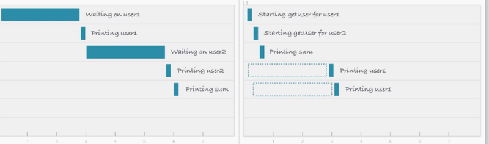
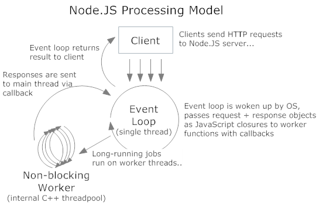
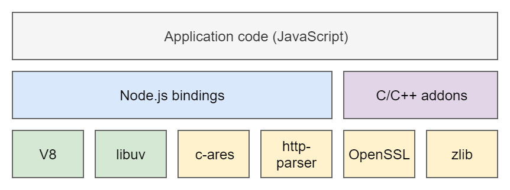

# Node.js

> This markdown page is Korean/English mixed entirely depending on my personal need, not readers' possible expectation.

 

## What is Node.js ?

> Here’s a formal definition as given on the [official Node.js website](https://nodejs.org/en/).

Node.js is a JavaScript runtime built on [Chrome's V8 JavaScript engine](https://v8.dev/).

한국말로 하면, Node.js는 크롬 브라우저의 V8 엔진에서 동작하는 Javascript 런타임이다.

Node.js came into existence when the developers of original JavaScript extended it from something working only in the browser to the thing running on your machine as a standalone application.

Both your browser JavaScript and Node.js run on the V8 JavaScript runtime engine. This engine takes your JavaScript code and converts it into a faster machine code.

 

## Event-driven, non-blocking I/O model

Node.js uses an event-driven, non-blocking I/O model that makes it lightweight and efficient. I/O stands for input/output.

 

### What is Non-blocking I/O ?

I/O takes time hence blocking other functions. In the blocking method, a request is not initiated until prior request to fetch data is responded and finish its work like printing results on the screen.

 

If this was a web server, we would have to start a new thread for every new request. But JavaScript is single-threaded (not really, but it has a single-threaded event loop). So this would make JavaScript not very well suited for multi-threaded tasks.

Javascript solved this problem using a non-blocking request. You can initiate both requests in parallel. This non-blocking I/O operation eliminates the need for multi-threading.

 

> There is a full article on [Blocking vs. Non-Blocking](https://nodejs.org/en/docs/guides/blocking-vs-non-blocking/).

 

### Event loop

Here's a [video](https://www.youtube.com/watch?v=8aGhZQkoFbQ) titled "What the heck is the event loop anyway?" by Philip Roberts.

 

## How Node.js works

 

## Main Building Blocks

Any Node.js application is built on top of the following components:

### V8

A Google’s open source high-performance JavaScript engine written in C++. Also used in Google Chrome browser and others.
Node.js controls V8 via V8 C++ API.

 

### libuv

A multi-platform support library with a focus on asynchronous I/O, written in C.
Node.js uses libuv to abstract <strong>non-blocking I/O operations</strong> to a unified interface across all supported platforms.
This library provides mechanisms to handle file system, DNS, network, child processes, pipes, signal handling, polling and streaming.
It also includes a thread pool, known as Worker Pool, for offloading work for some things that cannot be done asynchronously at the OS level.

 

### Other open-source, low-level components

Like http-parser, OpenSSL, etc.

 

### C/C++ bindings

Wrappers around C/C++ libraries, built with N-API, a C API for building native Node.js addons, or other APIs for bindings.

 

### Some bundled tools that are used in Node.js infrastructure

- npm : a well-known package manager (and ecosystem).
- gyp : a python-based project generator copied from V8. Used by node-gyp, a cross-platform command-line tool written in Node.js for compiling native addon modules.
- gtest — Google’s C++ test framework. Used for testing native code.

 

## Node.js Runtime

This is how Node.js runtime executes your JS code:

 

### 1.

Once your Node.js application starts, it first completes an initialization phase, i.e. runs the start script, including requiring modules and registering callbacks for events.

 

### 2. Event Loop

Then the application enters the Event Loop (aka the main thread, event thread, etc.), which conceptually is built for responding to incoming client requests by executing the appropriate JS callback.

JS callbacks are executed synchronously, and may use Node APIs to register asynchronous requests to continue processing after the callback completes.

The callbacks for asynchronous requests will also be executed on the Event Loop. Examples of such Node APIs include various timers (`setTimeout()`, `setInterval()`, etc.), functions from `fs` and `http` modules and many more.

 

> See the [official Node.js docs](https://nodejs.org/en/docs/guides/event-loop-timers-and-nexttick/) for more information.

 

### 3.

---

### References

- [An Intro to Node.js That You May Have Missed](https://itnext.io/an-intro-to-node-js-that-you-may-have-missed-b175ef4277f7)
- [What exactly is Node.js?](https://www.freecodecamp.org/news/what-exactly-is-node-js-ae36e97449f5/)
- [node.js#02-JS의 runtime](https://bmh8993.github.io/node.js/node02-js-runtime/)
