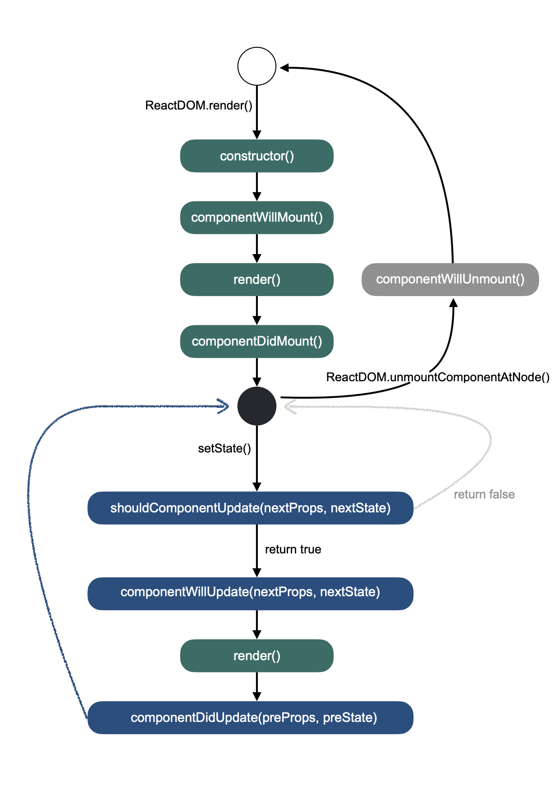
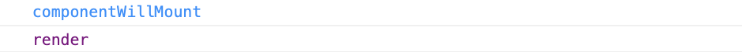

# [React] Class vs Function 컴포넌트

## 목차

```
1. Class와 Function 컴포넌트의 렌더링
2. Class와 Function 컴포넌트에 데이터(props) 전달하기
3. Class 컴포넌트에서 state 사용하기
4. Function 컴포넌트와 useState Hook
5. Class 컴포넌트의 라이프사이클
```

<br>

## 1. Class와 Function 컴포넌트의 렌더링

### Class

Class 컴포넌트를 렌더링하려면 `render()` 함수를 오버라이드(Override)해야 합니다.`render()` 함수 내에서 렌더링할 JSX를 반환해주면 되죠.

```javascript
class Comp extends React.Component {
    render() {
        return ();
    }
}
```

<br>

### Function

Function 컴포넌트의 렌더링은 비교적 간단합니다. 함수 자신이 반환하는 것이 렌더링 됩니다.

```javascript
function Comp() {
    return ();
}
```

<br>

## 2. Class와 Function 컴포넌트에 데이터(`props`) 전달하기

### Class

Class 컴포넌트에서는 `props` 속성을 통해 접근할 수 있습니다. 예를 들어 Class 컴포넌트에 아래와 같이 `props`를 부여한다고 가정해봅시다.

```jsx
<Comp name="Yujin" number={7}></Comp>
```

<br>

위와 같이 전달한 `props` 들은 `this.props` 객체에 담겨있습니다.

```javascript
class Comp extends React.Component {
	render() {
		return (
			<div>
				{this.props.name} likes number {this.props.number}.
			</div>
		);
	}
}
```

<br>

### Function

Function 컴포넌트에서는 인자로 `props` 객체를 받습니다. `this`로 함수 자신에 접근할 필요없이, 전달받은 인자를 참조하면 됩니다.

```javascript
function Comp(props) {
	return (
		<div>
			{props.name} likes number {props.number}.
		</div>
	);
}
```

<br>

ES6에서 소개된 [구조 분해 할당](https://developer.mozilla.org/en-US/docs/Web/JavaScript/Reference/Operators/Destructuring_assignment) 문법을 사용하면 아래와 같이 리팩토링할 수 있습니다.

```javascript
function Comp({ name, number }) {
	return (
		<div>
			{name} likes number {number}.
		</div>
	);
}
```

<br>

## 3. Class 컴포넌트에서 `state` 사용하기

### `state` 초기화

컴포넌트 내부에서 사용할 (상태)값은 `React.Component`로부터 상속받은 `state` 속성에 담아서 사용합니다. `state` 값이 바뀔 때마다 `render()` 함수가 호출되고요, 따라서 업데이트된 `state` 값이 포함된 JSX가 다시 렌더링 됩니다.

```javascript
class Comp extends React.Component {
	state = {
		name: this.props.name,
		number: this.props.number,
	};

	render() {
		return (
			<div>
				{this.state.name} likes number {this.state.number}.
			</div>
		);
	}
}
```

<br>

> `state` 값을 지정하지 않으면 초기값은 `null`입니다. `this.state`로 접근해서 확인해보세요.

<br>

### `state` 값 업데이트하기

`state` 값을 변경하려면 `setState()` 함수를 호출합니다. 변경할 `state`의 속성과 새 값으로 구성된 객체를 인자로 전달하고요.

버튼을 클릭하여 숫자를 바꾸는 예제를 통해 알아볼게요. `<button>` 요소의 `onClick` 속성에 이벤트 발생시 호출할 함수를 지정해줍니다. 아래 예제에서는 함수 선언식을 사용해 정의된 `changeNumber` 함수를 지정했습니다.

> `changeNumber`는 화살표 함수가 아니므로 이 함수 내에서 `this`는 함수 자기자신을 의미합니다. `React.Component`의 `setState()` 메소드를 호출하기 위해서는 `bind()` 함수를 이용하여 외부 `this`를 바인딩하세요.

```javascript
class Comp extends React.Component {
	state = {
		name: this.props.name,
		number: this.props.number,
	};

	function changeNumber () {
		this.setState({ number: Math.random() });
	}.bind(this);

	render() {
		return (
			<div>
				{this.state.name} likes number {this.state.number}.
			</div>
			<button type="button" onClick={changeNumber}>Click me</button>
		);
	}
}
```

<br>

하지만 Function 컴포넌트에서는 `React.Component` 클래스를 상속받을 수 없기 때문에 위와 같이 `state` 속성도 사용할 수 없습니다. 때문에 상위 컴포넌트에서 전달한 `props` 값들을 보여주는 간단한 컴포넌트를 만들 때 사용되었죠. Hook이 도입되기 전까지는요.

<br>

## 4. Function 컴포넌트와 `useState` Hook

React 16.8부터는 Hook 개념이 도입되었습니다. React의 내장 Hook도 있고, 커스텀 Hook을 만들어 사용할 수도 있죠. 내장 Hook 중 `useState`는 Function 컴포넌트에서 (Class 컴포넌트에서만 사용할 수 있었던) `state`의 사용을 지원합니다.

<br>

### `useState` 사용하기

먼저 아래와 같이 `import`를 하고요.

```javascript
import react, { useState } from "react";
```

<br>

`useState()`를 호출하면 무조건 길이가 `2`인 배열이 반환됩니다. 이 배열의 첫 번째 원소는 컴포넌트에서 사용할 데이터(상태)이고요, 두 번째 원소는 데이터(상태)를 업데이트하는 함수입니다. `useState()` 호출시 인자를 전달하면 `state`의 초기값을 지정할 수 있고요, 인자를 넘기지 않으면 `state` 값은 `undefined`입니다.

```javascript
function Comp({ name, number }) {
	// props로 받은 값으로 state 초기값을 지정
	const [num, setNum] = useState(number);

	return (
		<div>
			{name} likes number {num}.
		</div>
	);
}
```

<br>

### `state` 값 업데이트하기

`class` 컴포넌트와 마찬가지로 `setState()` 함수를 호출하면 됩니다. 하지만 컴포넌트에 종속되어있지 않기 때문에 `this`로 접근할 필요가 없습니다. 또한, 여러 개의 `state`가 있더라도 각각 자신을 업데이트하는 `setState()` 함수를 갖기 때문에 인자로 변경하고자하는 새 값만 전달하면 되죠.

```javascript
function Comp({ name, number }) {
	// props로 받은 값으로 state 초기값을 지정
	const [num, setNum] = useState(number);

	function changeNumber() {
		// setState(arg);
		setNum(Math.random());
	}

	return (
		<div>
			{name} likes number {num}.
		</div>
		<button type="button" onClick={changeNumber}>Click me</button>
	);
}
```

<br>

## 5. Class 컴포넌트에서 라이프사이클 다루기

아래는 React 컴포넌트의 라이프사이클을 나타내는 그림입니다. Class 컴포넌트가 최초 렌더링될 때 각 라이프사이클 함수들이 호출되는 순서를 나타냅니다.



<br>

### Mount

`componentWillMount()` 호출 이전의 `constructor()`에서는 `state` 값을 초기화하고요, `props`는 `super()`의 인자로 넘깁니다. 이 작업들은 원래 `getDefaultProp()`-`getInitialState()` 함수가 차례로 호출되면서 처리했었는데 현재는 Deprecated 되었습니다. 대신 `constructor()`에서 처리하죠. 그 다음 `componentWillMount()`-`render()`-`componentDidMount()` 순으로 라이프사이클이 진행됩니다.

<br>

위의 마운트(Mount) 관련 라이프사이클 함수들은 아래의 `ReactDOM.render()`가 호출된 이후 차례로 호출됩니다.

```javascript
const root = document.getElementById("root");
ReactDOM.render(<App />, root);
```

<br>

만약 렌더링 직전, 컴포넌트 마운팅이 시작될 때 무언가 처리하고 싶다면 `componentWillMount()` 함수를 오버라이드하면 되겠죠. 아래 예제를 보세요.

```javascript
class Comp extends React.Component {
	componentWillMount() {
		console.log(`%ccomponentWillMount`, "color: dodgerblue");
	}

	render() {
		console.log(`%crender`, "color: purple");
		return <div></div>;
	}
}
```

<br>

콘솔 출력 결과는 다음과 같습니다. 호출된 순서를 확인해보세요.

<br>



<br>

### Update

`setState()`가 호출되면 업데이트(Update) 사이클 함수들이 차례로 호출됩니다. 이때 호출되는 `render()`는 마운트(Mount) 시점에 호출되었던 `render()` 함수입니다.

<br>

---

### References

- [React Top-Level API | React](https://reactjs.org/docs/react-api.html)
- [Components and Props | React](https://reactjs.org/docs/components-and-props.html)
- [Using the State Hook | React](https://reactjs.org/docs/hooks-state.html)
- [React.Component | React](https://reactjs.org/docs/react-component.html#constructor)
- [React component lifecycle, API 정리](https://gseok.gitbooks.io/react/content/bd80-bd84-bd80-bd84-c9c0-c2dd-b4e4/react-component-lifecycle-api-c815-b9ac.html)
