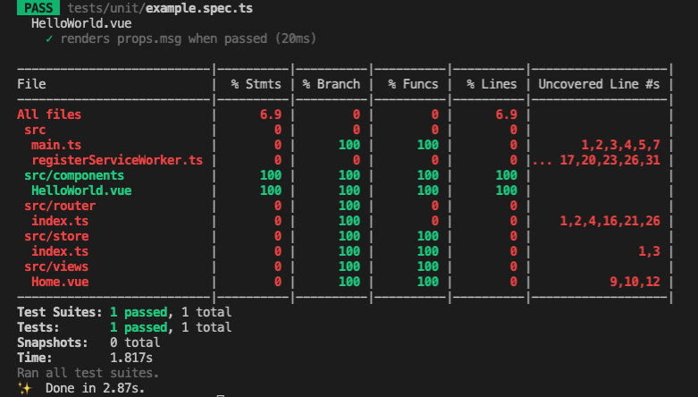

# Vue + TypeScript + Jest 단위테스트 자동화하기

> This doc is not done, under research and using-by-myself currently.

<br>

1. Jest 설치하기 (VTU를 사용하기)
2. Jest 설정하기: `jest.config.js`
3. 변환이 필요한 써드파티 모듈 알려주기
4. 테스트 커버리지 관리하기: Jest 설정에 명시, 커버리지 리포트

<br>

## 1. Jest 설치하기 (VTU를 사용하기)

### 1-1. Jest

[Jest](https://jestjs.io/)는 JavaScript 테스트 라이브러리입니다.

<br>

### 1-2. Jest 설치하기

#### 새 프로젝트 만들기

Vue에서 공식 지원하는 [VTU(Vue 테스트 유틸)](https://vue-test-utils.vuejs.org/guides/#getting-started)을 통해 Jest를 사용할 수 있습니다. VTU는 Vue 컴포넌트에 대한 단위 테스트를 간편하게 해주는 유틸 함수들을 제공하는 라이브러리입니다. [`@vue/cli`](https://cli.vuejs.org/) 3.x 이후 버전을 사용하여 Vue 앱을 새로 생성하는 경우라면, 앱 생성시 단위 테스트 툴을 선택함으로써 VTU를 쉽게 셋업할 수 있습니다. `@vue/cli`를 사용하여 앱을 생성할 때 `Unit Testing` 도구로 `Jest`를 선택하면 되고요, [VTU 공식 문서](https://vue-test-utils.vuejs.org/installation/#using-vue-test-utils-with-jest-recommended)에서도 Jest 사용을 권장합니다.

<br>


<br>

그럼 `package.json` 파일에 아래와 같이 필요한 스크립트와 디펜던시들이 Preset 됩니다. ([TypeScript](https://www.typescriptlang.org/), [Babel](https://babeljs.io/), Jest 관련 항목이 아닌 것은 생략)

```json
{
	"scripts": {
		"test:unit": "vue-cli-service test:unit"
	},
	"devDependencies": {
		"@types/jest": "^24.0.19",
		"@vue/cli-plugin-babel": "~4.5.0",
		"@vue/cli-plugin-typescript": "~4.5.0",
		"@vue/cli-plugin-unit-jest": "~4.5.0",
		"@vue/test-utils": "^2.0.0-0",
		"typescript": "~4.1.5",
		"vue-jest": "^5.0.0-0"
	}
}
```

<br>

- [`@types/jest`](https://www.npmjs.com/package/@types/jest): `.ts` 파일에서 테스트 작성시 Jest를 사용하기 위해 필요한 Type 정보를 제공

- [`@vue/cli-plugin-babel`](https://cli.vuejs.org/core-plugins/babel.html): Babel7 + [`babel-loader`](https://webpack.js.org/loaders/babel-loader/) + [`@vue/babel-preset-app`](https://github.com/vuejs/vue-cli/tree/dev/packages/%40vue/babel-preset-app)

- [`@vue/cli-plugin-typescript`](https://cli.vuejs.org/core-plugins/typescript.html): TypeScript + [`ts-loader`](https://github.com/TypeStrong/ts-loader) + [`fork-ts-checker-webpack-plugin`](https://github.com/TypeStrong/fork-ts-checker-webpack-plugin)

- [`@vue/cli-plugin-unit-jest`](): 4.x 이상 버전에서 TypeScript + Babel 사용을 위한 Preset 제공 ([`/presets/typescript-and-babel`](https://github.com/vuejs/vue-cli/tree/dev/packages/%40vue/cli-plugin-unit-jest/presets/typescript-and-babel)).
	- 이전 버전을 사용한다면 Babel의 TypeScript 플러그인 [`@babel/preset-typescript`](https://babeljs.io/docs/en/babel-preset-typescript) 추가 설치 필요. ([Jest에서 Babel을 통해 TypeScript를 지원](https://jestjs.io/docs/getting-started#using-typescript)하기 때문)

- [`@vue/test-utils`](https://github.com/vuejs/vue-test-utils): Vue 컴포넌트에 대한 단위 테스트를 간편하게 해주는 유틸 함수들을 제공

- [`vue-jest`](https://github.com/vuejs/vue-jest): `.vue` 파일([SFC](https://vuejs.org/v2/guide/single-file-components.html))내 `<template>`,  `<script>`, `<style>` 구문들을 Jest가 동작할 수 있는 JavaScript 파일로 변환

<br>

#### 기존 프로젝트에 추가하기

기존 Vue 프로젝트에 VTU를 추가하는 경우라면, 아래와 같이 `@vue/cli` 명령어를 사용할 수 있습니다. [이 명령어](https://cli.vuejs.org/core-plugins/unit-jest.html#installing-in-an-already-created-project)는 `vue-cli-service test:unit` 커맨드를 추가하고, `@vue/cli-plugin-unit-jest`를 설치합니다.

```zsh
vue add unit-jest
```

<br>

그리고 패키지매니저를 사용하여 `@vue/test-utils`, `vue-jest`를 설치합니다.

```zsh
yarn add @vue/test-utils --dev
```

<br>

## 2. Jest 설정하기: `jest.config.js`

### 2-1. `jest.config.js`

Jest 설정파일은 `jest.config.js`입니다. `jest.config.js` 대신 `package.json` 파일의 `jest` 필드를 사용할 수도 있습니다. 다음은 `@vue/cli`로 Babel, TypeScript를 포함하여 앱 생성시 기본으로 세팅되는 `jest.config.js` 파일 내용입니다.

```javascript
// jest.config.js

module.exports = {
  preset: '@vue/cli-plugin-unit-jest/presets/typescript-and-babel',
  transform: {
    '^.+\\.vue$': 'vue-jest', // vue-jest를 사용하여 모든 *.vue 파일을 *.js 파일로 컴파일
  },
};
```

<br>

#### Preset

`preset` 옵션을 사용하여 외부 설정파일 내용을 불러올 수 있습니다. [Shallow Merge](https://stackoverflow.com/questions/42731453/deep-and-shallow-merge-in-javascript)처럼 이후에 지정하는 옵션들이 덮어쓰기 때문에 주의해야합니다. 위에서 Preset으로 사용된 [`@vue/cli-plugin-unit-jest/presets/typescript-and-babel`](https://github.com/vuejs/vue-cli/blob/dev/packages/%40vue/cli-plugin-unit-jest/presets/typescript-and-babel/jest-preset.js)은 다음 3 개 Preset 합으로 되어있습니다.

- [`presets/default/jest-preset`](https://github.com/vuejs/vue-cli/blob/dev/packages/%40vue/cli-plugin-unit-jest/presets/default/jest-preset.js): Vue 앱을 위한 기본 Preset
- [`presets/typescript/jest-preset`](https://github.com/vuejs/vue-cli/blob/dev/packages/%40vue/cli-plugin-unit-jest/presets/typescript/jest-preset.js): `.ts`/`.tsx` 파일을 테스트하기 전에 `ts-jest`를 사용하여 JavaScript 파일로 변환하도록 설정
- [`presets/typescript-and-babel/jest-preset`](https://github.com/vuejs/vue-cli/blob/dev/packages/%40vue/cli-plugin-unit-jest/presets/typescript-and-babel/jest-preset.js): `ts-jest`에 `babelConfig: true` 설정

<br>

## 3. 변환이 필요한 써드파티 모듈 알려주기

기본적으로 Jest는 `node_modules`에 설치된 디펜던시 모듈에 대해 테스트를 위한 변환 작업을 하지 않습니다. Jest 설정 옵션 중 `transformIgnorePatterns`의 디폴트 값에 `/node_modules/` 경로가 포함되어있기 때문입니다.

```javascript
transformIgnorePatterns: ['/node_modules/']
```

<br>

이는 대부분의 써드파티 모듈이 JavaScript 파일로만 구성되어있기 때문입니다. 게다가 Jest는 브라우저가 아닌 Node.js 환경에서 Run 되는데, `node` 8.x 이상부터 거의 대부분의 모던 ECMAScript 기능들을 지원하고있기 때문에 Babel 또한 필요없기 때문이죠. 다만 아래의 예외 사항에 해당하는 라이브러리가 있다면 테스트를 실행하기 전 Jest가 해당 라이브러리 모듈을 적절하게 변환할 수 있도록 알려주어야합니다!

- ES6 `import`/`export` 모듈 구문을 사용하는 경우, Node.js에서 실행할 수 있도록 `module.exports`로 변환되어야 함
- `.vue` 파일을 사용하는 경우, `vue-jest`를 사용하여 변환되어야 함
- TypeScript를 사용하는 경우 `ts-jest`를 사용하여 변환되어야 함

<br>

만약 테스트 전 변환이 필요한 라이브러리가 있다면, 다음과 같이 `transformIgnorePatterns` 옵션을 수정합니다. 자세한 설명은 [`@vue/cli-plugin-unit-jest` 공식문서](https://cli.vuejs.org/core-plugins/unit-jest.html#transform-dependencies-from-node-modules)에서 확인할 수 있습니다.

```javascript
// jest.config.js

module.exports = {
	// ..
	transformIgnorePatterns: ['/node_modules/(?!name-of-lib-to-transform)']
}
```

<br>

## 4. 테스트 커버리지 관리하기: Jest 설정에 명시, 커버리지 리포트

### 4-1. Jest 설정에 명시

Jest는 테스트 커버리지를 나타내는 지표 보고서도 생성할 수 있습니다. 아래와 같이 `jest.config.js` 파일에 [해당 옵션들](https://jestjs.io/docs/configuration#collectcoverage-boolean)을 지정해주면 됩니다. 아래와 같이 `collectCoverageFrom` 값을 지정해주면, 모든 `*.ts`, `*.vue` 파일에 대해 테스트 커버리지를 수집하되, `node_modules`, `coverage`, `tests` 디렉토리에 존재하는 파일들은 제외한다는 의미입니다.

```javascript
// jest.config.js

module.exports = {
	// ..
	collectCoverage: true,
	collectCoverageFrom: [
		'**/*.{ts,vue}',
		'!**/node_modules/**',
		'!**/coverage/**',
		'!**/tests/**'
	]
}
```

<br>

### 4-2. 커버리지 리포트

이제 테스트를 실행해봅니다.

```zsh
# vue-cli-service test:unit
yarn test:unit
```

<br>

다음과 같은 보고서가 출력되고요, 보고서의 각 항목은 다음을 의미합니다.

- `Stmts`: 최소 한 번 이상 실행된 명령문(변수에 값 저장, 함수 호출 등) 코드의 비율
- `Branch`: 최소 한 번 이상 if, switch와 같은 분기 조건이 충족된 비율
- `Funcs`: 최소 한 번 이상 호출된 함수의 비율
- `Lines`: 최소 한 번 이상 실행된 코드 라인의 비율
- `Uncovered Line`: 코드 커버리지에 측정되지 않은 코드 라인 수



<br>

붉은색으로 표시된 파일들은 대응하는 테스트 파일이 없는 파일들입니다. [VTU의 Jest Preset](https://github.com/vuejs/vue-cli/blob/dev/packages/%40vue/cli-plugin-unit-jest/presets/default/jest-preset.js)에 따라, Jest는 디폴트로 다음 경로에 해당하는 테스트 파일을 실행합니다. 앱 생성시 자동 포함된 샘플 테스트 파일인 `tests/unit/example.spec.ts`에서 `HelloWorld.vue` 컴포넌트에 대한 테스트를 포함하고 있기 때문에 `HelloWorld.vue` 파일에 대한 커버리지만 `100`인 것을 확인할 수 있습니다.

```javascript
module.exports = {
	// ..
	testMatch: [
		'**/tests/unit/**/*.spec.[jt]s?(x)',
		'**/__tests__/*.[jt]s?(x)'
	]
}
```

<br>

---

### References

- [UnitTest - Martin Fowler](https://martinfowler.com/bliki/UnitTest.html)
- [TestDouble - Martin Fowler](https://martinfowler.com/bliki/TestDouble.html)
- [Mocks Aren't Stubs - Martin Fowler](https://martinfowler.com/articles/mocksArentStubs.html)
- [SelfTestingCode - Martin Fowler](https://martinfowler.com/bliki/SelfTestingCode.html)
- [TestDrivenDevelopment - Martin Fowler](https://martinfowler.com/bliki/TestDrivenDevelopment.html)
- [The Art of Agile Development: Test-Driven Development | James Shore's Art of Agile Development](http://www.jamesshore.com/v2/books/aoad1/test_driven_development)
- [IntegrationTest - Martin Fowler](https://martinfowler.com/bliki/IntegrationTest.html)
- [BroadStackTest - Martin Fowler](https://martinfowler.com/bliki/BroadStackTest.html)
- [ExtremeProgramming - Martin Fowler](https://martinfowler.com/bliki/ExtremeProgramming.html)
- [Using TypeScript | Jest](https://jestjs.io/docs/getting-started#using-typescript)
- [Using Vue Test Utils with Jest (recommended) | Vue Test Utils](https://vue-test-utils.vuejs.org/installation/#using-vue-test-utils-with-jest-recommended)
- [Unit Testing with Jest | Cracking Vue.js](https://joshua1988.github.io/vue-camp/testing/jest-testing.html#jest-%E1%84%89%E1%85%A9%E1%84%80%E1%85%A2)
- [Vue Test Utils | Cracking Vue.js](https://joshua1988.github.io/vue-camp/testing/vue-test-util.html#%E1%84%8E%E1%85%AC%E1%84%89%E1%85%B5%E1%86%AB-vue-cli-3-x-%E1%84%87%E1%85%A5%E1%84%8C%E1%85%A5%E1%86%AB-%E1%84%8B%E1%85%B5%E1%84%89%E1%85%A1%E1%86%BC-%E1%84%8B%E1%85%A6%E1%84%89%E1%85%A5-%E1%84%89%E1%85%A5%E1%86%AF%E1%84%8E%E1%85%B5-%E1%84%87%E1%85%A1%E1%86%BC%E1%84%87%E1%85%A5%E1%86%B8)
- [모던 프론트엔드 테스트 전략 — 1편(Testing Overview) | 콴다 팀블로그](https://blog.mathpresso.com/%EB%AA%A8%EB%8D%98-%ED%94%84%EB%A1%A0%ED%8A%B8%EC%97%94%EB%93%9C-%ED%85%8C%EC%8A%A4%ED%8A%B8-%EC%A0%84%EB%9E%B5-1%ED%8E%B8-841e87a613b2)
- [테스트 | TOAST UI](https://ui.toast.com/fe-guide/ko_TEST)
