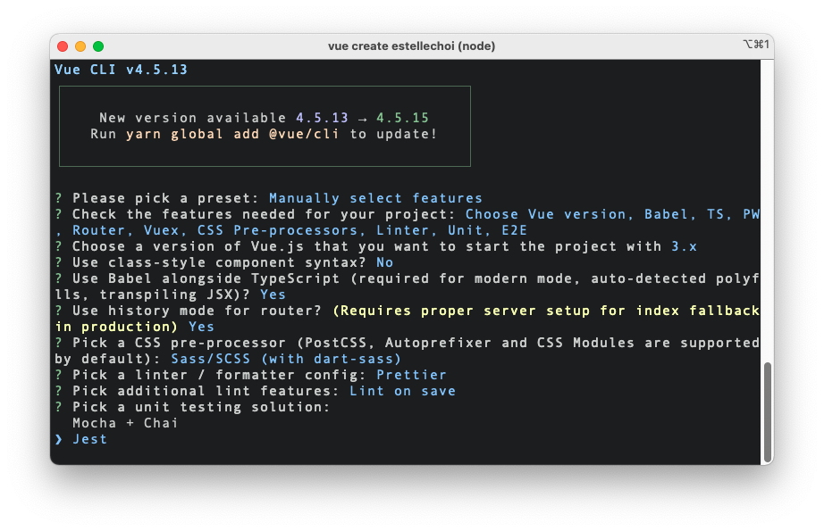

# 프론트엔드에서의 테스트 1: Vue + TypeScript + Jest 단위테스트

> This doc is not done, under research and using-by-myself currently.

<br>

1. 테스트 러너란, 프론트엔드에서의 테스트
2. Jest 소개: Jest, Transformer
3. Jest 설치하기 (VTU 사용하기)
4. Jest 설정하기: `jest.config.js`, Preset
5. 변환이 필요한 써드파티 모듈 알려주기
6. 테스트 커버리지 관리하기: Jest 설정에 명시, 커버리지 리포트

<br>

## 1. 테스트 러너란, 프론트엔드에서의 테스트

### 1-1. 테스트 러너란, 프론트엔드에서의 테스트

[Jest](https://jestjs.io/)와 같은 테스트 도구를 테스트 러너라고 합니다. 개발자가 테스트 코드를 작성할 때 테스트 자체에만 집중할 수 있도록 유용한 메소드들을 제공하고, 테스트 코드를 실행하는데 필요한 환경 셋업을 간단하게 해줍니다.

> Test runners like Jest, mocha, ava let you write test suites as regular JavaScript, and run them as part of your development process. Additionally, test suites are run as part of continuous integration. - React

<br>

### 1-2. 프론트엔드에서의 테스트

프론트엔드에서는 기본적으로 다음 3가지에 대한 테스트가 필요할 겁니다.

- UI: HTML 마크업과 CSS를 사용한 스타일 작업 결과물에 대한 테스트
- 사용자 이벤트 핸들링: 마우스, 키보드, 터치 등 사용자 이벤트 시뮬레이션
- API 통신: API 통신과 동기화에 대한 테스트 (API Mocking 또는 실제 API를 사용)

<br>

UI 테스트와 사용자 이벤트 핸들링에 대한 테스트는 보통 앱의 컴포넌트 단위에서 진행되므로, 컴포넌트에 대한 [단위 테스트](https://martinfowler.com/bliki/UnitTest.html)를 수행합니다. API 통신의 경우 라우트 단위의 단위 테스트를 수행하거나, 실제 API를 사용한 [E2E 테스트](https://martinfowler.com/articles/practical-test-pyramid.html#End-to-endTests)를 수행합니다.

<br>

## 2. Jest 소개: Jest, Transformer

### 2-1. Jest

[Jest](https://jestjs.io/)는 JavaScript로 만든 프로그램의 단위 테스트를 간단하게 해주는 테스트 러너입니다. 프론트엔드 관점에서만 보면, UI 테스트를 위한 [스냅샷 테스트](https://jestjs.io/docs/snapshot-testing) 기능을 제공하고요, Mocking을 통한 API 통신 테스트도 수행할 수 있습니다. Jest가 개발자를 대신하여 해주는 일들은 다양하지만, 단순하게 다음 2가지로 정리해볼 수 있습니다.

- 개발자가 테스트 코드를 간단하게 작성할 수 있도록 유용한 메소드 제공
- 테스트 코드를 Node.js 환경에서 실행

<br>

<br>

Jest는 [jsdom](https://github.com/jsdom/jsdom)이라는 가상 DOM 라이브러리를 사용하는데요, 이는 Jest가 브라우저가 아닌 Node.js를 테스트 코드의 런타임으로 사용하기 때문입니다. Node.js를 사용하면 브라우저보다 빠르긴 하지만, 브라우저가 제공하는 다양한 Web API 사용이 불가능하고 DOM에도 접근할 수 없습니다. Jest는 jsdom을 사용하기 때문에 브라우저를 시뮬레이션할 수 있고 DOM 노드에서 이벤트를 발생시키는 등의 테스트를 실행할 수 있습니다. jsdom은 Node.js 내에서 마치 실제 브라우저인 것처럼 동작하지만 [탐색과 레이아웃](https://github.com/jsdom/jsdom#unimplemented-parts-of-the-web-platform) 기능은 포함되어있지 않으니 참고하세요.

<br>

### 2-2. Transformer

Jest는 테스트 코드를 실행할 때 [Transformer의 도움](https://jestjs.io/docs/code-transformation)을 받습니다. 테스트 코드가 Plain JavaScript로 작성된 모듈만 사용한다면 Node.js에서 실행하는데 문제가 없겠지만, Vue, TypeScript 등이 사용된 모듈이 포함된 테스트 코드는 Node.js가 이해할 수 없기 때문에 Plain JavaScript로 변환하는 작업을 거쳐야합니다. 이 Transformer에 대한 설정은 뒤에서 알아볼 Jest 설정파일인 `jest.config.js`에서 합니다.

<br>

다음은 Vue 컴포넌트에 대한 테스트 코드 예시입니다. 여기에서 테스트 코드 자체도 `*.ts` 파일로 작성되었지만, 일단 테스트 코드 내 `HelloWorld` 모듈의 Transform에 대해서만 다루겠습니다.

```javascript
// example.spec.ts
   
import { shallowMount } from "@vue/test-utils";
import HelloWorld from "@/components/HelloWorld.vue";

describe("HelloWorld.vue", () => {
  it("renders props.msg when passed", () => {
    const msg = "new message";
    const wrapper = shallowMount(HelloWorld, {
      props: { msg },
    });
    expect(wrapper.text()).toMatch(msg);
  });
});
```

<br>

다음은 위의 테스트 코드에서 사용하는 `HelloWorld.vue` 파일입니다. 이 파일은 [`vue-jest`](https://github.com/vuejs/vue-jest)라는 Transformer를 사용하여 `<template>`, `<script>`, `<style>` 구문을 의도에 맞는 Plain JavasCript로 변환해야합니다. `<script>` 영역에 작성된 TypeScript 코드 역시 [`ts-jest`](https://github.com/kulshekhar/ts-jest)라는 Transformer를 사용하여 Plain JavaScript로 변환해야하고요.

```vue
<template>
  <div class="hello">{{ msg }}</div>
</template>

<script lang="ts">
import { defineComponent } from "vue";
export default defineComponent({
  name: "HelloWorld",
  props: {
    msg: String,
  },
});
</script>

<style scoped lang="scss">
div {
  color: #42b983;
}
</style>
```

<br>

## 3. Jest 설치하기

### 3-1. `@vue/cli`로 새 프로젝트 만들기

Vue에서 공식 지원하는 [VTU(Vue 테스트 유틸)](https://vue-test-utils.vuejs.org/guides/#getting-started)을 통해 Jest를 사용할 수 있습니다. VTU는 Vue 컴포넌트에 대한 단위 테스트를 간단하게 해주는 유틸 함수들을 제공하는 라이브러리입니다. [`@vue/cli`](https://cli.vuejs.org/) 3.x 이후 버전을 사용하여 Vue 앱을 새로 생성하는 경우라면, 아래와 같이 앱 생성시 단위 테스트 툴을 선택함으로써 VTU와 추가 라이브러리들을 쉽게 셋업할 수 있습니다. 앱을 생성할 때 `Unit Testing` 도구로 `Jest`를 선택하면 됩니다. [VTU 공식 문서](https://vue-test-utils.vuejs.org/installation/#using-vue-test-utils-with-jest-recommended)에서는 VTU를 Jest와 함께 사용하는 것을 권장니다.

<br>



<br>

앱 생성을 완료하면 `package.json` 파일에 아래와 같이 필요한 스크립트와 디펜던시들이 Preset 됩니다. ([TypeScript](https://www.typescriptlang.org/), [Babel](https://babeljs.io/), Jest 관련 항목이 아닌 것은 생략)

```json
{
	"scripts": {
		"test:unit": "vue-cli-service test:unit"
	},
	"devDependencies": {
		"@types/jest": "^24.0.19",
		"@vue/cli-plugin-babel": "~4.5.0",
		"@vue/cli-plugin-typescript": "~4.5.0",
		"@vue/cli-plugin-unit-jest": "~4.5.0",
		"@vue/test-utils": "^2.0.0-0",
		"typescript": "~4.1.5",
		"vue-jest": "^5.0.0-0"
	}
}
```

<br>

- [`@types/jest`](https://www.npmjs.com/package/@types/jest): TypeScript를 사용하여 테스트 파일을 작성하는 경우 Jest를 사용하기 위해 필요한 Type 정보를 제공 (Optional)

- [`@vue/cli-plugin-babel`](https://cli.vuejs.org/core-plugins/babel.html): Babel7 + [`babel-loader`](https://webpack.js.org/loaders/babel-loader/) + [`@vue/babel-preset-app`](https://github.com/vuejs/vue-cli/tree/dev/packages/%40vue/babel-preset-app)

- [`@vue/cli-plugin-typescript`](https://cli.vuejs.org/core-plugins/typescript.html): TypeScript + [`ts-loader`](https://github.com/TypeStrong/ts-loader) + [`fork-ts-checker-webpack-plugin`](https://github.com/TypeStrong/fork-ts-checker-webpack-plugin)

- [`@vue/cli-plugin-unit-jest`](https://github.com/vuejs/vue-cli/tree/dev/packages/%40vue/cli-plugin-unit-jest): `jest` 실행을 위한 `vue-cli-service test:unit` 커맨드를 제공하는 플러그인, 4.x 이상 버전 사용시 Vue 컴포넌트를 Plain JavaScript로 변환할 때 [TypeScript 변환과 Babel 사용을 위한 Preset](https://github.com/vuejs/vue-cli/tree/dev/packages/%40vue/cli-plugin-unit-jest/presets/typescript-and-babel) 제공
	> 이전 버전을 사용한다면 Babel에서 TypeScript를 컴파일할 수 있도록 [`@babel/preset-typescript`](https://babeljs.io/docs/en/babel-preset-typescript) 플러그인 추가 설치 필요 ([Jest에서 Babel을 통해 TypeScript를 지원합니다](https://jestjs.io/docs/getting-started#using-typescript))

- [`@vue/test-utils`](https://github.com/vuejs/vue-test-utils): Vue 컴포넌트에 대한 단위 테스트를 간편하게 해주는 유틸 함수들을 제공

- [`vue-jest`](https://github.com/vuejs/vue-jest): `.vue` 파일([SFC](https://vuejs.org/v2/guide/single-file-components.html))내 `<template>`,  `<script>`, `<style>` 구문들을 Jest가 동작할 수 있는 JavaScript 파일로 변환

<br>

### 3-2. 기존 프로젝트에 추가하기

기존 Vue 프로젝트에 VTU를 추가하는 경우라면, 아래와 같이 `@vue/cli` 명령어를 사용할 수 있습니다. [이 명령어](https://cli.vuejs.org/core-plugins/unit-jest.html#installing-in-an-already-created-project)는 `vue-cli-service test:unit` 커맨드를 추가하고, `@vue/cli-plugin-unit-jest`를 설치합니다.

```zsh
vue add unit-jest
```

<br>

그리고 패키지매니저를 사용하여 `@vue/test-utils`, `vue-jest`를 설치합니다.

```zsh
yarn add @vue/test-utils --dev
```

<br>

## 4. Jest 설정하기: `jest.config.js`, Preset

### 4-1. `jest.config.js`

Jest 설정파일은 `jest.config.js`입니다. `jest.config.js` 대신 `package.json` 파일의 `jest` 필드를 사용할 수도 있습니다. 다음은 `@vue/cli`로 Babel, TypeScript를 포함하여 앱 생성시 기본으로 세팅되는 `jest.config.js` 파일 내용입니다.

```javascript
// jest.config.js

module.exports = {
  preset: '@vue/cli-plugin-unit-jest/presets/typescript-and-babel',
  transform: {
    '^.+\\.vue$': 'vue-jest', // vue-jest를 사용하여 모든 *.vue 파일을 *.js 파일로 컴파일
  },
};
```

<br>

### 4-2. Preset

`preset` 옵션을 사용하여 외부 설정파일 내용을 불러올 수 있습니다. [Shallow Merge](https://stackoverflow.com/questions/42731453/deep-and-shallow-merge-in-javascript)처럼 이후에 지정하는 옵션들이 덮어쓰기 때문에 주의해야합니다. 위에서 Preset으로 사용된 [`@vue/cli-plugin-unit-jest/presets/typescript-and-babel`](https://github.com/vuejs/vue-cli/blob/dev/packages/%40vue/cli-plugin-unit-jest/presets/typescript-and-babel/jest-preset.js)은 다음 3 개 Preset 합으로 되어있습니다.

- [`presets/default/jest-preset`](https://github.com/vuejs/vue-cli/blob/dev/packages/%40vue/cli-plugin-unit-jest/presets/default/jest-preset.js): Vue 앱을 위한 기본 Preset
- [`presets/typescript/jest-preset`](https://github.com/vuejs/vue-cli/blob/dev/packages/%40vue/cli-plugin-unit-jest/presets/typescript/jest-preset.js): `.ts`/`.tsx` 파일을 테스트하기 전에 `ts-jest`를 사용하여 JavaScript 파일로 변환하도록 설정
- [`presets/typescript-and-babel/jest-preset`](https://github.com/vuejs/vue-cli/blob/dev/packages/%40vue/cli-plugin-unit-jest/presets/typescript-and-babel/jest-preset.js): `ts-jest`에 `babelConfig: true` 설정

<br>

## 5. 변환이 필요한 써드파티 모듈 알려주기

기본적으로 Jest는 `node_modules`에 설치된 디펜던시 모듈에 대해 테스트를 위한 변환 작업을 하지 않습니다. Jest 설정 옵션 중 `transformIgnorePatterns`의 디폴트 값에 `/node_modules/` 경로가 포함되어있기 때문입니다.

```javascript
transformIgnorePatterns: ['/node_modules/']
```

<br>

이는 대부분의 써드파티 모듈이 JavaScript 파일로만 구성되어있기 때문입니다. 게다가 Jest는 브라우저가 아닌 Node.js 환경에서 Run 되는데, `node` 8.x 이상부터 거의 대부분의 모던 ECMAScript 기능들을 지원하고있기 때문에 Babel 또한 필요없기 때문이죠. 다만 아래의 예외 사항에 해당하는 라이브러리가 있다면 테스트를 실행하기 전 Jest가 해당 라이브러리 모듈을 적절하게 변환할 수 있도록 알려주어야합니다!

- ES6 `import`/`export` 모듈 구문을 사용하는 경우, Node.js에서 실행할 수 있도록 `module.exports`로 변환되어야 함
- `.vue` 파일을 사용하는 경우, `vue-jest`를 사용하여 변환되어야 함
- TypeScript를 사용하는 경우 `ts-jest`를 사용하여 변환되어야 함

<br>

만약 테스트 전 변환이 필요한 라이브러리가 있다면, 다음과 같이 `transformIgnorePatterns` 옵션을 수정합니다. 자세한 설명은 [`@vue/cli-plugin-unit-jest` 공식문서](https://cli.vuejs.org/core-plugins/unit-jest.html#transform-dependencies-from-node-modules)에서 확인할 수 있습니다.

```javascript
// jest.config.js

module.exports = {
	// ..
	transformIgnorePatterns: ['/node_modules/(?!name-of-lib-to-transform)']
}
```

<br>

## 6. 테스트 커버리지 관리하기: Jest 설정에 명시, 커버리지 리포트

### 6-1. Jest 설정에 명시

Jest는 테스트 커버리지를 나타내는 지표 보고서도 생성할 수 있습니다. 아래와 같이 `jest.config.js` 파일에 [해당 옵션들](https://jestjs.io/docs/configuration#collectcoverage-boolean)을 지정해주면 됩니다. 아래와 같이 `collectCoverageFrom` 값을 지정해주면, 모든 `*.ts`, `*.vue` 파일에 대해 테스트 커버리지를 수집하되, `node_modules`, `coverage`, `tests` 디렉토리에 존재하는 파일들은 제외한다는 의미입니다.

```javascript
// jest.config.js

module.exports = {
	// ..
	collectCoverage: true,
	collectCoverageFrom: [
		'**/*.{ts,vue}',
		'!**/node_modules/**',
		'!**/coverage/**',
		'!**/tests/**'
	]
}
```

<br>

### 6-2. 커버리지 리포트

이제 테스트를 실행해봅니다.

```zsh
# vue-cli-service test:unit
yarn test:unit
```

<br>

다음과 같은 보고서가 출력되고요, 보고서의 각 항목은 다음을 의미합니다.

- `Stmts`: 최소 한 번 이상 실행된 명령문(변수에 값 저장, 함수 호출 등) 코드의 비율
- `Branch`: 최소 한 번 이상 if, switch와 같은 분기 조건이 충족된 비율
- `Funcs`: 최소 한 번 이상 호출된 함수의 비율
- `Lines`: 최소 한 번 이상 실행된 코드 라인의 비율
- `Uncovered Line`: 코드 커버리지에 측정되지 않은 코드 라인 수


<br>

붉은색으로 표시된 파일들은 대응하는 테스트 파일이 없는 파일들입니다. [VTU의 Jest Preset](https://github.com/vuejs/vue-cli/blob/dev/packages/%40vue/cli-plugin-unit-jest/presets/default/jest-preset.js)에 따라, Jest는 디폴트로 다음 경로에 해당하는 테스트 파일을 실행합니다. 앱 생성시 자동 포함된 샘플 테스트 파일인 `tests/unit/example.spec.ts`에서 `HelloWorld.vue` 컴포넌트에 대한 테스트를 포함하고 있기 때문에 `HelloWorld.vue` 파일에 대한 커버리지만 `100`인 것을 확인할 수 있습니다.

```javascript
module.exports = {
	// ..
	testMatch: [
		'**/tests/unit/**/*.spec.[jt]s?(x)',
		'**/__tests__/*.[jt]s?(x)'
	]
}
```

<br>

---

### References

- [The Practical Test Pyramid - Ham Vocke](https://martinfowler.com/articles/practical-test-pyramid.html)
- [UnitTest - Martin Fowler](https://martinfowler.com/bliki/UnitTest.html)
- [TestDouble - Martin Fowler](https://martinfowler.com/bliki/TestDouble.html)
- [Mocks Aren't Stubs - Martin Fowler](https://martinfowler.com/articles/mocksArentStubs.html)
- [SelfTestingCode - Martin Fowler](https://martinfowler.com/bliki/SelfTestingCode.html)
- [TestDrivenDevelopment - Martin Fowler](https://martinfowler.com/bliki/TestDrivenDevelopment.html)
- [The Art of Agile Development: Test-Driven Development | James Shore's Art of Agile Development](http://www.jamesshore.com/v2/books/aoad1/test_driven_development)
- [IntegrationTest - Martin Fowler](https://martinfowler.com/bliki/IntegrationTest.html)
- [BroadStackTest - Martin Fowler](https://martinfowler.com/bliki/BroadStackTest.html)
- [ExtremeProgramming - Martin Fowler](https://martinfowler.com/bliki/ExtremeProgramming.html)
- [Using TypeScript | Jest](https://jestjs.io/docs/getting-started#using-typescript)
- [Using Vue Test Utils with Jest (recommended) | Vue Test Utils](https://vue-test-utils.vuejs.org/installation/#using-vue-test-utils-with-jest-recommended)
- [Unit Testing with Jest | Cracking Vue.js](https://joshua1988.github.io/vue-camp/testing/jest-testing.html#jest-%E1%84%89%E1%85%A9%E1%84%80%E1%85%A2)
- [Vue Test Utils | Cracking Vue.js](https://joshua1988.github.io/vue-camp/testing/vue-test-util.html#%E1%84%8E%E1%85%AC%E1%84%89%E1%85%B5%E1%86%AB-vue-cli-3-x-%E1%84%87%E1%85%A5%E1%84%8C%E1%85%A5%E1%86%AB-%E1%84%8B%E1%85%B5%E1%84%89%E1%85%A1%E1%86%BC-%E1%84%8B%E1%85%A6%E1%84%89%E1%85%A5-%E1%84%89%E1%85%A5%E1%86%AF%E1%84%8E%E1%85%B5-%E1%84%87%E1%85%A1%E1%86%BC%E1%84%87%E1%85%A5%E1%86%B8)
- [Testing Environments | React](https://reactjs.org/docs/testing-environments.html)
- [모던 프론트엔드 테스트 전략 — 1편(Testing Overview) | 콴다 팀블로그](https://blog.mathpresso.com/%EB%AA%A8%EB%8D%98-%ED%94%84%EB%A1%A0%ED%8A%B8%EC%97%94%EB%93%9C-%ED%85%8C%EC%8A%A4%ED%8A%B8-%EC%A0%84%EB%9E%B5-1%ED%8E%B8-841e87a613b2)
- [테스트 | TOAST UI](https://ui.toast.com/fe-guide/ko_TEST)
