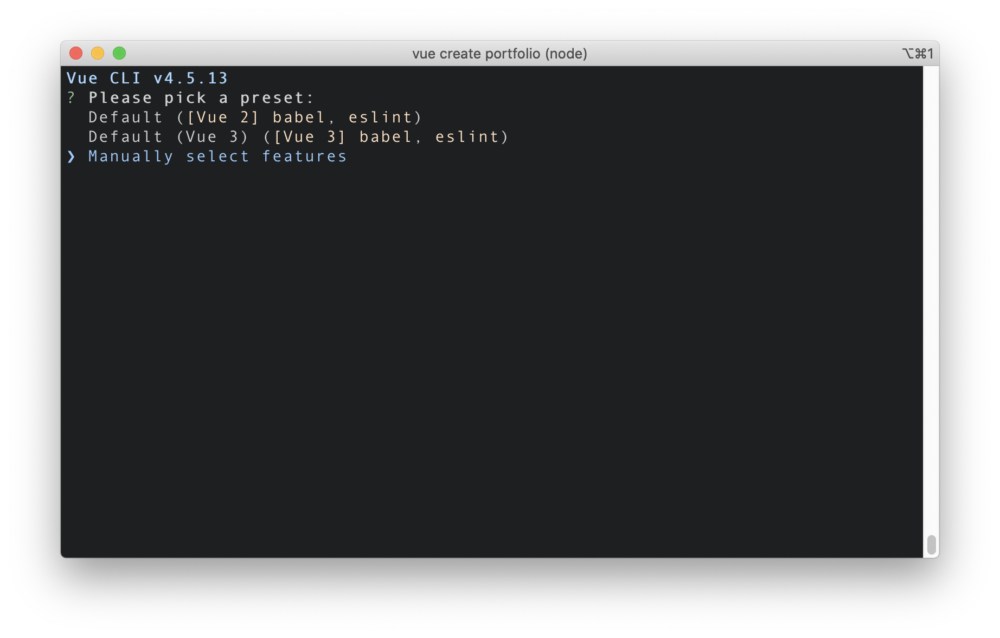
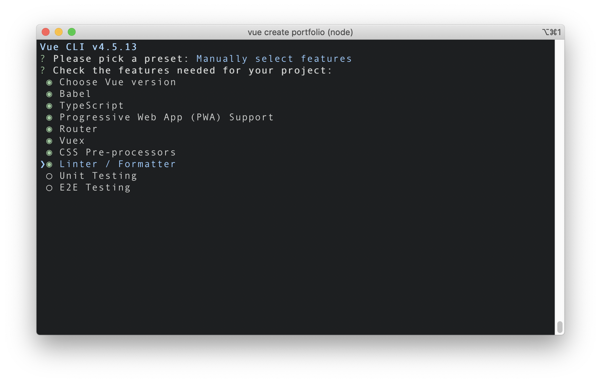
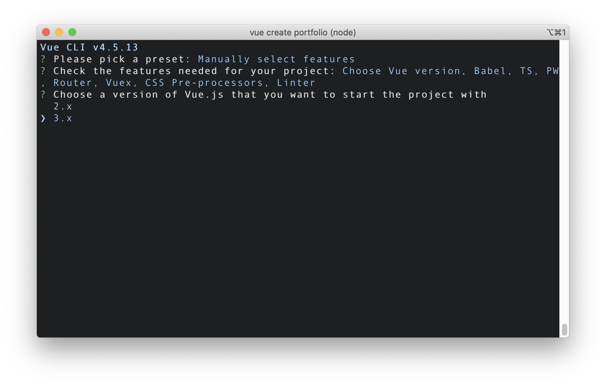
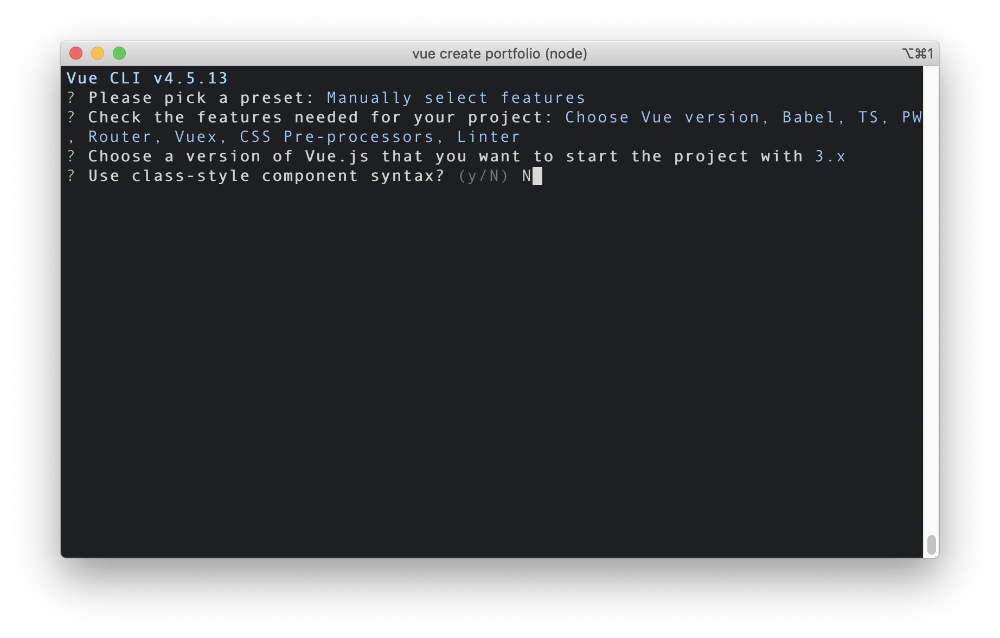
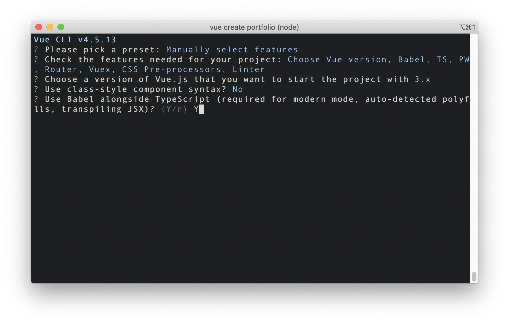
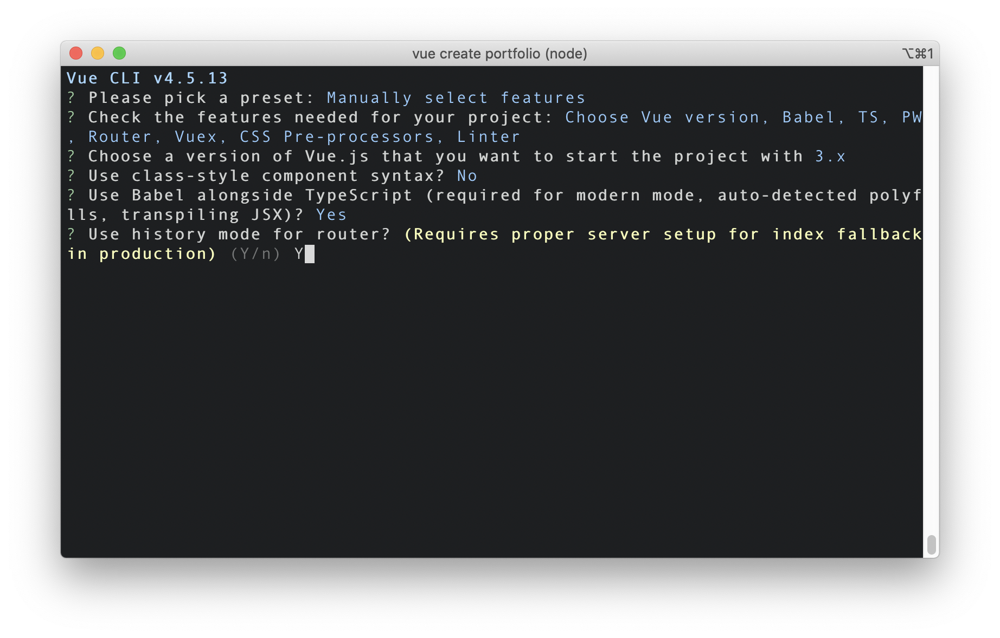
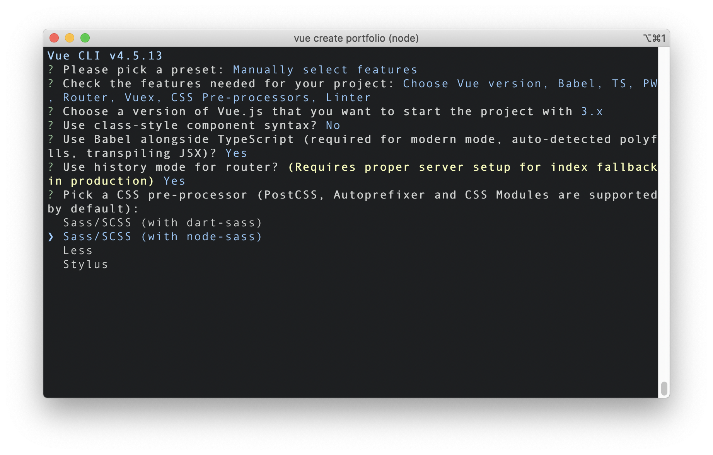
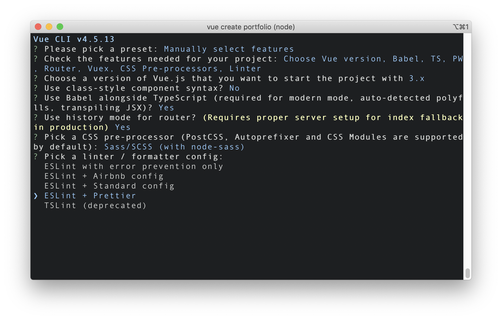
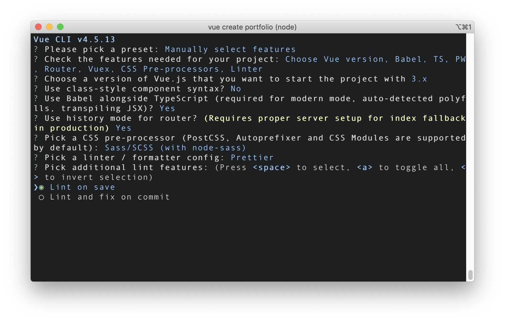
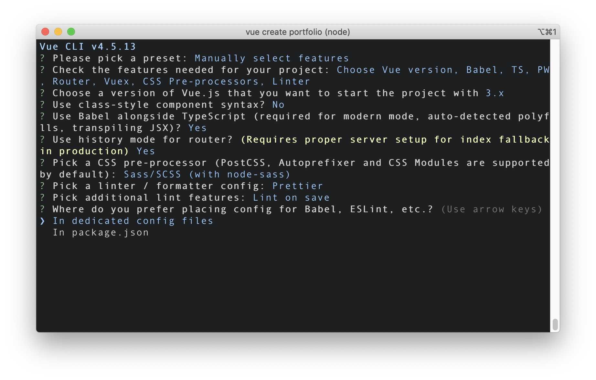

# Vue3 + TypeScript 프로젝트 셋업하기

<br>

## 1. `@vue/cli` 버전 업데이트

기존에 전역 설치된 `@vue/cli`가 있다면, 아래 명령어를 사용하여 최신 버전으로 업데이트합니다.

```
# npm
npm update -g @vue/cli

# yarn
yarn global upgrade --latest @vue/cli
```

<br>

버전 업데이트가 정상적으로 실행되었는지 확인하기 위해 아래 명령어를 사용하여 버전을 확인합니다.

```
vue --version
```

<br>

만약 버전 업데이트가 되지 않았다면 기존에 설치된 `@vue/cli`를 삭제한 후 다시 설치하는 방법이 있습니다. 아래와 같이 패키지매니저 명령어를 사용하여 삭제하시거나,

```
# npm
npm uninstall -g @vue/cli

# yarn
yarn global remove @vue/cli
```

<br>

위 방법도 정상 작동하지 않는다면, 전역 설치된 `@vue/cli`가 위치한 아래의 경로로 이동합니다. (MacOS 기준)

```
# npm
cd /usr/local/lib/node_modules

# yarn
cd ~/.config/yarn/global/node_modules
```

<br>

그다음 `ls` 명령어를 사용하여 `@vue` 폴더가 조회되는지 확인하신 후, 아래 명령어를 사용하여 기존에 설치되어있던 `@vue` 라이브러리 폴더를 삭제합니다.

```
rm -rf @vue
```

<br>

그리고 재설치.

```
#npm
npm install -g @vue/cli

# yarn
yarn global add @vue/cli
```

<br>

## 2. Vue3 프로젝트 생성

이제 `@vue/cli`를 사용하여 Vue 프로젝트를 생성합니다.

```
vue create project-name
```

<br>

프로젝트 셋업 시작. 아래는 제가 셋업하면서 선택한 옵션들입니다.



<br>

아래 단계에서 `TypeScript`를 포함하고요,



<br>

아래 질문에 `3.x`를 선택하여 Vue3 프로젝트를 생성해주세요.







<br>

다음 단계에서 [`ESLint`](https://eslint.org/)를 선택합니다. [`TSLint`](https://www.npmjs.com/package/tslint)는 Deprecation을 공식 선언했습니다.





<br>

---

### References
